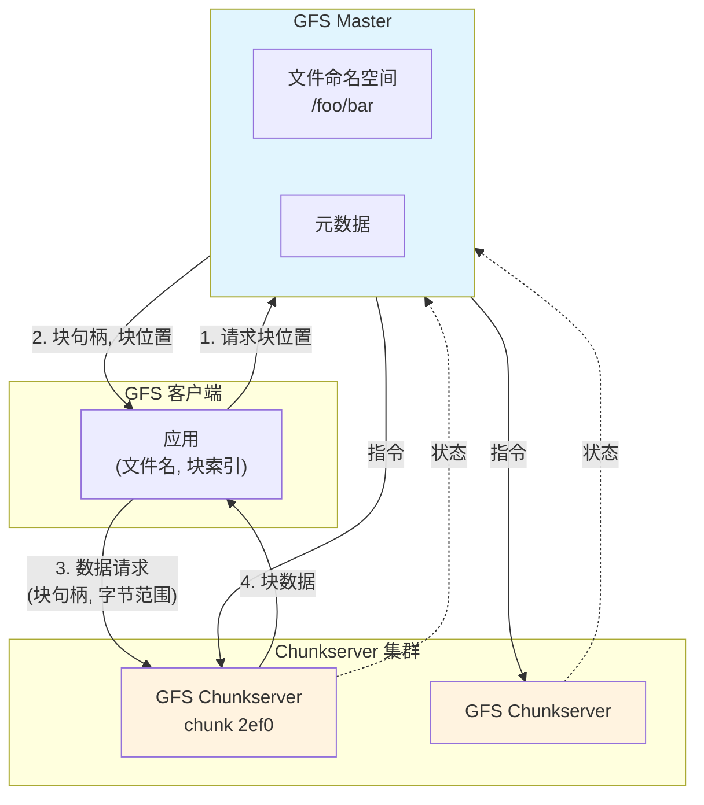
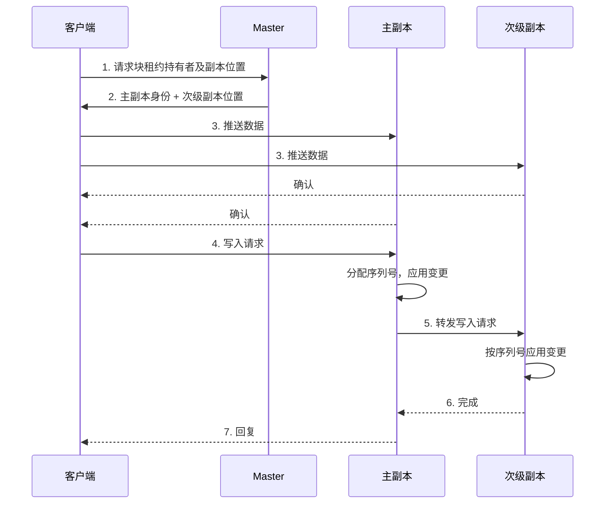

# Google 文件系统（GFS）

**作者**：Sanjay Ghemawat, Howard Gobioff, Shun-Tak Leung  
**年份**：2003  
**会议**：SOSP '03（第 19 届 ACM 操作系统原理研讨会）

---

## 摘要

我们设计并实现了 Google 文件系统（Google File System，GFS），一个面向大规模分布式数据密集型应用的可扩展分布式文件系统。它在廉价的商用硬件上运行，提供容错能力，并为大量客户端提供高聚合性能。

尽管与以往的分布式文件系统共享许多相同目标，我们的设计受到应用负载和技术环境（包括当前与预期）关键观察的驱动，这些观察与早期文件系统的一些假设存在显著偏离。这促使我们重新审视传统选择，探索设计空间中截然不同的设计点。

该文件系统已成功满足我们的存储需求。它在 Google 内部广泛部署，作为服务所用数据生成与处理的存储平台，以及需要大规模数据集的研究与开发工作的存储平台。迄今为止最大的集群在超过一千台机器上的数千块磁盘上提供数百 TB 的存储，并被数百个客户端并发访问。

本文介绍了为支持分布式应用而设计的文件系统接口扩展，讨论了设计的诸多方面，并报告了微基准测试和实际使用中的测量结果。

---

## 1 引言

我们设计并实现了 Google 文件系统（GFS），以满足 Google 数据处理需求的快速增长。GFS 与以往的分布式文件系统共享许多相同目标，如性能、可扩展性、可靠性和可用性。然而，其设计受到应用负载和技术环境（包括当前与预期）关键观察的驱动，这些观察与早期文件系统设计假设存在显著偏离。我们重新审视了传统选择，探索了设计空间中截然不同的设计点。

首先，**组件故障是常态而非例外**。文件系统由数百甚至数千台由廉价商用部件构成的存储机器组成，并被数量相当的客户端机器访问。组件的数量和质量几乎保证了在任何给定时刻都有一些组件无法正常工作，其中一些将无法从当前故障中恢复。我们遇到过由应用 bug、操作系统 bug、人为错误以及磁盘、内存、连接器、网络和电源故障引起的问题。因此，持续监控、错误检测、容错和自动恢复必须是系统的内在组成部分。

其次，**按传统标准衡量，文件非常大**。多 GB 的文件很常见。每个文件通常包含许多应用对象，如 Web 文档。当我们经常处理由数十亿对象组成的快速增长的数 TB 数据集时，即使文件系统能够支持，管理数十亿个约 KB 大小的文件也极为不便。因此，必须重新审视 I/O 操作和块大小等设计假设和参数。

第三，**大多数文件通过追加新数据而非覆盖现有数据来修改**。文件内的随机写入实际上不存在。一旦写入，文件只被读取，且通常是顺序读取。多种数据具有这些特征。有些可能是数据分析程序扫描的大型仓库。有些可能是运行应用持续生成的数据流。有些可能是归档数据。有些可能是在一台机器上产生、在另一台机器上处理（同时或稍后）的中间结果。鉴于对超大文件的这种访问模式，追加成为性能优化和原子性保证的焦点，而客户端缓存数据块则失去吸引力。

第四，**将应用与文件系统 API 协同设计**通过增加灵活性使整体系统受益。例如，我们放宽了 GFS 的一致性模型，从而大大简化了文件系统，而不会给应用施加繁重负担。我们还引入了原子追加操作，使多个客户端可以并发地向同一文件追加，而无需它们之间的额外同步。这些将在后文详细讨论。

多个 GFS 集群目前为不同目的而部署。最大的集群拥有超过 1000 个存储节点、超过 300 TB 的磁盘存储，并被来自不同机器的数百个客户端持续大量访问。

---

## 2 设计概述

### 2.1 假设

在设计满足我们需求的文件系统时，我们遵循了既带来挑战又带来机遇的假设。我们之前提到了一些关键观察，现在更详细地阐述我们的假设。

::: tip 设计假设
- **系统由许多廉价的商用组件构建，这些组件经常故障**。系统必须持续监控自身，并在日常基础上检测、容忍和迅速从组件故障中恢复。
- **系统存储数量适中的大型文件**。我们预期有几百万个文件，每个通常 100 MB 或更大。多 GB 文件是常见情况，应高效管理。必须支持小文件，但我们无需为其优化。
- **工作负载主要由两种读取组成**：大流式读取和小随机读取。在大流式读取中，单次操作通常读取数百 KB，更常见的是 1 MB 或更多。同一客户端的连续操作通常读取文件的连续区域。小随机读取通常在任意偏移处读取几 KB。注重性能的应用通常对小读取进行批处理和排序，以稳步推进文件而非来回跳转。
- **工作负载还有许多大顺序写入**，将数据追加到文件。典型操作大小与读取类似。一旦写入，文件很少再次修改。支持在文件任意位置的小写入，但不必高效。
- **系统必须高效实现多客户端并发追加到同一文件的明确定义语义**。我们的文件常被用作生产者-消费者队列或用于多路合并。数百个生产者（每台机器运行一个）将并发地向文件追加。具有最小同步开销的原子性是必不可少的。文件可能稍后被读取，或消费者可能同时正在读取文件。
- **高持续带宽比低延迟更重要**。我们的大多数目标应用重视以高速率批量处理数据，而很少有对单次读写有严格响应时间要求的。
:::

### 2.2 接口

GFS 提供熟悉的文件系统接口，但不实现 POSIX 等标准 API。文件按路径名在目录中分层组织。我们支持创建、删除、打开、关闭、读取和写入文件的常规操作。

此外，GFS 具有快照（snapshot）和记录追加（record append）操作。快照以低成本创建文件或目录树的副本。记录追加允许多个客户端并发地向同一文件追加数据，同时保证每个客户端追加的原子性。它可用于实现多路合并结果和生产者-消费者队列，许多客户端可以同时追加而无需额外加锁。我们发现这些类型的文件在构建大型分布式应用时非常宝贵。快照和记录追加分别在 3.4 节和 3.3 节进一步讨论。

### 2.3 架构

GFS 集群由单个 master 和多个 chunkserver 组成，被多个客户端访问，如图 1 所示。其中每个通常是运行用户级服务进程的商用 Linux 机器。只要机器资源允许且运行可能不稳定的应用代码导致的较低可靠性可接受，在同一台机器上同时运行 chunkserver 和客户端很容易。

文件被划分为固定大小的块（chunk）。每个块由 master 在块创建时分配的不可变且全局唯一的 64 位块句柄（chunk handle）标识。Chunkserver 将块作为 Linux 文件存储在本地磁盘上，并根据块句柄和字节范围读取或写入块数据。为实现可靠性，每个块在多个 chunkserver 上复制。默认情况下，我们存储三个副本，尽管用户可以为文件命名空间的不同区域指定不同的复制级别。

Master 维护所有文件系统元数据。这包括命名空间、访问控制信息、从文件到块的映射以及块的当前位置。它还控制系统范围内的活动，如块租约（lease）管理、孤立块的垃圾回收以及 chunkserver 之间的块迁移。Master 通过 HeartBeat 消息定期与每个 chunkserver 通信，向其发出指令并收集其状态。

链接到每个应用的 GFS 客户端代码实现文件系统 API，并与 master 和 chunkserver 通信以代表应用读写数据。客户端与 master 交互进行元数据操作，但所有承载数据的通信直接与 chunkserver 进行。我们不提供 POSIX API，因此无需挂接到 Linux vnode 层。

客户端和 chunkserver 都不缓存文件数据。客户端缓存几乎没有好处，因为大多数应用流式处理超大文件或工作集太大无法缓存。不缓存简化了客户端和整体系统，消除了缓存一致性问题。（然而，客户端确实缓存元数据。）Chunkserver 无需缓存文件数据，因为块作为本地文件存储，因此 Linux 的缓冲区缓存已将频繁访问的数据保留在内存中。



**图 1：GFS 架构**

### 2.4 单 Master

采用单个 master 大大简化了我们的设计，并使 master 能够利用全局知识做出复杂的块放置和复制决策。然而，我们必须最小化其在读写中的参与，以免成为瓶颈。客户端从不通过 master 读写文件数据。相反，客户端向 master 询问应联系哪些 chunkserver。它在一段时间内缓存此信息，并在许多后续操作中直接与 chunkserver 交互。

让我们参考图 1 解释简单读取的交互。首先，使用固定块大小，客户端将应用指定的文件名和字节偏移转换为文件内的块索引。然后，它向 master 发送包含文件名和块索引的请求。Master 回复相应的块句柄和副本位置。客户端使用文件名和块索引作为键缓存此信息。

客户端然后向其中一个副本（最可能是最近的）发送请求。请求指定块句柄和该块内的字节范围。对同一块的进一步读取不需要更多的客户端-master 交互，直到缓存信息过期或文件被重新打开。事实上，客户端通常在同一请求中请求多个块，master 也可以包含紧接在请求块之后的块的信息。这些额外信息以几乎零额外成本规避了若干未来的客户端-master 交互。

### 2.5 块大小

块大小是关键设计参数之一。我们选择了 64 MB，比典型文件系统块大小大得多。每个块副本作为 chunkserver 上的普通 Linux 文件存储，仅在需要时扩展。惰性空间分配避免了因内部碎片而浪费空间，这可能是反对如此大块大小的最大理由。

大块大小带来几个重要优势。首先，它减少了客户端与 master 交互的需要，因为对同一块的读写只需要一次向 master 请求块位置信息的初始请求。对于我们以顺序读写大文件为主的工作负载，这种减少尤其显著。即使对于小随机读取，客户端也可以轻松缓存多 TB 工作集的所有块位置信息。其次，由于在大型块上，客户端更可能对给定块执行多次操作，它可以通过在较长时间内保持与 chunkserver 的持久 TCP 连接来减少网络开销。第三，它减少了 master 上存储的元数据大小。这使我们能够将元数据保留在内存中，进而带来我们将在 2.6.1 节讨论的其他优势。

另一方面，即使有惰性空间分配，大块大小也有其缺点。小文件由少量块组成，可能只有一个。如果许多客户端访问同一文件，存储这些块的 chunkserver 可能成为热点。在实践中，热点尚未成为主要问题，因为我们的应用大多顺序读取大型多块文件。

然而，当 GFS 首次被批处理队列系统使用时，确实出现了热点：可执行文件作为单块文件写入 GFS，然后在数百台机器上同时启动。存储此可执行文件的少数 chunkserver 被数百个同时请求过载。我们通过以更高复制因子存储此类可执行文件，并让批处理队列系统错开应用启动时间来解决此问题。一个潜在的长期解决方案是允许客户端在此类情况下从其他客户端读取数据。

### 2.6 元数据

Master 存储三种主要类型的元数据：文件和块命名空间、从文件到块的映射以及每个块副本的位置。所有元数据保存在 master 的内存中。前两种类型（命名空间和文件到块映射）也通过将变更记录到存储在 master 本地磁盘并复制到远程机器的操作日志（operation log）而持久保存。使用日志使我们能够简单、可靠地更新 master 状态，且不会在 master 崩溃时冒不一致的风险。Master 不持久存储块位置信息。相反，它在 master 启动时以及每当 chunkserver 加入集群时向每个 chunkserver 询问其块。

#### 2.6.1 内存数据结构

由于元数据存储在内存中，master 操作很快。此外，master 在后台定期扫描其整个状态既容易又高效。这种定期扫描用于实现块垃圾回收、在 chunkserver 故障存在时的重新复制以及块迁移以平衡 chunkserver 间的负载和磁盘空间使用。4.3 和 4.4 节将进一步讨论这些活动。

这种仅内存方法的一个潜在担忧是，块的数量以及整个系统的容量受 master 内存量的限制。在实践中这不是严重限制。Master 为每个 64 MB 块维护少于 64 字节的元数据。大多数块是满的，因为大多数文件包含许多块，只有最后一个可能部分填充。同样，文件命名空间数据通常每个文件需要少于 64 字节，因为它使用前缀压缩紧凑存储文件名。

如有必要支持更大的文件系统，向 master 添加额外内存的成本是为我们通过将元数据存储在内存中获得的设计简单性、可靠性、性能和灵活性付出的较小代价。

#### 2.6.2 块位置

Master 不持久记录哪些 chunkserver 拥有给定块的副本。它只是在启动时轮询 chunkserver 获取该信息。Master 此后可以保持最新，因为它控制所有块放置并通过定期 HeartBeat 消息监控 chunkserver 状态。

我们最初尝试在 master 上持久保持块位置信息，但我们决定在启动时以及此后定期从 chunkserver 请求数据要简单得多。这消除了在 chunkserver 加入和离开集群、更改名称、故障、重启等时保持 master 和 chunkserver 同步的问题。在拥有数百台服务器的集群中，这些事件经常发生。

理解此设计决策的另一种方式是认识到 chunkserver 对其磁盘上拥有或不拥有哪些块有最终决定权。在 master 上尝试维护此信息的一致视图没有意义，因为 chunkserver 上的错误可能导致块自发消失（例如，磁盘可能损坏并被禁用）或操作员可能重命名 chunkserver。

#### 2.6.3 操作日志

操作日志包含关键元数据变更的历史记录。它是 GFS 的核心。它不仅是元数据的唯一持久记录，还作为定义并发操作顺序的逻辑时间线。文件和块及其版本（见 4.5 节）都由其创建时的逻辑时间唯一且永久地标识。

由于操作日志至关重要，我们必须可靠地存储它，并且在元数据变更持久化之前不向客户端展示变更。否则，即使块本身幸存，我们实际上也会丢失整个文件系统或最近的客户端操作。因此，我们将其复制到多台远程机器上，并且仅在将相应的日志记录刷新到本地和远程磁盘后才响应客户端操作。Master 在刷新之前将多条日志记录批处理在一起，从而减少刷新和复制对整体系统吞吐量的影响。

Master 通过重放操作日志恢复其文件系统状态。为最小化启动时间，我们必须保持日志较小。每当日志增长超过一定大小时，master 对其状态进行检查点（checkpoint），以便它可以通过从本地磁盘加载最新检查点并仅重放之后的有限数量的日志记录来恢复。检查点采用紧凑的类 B 树形式，可以直接映射到内存并用于命名空间查找而无需额外解析。这进一步加快了恢复并提高了可用性。

由于构建检查点可能需要一段时间，master 的内部状态以这样一种方式组织，即可以在不延迟传入变更的情况下创建新检查点。Master 切换到新日志文件并在单独线程中创建新检查点。新检查点包括切换前的所有变更。对于拥有几百万个文件的集群，它可以在大约一分钟内创建。完成后，它被写入本地和远程磁盘。

恢复只需要最新的完整检查点和后续日志文件。较旧的检查点和日志文件可以自由删除，尽管我们保留几个以防灾难。检查点期间的故障不影响正确性，因为恢复代码会检测并跳过不完整的检查点。

### 2.7 一致性模型

GFS 具有宽松的一致性模型，很好地支持我们的高度分布式应用，同时保持相对简单和高效实现。我们现在讨论 GFS 的保证及其对应用的意义。我们还强调 GFS 如何维护这些保证，但将细节留给本文其他部分。

#### 2.7.1 GFS 的保证

文件命名空间变更（例如，文件创建）是原子的。它们由 master 独占处理：命名空间加锁保证原子性和正确性（4.1 节）；master 的操作日志定义这些操作的全局全序（2.6.3 节）。

数据变更后文件区域的状态取决于变更类型、是否成功或失败以及是否存在并发变更。表 1 总结了结果。如果所有客户端无论从哪个副本读取都会始终看到相同数据，则文件区域是一致的（consistent）。如果文件区域是一致的且客户端将完整看到变更写入的内容，则文件区域是已定义的（defined）。当变更在没有并发写入者干扰的情况下成功时，受影响区域是已定义的（因此也是一致的）：所有客户端将始终看到变更已写入的内容。并发成功的变更使区域未定义但一致：所有客户端看到相同数据，但它可能不反映任何单个变更已写入的内容。通常，它由来自多个变更的混合片段组成。失败的变更使区域不一致（因此也未定义）：不同客户端可能在不同时间看到不同数据。我们在下面描述我们的应用如何区分已定义区域和未定义区域。应用无需进一步区分不同类型的未定义区域。

数据变更可以是写入或记录追加。写入导致数据在应用指定的文件偏移处写入。记录追加导致数据（「记录」）在存在并发变更的情况下至少原子地追加一次，但在 GFS 选择的偏移处（3.3 节）。（相比之下，「常规」追加只是在客户端认为的当前文件末尾偏移处的写入。）偏移返回给客户端并标记包含记录的已定义区域的开始。此外，GFS 可能在中间插入填充或记录重复。它们占据被认为不一致的区域，通常被用户数据量所掩盖。

在一系列成功的变更之后，变更的文件区域保证是已定义的并包含最后一次变更写入的数据。GFS 通过 (a) 在所有副本上以相同顺序对块应用变更（3.1 节），以及 (b) 使用块版本号检测因 chunkserver 宕机时错过变更而变得陈旧的任何副本（4.5 节）来实现这一点。陈旧副本永远不会参与变更或提供给向 master 请求块位置的客户端。它们会在最早机会被垃圾回收。

由于客户端缓存块位置，它们可能在信息刷新之前从陈旧副本读取。此窗口受缓存条目的超时和文件的下次打开限制，这会从缓存中清除该文件的所有块信息。此外，由于我们的大多数文件是仅追加的，陈旧副本通常返回块的过早结尾而非过时数据。当读取者重试并联系 master 时，它将立即获得当前块位置。

在成功变更很久之后，组件故障当然仍可能损坏或破坏数据。GFS 通过 master 与所有 chunkserver 之间的定期握手识别故障 chunkserver，并通过校验和（checksumming）检测数据损坏（5.2 节）。一旦问题浮现，数据会尽快从有效副本恢复（4.3 节）。仅当块的所有副本在 GFS 能够反应之前（通常在几分钟内）全部丢失时，块才会不可逆地丢失。即使在这种情况下，它变得不可用而非损坏：应用收到明确的错误而非损坏的数据。

#### 2.7.2 对应用的影响

GFS 应用可以通过一些已经出于其他目的需要的简单技术来适应宽松的一致性模型：依赖追加而非覆盖、检查点以及编写自验证、自标识的记录。

实际上我们所有的应用都通过追加而非覆盖来修改文件。在一个典型用途中，写入者从头到尾生成文件。它在写入所有数据后原子地将文件重命名为永久名称，或定期检查点已成功写入的量。检查点也可能包括应用级校验和。读取者验证并仅处理到最后一个检查点的文件区域，该区域已知处于已定义状态。无论一致性和并发问题如何，这种方法对我们都很有效。追加比随机写入更高效、对应用故障更具弹性。检查点允许写入者增量重启，并防止读取者处理从应用角度看仍不完整的已成功写入的文件数据。

在另一个典型用途中，许多写入者并发地向文件追加以进行合并结果或作为生产者-消费者队列。记录追加的至少一次追加语义保留了每个写入者的输出。读取者按如下方式处理偶尔的填充和重复。写入者准备的每条记录包含校验和等额外信息，以便可以验证其有效性。读取者可以使用校验和识别并丢弃额外填充和记录片段。如果它不能容忍偶尔的重复（例如，如果它们会触发非幂等操作），它可以使用记录中的唯一标识符过滤它们，这些标识符通常无论如何都需要用于命名相应的应用实体（如 Web 文档）。这些记录 I/O 功能（除重复删除外）在我们应用共享的库代码中，适用于 Google 的其他文件接口实现。有了这些，相同的记录序列加上罕见的重复总是被传递给记录读取者。

| 变更类型 | 串行成功 | 并发成功 | 失败 |
|---------|---------|---------|------|
| 写入 | 已定义 | 一致但未定义 | 不一致 |
| 记录追加 | 已定义 | 不一致（夹杂成功） | 不一致 |

**表 1：变更后的文件区域状态**

---

## 3 系统交互

我们设计系统以最小化 master 在所有操作中的参与。在此背景下，我们现在描述客户端、master 和 chunkserver 如何交互以实现数据变更、原子记录追加和快照。

### 3.1 租约与变更顺序

变更（mutation）是改变块内容或元数据的操作，如写入或追加操作。每个变更在块的所有副本上执行。我们使用租约（lease）在副本之间维护一致的变更顺序。Master 将块租约授予其中一个副本，我们称其为主副本（primary）。主副本为块的所有变更选择串行顺序。所有副本在应用变更时遵循此顺序。因此，全局变更顺序首先由 master 选择的租约授予顺序定义，在租约内由主副本分配的序列号定义。

租约机制旨在最小化 master 的管理开销。租约的初始超时为 60 秒。然而，只要块正在被变更，主副本可以请求并通常从 master 无限期获得延期。这些延期请求和授予搭载在 master 与所有 chunkserver 定期交换的 HeartBeat 消息上。Master 有时可能尝试在租约过期之前撤销它（例如，当 master 想要禁用正在重命名的文件的变更时）。即使 master 与主副本失去通信，它也可以在旧租约过期后安全地将新租约授予另一个副本。

在图 2 中，我们通过遵循写入的控制流来说明此过程，步骤如下。



**图 2：写入控制与数据流**

1. 客户端询问 master 哪个 chunkserver 持有块的当前租约以及其他副本的位置。如果没有人有租约，master 授予它选择的一个副本（未显示）。
2. Master 回复主副本的身份和其他（次级）副本的位置。客户端缓存此数据以供将来变更。它仅在主副本变得不可达或回复它不再持有租约时才需要再次联系 master。
3. 客户端将数据推送到所有副本。客户端可以按任意顺序执行。每个 chunkserver 将数据存储在内部 LRU 缓冲区缓存中，直到数据被使用或老化。通过将数据流与控制流解耦，我们可以根据网络拓扑调度昂贵的数据流来提高性能，而不管哪个 chunkserver 是主副本。3.2 节进一步讨论这一点。
4. 一旦所有副本确认收到数据，客户端向主副本发送写入请求。请求标识之前推送到所有副本的数据。主副本为其收到的所有变更（可能来自多个客户端）分配连续序列号，这提供了必要的串行化。它按序列号顺序将变更应用到自己的本地状态。
5. 主副本将写入请求转发给所有次级副本。每个次级副本按主副本分配的相同序列号顺序应用变更。
6. 次级副本都向主副本回复表示已完成操作。
7. 主副本向客户端回复。在任何副本遇到的任何错误都报告给客户端。如有错误，写入可能已在主副本和次级副本的任意子集上成功。（如果它在主副本上失败，它不会被分配序列号并转发。）客户端请求被视为失败，修改的区域处于不一致状态。我们的客户端代码通过重试失败的变更来处理此类错误。它将在回退到从写入开始重试之前，在步骤 (3) 到 (7) 进行几次尝试。

如果应用的写入很大或跨越块边界，GFS 客户端代码会将其分解为多个写入操作。它们都遵循上述控制流，但可能与其他客户端的并发操作交错并被覆盖。因此，共享文件区域可能最终包含来自不同客户端的片段，尽管副本将相同，因为单个操作在所有副本上以相同顺序成功完成。如 2.7 节所述，这使文件区域处于一致但未定义状态。

### 3.2 数据流

我们将数据流与控制流解耦以高效利用网络。虽然控制从客户端流向主副本然后流向所有次级副本，但数据沿精心选择的 chunkserver 链以流水线方式线性推送。我们的目标是充分利用每台机器的网络带宽、避免网络瓶颈和高延迟链路，并最小化推送所有数据的延迟。

为充分利用每台机器的网络带宽，数据沿 chunkserver 链线性推送，而非以其他拓扑（例如树）分布。因此，每台机器的全部出站带宽用于尽可能快地传输数据，而非在多个接收者之间分配。

为尽可能避免网络瓶颈和高延迟链路（例如，交换机间链路通常两者兼有），每台机器将数据转发给网络拓扑中尚未收到数据的「最近」机器。假设客户端正在将数据推送到 chunkserver S1 到 S4。它将数据发送给最近的 chunkserver，比如 S1。S1 将其转发给 S1 到 S4 中离 S1 最近的 chunkserver，比如 S2。类似地，S2 将其转发给 S3 或 S4 中离 S2 更近的那个，依此类推。我们的网络拓扑足够简单，可以从 IP 地址准确估计「距离」。

最后，我们通过通过 TCP 连接流水线传输数据来最小化延迟。一旦 chunkserver 收到一些数据，它立即开始转发。流水线对我们特别有帮助，因为我们使用具有全双工链路的交换网络。立即发送数据不会降低接收速率。在没有网络拥塞的情况下，将 B 字节传输到 R 个副本的理想经过时间是 B/T + RL，其中 T 是网络吞吐量，L 是两台机器之间传输字节的延迟。我们的网络链路通常是 100 Mbps（T），L 远低于 1 ms。因此，1 MB 理想上可以在约 80 ms 内分发。

### 3.3 原子记录追加

GFS 提供称为记录追加（record append）的原子追加操作。在传统写入中，客户端指定要写入数据的偏移。对同一区域的并发写入不可串行化：区域可能最终包含来自多个客户端的数据片段。然而，在记录追加中，客户端仅指定数据。GFS 在 GFS 选择的偏移处至少原子地（即作为连续字节序列）将其追加到文件一次，并将该偏移返回给客户端。这类似于在 Unix 中以 O_APPEND 模式打开文件进行写入，但没有多个写入者并发执行时的竞态条件。

记录追加被我们的分布式应用大量使用，其中不同机器上的许多客户端并发地向同一文件追加。如果使用传统写入，客户端将需要额外复杂且昂贵的同步，例如通过分布式锁管理器。在我们的工作负载中，此类文件通常用作多生产者/单消费者队列或包含来自许多不同客户端的合并结果。

记录追加是一种变更，遵循 3.1 节的控制流，仅在主副本处有少量额外逻辑。客户端将数据推送到文件最后一块的所有副本。然后，它向主副本发送其请求。主副本检查将记录追加到当前块是否会导致块超过最大大小（64 MB）。如果是，它将块填充到最大大小，告诉次级副本执行相同操作，并回复客户端表示操作应在下一块上重试。（记录追加限制为最多最大块大小的四分之一，以将最坏情况碎片保持在可接受水平。）如果记录适合最大大小内（这是常见情况），主副本将数据追加到其副本，告诉次级副本在它写入的确切偏移处写入数据，最后向客户端回复成功。

如果记录追加在任何副本上失败，客户端重试操作。因此，同一块的副本可能包含不同数据，可能包括同一记录的完整或部分重复。GFS 不保证所有副本字节级相同。它只保证数据至少作为原子单元写入一次。此属性很容易从简单观察得出：对于操作报告成功，数据必须在某个块的所有副本上的相同偏移处写入。此外，此后所有副本至少与记录末尾一样长，因此任何未来记录将被分配更高的偏移或不同的块，即使不同的副本后来成为主副本。就我们的一致性保证而言，成功记录追加操作已写入数据的区域是已定义的（因此一致的），而中间区域是不一致的（因此未定义的）。我们的应用可以按 2.7.2 节讨论的方式处理不一致区域。

### 3.4 快照

快照操作几乎瞬时地创建文件或目录树（「源」）的副本，同时最小化对正在进行的变更的任何中断。我们的用户使用它快速创建大型数据集的分支副本（通常递归地创建这些副本的副本），或在实验可能稍后轻松提交或回滚的变更之前检查点当前状态。

与 AFS [5] 一样，我们使用标准写时复制（copy-on-write）技术实现快照。当 master 收到快照请求时，它首先撤销要快照的文件中块的任何未决租约。这确保对这些块的任何后续写入都需要与 master 交互以找到租约持有者。这将给 master 一个机会首先创建块的新副本。

在租约被撤销或过期后，master 将操作记录到磁盘。然后它通过复制源文件或目录树的元数据将此日志记录应用到其内存状态。新创建的快照文件指向与源文件相同的块。

在快照操作后，当客户端首次想要写入块 C 时，它向 master 发送请求以查找当前租约持有者。Master 注意到块 C 的引用计数大于一。它推迟回复客户端请求，而是选择新的块句柄 C'。然后它要求拥有 C 当前副本的每个 chunkserver 创建名为 C' 的新块。通过在与原始块相同的 chunkserver 上创建新块，我们确保数据可以在本地复制，而非通过网络（我们的磁盘速度约为 100 Mb 以太网链路的三倍）。从此点起，请求处理与任何块的处理没有什么不同：master 将新块 C' 的租约授予其中一个副本并回复客户端，客户端可以正常写入块，不知道它刚从现有块创建。

---

## 4 Master 操作

Master 执行所有命名空间操作。此外，它管理整个系统中的块副本：做出放置决策、创建新块从而创建副本，并协调各种系统范围内的活动以保持块完全复制、平衡所有 chunkserver 的负载以及回收未使用的存储。我们现在讨论这些主题中的每一个。

### 4.1 命名空间管理与加锁

许多 master 操作可能需要很长时间：例如，快照操作必须撤销快照覆盖的所有块的 chunkserver 租约。我们不想在它们运行时延迟其他 master 操作。因此，我们允许多个操作处于活动状态，并使用命名空间区域上的锁来确保适当的串行化。

与许多传统文件系统不同，GFS 没有列出该目录中所有文件的每目录数据结构。它也不支持同一文件或目录的别名（即 Unix 术语中的硬链接或符号链接）。GFS 逻辑上将其命名空间表示为将完整路径名映射到元数据的查找表。使用前缀压缩，此表可以在内存中高效表示。命名空间树中的每个节点（绝对文件名或绝对目录名）都有相关的读写锁。

每个 master 操作在运行前获取一组锁。通常，如果它涉及 /d1/d2/.../dn/leaf，它将获取目录名 /d1、/d1/d2、...、/d1/d2/.../dn 的读锁，以及完整路径名 /d1/d2/.../dn/leaf 的读锁或写锁。注意 leaf 可以是文件或目录，取决于操作。

我们现在说明此加锁机制如何防止在 /home/user 正在被快照到 /save/user 时创建文件 /home/user/foo。快照操作获取 /home 和 /save 的读锁，以及 /home/user 和 /save/user 的写锁。文件创建获取 /home 和 /home/user 的读锁，以及 /home/user/foo 的写锁。两个操作将正确串行化，因为它们尝试在 /home/user 上获取冲突的锁。文件创建不需要父目录的写锁，因为没有需要防止修改的「目录」或类似 inode 的数据结构。名称上的读锁足以保护父目录不被删除。

此加锁方案的一个良好属性是它允许同一目录中的并发变更。例如，多个文件创建可以在同一目录中并发执行：每个获取目录名的读锁和文件名的写锁。目录名上的读锁足以防止目录被删除、重命名或快照。文件名上的写锁串行化两次创建同名文件的尝试。

由于命名空间可以有许多节点，读写锁对象被惰性分配，并在不再使用时删除。此外，锁以一致的总序获取以防止死锁：它们首先按命名空间树中的级别排序，在同一级别内按字典序排序。

### 4.2 副本放置

GFS 集群在多个级别上高度分布式。它通常有数百个 chunkserver 分布在许多机架上。这些 chunkserver 又可能被来自同一或不同机架的数百个客户端访问。不同机架上的两台机器之间的通信可能跨越一个或多个网络交换机。此外，进出机架的带宽可能小于机架内所有机器的总带宽。

多级分布对为可扩展性、可靠性和可用性分发数据提出了独特挑战。

块副本放置策略服务于两个目的：最大化数据可靠性和可用性，以及最大化网络带宽利用。对于两者，仅跨机器分布副本是不够的，这只能防止磁盘或机器故障并充分利用每台机器的网络带宽。我们还必须跨机架分布块副本。这确保即使整个机架损坏或离线（例如，由于网络交换机或电源电路等共享资源故障），块的某些副本也会幸存并保持可用。这也意味着块的流量，尤其是读取，可以利用多个机架的总带宽。另一方面，写入流量必须流经多个机架，这是我们愿意做出的权衡。

### 4.3 创建、重新复制、再平衡

块副本因三个原因创建：块创建、重新复制和再平衡。

当 master 创建块时，它选择放置初始空副本的位置。它考虑几个因素。(1) 我们希望将新副本放置在磁盘空间利用率低于平均水平的 chunkserver 上。随着时间的推移，这将均衡 chunkserver 之间的磁盘利用率。(2) 我们希望限制每个 chunkserver 上「最近」创建的数量。尽管创建本身很便宜，但它可靠地预测即将到来的大量写入流量，因为块是在写入需要时创建的，在我们的一次写入多次读取工作负载中，它们通常在完全写入后实际上变为只读。(3) 如上所述，我们希望跨机架分布块的副本。

Master 在可用副本数量低于用户指定目标时立即重新复制块。这可能因各种原因发生：chunkserver 变得不可用、它报告其副本可能已损坏、其磁盘之一因错误被禁用，或复制目标增加。每个需要重新复制的块根据几个因素确定优先级。一个是它离其复制目标有多远。例如，我们对失去两个副本的块给予比只失去一个的块更高的优先级。此外，我们优先重新复制活动文件的块，而非属于最近删除文件的块（见 4.4 节）。最后，为最小化故障对运行应用的影响，我们提高任何阻塞客户端进度的块的优先级。

Master 选择最高优先级的块并通过指示某个 chunkserver 直接从现有有效副本复制块数据来「克隆」它。新副本的放置目标与创建类似：均衡磁盘空间利用率、限制任何单个 chunkserver 上的活动克隆操作，以及跨机架分布副本。为使克隆流量不会压倒客户端流量，master 限制集群和每个 chunkserver 的活动克隆操作数量。此外，每个 chunkserver 通过限制其对源 chunkserver 的读取请求来限制其在每个克隆操作上花费的带宽量。

最后，master 定期再平衡副本：它检查当前副本分布并移动副本以实现更好的磁盘空间和负载平衡。也通过此过程，master 逐渐填满新的 chunkserver，而非立即用新块和随之而来的大量写入流量淹没它。新副本的放置标准与上述讨论的类似。此外，master 还必须选择要删除哪个现有副本。通常，它倾向于删除磁盘空间低于平均水平的 chunkserver 上的副本，以均衡磁盘空间使用。

### 4.4 垃圾回收

文件删除后，GFS 不会立即回收可用的物理存储。它仅在文件和块级别的定期垃圾回收期间惰性地这样做。我们发现这种方法使系统更简单、更可靠。

#### 4.4.1 机制

当应用删除文件时，master 像其他变更一样立即记录删除。然而，不是立即回收资源，文件只是被重命名为包含删除时间戳的隐藏名称。在 master 定期扫描文件系统命名空间期间，它删除任何存在超过三天的此类隐藏文件（间隔可配置）。在此之前，文件仍可以在新的特殊名称下读取，并可以通过重命名回正常来恢复。当隐藏文件从命名空间中删除时，其内存元数据被擦除。这有效地切断了它与所有块的链接。

在类似的块命名空间定期扫描中，master 识别孤立块（即从任何文件都无法到达的块）并擦除这些块的元数据。在与 master 定期交换的 HeartBeat 消息中，每个 chunkserver 报告其拥有的块子集，master 回复不再存在于 master 元数据中的所有块的标识。Chunkserver 可以自由删除此类块的其副本。

#### 4.4.2 讨论

尽管分布式垃圾回收在编程语言上下文中是一个需要复杂解决方案的难题，但在我们的情况下相当简单。我们可以轻松识别对块的所有引用：它们在由 master 独占维护的文件到块映射中。我们也可以轻松识别所有块副本：它们是每个 chunkserver 上指定目录下的 Linux 文件。master 不知道的任何此类副本都是「垃圾」。

与急切删除相比，垃圾回收方法进行存储回收提供了几个优势。首先，在组件故障常见的大规模分布式系统中，它简单可靠。块创建可能在一些 chunkserver 上成功但在其他上不成功，留下 master 不知道存在的副本。副本删除消息可能丢失，master 必须记住在故障（包括其自己的和 chunkserver 的）时重新发送它们。垃圾回收提供了一种统一可靠的方式来清理任何已知无用的副本。其次，它将存储回收合并到 master 的常规后台活动中，如命名空间的定期扫描和与 chunkserver 的握手。因此，它是批量完成的，成本被摊销。此外，它仅在 master 相对空闲时完成。Master 可以更及时地响应需要及时关注的客户端请求。第三，回收存储的延迟为意外、不可逆删除提供了安全网。

根据我们的经验，主要缺点是延迟有时会阻碍用户在存储紧张时微调使用。重复创建和删除临时文件的应用可能无法立即重用存储。我们通过在被删除的文件被显式再次删除时加快存储回收来解决这些问题。我们还允许用户对命名空间的不同部分应用不同的复制和回收策略。例如，用户可以指定某个目录树内文件中的所有块应无复制存储，并且任何已删除的文件立即且不可逆地从文件系统状态中移除。

### 4.5 陈旧副本检测

如果 chunkserver 故障并在宕机期间错过块的变更，块副本可能变得陈旧。对于每个块，master 维护块版本号以区分最新和陈旧的副本。

每当 master 授予块的新租约时，它增加块版本号并通知最新副本。Master 和这些副本都在其持久状态中记录新版本号。这发生在任何客户端被通知之前，因此也发生在它可以开始写入块之前。如果另一个副本当前不可用，其块版本号将不会前进。当 chunkserver 重启并报告其块集及其关联版本号时，master 将检测到该 chunkserver 有陈旧副本。如果 master 看到的版本号大于其记录中的版本号，master 假设它在授予租约时失败，因此将较高版本视为最新。

Master 在其定期垃圾回收中删除陈旧副本。在此之前，它在回复客户端对块信息的请求时实际上认为陈旧副本根本不存在。作为另一项保障，master 在通知客户端哪个 chunkserver 持有块的租约或在克隆操作中指示 chunkserver 从另一个 chunkserver 读取块时包含块版本号。客户端或 chunkserver 在执行操作时验证版本号，以便它始终访问最新数据。

---

## 5 容错与诊断

我们设计系统时最大的挑战之一是处理频繁的组件故障。组件的质量和数量 together 使这些问题更像是常态而非例外：我们不能完全信任机器，也不能完全信任磁盘。组件故障可能导致系统不可用，或更糟的是，数据损坏。我们讨论如何应对这些挑战，以及我们在系统中构建的用于在问题不可避免地发生时诊断问题的工具。

### 5.1 高可用性

在 GFS 集群的数百台服务器中，有些在任何给定时刻必然不可用。我们通过两种简单而有效的策略保持整体系统高可用：快速恢复和复制。

#### 5.1.1 快速恢复

Master 和 chunkserver 都被设计为无论它们如何终止，都能在几秒钟内恢复其状态并启动。事实上，我们不区分正常和异常终止；服务器通常只是通过杀死进程来关闭。客户端和其他服务器会经历轻微的中断，因为它们对未完成请求超时、重新连接到重启的服务器并重试。6.2.2 节报告了观察到的启动时间。

#### 5.1.2 块复制

如前所述，每个块在不同机架上的多个 chunkserver 上复制。用户可以为文件命名空间的不同部分指定不同的复制级别。默认为三。Master 在 chunkserver 离线或通过校验和验证检测到损坏副本时根据需要克隆现有副本以保持每个块完全复制（见 5.2 节）。尽管复制对我们很有效，但我们正在探索其他形式的跨服务器冗余，如奇偶校验或纠删码，以满足我们日益增长的只读存储需求。我们预计在我们非常松耦合的系统中实现这些更复杂的冗余方案具有挑战性但可管理，因为我们的流量以追加和读取为主，而非小随机写入。

#### 5.1.3 Master 复制

Master 状态为可靠性而复制。其操作日志和检查点复制在多台机器上。状态变更仅在其日志记录已刷新到本地和所有 master 副本的磁盘后才被视为已提交。为简单起见，一个 master 进程负责所有变更以及改变系统内部的后台活动（如垃圾回收）。当它失败时，它可以几乎立即重启。如果其机器或磁盘失败，GFS 外部的监控基础设施在别处用复制的操作日志启动新的 master 进程。客户端仅使用 master 的规范名称（例如 gfs-test），这是一个 DNS 别名，如果 master 迁移到另一台机器可以更改。

此外，「影子」master 在主 master 宕机时提供对文件系统的只读访问。它们是影子而非镜像，因为它们可能略微落后于主 master，通常是几分之一秒。它们增强了未被积极变更的文件或不在意获得略微陈旧结果的应用的读取可用性。事实上，由于文件内容从 chunkserver 读取，应用不会观察到陈旧的文件内容。在短窗口内可能陈旧的是文件元数据，如目录内容或访问控制信息。

为保持知情，影子 master 读取不断增长的操作日志的副本，并像主 master 一样将相同的变更序列精确地应用到其数据结构。像主 master 一样，它在启动时（以及此后不频繁地）轮询 chunkserver 以定位块副本，并与它们交换频繁的握手消息以监控其状态。它仅依赖主 master 获取由主 master 创建和删除副本的决策产生的副本位置更新。

### 5.2 数据完整性

每个 chunkserver 使用校验和（checksumming）检测存储数据的损坏。鉴于 GFS 集群通常在数百台机器上有数千块磁盘，它经常经历导致读写路径上数据损坏或丢失的磁盘故障。（见第 7 节的一个原因。）我们可以使用其他块副本从损坏中恢复，但通过跨 chunkserver 比较副本来检测损坏是不切实际的。此外，分叉的副本可能是合法的：GFS 变更的语义，特别是如前所述的原子记录追加，不保证相同的副本。因此，每个 chunkserver 必须通过维护校验和独立验证其自己副本的完整性。

块被分成 64 KB 的块。每个都有相应的 32 位校验和。像其他元数据一样，校验和保存在内存中，并通过日志记录持久存储，与用户数据分开。

对于读取，chunkserver 在向请求者（无论是客户端还是另一个 chunkserver）返回任何数据之前验证与读取范围重叠的数据块的校验和。因此 chunkserver 不会将损坏传播到其他机器。如果块与记录的校验和不匹配，chunkserver 向请求者返回错误并向 master 报告不匹配。作为响应，请求者将从其他副本读取，而 master 将从另一个副本克隆块。在有效的新副本就位后，master 指示报告不匹配的 chunkserver 删除其副本。

校验和对读取性能影响很小，原因有几个。由于我们的大多数读取跨越至少几个块，我们只需要读取和校验相对少量的额外数据进行验证。GFS 客户端代码通过尝试在校验和块边界对齐读取进一步减少此开销。此外，chunkserver 上的校验和查找和比较在没有任何 I/O 的情况下完成，校验和计算通常可以与 I/O 重叠。

校验和计算针对追加到块末尾的写入（而非覆盖现有数据的写入）进行了大量优化，因为它们在我们的工作负载中占主导地位。我们只是增量更新最后一个部分校验和块的校验和，并计算由追加填充的任何全新校验和块的新校验和。即使最后一个部分校验和块已经损坏而我们现在未能检测到，新的校验和值将与存储的数据不匹配，损坏将在下次读取块时照常被检测到。

相比之下，如果写入覆盖块的现有范围，我们必须读取并验证被覆盖范围的第一个和最后一个块，然后执行写入，最后计算并记录新的校验和。如果我们在部分覆盖它们之前不验证第一个和最后一个块，新的校验和可能隐藏存在于未被覆盖区域中的损坏。

在空闲期间，chunkserver 可以扫描并验证非活动块的内容。这使我们能够检测很少读取的块中的损坏。一旦检测到损坏，master 可以创建新的未损坏副本并删除损坏的副本。这可以防止非活动但损坏的块副本欺骗 master 认为它有足够的块有效副本。

### 5.3 诊断工具

广泛而详细的诊断日志记录在问题隔离、调试和性能分析方面提供了不可估量的帮助，同时只产生最小成本。没有日志，很难理解机器之间瞬时的、不可重复的交互。GFS 服务器生成记录许多重大事件（如 chunkserver 上下线）以及所有 RPC 请求和回复的诊断日志。这些诊断日志可以自由删除而不影响系统的正确性。然而，我们尽量在空间允许的情况下保留这些日志。

RPC 日志包括线路上发送的精确请求和响应，但不包括正在读取或写入的文件数据。通过将请求与回复匹配并整理不同机器上的 RPC 记录，我们可以重建整个交互历史以诊断问题。日志还作为负载测试和性能分析的跟踪。

日志记录的性能影响最小（且远被好处所抵消），因为这些日志是顺序和异步写入的。最近的事件也保存在内存中，可用于持续在线监控。

---

## 6 测量

本节我们呈现一些微基准测试来说明 GFS 架构和实现中固有的瓶颈，以及来自 Google 实际使用集群的一些数字。

### 6.1 微基准测试

我们在由一个 master、两个 master 副本、16 个 chunkserver 和 16 个客户端组成的 GFS 集群上测量了性能。注意此配置是为便于测试而设置的。典型集群有数百个 chunkserver 和数百个客户端。

所有机器配置为双 1.4 GHz PIII 处理器、2 GB 内存、两块 80 GB 5400 rpm 磁盘，以及到 HP 2524 交换机的 100 Mbps 全双工以太网连接。所有 19 台 GFS 服务器机器连接到一个交换机，所有 16 台客户端机器连接到另一个。两个交换机通过 1 Gbps 链路连接。

#### 6.1.1 读取

N 个客户端同时从文件系统读取。每个客户端从 320 GB 文件集中随机选择 4 MB 区域读取。重复 256 次，使每个客户端最终读取 1 GB 数据。Chunkserver 合计只有 32 GB 内存，因此我们预期 Linux 缓冲区缓存中最多 10% 的命中率。我们的结果应接近冷缓存结果。

```
读取速率 (MB/s)    写入速率 (MB/s)    追加速率 (MB/s)
    125 |                67 |                10 |
       | 网络限制          | 网络限制          | 网络限制
    94 | 实测             35 | 实测           4.8| 实测
       |                   |                   |
    10 | 单客户端 6.3      | 单客户端 6.0      |
     0 +----+----+----+   0 +----+----+----+   0 +----+----+----+
        0   5  10  15 N      0   5  10  15 N      0   5  10  15 N
       (a) 读取           (b) 写入           (c) 记录追加
```

**图 3：聚合吞吐量**。顶部曲线显示网络拓扑施加的理论限制，底部曲线显示实测吞吐量。

图 3(a) 显示了 N 个客户端的聚合读取速率及其理论限制。当两个交换机之间的 1 Gbps 链路饱和时，限制在 125 MB/s 的聚合处达到峰值，或当单个客户端的 100 Mbps 网络接口饱和时为每客户端 12.5 MB/s，以适用者为准。当只有一个客户端读取时，观察到的读取速率为 10 MB/s，即每客户端限制的 80%。对于 16 个读取者，聚合读取速率达到 94 MB/s，约为 125 MB/s 链路限制的 75%，或每客户端 6 MB/s。效率从 80% 下降到 75%，因为随着读取者数量增加，多个读取者同时从同一 chunkserver 读取的概率也增加。

#### 6.1.2 写入

N 个客户端同时写入 N 个不同的文件。每个客户端在一系列 1 MB 写入中将 1 GB 数据写入新文件。聚合写入速率及其理论限制如图 3(b) 所示。限制在 67 MB/s 处趋于平稳，因为我们需要将每个字节写入 16 个 chunkserver 中的 3 个，每个有 12.5 MB/s 的输入连接。

单个客户端的写入速率为 6.3 MB/s，约为限制的一半。主要原因是我们的网络栈。它与我们用于将数据推送到块副本的流水线方案配合得不太好。将数据从一个副本传播到另一个的延迟降低了整体写入速率。

对于 16 个客户端，聚合写入速率达到 35 MB/s（或每客户端 2.2 MB/s），约为理论限制的一半。与读取情况一样，随着客户端数量增加，多个客户端并发写入同一 chunkserver 的可能性增加。此外，16 个写入者比 16 个读取者更可能发生冲突，因为每次写入涉及三个不同的副本。

写入比我们希望的慢。在实践中这尚未成为主要问题，因为尽管它增加了单个客户端看到的延迟，但它不会显著影响系统向大量客户端提供的聚合写入带宽。

#### 6.1.3 记录追加

图 3(c) 显示了记录追加性能。N 个客户端同时向单个文件追加。性能受存储文件最后一块的 chunkserver 的网络带宽限制，与客户端数量无关。它从一个客户端的 6.0 MB/s 开始，下降到 16 个客户端的 4.8 MB/s，主要是由于拥塞和不同客户端看到的网络传输速率差异。我们的应用倾向于并发产生多个此类文件。换句话说，N 个客户端同时向 M 个共享文件追加，其中 N 和 M 都是几十或几百。因此，我们实验中的 chunkserver 网络拥塞在实践中不是重大问题，因为客户端可以在另一个文件的 chunkserver 忙碌时在一个文件的写入上取得进展。

### 6.2 实际集群

我们现在检查 Google 内部使用的两个集群，它们代表几个类似的集群。集群 A 定期被一百多名工程师用于研究和开发。典型任务由人类用户启动，运行数小时。它读取几 MB 到几 TB 的数据，转换或分析数据，并将结果写回集群。集群 B 主要用于生产数据处理。任务持续时间更长，持续生成和处理多 TB 数据集，只有偶尔的人工干预。在两种情况下，单个「任务」由许多机器上的许多进程同时读写许多文件组成。

#### 6.2.1 存储

如表前五项所示，两个集群都有数百个 chunkserver，支持许多 TB 的磁盘空间，并且相当满但未完全满。「已用空间」包括所有块副本。几乎所有文件都复制三次。因此，集群分别存储 18 TB 和 52 TB 的文件数据。

两个集群有相似数量的文件，尽管 B 有更大比例的死亡文件，即已被删除或被新版本替换但其存储尚未回收的文件。它也有更多块，因为其文件往往更大。

| 集群 | A | B |
|-----|---|---|
| Chunkserver 数量 | 342 | 227 |
| 可用磁盘空间 | 72 TB | 180 TB |
| 已用磁盘空间 | 55 TB | 155 TB |
| 文件数量 | 735k | 737k |
| 死亡文件数量 | 22k | 232k |
| 块数量 | 992k | 1550k |
| Chunkserver 元数据 | 13 GB | 21 GB |
| Master 元数据 | 48 MB | 60 MB |

**表 2：两个 GFS 集群的特征**

#### 6.2.2 元数据

Chunkserver 合计存储数十 GB 的元数据，主要是用户数据 64 KB 块的校验和。Chunkserver 保留的唯一其他元数据是 4.5 节讨论的块版本号。

Master 保留的元数据要小得多，只有几十 MB，或平均每个文件约 100 字节。这与我们的假设一致，即 master 的内存大小在实践中不限制系统容量。大多数每文件元数据是以前缀压缩形式存储的文件名。其他元数据包括文件所有权和权限、从文件到块的映射以及每个块的当前版本。此外，对于每个块，我们存储当前副本位置和用于实现写时复制的引用计数。

每台单独的服务器，无论是 chunkserver 还是 master，都只有 50 到 100 MB 的元数据。因此恢复很快：在服务器能够回答查询之前，从磁盘读取此元数据只需几秒钟。然而，master 在一段时间内有些受限——通常 30 到 60 秒——直到它从所有 chunkserver 获取了块位置信息。

#### 6.2.3 读写速率

表 3 显示了不同时间段的读写速率。进行这些测量时，两个集群已运行约一周。（集群最近已重启以升级到新版本的 GFS。）

自重启以来平均写入速率低于 30 MB/s。当我们进行这些测量时，B 正处于产生约 100 MB/s 数据的写入活动突发中，由于写入传播到三个副本，产生了 300 MB/s 的网络负载。

读取速率远高于写入速率。总工作负载由比写入更多的读取组成，正如我们所假设的。两个集群都处于大量读取活动中。特别是，A 在前一周一直维持 580 MB/s 的读取速率。其网络配置可支持 750 MB/s，因此它正在高效使用其资源。集群 B 可支持 1300 MB/s 的峰值读取速率，但其应用仅使用 380 MB/s。

| 集群 | A | B |
|-----|---|---|
| 读取速率（最近 1 分钟） | 583 MB/s | 380 MB/s |
| 读取速率（最近 1 小时） | 562 MB/s | 384 MB/s |
| 读取速率（自重启） | 589 MB/s | 49 MB/s |
| 写入速率（最近 1 分钟） | 1 MB/s | 101 MB/s |
| 写入速率（最近 1 小时） | 2 MB/s | 117 MB/s |
| 写入速率（自重启） | 25 MB/s | 13 MB/s |
| Master 操作（最近 1 分钟） | 325 Ops/s | 533 Ops/s |
| Master 操作（最近 1 小时） | 381 Ops/s | 518 Ops/s |
| Master 操作（自重启） | 202 Ops/s | 347 Ops/s |

**表 3：两个 GFS 集群的性能指标**

#### 6.2.4 Master 负载

表 3 还显示发送给 master 的操作速率约为每秒 200 到 500 次操作。Master 可以轻松跟上此速率，因此对于这些工作负载不是瓶颈。

在早期版本的 GFS 中，master 偶尔是某些工作负载的瓶颈。它大部分时间花在顺序扫描大型目录（包含数十万个文件）以查找特定文件上。我们此后更改了 master 数据结构以允许通过命名空间进行高效二分搜索。它现在可以轻松支持每秒数千次文件访问。如有必要，我们可以在命名空间数据结构前放置名称查找缓存以进一步加速。

#### 6.2.5 恢复时间

Chunkserver 故障后，某些块将变得复制不足，必须克隆以恢复其复制级别。恢复所有此类块所需的时间取决于资源量。在一个实验中，我们杀死了集群 B 中的单个 chunkserver。该 chunkserver 有约 15,000 个块，包含 600 GB 数据。为限制对运行应用的影响并为调度决策提供余地，我们的默认参数将此集群限制为 91 个并发克隆（chunkserver 数量的 40%），其中每个克隆操作最多允许消耗 6.25 MB/s（50 Mbps）。所有块在 23.2 分钟内恢复，有效复制速率为 440 MB/s。

在另一个实验中，我们杀死了两个 chunkserver，每个有大约 16,000 个块和 660 GB 数据。这次双重故障使 266 个块减少到只有一个副本。这 266 个块以更高优先级克隆，并在 2 分钟内全部恢复到至少 2 倍复制，从而使集群处于可以容忍另一次 chunkserver 故障而不会丢失数据的状态。

### 6.3 工作负载分解

本节我们呈现两个 GFS 集群上工作负载的详细分解，这些集群与 6.2 节中的类似但不完全相同。集群 X 用于研究和开发，集群 Y 用于生产数据处理。

#### 6.3.1 方法与注意事项

这些结果仅包括客户端发起的请求，因此它们反映我们的应用为整个文件系统生成的工作负载。它们不包括执行客户端请求的服务器间请求或内部后台活动，如转发的写入或再平衡。

I/O 操作的统计基于从 GFS 服务器记录的实际 RPC 请求启发式重建的信息。例如，GFS 客户端代码可能将读取分解为多个 RPC 以增加并行性，我们从中推断原始读取。由于我们的访问模式高度程式化，我们预期任何错误都在噪声中。应用的显式日志记录可能提供略微更准确的数据，但重新编译和重启数千个运行中的客户端以这样做在逻辑上是不可能的，从这么多机器收集结果也很繁琐。

人们应小心不要从我们的工作负载过度概括。由于 Google 完全控制 GFS 及其应用，应用往往针对 GFS 进行调优，反之 GFS 是为这些应用设计的。这种相互影响也可能存在于通用应用和文件系统之间，但在我们的情况下效果可能更明显。

#### 6.3.2 Chunkserver 工作负载

表 4 显示了按大小的操作分布。读取大小呈现双峰分布。

| 大小范围 | 读取 X | 读取 Y | 写入 X | 写入 Y | 记录追加 X | 记录追加 Y |
|---------|--------|--------|--------|--------|------------|------------|
| 0K | 0.4 | 2.6 | 0 | 0 | 0 | 0 |
| 1B..1K | 0.1 | 4.1 | 6.6 | 4.9 | 0.2 | 9.2 |
| 1K..8K | 65.2 | 38.5 | 0.4 | 1.0 | 18.9 | 15.2 |
| 8K..64K | 29.9 | 45.1 | 17.8 | 43.0 | 78.0 | 2.8 |
| 64K..128K | 0.1 | 0.7 | 2.3 | 1.9 | < .1 | 4.3 |
| 128K..256K | 0.2 | 0.3 | 31.6 | 0.4 | < .1 | 10.6 |
| 256K..512K | 0.1 | 0.1 | 4.2 | 7.7 | < .1 | 31.2 |
| 512K..1M | 3.9 | 6.9 | 35.5 | 28.7 | 2.2 | 25.5 |
| 1M..inf | 0.1 | 1.8 | 1.5 | 12.3 | 0.7 | 2.2 |

**表 4：按大小的操作分解（%）**。对于读取，大小为实际读取和传输的数据量，而非请求量。小读取（64 KB 以下）来自在超大文件中查找小块数据的寻道密集型客户端。大读取（512 KB 以上）来自对整个文件的长时间顺序读取。

集群 Y 中相当数量的读取根本不返回数据。我们的应用，尤其是生产系统中的应用，经常将文件用作生产者-消费者队列。生产者并发地向文件追加，而消费者读取文件末尾。当消费者超过生产者时，偶尔不返回数据。集群 X 较少出现这种情况，因为它通常用于短期数据分析任务而非长期分布式应用。

写入大小也呈现双峰分布。大写入（256 KB 以上）通常由写入者内部的大量缓冲产生。缓冲较少数据、更频繁检查点或同步、或仅生成较少数据的写入者解释了小写入（64 KB 以下）。

至于记录追加，集群 Y 比集群 X 看到更高比例的大记录追加，因为使用集群 Y 的生产系统更积极地针对 GFS 进行调优。

表 5 显示了各种大小操作中传输的数据总量。

| 大小范围 | 读取 X | 读取 Y | 写入 X | 写入 Y | 记录追加 X | 记录追加 Y |
|---------|--------|--------|--------|--------|------------|------------|
| 1B..1K | < .1 | < .1 | < .1 | < .1 | < .1 | < .1 |
| 1K..8K | 13.8 | 3.9 | < .1 | < .1 | < .1 | 0.1 |
| 8K..64K | 11.4 | 9.3 | 2.4 | 5.9 | 2.3 | 0.3 |
| 64K..128K | 0.3 | 0.7 | 0.3 | 0.3 | 22.7 | 1.2 |
| 128K..256K | 0.8 | 0.6 | 16.5 | 0.2 | < .1 | 5.8 |
| 256K..512K | 1.4 | 0.3 | 3.4 | 7.7 | < .1 | 38.4 |
| 512K..1M | 65.9 | 55.1 | 74.1 | 58.0 | .1 | 46.8 |
| 1M..inf | 6.4 | 30.1 | 3.3 | 28.0 | 53.9 | 7.4 |

**表 5：按操作大小的字节传输分解（%）**。对于读取，大小为实际读取和传输的数据量，而非请求量。若读取尝试超出文件末尾，两者可能不同，这在我们工作负载中按设计并不少见。对于所有类型的操作，较大的操作（256 KB 以上）通常占传输字节的大部分。小读取（64 KB 以下）确实传输了读取数据的一小部分但重要的部分，因为随机寻道工作负载。

#### 6.3.3 追加与写入

记录追加被大量使用，尤其是在我们的生产系统中。对于集群 X，写入与记录追加的比率按传输字节为 108:1，按操作计数为 8:1。对于生产系统使用的集群 Y，比率分别为 3.7:1 和 2.5:1。此外，这些比率表明对于两个集群，记录追加往往比写入大。然而，对于集群 X，测量期间记录追加的总体使用相当低，因此结果可能被具有特定缓冲区大小选择的一两个应用所扭曲。

正如预期，我们的数据变更工作负载以追加而非覆盖为主。我们测量了主副本上被覆盖的数据量。这近似于客户端故意覆盖先前写入的数据而非追加新数据的情况。对于集群 X，覆盖占变更字节的 0.0001% 以下和变更操作的 0.0003% 以下。对于集群 Y，比率均为 0.05%。虽然这很小，但仍高于我们的预期。事实证明，这些覆盖中的大多数来自由于错误或超时导致的客户端重试。它们不是工作负载本身的一部分，而是重试机制的结果。

#### 6.3.4 Master 工作负载

表 6 显示了按类型的 master 请求分解。大多数请求要求读取的块位置（FindLocation）和数据变更的租约持有者信息（FindLeaseHolder）。

集群 X 和 Y 看到显著不同数量的 Delete 请求，因为集群 Y 存储定期重新生成并用更新版本替换的生产数据集。这种差异的一部分进一步隐藏在 Open 请求的差异中，因为文件的旧版本可能通过从头以写入方式打开（Unix open 术语中的模式「w」）而被隐式删除。

FindMatchingFiles 是支持「ls」和类似文件系统操作的模式匹配请求。与其他 master 请求不同，它可能处理命名空间的大部分，因此可能很昂贵。集群 Y 更经常看到它，因为自动化数据处理任务倾向于检查文件系统的部分以理解全局应用状态。相比之下，集群 X 的应用在更明确的用户控制下，通常事先知道所有所需文件的名称。

| 请求类型 | 集群 X | 集群 Y |
|---------|--------|--------|
| Open | 26.1 | 16.3 |
| Delete | 0.7 | 1.5 |
| FindLocation | 64.3 | 65.8 |
| FindLeaseHolder | 7.8 | 13.4 |
| FindMatchingFiles | 0.6 | 2.2 |
| 其他合计 | 0.5 | 0.8 |

**表 6：按类型的 Master 请求分解（%）**

---

## 7 经验

在构建和部署 GFS 的过程中，我们经历了各种问题，有些是操作性的，有些是技术性的。

最初，GFS 被设想为我们生产系统的后端文件系统。随着时间的推移，使用演变为包括研究和开发任务。它开始时对权限和配额等支持很少，但现在包括这些的初步形式。虽然生产系统纪律严明且受控，但用户有时不是。需要更多基础设施来防止用户相互干扰。

我们最大的问题中有一些与磁盘和 Linux 相关。我们的许多磁盘向 Linux 驱动程序声称它们支持一系列 IDE 协议版本，但实际上只对较新的版本可靠响应。由于协议版本非常相似，这些驱动器大多工作正常，但偶尔不匹配会导致驱动器与内核对驱动器状态产生分歧。由于内核中的问题，这会静默损坏数据。这个问题促使我们使用校验和来检测数据损坏，同时我们修改了内核以处理这些协议不匹配。

早些时候，由于 fsync() 的成本，我们在 Linux 2.2 内核上遇到了一些问题。其成本与文件大小成正比，而非修改部分的大小。这对于我们的大型操作日志来说是个问题，尤其是在我们实现检查点之前。我们一度通过使用同步写入来解决这个问题，并最终迁移到 Linux 2.4。

另一个 Linux 问题是单个读写锁，地址空间中的任何线程在从磁盘分页时（读锁）或修改 mmap() 调用中的地址空间时（写锁）必须持有它。我们在轻负载下看到了系统中的瞬时超时，并努力寻找资源瓶颈或零星硬件故障。最终，我们发现这个单个锁阻止了主网络线程在磁盘线程分页先前映射的数据时将新数据映射到内存。由于我们主要受网络接口而非内存复制带宽限制，我们通过用 pread() 替换 mmap() 以额外复制的代价解决了这个问题。

尽管偶尔有问题，Linux 代码的可用性一次又一次地帮助我们探索和理解系统行为。在适当的时候，我们改进内核并与开源社区分享变更。

---

## 8 相关工作

与 AFS [5] 等其他大型分布式文件系统一样，GFS 提供位置独立的命名空间，使数据能够为负载平衡或容错透明地移动。与 AFS 不同，GFS 以更类似于 xFS [1] 和 Swift [3] 的方式将文件数据分布在存储服务器上，以提供聚合性能和增加的容错能力。

由于磁盘相对便宜且复制比更复杂的 RAID [9] 方法更简单，GFS 目前仅使用复制进行冗余，因此比 xFS 或 Swift 消耗更多原始存储。

与 AFS、xFS、Frangipani [12] 和 Intermezzo [6] 等系统相比，GFS 在文件系统接口以下不提供任何缓存。我们的目标工作负载在单次应用运行中几乎没有重用，因为它们要么流式处理大型数据集，要么在其中随机寻道并每次读取少量数据。

像 Frangipani、xFS、Minnesota 的 GFS [11] 和 GPFS [10] 这样的分布式文件系统移除了集中式服务器，依赖分布式算法进行一致性和管理。我们选择集中式方法以简化设计、增加其可靠性并获得灵活性。特别是，集中式 master 使实现复杂的块放置和复制策略容易得多，因为 master 已经拥有大部分相关信息并控制其如何变化。我们通过保持 master 状态小并完全复制到其他机器上来解决容错问题。可扩展性和高可用性（对于读取）目前由我们的影子 master 机制提供。Master 状态的更新通过追加到预写日志而持久化。因此，我们可以采用类似 Harp [7] 中的主副本方案，以提供比我们当前方案更强一致性保证的高可用性。

我们在向大量客户端提供聚合性能方面解决的问题与 Lustre [8] 类似。然而，我们通过专注于应用需求而非构建符合 POSIX 的文件系统，显著简化了问题。此外，GFS 假设大量不可靠组件，因此容错是我们设计的核心。

GFS 与 NASD 架构 [4] 最为相似。虽然 NASD 架构基于网络附加磁盘驱动器，但 GFS 使用商用机器作为 chunkserver，如 NASD 原型中所做的那样。与 NASD 工作不同，我们的 chunkserver 使用惰性分配的固定大小块而非可变长度对象。此外，GFS 实现了生产环境所需的再平衡、复制和恢复等功能。

与 Minnesota 的 GFS 和 NASD 不同，我们不寻求改变存储设备的模型。我们专注于使用现有商用组件满足复杂分布式系统的日常数据处理需求。

原子记录追加支持的生产者-消费者队列解决了与 River [2] 中分布式队列类似的问题。虽然 River 使用分布在机器上的基于内存的队列和精细的数据流控制，但 GFS 使用可以由许多生产者并发追加的持久文件。River 模型支持 m 到 n 的分布式队列，但缺乏持久存储带来的容错能力，而 GFS 仅高效支持 m 到 1 的队列。多个消费者可以读取同一文件，但它们必须协调以分配传入负载。

---

## 9 结论

Google 文件系统展示了在商用硬件上支持大规模数据处理工作负载所必需的品质。虽然一些设计决策特定于我们独特的设置，但许多可能适用于类似规模和成本意识的数据处理任务。

我们首先根据当前和预期的应用工作负载和技术环境重新审视了传统文件系统假设。我们的观察导致了设计空间中截然不同的设计点。我们将组件故障视为常态而非例外，针对主要被追加（可能并发）然后读取（通常顺序）的超大文件进行优化，并扩展和放宽标准文件系统接口以改进整体系统。

我们的系统通过持续监控、复制关键数据和快速自动恢复提供容错。块复制使我们能够容忍 chunkserver 故障。这些故障的频率促使了一种新颖的在线修复机制，定期透明地修复损坏并尽快补偿丢失的副本。此外，我们使用校验和检测磁盘或 IDE 子系统级别的数据损坏，鉴于系统中磁盘的数量，这变得非常常见。

我们的设计向执行各种任务的许多并发读取者和写入者提供高聚合吞吐量。我们通过将经过 master 的文件系统控制与直接在 chunkserver 和客户端之间进行的数据传输分离来实现这一点。通过大块大小和块租约（将数据变更的权限委托给主副本）最小化 master 在常见操作中的参与。这使得一个简单、集中的 master 不会成为瓶颈成为可能。我们相信我们网络栈的改进将消除当前对单个客户端看到的写入吞吐量的限制。

GFS 已成功满足我们的存储需求，并在 Google 内部广泛用作研究和开发以及生产数据处理的存储平台。它是一个重要的工具，使我们能够继续创新并解决整个 Web 规模的问题。

---

## 致谢

我们感谢以下人员对系统或本文的贡献。Brian Bershad（我们的指导）和匿名审稿人给予了宝贵的意见和建议。Anurag Acharya、Jeff Dean 和 David des Jardins 参与了早期设计。Fay Chang 负责跨 chunkserver 的副本比较。Guy Edjlali 负责存储配额。Markus Gutschke 负责测试框架和安全增强。David Kramer 负责性能增强。Fay Chang、Urs Hoelzle、Max Ibel、Sharon Perl、Rob Pike 和 Debby Wallach 对早期草稿进行了评论。我们在 Google 的许多同事勇敢地将数据托付给新的文件系统并给予了有用的反馈。Yoshka 协助了早期测试。

---

[← 上一篇：MapReduce](mapreduce.md) | [返回目录](index.md) | [下一篇：Paxos →](paxos.md)
