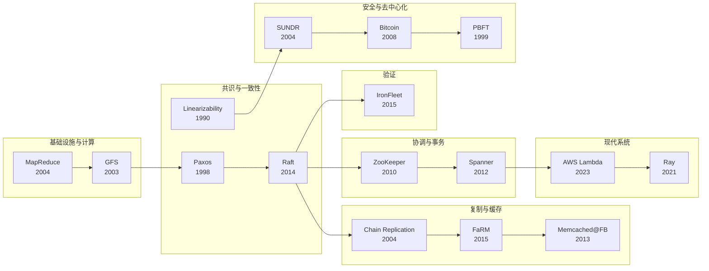

# MIT 6.5840 分布式系统

> **课程**：MIT 6.5840 Distributed Systems (Spring 2026)
>
> 本项目翻译该课程涉及的所有经典论文，涵盖 MapReduce、GFS、Paxos、Raft、Spanner、ZooKeeper 等分布式系统核心文献。

---

## 课程论文路线图

---

## 论文列表

### 基础设施与计算模型

| # | 论文 | 年份 | 核心贡献 | 链接 |
|---|------|------|---------|------|
| 1 | MapReduce | 2004 | 大规模数据处理的编程模型 | [→ 阅读](mapreduce.md) |
| 2 | Google File System (GFS) | 2003 | 大规模分布式文件系统 | [→ 阅读](gfs.md) |

### 共识与一致性

| # | 论文 | 年份 | 核心贡献 | 链接 |
|---|------|------|---------|------|
| 3 | Paxos Made Simple | 1998 | 分布式共识算法 | [→ 阅读](paxos.md) |
| 4 | Raft | 2014 | 可理解的共识算法 | [→ 阅读](raft.md) |
| 5 | Linearizability | 1990 | 并发对象的正确性条件 | [→ 阅读](linearizability.md) |

### 协调与事务

| # | 论文 | 年份 | 核心贡献 | 链接 |
|---|------|------|---------|------|
| 6 | ZooKeeper | 2010 | 高性能分布式协调服务 | [→ 阅读](zookeeper.md) |
| 7 | Spanner | 2012 | 全球分布式数据库 + TrueTime | [→ 阅读](spanner.md) |

### 复制与缓存

| # | 论文 | 年份 | 核心贡献 | 链接 |
|---|------|------|---------|------|
| 8 | Chain Replication | 2004 | 高吞吐量链式复制协议 | [→ 阅读](chain-replication.md) |
| 9 | FaRM | 2015 | RDMA + 乐观并发控制 | [→ 阅读](farm.md) |
| 10 | Memcached at Facebook | 2013 | 大规模缓存系统实践 | [→ 阅读](memcached.md) |

### 验证

| # | 论文 | 年份 | 核心贡献 | 链接 |
|---|------|------|---------|------|
| 11 | IronFleet | 2015 | 分布式系统的形式化验证 | [→ 阅读](ironfleet.md) |

### 现代系统

| # | 论文 | 年份 | 核心贡献 | 链接 |
|---|------|------|---------|------|
| 12 | AWS Lambda (On-demand Container Loading) | 2023 | Serverless 容器快速加载 | [→ 阅读](lambda.md) |
| 13 | Ray | 2021 | 通用分布式计算框架 | [→ 阅读](ray.md) |

### 安全与去中心化

| # | 论文 | 年份 | 核心贡献 | 链接 |
|---|------|------|---------|------|
| 14 | SUNDR | 2004 | Fork 一致性的安全文件系统 | [→ 阅读](sundr.md) |
| 15 | Bitcoin | 2008 | 去中心化电子现金系统 | [→ 阅读](bitcoin.md) |
| 16 | PBFT | 1999 | 实用拜占庭容错算法 | [→ 阅读](pbft.md) |

---

## 课程资源

- [MIT 6.5840 课程主页](https://pdos.csail.mit.edu/6.824/schedule.html)
- [课程 Lab 作业](https://pdos.csail.mit.edu/6.824/labs/lab-mr.html)

---

*基于 MIT 6.5840 Distributed Systems (Spring 2026) 课程论文列表*
