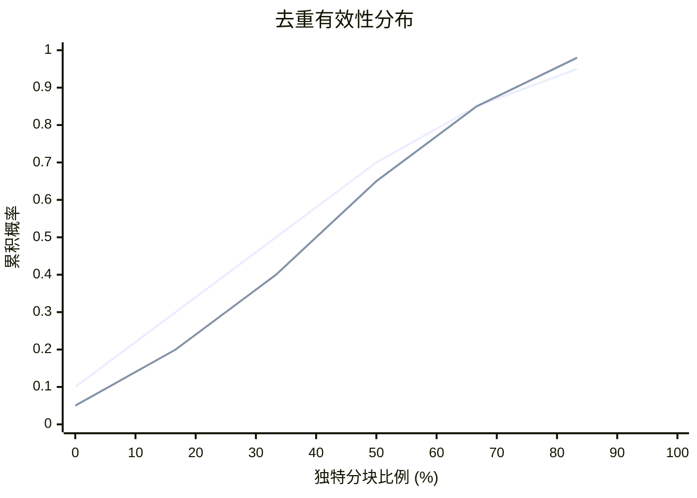
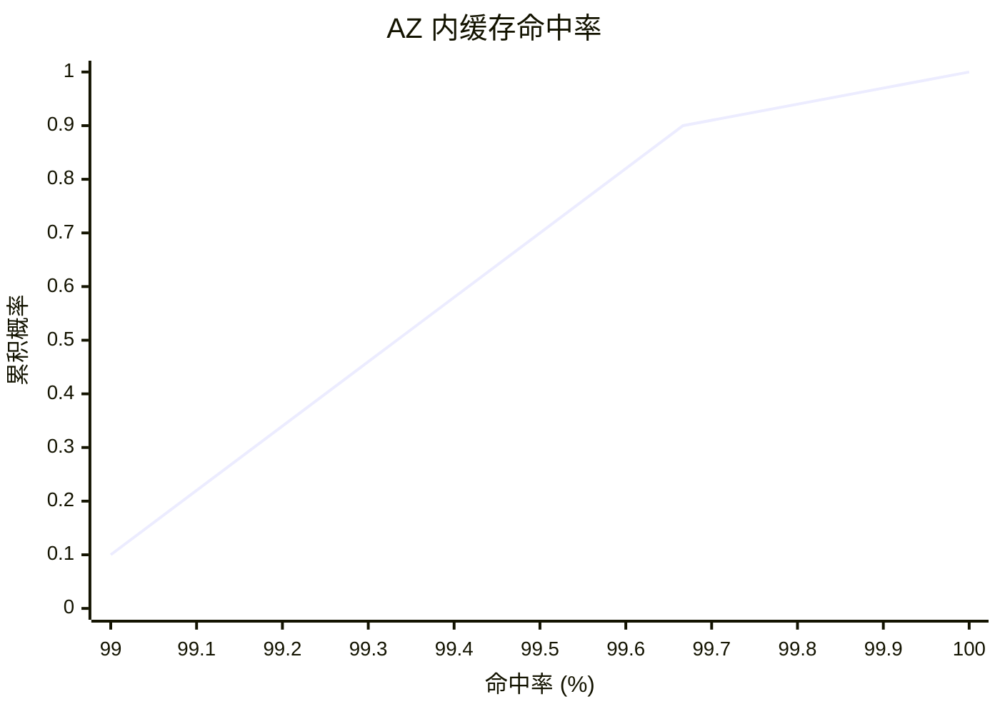
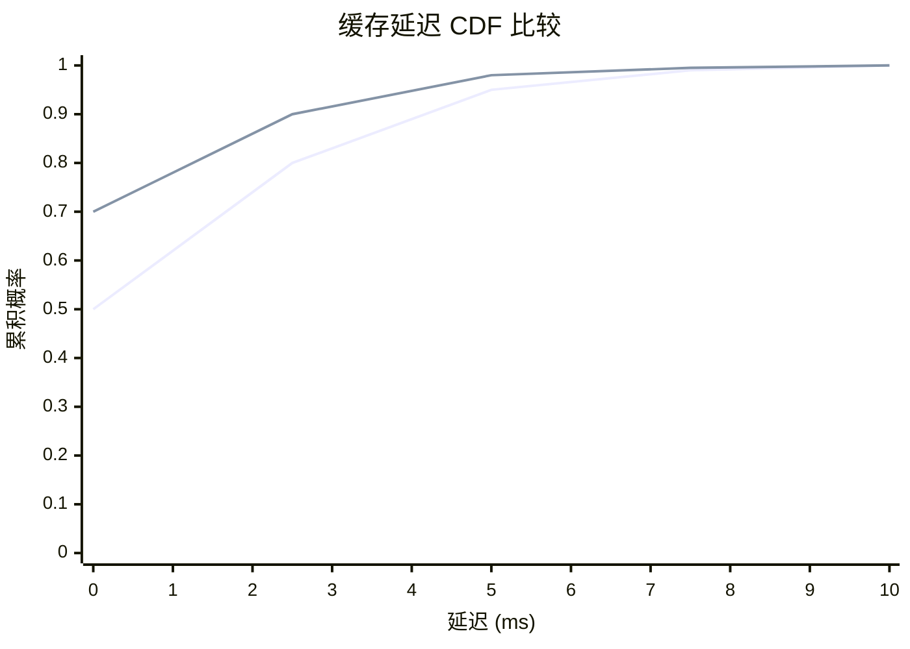
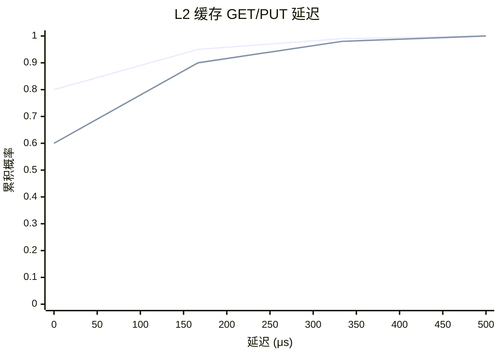
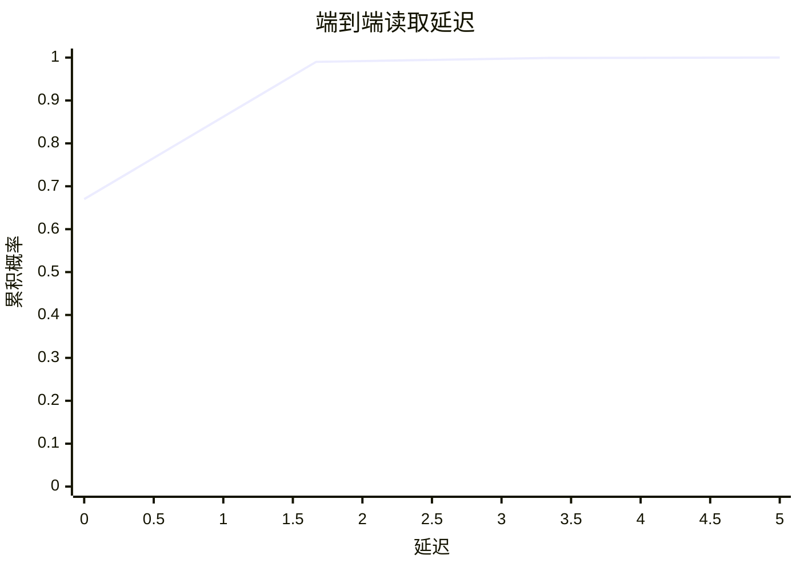

<!-- markdownlint-disable MD025 MD037 MD036 -->

# AWS Lambda 中的按需容器加载

**作者**：Marc Brooker, Mike Danilov, Chris Greenwood, Phil Piwonka  
**机构**：Amazon Web Services（亚马逊云科技）  
**年份**：2023  
**来源**：USENIX ATC (USENIX Annual Technical Conference)

---

## 摘要

AWS Lambda 是一种无服务器（serverless）事件驱动计算服务，属于有时被称为函数即服务（Function-as-a-Service, FaaS）的云计算产品类别。我们首次发布 AWS Lambda 时，函数被限制为 250MB 的代码和依赖，以简单压缩包形式打包。2020 年，我们发布了支持将最大 10GiB 的容器镜像部署为 Lambda 函数的能力，使客户能够将更大的代码库和依赖集带入 Lambda。在支持更大包的同时，仍满足 Lambda 的快速扩展（单客户每秒新增最多 15,000 个容器，整体更多）、高请求率（每秒数百万请求）、大规模（数百万独特工作负载）和低启动时间（低至 50ms）目标，带来了重大挑战。

我们描述了为按需交付容器镜像而构建的存储与缓存系统，以及我们在设计、构建和规模化运营方面的经验。我们重点关注安全性、效率、延迟和成本方面的挑战，以及我们如何在结合缓存、去重、收敛加密（convergent encryption）、纠删码（erasure coding）和块级按需加载的系统中应对这些挑战。

自构建该系统以来，它已可靠地处理了超过一百万 AWS 客户的数百万亿次 Lambda 调用，并表现出对负载和基础设施故障的出色弹性。

---

## 1 引言

AWS Lambda 是一种无服务器事件驱动计算服务，属于有时被称为函数即服务（FaaS）的云计算产品类别。Lambda 于 2015 年首次推出，如今 AWS Lambda 函数在数百万独特客户工作负载上每秒运行数百万次。吸引客户使用 Lambda 的一个因素是其扩展能力，通常在一秒内（通常快至 50ms）即可应对负载增加。这一扩展时间，客户称之为冷启动时间（cold-start time），是决定 FaaS 系统客户体验的最重要指标之一。当我们推出 AWS Lambda 时，我们认识到减少这些冷启动期间的数据移动至关重要。客户以压缩包（.zip 文件）形式将函数部署到 Lambda，在每个函数实例被配置时解压。随着 Lambda 的演进，客户越来越多地希望部署更复杂的应用，对更大部署和利用容器工具（如 Docker）创建和管理这些部署镜像的能力有强烈需求。客户还希望 Lambda 支持这些镜像，同时不牺牲冷启动性能。

在 AWS Lambda 中添加容器支持而不在冷启动时间上退步，为我们的团队带来了重大技术挑战。核心挑战本质上是数据移动问题。如今，Lambda 可为生产工作负载每秒启动最多 15,000 个容器 [18]，我们预计未来工作负载将进一步扩展。仅为这 15,000 个容器中的每一个移动和解压 10GiB 镜像就需要 150Pb/s 的网络带宽。为实现可扩展性和冷启动延迟目标，我们需要利用三个简化该问题的因素：

- **可缓存性（Cacheability）**：虽然 Lambda 服务数十万个独特工作负载，但大规模扩展尖峰往往由较少数量的镜像驱动，表明工作负载高度可缓存。
- **共性（Commonality）**：许多流行镜像基于通用基础层（如我们自己的 AWS 基础层，或 Alpine 等开源产品）。缓存和去重这些通用基础层可减少所有基于它们构建的容器的数据移动。
- **稀疏性（Sparsity）**：大多数容器镜像包含大量应用在启动时（或可能永远）不需要的文件和文件内容。Harter 等人 [15] 发现，平均而言启动时仅需要 6.4% 的容器数据。

我们的解决方案结合缓存、去重、纠删码和稀疏加载来利用这些需求。在不增加任何客户可见复杂性的情况下（他们只需将容器镜像上传到便捷的仓库），我们实现了扩展和冷启动延迟目标，同时为未来扩展留有显著余量。

本节介绍 AWS Lambda 的现有架构和我们系统的整体架构。第 2 节介绍我们稀疏加载方案的低层实现。第 4 节介绍缓存架构以及使用纠删码改善可扩展性和尾延迟。第 3 节介绍我们基于收敛加密的安全去重架构。最后第 6 节将我们的解决方案与学术界和工业界的其他方法进行比较。

### 1.1 现有架构概览

为降低风险并优化上市时间，我们希望以对现有架构的最小改动将这些新能力引入 Lambda，如图 1 所示。执行特定函数的请求（我们称之为调用 invokes）通过负载均衡的无状态前端服务到达。该服务加载与请求关联的元数据，执行认证和授权，然后向 Worker Manager 发送请求以申请容量。

Worker Manager 是有状态的粘性负载均衡器。对于系统中的每个独特函数，它跟踪运行该函数的可用容量、该容量在集群中的位置，并预测何时可能需要新容量。若有可用容量，Worker Manager 指示前端将请求负载转发到 Worker，在那里执行函数。若无可用容量，Worker Manager 识别具有可用 CPU 和 RAM 的 Worker，并发送请求以启动相关函数的沙箱。完成后通知前端并执行函数。

如 图 2 所示，每个 Lambda Worker 包括一个小型控制器进程 Micro Manager、一些用于日志和监控的额外代理，以及大量 MicroVM。每个 MicroVM 基于我们的 Firecracker [3] 虚拟化程序，包含单个客户单个 Lambda 函数的代码。MicroVM 内部是最小化的 Linux 客户内核、提供 Lambda 编程模型的小型 shim、任何提供的运行时（如 Java 的 JVM 或 .NET 的 CoreCLR），以及客户的代码和库。如我们 Firecracker 论文 [3] 所述，此处的关键关注点是安全性：客户代码和数据不受信任，MicroVM 内工作负载与共享 Worker 组件之间的唯一通信通过 virtio [27, 32]（具体为 virtio-net 和 virtio-blk）的简单、经过充分测试且形式化验证的实现进行。

在第一代架构中（在本工作之前），当为特定函数创建具有新容量的新 MicroVM 时，Worker 从 Amazon S3 下载函数镜像（最大 250MiB 的 .zip 文件），并将其解压到 MicroVM 客户的文件系统中。该模型简单，对小镜像效果良好，但需要在新 MicroVM 能执行任何工作之前下载并解压完整归档。为支持更大镜像，我们希望避免这种阻塞式下载，并避免在仅使用部分归档时解压整个归档的存储成本。

**图 1：AWS Lambda 调用路径架构**

```text
                    ┌─────────────┐
                    │   Frontend  │
                    └──────┬──────┘
                           │
                    ┌──────▼──────┐
                    │   Worker    │
                    │   Manager   │
                    └──────┬──────┘
                           │
         ┌─────────────────┼─────────────────┐
         │                 │                 │
    ┌────▼────┐       ┌────▼────┐       ┌────▼────┐
    │ Worker  │       │ Worker  │       │ Worker  │
    └─────────┘       └─────────┘       └─────────┘
         │                 │                 │
    Function Metadata
```

**图 2：Lambda Worker 架构**

```text
┌─────────────────────────────────────────────────────────┐
│                    Lambda Worker                         │
├─────────────────────────────────────────────────────────┤
│  Micro Manager  │  Monitoring, Logging, etc.             │
├─────────────────────────────────────────────────────────┤
│  MicroVM "slot" │  Customer Code │ λ Shim │ Linux Kernel │
│                 │  Firecracker   │ virtio │              │
└─────────────────────────────────────────────────────────┘
```

---

## 2 块级加载

为利用容器的稀疏性，我们需要允许系统仅加载（和存储）应用需要的数据，理想情况下在需要时加载。Slacker [15] 和 Starlight [8] 等方法在文件系统层面解决此问题——这对以叠加文件级归档栈构建的容器来说是自然契合。这种方法不适合我们的环境。我们相信文件系统的固有复杂性，以及叠加多个文件系统的额外复杂性，会不可接受地增加 Lambda 共享组件的攻击面。相反，我们决定保持 MicroVM 客户与虚拟化程序之间的块级 virtio-blk 接口，在客户内部执行所有文件系统操作。这需要在块级而非文件级执行稀疏加载。

图 3 展示了我们的高层架构，包括运行客户代码的 Lambda Worker（图 4 详述）、包含客户容器镜像主副本的容器注册表，以及分块创建与缓存基础设施。

我们的第一步是将容器镜像折叠为块设备镜像。根据 OCI 镜像规范 [1]，容器镜像是 tarball 层的栈。在典型容器栈中，这些层在运行时使用 overlayfs 叠加。在我们的实现中，我们在函数首次创建时执行此叠加操作，遵循确定性扁平化（deterministic flattening）过程，按顺序应用每个 tarball 创建单个 ext4 文件系统。函数创建是低速率控制平面过程，通常仅在客户更改其代码、配置或架构时触发。即使最激进的持续集成采用者也仅在分钟级进行这些更改，而函数调用可达每秒数百万次。

扁平化过程的设计使得包含未更改文件的文件系统块将相同，允许在共享通用基础层的容器之间对扁平化镜像进行块级去重。我们将在第 3 节回顾 (revisit) 这一点，但高层原因是函数之间的差异（同一函数不同版本之间更是如此）通常远小于函数本身。扁平化过程通过将每层解压到 ext4 文件系统上进行，使用执行所有操作确定性的修改版文件系统实现。大多数文件系统实现利用并发提高性能，引入非确定性。我们的实现是串行的，并确定性地选择通常可变的参数（如修改时间）。

扁平化过程完成后，扁平化文件系统被拆分为固定大小的分块（chunk），这些分块被上传到三层缓存的源层（origin tier）供后续使用（我们使用 S3 作为此源层）。共享存储中的分块根据其内容命名，确保具有相同内容的分块具有相同名称并可被缓存一次。该方案（第 3 节详述）允许在存储和缓存层高效去重分块内容，而无需分块的中心目录或索引。

每个固定大小分块为 512KiB。较小分块通过最小化假共享（false-sharing）带来更好去重，并可加速具有高度随机访问模式的工作负载的加载。较大分块减少元数据大小，减少加载数据所需的请求数（从而提高吞吐量），并为顺序工作负载提供自然预读。最优值将随系统演进而变化，我们预计未来迭代可能选择不同分块大小，因为我们对客户如何使用系统的理解会演进。

**图 3：高层系统架构**

```text
┌──────────────────┐     ┌──────────────────┐     ┌──────────────────┐
│   Container      │     │  Chunk Origin     │     │    Key Store      │
│   Registry       │────▶│  (S3)             │     │    (KMS)          │
└────────┬─────────┘     └────────┬─────────┘     └────────┬─────────┘
         │                        │                        │
         │  Deterministic         │  Chunks                 │  Keys
         │  Flatten               │                        │
         ▼                        ▼                        ▼
┌─────────────────────────────────────────────────────────────────────┐
│                    Distributed Cache                                 │
└─────────────────────────────────────────────────────────────────────┘
         │
         │  Scale: per invoke
         ▼
┌─────────────────┐     ┌─────────────────┐
│  Lambda Worker  │     │  Lambda Worker  │
└─────────────────┘     └─────────────────┘
         Scale: per new function
```

**图 4：具有每 Worker、每客户和客户内组件的 Lambda Worker**

```text
┌─────────────────────────────────────────────────────────────────┐
│                        Lambda Worker                             │
├─────────────────────────────────────────────────────────────────┤
│  Per-function resources                                          │
│  ┌─────────────┐  ┌─────────────────┐  ┌─────────────────────┐  │
│  │ Local Agent │  │ MicroVM "slot"  │  │ ext4 Filesystem     │  │
│  │             │  │ Customer Code   │  │ (guest)             │  │
│  │             │  │ Firecracker     │  │                     │  │
│  │             │  │ λ Shim          │  │                     │  │
│  │             │  │ Guest Linux     │  │                     │  │
│  │             │  │ virtio          │  │                     │  │
│  └──────┬──────┘  └─────────────────┘  └─────────────────────┘  │
│         │                                                         │
│  ┌──────▼──────────────────────────────────────────────────────┐ │
│  │              Worker Local Cache                              │ │
│  └──────┬──────────────────────────────────────────────────────┘ │
│         │ To shared cache                                          │
└─────────┴─────────────────────────────────────────────────────────┘
```

### 2.1 每 MicroVM 快照加载

创建分块后，系统需要能够从包含该数据的分块中访问所需数据。如图 4 所示，我们添加了两个新组件来支持此加载：

- **每函数本地代理（per-function local agent）**：向每函数 Firecracker 虚拟化程序呈现块设备（通过 FUSE），然后通过现有 virtio 接口转发到客户，由客户内核挂载。
- **每 Worker 本地缓存（per-worker local cache）**：缓存 Worker 上频繁使用的数据分块，并与远程缓存交互（详见第 4 节）。

当在 Worker 上启动新 Lambda 函数时，Micro Manager 创建新的本地代理和新的 Firecracker MicroVM，其中包含两个 virtio 块设备：对所有 MicroVM 相同的根设备，以及由本地代理暴露的 FUSE 文件系统支持的块设备。MicroVM 启动，启动一些监督组件，然后开始执行容器镜像中的客户代码。该代码执行的每次 I/O（除非可由客户内核维护的页缓存提供）都会变成 virtio-blk 请求，由 Firecracker 处理并交给本地代理。

本地代理通过直接从本地缓存读取处理读请求（若包含请求偏移的分块已存在）。若不存在，则从分层缓存获取相关分块（第 4 节描述）。本地代理通过将写请求写入由 Worker 上加密存储支持的块覆盖层（block overlay）处理写请求。维护页粒度的位图，指示数据应从覆盖层读取还是从后备容器镜像读取。位图的页粒度要求对来自客户的不覆盖整页的写进行读-改-写。这种页级写时复制（copy-on-write）方法允许 MicroVM 客户处理读写，同时保持本地缓存（及所有其他缓存层）中的数据不可变，使其可在多个客户间共享。

---

## 3 无信任去重

基础容器镜像，如官方 Docker alpine、ubuntu 和 nodejs，被极其广泛使用：每个在流行的 DockerHub 容器仓库的累计下载量超过 10 亿次。从这些基础镜像之一开始，并根据应用的特殊需求进行定制，是创建新容器镜像的常见方式。当使用流行基础镜像时，第 2 节描述的确定性扁平化过程为定制部分产生独特分块，为通用部分产生与具有相同基础的其他镜像产生的分块相同的分块。这些共享分块创造了显著的去重机会：若仅存储这些分块的一份副本，则所需数据移动更少，消耗的存储更少，缓存更有效。

约 80% 新上传的 Lambda 函数产生零个独特分块，仅是过去已上传镜像的重新上传。这似乎主要由自动化测试和部署（CI/CD）系统驱动。在产生至少一个独特分块的剩余 20% 函数中（因此不是简单的重新上传），平均上传包含 4.3% 独特分块，中位数为 2.5%。简单的全零分块不包含在这些数字中：它们在创建时完全从镜像中排除。

图 5 显示了去重有效性的分布，按镜像大小分为前四分之一和其余群体。该细分表明，大多数各种规模的函数都高度去重，且存在去重效果不佳的显著尾部。虽然大函数仍有效去重，但独特分块的尾部较小。该数据清楚地表明去重值得其复杂性，可将存储减少多达 23 倍，并提高缓存层的有效性（缓存有效性提高多少取决于去重概率与访问频率之间的相关性）。虽然 80% 无独特分块的函数在统计上不有趣，但对它们去重具有重大实际效益，包括将存储成本再降低 5 倍，并提升缓存有效性。

**图 5：在非简单重新上传的函数中，分块创建时去重有效性的经验 CDF**



### 3.1 收敛加密

明文去重相对简单。可追溯到 2002 年的 Venti [30] 使用块内容的哈希和单独索引对块去重。然而，引入加密显著复杂化了去重。如 Storer 等人 [33] 所述：

> 不幸的是，去重利用相同内容，而加密试图使所有内容看起来随机；用两个不同密钥加密的相同内容会产生非常不同的密文。因此，将去重的空间效率与加密的保密性相结合是有问题的。

一种解决方案是使用可解密共享块的共享密钥，但这要么引入可访问大量块的单一密钥，要么带来重大的密钥管理问题。也许最难的问题是最小化信任。虽然 AWS Lambda 以强隔离 [3] 运行用户代码，我们仍希望将每个 Lambda Worker 主机限制为仅能访问发送给它的函数所需的数据。

Farsite [2, 11] 的作者开发了收敛加密作为此问题的解决方案。每个块（在 Farsite 中是文件块，在我们案例中是扁平化容器镜像的分块）的密码学哈希用于确定性地派生用于加密该块的密码学密钥。我们遵循相同方案，但在密钥派生中混入额外元数据（第 3.3 节描述）。

第 2 节描述的扁平化过程获取每个分块，通过计算其 SHA256 摘要派生密钥，然后使用 AES-CTR（用派生密钥）加密该块。此处 AES-CTR 使用确定性（全零）IV，确保相同密文始终产生相同明文。在此上下文中使用确定性 IV 是安全的，因为由于 SHA256 的抗碰撞性，密钥、IV 对仅用于一个明文块 [12]。然后创建分块清单（manifest），包含每个分块的偏移、唯一密钥和 SHA256 哈希。清单然后使用由 AWS Key Management Service (AWS KMS) 管理的每客户唯一密钥，通过 AES-GCM 加密。分块然后基于其密文哈希的函数命名，并使用该名称上传到后备存储（AWS S3）（若该名称的分块尚不存在）。

在我们的方案中，我们不用客户的唯一密钥加密整个清单。相反，仅加密密钥表（每个加密分块的密钥），整个文档被认证（即作为附加数据包含在 AES-GCM 标签的计算中）。这允许垃圾回收过程访问清单中的分块列表，而无法访问分块密钥。以高效二进制格式存储的清单大小可忽略：16GiB 容器镜像小于 3MiB，或 0.02% 开销。

该方法提供许多理想属性：

- 数据可在不共享密钥的情况下去重：解密客户清单的密钥对该客户唯一，对它们的访问（通过 AWS KMS）仅提供给该客户函数被放置的 Worker。
- 数据可在扁平化过程无需协调或特殊访问的情况下去重。扁平化过程独立运行，它们需要的唯一特殊操作是「若此文件尚不存在则上传到存储」。
- 该方案为分块提供强端到端完整性保护。Worker 根据清单中的 MAC 检查它们下载的分块，确保可检测并拒绝被修改的密文。

### 3.2 压缩

我们的系统在加密前不压缩分块明文。原因有二。首先，鉴于我们缓存和 Worker 可用的网络带宽，解压的额外延迟以及允许对压缩数据随机访问的困难，使压缩的延迟收益微乎其微。其次，加密前压缩允许潜在攻击者从压缩大小推断明文内容，即压缩侧信道。此风险以及相对较小的预期收益，意味着我们决定不实现压缩（除了简单排除全零分块）。

### 3.3 限制爆炸半径

虽然去重在成本和缓存性能方面有价值，但它也增加了一些风险。一些流行分块被广泛引用，意味着任何导致访问这些分块中断或变慢的因素，也会对系统产生非常广泛的影响。风险包括缓存节点的部分（灰色）故障、导致数据不可用的运维问题、垃圾回收中的 bug，或缓存层次结构中数据的损坏。高度流行的分块还会导致分布式存储中的热点。虽然我们的密码方案可检测损坏并防止读者看到损坏数据，但它不会纠正，因此损坏的数据将变得不可用。

为解决此问题，我们在收敛加密方案的密钥派生步骤中包含变化的盐（salt）。此盐值可随时间、分块流行度和基础设施放置（如在不同可用区或数据中心使用不同盐）而变化。具有不同盐值的其他相同分块将得到不同密钥，因此不同密文，彼此不会去重。通过控制盐轮换的频率，我们可以在去重效率与爆炸半径之间持续权衡。盐允许我们将去重控制完全封装在分块创建层内，无需任何其他组件知晓其决策。盐轮换是运维关注点，不是去重方案安全性所必需的。

### 3.4 垃圾回收

任何分布式去重方案的关键挑战是垃圾回收：当数据不再被主动引用时从后备存储中移除数据。垃圾回收错误的分块可能对多个客户造成广泛影响。我们的去重方案不维护分块引用或清单的中心目录，使精确引用计数不可行。过去分布式垃圾回收的经验告诉我们，该问题既复杂（因为分块引用树在动态变化）又独特风险（因为它是我们系统中删除客户数据的唯一位置）。我们基于此经验采取了垃圾回收方法。

我们的垃圾回收方法基于根（root）的概念。根是自包含的清单和分块命名空间，类似于传统垃圾回收算法中使用的根。与传统 GC 根不同，在我们的系统中我们定期创建新根（然后获取所有新数据），并退役旧根（在将仍需要的数据迁移到新根之后）。当客户的容器镜像被转换时，清单和分块集被放置在活动根中，例如 R1。活动根处理数据的读写。定期创建新根 R2 并变为活动，而根 R1 进入退役状态，此时仅提供数据读取。当 R1 退役时，R1 中仍被引用的任何清单连同其引用的任何分块迁移到 R2。随着时间的推移，R1 中活跃使用的清单和分块将迁移到 R2，允许安全删除 R1。此过程重复：R2 退役，R3 变为活动根，依此类推。图 6 显示了此生命周期。将分块与其清单一起迁移确保若根 R 中存在清单，则其引用的所有分块也存在。当前活动根的唯一标识符也包含在去重盐中（第 3.3 节），确保活动根中新创建的分块不与先前根共享。

**图 6：代际垃圾回收使用的数据分块生命周期**

```text
    active          retired         expired
  read & write    read only      alarm on access

R1: [████████] → [████████] → [████████]
                    │              │
                    │ Copy active   │ deleted
                    │ data          │
                    ▼              ▼
R2:             [████████] → [████████]
                    │              │
                    │              │ deleted
                    ▼              ▼
R3:             [████████] → [████████]
```

数据迁移完成后，我们不立即删除根，而是将其置于过期状态。在此状态下，仍允许读取数据，但任何访问数据的尝试都会触发告警。这些告警既会通知运维人员，也会自动停止进一步的数据删除。该方法允许我们在生产环境中稳健检测垃圾回收问题（尤其是不完整复制），并快速自动停止任何数据被删除。虽然此机制不精确（数据可能在根过期期间被访问），但它为防止数据丢失提供了宝贵额外保护层。虽然软件 bug 很少见，我们仔细测试垃圾回收更改，但在任何分布式存储系统中，针对客户数据丢失的多层保护至关重要。

在多个根中保存数据确实会增加存储成本，然而对于 Lambda 来说，此额外成本是可接受的，因为客户经常更新其函数，且大部分数据从未迁移到新根。系统还能够同时拥有多个活动根，这减少了 bug 的爆炸半径，并提供了将新垃圾回收更改和算法推广到清单及其分块子集的能力。

---

## 4 分层缓存

当 Worker 的本地缓存中没有分块时，它们尝试从可用区级（AZ-level）共享缓存拉取（如图 3）。若分块不在此缓存中，Worker 从 S3 下载它们并上传到缓存。此 AZ 级缓存是相当标准设计的自定义实现：通过 HTTP2 获取分块，数据存储为两层，热分块有内存层，冷分块有闪存层，驱逐使用 LRU-k [29]（抗扫描的最少最近使用变体）。分块使用一致哈希（consistent hashing）[19] 方案的变体分布到 AZ 级缓存，具有改善负载分散的优化（类似于 Chen 等人 [7] 的方法）。缓存层显著改善了获取性能：从 Worker 视角，AZ 级缓存命中的中位时间为 550μs，而从 S3 源获取为 36ms（99.9 百分位 3.7ms 对 175ms）。

图 7 显示了这三层缓存的有效性。在某个大型 AWS 区域一周的生产使用中，中位 67% 的分块从 Worker 上缓存加载，32% 从 AZ 级分布式缓存，剩余 0.06% 从后备存储。

每 Worker 缓存的中位命中率为 67%，该周的第 10 百分位低命中率为 65%。AZ 内缓存更有效，中位命中率 99.9%，该周第 10 百分位低命中率 99.4%。图 8 显示了该周 AZ 内缓存命中率的经验 CDF，在某个规模化生产可用区的一分钟桶中测量。分布的左尾与对新创建函数流量的大幅尖峰相关。我们正在评估在分块创建过程中预热 AZ 内缓存以 flatten 此左尾并进一步提高命中率，主要目标是减少新函数的加载时间延迟。

**图 7：各缓存层一周命中率：Worker 上（L1）、AZ 内分布式（L2）、后备存储（L3）**

| 缓存层 | 中位命中率 |
|--------|------------|
| L1 (Worker 上) | 67% |
| L2 (AZ 内) | 32% |
| L3 (S3 源) | 0.06% |

**图 8：AZ 内缓存命中率经验 CDF**



### 4.1 尾延迟优化

虽然 AZ 级缓存中的数据不需要持久化（使用 S3 作为源确保持久化），但简单的非复制缓存方案（每个对象存储在单个节点）因三个原因无法满足我们的需求：

1. **尾延迟**：单个慢缓存服务器可能导致广泛影响。缓慢可能由主机或网络拥塞、部分硬件或软件故障引起。
2. **命中率下降**：将每个项目缓存在单个服务器意味着若该服务器故障或被下线部署，命中率会下降。
3. **吞吐量限制**：将每个项目缓存在单个服务器意味着获取对象的可用带宽受限于单个服务器的带宽。

其中，尾延迟是最大的实际关注点。我们运营此类系统的经验表明，调试缓慢和部分故障比调试完全故障困难得多。即使此缓慢仅在长尾中，在生产中仍然重要，因为每个容器启动需要获取大量分块。例如，获取 1000 个分块的启动将在 63% 的任务上经历缓存的 99.9 百分位尾延迟。差异显著：在我们缓存的某次部署中，我们观察到客户测量的中位延迟为 500μs，99.9 百分位延迟为 4ms。

复制结合冗余请求是成熟的 [13, 37, 39] 降低尾延迟的技术，也能解决我们的吞吐量和命中率问题。不幸的是，复制使成本与复制因子成比例增加，这在主要是内存缓存中是重要关注点。相反，我们选择纠删码，遵循与 EC-Cache [31] 类似的方案。纠删码在缓存中不广泛使用，但为我们所有三个关注点提供了令人信服的解决方案。当 Worker 缓存未命中时，它从源获取所需分块，然后将该分块的纠删编码条带（erasure-coded stripes）上传到缓存。当 Worker 需要获取分块时，它请求比重建分块严格需要的更多条带，然后在返回足够条带后立即重建分块。我们当前生产部署使用 4 选 5 编码（4 of 5 code），实现 25% 存储开销和 25% 请求率增加，以换取尾延迟的显著降低。图 9 比较了 4 选 5 编码与假设的 4 选 4 方案的经验延迟 CDF，使用我们生产系统某次部署的延迟测量。

该方案防止缓存节点故障或被下线部署时发生命中率下降。类似系统中的常见方法是使用重试隐藏部署和故障节点的影响，已知这种方法在大型系统中会导致亚稳态故障模式 [5, 17]。纠删码允许我们在成功和失败情况下执行相同工作量实现类似弹性水平（我们称之为恒定工作 constant work 的设计哲学 [23]）。

**图 9：4 选 4 并行缓存加载与 4 选 5 纠删编码缓存加载的客户侧延迟经验 CDF 比较**



### 4.2 稳定性与亚稳态

具有高命中率的缓存（如我们的）从延迟和效率角度是理想的，但有隐藏的缺点。若缓存变空（如因断电或运维问题），或命中率突然下降（如因客户行为变化），下游服务可能看到比它们习惯的显著更多流量。在我们的缓存情况下，端到端命中率通常超过 99.8%，此下游流量增加可能高达正常的 500 倍。S3 是极其可扩展的后备存储，可承受完全未缓存负载。然而，增加的延迟导致客户应用的更高并发需求（由于 Little 定律 [21]），因此对新 Lambda 槽位的更高需求，增加负载并改变系统工作集的大小和组成。这可能导致亚稳态行为 [5, 6, 17]，即系统在缓存为空时无法重新填充。

::: tip 亚稳态
Denning 在 1968 年论文《程序行为的 Working Set 模型》[9] 中观察到分页系统中的类似效应：这可能造成自我强化的危机。程序被剥夺仍需要的页，产生大量缺页；返回页的 resulting 流量驱逐其他有用页，导致更多缺页，如此循环。
:::

我们已在 Lambda 更高层构建了针对此风险的缓解措施。主要地，系统设计为并发受限。当容器启动变慢且并发任务数超过此限制时，新启动被拒绝直到进行中的完成。我们还积极测试系统在最大并发下从空缓存冷启动的能力。此测试使我们确信系统能够从冷缓存重启，或容忍显著降低命中率的工作负载变化。

### 4.3 缓存驱逐与 sizing

传统缓存替换策略如最近最少使用（Least Recently Used, LRU）和先进先出（First In First Out, FIFO）简单易实现，但对此应用有显著缺点：缺乏抗扫描性。在我们的案例中，这意味着大量不常用函数的启动可以用属于这些函数的最近使用项替换缓存中的所有热项，降低更常用项的缓存命中率，并用永远不会再读的项填充缓存。这在我们环境中周期性发生，由每周、每日和每小时的周期性 cron 作业函数的尖峰驱动。这些函数数量大，但每个以低规模运行（通常仅使用一个沙箱），使缓存它们的分块相对不重要。为避免此周期性工作导致的命中率下降，我们使用 LRU-k [29] 驱逐算法，它跟踪缓存中项目最后 k 次使用时间，而非仅最近一次。

驱逐和命中率也与我们的本地和 AZ 级缓存大小相关。遵循 Gray 和 Putzolu 经典五分钟法则（Five Minute Rule）[14] 的逻辑，最小理想缓存大小是使缓存保留成本等于从 S3 获取分块成本的大小。然而，因为我们的缓存不仅旨在降低成本还改善客户观察到的延迟，我们还设定了命中率目标，若低于该目标则增加缓存大小。因此，总缓存大小是实现命中率目标所需大小与优化成本所需大小中的较大者。

---

## 5 实现与生产经验

我们使用 Rust 编程语言构建了本地代理（支持每个 MicroVM 稀疏块设备的 FUSE 实现）、Worker 本地缓存和远程缓存服务器。我们使用 tokio 运行时，以及 reqwest 和 hyper 进行 HTTP。在我们开始此项目时，AWS Lambda 的调用路径包括用 Java、Go、C 和 Rust 编写的组件。我们选择 Rust 是因为我们过去构建 Rust 组件的良好经验，尤其是在性能和稳定性方面，并再次对 Rust 选择感到满意，在我们选择的库中未遇到重大生产 bug。我们也因其他 AWS 团队（如 Amazon S3 团队 [4]）在将形式化方法应用于验证 Rust 代码正确性方面的成功而吸引，即使是非专家程序员。

Rust（1.46.0 版，实现时的当前版本）的一个有趣障碍是热点优化的脆弱性，尤其是自动向量化。不出所料，我们发现用于纠删码的奇偶校验计算在以 64 字节（AVX512）或 32 字节（AVX 或 NEON）执行时比以 8 字节执行快近 5 倍，比逐字节执行快 10 倍。不幸的是，朴素的 Rust 循环发出了逐字节代码（如 Listing 1 所示），尽管编译器能够自动向量化。对代码的小改动会改变自动向量化行为，甚至感兴趣函数之外的改动。不愿为此代码转向汇编，我们最终采用了 Listing 2 中的代码，它根据目标平台稳健地发出适当展开的 AVX、AVX512 或向量化 ARM 代码。对此函数的看似小改动（如移除 assert、更改任何赋值或允许内联）会导致自动向量化被禁用。这是 Rust 的一个小问题，我们预计在未来的编译器版本中会改进。

**Listing 1：Rust 编译器为简单循环实现发出的朴素逐字节 x86 汇编代码**

```text
0.08 |350: cmp %rax,%rsi
|     ↓ jae 3f4
49.18 |     movzbl (%rdi,%rsi,1),%ebx
0.13 |     xor %bl,(%rcx,%rsi,1)
50.52 |     lea 0x1(%rsi),%rbp
0.08 |     mov %rbp,%rsi
|     cmp %rax,%rbp
|     ↑ jb 350
```

**Listing 2：Rust 中奇偶校验计算的实现，显示可靠自动向量化所需的额外行**

```rust
#[inline(never)]
fn parity(target: &mut [u8], source: &[u8]) {
    assert_eq!(source.len(), target.len());
    let len = target.len();
    let _ = target[len-1];
    let _ = source[len-1];
    for i in 0..len {
        target[i] ^= source[i];
    }
}
```

另一方面，Rust 生态对构建时微基准（如 criterion crate）的支持使此类性能工作快速轻松地迭代，甚至可在构建时断言自动向量化已成功（有效阻止回归进入生产）。在云环境中这是重大福音，性能回归可能导致生产中断，性能与成本和碳效率相关。

### 5.1 延迟与多模态

与任何存储系统一样，性能是我们快照分块加载系统设计和实现的重要目标。虽然吞吐量、CPU 效率和其他带宽指标影响运行系统成本，其横向扩展性质使延迟和可扩展性成为性能的最重要因素。本地代理和 Worker 上缓存由于除了与 S3（从源拉取分块）和 L2 AZ 级缓存交互外不与其 Worker 外通信，可轻松横向扩展。

图 10 显示了此缓存的 GET 和 PUT 延迟，从服务器端测量，跨越生产部署某次部署一周内所有缓存节点。每个 GET 或 PUT 为 512kB 分块。如第 4 节所述，L2 缓存是基于闪存的缓存，具有显著的本地内存层（约缓存大小的 10%）。GET 延迟非常一致，中位低于 50μs。PUT 延迟不太一致，显然由缓存主机上的回写行为引起一些多模态。尽管存在此多模态，性能仍然出色，中位延迟 125μs，99 百分位延迟低于 300μs，99.99 百分位 413μs。在构建此缓存服务器时，我们选择 HTTP2 作为有线协议以便利，打算稍后用高效二进制协议替换。在生产中，我们发现 HTTP（用 hyper 和 reqwest 实现）的开销如此之低，以至于我们尚未有动力替换协议。

**图 10：L2 缓存服务器服务器端测量的延迟经验 CDF**



图 11 显示了从本地代理（即 FUSE 实现）视角返回读取的端到端延迟。这不显示客户经历的端到端 I/O 延迟，因为它是从 Worker 视角且不包括 MicroVM 客户内核维护的页缓存的（显著）命中率，以及客户为填充该缓存执行的预读。与 L2 服务器延迟一样，此端到端延迟显示显著多模态：代表本地缓存命中的低于 100μs 的模式、代表 L2 命中（及后续解密等工作）的约 2.75ms 模式，以及（从图中裁剪）代表罕见从源获取的模式（见图 7 了解这些模式的相对频率）。我们正在开发优化的密码方案以减少解密延迟。

**图 11：本地代理（FUSE 实现）观察到的端到端读取延迟经验 CDF**



::: info 多模态的挑战
此类多模态是存储系统的常态，但给运维人员带来一些实际挑战。首先，如第 7 节所述，各模式相对频率的微小变化可显著改变客户观察到的平均延迟（从而改变系统的并发和吞吐量）。其次，延迟百分位和截断均值是 AWS 运维人员最常用的汇总统计，它们往往掩盖多模态。如经验 CDF（此处呈现的 eCDF）的图很有价值，但不像汇总统计的时间序列那样显示随时间变化。我们尝试过热图、日复一日 eCDF 等，但尚未找到向运维人员呈现这些数据的简洁方式。第三，多模态使决定将优化资源花在哪里更复杂。团队应改进哪种模式？还是应努力降低较高模式的相对频率？
:::

### 5.2 FUSE 生产经验

我们对 FUSE 的经验与 Vangoor 等人 [36] 报告的一致，在良好调优时吞吐量开销相对较小。然而，我们发现使用 FUSE 呈现文件然后由 Firecracker 的 virtio-blk 实现用作块设备的选择引入了显著开销。当在 MicroVM 中运行的应用读取新分块时，控制传递给客户内核，然后 Firecracker，然后主机内核的 FUSE 层，然后本地代理，再沿相同路径返回。这引入了上下文切换开销，但更重要的是需要主机内核调度器调度四个不同线程。这在稳态下引入低效，在负载下引入显著抖动。我们正在为此应用远离 FUSE，主要由于此影响。我们的新实现使用 userfaultfd 和 mmap，从架构中移除两层。

我们不后悔从 FUSE 开始。它提供了便捷的接口、清晰的安全和运维隔离故事，并允许没有深厚系统级编程经验的团队构建可接受的高性能系统。

---

## 6 相关工作

随着无服务器和容器的流行度上升，加速容器加载在过去十年一直是研究和工业实现的高度活跃领域。在此之前，通过更快的磁盘镜像移动加速 VM 加载是活跃的研究领域，例如 2003 年的 Frisbee [16]。Amazon EC2 自 2009 年以来通过跟踪 EBS 快照分块的 lineage [28] 利用通用数据加速 VM 镜像加载。Harter 等人在 Slacker [15] 中研究了容器加载中的访问模式，并提出了通过执行层级惰性加载利用这些模式的系统。Starlight [8] 采用相当相似的文件系统导向方法，针对边缘加载优化，其中最小化到数据中心的往返是性能的重要贡献者。eStargz [35] 扩展常见容器镜像格式，使层级惰性加载更高效，基于 Google 的 CRFS 方法。

DADI [20] 使用与我们相当相似的块级方法，但采用点对点方法而非专用缓存层，且无法像我们系统那样广泛去重。FaaSNet [38] 解决与我们类似的问题，但在层级别工作（而非像我们那样扁平化镜像），似乎不执行去重。Cntr [34] 和 Yolo [26] 采用将容器镜像分解为不同数据类的方法，一些在启动时紧急需要，一些可能不那么紧急访问。这种显式方法可能比简单的基于块的方法更高效，但也需要对容器内容进行更深入的内省。Wharf [41] 和 CFS [22] 采用分布式文件系统方法，表明可以显著改善加载性能，代价是容器之间增加的协调。

使用去重加速存储性能和加载的历史更长，例如 2001 年 Muthitacharoen 等人 [25]、2002 年 Venti [30] 和 Farsite [2]。

---

## 7 结论

我们介绍了 AWS Lambda 加速容器镜像加载的解决方案，该方法结合了去重、纠删码、分层缓存、用户空间文件系统和收敛加密。我们已运营此系统数年，并正在将其使用扩展到 AWS 的其他领域。虽然我们的解决方案表面上有许多移动部件，但它针对我们认为构建大规模云系统的现实进行了优化：故障频繁、故障通常是部分和复杂的、安全是首要任务。

### 7.1 更广泛的教训与未来工作

虽然 Lambda 的快照加载基础设施是相当专门应用的专门系统，我们相信我们的经验中有一些适用于整个系统社区的更广泛教训：

- **容器作为依赖闭包**：Lambda 客户最普遍将容器用作「大规模静态链接」依赖闭包。客户希望在一个原子单元中构建、测试和部署函数及其所有依赖，但传统静态链接要么不可用要么不便。然而，容器在此上下文中也高度低效，需要此处描述的去重和稀疏加载。我们相信对更轻量级依赖闭包机制有显著需求，它在创建的工件大小上更接近传统静态链接。

- **缓存的风险**：缓存降低成本、改善延迟并减少持久存储的负载，是几乎所有有状态系统的关键组件。然而，它们也引入风险，如亚稳态故障（由于意外空缓存或工作负载的突然变化），以及多模态延迟分布等用户挑战。虽然 Yang 等人 [40] 和 Huang 等人 [17] 的工作在深入理解这些效应方面取得了进展，我们相信需要更多工作来理解大型系统中缓存的动态行为，并开发缓解缓存风险的模式。

- **MicroVM 作为研究工具**：MicroVM 提供几乎与容器或进程 [3, 24] 一样轻量的隔离机制，同时为插入本地和分布式操作系统逻辑提供额外接口。MicroVM 为操作系统研究者或构建者的工具箱提供了强大的新工具。我们相信虚拟化的操作系统支持，以及应用、操作系统和数据库的虚拟化支持，是尚未受到足够关注的成熟研究领域。

我们的未来工作专注于进一步优化系统的成本、性能，尤其是客户体验的冷启动延迟。此同一系统用于 Lambda SnapStart，这是 AWS Lambda 使用内存快照减少冷启动延迟的功能，用于存储和加载内存快照内容。该用例对延迟特别敏感，推动了对平均情况和尾延迟的显著投资。我们预计此工作将包括优化缓存保留和数据放置策略、优化客户端和服务器性能，以及完成从 FUSE 到 userfaultfd 的迁移。

---

## 致谢

任何此规模的系统都需要团队来构建和运营，在此我们深深感谢 AWS Lambda 团队的工作和贡献。Holly Mesrobian、David R. Richardson、Ajay Nair 和 David Nasi 对支持此工作至关重要。Shay Gueron、Osman Surkatty 和 Derek Manwaring 帮助夯实了我们的密码学雄心，并提供了宝贵反馈。

---

## 参考文献

[1] OCI Image Format Specification. <https://github.com/opencontainers/image-spec>  
[2] Adya et al. FARSITE: Federated, available, and reliable storage. OSDI 2002.  
[3] Agache et al. Firecracker: Lightweight virtualization for serverless applications. NSDI 2020.  
[4] Bornholt et al. Using lightweight formal methods to validate a key-value storage node in Amazon S3. SOSP 2021.  
[5] Bronson et al. Metastable failures in distributed systems. HotOS 2021.  
[6] Brooker. Some risks of coordinating only sometimes. HPTS 2019.  
[7] Chen et al. Revisiting consistent hashing with bounded loads. 2019.  
[8] Chen et al. Starlight: Fast container provisioning on the edge and over the WAN. NSDI 2022.  
[9] Denning. The working set model for program behavior. CACM 1968.  
[10] Dodis et al. Fast message franking. CRYPTO 2018.  
[11] Douceur et al. Reclaiming space from duplicate files in a serverless distributed file system. ICDCS 2002.  
[12] Dworkin. NIST SP 800-38D. 2007.  
[13] Gardner et al. Reducing latency via redundant requests. SIGMETRICS 2015.  
[14] Gray and Putzolu. The 5 minute rule. SIGMOD 1987.  
[15] Harter et al. Slacker: Fast distribution with lazy docker containers. FAST 2016.  
[16] Hibler et al. Fast, scalable disk imaging with frisbee. USENIX ATC 2003.  
[17] Huang et al. Metastable failures in the wild. OSDI 2022.  
[18] Ionescu. Scaling containers on AWS in 2022.  
[19] Karger et al. Consistent hashing and random trees. STOC 1997.  
[20] Li et al. DADI: Block-Level image service for agile and elastic application deployment. USENIX ATC 2020.  
[21] Little. A proof for the queuing formula: L=λw. Operations Research 1961.  
[22] Liu et al. CFS: A distributed file system for large scale container platforms. SIGMOD 2019.  
[23] MacCárthaigh. Reliability, constant work, and a good cup of coffee. 2020.  
[24] Manco et al. My vm is lighter (and safer) than your container. SOSP 2017.  
[25] Muthitacharoen et al. A low-bandwidth network file system. SOSP 2001.  
[26] Nguyen et al. Yolo: Speeding up vm and docker boot time. Euro-Par 2019.  
[27] OASIS. Virtual I/O device (virtio) version 1.0. 2016.  
[28] Olson and Karmakar. Amazon EBS under the hood. 2021.  
[29] O'Neil et al. The LRU-k page replacement algorithm. SIGMOD Record 1993.  
[30] Quinlan and Dorward. Venti: A new approach to archival data storage. FAST 2002.  
[31] Rashmi et al. EC-Cache: Load-Balanced, Low-Latency cluster caching with online erasure coding. OSDI 2016.  
[32] Russell. Virtio: Towards a de-facto standard for virtual I/O devices. 2008.  
[33] Storer et al. Secure data deduplication. StorageSS 2008.  
[34] Thalheim et al. Cntr: Lightweight OS containers. USENIX ATC 2018.  
[35] Tokunaga. Startup containers in lightning speed with lazy image distribution on containerd. 2022.  
[36] Vangoor et al. To FUSE or not to FUSE: Performance of User-Space file systems. FAST 2017.  
[37] Vulimiri et al. Low latency via redundancy. CoNEXT 2013.  
[38] Wang et al. FaaSNet: Scalable and fast provisioning of custom serverless container runtimes. USENIX ATC 2021.  
[39] Wu et al. CosTLO: Cost-Effective redundancy for lower latency variance. NSDI 2015.  
[40] Yang et al. A large scale analysis of hundreds of in-memory cache clusters at twitter. OSDI 2020.  
[41] Zheng et al. Wharf: Sharing docker images in a distributed file system. SoCC 2018.

---

[← 上一篇：IronFleet](ironfleet.md) | [返回目录](index.md) | [下一篇：Ray →](ray.md)
