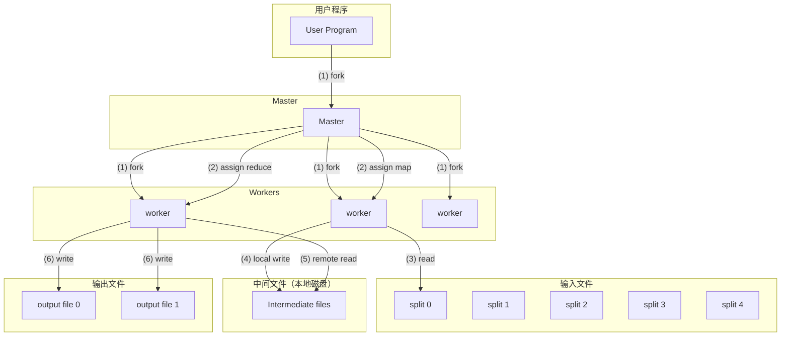

# MapReduce：大规模集群上的简化数据处理

**作者**：Jeffrey Dean, Sanjay Ghemawat  
**年份**：2004  
**会议**：OSDI '04（第 6 届操作系统设计与实现研讨会）

---

## 摘要

MapReduce 是一种编程模型及其相关实现，用于处理和生成大规模数据集。用户指定一个 **map 函数**（Map function）来处理键/值对并生成一组中间键/值对，以及一个 **reduce 函数**（Reduce function）来合并与同一中间键相关的所有中间值。如本文所示，许多实际任务都可以用该模型表达。

以这种函数式风格编写的程序会自动并行化，并在由大量商用机器组成的大型集群上执行。运行时系统负责处理输入数据分区、在机器集合上调度程序执行、处理机器故障以及管理所需的机器间通信等细节。这使得没有任何并行和分布式系统经验的程序员也能轻松利用大型分布式系统的资源。

我们的 MapReduce 实现在由大量商用机器组成的大型集群上运行，具有高度可扩展性：典型的 MapReduce 计算在数千台机器上处理数 TB 的数据。程序员发现该系统易于使用：已有数百个 MapReduce 程序被实现，Google 的集群上每天执行超过一千个 MapReduce 作业。

---

## 1 引言

在过去五年中，作者及 Google 的许多其他人实现了数百个专用计算，用于处理大量原始数据（如爬取的文档、Web 请求日志等），以计算各种派生数据（如倒排索引、Web 文档图结构的各种表示、每个主机爬取页面数量的摘要、给定日期内最频繁查询的集合等）。大多数此类计算在概念上都很简单。然而，输入数据通常很大，计算必须分布在数百或数千台机器上才能在合理时间内完成。如何并行化计算、分发数据以及处理故障等问题，使得原本简单的计算被大量用于处理这些问题的复杂代码所掩盖。

针对这种复杂性，我们设计了一种新的抽象，使我们能够表达我们试图执行的简单计算，同时将并行化、容错、数据分发和负载均衡等繁琐细节隐藏在库中。我们的抽象受到 Lisp 及许多其他函数式语言中存在的 map 和 reduce 原语的启发。我们意识到，我们的大多数计算都涉及对输入中的每个逻辑「记录」应用 map 操作以计算一组中间键/值对，然后对所有共享同一键的值应用 reduce 操作，以适当地合并派生数据。我们使用带有用户指定 map 和 reduce 操作的函数式模型，使我们能够轻松并行化大规模计算，并将重新执行作为容错的主要机制。

本工作的主要贡献是：一个简单而强大的接口，能够实现大规模计算的自动并行化和分发；以及该接口的实现，在由大量商用 PC 组成的大型集群上实现了高性能。第 2 节描述基本编程模型并给出若干示例。第 3 节描述针对我们基于集群的计算环境定制的 MapReduce 接口实现。第 4 节描述我们发现有用的若干编程模型改进。第 5 节给出我们实现针对多种任务的性能测量。第 6 节探讨 MapReduce 在 Google 内的使用，包括我们将其作为生产索引系统重写基础的经验。第 7 节讨论相关工作与未来工作。

---

## 2 编程模型

计算接受一组输入键/值对，并产生一组输出键/值对。MapReduce 库的用户将计算表达为两个函数：**Map** 和 **Reduce**。

由用户编写的 **Map** 接受一个输入对并产生一组中间键/值对。MapReduce 库将与同一中间键 I 相关的所有中间值分组，并将它们传递给 Reduce 函数。

同样由用户编写的 **Reduce 函数**接受一个中间键 I 以及该键的一组值。它将这些值合并成可能更小的一组值。通常每次 Reduce 调用只产生零个或一个输出值。中间值通过迭代器提供给用户的 reduce 函数，这使我们能够处理大到无法放入内存的值列表。

### 2.1 示例

考虑在大规模文档集合中统计每个词出现次数的问题。用户会编写类似以下伪代码的代码：

```python
map(String key, String value):
    // key: document name
    // value: document contents
    for each word w in value:
        EmitIntermediate(w, "1");

reduce(String key, Iterator values):
    // key: a word
    // values: a list of counts
    int result = 0;
    for each v in values:
        result += ParseInt(v);
    Emit(AsString(result));
```

map 函数发出每个词及其关联的出现次数（在此简单示例中仅为「1」）。reduce 函数将针对特定词发出的所有计数相加。

此外，用户编写代码来填充 mapreduce 规范对象，包括输入和输出文件的名称以及可选的调优参数。然后用户调用 MapReduce 函数，传入该规范对象。用户代码与 MapReduce 库（用 C++ 实现）链接在一起。附录 A 包含此示例的完整程序文本。

### 2.2 类型

尽管上述伪代码以字符串输入和输出编写，但从概念上讲，用户提供的 map 和 reduce 函数具有关联的类型：

| 函数 | 类型 |
|------|------|
| map | (k1, v1) → list(k2, v2) |
| reduce | (k2, list(v2)) → list(v2) |

即，输入键和值来自与输出键和值不同的域。此外，中间键和值与输出键和值来自同一域。

我们的 C++ 实现向用户定义的函数传入和传出字符串，由用户代码负责在字符串与适当类型之间进行转换。

### 2.3 更多示例

以下是几个可以轻松表达为 MapReduce 计算的有趣程序的简单示例。

| 程序 | Map 函数 | Reduce 函数 |
|------|----------|-------------|
| **分布式 Grep** | 若某行匹配给定模式则发出该行 | 恒等函数，仅将提供的中间数据复制到输出 |
| **URL 访问频率统计** | 处理网页请求日志，输出 〈URL, 1〉 | 将同一 URL 的所有值相加，发出 〈URL, 总计数〉 对 |
| **反向 Web 链接图** | 对页面 source 中发现的每个指向目标 URL 的链接，输出 〈target, source〉 对 | 连接与给定目标 URL 相关的所有源 URL 列表，发出 〈target, list(source)〉 |
| **每主机词向量** | 对每个输入文档发出 〈hostname, term vector〉 对（hostname 从文档 URL 提取） | 将给定主机的所有每文档词向量相加，丢弃低频词，发出最终的 〈hostname, term vector〉 对 |
| **倒排索引** | 解析每个文档，发出一系列 〈word, document ID〉 对 | 接受给定词的所有对，对相应文档 ID 排序，发出 〈word, list(document ID)〉 对 |
| **分布式排序** | 从每条记录提取键，发出 〈key, record〉 对 | 原样发出所有对（依赖第 4.1 节的分区设施和第 4.2 节的排序属性） |

::: info 词向量说明
词向量（Term Vector）将文档或文档集合中出现的最重要词汇概括为 〈word, frequency〉 对的列表。
:::

---

## 3 实现

MapReduce 接口可以有多种不同的实现。正确的选择取决于环境。例如，一种实现可能适用于小型共享内存机器，另一种适用于大型 NUMA 多处理器，还有一种适用于更大规模的联网机器集合。

本节描述针对 Google 广泛使用的计算环境的实现：由交换以太网连接的大型商用 PC 集群。在我们的环境中：

1. **机器**：通常是双处理器 x86、运行 Linux，每台机器 2–4 GB 内存
2. **网络**：使用商用网络硬件——机器级别通常为 100 Mbps 或 1 Gbps，但整体二分带宽平均要低得多
3. **集群规模**：由数百或数千台机器组成，因此机器故障很常见
4. **存储**：由直接连接到各台机器的廉价 IDE 磁盘提供。使用内部开发的分布式文件系统管理这些磁盘上的数据，该系统通过复制在不可靠硬件之上提供可用性和可靠性
5. **作业调度**：用户向调度系统提交作业。每个作业由一组任务组成，由调度器映射到集群内的一组可用机器

### 3.1 执行概览

通过自动将输入数据分区为 M 个分片，Map 调用分布在多台机器上。输入分片可由不同机器并行处理。Reduce 调用通过使用分区函数（如 `hash(key) mod R`）将中间键空间分区为 R 块来分布。分区数量（R）和分区函数由用户指定。

**图 1：执行概览**



当用户程序调用 MapReduce 函数时，发生以下动作序列（图 1 中的编号与下列列表对应）：

1. **分区输入**：用户程序中的 MapReduce 库首先将输入文件分割成 M 块，通常每块 16–64 MB（可通过可选参数由用户控制）。然后在集群的机器上启动程序的多个副本。

2. **Master 与 Worker**：程序副本中有一个是特殊的——**Master**。其余是 **Worker**，由 Master 分配工作。有 M 个 map 任务和 R 个 reduce 任务需要分配。Master 选择空闲的 Worker，为每个分配一个 map 任务或 reduce 任务。

3. **Map Worker 执行**：被分配 map 任务的 Worker 读取相应输入分片的内容，从输入数据中解析出键/值对，并将每对传递给用户定义的 Map 函数。Map 函数产生的中间键/值对缓存在内存中。

4. **写入本地磁盘**：定期将缓存的键值对写入本地磁盘，按分区函数分区为 R 个区域。这些缓存对在本地磁盘上的位置传回 Master，Master 负责将这些位置转发给 reduce Worker。

5. **Reduce Worker 读取**：当 reduce Worker 从 Master 收到这些位置通知后，使用远程过程调用从 map Worker 的本地磁盘读取缓存数据。当 reduce Worker 读取完所有中间数据后，按中间键排序，使同一键的所有出现归为一组。需要排序是因为通常许多不同的键映射到同一 reduce 任务。若中间数据量太大无法放入内存，则使用外部排序。

6. **Reduce 执行**：reduce Worker 遍历排序后的中间数据，对遇到的每个唯一中间键，将键和相应的中间值集合传递给用户的 Reduce 函数。Reduce 函数的输出追加到该 reduce 分区的最终输出文件中。

7. **完成**：当所有 map 任务和 reduce 任务完成后，Master 唤醒用户程序。此时，用户程序中的 MapReduce 调用返回到用户代码。

成功完成后，mapreduce 执行的输出在 R 个输出文件中可用（每个 reduce 任务一个，文件名由用户指定）。通常，用户不需要将这 R 个输出文件合并为一个——它们常作为另一次 MapReduce 调用的输入，或由能够处理分区为多个文件的输入的另一分布式应用使用。

### 3.2 Master 数据结构

Master 维护若干数据结构。对每个 map 任务和 reduce 任务，它存储状态（空闲、进行中或已完成）以及 Worker 机器的标识（对非空闲任务）。

Master 是中间文件区域位置从 map 任务传播到 reduce 任务的通道。因此，对每个已完成的 map 任务，Master 存储该 map 任务产生的 R 个中间文件区域的位置和大小。随着 map 任务完成，接收对此位置和大小信息的更新。该信息被增量推送给有进行中 reduce 任务的 Worker。

### 3.3 容错

由于 MapReduce 库旨在帮助使用数百或数千台机器处理非常大量的数据，库必须优雅地容忍机器故障。

**Worker 故障**

Master 定期 ping 每个 Worker。若在一定时间内未收到 Worker 的响应，Master 将该 Worker 标记为故障。该 Worker 完成的任何 map 任务被重置回初始空闲状态，因此有资格在其他 Worker 上重新调度。同样，故障 Worker 上正在进行的任何 map 或 reduce 任务也被重置为空闲并有资格重新调度。

已完成的 map 任务在故障时需重新执行，因为其输出存储在故障机器的本地磁盘上，因此无法访问。已完成的 reduce 任务不需要重新执行，因为其输出存储在全局文件系统中。

当 map 任务先由 Worker A 执行，后因 A 故障而由 Worker B 执行时，执行 reduce 任务的所有 Worker 会收到重新执行的通知。任何尚未从 Worker A 读取数据的 reduce 任务将从 Worker B 读取数据。

MapReduce 能够抵御大规模 Worker 故障。例如，在一次 MapReduce 操作期间，运行中集群的网络维护导致每次有 80 台机器在数分钟内无法访问。MapReduce Master 只需重新执行无法访问的 Worker 机器完成的工作，并继续取得进展，最终完成 MapReduce 操作。

**Master 故障**

让 Master 定期写入上述 Master 数据结构的检查点很容易。若 Master 任务死亡，可从上次检查点状态启动新副本。

::: warning Master 故障
然而，鉴于只有一个 Master，其故障不太可能；因此我们当前的实现会在 Master 故障时中止 MapReduce 计算。客户端可以检查此条件，若需要可重试 MapReduce 操作。
:::

**故障下的语义**

当用户提供的 map 和 reduce 运算符是其输入值的确定性函数时，我们的分布式实现产生的输出与整个程序的无故障顺序执行将产生的输出相同。

我们依赖 map 和 reduce 任务输出的原子提交来实现此属性。每个进行中的任务将其输出写入私有临时文件。reduce 任务产生一个此类文件，map 任务产生 R 个此类文件（每个 reduce 任务一个）。当 map 任务完成时，Worker 向 Master 发送消息，并在消息中包含 R 个临时文件的名称。若 Master 收到已完成的 map 任务的完成消息，则忽略该消息。否则，它在 Master 数据结构中记录 R 个文件的名称。

当 reduce 任务完成时，reduce Worker 将其临时输出文件原子地重命名为最终输出文件。若同一 reduce 任务在多台机器上执行，将对同一最终输出文件执行多次重命名调用。我们依赖底层文件系统提供的原子重命名操作，保证最终文件系统状态仅包含 reduce 任务一次执行产生的数据。

我们的大多数 map 和 reduce 运算符是确定性的，在此情况下我们的语义等价于顺序执行，使程序员很容易推理其程序行为。当 map 和/或 reduce 运算符是非确定性时，我们提供较弱但仍合理的语义。在存在非确定性运算符时，特定 reduce 任务 R1 的输出等价于非确定性程序顺序执行产生的 R1 输出。然而，不同 reduce 任务 R2 的输出可能对应于非确定性程序另一次顺序执行产生的 R2 输出。

考虑 map 任务 M 和 reduce 任务 R1、R2。设 e(Ri) 为已提交的 Ri 执行（恰好有一个这样的执行）。较弱语义的出现是因为 e(R1) 可能读取了 M 某次执行的输出，而 e(R2) 可能读取了 M 另一次执行的输出。

### 3.4 局部性

在我们的计算环境中，网络带宽是相对稀缺的资源。我们通过利用输入数据（由 GFS 管理）存储在构成集群的机器本地磁盘上这一事实来节约网络带宽。GFS 将每个文件分成 64 MB 的块，并在不同机器上存储每个块的多个副本（通常 3 个）。MapReduce Master 考虑输入文件的位置信息，尝试在包含相应输入数据副本的机器上调度 map 任务。若做不到，则尝试在包含该任务输入数据副本的机器附近（例如，与包含数据的机器在同一网络交换机上的 Worker 机器）调度 map 任务。

::: tip 局部性优化
当在集群中相当大比例的 Worker 上运行大型 MapReduce 操作时，大多数输入数据从本地读取，不消耗网络带宽。
:::

### 3.5 任务粒度

如上所述，我们将 map 阶段细分为 M 块，reduce 阶段细分为 R 块。理想情况下，M 和 R 应远大于 Worker 机器数量。让每个 Worker 执行许多不同任务可改善动态负载均衡，并在 Worker 故障时加速恢复：其完成的许多 map 任务可分散到所有其他 Worker 机器上。

在我们的实现中，M 和 R 能有多大存在实际限制，因为 Master 必须做出 O(M + R) 次调度决策，并如上所述在内存中保持 O(M × R) 的状态。（然而，内存使用的常数因子很小：O(M × R) 部分的状态每个 map 任务/reduce 任务对约一字节数据。）

此外，R 常受用户约束，因为每个 reduce 任务的输出最终在单独的输出文件中。实践中，我们倾向于选择 M 使每个单独任务大约 16–64 MB 输入数据（使上述局部性优化最有效），并使 R 为我们预期使用的 Worker 机器数量的小倍数。我们常使用 M = 200,000、R = 5,000 和 2,000 台 Worker 机器执行 MapReduce 计算。

### 3.6 备份任务

延长 MapReduce 操作总时间的常见原因之一是「**落后者**」（straggler）：一台机器异常缓慢地完成计算中最后几个 map 或 reduce 任务之一。落后者可能由多种原因造成。例如，磁盘有问题的机器可能经历频繁的可纠正错误，使其读取性能从 30 MB/s 降至 1 MB/s。集群调度系统可能在该机器上调度了其他任务，导致其因竞争 CPU、内存、本地磁盘或网络带宽而更慢地执行 MapReduce 代码。我们最近遇到的一个问题是机器初始化代码中的 bug，导致处理器缓存被禁用：受影响机器上的计算速度降低了超过一百倍。

我们有一个通用机制来缓解落后者问题。当 MapReduce 操作接近完成时，Master 调度剩余进行中任务的备份执行。每当主执行或备份执行完成时，任务即标记为已完成。我们已调整此机制，使其通常将操作使用的计算资源增加不超过几个百分点。我们发现这显著减少了完成大型 MapReduce 操作的时间。例如，第 5.3 节描述的排序程序在禁用备份任务机制时完成时间延长 44%。

---

## 4 改进

尽管仅编写 Map 和 Reduce 函数提供的基本功能对大多数需求已足够，我们发现若干扩展很有用。本节描述这些扩展。

### 4.1 分区函数

MapReduce 的用户指定所需的 reduce 任务/输出文件数量（R）。数据使用中间键上的分区函数在这些任务间分区。提供默认分区函数，使用哈希（如 `hash(key) mod R`）。这往往产生相当均衡的分区。然而，在某些情况下，按键的其他函数分区数据很有用。例如，有时输出键是 URL，我们希望同一主机的所有条目最终在同一输出文件中。为支持此类情况，MapReduce 库的用户可提供特殊的分区函数。例如，使用 `hash(Hostname(urlkey)) mod R` 作为分区函数可使同一主机的所有 URL 最终在同一输出文件中。

### 4.2 排序保证

我们保证在给定分区内，中间键/值对按键的递增顺序处理。此排序保证使按分区生成排序输出文件很容易，当输出文件格式需要支持按键的高效随机访问查找，或输出用户发现数据已排序很方便时很有用。

### 4.3 Combiner 函数

在某些情况下，每个 map 任务产生的中间键存在显著重复，且用户指定的 Reduce 函数满足交换律和结合律。第 2.1 节的词计数示例是一个好例子。由于词频往往服从 Zipf 分布，每个 map 任务将产生数百或数千条形式为 `<the, 1>` 的记录。所有这些计数将通过网络发送到单个 reduce 任务，然后由 Reduce 函数相加产生一个数字。我们允许用户指定可选的 **Combiner 函数**（Combiner function），在数据通过网络发送之前进行部分合并。

Combiner 函数在执行 map 任务的每台机器上执行。通常使用相同代码实现 combiner 和 reduce 函数。reduce 函数与 combiner 函数的唯一区别在于 MapReduce 库如何处理函数输出。reduce 函数的输出写入最终输出文件。combiner 函数的输出写入将发送给 reduce 任务的中间文件。

部分合并显著加速了某些类别的 MapReduce 操作。附录 A 包含使用 combiner 的示例。

### 4.4 输入和输出类型

MapReduce 库支持以多种不同格式读取输入数据。例如，「text」模式输入将每行视为键/值对：键是文件中的偏移量，值是行内容。另一种常见支持的格式存储按键排序的键/值对序列。每种输入类型实现知道如何将自己分割成有意义的范围，以作为单独的 map 任务处理（例如，text 模式的范围分割确保范围分割仅发生在行边界）。用户可通过提供简单读取器接口的实现来添加对新输入类型的支持，尽管大多数用户只使用少量预定义输入类型之一。

读取器不一定需要提供从文件读取的数据。例如，定义从数据库或内存映射数据结构读取记录的读取器很容易。

类似地，我们支持一组输出类型以不同格式产生数据，用户代码很容易添加对新输出类型的支持。

### 4.5 副作用

在某些情况下，MapReduce 用户发现从 map 和/或 reduce 运算符产生辅助文件作为额外输出很方便。我们依赖应用程序编写者使此类副作用具有原子性和幂等性。通常应用程序写入临时文件，并在完全生成后原子地重命名该文件。

我们不支持单个任务产生的多个输出文件的原子两阶段提交。因此，产生具有跨文件一致性要求的多个输出文件的任务应是确定性的。此限制在实践中从未成为问题。

### 4.6 跳过坏记录

有时用户代码中存在 bug，导致 Map 或 Reduce 函数在某些记录上确定性崩溃。此类 bug 阻止 MapReduce 操作完成。通常的做法是修复 bug，但有时不可行；也许 bug 在无法获得源代码的第三方库中。此外，有时忽略少量记录是可接受的，例如在对大型数据集进行统计分析时。我们提供可选的执行模式，MapReduce 库检测哪些记录导致确定性崩溃并跳过这些记录以取得进展。

每个 Worker 进程安装捕获段错误和总线错误的信号处理器。在调用用户 Map 或 Reduce 操作之前，MapReduce 库将参数的序列号存储在全局变量中。若用户代码产生信号，信号处理器发送包含序列号的「临终」UDP 包给 MapReduce Master。当 Master 在特定记录上看到多次失败时，它指示在发出相应 Map 或 Reduce 任务的下次重新执行时应跳过该记录。

### 4.7 本地执行

调试 Map 或 Reduce 函数中的问题可能很棘手，因为实际计算发生在分布式系统中，通常在数千台机器上，工作分配决策由 Master 动态做出。为便于调试、性能分析和小规模测试，我们开发了 MapReduce 库的替代实现，在本地机器上顺序执行 MapReduce 操作的所有工作。向用户提供控制，使计算可限于特定 map 任务。用户使用特殊标志调用其程序，然后可轻松使用任何他们认为有用的调试或测试工具（如 gdb）。

### 4.8 状态信息

Master 运行内部 HTTP 服务器并导出供人查看的一组状态页面。状态页面显示计算进度，如已完成多少任务、多少正在进行、输入字节数、中间数据字节数、输出字节数、处理速率等。页面还包含指向每个任务生成的标准错误和标准输出文件的链接。用户可使用此数据预测计算将花费多长时间，以及是否应向计算添加更多资源。这些页面还可用于判断计算何时比预期慢得多。

此外，顶级状态页面显示哪些 Worker 已故障，以及它们故障时正在处理哪些 map 和 reduce 任务。此信息在尝试诊断用户代码中的 bug 时很有用。

### 4.9 计数器

MapReduce 库提供计数器设施以统计各种事件的发生次数。例如，用户代码可能想统计处理的词总数或索引的德语文档数量等。

要使用此设施，用户代码创建命名计数器对象，然后在 Map 和/或 Reduce 函数中适当递增计数器。例如：

```python
Counter* uppercase;
uppercase = GetCounter("uppercase");
map(String name, String contents):
    for each word w in contents:
        if (IsCapitalized(w)):
            uppercase->Increment();
        EmitIntermediate(w, "1");
```

来自各 Worker 机器的计数器值定期传播到 Master（搭载在 ping 响应上）。Master 聚合来自成功 map 和 reduce 任务的计数器值，并在 MapReduce 操作完成时将其返回给用户代码。当前计数器值也显示在 Master 状态页面上，以便人可观察实时计算进度。在聚合计数器值时，Master 消除同一 map 或 reduce 任务重复执行的影响以避免重复计数。（重复执行可能来自我们对备份任务的使用以及因故障而重新执行任务。）

某些计数器值由 MapReduce 库自动维护，如处理的输入键/值对数量和产生的输出键/值对数量。

用户发现计数器设施对 sanity 检查 MapReduce 操作行为很有用。例如，在某些 MapReduce 操作中，用户代码可能想确保产生的输出对数量恰好等于处理的输入对数量，或德语文档处理比例在处理的文档总数的一定可容忍比例内。

---

## 5 性能

本节我们测量 MapReduce 在大型机器集群上运行两种计算的性能。一种计算在大约 1 TB 数据中搜索特定模式。另一种计算对大约 1 TB 数据进行排序。

这两个程序代表了 MapReduce 用户编写的真实程序的一大子集——一类程序将数据从一种表示洗牌到另一种，另一类从大型数据集中提取少量有趣数据。

### 5.1 集群配置

所有程序在由大约 1800 台机器组成的集群上执行。每台机器有两个 2GHz Intel Xeon 处理器（启用超线程）、4GB 内存、两个 160GB IDE 磁盘和千兆以太网链路。机器布置在两级树形交换网络中，根处约有 100–200 Gbps 聚合带宽。所有机器在同一托管设施中，因此任意两台机器间的往返时间小于一毫秒。

在 4GB 内存中，约 1–1.5GB 被集群上运行的其他任务保留。程序在周末下午执行，此时 CPU、磁盘和网络大多空闲。

### 5.2 Grep

grep 程序扫描 10¹⁰ 条 100 字节记录，搜索相对罕见的三字符模式（该模式在 92,337 条记录中出现）。输入分割为约 64MB 的块（M = 15000），整个输出放在一个文件中（R = 1）。

**图 2：随时间的数据传输速率**

```
输入速率 (MB/s)
    ^
30000|                                    *
    |                               *
    |                          *
    |                     *
    |                *
20000|           *
    |      *
    | *
10000|*
    |
   0+----+----+----+----+----+----> 时间 (秒)
        20   40   60   80  100
```

Y 轴显示输入数据被扫描的速率。随着更多机器被分配给此 MapReduce 计算，速率逐渐上升，当 1764 个 Worker 被分配时达到超过 30 GB/s 的峰值。随着 map 任务完成，速率开始下降，在计算开始约 80 秒时降至零。整个计算从开始到结束约需 150 秒，包括约一分钟的启动开销。开销来自程序向所有 Worker 机器的传播，以及与 GFS 交互以打开 1000 个输入文件集合并获取局部性优化所需信息的延迟。

### 5.3 排序

排序程序对 10¹⁰ 条 100 字节记录（约 1 TB 数据）进行排序。该程序仿照 TeraSort 基准测试建模。

排序程序由不到 50 行用户代码组成。三行 Map 函数从文本行提取 10 字节排序键并发出键和原始文本行作为中间键/值对。我们使用内置的 Identity 函数作为 Reduce 运算符，该函数将中间键/值对原样作为输出键/值对传递。最终排序输出写入一组 2 路复制的 GFS 文件（即程序输出写入 2 TB）。

与之前一样，输入数据分割为 64MB 块（M = 15000）。我们将排序输出分区为 4000 个文件（R = 4000）。分区函数使用键的初始字节将其划分到 R 块之一。我们为此基准的分区函数内置了键分布的知识。在通用排序程序中，我们会添加预扫描 MapReduce 操作来收集键样本，并使用采样键的分布计算最终排序扫描的分割点。

**图 3 (a)：正常执行**

```
输入速率 (MB/s)     Shuffle (MB/s)      输出速率 (MB/s)
    ^                   ^                    ^
15000|  *            15000|    ***        15000|        ***
    | * *               |   *   *            |       *
    |*   *              |  *     *           |      *
10000|    *           10000| *       *      10000|    *
    |     *               |*         *          |   *
    |      *              |          *          |  *
 5000|       *          5000|           *    5000| *
    |        *              |            *       |
   0+---------> 500 1000    0+---------> 500 1000  0+---------> 500 1000
        秒                      秒                    秒
```

左上图显示输入被读取的速率。速率在约 13 GB/s 达到峰值，然后相当快地衰减，因为所有 map 任务在 200 秒内完成。注意输入速率低于 grep，因为排序 map 任务约一半时间和 I/O 带宽用于将中间输出写入其本地磁盘。grep 的相应中间输出大小可忽略。

左中图显示数据从 map 任务通过网络发送到 reduce 任务的速率。此 shuffle 在第一个 map 任务完成后立即开始。图中第一个凸起是第一批约 1700 个 reduce 任务（整个 MapReduce 分配了约 1700 台机器，每台机器一次最多执行一个 reduce 任务）。计算开始约 300 秒后，这批 reduce 任务中的一些完成，我们开始为剩余 reduce 任务 shuffle 数据。所有 shuffle 在计算开始约 600 秒时完成。

左下图显示 reduce 任务将排序数据写入最终输出文件的速率。第一批 shuffle 结束与写入开始之间存在延迟，因为机器正忙于对中间数据进行排序。写入以约 2–4 GB/s 的速率持续一段时间。所有写入在计算开始约 850 秒时完成。包括启动开销，整个计算耗时 891 秒。这与 TeraSort 基准测试当前最佳报告的 1057 秒结果类似。

需注意几点：输入速率高于 shuffle 速率和输出速率，因为我们的局部性优化——大多数数据从本地磁盘读取，绕过了我们相对带宽受限的网络。shuffle 速率高于输出速率，因为输出阶段写入排序数据的两个副本（我们为可靠性和可用性制作两个副本）。我们写入两个副本是因为这是我们底层文件系统提供的可靠性和可用性机制。若底层文件系统使用纠删码而非复制，写入数据的网络带宽需求将减少。

### 5.4 备份任务的效果

在图 3 (b) 中，我们展示禁用备份任务时排序程序的执行。执行流程与图 3 (a) 类似，除了存在一个几乎没有写入活动的很长尾部。960 秒后，除 5 个外所有 reduce 任务都已完成。然而这些最后的落后者直到 300 秒后才完成。整个计算耗时 1283 秒，耗时增加 44%。

### 5.5 机器故障

在图 3 (c) 中，我们展示排序程序的执行，其中我们在计算开始几分钟后故意杀死了 1746 个 Worker 进程中的 200 个。底层集群调度器立即在这些机器上重启新的 Worker 进程（因为只杀死了进程，机器仍正常运行）。

Worker 死亡表现为负的输入速率，因为一些先前完成的 map 工作消失（因为相应的 map Worker 被杀死）需要重做。此 map 工作的重新执行相对较快。包括启动开销，整个计算在 933 秒内完成（仅比正常执行时间增加 5%）。

---

## 6 经验

我们在 2003 年 2 月编写了 MapReduce 库的第一个版本，并在 2003 年 8 月对其进行了重大增强，包括局部性优化、Worker 机器间任务执行的动态负载均衡等。自那时起，我们惊喜地发现 MapReduce 库对我们处理的问题类型具有多么广泛的适用性。

它已在 Google 内的广泛领域中使用，包括：

- 大规模机器学习问题
- Google News 和 Froogle 产品的聚类问题
- 提取用于生成热门查询报告的数据（如 Google Zeitgeist）
- 提取网页属性用于新实验和产品（如从大型网页语料库中提取地理位置用于本地化搜索）
- 大规模图计算

**图 4：MapReduce 实例随时间的变化**

```
源代码树中的实例数
    ^
1000|
    |                                    *
    |                               *
    |                          *
 800|                     *
    |                *
    |           *
 600|      *
    | *
 400|*
    |
 200|
    |
   0+----+----+----+----+----+----+----> 时间
    03/03 06  09  12  04/03 06  09
```

图 4 显示我们主要源代码管理系统中签入的独立 MapReduce 程序数量的显著增长，从 2003 年初的 0 个到 2004 年 9 月底的近 900 个独立实例。MapReduce 如此成功，是因为它使编写简单程序并在半小时内在千台机器上高效运行成为可能，大大加快了开发和原型周期。此外，它使没有分布式和/或并行系统经验的程序员能够轻松利用大量资源。

在每个作业结束时，MapReduce 库记录作业使用的计算资源统计信息。表 1 显示 2004 年 8 月在 Google 运行的 MapReduce 作业子集的一些统计信息。

| 指标 | 数值 |
|------|------|
| 作业数量 | 29,423 |
| 平均作业完成时间 | 634 秒 |
| 使用的机器天数 | 79,186 天 |
| 读取的输入数据 | 3,288 TB |
| 产生的中间数据 | 758 TB |
| 写入的输出数据 | 193 TB |
| 每作业平均 Worker 机器数 | 157 |
| 每作业平均 Worker 死亡数 | 1.2 |
| 每作业平均 map 任务数 | 3,351 |
| 每作业平均 reduce 任务数 | 55 |
| 唯一 map 实现数 | 395 |
| 唯一 reduce 实现数 | 269 |
| 唯一 map/reduce 组合数 | 426 |

### 6.1 大规模索引

我们迄今为止 MapReduce 最重要的用途之一是生产索引系统的完全重写，该系统产生用于 Google 网页搜索服务的数据结构。索引系统以爬虫系统检索的大量文档集作为输入，存储为一组 GFS 文件。这些文档的原始内容超过 20 TB 数据。索引过程作为五到十个 MapReduce 操作的序列运行。使用 MapReduce（而非索引系统先前版本中的临时分布式扫描）带来了若干好处：

- **代码简化**：索引代码更简单、更小、更易理解，因为处理容错、分发和并行化的代码隐藏在 MapReduce 库中。例如，计算的一个阶段在改用 MapReduce 表达时，从约 3800 行 C++ 代码降至约 700 行。

- **性能足够**：MapReduce 库的性能足够好，我们可以保持概念上无关的计算分离，而不是混合在一起以避免对数据的额外扫描。这使得更改索引过程很容易。例如，在我们旧索引系统中需要几个月才能完成的一项更改，在新系统中只需几天即可实现。

- **运维简化**：索引过程变得更容易运维，因为机器故障、慢机器和网络 hiccup 引起的大多数问题由 MapReduce 库自动处理，无需操作员干预。此外，通过向索引集群添加新机器来改善索引过程性能很容易。

---

## 7 相关工作

许多系统提供了受限的编程模型，并利用这些限制自动并行化计算。例如，结合函数可以在 N 个处理器上使用并行前缀计算在 log N 时间内对 N 元数组的所有前缀进行计算。基于我们对大型实际计算的经验，MapReduce 可视为这些模型的简化和提炼。更重要的是，我们提供了可扩展到数千处理器的容错实现。相比之下，大多数并行处理系统仅在较小规模上实现，并将处理机器故障的细节留给程序员。

BSP（Bulk Synchronous Programming，批量同步编程）和一些 MPI 原语提供了更高级的抽象，使程序员更容易编写并行程序。这些系统与 MapReduce 的关键区别在于，MapReduce 利用受限的编程模型自动并行化用户程序并提供透明的容错。

我们的局部性优化从 active disks 等技术中获得灵感，其中计算被推入靠近本地磁盘的处理单元，以减少通过 I/O 子系统或网络发送的数据量。我们在直接连接少量磁盘的商用处理器上运行，而不是直接在磁盘控制器处理器上运行，但总体方法类似。

我们的备份任务机制类似于 Charlotte 系统采用的 eager scheduling 机制。简单 eager scheduling 的一个缺点是，若给定任务导致重复失败，整个计算无法完成。我们用跳过坏记录的机制修复了此问题的某些实例。

MapReduce 实现依赖内部集群管理系统，负责在大量共享机器集合上分发和运行用户任务。尽管不是本文重点，该集群管理系统在精神上与其他系统（如 Condor）类似。

MapReduce 库一部分的排序设施在操作上与 NOW-Sort 类似。源机器（map Worker）分区待排序数据并发送给 R 个 reduce Worker 之一。每个 reduce Worker 在本地（若可能则在内存中）对其数据排序。当然 NOW-Sort 没有使我们的库广泛适用的用户可定义 Map 和 Reduce 函数。

River 提供了一种编程模型，其中进程通过分布式队列发送数据相互通信。与 MapReduce 一样，River 系统试图在存在异构硬件或系统扰动引入的非均匀性时提供良好的平均情况性能。River 通过仔细调度磁盘和网络传输以实现均衡的完成时间来实现此目标。MapReduce 采用不同方法。通过限制编程模型，MapReduce 框架能够将问题分区为大量细粒度任务。这些任务在可用 Worker 上动态调度，使更快的 Worker 处理更多任务。受限的编程模型还允许我们在作业结束时调度任务的冗余执行，这在存在非均匀性（如慢或卡住的 Worker）时大大减少完成时间。

BAD-FS 的编程模型与 MapReduce 非常不同，且与 MapReduce 不同，它针对广域网上作业的执行。然而，有两个根本相似之处。(1) 两个系统都使用冗余执行从故障引起的数据丢失中恢复。(2) 两个系统都使用感知局部性的调度来减少通过拥塞网络链路发送的数据量。

TACC 是旨在简化高可用网络服务构建的系统。与 MapReduce 一样，它依赖重新执行作为实现容错的机制。

---

## 8 结论

MapReduce 编程模型已在 Google 成功用于多种不同目的。我们将此成功归因于几个原因。首先，该模型易于使用，即使对没有并行和分布式系统经验的程序员也是如此，因为它隐藏了并行化、容错、局部性优化和负载均衡的细节。其次，大量问题可以轻松表达为 MapReduce 计算。例如，MapReduce 用于生成 Google 生产网页搜索服务的数据、排序、数据挖掘、机器学习以及许多其他系统。第三，我们开发了可扩展到由数千台机器组成的大型机器集群的 MapReduce 实现。该实现有效利用这些机器资源，因此适用于 Google 遇到的许多大型计算问题。

我们从这项工作中学到了几件事。首先，限制编程模型使并行化和分发计算以及使此类计算具有容错性变得容易。其次，网络带宽是稀缺资源。因此，我们系统中的若干优化针对减少通过网络发送的数据量：局部性优化使我们能够从本地磁盘读取数据，将中间数据的单份副本写入本地磁盘节省了网络带宽。第三，冗余执行可用于减少慢机器的影响，并处理机器故障和数据丢失。

---

## 致谢

Josh Levenberg 在根据其使用 MapReduce 的经验和他人对增强的建议修订和扩展用户级 MapReduce API 方面发挥了关键作用。MapReduce 从 Google 文件系统读取输入并写入输出。我们要感谢 Mohit Aron、Howard Gobioff、Markus Gutschke、David Kramer、Shun-Tak Leung 和 Josh Redstone 在开发 GFS 方面的工作。我们还要感谢 Percy Liang 和 Olcan Sercinoglu 在开发 MapReduce 使用的集群管理系统方面的工作。Mike Burrows、Wilson Hsieh、Josh Levenberg、Sharon Perl、Rob Pike 和 Debby Wallach 对本文早期草稿提供了有益评论。匿名 OSDI 审稿人以及我们的 shepherd Eric Brewer 对论文可改进的领域提供了许多有用建议。最后，我们感谢 Google 工程组织中 MapReduce 的所有用户提供的有益反馈、建议和 bug 报告。

---

## 附录 A：词频统计

本节包含一个程序，用于统计命令行指定的输入文件集中每个唯一词的出现次数。

```cpp
#include "mapreduce/mapreduce.h"

// User's map function
class WordCounter : public Mapper {
public:
  virtual void Map(const MapInput& input) {
    const string& text = input.value();
    const int n = text.size();
    for (int i = 0; i < n; ) {
      // Skip past leading whitespace
      while ((i < n) && isspace(text[i]))
        i++;
      // Find word end
      int start = i;
      while ((i < n) && !isspace(text[i]))
        i++;
      if (start < i)
        Emit(text.substr(start,i-start),"1");
    }
  }
};
REGISTER_MAPPER(WordCounter);

// User's reduce function
class Adder : public Reducer {
  virtual void Reduce(ReduceInput* input) {
    // Iterate over all entries with the
    // same key and add the values
    int64 value = 0;
    while (!input->done()) {
      value += StringToInt(input->value());
      input->NextValue();
    }
    // Emit sum for input->key()
    Emit(IntToString(value));
  }
};
REGISTER_REDUCER(Adder);

int main(int argc, char** argv) {
  ParseCommandLineFlags(argc, argv);
  MapReduceSpecification spec;

  // Store list of input files into "spec"
  for (int i = 1; i < argc; i++) {
    MapReduceInput* input = spec.add_input();
    input->set_format("text");
    input->set_filepattern(argv[i]);
    input->set_mapper_class("WordCounter");
  }

  // Specify the output files:
  //   /gfs/test/freq-00000-of-00100
  //   /gfs/test/freq-00001-of-00100
  //   ...
  MapReduceOutput* out = spec.output();
  out->set_filebase("/gfs/test/freq");
  out->set_num_tasks(100);
  out->set_format("text");
  out->set_reducer_class("Adder");
  // Optional: do partial sums within map
  // tasks to save network bandwidth
  out->set_combiner_class("Adder");

  // Tuning parameters: use at most 2000
  // machines and 100 MB of memory per task
  spec.set_machines(2000);
  spec.set_map_megabytes(100);
  spec.set_reduce_megabytes(100);

  // Now run it
  MapReduceResult result;
  if (!MapReduce(spec, &result)) abort();

  // Done: 'result' structure contains info
  // about counters, time taken, number of
  // machines used, etc.
  return 0;
}
```

---

## 参考文献

[1] Andrea C. Arpaci-Dusseau, Remzi H. Arpaci-Dusseau, David E. Culler, Joseph M. Hellerstein, and David A. Patterson. High-performance sorting on networks of workstations. In Proceedings of the 1997 ACM SIGMOD International Conference on Management of Data, Tucson, Arizona, May 1997.

[2] Remzi H. Arpaci-Dusseau, Eric Anderson, Noah Treuhaft, David E. Culler, Joseph M. Hellerstein, David Patterson, and Kathy Yelick. Cluster I/O with River: Making the fast case common. In Proceedings of the Sixth Workshop on Input/Output in Parallel and Distributed Systems (IOPADS '99), pages 10–22, Atlanta, Georgia, May 1999.

[3] Arash Baratloo, Mehmet Karaul, Zvi Kedem, and Peter Wyckoff. Charlotte: Metacomputing on the web. In Proceedings of the 9th International Conference on Parallel and Distributed Computing Systems, 1996.

[4] Luiz A. Barroso, Jeffrey Dean, and Urs Hölzle. Web search for a planet: The Google cluster architecture. IEEE Micro, 23(2):22–28, April 2003.

[5] John Bent, Douglas Thain, Andrea C. Arpaci-Dusseau, Remzi H. Arpaci-Dusseau, and Miron Livny. Explicit control in a batch-aware distributed file system. In Proceedings of the 1st USENIX Symposium on Networked Systems Design and Implementation NSDI, March 2004.

[6] Guy E. Blelloch. Scans as primitive parallel operations. IEEE Transactions on Computers, C-38(11), November 1989.

[7] Armando Fox, Steven D. Gribble, Yatin Chawathe, Eric A. Brewer, and Paul Gauthier. Cluster-based scalable network services. In Proceedings of the 16th ACM Symposium on Operating System Principles, pages 78–91, Saint-Malo, France, 1997.

[8] Sanjay Ghemawat, Howard Gobioff, and Shun-Tak Leung. The Google file system. In 19th Symposium on Operating Systems Principles, pages 29–43, Lake George, New York, 2003.

[9] S. Gorlatch. Systematic efficient parallelization of scan and other list homomorphisms. In L. Bouge, P. Fraigniaud, A. Mignotte, and Y. Robert, editors, Euro-Par'96. Parallel Processing, Lecture Notes in Computer Science 1124, pages 401–408. Springer-Verlag, 1996.

[10] Jim Gray. Sort benchmark home page. http://research.microsoft.com/barc/SortBenchmark/.

[11] William Gropp, Ewing Lusk, and Anthony Skjellum. Using MPI: Portable Parallel Programming with the Message-Passing Interface. MIT Press, Cambridge, MA, 1999.

[12] L. Huston, R. Sukthankar, R. Wickremesinghe, M. Satyanarayanan, G. R. Ganger, E. Riedel, and A. Ailamaki. Diamond: A storage architecture for early discard in interactive search. In Proceedings of the 2004 USENIX File and Storage Technologies FAST Conference, April 2004.

[13] Richard E. Ladner and Michael J. Fischer. Parallel prefix computation. Journal of the ACM, 27(4):831–838, 1980.

[14] Michael O. Rabin. Efficient dispersal of information for security, load balancing and fault tolerance. Journal of the ACM, 36(2):335–348, 1989.

[15] Erik Riedel, Christos Faloutsos, Garth A. Gibson, and David Nagle. Active disks for large-scale data processing. IEEE Computer, pages 68–74, June 2001.

[16] Douglas Thain, Todd Tannenbaum, and Miron Livny. Distributed computing in practice: The Condor experience. Concurrency and Computation: Practice and Experience, 2004.

[17] L. G. Valiant. A bridging model for parallel computation. Communications of the ACM, 33(8):103–111, 1997.

[18] Jim Wyllie. Spsort: How to sort a terabyte quickly. http://alme1.almaden.ibm.com/cs/spsort.pdf.

---

[← 返回目录](index.md) | [下一篇：GFS →](gfs.md)
