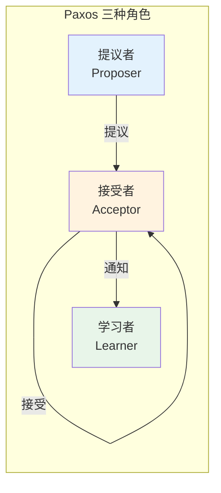
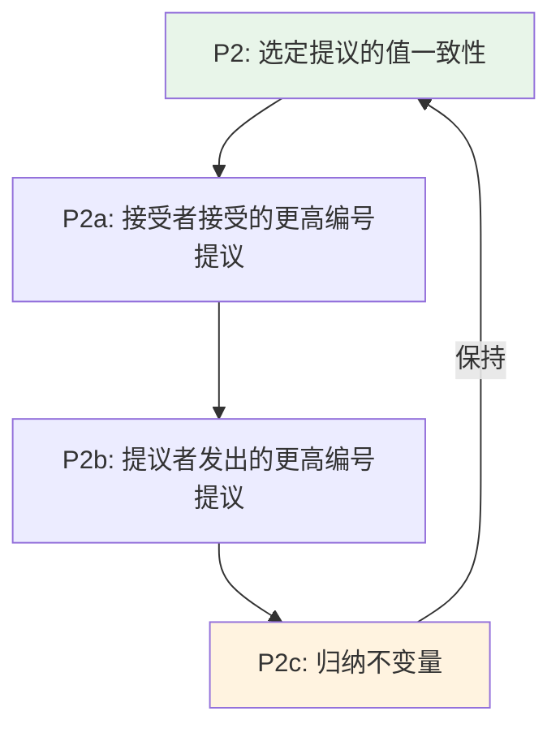
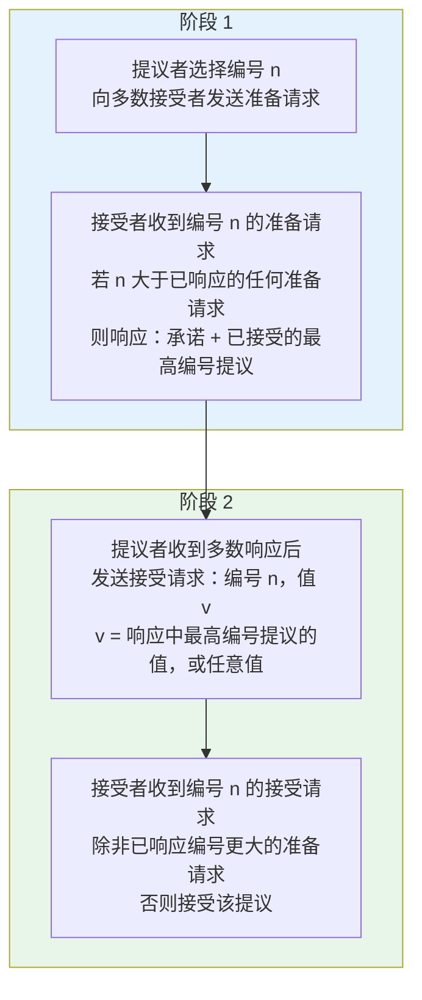
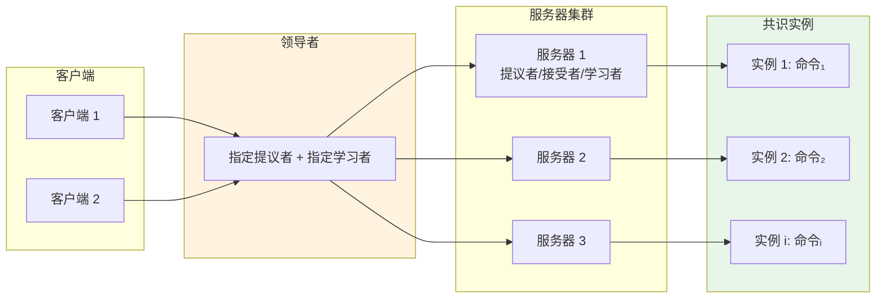

# Paxos Made Simple

**作者**：Leslie Lamport  
**年份**：2001

---

## 摘要

用通俗英语表述时，Paxos 算法非常简单。

---

## 目录

1. [引言](#1-引言)
2. [共识算法](#2-共识算法)
   - 2.1 [问题描述](#21-问题描述)
   - 2.2 [选择一个值](#22-选择一个值)
   - 2.3 [学习已选定的值](#23-学习已选定的值)
   - 2.4 [进展](#24-进展)
   - 2.5 [实现](#25-实现)
3. [实现状态机](#3-实现状态机)
4. [参考文献](#参考文献)

---

## 1 引言

实现容错分布式系统的 Paxos 算法一直被认为难以理解，或许是因为原始表述对许多读者来说如同天书 [5]。事实上，它是分布式算法中最简单、最显而易见的算法之一。其核心是一个共识算法（consensus algorithm）——即 [5] 中的「元老院」（synod）算法。下一节将表明，这个共识算法几乎不可避免地由我们期望它满足的性质推导而来。最后一节解释完整的 Paxos 算法，它是通过将共识直接应用于构建分布式系统的状态机方法而得到的——这种方法应该广为人知，因为它是分布式系统理论中可能被引用最多的文章的主题 [4]。

---

## 2 共识算法

### 2.1 问题描述

假设有一组可以提议值（propose values）的进程。共识算法确保在提议的值中选定（chosen）唯一一个。如果没有值被提议，则不应选定任何值。如果某个值已被选定，则进程应当能够学习（learn）该选定的值。共识的安全性（safety）要求是：

::: tip 共识算法的安全性要求
- **只有被提议过的值才能被选定**
- **只能选定一个值**
- **进程只有在值确实已被选定的情况下，才能得知该值已被选定**
:::

我们不会试图精确规定活性（liveness）要求。然而，目标是确保某个提议的值最终被选定，并且如果某个值已被选定，则进程最终能够学习到该值。

我们让共识算法中的三种角色由三类代理（agent）执行：提议者（proposer）、接受者（acceptor）和学习者（learner）。在实现中，单个进程可以充当多个代理，但代理到进程的映射在此不关心。



**图：提议者、接受者与学习者的关系**

假设代理之间通过发送消息进行通信。我们采用惯常的异步、非拜占庭（non-Byzantine）模型，其中：

::: warning 系统模型假设
- **代理以任意速度运行，可能因停止而故障，也可能重启**。由于在某个值被选定后，所有代理都可能故障然后重启，因此除非某个故障并重启的代理能够记住某些信息，否则不可能有解。
- **消息的传递可能任意延迟，可能重复，可能丢失，但不会被篡改**。
:::

### 2.2 选择一个值

选择值的最简单方式是只有一个接受者代理。提议者向接受者发送提议，接受者选择它收到的第一个提议值。虽然简单，但这种方案不可接受，因为接受者的故障会使任何进一步进展成为不可能。

因此，让我们尝试另一种选择值的方式。不用单个接受者，而使用多个接受者代理。提议者向一组接受者发送提议值。接受者可以接受（accept）该提议值。当足够多的接受者集合接受了该值时，该值就被选定。多大才算足够？为确保只选定一个值，我们可以让足够大的集合由任意多数（majority）的代理组成。因为任意两个多数至少有一个共同的接受者，所以只要一个接受者最多只能接受一个值，这就可行。（多数有一个明显的推广，已在众多论文中观察到，似乎始于 [3]。）

在无故障或消息丢失的情况下，我们希望即使只有一个提议者提议了一个值，该值也能被选定。这暗示了以下要求：

**P1.** 接受者必须接受它收到的第一个提议。

但这一要求引发了一个问题。不同的提议者可能几乎同时提议多个值，导致每个接受者都接受了某个值，但没有单个值被多数接受者接受的情况。即使只有两个提议值，如果每个被大约一半的接受者接受，单个接受者的故障就可能使人们无法得知哪个值被选定。

P1 与「只有当值被多数接受者接受时才被选定」的要求意味着，必须允许接受者接受多个提议。我们通过为每个提议分配一个（自然）数来跟踪接受者可能接受的不同提议，因此提议由提议编号（proposal number）和值组成。为避免混淆，我们要求不同提议具有不同的编号。如何实现这一点取决于具体实现，目前我们仅假设如此。当具有某值的单个提议被多数接受者接受时，该值被选定。在这种情况下，我们说该提议（及其值）已被选定。

我们可以允许多个提议被选定，但必须保证所有被选定的提议具有相同的值。通过对提议编号进行归纳，只需保证：

**P2.** 如果具有值 v 的提议被选定，则每个被选定的更高编号的提议都具有值 v。

由于编号是全序的，条件 P2 保证了关键的安全性：只选定一个值。

要被选定，提议必须被至少一个接受者接受。因此，我们可以通过满足以下条件来满足 P2：

**P2a.** 如果具有值 v 的提议被选定，则每个被任意接受者接受的更高编号的提议都具有值 v。

我们仍然保持 P1 以确保某个提议被选定。由于通信是异步的，某个提议可能被选定，而某个特定的接受者 c 从未收到任何提议。假设一个新的提议者「醒来」并发出一个具有不同值的更高编号的提议。P1 要求 c 接受该提议，这就违反了 P2a。同时保持 P1 和 P2a 需要将 P2a 加强为：

**P2b.** 如果具有值 v 的提议被选定，则每个由任意提议者发出的更高编号的提议都具有值 v。

由于提议在被接受者接受之前必须由提议者发出，P2b 蕴含 P2a，而 P2a 又蕴含 P2。

为发现如何满足 P2b，让我们考虑如何证明它成立。我们假设某个编号为 m、值为 v 的提议被选定，并证明任何编号为 n > m 发出的提议也具有值 v。我们通过对 n 进行归纳来简化证明，因此可以在额外假设「每个编号在 m..(n−1) 范围内发出的提议都具有值 v」下证明编号为 n 的提议具有值 v，其中 i..j 表示从 i 到 j 的整数集合。为使编号为 m 的提议被选定，必须存在由多数接受者组成的集合 C，使得 C 中的每个接受者都接受了它。结合归纳假设，m 被选定的假设意味着：

::: tip 归纳假设
C 中的每个接受者都接受了编号在 m..(n−1) 范围内的提议，且被任意接受者接受的编号在 m..(n−1) 范围内的每个提议都具有值 v。
:::

由于由多数接受者组成的任意集合 S 至少包含 C 的一个成员，我们可以通过确保以下不变量（invariant）成立来得出结论：编号为 n 的提议具有值 v。

**P2c.** 对于任意 v 和 n，如果具有值 v 和编号 n 的提议被发出，则存在由多数接受者组成的集合 S，使得：(a) S 中没有任何接受者接受过编号小于 n 的提议，或 (b) v 是 S 中接受者所接受的编号小于 n 的所有提议中编号最高的提议的值。

因此，我们可以通过保持 P2c 的不变性来满足 P2b。



**图：安全性条件的推导链（P2 ⟹ P2a ⟹ P2b，P2c 蕴含 P2b）**

为保持 P2c 的不变性，想要发出编号为 n 的提议的提议者必须了解：在某个多数接受者中，每个接受者已经接受或将要接受的编号小于 n 的最高编号提议。了解已接受的提议足够容易；预测未来的接受则很困难。提议者不是试图预测未来，而是通过提取「不会有此类接受」的承诺来控制未来。换句话说，提议者请求接受者不再接受任何编号小于 n 的提议。这导致了以下发出提议的算法：

::: details 发出提议的算法

**步骤 1.** 提议者选择一个新的提议编号 n，并向某个接受者集合的每个成员发送请求，要求其响应：
- (a) 承诺不再接受编号小于 n 的提议，以及
- (b) 它已接受的编号小于 n 的最高编号提议（如果有的话）

我将此类请求称为编号为 n 的 **准备请求**（prepare request）。

**步骤 2.** 如果提议者收到来自多数接受者的所请求的响应，则它可以发出编号为 n、值为 v 的提议，其中 v 是响应中编号最高的提议的值，或者如果响应者报告没有提议，则 v 是提议者选择的任意值。

提议者通过向某个接受者集合发送请求该提议被接受的请求来发出提议。（这不必与响应初始请求的接受者集合相同。）我们称之为 **接受请求**（accept request）。

:::

这描述了提议者的算法。接受者呢？它可以收到来自提议者的两类请求：准备请求和接受请求。接受者可以忽略任何请求而不损害安全性。因此，我们只需说明何时允许它响应请求。它总是可以响应准备请求。它可以响应接受请求并接受该提议，当且仅当它没有承诺不这样做。换句话说：

**P1a.** 接受者可以接受编号为 n 的提议，当且仅当它尚未响应过编号大于 n 的准备请求。

注意 P1a 蕴含 P1。

我们现在有了一个满足所需安全性性质的完整的选择值算法——假设提议编号唯一。最终算法通过对一个小的优化而得到。

假设接受者收到编号为 n 的准备请求，但它已经响应过编号大于 n 的准备请求，从而承诺不接受任何编号为 n 的新提议。那么接受者没有理由响应新的准备请求，因为它不会接受提议者想要发出的编号为 n 的提议。因此我们让接受者忽略此类准备请求。我们还让它忽略它已经接受过的提议的准备请求。

通过这一优化，接受者只需记住它曾经接受的最高编号提议，以及它已响应的最高编号准备请求的编号。由于无论发生何种故障，P2c 都必须保持不变量，接受者必须在故障并重启后仍记住这些信息。注意，提议者总是可以放弃一个提议并完全忘记它——只要它不再尝试发出具有相同编号的另一个提议。

将提议者和接受者的动作合在一起，我们看到算法按以下两个阶段运行：



**阶段 1.**  
(a) 提议者选择提议编号 n，向多数接受者发送编号为 n 的准备请求。  
(b) 如果接受者收到的准备请求编号 n 大于它已响应的任何准备请求的编号，则它响应该请求，承诺不再接受编号小于 n 的提议，并附上它已接受的最高编号提议（如果有）。

**阶段 2.**  
(a) 如果提议者收到来自多数接受者对其准备请求（编号 n）的响应，则它向这些接受者中的每一个发送编号为 n、值为 v 的提议的接受请求，其中 v 是响应中编号最高的提议的值，或者如果响应报告没有提议，则 v 为任意值。  
(b) 如果接受者收到编号为 n 的提议的接受请求，它接受该提议，除非它已经响应过编号大于 n 的准备请求。

提议者可以发出多个提议，只要它对每一个都遵循该算法。它可以在协议中途随时放弃一个提议。（正确性得以保持，即使该提议的请求和/或响应可能在提议被放弃很久之后才到达目的地。）如果某个提议者已开始尝试发出更高编号的提议，放弃当前提议可能是个好主意。因此，如果接受者因为已收到编号更大的准备请求而忽略准备或接受请求，它或许应该通知提议者，提议者随后应放弃其提议。这是不影响正确性的性能优化。

### 2.3 学习已选定的值

要得知某个值已被选定，学习者必须发现某个提议已被多数接受者接受。

::: tip 学习者得知选定值的策略

**策略 1：直接通知**  
显而易见的算法是让每个接受者在每次接受提议时向所有学习者响应，向它们发送该提议。这使学习者能尽快得知选定的值，但需要每个接受者向每个学习者响应——响应数量等于接受者数量与学习者数量的乘积。

**策略 2：指定学习者（distinguished learner）**  
非拜占庭故障的假设使得一个学习者可以容易地从另一个学习者那里得知某个值已被接受。我们可以让接受者将它们的接受情况响应给一个指定学习者，该学习者再在值被选定时通知其他学习者。响应数量仅为接受者数量与学习者数量之和，但需要额外一轮，且指定学习者可能成为单点故障。

**策略 3：多指定学习者**  
使用更大的指定学习者集合以更高的通信复杂度为代价提供更高的可靠性。

:::

由于消息丢失，某个值可能被选定而没有任何学习者发现。学习者可以向接受者询问它们接受了哪些提议，但接受者的故障可能使人无法知道多数是否接受了某个特定提议。在这种情况下，学习者只有在新的提议被选定时才会得知选定的值。如果学习者需要知道某个值是否已被选定，它可以让提议者使用上述算法发出一个提议。

### 2.4 进展

很容易构造一个场景：两个提议者各自不断发出一系列编号递增的提议，但其中没有一个被选定。

```mermaid
sequenceDiagram
    participant p as 提议者 p
    participant q as 提议者 q
    participant A as 接受者

    p->>A: 阶段1: 准备请求 n₁
    A->>p: 承诺
    q->>A: 阶段1: 准备请求 n₂ > n₁
    A->>q: 承诺（覆盖对 n₁ 的承诺）
    p->>A: 阶段2: 接受请求 n₁
    Note over A: 忽略！已承诺不接受 < n₂
    q->>A: 阶段2: 接受请求 n₂
    p->>A: 阶段1: 准备请求 n₃ > n₂
    A->>p: 承诺（覆盖对 n₂ 的承诺）
    Note over q,A: q 的阶段2 被忽略...
    Note over p,q,A: 无限循环，无法选定任何值
```

**图：活锁（livelock）场景——两个提议者相互阻碍**

提议者 p 完成编号 n₁ 提议的阶段 1。另一个提议者 q 随后完成编号 n₂ > n₁ 提议的阶段 1。提议者 p 对编号 n₁ 提议的阶段 2 接受请求被忽略，因为接受者都已承诺不接受任何编号小于 n₂ 的新提议。因此提议者 p 随后开始并完成编号 n₃ > n₂ 的新提议的阶段 1，导致提议者 q 的阶段 2 接受请求被忽略。如此循环往复。

为保证进展，必须选出一个 distinguished proposer（指定提议者）作为唯一尝试发出提议的提议者。如果指定提议者能够与多数接受者成功通信，并且它使用的提议编号大于任何已使用的编号，那么它就能成功发出一个被接受的提议。通过在学习到具有更高提议编号的请求时放弃提议并重试，指定提议者最终会选择一个足够高的提议编号。

如果系统的足够部分（提议者、接受者和通信网络）正常工作，因此可以通过选举出单个指定提议者来实现活性。

::: warning FLP 不可能性
Fischer、Lynch 和 Patterson 的著名结果 [1] 表明，在异步系统中，即使只有一个进程可能故障，也不存在能够保证共识的确定性算法。因此，选举提议者的可靠算法必须使用**随机性**或**实时**——例如通过使用超时（timeout）。然而，无论选举成功与否，**安全性**都得到保证。
:::

### 2.5 实现

Paxos 算法 [5] 假设一个进程网络。在其共识算法中，每个进程扮演提议者、接受者和学习者的角色。该算法选出一个领导者（leader），其扮演指定提议者和指定学习者的角色。Paxos 共识算法正是上述描述的算法，其中请求和响应作为普通消息发送。（响应消息带有相应的提议编号以防止混淆。）稳定存储（stable storage）在故障期间得以保留，用于维护接受者必须记住的信息。接受者在实际发送响应之前，将预期响应记录到稳定存储中。

剩下的只是描述保证没有两个提议以相同编号发出的机制。不同的提议者从不相交的编号集合中选择它们的编号，因此两个不同的提议者永远不会发出具有相同编号的提议。每个提议者记住（在稳定存储中）它曾尝试发出的最高编号提议，并以高于它已使用的任何编号的提议编号开始阶段 1。

---

## 3 实现状态机

实现分布式系统的一种简单方式是作为向中央服务器发出命令的客户端集合。服务器可以被描述为以某种顺序执行客户端命令的确定性状态机（deterministic state machine）。状态机具有当前状态；它通过接收命令作为输入并产生输出和新状态来执行一步。例如，分布式银行系统的客户端可能是柜员，状态机的状态可能由所有用户的账户余额组成。取款通过执行状态机命令来执行，该命令当且仅当余额大于取款金额时减少账户余额，并产生旧余额和新余额作为输出。

使用单个中央服务器的实现在该服务器故障时会失败。因此我们改用服务器集合，每个服务器独立实现状态机。由于状态机是确定性的，如果它们都执行相同的命令序列，所有服务器将产生相同的状态序列和输出序列。发出命令的客户端可以使用任意服务器为其生成的输出。

为保证所有服务器执行相同的状态机命令序列，我们实现 Paxos 共识算法的多个独立实例的序列，第 i 个实例选定的值是序列中第 i 个状态机命令。每个服务器在算法的每个实例中扮演所有角色（提议者、接受者和学习者）。目前我假设服务器集合是固定的，因此共识算法的所有实例使用相同的代理集合。



**图：Paxos 状态机实现架构**

在正常操作中，选出一个服务器作为领导者，它在共识算法的所有实例中充当指定提议者（唯一尝试发出提议的提议者）。客户端向领导者发送命令，领导者决定每个命令在序列中的位置。如果领导者决定某个客户端命令应该是第 135 个命令，它尝试让该命令被选为共识算法第 135 个实例的值。它通常会成功。它可能因故障而失败，或者因为另一个服务器也认为自己是领导者并对第 135 个命令应该是什么有不同的想法。但共识算法确保最多一个命令可以被选为第 135 个。

::: tip 效率的关键
这种方法效率的关键在于，在 Paxos 共识算法中，**要提议的值直到阶段 2 才被确定**。回想一下，在完成提议者算法的阶段 1 之后，要么要提议的值已确定（从接受者的响应中得知），要么提议者可以自由提议任意值。因此，领导者可以对无穷多个实例批量执行阶段 1，只需一条消息；而阶段 2 则按需为每个实例单独执行。
:::

我现在描述 Paxos 状态机实现在正常操作期间如何工作。稍后我将讨论可能出错的情况。我考虑当前领导者刚刚故障且新领导者已被选出时发生的情况。（系统启动是没有命令被提议过的特殊情况。）

新领导者作为共识算法所有实例的学习者，应该知道大多数已被选定的命令。假设它知道命令 1–134、138 和 139——即共识算法实例 1–134、138 和 139 中选定的值。（我们稍后将看到命令序列中这种间隙如何产生。）然后它对实例 135–137 以及所有大于 139 的实例执行阶段 1。（我下面描述如何做到这一点。）假设这些执行的结果确定了实例 135 和 140 中要提议的值，但使所有其他实例中的提议值不受约束。领导者然后对实例 135 和 140 执行阶段 2，从而选定命令 135 和 140。

领导者以及任何得知领导者所知所有命令的其他服务器，现在可以执行命令 1–135。然而，它无法执行命令 138–140（它也知道这些），因为命令 136 和 137 尚未被选定。领导者可以将客户端请求的下两个命令作为命令 136 和 137。相反，我们让它通过提议特殊的「空操作」（no-op，no operation）命令作为命令 136 和 137 来立即填补间隙，该命令使状态保持不变。（它通过对共识算法的实例 136 和 137 执行阶段 2 来做到这一点。）一旦这些 no-op 命令被选定，就可以执行命令 138–140。

命令 1–140 现已选定。领导者还完成了共识算法所有大于 140 的实例的阶段 1，它可以自由地在这些实例的阶段 2 中提议任意值。它将客户端请求的下一个命令指定为命令编号 141，在共识算法实例 141 的阶段 2 中提议它作为值。它将收到的下一个客户端命令提议为命令 142，依此类推。

领导者可以在得知其提议的命令 141 已被选定之前提议命令 142。提议命令 141 时发送的所有消息可能全部丢失，命令 142 可能在任何其他服务器得知领导者提议的命令 141 之前被选定。当领导者在实例 141 中未能收到其阶段 2 消息的预期响应时，它将重传这些消息。如果一切顺利，其提议的命令将被选定。然而，它可能先故障，在选定命令序列中留下间隙。一般地，假设领导者可以超前 α 个命令——即命令 1 到 i 被选定后，它可以提议命令 i+1 到 i+α。那么可能产生最多 α−1 个命令的间隙。

新选出的领导者对共识算法的无穷多个实例执行阶段 1——在上述场景中，对实例 135–137 以及所有大于 139 的实例。通过对所有实例使用相同的提议编号，它可以通过向其他服务器发送一条相当短的消息来完成。在阶段 1 中，接受者只有在已经收到来自某个提议者的阶段 2 消息时，才会响应比简单的 OK 更多的内容。（在场景中，仅实例 135 和 140 如此。）因此，服务器（作为接受者）可以用一条相当短的消息响应所有实例。因此，执行这些无穷多个实例的阶段 1 没有问题。

由于领导者故障和新领导者选举应该是罕见事件，执行状态机命令的有效成本——即对命令/值达成共识的成本——仅是执行共识算法阶段 2 的成本。可以证明，Paxos 共识算法的阶段 2 在存在故障的情况下达成一致的任何算法中具有可能的最小成本 [2]。因此，Paxos 算法本质上是最优的。

对系统正常操作的讨论假设除了当前领导者故障与新领导者选举之间的短暂时期外，始终只有一个领导者。在异常情况下，领导者选举可能失败。如果没有服务器充当领导者，则不会提议新命令。如果多个服务器认为自己是领导者，它们都可以在共识算法的同一实例中提议值，这可能阻止任何值被选定。然而，安全性得以保持——两个不同的服务器永远不会对选为第 i 个状态机命令的值产生分歧。选举出单个领导者仅需确保进展。

如果服务器集合可以变化，则必须有某种方式确定哪些服务器实现共识算法的哪些实例。最简单的方式是通过状态机本身。当前服务器集合可以成为状态的一部分，并可以通过普通的状态机命令进行更改。我们可以通过让执行共识算法实例 i+α 的服务器集合由执行第 i 个状态机命令后的状态指定，来允许领导者超前 α 个命令。这允许以任意复杂的重配置算法的简单实现。

---

## 参考文献

[1] Michael J. Fischer, Nancy Lynch, and Michael S. Paterson. Impossibility of distributed consensus with one faulty process. *Journal of the ACM*, 32(2):374–382, April 1985.

[2] Idit Keidar and Sergio Rajsbaum. On the cost of fault-tolerant consensus when there are no faults—a tutorial. Technical Report MIT-LCS-TR-821, Laboratory for Computer Science, Massachusetts Institute of Technology, Cambridge, MA, 02139, May 2001. also published in *SIGACT News* 32(2) (June 2001).

[3] Leslie Lamport. The implementation of reliable distributed multiprocess systems. *Computer Networks*, 2:95–114, 1978.

[4] Leslie Lamport. Time, clocks, and the ordering of events in a distributed system. *Communications of the ACM*, 21(7):558–565, July 1978.

[5] Leslie Lamport. The part-time parliament. *ACM Transactions on Computer Systems*, 16(2):133–169, May 1998.

---

[← 上一篇：GFS](gfs.md) | [返回目录](index.md) | [下一篇：Raft →](raft.md)
