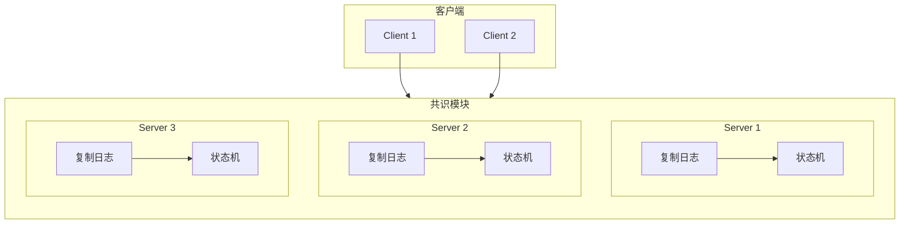
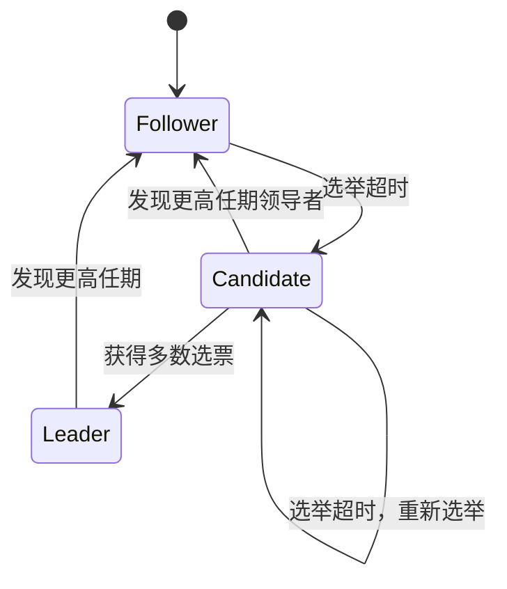

# Raft：一种可理解的共识算法

**作者**：Diego Ongaro, John Ousterhout  
**机构**：斯坦福大学  
**年份**：2014  
**版本**：扩展版（Extended Version）

---

## 摘要

Raft 是一种用于管理复制日志（replicated log）的共识算法。它产生与（多）Paxos 等价的结果，效率与 Paxos 相当，但其结构与 Paxos 不同；这使得 Raft 比 Paxos 更易理解，并为构建实用系统提供了更好的基础。为增强可理解性，Raft 将共识的关键要素分离，如领导者选举（leader election）、日志复制（log replication）和安全性（safety），并通过更强的连贯性来减少需要考虑的状态数量。用户研究表明，Raft 比 Paxos 更容易被学生掌握。Raft 还包含一种新的集群成员变更机制，使用重叠多数（overlapping majorities）来保证安全性。

---

## 1 引言

共识算法使一组机器能够作为一个协调的群体工作，并在部分成员故障时继续运行。因此，它们在构建可靠的大规模软件系统中扮演着关键角色。过去十年间，Leslie Lamport 的 Paxos [15, 16] 几乎成为共识算法的代名词：大多数共识实现都基于 Paxos 或受其影响，Paxos 也成为教授学生共识知识的主要载体。

遗憾的是，尽管有诸多简化尝试，Paxos 仍然非常难以理解。此外，其架构需要复杂的修改才能支持实用系统。因此，无论是系统构建者还是学生，都在与 Paxos 作斗争。

在亲身与 Paxos 斗争之后，我们着手寻找一种新的共识算法，希望能为系统构建和教育提供更好的基础。我们的方法不同寻常，因为我们的首要目标是**可理解性**：能否定义一种适用于实用系统的共识算法，并以比 Paxos 显著更易学习的方式描述它？此外，我们希望该算法能促进系统构建者形成必要的直觉。算法不仅要能工作，而且要让人明显看出它为什么能工作，这一点很重要。

这项工作的成果是一种名为 **Raft** 的共识算法。在设计 Raft 时，我们采用了特定技术来提高可理解性，包括**分解**（Raft 将领导者选举、日志复制和安全性分离）和**状态空间简化**（相对于 Paxos，Raft 减少了非确定性程度以及服务器之间可能不一致的方式）。一项在两所大学对 43 名学生进行的用户研究表明，Raft 比 Paxos 显著更易理解：在学习两种算法后，其中 33 名学生回答 Raft 相关问题的表现优于回答 Paxos 相关问题。

Raft 在许多方面与现有共识算法相似（最显著的是 Oki 和 Liskov 的 Viewstamped Replication [29, 22]），但它具有若干新颖特性：

- **强领导者（Strong leader）**：Raft 使用比其他共识算法更强的领导形式。例如，日志条目仅从领导者流向其他服务器。这简化了复制日志的管理，使 Raft 更易理解。
- **领导者选举（Leader election）**：Raft 使用随机化计时器选举领导者。这仅在共识算法已有的心跳机制上增加了少量机制，却能简单快速地解决冲突。
- **成员变更（Membership changes）**：Raft 的集群服务器集合变更机制采用一种新的**联合共识（joint consensus）**方法，在过渡期间两个不同配置的多数重叠。这使得集群在配置变更期间能继续正常运作。

我们相信 Raft 在教育目的和作为实现基础方面都优于 Paxos 及其他共识算法。它比其他算法更简单、更易理解；其描述足够完整以满足实用系统的需求；它有多个开源实现并被多家公司使用；其安全性已得到形式化规范和证明；其效率与其他算法相当。

本文其余部分介绍复制状态机问题（第 2 节），讨论 Paxos 的优缺点（第 3 节），描述我们提高可理解性的一般方法（第 4 节），介绍 Raft 共识算法（第 5–8 节），评估 Raft（第 9 节），并讨论相关工作（第 10 节）。

---

## 2 复制状态机

共识算法通常出现在复制状态机（replicated state machines）[37] 的上下文中。在这种方法中，一组服务器上的状态机计算相同状态的相同副本，即使部分服务器宕机也能继续运行。复制状态机用于解决分布式系统中的各种容错问题。例如，具有单一集群领导者的大规模系统，如 GFS [8]、HDFS [38] 和 RAMCloud [33]，通常使用独立的复制状态机来管理领导者选举并存储必须在领导者崩溃后保留的配置信息。复制状态机的例子包括 Chubby [2] 和 ZooKeeper [11]。

复制状态机通常使用复制日志实现，如图 1 所示。每台服务器存储一个包含一系列命令的日志，其状态机按顺序执行这些命令。每个日志以相同顺序包含相同的命令，因此每台状态机处理相同的命令序列。由于状态机是确定性的，每台都计算出相同的状态和相同的输出序列。

保持复制日志一致是共识算法的工作。服务器上的共识模块接收来自客户端的命令并将其添加到自己的日志中。它与其他服务器上的共识模块通信，确保即使部分服务器故障，每个日志最终也以相同顺序包含相同的请求。一旦命令被正确复制，每台服务器的状态机按日志顺序处理它们，并将输出返回给客户端。因此，这些服务器看起来形成了一个单一、高度可靠的状态机。

实用系统的共识算法通常具有以下性质：

- 在所有非拜占庭（non-Byzantine）条件下（包括网络延迟、分区、丢包、重复和乱序）确保**安全性**（永不返回错误结果）。
- 只要任意多数服务器可运行且能相互通信、与客户端通信，则**完全可用**。因此，典型的五台服务器集群可容忍任意两台服务器故障。假设服务器通过停止而故障；它们之后可从稳定存储的状态恢复并重新加入集群。
- 不依赖时序来确保日志一致性：故障时钟和极端消息延迟最多只会导致可用性问题。
- 在常见情况下，命令可在集群多数响应单轮远程过程调用后完成；少数慢速服务器不必影响整体系统性能。



**图 1：复制状态机架构**。共识算法管理包含来自客户端的状态机命令的复制日志。状态机从日志中处理相同的命令序列，因此产生相同的输出。

---

## 3 Paxos 的问题何在？

过去十年间，Leslie Lamport 的 Paxos 协议 [15] 几乎成为共识的同义词：它是课程中最常教授的协议，大多数共识实现都以它为起点。Paxos 首先定义了一种能够就单一决策达成一致的协议，例如单一复制日志条目。我们将这一子集称为**单法令 Paxos（single-decree Paxos）**。Paxos 随后将这一协议的多个实例组合起来，以促进一系列决策（如日志），即**多 Paxos（multi-Paxos）**。Paxos 确保安全性和活性（liveness），并支持集群成员变更。其正确性已得到证明，在正常情况下效率高。

遗憾的是，Paxos 有两个显著缺点。

**第一个缺点是 Paxos 异常难以理解**。完整解释 [15] 以晦涩难懂著称；很少有人能理解它，且需要付出巨大努力。因此，已有多次用更简单术语解释 Paxos 的尝试 [16, 20, 21]。这些解释聚焦于单法令子集，但仍然具有挑战性。在 NSDI 2012 参会者的非正式调查中，我们发现很少有人对 Paxos 感到自如，即使在资深研究者中也是如此。我们自己也与 Paxos 斗争；直到阅读多个简化解释并设计了自己的替代协议（这一过程花了近一年时间）之后，我们才理解了完整协议。

我们假设 Paxos 的晦涩源于其选择单法令子集作为基础。单法令 Paxos 密集而微妙：它分为两个阶段，没有简单的直观解释，且无法独立理解。因此，很难形成关于单法令协议为何有效的直觉。多 Paxos 的组合规则增加了大量额外的复杂性和微妙之处。我们相信，就多个决策达成共识（即日志而非单一条目）的整体问题可以用更直接、更明显的方式分解。

**第二个问题是 Paxos 没有为构建实用实现提供良好基础**。原因之一是对于多 Paxos 没有广泛认同的算法。Lamport 的描述主要关于单法令 Paxos；他勾勒了多 Paxos 的可能方法，但许多细节缺失。已有多次充实和优化 Paxos 的尝试，如 [26]、[39] 和 [13]，但这些彼此不同，也与 Lamport 的草图不同。Chubby [4] 等系统实现了类 Paxos 算法，但在大多数情况下其细节未公开。

此外，Paxos 架构不适合构建实用系统；这是单法令分解的另一个后果。例如，独立选择一组日志条目然后将它们合并成顺序日志几乎没有好处；这只会增加复杂性。围绕日志设计系统更简单、更高效，新条目以受约束的顺序依次追加。另一个问题是 Paxos 在其核心使用对称的对等（peer-to-peer）方法（尽管它最终建议将弱形式的领导作为性能优化）。在仅需做出一个决策的简化世界中这是合理的，但很少有实用系统采用这种方法。如果需要做出一系列决策，先选举领导者再让领导者协调决策更简单、更快速。

因此，实用系统与 Paxos 几乎没有什么相似之处。每个实现都从 Paxos 开始，发现实现它的困难，然后开发出显著不同的架构。这既耗时又容易出错，而理解 Paxos 的困难加剧了问题。Paxos 的表述可能适合证明其正确性的定理，但实际实现与 Paxos 如此不同，以至于这些证明几乎没有价值。Chubby 实现者的以下评论颇具代表性：

::: quote
Paxos 算法的描述与真实世界系统的需求之间存在显著差距……最终系统将基于未经证明的协议 [4]。
:::

由于这些问题，我们得出结论：Paxos 既不能为系统构建也不能为教育提供良好基础。鉴于共识在大规模软件系统中的重要性，我们决定看看能否设计出一种比 Paxos 具有更好性质的替代共识算法。Raft 是这一实验的结果。

---

## 4 为可理解性而设计

在设计 Raft 时，我们有若干目标：它必须为系统构建提供完整且实用的基础，从而显著减少开发者所需的设计工作；它必须在所有条件下安全，在典型运行条件下可用；它必须对常见操作高效。但我们最重要的目标——也是最困难的挑战——是**可理解性**。必须让广大受众能够轻松理解该算法。此外，必须能够形成关于该算法的直觉，以便系统构建者能够做出实际实现中不可避免的扩展。

在 Raft 的设计中有许多需要我们在替代方法之间做出选择的时刻。在这些情况下，我们基于可理解性评估替代方案：解释每种替代方案有多难（例如，其状态空间有多复杂，是否有微妙的含义？），读者完全理解该方法及其含义有多容易？

我们认识到这种分析存在高度主观性；尽管如此，我们使用了两种普遍适用的技术。第一种技术是众所周知的问题分解方法：尽可能将问题分成可以相对独立地解决、解释和理解的独立部分。例如，在 Raft 中我们分离了领导者选举、日志复制、安全性和成员变更。

我们的第二种方法是通过减少需要考虑的状态数量来简化状态空间，使系统更加连贯，并在可能的情况下消除非确定性。具体而言，日志不允许有空洞，Raft 限制了日志之间可能变得不一致的方式。尽管在大多数情况下我们试图消除非确定性，但在某些情况下非确定性实际上提高了可理解性。特别是，随机化方法引入了非确定性，但它们倾向于通过以类似方式处理所有可能选择（「选任意一个；无所谓」）来减少状态空间。我们使用随机化来简化 Raft 领导者选举算法。

---

## 5 Raft 共识算法

Raft 是一种用于管理第 2 节所述形式复制日志的算法。图 2 以浓缩形式总结了该算法，图 3 列出了该算法的关键性质；这些图的元素将在本节其余部分逐一讨论。

Raft 通过首先选举出唯一的领导者，然后赋予领导者完全负责管理复制日志来实现共识。领导者接受来自客户端的日志条目，在其他服务器上复制它们，并告诉服务器何时可以安全地将日志条目应用到其状态机。拥有领导者简化了复制日志的管理。例如，领导者可以在不咨询其他服务器的情况下决定将新条目放在日志中的位置，数据以简单的方式从领导者流向其他服务器。领导者可能故障或与其他服务器断开连接，在这种情况下将选举新领导者。

鉴于领导者方法，Raft 将共识问题分解为三个相对独立的子问题，将在以下小节中讨论：

- **领导者选举**：当现有领导者故障时必须选择新领导者（第 5.2 节）。
- **日志复制**：领导者必须接受来自客户端的日志条目并在集群中复制它们，迫使其他日志与其自身一致（第 5.3 节）。
- **安全性**：Raft 的关键安全性质是图 3 中的状态机安全性质：如果任何服务器已将特定日志条目应用到其状态机，则其他服务器不得对同一日志索引应用不同的命令。第 5.4 节描述 Raft 如何确保这一性质；解决方案涉及对第 5.2 节所述选举机制的额外限制。

在介绍共识算法之后，本节讨论可用性问题和时序在系统中的作用。

### 5.1 Raft 基础

Raft 集群包含若干服务器；五台是典型数量，允许系统容忍两次故障。在任何给定时刻，每台服务器处于三种状态之一：**领导者（leader）**、**跟随者（follower）** 或 **候选人（candidate）**。在正常操作中，恰好有一个领导者，所有其他服务器都是跟随者。跟随者是被动的：它们不主动发出请求，只是响应来自领导者和候选人的请求。领导者处理所有客户端请求（如果客户端联系跟随者，跟随者将其重定向到领导者）。第三种状态候选人用于选举新领导者，如第 5.2 节所述。图 4 显示了状态及其转换；转换将在下面讨论。

Raft 将时间划分为任意长度的**任期（term）**，如图 5 所示。任期用连续整数编号。每个任期以选举开始，一个或多个候选人试图成为领导者，如第 5.2 节所述。如果候选人赢得选举，则它在任期的剩余时间担任领导者。在某些情况下，选举会导致选票分裂。在这种情况下，任期将在没有领导者的情况下结束；新的任期（带有新选举）将很快开始。Raft 确保在给定任期内最多有一个领导者。

不同服务器可能在不同时间观察到任期之间的转换，在某些情况下，服务器可能观察不到选举甚至整个任期。任期在 Raft 中充当逻辑时钟 [14]，它们允许服务器检测过时信息，如陈旧领导者。每台服务器存储一个当前任期号，它随时间单调递增。每当服务器通信时交换当前任期；如果一台服务器的当前任期小于另一台的，则它将其当前任期更新为较大值。如果候选人或领导者发现其任期已过时，它立即恢复到跟随者状态。如果服务器收到带有陈旧任期号的请求，它拒绝该请求。

Raft 服务器使用远程过程调用（RPC）通信，基本共识算法只需要两种类型的 RPC。RequestVote RPC 由候选人在选举期间发起（第 5.2 节），AppendEntries RPC 由领导者发起以复制日志条目并提供心跳形式（第 5.3 节）。第 7 节增加了第三种 RPC，用于在服务器之间传输快照。如果服务器未及时收到响应，它们会重试 RPC，并并行发出 RPC 以获得最佳性能。



**图 4：服务器状态**。跟随者仅响应来自其他服务器的请求。如果跟随者未收到通信，它成为候选人并发起选举。获得完整集群多数选票的候选人成为新领导者。领导者通常持续运行直到故障。

```text
时间线 ──────────────────────────────────────────────────────────►

任期 1     |选举|────── 领导者 ──────|
任期 2     |选举|────── 领导者 ──────|
任期 3     |选举| 分裂选票 |选举|────── 领导者 ──────|
任期 4     |选举|────── 领导者 ──────|
```

**图 5：时间被划分为任期**，每个任期以选举开始。选举成功后，单一领导者管理集群直到任期结束。某些选举失败，在这种情况下任期在没有选择领导者的情况下结束。不同服务器可能在不同时间观察到任期之间的转换。

### 5.2 领导者选举

Raft 使用心跳机制触发领导者选举。服务器启动时，它们作为跟随者开始。只要服务器收到来自领导者或候选人的有效 RPC，它就保持在跟随者状态。领导者向所有跟随者发送定期心跳（不携带日志条目的 AppendEntries RPC）以维持其权威。如果跟随者在称为**选举超时（election timeout）**的一段时间内未收到通信，则它假定没有可行的领导者并开始选举以选择新领导者。

要开始选举，跟随者增加其当前任期并转换到候选人状态。然后它为自己投票并并行向集群中的每台其他服务器发出 RequestVote RPC。候选人保持此状态直到发生以下三件事之一：(a) 它赢得选举，(b) 另一台服务器确立自己为领导者，或 (c) 一段时间过去没有赢家。这些结果将在下面段落中分别讨论。

如果候选人获得完整集群中多数服务器的选票（同一任期），则它赢得选举。每台服务器在给定任期内最多为一个候选人投票，先到先得（注意：第 5.4 节对选票增加了额外限制）。多数规则确保在特定任期内最多一个候选人能赢得选举（图 3 中的选举安全性质）。一旦候选人赢得选举，它成为领导者。然后它向所有其他服务器发送心跳消息以确立其权威并防止新选举。

在等待选票时，候选人可能收到来自声称是领导者的另一台服务器的 AppendEntries RPC。如果领导者的任期（包含在其 RPC 中）至少与候选人的当前任期一样大，则候选人承认该领导者合法并返回跟随者状态。如果 RPC 中的任期小于候选人的当前任期，则候选人拒绝该 RPC 并继续处于候选人状态。

第三种可能的结果是候选人既未赢得也未输掉选举：如果许多跟随者同时成为候选人，选票可能分裂，以致没有候选人获得多数。当这种情况发生时，每个候选人将超时并通过增加其任期和发起另一轮 RequestVote RPC 开始新选举。然而，如果没有额外措施，分裂选票可能无限重复。

Raft 使用随机化选举超时来确保分裂选票罕见且能快速解决。为防止分裂选票，选举超时从固定区间（例如 150–300ms）中随机选择。这使服务器分散，因此在大多数情况下只有一台服务器会超时；它在任何其他服务器超时之前赢得选举并发送心跳。相同的机制用于处理分裂选票。每个候选人在选举开始时重启其随机化选举超时，并在开始下一次选举之前等待该超时过去；这降低了新选举中再次分裂选票的可能性。第 9.3 节表明这种方法能快速选举领导者。

选举是可理解性如何指导我们在设计替代方案之间做出选择的一个例子。最初我们计划使用排名系统：每个候选人被分配唯一排名，用于在竞争候选人之间选择。如果候选人发现另一个排名更高的候选人，它将返回跟随者状态，以便排名更高的候选人更容易赢得下一次选举。我们发现这种方法在可用性方面产生了微妙问题（如果排名更高的服务器故障，排名较低的服务器可能需要超时并再次成为候选人，但如果它过早这样做，可能会重置选举领导者的进度）。我们多次调整算法，但每次调整后都会出现新的边界情况。最终我们得出结论，随机化重试方法更明显、更易理解。

### 5.3 日志复制

一旦选出领导者，它就开始服务客户端请求。每个客户端请求包含要由复制状态机执行的命令。领导者将命令作为新条目追加到其日志，然后并行向每台其他服务器发出 AppendEntries RPC 以复制该条目。当条目被安全复制后（如下所述），领导者将条目应用到其状态机并将该执行的结果返回给客户端。如果跟随者崩溃或运行缓慢，或网络包丢失，领导者会无限重试 AppendEntries RPC（即使在响应客户端之后），直到所有跟随者最终存储所有日志条目。

日志的组织如图 6 所示。每个日志条目存储状态机命令以及领导者收到该条目时的任期号。日志条目中的任期号用于检测日志之间的不一致并确保图 3 中的某些性质。每个日志条目还有一个整数索引标识其在日志中的位置。

领导者决定何时可以安全地将日志条目应用到状态机；这样的条目称为**已提交（committed）**。Raft 保证已提交的条目是持久的，并最终被所有可用的状态机执行。一旦创建该条目的领导者将其复制到多数服务器上（例如图 6 中的条目 7），日志条目就被提交。这也提交领导者日志中所有先前的条目，包括先前领导者创建的条目。第 5.4 节讨论在领导者变更后应用此规则的一些微妙之处，并表明这种提交定义是安全的。领导者跟踪它知道已提交的最高索引，并在未来的 AppendEntries RPC（包括心跳）中包含该索引，以便其他服务器最终得知。一旦跟随者得知日志条目已提交，它就将该条目应用到其本地状态机（按日志顺序）。

我们设计 Raft 日志机制以在不同服务器的日志之间保持高度连贯性。这不仅简化了系统行为并使其更可预测，而且是确保安全性的重要组成部分。Raft 维护以下性质，它们共同构成图 3 中的**日志匹配性质（Log Matching Property）**：

- 如果不同日志中的两个条目具有相同的索引和任期，则它们存储相同的命令。
- 如果不同日志中的两个条目具有相同的索引和任期，则日志在所有先前条目上完全相同。

第一个性质源于领导者在给定任期内对给定日志索引最多创建一个条目，且日志条目从不改变其在日志中的位置。第二个性质由 AppendEntries 执行的简单一致性检查保证。发送 AppendEntries RPC 时，领导者包含其日志中紧接新条目之前的条目的索引和任期。如果跟随者在其日志中找不到具有相同索引和任期的条目，则它拒绝新条目。一致性检查充当归纳步骤：日志的初始空状态满足日志匹配性质，每当扩展日志时一致性检查都保持日志匹配性质。因此，每当 AppendEntries 成功返回时，领导者知道跟随者的日志与其自身日志在新条目之前完全相同。

在正常操作期间，领导者和跟随者的日志保持一致，因此 AppendEntries 一致性检查从不失败。然而，领导者崩溃可能使日志不一致（旧领导者可能未完全复制其日志中的所有条目）。这些不一致可能在一系列领导者和跟随者崩溃中累积。图 7 说明了跟随者日志可能与新领导者不同的方式。跟随者可能缺少领导者上存在的条目，可能有领导者上不存在的额外条目，或两者兼有。日志中缺失和多余的条目可能跨越多个任期。

在 Raft 中，领导者通过强制跟随者的日志复制其自身来处理不一致。这意味着跟随者日志中的冲突条目将被领导者日志中的条目覆盖。第 5.4 节将表明，结合一个额外限制，这是安全的。为使跟随者的日志与其自身一致，领导者必须找到两个日志一致的最新日志条目，删除该点之后跟随者日志中的任何条目，并向跟随者发送该点之后领导者的所有条目。所有这些操作都在响应 AppendEntries RPC 执行的一致性检查时发生。领导者为每个跟随者维护一个 nextIndex，即领导者将发送给该跟随者的下一个日志条目的索引。当领导者首次上任时，它将所有 nextIndex 值初始化为其日志中最后一个之后的索引（图 7 中的 11）。如果跟随者的日志与领导者的不一致，AppendEntries 一致性检查将在下一次 AppendEntries RPC 中失败。拒绝后，领导者递减 nextIndex 并重试 AppendEntries RPC。最终 nextIndex 将达到领导者与跟随者日志匹配的点。当这种情况发生时，AppendEntries 将成功，这将删除跟随者日志中的任何冲突条目并追加领导者日志中的条目（如果有）。一旦 AppendEntries 成功，跟随者的日志与领导者的保持一致，并将在任期剩余时间内保持如此。

如果需要，可以优化协议以减少被拒绝的 AppendEntries RPC 数量。例如，拒绝 AppendEntries 请求时，跟随者可以包含冲突条目的任期以及它为该任期存储的第一个索引。有了这些信息，领导者可以递减 nextIndex 以绕过该任期中的所有冲突条目；每个有冲突条目的任期只需要一个 AppendEntries RPC，而不是每个条目一个 RPC。在实践中，我们怀疑这种优化是否必要，因为故障很少发生，且不太可能有许多不一致的条目。

有了这种机制，领导者上任时不需要采取任何特殊行动来恢复日志一致性。它只是开始正常操作，日志会响应 AppendEntries 一致性检查的失败而自动收敛。领导者从不覆盖或删除其自身日志中的条目（图 3 中的领导者仅追加性质）。

这种日志复制机制表现出第 2 节所述的理想共识性质：只要多数服务器在线，Raft 就能接受、复制和应用新日志条目；在正常情况下，新条目可以通过对集群多数的单轮 RPC 复制；单个慢速跟随者不会影响性能。

```text
索引:  1   2   3   4   5   6   7   8   9   10  11
      ┌───┬───┬───┬───┬───┬───┬───┬───┬───┬───┬───┐
日志: │ 1 │ 1 │ 1 │ 4 │ 4 │ 5 │ 5 │ 5 │ 6 │ 6 │ 6 │  ← 任期号
      └───┴───┴───┴───┴───┴───┴───┴───┴───┴───┴───┘
                                    ▲
                                    │
                              已提交 (多数已复制)
```

**图 6：日志由按顺序编号的条目组成**。每个条目包含创建它的任期（每个框中的数字）和状态机的命令。如果条目可以安全地应用到状态机，则该条目被视为已提交。

```text
领导者:  1  1  1  4  4  5  5  5  6  6  6
(a)     1  1  1  4
(b)     1  1  1  4  4  5  5
(c)     1  1  1  4  4  5  5  5  6  6
(d)     1  1  1  4  4  5  5  5  6  6  6  6
(e)     1  1  1  4  4
(f)     1  1  1  4  4  5  5  5  6  6  6  6  6
```

**图 7：当顶部领导者上任时**，跟随者日志可能出现 (a–f) 中的任一情况。每个框代表一个日志条目；框中的数字是其任期。跟随者可能缺少条目 (a–b)、可能有额外未提交条目 (c–d)，或两者兼有 (e–f)。

### 5.4 安全性

前面几节描述了 Raft 如何选举领导者和复制日志条目。然而，到目前为止描述的机制还不足以确保每台状态机以相同顺序执行完全相同的命令。例如，当领导者提交多个日志条目时，跟随者可能不可用，然后它可能被选为领导者并用新条目覆盖这些条目；因此，不同的状态机可能执行不同的命令序列。

本节通过增加对哪些服务器可以被选为领导者的限制来完成 Raft 算法。该限制确保任何给定任期的领导者包含先前任期中提交的所有条目（图 3 中的领导者完整性性质）。给定选举限制，我们使提交规则更加精确。最后，我们给出领导者完整性性质的证明草图，并展示它如何导致复制状态机的正确行为。

#### 5.4.1 选举限制

在任何基于领导者的共识算法中，领导者最终必须存储所有已提交的日志条目。在某些共识算法中，如 Viewstamped Replication [22]，即使领导者最初不包含所有已提交的条目，也可以被选举。这些算法包含额外的机制来识别缺失的条目并在选举过程中或之后不久将其传输给新领导者。遗憾的是，这导致了相当多的额外机制和复杂性。Raft 使用更简单的方法，它保证所有先前任期的已提交条目在选举时刻就存在于每个新领导者上，无需将这些条目传输给领导者。这意味着日志条目只在一个方向流动，从领导者到跟随者，领导者从不覆盖其日志中的现有条目。

Raft 使用投票过程来阻止候选人在其日志不包含所有已提交条目的情况下赢得选举。候选人必须联系集群的多数才能当选，这意味着每个已提交的条目必须存在于这些服务器中的至少一台。如果候选人的日志至少与该多数中任何其他日志一样新（「更新」的定义见下文），则它将持有所有已提交的条目。RequestVote RPC 实现了这一限制：RPC 包含有关候选人日志的信息，如果投票者自己的日志比候选人的更新，则投票者拒绝投票。

Raft 通过比较日志中最后条目的索引和任期来确定两个日志中哪个更新。如果日志的最后条目具有不同的任期，则具有较晚任期的日志更新。如果日志以相同任期结束，则较长的日志更新。

#### 5.4.2 提交先前任期的条目

如第 5.3 节所述，领导者知道其当前任期的条目一旦存储到多数服务器上就已提交。如果领导者在提交条目之前崩溃，未来的领导者将尝试完成复制该条目。然而，领导者不能立即得出结论：一旦先前任期的条目存储到多数服务器上就已提交。图 8 说明了一种情况，其中旧日志条目存储在多数服务器上，但仍可能被未来领导者覆盖。

```text
(a) S1 领导者，部分复制索引 2 的条目
(b) S1 崩溃；S5 在 S3、S4 及自身投票下当选任期 3 领导者，接受索引 2 的不同条目
(c) S5 崩溃；S1 重启，当选领导者，继续复制。此时任期 2 的条目已在多数服务器上，但未提交
(d) 若 S1 崩溃，S5 可能当选（S2、S3、S4 投票）并用自己的任期 3 条目覆盖
(e) 若 S1 在崩溃前将当前任期条目复制到多数，则该条目已提交（S5 无法当选）
```

**图 8：时间序列**，说明领导者为何不能通过旧任期的日志条目确定提交。领导者只能通过复制当前任期条目来间接提交先前任期的条目。

为消除图 8 中的问题，Raft 从不通过计数副本提交先前任期的日志条目。只有领导者当前任期的日志条目通过计数副本来提交；一旦以这种方式提交了当前任期的条目，则由于日志匹配性质，所有先前的条目都间接提交。在某些情况下，领导者可以安全地得出结论认为较旧的日志条目已提交（例如，如果该条目存储在所有服务器上），但 Raft 为简单起见采用更保守的方法。

Raft 在提交规则中承担这种额外复杂性，是因为当领导者复制先前任期的条目时，日志条目保留其原始任期号。在其他共识算法中，如果新领导者重新复制先前「任期」的条目，它必须使用其新的「任期号」来这样做。Raft 的方法使推理日志条目更容易，因为它们随时间跨日志保持相同的任期号。此外，Raft 中的新领导者发送的先前任期日志条目比其他算法少（其他算法必须发送冗余日志条目以在提交之前重新编号它们）。

#### 5.4.3 安全性论证

给定完整的 Raft 算法，我们现在可以更精确地论证领导者完整性性质成立（该论证基于安全性证明；见第 9.2 节）。我们假设领导者完整性性质不成立，然后证明矛盾。

假设任期 T 的领导者（leaderT）提交了其任期的日志条目，但该日志条目未被某个未来任期的领导者存储。考虑最小的任期 U > T，其领导者（leaderU）不存储该条目。

1. 已提交的条目在 leaderU 选举时必定不在其日志中（领导者从不删除或覆盖条目）。
2. leaderT 将条目复制到集群的多数，leaderU 获得了集群多数的选票。因此，至少有一台服务器（「投票者」）既接受了 leaderT 的条目又投票给了 leaderU，如图 9 所示。投票者是达到矛盾的关键。

```text
     leaderT (任期 T)              leaderU (任期 U)
           │                            │
           │  AppendEntries             │  RequestVote
           ▼                            ▲
     ┌─────────┐                   ┌─────────┐
     │   S3    │ ──── 投票 ──────► │   S3    │  投票者：既接受 T 的条目又投票给 U
     │ (投票者) │                   │         │
     └─────────┘                   └─────────┘
```

**图 9：若 S1（任期 T 的领导者）提交了其任期的日志条目，而 S5 在更高任期 U 当选领导者，则至少有一台服务器（S3）既接受了该条目又投票给了 S5。**
3. 投票者必须在投票给 leaderU 之前接受了 leaderT 的已提交条目；否则它会拒绝 leaderT 的 AppendEntries 请求（其当前任期会高于 T）。
4. 投票者在投票给 leaderU 时仍存储该条目，因为每个介于其间的领导者都包含该条目（根据假设），领导者从不删除条目，跟随者只有在条目与领导者冲突时才删除条目。
5. 投票者将选票授予 leaderU，因此 leaderU 的日志必须与投票者的一样新。这导致两个矛盾之一。
6. 首先，如果投票者和 leaderU 共享相同的最后日志任期，则 leaderU 的日志必须至少与投票者的一样长，因此其日志包含投票者日志中的每个条目。这是矛盾，因为投票者包含已提交的条目而 leaderU 被假设不包含。
7. 否则，leaderU 的最后日志任期必须大于投票者的。此外，它大于 T，因为投票者的最后日志任期至少是 T（它包含任期 T 的已提交条目）。创建 leaderU 最后日志条目的较早领导者必须在其日志中包含已提交的条目（根据假设）。然后，根据日志匹配性质，leaderU 的日志也必须包含已提交的条目，这是矛盾。
8. 这完成了矛盾。因此，所有大于 T 的任期的领导者必须包含在任期 T 中提交的任期 T 的所有条目。
9. 日志匹配性质保证未来的领导者也将包含间接提交的条目，如图 8(d) 中的索引 2。

给定领导者完整性性质，我们可以证明图 3 中的状态机安全性质，即如果服务器已将给定索引的日志条目应用到其状态机，则其他服务器永远不会对同一索引应用不同的日志条目。当服务器将日志条目应用到其状态机时，其日志必须与领导者日志在该条目之前完全相同，且该条目必须已提交。现在考虑任何服务器应用给定日志索引的最低任期；领导者完整性性质保证所有更高任期的领导者将存储相同的日志条目，因此在之后任期应用该索引的服务器将应用相同的值。因此，状态机安全性质成立。

最后，Raft 要求服务器按日志索引顺序应用条目。结合状态机安全性质，这意味着所有服务器将以相同顺序将完全相同的日志条目集应用到其状态机。

### 5.5 跟随者和候选人崩溃

到目前为止我们一直关注领导者故障。跟随者和候选人崩溃比领导者崩溃简单得多，两者以相同方式处理。如果跟随者或候选人崩溃，则发送给它的未来 RequestVote 和 AppendEntries RPC 将失败。Raft 通过无限重试处理这些故障；如果崩溃的服务器重启，则 RPC 将成功完成。如果服务器在完成 RPC 但响应之前崩溃，则重启后将再次收到相同的 RPC。Raft RPC 是幂等的，因此这不会造成危害。例如，如果跟随者收到包含其日志中已存在日志条目的 AppendEntries 请求，它忽略新请求中的那些条目。

### 5.6 时序与可用性

我们对 Raft 的要求之一是安全性不得依赖时序：系统不得仅仅因为某些事件比预期更快或更慢发生而产生错误结果。然而，**可用性**（系统及时响应客户端的能力）必然依赖时序。例如，如果消息交换比服务器崩溃之间的典型时间更长，候选人将无法保持足够长的时间赢得选举；没有稳定的领导者，Raft 无法取得进展。

领导者选举是 Raft 中时序最关键的方面。只要系统满足以下时序要求，Raft 就能选举并维持稳定的领导者：

```text
broadcastTime ≪ electionTimeout ≪ MTBF
```

在此不等式中，broadcastTime 是服务器并行向集群中每台服务器发送 RPC 并接收响应所需的平均时间；electionTimeout 是第 5.2 节所述的选举超时；MTBF 是单台服务器的平均故障间隔时间。广播时间应比选举超时小一个数量级，以便领导者能够可靠地发送保持跟随者不发起选举所需的心跳消息；鉴于选举超时使用的随机化方法，这种不等式也使分裂选票不太可能。选举超时应比 MTBF 小几个数量级，以便系统稳定进展。当领导者崩溃时，系统将在大约选举超时期间不可用；我们希望这只占整体时间的一小部分。

广播时间和 MTBF 是底层系统的属性，而选举超时是我们必须选择的。Raft 的 RPC 通常要求接收者将信息持久化到稳定存储，因此广播时间可能从 0.5ms 到 20ms 不等，取决于存储技术。因此，选举超时可能在 10ms 到 500ms 之间。典型的服务器 MTBF 是几个月或更长，这很容易满足时序要求。

---

## 6 集群成员变更

到目前为止我们假设集群配置（参与共识算法的服务器集合）是固定的。在实践中，偶尔需要更改配置，例如在服务器故障时替换它们或更改复制程度。虽然可以通过使整个集群离线、更新配置文件然后重启集群来完成，但这会使集群在变更期间不可用。此外，如果有任何手动步骤，它们存在操作员错误的风险。为避免这些问题，我们决定将配置变更自动化并将其纳入 Raft 共识算法。

为使配置变更机制安全，在过渡期间不得有任何时刻可能为同一任期选举出两个领导者。遗憾的是，服务器直接从旧配置切换到新配置的任何方法都是不安全的。不可能原子地一次性切换所有服务器，因此集群在过渡期间可能分裂成两个独立的多数（见图 10）。

```text
Cold (3 台):  S1, S2, S3
Cnew (5 台):  S1, S2, S3, S4, S5

时刻 T1: S1,S2 已切换 → Cold 多数(S1,S2) 可选举
时刻 T2: S3,S4,S5 已切换 → Cnew 多数(S3,S4,S5) 可选举
→ 同一任期可能选出两个领导者！
```

**图 10：直接从一种配置切换到另一种不安全**，因为不同服务器会在不同时间切换。本例中集群从 3 台扩展到 5 台。不幸的是，存在某一时刻，可能为同一任期选出两个领导者，一个基于旧配置 Cold 的多数，另一个基于新配置 Cnew 的多数。

为确保安全，配置变更必须使用两阶段方法。有多种方式实现这两个阶段。例如，某些系统（如 [22]）使用第一阶段禁用旧配置，使其无法处理客户端请求；然后第二阶段启用新配置。在 Raft 中，集群首先切换到我们称为**联合共识（joint consensus）**的过渡配置；一旦联合共识被提交，系统然后过渡到新配置。联合共识结合了旧配置和新配置：

- 日志条目被复制到两个配置中的所有服务器。
- 任一配置中的任何服务器都可以担任领导者。
- 协议（选举和条目提交）需要来自旧配置和新配置的各自多数。

联合共识允许各个服务器在不同时间在配置之间过渡而不损害安全性。此外，联合共识允许集群在整个配置变更期间继续服务客户端请求。

集群配置使用复制日志中的特殊条目存储和通信；图 11 说明了配置变更过程。

```text
时间 ──────────────────────────────────────────────────────────►

Cold,new 创建 ─ ─ ─ ─ ─ ─ ─ ─ ─ ─ ─ ─ ─ ─ ─ ─ ─ ─ ─ ─ ─ ─ ─
Cold,new 提交 ────────────────────────────────────────────────
Cnew 创建     ─ ─ ─ ─ ─ ─ ─ ─ ─ ─ ─ ─ ─ ─ ─ ─ ─ ─ ─ ─ ─ ─ ─
Cnew 提交     ────────────────────────────────────────────────

虚线：已创建未提交的配置条目
实线：已提交的最新配置条目
```

**图 11：配置变更时间线**。领导者先创建 Cold,new 配置条目并提交到 Cold,new（Cold 多数且 Cnew 多数）。然后创建 Cnew 条目并提交到 Cnew 多数。不存在 Cold 和 Cnew 能独立做出决策的时刻。当领导者收到将配置从 Cold 更改为 Cnew 的请求时，它将联合共识的配置（图中的 Cold,new）存储为日志条目，并使用先前描述的机制复制该条目。一旦给定服务器将新配置条目添加到其日志，它将该配置用于所有未来决策（服务器始终使用其日志中的最新配置，无论该条目是否已提交）。这意味着领导者将使用 Cold,new 的规则来确定 Cold,new 的日志条目何时被提交。如果领导者崩溃，可能根据 Cold 或 Cold,new 选择新领导者，取决于获胜的候选人是否已收到 Cold,new。无论如何，Cnew 在此期间不能单方面做出决策。

一旦 Cold,new 被提交，Cold 和 Cnew 都不能在没有对方批准的情况下做出决策，领导者完整性性质确保只有具有 Cold,new 日志条目的服务器才能被选为领导者。现在领导者可以安全地创建描述 Cnew 的日志条目并将其复制到集群。同样，此配置将在每个服务器看到它时立即生效。当新配置根据 Cnew 的规则被提交时，旧配置无关紧要，不在新配置中的服务器可以关闭。如图 11 所示，没有 Cold 和 Cnew 都能单方面做出决策的时刻；这保证了安全性。

重新配置还有三个问题需要解决。第一个问题是新服务器最初可能不存储任何日志条目。如果它们以这种状态加入集群，它们可能需要相当长的时间才能赶上，在此期间可能无法提交新日志条目。为避免可用性缺口，Raft 在配置变更之前引入了一个额外阶段，新服务器作为**无投票权成员（non-voting members）**加入集群（领导者向它们复制日志条目，但它们不被计入多数）。一旦新服务器赶上集群的其余部分，可以按上述进行重新配置。

第二个问题是集群领导者可能不是新配置的一部分。在这种情况下，领导者在提交 Cnew 日志条目后卸任（返回跟随者状态）。这意味着将有一段时间（在提交 Cnew 期间）领导者管理一个不包括自己的集群；它复制日志条目但不将自己计入多数。领导者转换发生在 Cnew 被提交时，因为这是新配置可以独立运作的第一个时刻（将始终可以从 Cnew 选择领导者）。在此之前，可能只有 Cold 的服务器才能被选为领导者。

第三个问题是被移除的服务器（不在 Cnew 中的服务器）可能破坏集群。这些服务器将不会收到心跳，因此它们将超时并开始新选举。然后它们将发送带有新任期号的 RequestVote RPC，这将导致当前领导者恢复到跟随者状态。最终将选出新领导者，但被移除的服务器将再次超时，过程将重复，导致可用性差。为防止此问题，当服务器认为存在当前领导者时，它们忽略 RequestVote RPC。具体而言，如果服务器在听到当前领导者的最小选举超时内收到 RequestVote RPC，它不更新其任期或授予投票。这不影响正常选举，其中每台服务器在开始选举之前至少等待最小选举超时。然而，它有助于避免被移除服务器的干扰：如果领导者能够向其集群发送心跳，则它不会被更大的任期号废黜。

---

## 7 日志压缩

Raft 的日志在正常操作期间增长以纳入更多客户端请求，但在实用系统中，它不能无限增长。随着日志变长，它占用更多空间并需要更多时间重放。如果没有某种机制来丢弃日志中积累的过时信息，这最终将导致可用性问题。

**快照（Snapshotting）**是最简单的压缩方法。在快照中，整个当前系统状态被写入稳定存储上的快照，然后该点之前的整个日志被丢弃。Chubby 和 ZooKeeper 使用快照，本节其余部分描述 Raft 中的快照。

增量压缩方法，如日志清理 [36] 和日志结构合并树 [30, 5]，也是可能的。这些一次处理一部分数据，因此它们更均匀地分散压缩负载。它们首先选择积累了大量已删除和覆盖对象的区域，然后更紧凑地重写该区域中的存活对象并释放该区域。与快照相比，这需要大量额外的机制和复杂性，快照通过始终对整个数据集操作来简化问题。虽然日志清理需要对 Raft 进行修改，但状态机可以使用与快照相同的接口实现 LSM 树。

```text
日志（索引 1-5 已提交）:  [1][2][3][4][5][6][7]...
                              │
                              ▼
快照:  lastIncludedIndex=5, lastIncludedTerm=3
       状态: x=3, y=7  （当前状态机变量）
```

**图 12：服务器用新快照替换其日志中已提交的条目（索引 1 至 5）**，快照仅存储当前状态（本例中为变量 x 和 y）。快照的 lastIncludedIndex 和 lastIncludedTerm 用于在条目 6 之前定位快照。

每台服务器独立拍摄快照，仅覆盖其日志中已提交的条目。大部分工作包括状态机将其当前状态写入快照。Raft 还在快照中包含少量元数据：**最后包含索引（last included index）**是快照替换的日志中最后条目的索引（状态机已应用的最后一个条目），**最后包含任期（last included term）**是该条目的任期。保留这些以支持快照之后第一个日志条目的 AppendEntries 一致性检查，因为该条目需要先前的日志索引和任期。为支持集群成员变更（第 6 节），快照还包括截至最后包含索引时日志中的最新配置。一旦服务器完成写入快照，它可以删除直到最后包含索引的所有日志条目，以及任何先前的快照。

尽管服务器通常独立拍摄快照，但领导者偶尔必须向落后的跟随者发送快照。当领导者已经丢弃了它需要发送给跟随者的下一个日志条目时会发生这种情况。幸运的是，这种情况在正常操作中不太可能发生：跟上领导者的跟随者已经拥有该条目。然而，异常慢的跟随者或加入集群的新服务器（第 6 节）则没有。使此类跟随者更新的方法是由领导者通过网络向其发送快照。

领导者使用称为 InstallSnapshot 的新 RPC 向落后太多的跟随者发送快照；见图 13。

::: tip InstallSnapshot RPC
由领导者发起，向跟随者发送快照块。领导者始终按序发送块。

**参数**：`term`, `leaderId`, `lastIncludedIndex`, `lastIncludedTerm`, `offset`, `data[]`, `done`  
**结果**：`term`

**接收者**：若 `term < currentTerm` 立即回复；首块时创建新快照文件；按 offset 写入数据；`done=false` 时等待更多块；保存快照，丢弃更小索引的旧快照；若现有日志与快照最后条目匹配则保留其后日志，否则丢弃整个日志；用快照内容重置状态机。
:::当跟随者通过此 RPC 收到快照时，它必须决定如何处理其现有日志条目。通常快照将包含接收者日志中尚未存在的新信息。在这种情况下，跟随者丢弃其整个日志；它全部被快照取代，可能还有与快照冲突的未提交条目。如果相反跟随者收到的快照描述其日志的前缀（由于重传或错误），则快照覆盖的日志条目被删除，但快照之后的条目仍然有效且必须保留。

这种快照方法偏离了 Raft 的强领导者原则，因为跟随者可以在领导者不知情的情况下拍摄快照。但我们认为这种偏离是合理的。虽然拥有领导者有助于在达成共识时避免冲突决策，但在快照时共识已经达成，因此没有决策冲突。数据仍然只从领导者流向跟随者，只是跟随者现在可以重组其数据。

我们考虑了一种替代的基于领导者的方法，其中只有领导者会创建快照，然后将其发送给每个跟随者。然而，这有两个缺点。首先，向每个跟随者发送快照会浪费网络带宽并减慢快照过程。每个跟随者已经拥有生成自己快照所需的信息，服务器从本地状态生成快照通常比通过网络发送和接收快照便宜得多。其次，领导者的实现会更复杂。例如，领导者需要并行向跟随者发送快照和复制新日志条目，以便不阻塞新的客户端请求。

还有两个影响快照性能的问题。首先，服务器必须决定何时快照。如果服务器过于频繁地快照，会浪费磁盘带宽和能源；如果快照过于不频繁，会耗尽存储容量，并增加重启期间重放日志所需的时间。一个简单的策略是当日志达到固定字节大小时拍摄快照。如果此大小设置为明显大于预期快照大小，则快照的磁盘带宽开销将很小。

第二个性能问题是写入快照可能需要大量时间，我们不希望这延迟正常操作。解决方案是使用写时复制（copy-on-write）技术，以便可以接受新更新而不影响正在写入的快照。例如，使用函数式数据结构构建的状态机自然支持这一点。或者，可以使用操作系统的写时复制支持（例如 Linux 上的 fork）创建整个状态机的内存快照（我们的实现使用这种方法）。

---

## 8 客户端交互

本节描述客户端如何与 Raft 交互，包括客户端如何找到集群领导者以及 Raft 如何支持线性化语义（linearizable semantics）[10]。这些问题适用于所有基于共识的系统，Raft 的解决方案与其他系统类似。

Raft 的客户端将所有请求发送给领导者。当客户端首次启动时，它连接到随机选择的服务器。如果客户端的首选不是领导者，该服务器将拒绝客户端的请求并提供其最近听到的领导者的信息（AppendEntries 请求包含领导者的网络地址）。如果领导者崩溃，客户端请求将超时；客户端然后使用随机选择的服务器重试。

我们对 Raft 的目标是实现线性化语义（每个操作看起来在其调用和响应之间的某个时刻瞬时执行，恰好一次）。然而，到目前为止描述的 Raft 可以多次执行命令：例如，如果领导者在提交日志条目之后、响应客户端之前崩溃，客户端将使用新领导者重试命令，导致其第二次执行。解决方案是让客户端为每个命令分配唯一的序列号。然后，状态机跟踪为每个客户端处理的最新序列号，以及相关的响应。如果它收到其序列号已被执行的命令，它立即响应而不重新执行请求。

只读操作可以在不向日志写入任何内容的情况下处理。然而，如果没有额外措施，这将面临返回陈旧数据的风险，因为响应请求的领导者可能已被它不知道的更新领导者取代。线性化读取不得返回陈旧数据，Raft 需要两个额外预防措施来在不使用日志的情况下保证这一点。首先，领导者必须拥有关于哪些条目已提交的最新信息。领导者完整性性质保证领导者拥有所有已提交的条目，但在其任期开始时，它可能不知道哪些是。要找出，它需要提交其任期的条目。Raft 通过让每个领导者在其任期开始时将空白 no-op 条目提交到日志来处理此问题。其次，领导者在处理只读请求之前必须检查是否已被废黜（如果已选出更新的领导者，其信息可能已过时）。Raft 通过让领导者在响应只读请求之前与集群多数交换心跳消息来处理此问题。或者，领导者可以依赖心跳机制提供一种租约（lease）形式，但这将依赖时序来保证安全性（它假设有界时钟偏差）。

---

## 9 实现与评估

我们已将 Raft 实现为 RAMCloud [33] 的复制状态机的一部分，用于存储配置信息并协助 RAMCloud 协调器的故障转移。Raft 实现包含大约 2000 行 C++ 代码，不包括测试、注释或空行。源代码可免费获取 [23]。还有大约 25 个独立的第三方开源实现 [34]，基于本文的草稿处于不同的开发阶段。此外，多家公司正在部署基于 Raft 的系统 [34]。

本节其余部分使用三个标准评估 Raft：可理解性、正确性和性能。

### 9.1 可理解性

为衡量 Raft 相对于 Paxos 的可理解性，我们使用斯坦福大学高级操作系统课程和加州大学伯克利分校分布式计算课程的高年级本科生和研究生进行了实验研究。我们录制了 Raft 和 Paxos 的视频讲座，并创建了相应的测验。Raft 讲座涵盖了本文除日志压缩外的内容；Paxos 讲座涵盖了创建等效复制状态机所需的足够材料，包括单法令 Paxos、多法令 Paxos、重新配置以及实践中需要的一些优化（如领导者选举）。测验测试了对算法的基本理解，还要求学生推理边界情况。每个学生观看一个视频，参加相应的测验，观看第二个视频，然后参加第二个测验。约一半参与者先做 Paxos 部分，另一半先做 Raft 部分，以考虑性能的个体差异和从研究第一部分获得的经验。

我们比较了参与者在每个测验上的分数，以确定参与者是否表现出对 Raft 更好的理解。我们尽可能使 Paxos 和 Raft 之间的比较公平。实验在两个方面有利于 Paxos：43 名参与者中有 15 人报告有 Paxos 的先前经验，Paxos 视频比 Raft 视频长 14%。如表 1 所总结，我们已采取措施减轻潜在的偏见来源。

| 偏见来源 | 缓解措施 |
|---------|---------|
| 讲座质量 | 同一讲师；Paxos 讲座基于多所大学使用的材料；Paxos 讲座长 14% |
| 测验难度 | 按难度分组并配对题目 |
| 评分公平 | 使用评分标准；随机顺序交替评分 |
| 材料审查 | 可查阅 [28, 31] |

**表 1：研究中可能对 Paxos 不利的偏见、缓解措施及可审查材料**我们所有的材料可供审查 [28, 31]。

平均而言，参与者在 Raft 测验上的得分比 Paxos 测验高 4.9 分（满分 60 分，Raft 平均分为 25.7，Paxos 平均分为 20.8）；图 14 显示了他们的个人分数。

```text
        Raft 分数
          60 │                    ●
             │              ●  ●  ●
             │         ● ●  ●  ●  ●
             │    ● ●  ●  ●  ●  ●  ●  ← 33 人在对角线上方（Raft 更好）
          30 │ ● ●  ●  ●  ●  ●  ●
             │●  ●  ●  ●
             │ ●
             0 └─────────────────────────► Paxos 分数
                0    20    40    60
```

**图 14：43 名参与者在 Raft 与 Paxos 测验上的表现散点图**。对角线上方的点（33 个）表示 Raft 得分更高的参与者。配对 t 检验表明，在 95% 置信度下，Raft 分数的真实分布均值至少比 Paxos 分数的真实分布均值大 2.5 分。

我们还创建了一个线性回归模型，基于三个因素预测新学生的测验分数：他们参加的测验、他们先前的 Paxos 经验程度以及他们学习算法的顺序。该模型预测测验选择会产生有利于 Raft 的 12.5 分差异。这明显高于观察到的 4.9 分差异，因为许多实际学生有先前的 Paxos 经验，这对 Paxos 帮助很大，而对 Raft 帮助略少。奇怪的是，该模型还预测已经参加过 Paxos 测验的人在 Raft 上的分数低 6.3 分；虽然我们不知道为什么，但这似乎具有统计显著性。

我们还在测验后调查了参与者，看他们认为哪种算法更容易实现或解释；这些结果如图 15 所示。

| 问题 | Paxos 更易 | 大致相当 | Raft 更易 |
|------|-----------|---------|----------|
| 实现 | 少数 | 少数 | **33/41** |
| 解释 | 少数 | 少数 | **33/41** |

**图 15：参与者认为哪种算法更容易实现（左）和向 CS 研究生解释（右）**。绝大多数参与者报告 Raft 更容易实现和解释（41 人中有 33 人对每个问题）。然而，这些自我报告的感受可能不如参与者的测验分数可靠，参与者可能受到我们假设 Raft 更容易理解的知识的影响。Raft 用户研究的详细讨论见 [31]。

### 9.2 正确性

我们为第 5 节所述的共识机制开发了形式化规范和安全性证明。形式化规范 [31] 使用 TLA+ 规范语言 [17] 使图 2 总结的信息完全精确。它长约 400 行，作为证明的主题。对于任何实现 Raft 的人，它本身也很有用。我们使用 TLA 证明系统 [7] 机械地证明了领导者完整性性质。然而，该证明依赖于未经机械检查的不变量（例如，我们尚未证明规范的类型安全）。此外，我们编写了状态机安全性质的非形式化证明 [31]，它是完整的（仅依赖规范）且相对精确（约 3500 字）。

### 9.3 性能

Raft 的性能与 Paxos 等其他共识算法相似。性能最重要的情形是已确立的领导者正在复制新日志条目。Raft 使用最少的消息数实现这一点（从领导者到集群一半的单次往返）。还可以进一步改善 Raft 的性能。例如，它容易支持批处理和流水线请求以获得更高的吞吐量和更低的延迟。文献中已为其他算法提出了各种优化；其中许多可以应用于 Raft，但我们将其留给未来工作。

我们使用 Raft 实现测量了 Raft 领导者选举算法的性能，并回答了两个问题。首先，选举过程是否快速收敛？其次，领导者崩溃后可以实现的最小停机时间是多少？

为测量领导者选举，我们反复崩溃五台服务器集群的领导者，并计时检测崩溃和选举新领导者所需的时间（见图 16）。为生成最坏情况场景，每次试验中的服务器具有不同的日志长度，因此某些候选人没有资格成为领导者。此外，为鼓励分裂选票，我们的测试脚本在终止领导者进程之前触发了来自领导者的同步广播心跳 RPC（这近似于领导者在崩溃之前复制新日志条目的行为）。领导者在心跳间隔内均匀随机崩溃，所有测试的心跳间隔是最小选举超时的一半。因此，最小可能的停机时间约为最小选举超时的一半。

图 16 的上图表明，选举超时中的少量随机化足以避免选举中的分裂选票。在没有随机性的情况下，由于多次分裂选票，领导者选举在我们的测试中持续花费超过 10 秒。仅添加 5ms 的随机性就有显著帮助，导致中位停机时间为 287ms。使用更多随机性改善了最坏情况行为：使用 50ms 的随机性，最坏情况完成时间（超过 1000 次试验）为 513ms。

图 16 的下图表明，可以通过减少选举超时来减少停机时间。使用 12–24ms 的选举超时，平均只需 35ms 即可选出领导者（最长试验为 152ms）。然而，将超时降低到此点以下会违反 Raft 的时序要求：领导者在其他服务器开始新选举之前难以广播心跳。这可能导致不必要的领导者变更并降低整体系统可用性。我们建议使用保守的选举超时，如 150–300ms；此类超时不太可能引起不必要的领导者变更，仍将提供良好的可用性。

---

## 10 相关工作

有大量与共识算法相关的出版物，其中许多属于以下类别之一：

- Lamport 对 Paxos 的原始描述 [15]，以及更清晰解释它的尝试 [16, 20, 21]。
- Paxos 的阐述，填补缺失的细节并修改算法以为实现提供更好的基础 [26, 39, 13]。
- 实现共识算法的系统，如 Chubby [2, 4]、ZooKeeper [11, 12] 和 Spanner [6]。Chubby 和 Spanner 的算法尚未详细发表，尽管两者都声称基于 Paxos。ZooKeeper 的算法已更详细地发表，但与 Paxos 有很大不同。
- 可应用于 Paxos 的性能优化 [18, 19, 3, 25, 1, 27]。
- Oki 和 Liskov 的 Viewstamped Replication (VR)，一种与 Paxos 大约同时开发的共识替代方法。原始描述 [29] 与分布式事务协议交织在一起，但核心共识协议已在最近的更新 [22] 中分离。VR 使用与 Raft 有许多相似之处的基于领导者的方法。

Raft 与 Paxos 的最大区别在于 Raft 的强领导：Raft 将领导者选举作为共识协议的重要组成部分，并尽可能将功能集中在领导者中。这种方法产生了更简单、更易理解的算法。例如，在 Paxos 中，领导者选举与基本共识协议正交：它仅作为性能优化，不是达成共识所必需的。然而，这导致了额外的机制：Paxos 包括用于基本共识的两阶段协议和用于领导者选举的单独机制。相比之下，Raft 将领导者选举直接纳入共识算法，并将其用作共识两阶段中的第一阶段。这产生的机制比 Paxos 少。

与 Raft 一样，VR 和 ZooKeeper 是基于领导者的，因此共享 Raft 相对于 Paxos 的许多优势。然而，Raft 的机制比 VR 或 ZooKeeper 少，因为它最小化了非领导者中的功能。例如，Raft 中的日志条目只在一个方向流动：在 AppendEntries RPC 中从领导者向外。在 VR 中，日志条目在两个方向流动（领导者可以在选举过程中接收日志条目）；这导致了额外的机制和复杂性。ZooKeeper 的已发表描述也将日志条目双向传输到领导者和从领导者传输，但实现显然更像 Raft [35]。

Raft 的消息类型比我们所知的任何其他基于共识的日志复制算法都少。例如，我们统计了 VR 和 ZooKeeper 用于基本共识和成员变更的消息类型（排除日志压缩和客户端交互，因为这些几乎与算法无关）。VR 和 ZooKeeper 各自定义了 10 种不同的消息类型，而 Raft 只有 4 种消息类型（两个 RPC 请求及其响应）。Raft 的消息比其他算法的稍密集，但总体上更简单。此外，VR 和 ZooKeeper 在领导者变更时以传输整个日志的方式描述；需要额外的消息类型来优化这些机制使其实用。

Raft 的强领导方法简化了算法，但排除了一些性能优化。例如，平等 Paxos（EPaxos）在某些条件下可以通过无领导者方法实现更高的性能 [27]。EPaxos 利用状态机命令的可交换性。只要与它同时提议的其他命令与它可交换，任何服务器都可以仅用一轮通信提交命令。然而，如果同时提议的命令彼此不可交换，EPaxos 需要额外的通信轮次。由于任何服务器都可以提交命令，EPaxos 在服务器之间很好地平衡负载，能够在 WAN 设置中实现比 Raft 更低的延迟。然而，它给 Paxos 增加了显著的复杂性。

其他工作中已提出或实现了多种集群成员变更方法，包括 Lamport 的原始提议 [15]、VR [22] 和 SMART [24]。我们为 Raft 选择了联合共识方法，因为它利用了共识协议的其余部分，因此成员变更几乎不需要额外的机制。Lamport 的基于 α 的方法不是 Raft 的选项，因为它假设可以在没有领导者的情况下达成共识。与 VR 和 SMART 相比，Raft 的重新配置算法的优势在于成员变更可以在不限制正常请求处理的情况下发生；相比之下，VR 在配置变更期间停止所有正常处理，SMART 对未完成请求的数量施加类似 α 的限制。Raft 的方法也比 VR 或 SMART 增加的机制更少。

---

## 11 结论

算法通常以正确性、效率和/或简洁性为主要目标设计。尽管这些都是值得追求的目标，但我们相信可理解性同样重要。在开发者将算法转化为实用实现之前，其他目标都无法实现，而实现将不可避免地偏离并扩展已发表的形式。除非开发者对算法有深入理解并能形成关于它的直觉，否则他们很难在实现中保留其理想性质。

在本文中，我们解决了分布式共识的问题，其中一种被广泛接受但难以理解的算法 Paxos 多年来一直挑战着学生和开发者。我们开发了一种新算法 Raft，我们已证明它比 Paxos 更易理解。我们还相信 Raft 为系统构建提供了更好的基础。使用可理解性作为主要设计目标改变了我们设计 Raft 的方式；随着设计的进展，我们发现自己在反复使用少数技术，如分解问题和简化状态空间。这些技术不仅提高了 Raft 的可理解性，也使我們更容易确信其正确性。

---

## 附录 A：Raft 算法浓缩摘要（图 2）

::: tip 图 2：Raft 共识算法浓缩摘要
（不含成员变更和日志压缩）
:::

### 持久化状态（所有服务器）

在响应 RPC 之前更新到稳定存储：

| 变量 | 描述 |
|------|------|
| `currentTerm` | 服务器见过的最新任期（首次启动时初始化为 0，单调递增） |
| `votedFor` | 当前任期获得投票的候选人 ID（或无） |
| `log[]` | 日志条目；每项包含状态机命令和领导者收到时的任期（首索引为 1） |

### 易失状态（所有服务器）

| 变量 | 描述 |
|------|------|
| `commitIndex` | 已知已提交的最高日志条目索引（初始化为 0，单调递增） |
| `lastApplied` | 已应用到状态机的最高日志条目索引（初始化为 0，单调递增） |

### 易失状态（领导者）

选举后重新初始化：

| 变量 | 描述 |
|------|------|
| `nextIndex[]` | 对每台服务器，要发送给该服务器的下一个日志条目索引 |
| `matchIndex[]` | 对每台服务器，已知在该服务器上复制的最高日志条目索引 |

### RequestVote RPC

由候选人在选举时发起以收集选票。

**参数**：`term`, `candidateId`, `lastLogIndex`, `lastLogTerm`  
**结果**：`term`, `voteGranted`

**接收者实现**：

- 若 `term < currentTerm` 则回复 false
- 若 `votedFor` 为空或为 `candidateId`，且候选人日志至少与接收者一样新，则授予投票

### AppendEntries RPC

由领导者发起以复制日志条目；也用作心跳。

**参数**：`term`, `leaderId`, `prevLogIndex`, `prevLogTerm`, `entries[]`, `leaderCommit`  
**结果**：`term`, `success`

**接收者实现**：

- 若 `term < currentTerm` 则回复 false
- 若日志在 `prevLogIndex` 处无匹配 `prevLogTerm` 的条目则回复 false
- 若现有条目与新条目冲突（同索引不同任期），删除该条目及之后所有
- 追加任何尚未在日志中的新条目
- 若 `leaderCommit > commitIndex`，则 `commitIndex = min(leaderCommit, 最后新条目索引)`

### Raft 关键性质（图 3）

| 性质 | 描述 |
|------|------|
| **选举安全** | 给定任期内最多选举出一个领导者 |
| **领导者仅追加** | 领导者从不覆盖或删除其日志中的条目，只追加新条目 |
| **日志匹配** | 若两日志在相同索引和任期有相同条目，则该索引之前所有条目一致 |
| **领导者完整性** | 若某条目在给定任期已提交，则更高任期领导者的日志都包含该条目 |
| **状态机安全** | 若某服务器已将某索引的日志条目应用到状态机，其他服务器永不对同一索引应用不同条目 |

---

## 12 致谢

用户研究离不开 Ali Ghodsi、David Mazières 以及伯克利 CS 294-91 和斯坦福 CS 240 课程学生的支持。Scott Klemmer 帮助我们设计用户研究，Nelson Ray 在统计分析方面提供了建议。用户研究的 Paxos 幻灯片大量借鉴了 Lorenzo Alvisi 最初创建的幻灯片。特别感谢 David Mazières 和 Ezra Hoch 发现了 Raft 中的微妙错误。许多人对论文和用户研究材料提供了有益反馈。本工作得到了 Gigascale Systems Research Center、Multiscale Systems Center、STARnet、美国国家科学基金会（Grant No. 0963859）以及 Facebook、Google、Mellanox、NEC、NetApp、SAP 和 Samsung 的资助。Diego Ongaro 获得 The Junglee Corporation Stanford Graduate Fellowship 支持。

---

## 参考文献

[15] Lamport, L. The part-time parliament. ACM TOCS, 1998.  
[16] Lamport, L. Paxos made simple. ACM SIGACT News, 2001.  
[22] Liskov, B., Cowling, J. Viewstamped replication revisited. MIT Tech Report, 2012.  
[29] Oki, B. M., Liskov, B. H. Viewstamped replication. PODC 1988.  
[31] Ongaro, D. Consensus: Bridging Theory and Practice. PhD thesis, Stanford, 2014.  
[32] Ongaro, D., Ousterhout, J. In search of an understandable consensus algorithm. USENIX ATC 2014.  
[33] Ousterhout, J., et al. The case for RAMCloud. CACM, 2011.  
[34] Raft consensus algorithm website: [raftconsensus.github.io](https://raftconsensus.github.io)  
[37] Schneider, F. B. Implementing fault-tolerant services using the state machine approach. ACM Computing Surveys, 1990.

> 完整参考文献见原论文。

---

[← 上一篇：Paxos](paxos.md) | [返回目录](index.md) | [下一篇：Linearizability](linearizability.md)
