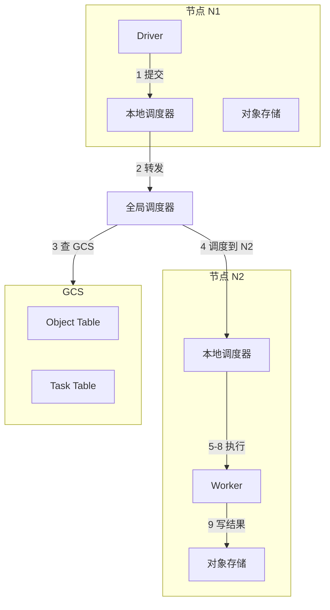

<!-- markdownlint-disable MD025 MD037 MD036 -->

# Ray：面向新兴 AI 应用的分布式框架

**作者**：Philipp Moritz, Robert Nishihara, Stephanie Wang, Alexey Tumanov, Richard Liaw, Eric Liang, Melih Elibol, Zongheng Yang, William Paul, Michael I. Jordan, Ion Stoica  
**机构**：University of California, Berkeley（加州大学伯克利分校）  
**年份**：2018  
**来源**：OSDI (13th USENIX Symposium on Operating Systems Design and Implementation)

---

## 摘要

下一代 AI 应用将持续与环境交互并从这些交互中学习。这些应用在性能和灵活性方面都提出了新的、苛刻的系统需求。本文针对这些需求，提出了 Ray——一个用于满足这些需求的分布式系统。Ray 实现了统一接口，可同时表达任务并行（task-parallel）和基于 Actor 的计算，并由单一动态执行引擎支持。为满足性能需求，Ray 采用分布式调度器和分布式容错存储来管理系统控制状态（control state）。实验表明，Ray 可扩展至每秒超过 180 万任务，并在多个具有挑战性的强化学习（reinforcement learning, RL）应用中优于现有专用系统。

---

## 1 引言

过去二十年间，许多组织一直在收集并试图利用不断增长的数据量。这催生了大量分布式数据分析框架，包括批处理 [20, 64, 28]、流处理 [15, 39, 31] 和图处理 [34, 35, 24] 系统。这些框架的成功使组织能够将大规模数据分析作为其业务或科学战略的核心部分，并开启了「大数据」时代。

近年来，以数据为中心的应用范围已扩展到更复杂的人工智能（AI）或机器学习（ML）技术 [30]。典型范式是监督学习（supervised learning），其中数据点带有标签，而将数据点映射到标签的核心技术由深度神经网络提供。这些深度网络的复杂性引发了另一波专注于深度神经网络训练及其预测使用的框架。这些框架通常利用专用硬件（如 GPU 和 TPU），目标是在批处理场景下缩短训练时间。例如包括 TensorFlow [7]、MXNet [18] 和 PyTorch [46]。

然而，AI 的前景远不止经典监督学习。新兴 AI 应用必须越来越多地在动态环境中运行、对环境变化做出反应，并采取一系列动作以实现长期目标 [8, 43]。它们不仅要利用已收集的数据，还要探索可能的动作空间。这些更广泛的需求自然被置于强化学习（RL）范式之中。RL 涉及基于延迟且有限的反馈，在不确定环境中持续学习如何操作 [56]。基于 RL 的系统已取得显著成果，如 Google AlphaGo 击败人类世界冠军 [54]，并开始应用于对话系统、无人机 [42] 和机器人操作 [25, 60]。

RL 应用的核心目标是学习一个策略（policy）——从环境状态到动作选择的映射——以随时间产生有效性能，例如赢得游戏或驾驶无人机。在大规模应用中找到有效策略需要三种主要能力。首先，RL 方法通常依赖仿真（simulation）来评估策略。仿真使得可以探索多种动作序列选择，并了解这些选择的长期后果。其次，与监督学习类似，RL 算法需要执行分布式训练，以基于仿真或与物理环境交互产生的数据改进策略。第三，策略旨在为控制问题提供解决方案，因此必须在交互式闭环和开环控制场景中提供服务（serving）。

这些特性驱动了新的系统需求：面向 RL 的系统必须支持细粒度计算（例如，在与真实世界交互时以毫秒级渲染动作，并执行大量仿真）、支持时间（例如仿真可能耗时毫秒或数小时）和资源使用（例如训练用 GPU、仿真用 CPU）的异构性，以及支持动态执行——因为仿真或环境交互的结果可以改变后续计算。因此，我们需要一个动态计算框架，以毫秒级延迟处理每秒数百万异构任务。

为大数据工作负载或监督学习工作负载开发的现有框架无法满足 RL 的这些新需求。批量同步并行（BSP）系统如 MapReduce [20]、Apache Spark [64] 和 Dryad [28] 不支持细粒度仿真或策略服务。任务并行系统如 CIEL [40] 和 Dask [48] 对分布式训练和服务的支持很少。流处理系统如 Naiad [39] 和 Storm [31] 同样如此。分布式深度学习框架如 TensorFlow [7] 和 MXNet [18] 不自然支持仿真和服务。最后，模型服务系统如 TensorFlow Serving [6] 和 Clipper [19] 既不支持训练也不支持仿真。

理论上可以将多个现有系统拼接起来提供端到端能力（例如 Horovod [53] 用于分布式训练、Clipper [19] 用于服务、CIEL [40] 用于仿真），但实践中由于这些组件在应用内紧密耦合，这种方法不可行。因此，研究人员和从业者今天为专用 RL 应用构建一次性系统 [58, 41, 54, 44, 49, 5]。这种方法将调度、容错和数据移动等标准系统挑战推给每个应用，给分布式应用开发带来巨大的系统工程负担。

本文提出 Ray，一个支持 RL 应用仿真、训练和服务的通用集群计算框架。这些工作负载的需求从轻量级无状态计算（如仿真）到长时间运行的有状态计算（如训练）不等。为满足这些需求，Ray 实现了统一接口，可同时表达任务并行和基于 Actor 的计算。任务使 Ray 能够高效、动态地负载均衡仿真、处理大输入和状态空间（如图像、视频），并从故障中恢复。相比之下，Actor 使 Ray 能够高效支持有状态计算（如模型训练），并向客户端暴露共享可变状态（如参数服务器）。Ray 在单一高度可扩展且容错的动态执行引擎之上实现 Actor 和任务抽象。

为满足性能需求，Ray 将现有框架 [64, 28, 40] 中通常集中化的两个组件进行了分布式化：(1) 任务调度器；(2) 维护计算谱系（lineage）和数据对象目录的状态元数据存储。这使得 Ray 能够以毫秒级延迟调度每秒数百万任务。此外，Ray 为任务和 Actor 提供基于谱系的容错，为元数据存储提供基于复制的容错。

::: tip
Ray 在 RL 应用背景下支持服务、训练和仿真，但这并不意味着它应被视为其他场景下这些工作负载系统的替代品。Ray 不旨在替代 Clipper [19] 和 TensorFlow Serving [6] 等服务系统，这些系统解决模型部署中的更广泛挑战，包括模型管理、测试和模型组合。同样，尽管 Ray 具有灵活性，它也不是 Spark [64] 等通用数据并行框架的替代品，因为它目前缺乏这些框架提供的丰富功能和 API（如掉队缓解、查询优化）。
:::

**贡献总结**：

- 设计并构建了首个统一训练、仿真和服务的分布式框架——新兴 RL 应用的必要组件
- 为支持这些工作负载，在动态任务执行引擎之上统一了 Actor 和任务并行抽象
- 为实现可扩展性和容错，提出系统设计原则：控制状态存储在分片元数据存储中，所有其他系统组件无状态
- 为实现可扩展性，提出自底向上（bottom-up）分布式调度策略

---

## 2 动机与需求

我们首先考虑 RL 系统的基本组件，并阐述 Ray 的关键需求。如图 1 所示，在 RL 设置中，智能体（agent）反复与环境交互。智能体的目标是学习一个最大化奖励的策略。策略是从环境状态到动作选择的映射。

```text
┌─────────────────────────────────────────────────────────────────┐
│                    RL 系统示例                                    │
│                                                                   │
│  策略评估 ←→ 智能体 ←→ 环境                                         │
│     ↑          │         │                                        │
│     │     action (aᵢ)   state (sᵢ₊₁), reward (rᵢ₊₁)              │
│     │          │         │                                        │
│  策略改进 ←────┴─────────┘                                         │
│                                                                   │
│  训练 ← 服务 ← 仿真                                                │
└─────────────────────────────────────────────────────────────────┘
```

**图 1**：RL 系统示例

学习策略时，智能体通常采用两步过程：(1) 策略评估；(2) 策略改进。为评估策略，智能体与环境交互（例如与环境仿真）生成轨迹（trajectory），轨迹由当前策略产生的一系列（状态，奖励）元组组成。然后智能体使用这些轨迹改进策略，即沿最大化奖励的梯度方向更新策略。图 2 展示了智能体学习策略的典型伪代码。

```python
# 通过与环境（如仿真器）交互评估策略
rollout(policy, environment):
    trajectory = []
    state = environment.initial_state()
    while (not environment.has_terminated()):
        action = policy.compute(state)      # 服务
        state, reward = environment.step(action)  # 仿真
        trajectory.append(state, reward)
    return trajectory

# 迭代改进策略直至收敛
train_policy(environment):
    policy = initial_policy()
    while (policy has not converged):
        trajectories = []
        for i from 1 to k:
            trajectories.append(rollout(policy, environment))
        policy = policy.update(trajectories)  # 训练
    return policy
```

**图 2**：学习策略的典型 RL 伪代码

因此，RL 应用框架必须高效支持训练、服务与仿真（图 1）。下面简要描述这些工作负载。

- **训练**：通常涉及运行随机梯度下降（SGD），常在分布式设置下，以更新策略。分布式 SGD 通常依赖 allreduce 聚合步骤或参数服务器 [32]。
- **服务**：使用训练好的策略根据当前环境状态渲染动作。服务系统旨在最小化延迟、最大化每秒决策数。为扩展，负载通常跨多个服务策略的节点均衡。
- **仿真**：大多数现有 RL 应用使用仿真评估策略——当前 RL 算法样本效率不足，无法仅依赖与物理世界交互获得的数据。这些仿真在复杂度上差异很大，可能只需几毫秒（如模拟国际象棋中的一步）到数分钟（如模拟自动驾驶汽车的逼真环境）。

与监督学习不同，在 RL 中训练和服务可由不同系统分别处理，而 RL 中这三种工作负载在单一应用中紧密耦合，它们之间对延迟有严格要求。目前没有框架支持这种工作负载耦合。理论上可将多个专用框架拼接起来提供整体能力，但实践中，系统间的数据移动和延迟在 RL 背景下令人望而却步。因此，研究人员和从业者一直在构建各自的一次性系统。

这种状况呼唤能够高效支持训练、服务和仿真的新型 RL 分布式框架。具体而言，此类框架应满足以下需求：

| 需求 | 描述 |
|------|------|
| **细粒度、异构计算** | 计算时长可从毫秒（如执行动作）到数小时（如训练复杂策略）。此外，训练常需异构硬件（如 CPU、GPU 或 TPU） |
| **灵活计算模型** | RL 应用既需要无状态也需要有状态计算。无状态计算可在系统任意节点执行，便于负载均衡和按需将计算移至数据；有状态计算适合实现参数服务器、在 GPU 支持的数据上重复计算或运行不暴露其状态的第三方仿真器 |
| **动态执行** | RL 应用的多个组件需要动态执行，因为计算完成顺序并非总是预先可知（如仿真完成顺序），且计算结果可决定后续计算（如仿真结果将决定是否需要更多仿真） |

::: note
假设 5ms 单核任务和 200 个 32 核节点的集群，该集群可运行 (1s/5ms)×32×200 = 128 万 任务/秒。为实现大型集群高利用率，此类框架必须处理每秒数百万任务。此类框架并非用于从零实现深度神经网络或复杂仿真器，而应能与现有仿真器 [13, 11, 59] 和深度学习框架 [7, 18, 46, 29] 无缝集成。
:::

---

## 3 编程与计算模型

Ray 实现动态任务图（dynamic task graph）计算模型，即将应用建模为执行期间演化的依赖任务图。在此模型之上，Ray 同时提供 Actor 和任务并行编程抽象。这种统一使 Ray 区别于仅提供任务并行抽象的 CIEL 等系统，以及主要提供 Actor 抽象的 Orleans [14] 或 Akka [1]。

### 3.1 编程模型

**任务（Tasks）**。任务表示在无状态工作节点上执行远程函数。调用远程函数时，立即返回代表任务结果的 future。可使用 `ray.get()` 获取 future，并可将 future 作为参数传入其他远程函数而无需等待其结果。这使用户能够表达并行性同时捕获数据依赖。表 1 展示了 Ray 的 API。

| 操作 | 描述 |
|------|------|
| `futures = f.remote(args)` | 远程执行函数 f。`f.remote()` 可接受对象或 future 作为输入，返回一个或多个 future。非阻塞 |
| `objects = ray.get(futures)` | 返回与一个或多个 future 关联的值。阻塞 |
| `ready_futures = ray.wait(futures, k, timeout)` | 一旦 k 个完成或超时，返回已完成任务的 future |
| `actor = Class.remote(args)` | 将类 Class 实例化为远程 Actor，返回其句柄。非阻塞 |
| `futures = actor.method.remote(args)` | 在远程 Actor 上调用方法，返回一个或多个 future。非阻塞 |

**表 1**：Ray API

远程函数操作不可变对象，且应为无状态、无副作用：其输出仅由输入决定。这意味着幂等性（idempotence），通过故障时函数重执行简化容错。

**Actor**。Actor 表示有状态计算。每个 Actor 暴露可远程调用的方法，并串行执行。方法执行与任务类似，在远程执行并返回 future，但区别在于它在有状态工作节点上执行。Actor 句柄可传递给其他 Actor 或任务，使它们能够调用该 Actor 的方法。

| 特性 | 任务（无状态） | Actor（有状态） |
|------|----------------|-----------------|
| 负载均衡 | 细粒度负载均衡 | 粗粒度负载均衡 |
| 数据局部性 | 支持对象局部性 | 局部性支持差 |
| 小更新开销 | 高开销 | 低开销 |
| 故障处理 | 高效 | 需检查点，有开销 |

**表 2**：任务与 Actor 的权衡

为满足异构性和灵活性需求（第 2 节），我们以三种方式增强 API：

1. **ray.wait()**：处理异构时长的并发任务，等待前 k 个可用结果，而非像 `ray.get()` 那样等待所有结果
2. **资源需求指定**：使开发者能指定资源需求，以便 Ray 调度器高效管理资源
3. **嵌套远程函数**：远程函数可调用其他远程函数，对实现高可扩展性（第 4 节）至关重要，因为它使多个进程能以分布式方式调用远程函数

### 3.2 计算模型

Ray 采用动态任务图计算模型 [21]，其中远程函数和 Actor 方法的执行在输入可用时由系统自动触发。本节描述如何从用户程序（图 3）构建计算图（图 4）。

```python
@ray.remote
def create_policy():
    return policy  # 随机初始化策略

@ray.remote(num_gpus=1)
class Simulator(object):
    def __init__(self):
        self.env = Environment()
    def rollout(self, policy, num_steps):
        # ... 执行 rollout
        return observations

@ray.remote(num_gpus=2)
def update_policy(policy, *rollouts):
    return policy  # 更新策略

@ray.remote
def train_policy():
    policy_id = create_policy.remote()
    simulators = [Simulator.remote() for _ in range(10)]
    for _ in range(100):
        rollout_ids = [s.rollout.remote(policy_id) for s in simulators]
        policy_id = update_policy.remote(policy_id, *rollout_ids)
    return ray.get(policy_id)
```

**图 3**：用 Ray 实现图 2 示例的 Python 代码

计算图中有两类节点：数据对象和远程函数调用（任务）。还有两类边：数据边和控制边。数据边捕获数据对象与任务间的依赖。若数据对象 D 是任务 T 的输出，则添加从 T 到 D 的数据边；若 D 是 T 的输入，则添加从 D 到 T 的数据边。控制边捕获嵌套远程函数产生的计算依赖：若任务 T1 调用任务 T2，则添加从 T1 到 T2 的控制边。

Actor 方法调用也表示为计算图中的节点，与任务类似，但有一关键区别：为捕获同一 Actor 上后续方法调用间的状态依赖，我们添加第三类边——**有状态边（stateful edge）**。若在同一 Actor 上方法 Mⱼ 紧接方法 Mᵢ 调用，则添加从 Mᵢ 到 Mⱼ 的有状态边。因此，同一 Actor 对象上调用的所有方法形成由有状态边连接的链（图 4），该链捕获这些方法的调用顺序。

```text
                    ┌─────────────┐
                    │ T0          │
                    │ train_policy│
                    └──────┬──────┘
                           │ 控制边
        ┌──────────────────┼──────────────────┐
        │                  │                  │
   ┌────▼────┐       ┌──────▼──────┐    ┌─────▼─────┐
   │ T1      │       │ A10,A20     │    │ T2,T3     │
   │create_  │       │ Simulator   │    │update_   │
   │policy   │       │ (Actor)     │    │policy     │
   └────┬────┘       └──────┬──────┘    └───────────┘
        │                   │ 有状态边
        │            A11→A12→A21→A22 (rollout 链)
        │
   policy1 ──→ rollout11, rollout12, ...
```

**图 4**：`train_policy.remote()` 调用对应的任务图

有状态边帮助我们将 Actor 嵌入 otherwise 无状态的任务图，因为它们捕获共享 Actor 内部状态的连续方法调用间的隐式数据依赖。有状态边还使我们能维护谱系。与其他数据流系统 [64] 一样，我们跟踪数据谱系以支持重建。通过在线谱图中显式包含有状态边，我们可以轻松重建丢失的数据，无论其由远程函数还是 Actor 方法产生（第 4.2.3 节）。

---

## 4 架构

Ray 架构包括 (1) 实现 API 的应用层，以及 (2) 提供高可扩展性和容错的系统层。

### 4.1 应用层

应用层由三类进程组成：

| 进程 | 描述 |
|------|------|
| **Driver** | 执行用户程序的进程 |
| **Worker** | 执行由 Driver 或另一 Worker 调用的任务（远程函数）的无状态进程。由系统层自动启动并分配任务。声明远程函数时，函数自动发布到所有 Worker。Worker 串行执行任务，任务间不维护本地状态 |
| **Actor** | 被调用时仅执行其暴露的方法的有状态进程。与 Worker 不同，Actor 由 Worker 或 Driver 显式实例化。与 Worker 一样，Actor 串行执行方法，但每个方法依赖于前一个方法执行产生的状态 |

### 4.2 系统层

系统层由三个主要组件组成：全局控制存储（GCS）、分布式调度器和分布式对象存储。所有组件均可水平扩展且容错。

```text
┌─────────────────────────────────────────────────────────────────────────────┐
│                            Ray 架构                                          │
├─────────────────────────────── 应用层 ───────────────────────────────────────┤
│  Driver    Worker    Worker    │  Actor   │  Driver   Worker   Worker        │
│     │         │         │      │    │     │     │        │         │        │
├─────────────────────────────── 系统层 ───────────────────────────────────────┤
│  本地调度器  对象存储  │ 本地调度器 对象存储  │  本地调度器  对象存储          │
│       │         │     │     │        │     │       │         │              │
│       └─────────┴─────┴─────┴────────┴─────┴───────┴─────────┘              │
│                              │                                               │
│                    ┌─────────▼─────────┐                                     │
│                    │  全局调度器 (可多副本)  │                                    │
│                    └─────────┬─────────┘                                     │
│                              │                                               │
│              ┌───────────────▼───────────────┐                               │
│              │  GCS (Object Table, Task Table, Function Table, Event Logs)   │
│              └───────────────────────────────┘                               │
└─────────────────────────────────────────────────────────────────────────────┘
```

**图 5**：Ray 架构

#### 4.2.1 全局控制存储（GCS）

全局控制存储（Global Control Store, GCS）维护系统的全部控制状态，是我们设计的独特特性。GCS 核心是具备发布/订阅功能的键值存储。我们使用分片实现扩展，使用每分片链式复制 [61] 提供容错。

GCS 及其设计的主要原因是，为能动态每秒生成数百万任务的系统维护容错和低延迟。节点故障时的容错需要维护谱系信息的解决方案。现有基于谱系的方案 [64, 63, 40, 28] 专注于粗粒度并行，因此可使用单节点（如 master、driver）存储谱系而不影响性能。然而，对于仿真等细粒度、动态工作负载，这种设计不可扩展。因此，我们将持久谱系存储与其他系统组件解耦，使各自能独立扩展。

维护低延迟需要最小化任务调度中的开销，调度涉及选择执行位置，以及随后涉及从其他节点获取远程输入的任务分发。许多现有数据流系统 [64, 40, 48] 将对象位置和大小存储在集中式调度器中，从而将调度与分发耦合——当调度器不是瓶颈时这是自然设计。然而，Ray 目标的规模和粒度要求将集中式调度器排除在关键路径之外。让调度器参与每次对象传输对于 allreduce 等分布式训练重要原语来说开销过大，allreduce 既通信密集又对延迟敏感。因此，我们将对象元数据存储在 GCS 而非调度器中，完全将任务分发与任务调度解耦。

总之，GCS 显著简化了 Ray 的整体设计，因为它使系统中每个组件都可无状态。这不仅简化了容错支持（即故障时组件只需重启并从 GCS 读取谱系），还使分布式对象存储和调度器易于独立扩展，因为所有组件通过 GCS 共享所需状态。额外好处是便于开发调试、分析和可视化工具。

#### 4.2.2 自底向上分布式调度器

如第 2 节所述，Ray 需要动态调度每秒数百万任务，这些任务可能只需几毫秒。我们所知的集群调度器均无法满足这些需求。大多数集群计算框架如 Spark [64]、CIEL [40] 和 Dryad [28] 实现集中式调度器，可提供局部性但延迟在数十毫秒。Sparrow [45] 和 Canary [47] 等分布式调度器可实现高扩展，但它们要么不考虑数据局部性 [12]，要么假设任务属于独立作业 [45]，要么假设计算图已知 [47]。

为满足上述需求，我们设计了两级层次调度器，由全局调度器和每节点本地调度器组成。为避免过载全局调度器，在节点创建的任务首先提交给该节点的本地调度器。本地调度器在本地调度任务，除非节点过载（即本地任务队列超过预定阈值）或无法满足任务需求（如缺少 GPU）。若本地调度器决定不在本地调度任务，则将其转发给全局调度器。由于该调度器首先尝试在调度层次结构的叶节点（即本地）调度任务，我们称之为自底向上调度器。

```text
    Driver/Worker ──提交任务──→ 本地调度器 ──(过载时)──→ 全局调度器
                                    │
                                    ↓
                            从 GCS 获取负载信息
```

**图 6**：自底向上分布式调度器

全局调度器考虑每个节点的负载和任务约束做出调度决策。更具体地，全局调度器识别具有任务请求类型足够资源的节点集合，从中选择提供最低估计等待时间的节点。在给定节点，该时间为 (i) 任务在该节点排队估计时间（即任务队列大小乘以平均任务执行时间）与 (ii) 任务远程输入传输估计时间（即远程输入总大小除以平均带宽）之和。全局调度器通过心跳获取每个节点的队列大小和节点资源可用性，从 GCS 获取任务输入位置和大小。此外，全局调度器使用简单指数平均计算平均任务执行时间和平均传输带宽。若全局调度器成为瓶颈，可实例化更多副本，通过 GCS 共享相同信息，使调度器架构高度可扩展。

#### 4.2.3 内存分布式对象存储

为最小化任务延迟，我们实现了内存分布式存储系统，存储每个任务（或无状态计算）的输入和输出。在每个节点，我们通过共享内存实现对象存储，允许同一节点上运行的任务间零拷贝数据共享。数据格式使用 Apache Arrow [2]。

若任务输入不在本地，执行前将输入复制到本地对象存储。任务也将输出写入本地对象存储。复制消除了热数据对象带来的潜在瓶颈，并最小化任务执行时间——任务仅从/向本地内存读/写数据。这提高了计算受限工作负载的吞吐量，许多 AI 应用属于此类。为低延迟，我们将对象完全保留在内存中，需要时使用 LRU 策略驱逐到磁盘。

与 Spark [64] 和 Dryad [28] 等现有集群计算框架一样，对象存储仅限于不可变数据。这消除了对复杂一致性协议的需求（因为对象不更新），并简化了容错支持。节点故障时，Ray 通过谱系重执行恢复任何所需对象。GCS 中存储的谱系在初始执行期间跟踪无状态任务和有状态 Actor；我们使用前者重建存储中的对象。

为简化，我们的对象存储不支持分布式对象，即每个对象适合单节点。大矩阵或树等分布式对象可在应用层实现为 future 集合。

#### 4.2.4 实现

Ray 是加州大学伯克利分校开发的活跃开源项目。Ray 与 Python 环境完全集成，可通过 `pip install ray` 轻松安装。实现约 4 万行代码（LoC），72% 为 C++（系统层），28% 为 Python（应用层）。GCS 使用每分片一个 Redis [50] 键值存储，全部为单键操作。GCS 表按对象和任务 ID 分片以扩展，每个分片链式复制 [61] 以容错。我们将本地和全局调度器实现为事件驱动、单线程进程。内部，本地调度器维护本地对象元数据、等待输入的任务和准备分发给 Worker 的任务的缓存状态。为在不同对象存储间传输大对象，我们跨多个 TCP 连接条带化对象。

### 4.3 端到端流程

图 7 通过简单示例说明 Ray 如何端到端工作：将两个对象 a 和 b 相加（可为标量或矩阵），返回结果 c。

```text
(a) 远程执行任务
Driver (N1) ──1→ 本地调度器 ──2→ 全局调度器
                    │
                    │ 3: 查询 GCS 获取 a,b 位置
                    │ 4: 决定在 N2 调度（b 在 N2）
                    ↓
N2 本地调度器 ──5→ 检查本地对象存储 ──6→ GCS 查 a 位置
                    │
                    │ 7: 从 N1 复制 a
                    │ 8: 调用 add() 到 Worker
                    ↓
Worker 通过共享内存访问 a, b ──9→ 执行 add(a,b)

(b) 获取结果
N1: ray.get(idc) ──1→ 查本地存储 ──2→ 向 GCS 注册回调
N2: add() 完成 ──3→ 存 c 到本地 ──4→ 添加 c 到 GCS
GCS ──5→ 触发 N1 回调 ──6→ N1 从 N2 复制 c ──7→ 返回 c
```

**图 7**：将 a 和 b 相加返回 c 的端到端示例



---

## 5 评估

我们研究以下问题：

1. Ray 在多大程度上满足第 2 节列出的延迟、可扩展性和容错需求？（第 5.1 节）
2. 使用 Ray API 编写的分布式原语（如 allreduce）施加了哪些开销？（第 5.1 节）
3. 在 RL 工作负载背景下，Ray 与训练、服务和仿真的专用系统相比如何？（第 5.2 节）
4. 与自定义系统相比，Ray 为 RL 应用提供了哪些优势？（第 5.3 节）

所有实验在 Amazon Web Services 上运行。除非另有说明，我们使用 m4.16xlarge CPU 实例和 p3.16xlarge GPU 实例。

### 5.1 微基准测试

**局部性感知任务放置**。细粒度负载均衡和局部性感知放置是 Ray 中任务的主要优势。Actor 一旦放置，无法将计算移至大远程对象，而任务可以。图 8a 显示，无数据局部性感知放置的任务（如 Actor 方法），在 10–100MB 输入数据大小时延迟增加 1–2 个数量级。Ray 通过共享对象存储统一任务和 Actor，使开发者能使用任务对仿真 Actor 产生的输出进行昂贵后处理。

**端到端可扩展性**。GCS 和自底向上分布式调度器的关键优势之一是能够水平扩展系统以支持细粒度任务的高吞吐，同时保持容错和低延迟任务调度。图 8b 在空任务的易并行工作负载上评估该能力，增加 x 轴上的集群大小。我们观察到任务吞吐量随规模增加近乎完美的线性。Ray 在 60 节点时超过每秒 100 万任务，在 100 节点时继续线性扩展至每秒超过 180 万任务。最右侧数据点显示 Ray 可在不到一分钟（54 秒）内处理 1 亿任务，变异性最小。

**对象存储性能**。单客户端写吞吐量随对象大小增加超过 15GB/s。对于较大对象，memcpy 主导对象创建时间。对于较小对象，主要开销在序列化和客户端与对象存储间的 IPC。

**GCS 容错**。为在提供强一致性和容错的同时保持低延迟，我们在 Redis 之上构建了轻量级链式复制 [61] 层。链从 2 个副本开始，在 t≈4.2s 时手动触发重配置（杀死一成员，新成员加入、发起状态传输、恢复 2 路复制）。尽管重配置，客户观察到的最大延迟低于 30ms。

**GCS 刷新**。Ray 配备定期将 GCS 内容刷新到磁盘的能力。提交 5000 万空任务并监控 GCS 内存消耗时，无刷新时内存随跟踪任务数线性增长并最终达到系统内存容量导致停滞；有定期 GCS 刷新时，内存占用被限制在用户可配置水平。

**任务故障恢复**。图 11a 展示了 Ray 使用持久 GCS 谱系存储透明恢复 Worker 节点故障和弹性扩展的能力。工作负载由 Driver 提交的 100ms 任务线性链组成。随着节点被移除（25s、50s、100s），本地调度器重建链中先前结果以继续执行。每节点吞吐量始终保持稳定。

**Actor 故障恢复**。通过将有状态边直接编码到依赖图中，我们可以重用图 11a 中的对象重建机制为有状态计算提供透明容错。Ray 还利用用户定义的检查点函数限制 Actor 重建时间（图 11b）。以最小开销，检查点使仅 500 个方法需重执行，而非无检查点时的 1 万次重执行。

**Allreduce**。在 16 个 m4.16xl 节点上，Ray 在 100MB 上约 200ms、1GB 上约 1200ms 完成 allreduce，分别以 1.5× 和 2× 优于 OpenMPI。Ray 的性能归因于其使用多线程进行网络传输，充分利用 AWS 节点间 25Gbps 连接。Ray 的调度器性能对实现 allreduce 等原语至关重要；注入几毫秒额外延迟时性能下降近 2×。

```text
图 8a 示意：局部性感知 vs 无感知 任务延迟
  - 100KB–100MB 对象：无感知时延迟增 1–2 个数量级
  - 有局部性感知时延迟与对象大小无关

图 8b 示意：可扩展性
  - 节点数 10→100：吞吐量近线性增至 1.8M tasks/s
  - 60 节点时超 1M tasks/s
```

### 5.2 构建块

**分布式训练**。我们使用 Ray Actor 抽象表示模型副本实现数据并行同步 SGD。模型权重通过 allreduce 或参数服务器同步，两者均在 Ray API 之上实现。Ray 与 Horovod 性能相当，在分布式 TensorFlow 的 10% 以内。关键优化是在单次迭代内流水线化梯度计算、传输和求和。

**服务**。表 3 比较了使用 Ray Actor 服务策略与使用 Clipper 系统的服务器吞吐量。由于低开销序列化和共享内存抽象，Ray 对于接收大输入的小型全连接策略模型实现了数量级更高吞吐，对于接收较小输入的更昂贵残差网络策略模型也更快。

| 系统 | 小输入 | 大输入 |
|------|--------|--------|
| Clipper | 4400 ± 15 states/sec | 290 ± 1.3 states/sec |
| Ray | 6200 ± 21 states/sec | 6900 ± 150 states/sec |

**表 3**：Clipper 与 Ray 的吞吐量比较

**仿真**。表 4 显示 Ray 和 MPI 均可良好扩展，但 Ray 实现最高 1.8× 吞吐量。这激励了能够动态生成和收集细粒度仿真任务结果的编程模型。

| 系统 | 1 CPU | 16 CPUs | 256 CPUs |
|------|-------|---------|----------|
| MPI，批量同步 | 22.6K | 208K | 2.16M |
| Ray，异步任务 | 22.3K | 290K | 4.03M |

**表 4**：Pendulum-v0 仿真器的每秒时间步数

### 5.3 RL 应用

**进化策略（ES）**。Ray 上的 ES 实现可扩展至 8192 核。可用核数翻倍时，平均完成时间加速约 1.6×。专用系统在 2048 核时无法完成。Ray 实现使用 Actor 聚合树，达到 3.7 分钟中位时间，比最佳已发表结果（10 分钟）快两倍多。用 Ray 将串行实现初步并行化仅需修改 7 行代码。

**近端策略优化（PPO）**。Ray 的 PPO 实现在所有实验中优于优化的 MPI 实现，同时使用更少 GPU。原因是 Ray 具有异构感知能力，允许用户在任务或 Actor 粒度表达资源需求。Ray 处理资源异构的能力还将 PPO 成本降低了 4.5 倍，因为仅 CPU 任务可调度到更便宜的高 CPU 实例上。结合 Ray 的容错和资源感知调度，总成本降低 18×。

---

## 6 相关工作

**动态任务图**。Ray 与 CIEL [40] 和 Dask [48] 密切相关。三者均支持带嵌套任务的动态任务图并实现 future 抽象。Ray 的差异在于两方面：(1) 扩展任务模型 with Actor 抽象，这对分布式训练和服务中的高效有状态计算必要；(2) 采用完全分布式、解耦的控制平面和调度器，而非依赖存储所有元数据的单 master。

**数据流系统**。MapReduce [20]、Spark [65]、Dryad [28] 等流行数据流系统对细粒度、动态仿真工作负载的计算模型过于受限。Naiad [39] 为部分工作负载提供改进可扩展性，但仅支持静态任务图。

**机器学习框架**。TensorFlow [7] 和 MXNet [18] 针对深度学习工作负载，高效利用 CPU 和 GPU，但对紧密耦合训练与仿真和嵌入式服务所需的更通用计算支持有限。

**Actor 系统**。Orleans [14] 和 Akka [1] 适合开发高可用、并发分布式系统，但与 Ray 相比对数据丢失恢复支持较少。Ray 提供透明容错和恰好一次语义。

**全局控制存储与调度**。Ray 从 SDN、GFS、Omega、MapReduce 等先驱工作汲取灵感，但提供显著改进。Ray 将控制平面信息存储（GCS）与逻辑实现（调度器）解耦，使存储和计算层能独立扩展。Ray 实现独特的分布式自底向上调度器，可水平扩展并处理动态构建的任务图。

---

## 7 讨论与经验

构建 Ray 是一段漫长旅程。两年前从用于分布式训练和仿真的 Spark 库开始。然而 BSP 模型的相对不灵活性、高每任务开销和缺乏 Actor 抽象促使我们开发新系统。自约一年前发布 Ray 以来，数百人使用了它，多家公司在生产环境运行。

**API**。我们强调极简主义。基于早期用户反馈，我们考虑增强 API 以包含更高级原语和库。

**局限性**。给定工作负载通用性，专用优化困难。例如，我们必须在没有完整计算图知识的情况下做出调度决策。此外，为每个任务存储谱系需要实现垃圾回收策略以限制 GCS 存储成本。

**容错**。我们常被问 AI 应用是否真的需要容错。基于经验，答案是「是的」：忽略故障使应用更易编写和推理；通过确定性重放的容错实现极大简化调试；容错有助于省钱，因为允许在 AWS 竞价实例等廉价资源上运行。

**GCS 与水平可扩展性**。GCS 极大简化了 Ray 开发和调试。每当 GCS 成为瓶颈时，我们能够通过添加更多分片进行扩展。我们相信集中控制状态将是未来分布式系统的关键设计组件。

---

## 8 结论

目前没有通用系统能高效支持训练、服务和仿真的紧密循环。为表达这些核心构建块并满足新兴 AI 应用的需求，Ray 在单一动态任务图中统一了任务并行和 Actor 编程模型，并采用由全局控制存储和自底向上分布式调度器实现的可扩展架构。该架构同时实现的编程灵活性、高吞吐和低延迟对新兴 AI 工作负载尤为重要——这些工作负载产生的任务在资源需求、时长和功能上各不相同。我们的评估展示了至每秒 180 万任务的线性可扩展性、透明容错，以及在多个当代 RL 工作负载上的显著性能提升。因此，Ray 为未来 AI 应用的开发提供了灵活性、性能和易用性的强大组合。

---

## 9 致谢

本研究部分由 NSF CISE Expeditions Award CCF-1730628 以及 Alibaba、Amazon Web Services、Ant Financial、Arm、CapitalOne、Ericsson、Facebook、Google、Huawei、Intel、Microsoft、Scotiabank、Splunk 和 VMware 的捐赠支持，以及 NSF grant DGE-1106400。感谢匿名审稿人和 shepherd Miguel Castro 的宝贵反馈。

---

## 参考文献

[1] Akka. <https://akka.io/>  
[2] Apache Arrow. <https://arrow.apache.org/>  
[7] TensorFlow: A system for large-scale machine learning. OSDI 2016.  
[19] Clipper: A low-latency online prediction serving system. NSDI 2017.  
[20] MapReduce: Simplified data processing on large clusters. CACM 2008.  
[40] CIEL: A universal execution engine for distributed data-flow computing. NSDI 2011.  
[48] Dask: Parallel computation with blocked algorithms and task scheduling. 2015.  
[61] Chain replication for supporting high throughput and availability. OSDI 2004.  
[64] Resilient distributed datasets. NSDI 2012.  
[65] Apache Spark: A unified engine for big data processing. CACM 2016.

*（完整参考文献见原文）*

---

[← 上一篇：AWS Lambda](lambda.md) | [返回目录](index.md) | [下一篇：SUNDR →](sundr.md)
