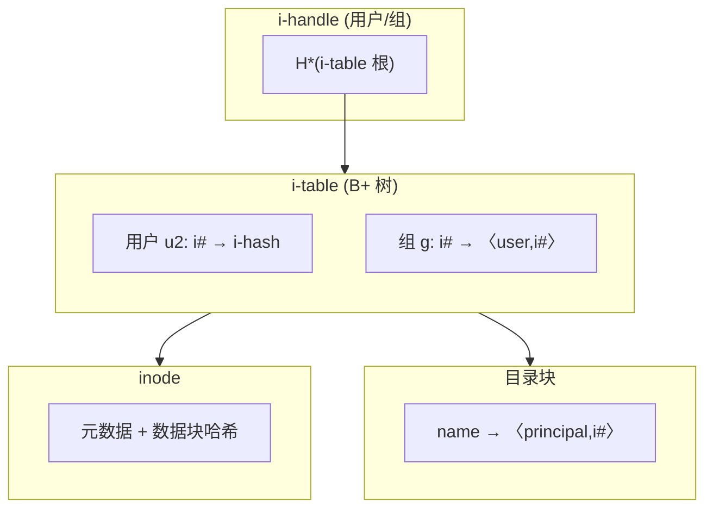

<!-- markdownlint-disable MD025 MD037 MD036 -->

# SUNDR：安全的不可信数据仓库

**作者**：Jinyuan Li, Maxwell Krohn, David Mazières, Dennis Shasha  
**机构**：NYU Department of Computer Science（纽约大学计算机科学系）；Maxwell Krohn 现任职于 MIT CS & AI Lab  
**年份**：2004  
**来源**：OSDI (6th USENIX Symposium on Operating Systems Design and Implementation)

---

## 摘要

SUNDR（Secure Untrusted Data Repository，安全的不可信数据仓库）是一种网络文件系统，旨在将数据安全地存储在不可信服务器上。SUNDR 使客户端能够检测恶意服务器操作者或用户对文件进行的任何未授权修改尝试。SUNDR 的协议实现了一种称为 **fork 一致性**（fork consistency）的性质，它保证：只要客户端能看到彼此的文件修改，就能检测到任何完整性或一致性问题。本文描述的实现与 NFS（网络文件系统）性能相当（有时更好、有时更差），同时提供显著更强的安全性。

---

## 1 引言

SUNDR 是一种网络文件系统，旨在解决数据完整性与可访问性之间长期存在的张力。保护数据通常被视为在存储服务器周围建造更高围墙的问题——限制可访问的人数、禁用可能被远程利用的不必要软件、并及时应用安全补丁。这种方法有两个缺点。第一，经验表明人们往往无法建造足够高的围墙（有时甚至将围墙托付给不完全可信的管理员）。第二且更重要的是，高围墙很不方便；它们限制了人们访问、更新和管理数据的方式。

这种张力在自由软件源代码仓库（source code repository）中尤为明显。自由软件项目往往涉及地理上分散的开发者从全球各地提交源代码变更，使得用防火墙抵御攻击者变得不切实际。托管代码仓库还需要一系列工具，如 CVS [4] 和 SSH [35]，其中许多工具曾存在可被远程利用的漏洞。

更糟的是，许多项目依赖第三方托管服务，这些服务将大量原本独立的代码仓库集中管理。例如，sourceforge.net 为超过 20,000 个不同软件包托管 CVS 仓库。其中许多软件包被打包进各种操作系统发行版，往往未经有意义的审计。通过攻破 sourceforge，攻击者因此可以在最终运行于数千甚至数百万台机器上的软件中植入隐蔽漏洞。

这些担忧并非纸上谈兵。例如，Debian GNU/Linux 开发集群在 2003 年遭到入侵 [2]。未授权攻击者使用嗅探到的密码和内核漏洞获得了 Debian 主要 CVS 和 Web 服务器的超级用户权限。检测到入侵后，管理员被迫冻结开发数天，同时采用手动和临时性检查来评估损害程度。类似攻击也曾成功针对 Apache [1]、Gnome [32] 等流行项目。

与其寄望于无懈可击的服务器，我们开发了 SUNDR——一种降低对存储服务器信任需求的网络文件系统。SUNDR 对所有文件系统内容进行密码学保护，使客户端能够检测任何未授权的文件修改尝试。与先前假设诚实服务器达到阈值比例的拜占庭容错文件系统 [6, 27] 不同，SUNDR 将写文件的权限完全赋予用户的公钥。即使获得 SUNDR 服务器完全管理控制权的恶意用户，也无法说服客户端接受其无权写入的文件的篡改内容。

由于其安全性质，SUNDR 还为数据管理创造了新的选择。通过使用 SUNDR，组织可以将存储管理外包，而无需担心服务器操作者篡改数据。SUNDR 还支持新的数据备份与恢复选项：灾难发生后，SUNDR 服务器可以从不可信客户端的文件缓存中恢复文件系统数据。由于客户端始终对文件系统状态进行密码学验证，它们对数据是从不可信客户端恢复还是始终存在于不可信服务器上并不在意。

本文详述 SUNDR 文件系统的设计与实现。我们首先描述 SUNDR 的安全协议，然后介绍一个原型实现，该实现在示例软件开发工作负载和微基准测试下，性能与流行的 NFS 文件系统大致相当。我们的结果表明，像 CVS 这样的应用可以在付出可接受的性能代价的同时，受益于 SUNDR 的强安全保证。

---

## 2 场景设定

SUNDR 像 NFS [29] 和其他网络文件系统一样，为远程存储提供文件系统接口。例如，要保护源代码仓库，项目成员可以将远程 SUNDR 文件系统挂载到目录 `/sundr`，并使用 `/sundr/cvsroot` 作为 CVS 仓库。所有检出（checkout）和提交（commit）都通过 SUNDR 进行，确保用户能检测到托管站点对仓库内容的任何篡改尝试。

```text
┌─────────────────────────────────────────────────────────────────────────┐
│                        SUNDR 基本架构                                    │
│                                                                          │
│  应用程序 ──syscall──► 客户端 ──RPC──► 服务器                             │
│                │              │                                          │
│                │   fetch/      │   block store                            │
│                │   cache      │   consistency server                     │
│                │   modify     │                                          │
│                │   layer      │                                          │
│                │   security   │                                          │
│                │   layer      │                                          │
└─────────────────────────────────────────────────────────────────────────┘
```

**图 1**：SUNDR 基本架构

图 1 展示了 SUNDR 的基本架构。当应用程序访问文件系统时，客户端软件在内部将系统调用转换为一系列 **fetch**（获取）和 **modify**（修改）操作，其中 fetch 表示检索文件内容或验证缓存的本地副本，modify 表示使新的文件系统状态对其他用户可见。fetch 和 modify 进而通过 SUNDR 协议 RPC 与服务器通信实现。第 3 节解释协议，第 5 节描述服务器设计。

要设置 SUNDR 服务器，需要在具有专用 SUNDR 磁盘或分区的联网机器上运行服务器软件。服务器随后可以托管一个或多个文件系统。要创建文件系统，需要生成一对公钥/私钥超级用户签名密钥，将公钥交给服务器，同时保密私钥。私钥提供对文件系统根目录的独占写权限，并直接或间接允许访问根目录下的任何文件。然而，这些权限仅限于该文件系统。因此，当 SUNDR 服务器托管具有不同超级用户的多个文件系统时，没有人拥有对所有文件的写权限。

SUNDR 文件系统的每个用户也有一个签名密钥。在建立账户时，用户与超级用户交换公钥。超级用户通过文件系统根目录中的两个超级用户拥有的文件管理账户：`.sundr.users` 列出用户的公钥和数字 ID，`.sundr.group` 指定组及其成员。要挂载文件系统，必须在客户端命令行参数中指定超级用户的公钥，并进一步向客户端提供私钥访问权限。（SUNDR 同样可以用更灵活的证书方案管理密钥和组；系统只需要某种方式让用户验证彼此的公钥和组成员资格。）

在本文中，我们使用术语 **用户**（user）指代拥有映射到 `.sundr.users` 文件中某用户 ID 的签名密钥私钥部分的实体。根据上下文，这可以是拥有私钥的人，也可以是代表该用户行事的客户端。然而，SUNDR 假设用户知晓其最后执行的操作。在实现中，客户端会记住其为每个用户执行的最后操作。要在客户端之间切换，用户需要其私钥以及代表其执行的最后操作（可由版本号简洁指定）。或者，一个人可以为不同客户端使用多个用户 ID（可能使用相同公钥），将所有文件权限分配给个人组。

SUNDR 的架构在服务器管理与文件系统管理之间划出了重要界限。要管理服务器，不需要任何私钥超级用户密钥。事实上，为了最佳安全性，密钥对应在独立的可信机器上生成，私钥不应驻留在服务器上，甚至不应存在于内存中。重要密钥（如超级用户密钥）在不使用时应离线存储（例如在软盘上，用口令加密）。

---

## 3 SUNDR 协议

SUNDR 的协议使客户端能够检测对文件的未授权修改尝试，即使攻击者控制了服务器。当服务器行为正确时，一次 fetch 精确反映其之前发生的所有已授权修改。我们称这一性质为 **fetch-modify 一致性**（fetch-modify consistency）。

如果服务器不诚实，客户端强制执行一种稍弱的性质，称为 **fork 一致性**（fork consistency）。直观上，在 fork 一致性下，不诚实的服务器可能使用户 A 的 fetch 错过用户 B 的 modify。然而，任一用户在看到对方的后续操作时都会检测到攻击。因此，要延续欺骗，服务器必须分叉（fork）两个用户对文件系统的视图。等价地说，如果用户 A 的客户端接受了用户 B 的某次修改，那么至少在 B 执行该修改之前，两个用户对文件系统拥有相同且 fetch-modify 一致的视图。

我们已对 fork 一致性进行了形式化规约 [16]，并在假设数字签名和抗碰撞哈希函数的前提下，证明了 SUNDR 的协议实现了它 [17]。因此，违反 fork 一致性意味着底层密码学被攻破、实现偏离了协议，或者我们在从高层 Unix 系统调用到低层 fetch 和 modify 操作的映射中存在缺陷。

为了讨论 fork 一致性的含义并描述 SUNDR，我们从一种简单的稻草人文件系统开始，它以巨大的低效为代价实现 fork 一致性（第 3.1 节）。然后我们提出一种具有更合理带宽需求的改进系统，称为「串行化 SUNDR」（第 3.3 节）。最后我们放宽串行化要求，得到我们实际构建的「并发 SUNDR」（第 3.4 节）。

### 3.1 稻草人文件系统

在 SUNDR 最粗略的近似——稻草人文件系统中，我们避免任何并发操作，并允许系统消耗不合理的带宽和计算量。服务器维护文件系统上的单一、不可信全局锁。要 fetch 或 modify 文件，用户首先获取锁，然后执行所需操作，最后释放锁。只要服务器诚实，操作就完全有序，每个操作在下一个开始之前完成。

稻草人文件服务器存储曾经执行的每次 fetch 或 modify 操作的完整、有序列表。每个操作还包含执行它的用户的数字签名。签名不仅覆盖操作本身，还覆盖其之前所有操作的完整历史。例如，在五次操作之后，历史可能如下所示：

```text
操作历史示例（稻草人系统）：

  user A          user B          user A          user B          user A
    sig             sig             sig             sig             sig
fetch(f2) ──► mod(f2) ──► fetch(f2) ──► fetch(f3) ──► mod(f3)
```

要 fetch 或 modify 文件，客户端获取全局锁，下载文件系统的完整历史，并验证每个用户的最新签名。客户端还检查其用户的上一次操作是否在下载的历史中（除非这是用户对文件系统的第一次操作）。

客户端然后遍历操作历史以构建文件系统的本地副本。对于遇到的每个 modify，客户端还使用用户和组文件验证签名用户对文件所有者或组的权限，以检查该操作是否实际被允许。如果所有检查通过，客户端将新操作追加到列表，对新历史签名，发送给服务器，并释放锁。如果操作是修改，追加的记录包含一个或多个文件或目录的新内容。

现在非形式化地考虑恶意服务器能做什么。要说服客户端接受文件修改，服务器必须发送已签名的历史。假设服务器不知道用户的密钥且无法伪造签名，客户端接受的任何修改必须实际由授权用户签名。然而，服务器仍可通过隐瞒其他用户之前的操作，诱使用户签署不当的历史。例如，考虑在上述历史的最后一次操作中，如果服务器未向用户 B 展示对文件 f2 的最新修改会发生什么。用户 A 和 B 将签署以下历史：

```text
分叉攻击示例：

用户 A 的历史：  fetch(f2) → mod(f2) → fetch(f2) → mod(f3) → fetch(f3)
用户 B 的历史：  fetch(f2) → mod(f2) → fetch(f2) → fetch(f3) → mod(f3)
                        ↑
                  服务器在此隐瞒了 mod(f2)，导致 B 签署了不同的历史
```

两个历史都不是对方的真前缀。由于客户端始终检查历史中其用户的上一次操作，从此以后，A 只会签署第一种历史的扩展，B 只会签署第二种历史的扩展。因此，在攻击之前用户享有 fetch-modify 一致性，攻击之后用户已被分叉。

进一步假设服务器与恶意用户串通，或以其他方式获得了被攻破用户的签名密钥。如果我们将分析限制为仅考虑由诚实（即未被攻破的）用户签名的历史，我们会看到类似的分叉性质成立。一旦两个诚实用户签署了不兼容的历史，他们在看到对方的后续操作时必然会检测到问题。当然，由于服务器可以扩展和签署被攻破用户的历史，它可以修改被攻破用户能写的任何文件。然而，其余文件只能在诚实用户的历史中被修改，因此继续保持 fork 一致。

### 3.2 Fork 一致性的含义

Fork 一致性是在没有在线可信方的情况下可能实现的最强完整性概念。假设用户 A 上线、修改文件、然后下线。之后，B 上线并读取文件。如果 B 不知道 A 是否访问过文件系统，它无法检测服务器直接丢弃 A 的更改的攻击。Fork 一致性意味着这是服务器对文件完整性或一致性进行的唯一类型的不可检测攻击。此外，如果 A 和 B 曾通信或看到对方未来的文件系统操作，他们就能检测到攻击。

在 fork 一致性的前提下，可以利用任何在线的可信方获得更强的一致性，甚至 fetch-modify 一致性。例如，如第 5 节所述，SUNDR 服务器由两个程序组成：处理数据的块存储（block store）和具有极少状态的一致性服务器（consistency server）。将一致性服务器移至可信机器可平凡地保证 fetch-modify 一致性。问题在于可信机器的连通性或可用性可能不如不可信机器。

::: tip
要在不将可信机器置于关键路径上的情况下限制不一致窗口，可以使用具有写单个文件权限的「时间戳盒」（time stamp box）。该盒可以简单地每 5 秒通过 SUNDR 更新该文件。所有看到该盒更新的用户都知道他们最多在过去 5 秒内彼此分区。此类盒可以复制以实现拜占庭容错，每个副本更新一个文件。
:::

或者，可以利用直接的客户端-客户端通信来增强一致性。用户可以写入包含当前网络地址的登录和登出记录到文件，以便相互发现并持续交换各自最新操作的信息。如果恶意服务器无法破坏客户端之间的网络通信，一旦在线客户端彼此知晓，它将无法分叉文件系统状态。那些认为恶意网络分区严重到值得在客户端故障时延迟服务的人，可以在通信中断期间保守地暂停文件访问。

### 3.3 串行化 SUNDR

稻草人文件系统不切实际有两个原因。第一，它必须记录并传输完整的文件系统操作历史，需要巨大的带宽和存储。第二，通过全局锁串行化操作对多用户网络文件系统不切实际。本节解释 SUNDR 对第一个问题的解决方案；我们描述一个简化的文件系统，它仍用全局锁串行化操作，但在其他方面与 SUNDR 类似。第 3.4 节解释 SUNDR 如何让客户端并发执行非冲突操作。

与稻草人文件系统中对操作历史签名不同，SUNDR 实际上采用对文件系统快照签名的方法。粗略地说，用户签署将所有文件的完整状态绑定的消息，通过两种机制实现。第一，特定用户或组可写的所有文件通过哈希树（hash tree）[18] 高效聚合为称为 **i-handle** 的单一哈希值。第二，每个 i-handle 通过版本向量（version vector）[23] 与每个其他 i-handle 的最新版本绑定。

#### 3.3.1 数据结构

在深入协议细节之前，我们首先描述 SUNDR 的存储接口和数据结构。与若干近期文件系统 [9, 20] 一样，SUNDR 通过密码学句柄（cryptographic handle）命名所有磁盘上的数据结构。块存储（block store）通过 20 字节的 SHA-1 哈希索引大多数持久化数据结构，使服务器成为一种大型、高性能的哈希表。据信在计算上不可行找到两个具有相同 SHA-1 哈希的不同数据块。因此，当客户端请求具有特定哈希的块时，它可以通过哈希响应来检查完整性。基于哈希的存储的一个附带好处是，多个文件共有的块只需存储一次。

SUNDR 还存储用户签名的消息。这些消息由公钥哈希和索引号索引（以区分同一密钥签名的多条消息）。

图 2 展示了 SUNDR 按哈希存储和索引的持久化数据结构，以及计算 i-handle 的算法。每个文件由 `〈principal, i-number〉` 对标识，其中 principal 是允许写文件的用户或组，i-number 是每个 principal 的 inode 号。目录项将文件名映射到 `〈principal, i-number〉` 对。称为 **i-table**（i 表）的每个 principal 数据结构将使用中的每个 i-number 映射到相应的 inode。用户 i-table 将每个 i-number 映射到相应 inode 的哈希，我们称之为文件的 **i-hash**。组 i-table 增加一层间接，将组 i-number 映射到用户 i-number。（该间接允许同一用户对组拥有的文件执行多次连续写入，而无需更新组的 i-handle。）inode 本身包含文件数据块和间接块的 SHA-1 哈希。

每个 i-table 存储为 B+ 树，其中内部节点包含其子节点的 SHA-1 哈希，从而形成哈希树。B+ 树根的哈希即为 i-handle。由于块存储允许按 SHA-1 哈希请求块，给定用户的 i-handle，客户端可以通过递归请求适当的中间块来获取和验证用户 i-table 中任何文件的任何块。下一个问题当然是如何获取和验证用户的最新 i-handle。



**图 2**：用户和组的 i-handle。i-handle 是包含用户或组 i-table 的哈希树的根。（H 表示 SHA-1，H* 表示递归应用 SHA-1 计算哈希树根。）组 i-table 将组 inode 号映射到用户 inode 号。用户 i-table 将用户的 inode 号映射到 i-hash。i-hash 是 inode 的哈希，inode 又包含文件数据块的哈希。

#### 3.3.2 协议

i-handle 存储在称为 **版本结构**（version structure）的数字签名消息中，如图 3 所示。每个版本结构由特定用户签名。该结构必须始终包含用户的 i-handle。此外，它可以可选地包含用户所属的一个或多个组的 i-handle。最后，版本结构包含一个 **版本向量**（version vector），由系统中每个用户和组的版本号组成。

当用户 u 执行文件系统操作时，u 的客户端获取全局锁并下载每个用户和组的最新版本结构。我们称这组版本结构为 **版本结构列表**（version structure list, VSL）。（如果自用户上次操作以来只有少数用户和组更改了版本结构，VSL 的大部分传输可以省略。）客户端然后通过可能更新 i-handle 并设置 z 中的版本号以反映文件系统当前状态，计算新的版本结构 z。

更具体地，要设置 z 中的 i-handle：对于 fetch，客户端简单地将 u 之前的 i-handle 复制到 z，因为没有任何变化。对于 modify，客户端计算并包含 u 以及其正在修改 i-table 的任何组的新 i-handle。

客户端然后将 z 的版本向量设置为反映每个 VSL 条目的版本号。对于任何像 z 这样的版本结构，以及任何 principal（用户或组）p，令 z[p] 表示 z 的版本向量中 p 的版本号（若 z 不包含 p 的条目则为 0）。对于每个 principal p，若 yp 是 VSL 中 p 的条目（即包含 p 最新 i-handle 的版本结构），则设置 z[p] ← yp[p]。

最后，客户端增加版本号以反映 z 中的 i-handle。它设置 z[u] ← z[u] + 1，因为 z 始终包含 u 的 i-handle；对于 z 包含其 i-handle 的任何组 g，设置 z[g] ← z[g] + 1。

客户端然后检查 VSL 的一致性。给定两个版本结构 x 和 y，我们定义 x ≤ y 当且仅当 ∀p x[p] ≤ y[p]。为检查一致性，客户端验证 VSL 包含 u 的先前版本结构，并且所有 VSL 条目与 z 的集合在 ≤ 下全序。若是，用户对新版本结构签名并通过 COMMIT RPC 发送给服务器。服务器将新结构加入 VSL 并淘汰已更新 i-handle 的旧条目，此时客户端释放文件系统锁。

```text
分叉攻击下的版本向量演化（图 4）：

步骤 1:  A 签名  hA  〈A-1〉
步骤 2:  B 签名  hB  〈A-1 B-1〉
步骤 3:  A 签名  h'A 〈A-2 B-1〉
         ───────── 服务器在此进行分叉攻击 ─────────
步骤 4:  A 签名  h'A 〈A-3 B-1〉   (A 更新了 i-handle)
步骤 5:  B 签名  hB  〈A-2 B-2〉   (B 未感知 A 的变更)

结果：步骤 4 和 5 签署的两个版本结构不兼容（x ≰ y 且 y ≰ x）
```

**图 4**：带分叉攻击的签名版本结构

图 4 重访第 3.1 节末尾的分叉攻击，展示 SUNDR 中版本向量的演化。随着每个版本结构的签名，用户反映从每个其他用户看到的最高版本号，并增加自己的版本号以反映最新的 i-handle。一致性的违反导致用户签署不兼容的版本结构——即两个结构 x 和 y 满足 x ≰ y 且 y ≰ x。在此示例中，服务器在步骤 3 之后进行分叉攻击。用户 A 在步骤 4 将其 i-handle 从 hA 更新为 h'A，但在步骤 5 中，B 未感知该变更。结果是步骤 4 和 5 签署的两个版本结构不兼容。

正如稻草人文件系统一样，一旦两个用户签署了不兼容的版本结构，它们将永远不会再签署兼容的版本结构，因此无法在不检测到攻击的情况下看到对方的操作（如先前工作 [16] 所证明）。

::: info
值得提及的一项优化是，SUNDR 将哈希树重算的成本分摊到多次操作上。如图 5 所示，i-handle 不仅包含哈希树根，还包含对 i-table 所做更改的小型日志。该变更日志（change log）进一步避免了其他用户在重新验证自上次计算哈希树根以来未更改的缓存文件时获取 i-table 块的需要。
:::

```text
组 g 的 i-table，展示变更日志（图 5）：

  t'g (最近 i-table) + change log (∆1, ∆2, ...) = tg (当前状态)
  
  变更日志记录对 i-table 的增量修改，避免每次重算整棵哈希树
```

**图 5**：组 g 的 i-table，展示变更日志。t'g 是最近的 i-table；将日志应用于 t'g 得到 tg。

---

[← 上一篇：Ray](ray.md) | [返回目录](index.md) | [下一篇：Bitcoin →](bitcoin.md)
