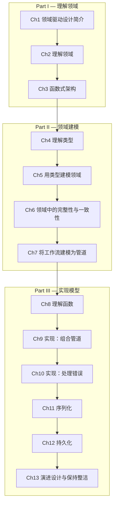

# 领域建模：函数式方法

> **原书**：*Domain Modeling Made Functional: Tackle Software Complexity with Domain-Driven Design and F#* — Scott Wlaschin (Pragmatic Bookshelf, 2018)
>
> **核心主张**：用**类型和函数**——而非类和继承——来建模领域，将 DDD 的战略与战术设计融入函数式编程范式，得到既是可编译代码又是可读文档的领域模型。

---

## 全书章节地图



---

## 核心思想速查

### 函数式 DDD vs 面向对象 DDD

| 维度 | OO 方式 | 函数式方式 |
|------|---------|-----------|
| 基本构建块 | 类、接口、继承 | 类型（AND/OR 类型）、函数 |
| 行为附着 | 方法在对象上 | 函数是独立的、可组合的 |
| 不变量 | 在构造器/setter 中检查 | 用类型系统在编译期保证 |
| 工作流 | 服务类中的方法 | 函数管道（Pipeline） |
| 状态变化 | 可变对象 | 不可变数据 + 状态机 |
| 错误处理 | 异常 | Result 类型（Railway-Oriented Programming） |
| 依赖 | 依赖注入容器 | 函数参数（部分应用） |

### 类型组合的两种基本方式（第4章）

| 组合方式 | 英文 | F# 语法 | 类比 |
|----------|------|---------|------|
| **AND 类型** | Product Type / Record | `type Order = { Id: OrderId; Lines: OrderLine list }` | 同时包含所有字段 |
| **OR 类型** | Sum Type / Discriminated Union | `type PaymentMethod = Cash \| Card of CardInfo \| Check of CheckNo` | 只能是其中之一 |

### 工作流管道模式（第7-9章）

```
输入 DTO
  → 验证（Validate）
    → 定价（Price）
      → 确认（Acknowledge）
        → 创建事件（Create Events）
          → 输出
```

每一步都是一个独立函数，通过组合串联成完整工作流。

---

## 目录

### Part I：理解领域（Understanding the Domain）

| 章节 | 核心内容 | 链接 |
|------|---------|------|
| 第1章 | 共享模型、业务事件、子域划分、限界上下文、通用语言 | [→ 阅读](part1/ch01-introducing-ddd.md) |
| 第2章 | 领域专家访谈、Order-Taking 工作流、领域建模文档 | [→ 阅读](part1/ch02-understanding-the-domain.md) |
| 第3章 | 限界上下文即自治组件、上下文间通信、工作流、代码结构 | [→ 阅读](part1/ch03-functional-architecture.md) |

### Part II：领域建模（Modeling the Domain）

| 章节 | 核心内容 | 链接 |
|------|---------|------|
| 第4章 | 函数、类型、AND/OR 类型组合、可选值、错误、集合 | [→ 阅读](part2/ch04-understanding-types.md) |
| 第5章 | 简单值建模、复杂数据建模、工作流函数、值对象、实体、聚合 | [→ 阅读](part2/ch05-domain-modeling-with-types.md) |
| 第6章 | 简单值约束、度量单位、类型系统保证不变量、一致性 | [→ 阅读](part2/ch06-integrity-and-consistency.md) |
| 第7章 | 工作流输入、状态机、管道步骤建模、效果文档化、长运行工作流 | [→ 阅读](part2/ch07-modeling-workflows-as-pipelines.md) |

### Part III：实现模型（Implementing the Model）

| 章节 | 核心内容 | 链接 |
|------|---------|------|
| 第8章 | 函数即值、高阶函数、全函数、组合 | [→ 阅读](part3/ch08-understanding-functions.md) |
| 第9章 | 简单类型实现、验证步骤、定价步骤、管道组合、依赖注入 | [→ 阅读](part3/ch09-composing-a-pipeline.md) |
| 第10章 | Result 类型、领域错误、bind/map、Railway-Oriented Programming、Computation Expressions | [→ 阅读](part3/ch10-working-with-errors.md) |
| 第11章 | 持久化 vs 序列化、DTO 设计、领域类型与 DTO 转换 | [→ 阅读](part3/ch11-serialization.md) |
| 第12章 | 持久化推到边缘、CQS、文档数据库、关系数据库、事务 | [→ 阅读](part3/ch12-persistence.md) |
| 第13章 | 添加运费、VIP 客户、促销码、营业时间约束、设计演进 | [→ 阅读](part3/ch13-evolving-design.md) |

---

## 关键术语表

| 术语 | 英文 | 定义 |
|------|------|------|
| **AND 类型** | Product Type / Record | 所有字段同时存在的组合类型 |
| **OR 类型** | Sum Type / DU | 只能是多个选项之一的类型 |
| **管道** | Pipeline | 工作流中函数串联组合的模式 |
| **全函数** | Total Function | 对每个可能输入都有合法输出的函数 |
| **Railway-Oriented Programming** | — | 用 Result 类型在双轨（成功/失败）上组合函数 |
| **Computation Expression** | — | F# 中用于简化 bind/map 链的语法糖 |
| **DTO** | Data Transfer Object | 用于序列化/反序列化的简单数据结构 |
| **状态机** | State Machine | 用 OR 类型表示实体在不同阶段的状态转换 |
| **部分应用** | Partial Application | 固定函数部分参数，返回新函数（替代 DI 容器） |

---

*基于 Scott Wlaschin《Domain Modeling Made Functional》(Pragmatic Bookshelf, 2018) 全书翻译*
