# 第1章：领域驱动设计简介

> 本章介绍领域驱动设计（Domain-Driven Design，DDD）的核心原则，强调共享领域模型的重要性，并通过业务事件、子域划分、限界上下文（Bounded Context）和通用语言（Ubiquitous Language）等概念，展示如何将 DDD 应用于订单处理系统这一具体领域。

---

作为开发者，你或许认为自己的工作就是写代码。我不同意。开发者的工作是通过软件解决问题，而编码只是软件开发的一个方面。好的设计和沟通同样重要，甚至更为重要。

如果你把软件开发看作一条管道——输入是需求，输出是最终交付物——那么「垃圾进，垃圾出」的规则就适用。如果输入是糟糕的（需求不清晰或设计不当），那么无论写多少代码都无法产出好的结果。

在本书的第一部分，我们将探讨如何通过一种专注于清晰沟通和共享领域知识的设计方法——领域驱动设计（Domain-Driven Design，DDD）——来尽量减少「垃圾进」的部分。

本章我们将首先讨论 DDD 的原则，并展示如何将其应用于特定领域。DDD 是一个庞大的主题，我们不会深入探讨（更多 DDD 的详细信息，请访问 [dddcommunity.org](http://dddcommunity.org)）。不过，到本章结束时，你至少应该对领域驱动设计如何运作、以及它与数据库驱动设计和面向对象设计有何不同有一个清晰的认识。

当然，领域驱动设计并非适用于所有软件开发。有许多类型的软件（系统软件、游戏等）可以用其他方法构建。然而，它对于业务和企业软件特别有用——这类软件中开发者需要与非技术团队协作——而这类软件正是本书的重点。

## 1.1 共享模型的重要性

在尝试解决问题之前，正确理解问题至关重要。显然，如果我们对问题的理解不完整或扭曲，就无法提供有用的解决方案。可悲的是，最终发布到生产环境的是开发者的理解，而不是领域专家的理解！

那么，我们如何确保作为开发者的我们确实理解了问题？一些软件开发流程通过书面规格说明或需求文档来尝试捕获问题的所有细节。不幸的是，这种方法往往在「最懂问题的人」和「将实现解决方案的人」之间制造了距离。我们将后者称为「开发团队」，不仅包括开发者，还包括 UX/UI 设计师、测试人员等。我们将前者称为「领域专家」。我不会在这里尝试定义「领域专家」——我想你见到一个就能认出来！

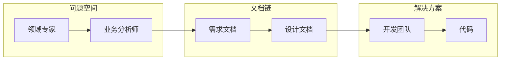

在一种名为「传话」（Telephone）的儿童游戏中，一条消息沿着人链一个接一个地低声传递。每传一次，消息就变得越来越扭曲，产生滑稽的效果。

在真实的开发项目中，这一点都不好笑。开发者对问题的理解与领域专家对问题的理解之间的不匹配，可能对项目的成功造成致命影响。

### 1.1.1 消除中间环节

更好的做法是消除中间环节，鼓励领域专家深度参与开发过程，在开发团队和领域专家之间引入反馈循环。开发团队定期向领域专家交付成果，领域专家可以迅速纠正任何误解，供下一轮迭代使用。

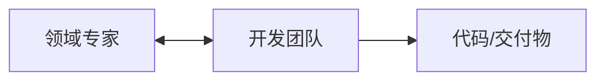

这种迭代过程是「敏捷」（agile）开发流程的核心。然而，即使这种方法也有其问题。开发者充当翻译者，将领域专家的心智模型翻译成代码。但就像任何翻译一样，这个过程可能导致扭曲和重要细微之处的丢失。如果代码与领域中的概念不能完全对应，那么未来在没有领域专家参与的情况下维护代码库的开发者很容易误解需求并引入错误。

### 1.1.2 共享心智模型

但还有第三种方法。如果领域专家、开发团队、其他利益相关者，以及（最重要的是）源代码本身都共享同一个模型会怎样？在这种情况下，不存在从领域专家需求到代码的翻译。相反，代码被设计为直接反映共享的心智模型。

而这正是领域驱动设计的目标。

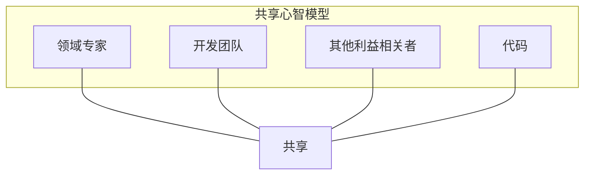

### 1.1.3 对齐软件模型与业务领域的益处

将软件模型与业务领域对齐有许多好处：

| 益处 | 说明 |
|------|------|
| **更快上市** | 当开发者和代码库与提出问题的人共享同一模型时，团队更有可能快速开发出合适的解决方案。 |
| **更高业务价值** | 与问题准确对齐的解决方案意味着更满意的客户和更少的偏离轨道。 |
| **更少浪费** | 更清晰的需求意味着在误解和返工上浪费的时间更少。此外，这种清晰度往往能揭示哪些组件是高价值的，从而将更多开发精力集中在它们身上，减少对低价值组件的投入。 |
| **更易维护和演进** | 当代码所表达的模型与领域专家自己的模型紧密匹配时，修改代码更容易、更不易出错。此外，新团队成员能够更快上手。 |

::: tip 疯狂高效的交付机器
Dan North，著名的开发者和行为驱动开发（Behavior-Driven Development）推广者，在演讲「Accelerating Agile」中描述了他与共享心智模型的经历。他加入了一家交易公司的小团队，并将其描述为他参与过的最疯狂高效的交付机器。在那家公司，少数程序员在数周而非数月或数年内就生产出了最先进的交易系统。

该团队成功的原因之一是，开发者与真正的交易员一起接受培训成为交易员。也就是说，他们自己也成了领域专家。这反过来意味着他们可以与交易员非常有效地沟通，因为共享心智模型，并准确构建领域专家（交易员）想要的东西。
:::

所以我们需要创建共享模型。我们该怎么做？领域驱动设计社区已经制定了一些指导原则来帮助我们：

- 关注业务事件和工作流，而非数据结构
- 将问题领域划分为更小的子域
- 在解决方案中为每个子域创建模型
- 开发一种通用语言（称为「通用语言」Ubiquitous Language），在项目所有参与者之间共享，并在代码中处处使用

让我们逐一探讨这些原则。

## 1.2 通过业务事件理解领域

DDD 式的需求收集方法强调在开发者和领域专家之间建立共享理解。但我们应该从哪里开始来发展这种理解？

我们的第一条指导原则是关注业务事件而非数据结构。为什么？

业务不仅有数据，还会以某种方式转换数据。也就是说，你可以把典型的业务流程看作一系列数据或文档的转换。业务的价值正是在这种转换过程中创造的，因此理解这些转换如何运作以及它们如何相互关联至关重要。

静态数据——只是闲置未用的数据——不会贡献任何价值。那么，是什么促使员工（或自动化流程）开始处理这些数据并增加价值？通常是外部触发（邮件到达或电话响起），也可能是基于时间的触发（每天上午 10 点做某事）或观察（收件箱里没有更多订单要处理，所以去做别的事）。

无论是什么，将其作为设计的一部分捕获都很重要。我们称这些为**领域事件**（Domain Events）。

领域事件是我们想要建模的几乎所有业务流程的起点。例如，「收到新订单表」是一个领域事件，它将启动接单流程。

领域事件始终用过去时书写——某事已经发生——因为它是不可改变的事实。

### 1.2.1 使用事件风暴发现领域

发现领域中事件的方法有很多，但有一种特别适合 DDD 方法的是**事件风暴**（Event Storming）——一种协作式发现业务事件及其相关工作流的流程。

在事件风暴中，你将理解领域不同部分的各类人员聚集在一起，参加一个引导式研讨会。参与者不仅应包括开发者和领域专家，还应包括所有对项目成功有利益关系的其他利益相关者：正如事件风暴者常说的，「任何有疑问的人和任何有答案的人」。研讨会应在有大量墙面空间的房间举行，墙上应贴满纸或白板材料，以便参与者可以贴便签或在其上绘制。在成功的会议结束时，墙上会贴满数百张便签。

在研讨会期间，人们在便签上写下业务事件并贴在墙上。其他人可能会通过贴出总结这些事件触发的业务工作流的便签来回应。这些工作流反过来往往会导致其他业务事件的产生。此外，便签通常可以按时间线组织，这可能会引发小组的进一步讨论。其理念是让所有参与者都参与贴出他们所知道的内容，并对他们不知道的内容提出问题。这是一个高度互动的过程，鼓励每个人参与。关于事件风暴的更多实践细节，请参阅该技术创始人 Alberto Brandolini 的《EventStorming》一书（[eventstorming.com](http://eventstorming.com)）。

### 1.2.2 发现领域：订单处理系统

在本书中，我们将以一个现实的业务问题——订单处理系统——来探索设计、领域建模和实现。

假设我们被请来帮助一家小型制造公司 Widgets Inc 自动化其订单处理工作流。Widgets 的经理 Max 解释说：

> 「我们是一家为其他公司制造零件的小公司：widget、gizmo 之类的东西。我们增长很快，目前的流程跟不上。现在我们所做的一切都是纸质的，我们希望能将其计算机化，以便员工能处理更大批量的订单。特别是，我们希望有一个自助网站，让客户可以自己完成一些任务。比如下单、查询订单状态等。」

听起来不错。那么我们现在该做什么？应该从哪里开始？

第一条指导原则说「关注业务事件」，所以让我们用事件风暴会议来做这件事。以下是 Widgets 公司可能如何开始：

**你**：「有人先贴一个业务事件！」

**Ollie**：「我是接单部门的 Ollie。我们主要处理订单和报价单。」

**你**：「什么触发了这类工作？」

**Ollie**：「当客户通过邮件给我们寄来表格时。」

**你**：「所以事件会是类似『收到订单表』和『收到报价表』这样的？」

**Ollie**：「是的。让我把它们贴到墙上。」

**Sam**：「我是发货部门的 Sam。订单签批后我们负责履行。」

**你**：「你们怎么知道什么时候做？」

**Sam**：「当我们从接单部门收到订单时。」

**你**：「你会把它称为什么事件？」

**Sam**：「『订单可用』怎么样？」

**Ollie**：「我们把完成并准备发货的订单称为『已下单』。我们能同意到处都用这个术语吗？」

**Sam**：「所以『订单已下』是我们关心的事件，对吧？」

你明白了吧。过一会儿，我们可能会得到类似这样的已贴事件列表：

- 收到订单表
- 订单已下
- 订单已发货
- 请求修改订单
- 请求取消订单
- 请求退货
- 收到报价表
- 已提供报价
- 收到新客户请求
- 新客户已注册

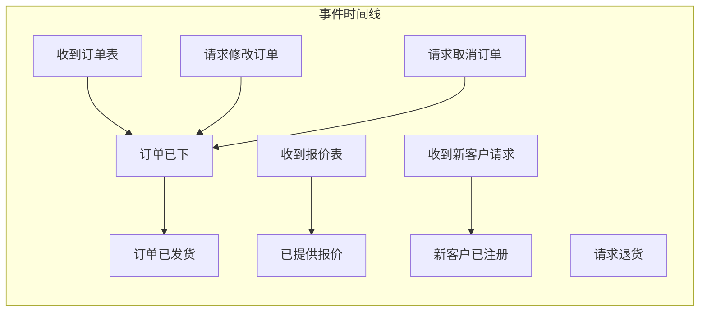

其中一些事件旁边贴有业务工作流，如「下单」和「发货」，我们开始看到事件如何连接成更大的工作流。

我们无法详细覆盖完整的事件风暴会议，但让我们看看事件风暴促进的需求收集的某些方面：

#### 业务的共享模型

除了揭示事件之外，事件风暴的一个关键好处是参与者对业务形成了共享理解，因为每个人都在大墙上看到相同的内容。就像 DDD 一样，事件风暴强调沟通和共享模型，避免「我们」与「他们」的思维。参与者不仅会了解不熟悉的领域方面，还可能发现他们对其他团队的假设是错误的，甚至可能产生有助于业务改进的见解。

#### 意识到所有团队

有时很容易只关注业务的一个方面——你参与的那个——而忘记其他团队也参与其中，可能需要消费你产生的数据。如果所有利益相关者都在房间里，任何被忽视的人都可以发声。

> 「我是计费部门的 Blake。别忘了我们。我们需要知道已完成的订单，这样我们才能向客户收费、为公司赚钱！所以我们也要收到『订单已下』事件。」

#### 发现需求缺口

当事件在墙上的时间线中展示时，缺失的需求往往变得非常清晰：

**Max**：「Ollie，你准备完订单后会告诉客户吗？我在墙上没看到。」

**Ollie**：「哦，是的。我忘了。当订单成功下单后，我们会给客户发邮件说我们收到了，即将发货。那是另一个事件，我想：『已向客户发送订单确认』。」

如果问题没有明确答案，那么问题本身应该贴在墙上作为进一步讨论的触发点。如果流程的某个特定部分引发争议或分歧，不要把它当作问题，把它当作机会！深入这些领域你会学到很多。项目开始时需求往往模糊不清，以这种可见的方式记录问题和争议，可以清楚表明需要做更多工作，并避免过早开始开发过程。

#### 团队间的连接

事件可以按时间线分组，这往往使一个团队的输出成为另一个团队的输入变得清晰。

例如，当接单团队完成订单处理时，他们需要发出新订单已下的信号。这个「订单已下」事件成为发货和计费团队的输入：

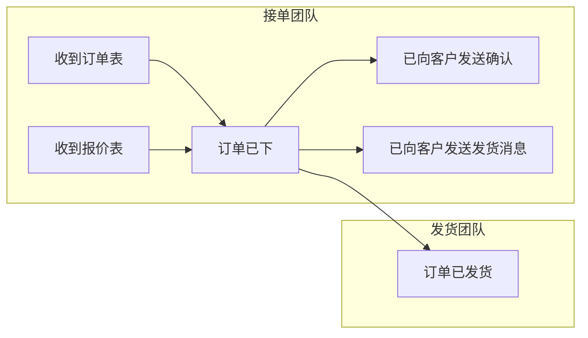

此时技术细节——团队如何连接——无关紧要。我们想关注领域，而不是消息队列与数据库的优劣。

#### 意识到报表需求

在尝试理解领域时，很容易只关注流程和事务。但任何业务都需要了解过去发生了什么——报表始终是领域的一部分！确保在事件风暴会议中包含报表和其他只读模型（如 UI 的视图模型）。

### 1.2.3 将事件扩展到边界

将事件链尽可能向外延伸至系统边界通常很有用。首先，你可以问最左边的事件之前是否有任何事件发生。

**你**：「Ollie，『收到订单表』事件是由什么触发的？它从哪里来？」

**Ollie**：「我们每天早上打开邮件，客户寄来纸质订单表，我们打开并分类为订单或报价。」

**你**：「所以看起来我们还需要一个『收到邮件』事件？」

同样，我们也可以扩展业务发货端的事件。

**你**：「Sam，你把订单发给客户之后还有可能发生什么事件吗？」

**Sam**：「嗯，如果订单是『签收送达』，我们会从快递服务收到通知。所以让我加一个『客户已收到货物』事件。」

将事件向任一方向尽可能延伸是发现缺失需求的另一种好方法。你可能会发现事件链比你预期的更长。

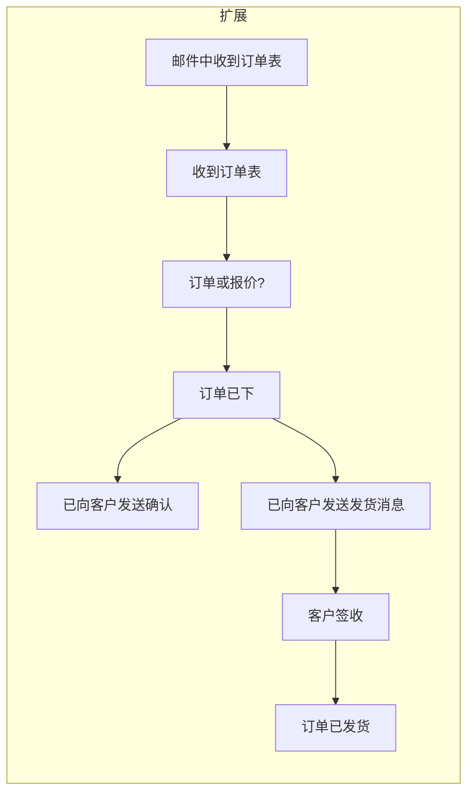

::: info 关于纸质系统
注意领域专家在谈论纸质表格和印刷邮件。我们想要替代的系统将是计算机化的，但通过从工作流、优先级、边界情况等方面思考纸质系统，我们可以学到很多。让我们先专注于理解领域；只有当我们彻底理解它后，才应该考虑如何实现数字等价物。

事实上，在许多业务流程中，纸质与数字的区分无关紧要——理解领域的高层概念根本不依赖于任何特定实现。会计领域就是一个很好的例子；其概念和术语几百年来没有改变。

此外，将纸质系统转换为计算机系统时，通常不需要一次性转换全部。我们应该将系统视为整体，先只转换最受益的部分。
:::

### 1.2.4 记录命令

一旦我们在墙上有许多这样的事件，我们可能会问：「是什么让这些领域事件发生的？」某人或某物希望某个活动发生。例如，客户希望我们收到订单表，或者你的老板要求你做什么。

我们用 DDD 术语称这些请求为**命令**（Commands）（不要与 OO 编程中使用的命令模式混淆）。命令始终用祈使语气书写：「为我做这件事。」

当然，并非所有命令都会成功——订单表可能在邮件中丢失，或者你太忙于更重要的事而无法帮助老板。但如果命令确实成功，它将启动一个工作流，进而创建相应的领域事件。以下是一些例子：

**命令与领域事件的对应关系：**

| 命令 | 领域事件 |
|------|----------|
| 「让 X 发生」 | 若工作流使 X 发生，则对应事件为「X 已发生」 |
| 「向 Widgets Inc 发送订单表」 | 若工作流发送了订单，则对应事件为「订单表已发送」 |
| 「下单」 | 「订单已下」 |
| 「向客户 ABC 发送货物」 | 「货物已发送」 |

事实上，我们将尝试以这种方式建模大多数业务流程。事件触发命令，命令启动某个业务工作流。工作流的输出是更多事件。当然，这些事件又可以触发进一步的命令。

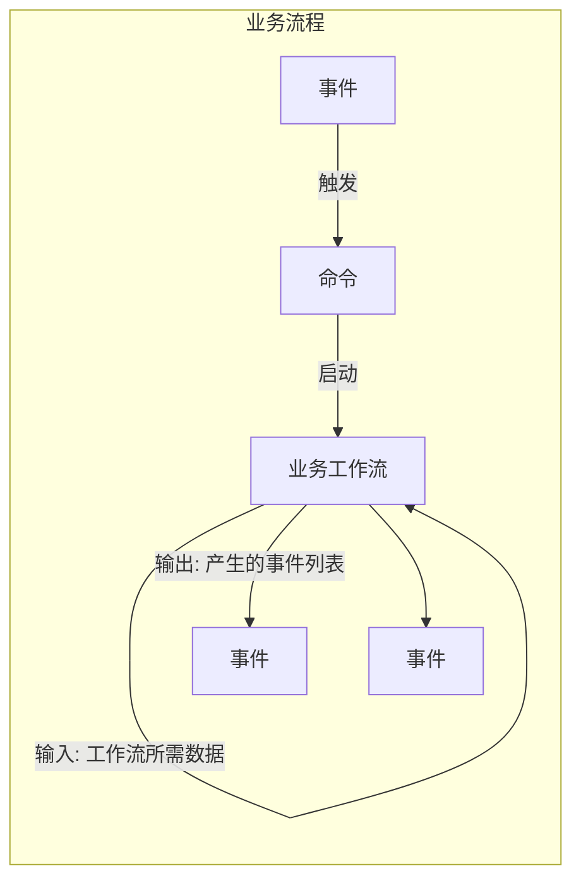

这种思考业务流程的方式——有输入和输出的管道——与函数式编程的运作方式非常契合，我们后面会看到。

使用这种方法，订单处理流程看起来是这样的：

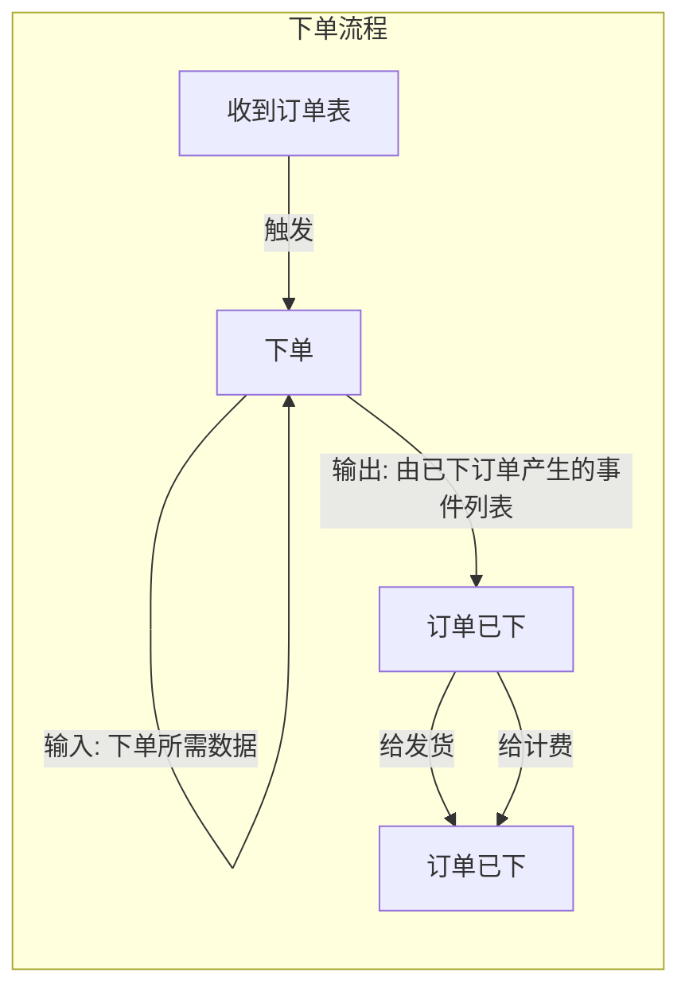

目前我们假设每个命令都会成功，相应的事件会发生。后面在第 10 章「实现：处理错误」（第 191 页）中，我们将看到如何建模失败——当事物出错、命令未成功时如何处理。

顺便说一下，并非所有事件都需要与命令关联。有些事件可能由调度器或监控系统触发，例如会计系统的「月末结账」或仓库系统的「缺货」。

## 1.3 将领域划分为子域

现在我们有了事件和命令列表，对各类业务流程有了很好的理解。但整体图景仍然相当混乱。在开始写任何代码之前，我们必须驯服它。

这就引出了我们的第二条指导原则：「将问题领域划分为更小的子域。」面对一个大问题时，很自然要将其分解为可以分别处理的小组件。这里也是如此。我们有一个大问题：组织围绕订单处理的事件。我们能把它分解成更小的部分吗？

可以。显然「订单处理流程」的各个方面可以分离：接单、发货、计费等。我们知道，业务中这些领域已经有独立的部门，这是我们可以遵循相同分离的强烈暗示。我们将这些领域中的每一个称为一个**域**（domain）。

「域」是一个有多种含义的词，但在领域驱动设计的世界里，我们可以将「域」定义为「连贯知识的领域」。不幸的是，这个定义太模糊而无用，所以这里是域的另一种定义：**域**就是**领域专家**所专精的东西！这在实践中方便得多：与其费力提供「计费」的字典定义，我们只需说「计费」是计费部门的人——领域专家——所做的事。我们都知道「领域专家」是什么；作为程序员，我们自己往往也是多个领域的专家。例如，你可能是某种特定编程语言使用的专家，或某个编程领域（如游戏或科学计算）的专家。你可能在安全、网络或底层优化等领域有知识。这些都是「域」。

域内可能有具有独特性的区域。我们称这些为**子域**（subdomains）——较大域中具有自身专门知识的较小部分。例如，「Web 编程」是「通用编程」的子域。「JavaScript 编程」是 Web 编程的子域（至少曾经是）。

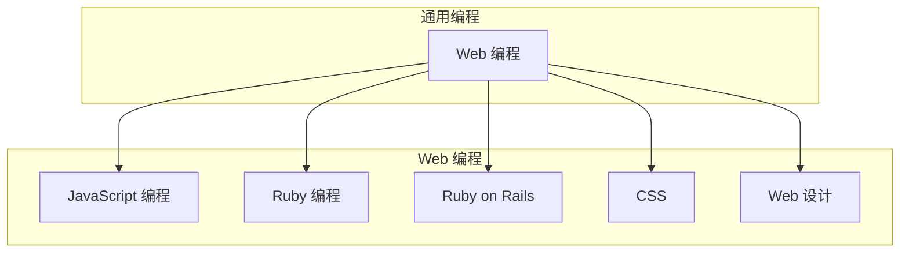

你可以看到域可以重叠。例如，「CSS」子域可以被视为「Web 编程」域的一部分，也可以被视为「Web 设计」域的一部分。所以我们在将域划分为更小部分时必须小心：想要清晰、明确的边界很诱人，但现实世界比那更模糊。

如果我们将这种域划分方法应用于我们的订单处理系统，我们会得到类似这样的结果：

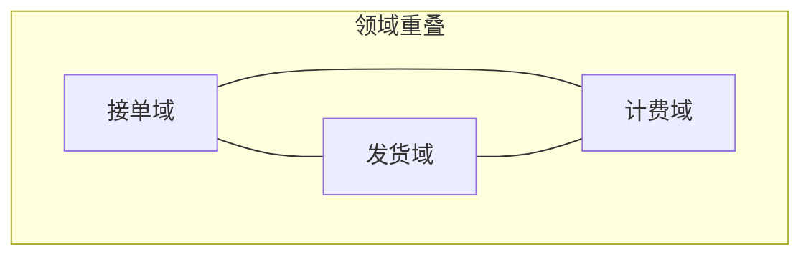

域之间有一点重叠。接单员必须对计费和发货部门的工作略知一二，发货员必须对接单和计费部门的工作略知一二，等等。

正如我们之前强调的，如果你想在开发解决方案时有效，你需要自己成为一定程度的领域专家。这意味着，作为开发者，我们需要努力比目前更深入地理解上述领域。

但让我们暂时搁置这一点，继续讨论创建解决方案的指导原则。

## 1.4 使用限界上下文创建解决方案

理解问题并不意味着构建解决方案很容易。解决方案不可能表示原始领域中的所有信息，我们也不想那样做。我们只应捕获与解决特定问题相关的信息。其他一切都是无关的。

因此，我们需要在「问题空间」和「解决方案空间」之间建立区分，它们必须被视为两个不同的东西。要构建解决方案，我们将创建问题领域的模型，只提取领域相关的方面，然后在我们的解决方案空间中重新创建它们，如下图所示。

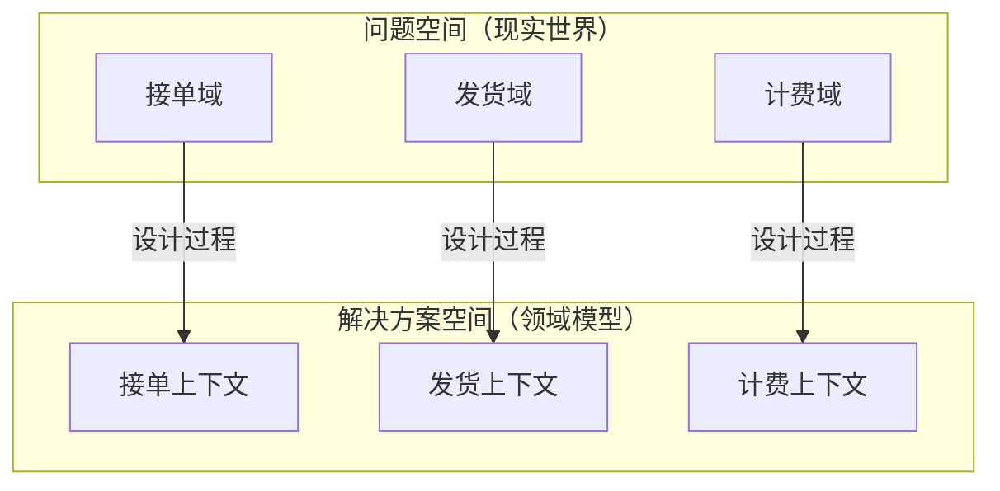

在解决方案空间中，你可以看到问题空间中的域和子域被映射到 DDD 术语所称的**限界上下文**（Bounded Contexts）——我们实现中的一种子系统。每个限界上下文本身就是一个迷你领域模型。我们使用「限界上下文」这个短语而不是「子系统」之类的东西，是因为它帮助我们专注于设计解决方案时重要的东西：意识到上下文，意识到边界。

为什么是**上下文**？因为每个上下文代表解决方案中的某种专门知识。在上下文内，我们共享一种共同语言，设计是连贯和统一的。但就像在现实世界中一样，脱离上下文的信息可能会令人困惑或无法使用。

为什么是**限界**？在现实世界中，域有模糊的边界，但在软件世界中，我们希望减少独立子系统之间的耦合，以便它们可以独立演进。我们可以使用标准软件实践来实现这一点，例如在子系统之间拥有显式 API，避免共享代码等依赖。这意味着，遗憾的是，我们的领域模型永远不会像现实世界那样丰富，但我们可以用更少的复杂性和更容易的维护来容忍这一点。

问题空间中的域与解决方案空间中的上下文并不总是一对一的关系。有时，由于各种原因，单个域被拆分为多个限界上下文——或者更可能的是——问题空间中的多个域在解决方案空间中只由一个限界上下文建模。当你需要与遗留软件系统集成时，这尤其常见。

例如，在另一个世界里，Widgets Inc 可能已经安装了一个将接单和计费合在一个系统中的软件包。如果你需要与这个遗留系统集成，你可能需要将其视为单个限界上下文，尽管它覆盖了多个域，如下图所示。

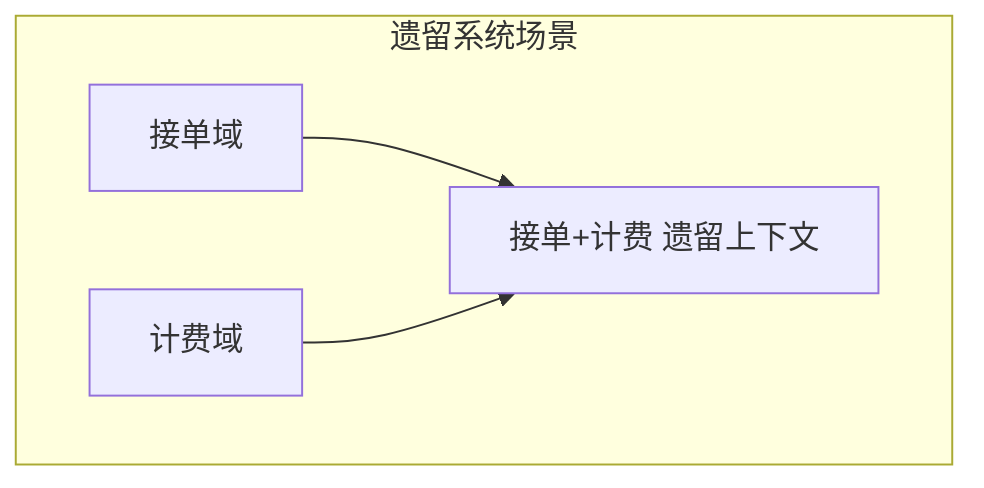

无论你如何划分领域，重要的是每个限界上下文都有明确的职责，因为当我们实现模型时，限界上下文将精确对应某种软件组件。该组件可以实现为独立的 DLL、独立服务，或仅仅是简单的命名空间。细节现在不重要，但正确划分很重要。

### 1.4.1 正确划分上下文

定义这些限界上下文听起来很直接，但在实践中可能很棘手。事实上，领域驱动设计最重要的挑战之一就是正确划分这些上下文边界。这是一门艺术，不是科学，但以下是一些可能有帮助的指导原则：

- **倾听领域专家**。如果他们都使用相同的语言、关注相同的问题，他们可能在同一子域工作（映射到限界上下文）。
- **关注现有的团队和部门边界**。这些是业务认为什么是域和子域的强烈线索。当然，这并不总是成立：有时同一部门的人彼此对立工作。相反，不同部门的人可能非常紧密地协作，这可能意味着他们在同一领域工作。
- **不要忘记限界上下文的「限界」部分**。在设定边界时注意范围蔓延。在需求不断变化的复杂项目中，你需要无情地保持限界上下文的「限界」部分。太大或太模糊的边界根本不是边界。俗话说：「好篱笆造就好邻居。」
- **为自治而设计**。如果两个组为同一限界上下文做贡献，随着演进他们可能会把设计拉向不同方向。想想两人三足赛跑：两个腿绑在一起的跑者比两个自由独立奔跑的跑者慢得多。领域模型也是如此。拥有可以独立演进的独立自治限界上下文，总比一个试图让每个人都满意的大杂烩上下文要好。
- **为无摩擦的业务工作流而设计**。如果工作流与多个限界上下文交互，并经常被它们阻塞或延迟，考虑重构上下文以使工作流更顺畅，即使设计变得「更丑」。也就是说，始终关注业务和客户价值，而不是任何「纯粹」的设计。

最后，没有设计是静态的，任何模型都必须随着业务需求的变化而演进。我们将在第 13 章「演进设计与保持整洁」（第 265 页）中进一步讨论这一点，届时我们将演示各种使订单处理领域适应新需求的方法。

### 1.4.2 创建上下文图

一旦我们定义了这些上下文，我们需要一种方式来沟通它们之间的交互——整体图景——而不陷入设计细节。在 DDD 术语中，这些图称为**上下文图**（Context Maps）。

想想用于出行的路线图。路线图不会显示每个细节：它只关注主要路线，以便你规划行程。例如，以下是航空公司路线图的草图：

```text
        London
           |
    Delta  |  Air France
           |
    Paris -+- Boston
           |
    Lufthansa  United
           |
    Chicago -+- New York
           |
         United
```

该图不显示每个城市的细节，只显示各城市之间的可用路线。地图的唯一目的是帮助你规划航班。如果你想做不同的事，比如在纽约开车，你需要不同的地图（和一些降压药）。

同样，上下文图在高层显示各种限界上下文及其关系。目标不是捕获每个细节，而是提供系统整体的视图。例如，以下是我们目前对订单处理系统的上下文图：

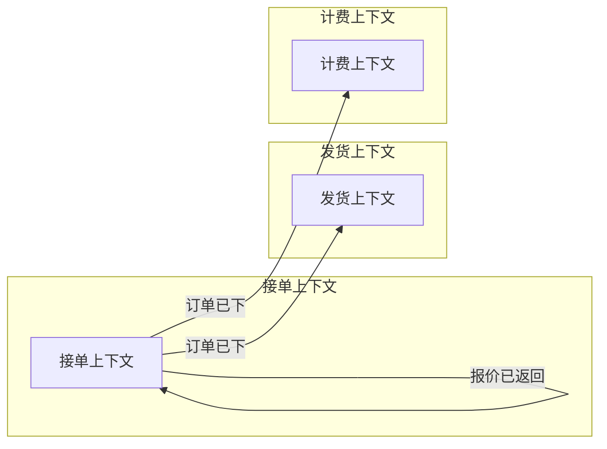

在制作这张图时，我们不关心发货上下文的内部结构，只关心它从接单上下文接收数据。我们非正式地说发货上下文是**下游**（downstream），接单上下文是**上游**（upstream）。

显然，两个上下文需要就它们交换的消息的共享格式达成一致。一般来说，上游上下文对格式有更大影响力，但有时下游上下文不灵活（例如与遗留系统合作）；上游上下文必须适应，或者需要某种翻译器组件作为中介。（这将在第 48 页的「限界上下文之间的契约」中进一步讨论。）

最后，值得指出的是，在我们的设计中，到目前为止我们可以把所有内容放在一张图中。在更复杂的设计中，你自然会想创建一系列较小的图，每张图专注于特定的子系统。

### 1.4.3 聚焦最重要的限界上下文

此时我们有几个明显的限界上下文，随着我们与领域合作可能会发现更多。但它们都同样重要吗？开始开发时我们应该关注哪些？

一般来说，有些域比其他域更重要。这些是**核心域**（core domains）——提供业务优势、带来收入的那些。

其他域可能是必需的但不是核心。这些称为**支撑域**（supportive domains），如果它们不是业务独有的，则称为**通用域**（generic domains）。

例如，对于 Widgets Inc，接单和发货域可能是核心，因为他们的业务优势是出色的客户服务。计费域将被视为支撑域，而货物配送可以被视为通用域，这意味着他们可以安全地外包。

当然，现实从来没那么简单。有时核心域不是你预期的。电子商务企业可能会发现，有库存并准备发货对客户满意度至关重要，在这种情况下，库存管理可能成为核心域，与易用网站一样对业务成功重要。

有时对于哪个域最重要没有共识；每个部门可能认为自己的域最重要。有时，核心域就是客户让你做的东西。

但在所有情况下，重要的是要排定优先级，不要试图同时实现所有限界上下文——这往往会导致失败。专注于那些增加最多价值的限界上下文，然后从那里扩展。

## 1.5 创建通用语言

我们之前说过，代码和领域专家必须共享同一模型。这意味着我们设计中的事物必须代表领域专家心智模型中的真实事物。也就是说，如果领域专家称某物为「订单」，那么我们的代码中应该有与之对应、行为相同的名为 Order 的东西。

反之，我们设计中不应有不代表领域专家模型中某物的东西。这意味着不要有 OrderFactory、OrderManager、OrderHelper 之类的术语。领域专家不会知道这些词是什么意思。当然，代码库中必然会出现一些技术术语，但你应该避免将它们作为设计的一部分暴露出来。

团队每个人之间共享的概念和词汇集合称为**通用语言**（Ubiquitous Language）——「无处不在的语言」。这是定义业务领域共享心智模型的语言。正如其名称所示，这种语言应该在项目中处处使用，不仅在需求中，而且在设计中，最重要的是在源代码中。

通用语言的构建不是由领域专家主导的单向过程，而是团队每个人的协作。你也不应期望通用语言是静态的：它始终是进行中的工作。随着设计演进，准备好发现新术语和新概念，让通用语言相应演进。我们将在本书过程中看到这一点发生。

最后，重要的是要认识到，你往往无法拥有覆盖所有域和上下文的单一通用语言。每个上下文都会有通用语言的「方言」，同一个词在不同方言中可能意味着不同的东西。例如，「class」在面向对象编程领域意味着一件事，在 CSS 领域则意味着完全不同的东西。试图让「Customer」或「Product」这样的词在不同上下文中意味相同，充其量会导致复杂的需求，最坏会导致严重的设计错误。

事实上，我们的事件风暴会议正好展示了这个问题。所有参与者都用「order」这个词来描述事件。但我们很可能会发现，发货部门对「order」的定义与计费部门的定义有细微差别。发货部门可能关心库存水平、商品数量等，而计费部门可能更关心价格和金钱。如果我们在各处使用同一个词「order」而不指定其使用上下文，我们很可能会遇到一些痛苦的误解。

## 1.6 领域驱动设计概念总结

我们介绍了很多新概念和术语，所以在继续之前让我们快速总结一下：

| 概念 | 定义 |
|------|------|
| **域**（Domain） | 与我们要解决的问题相关的知识领域，或简单说，就是「领域专家」所专精的东西。 |
| **领域模型**（Domain Model） | 表示域中与特定问题相关方面的简化集合。领域模型是解决方案空间的一部分，而它所代表的域是问题空间的一部分。 |
| **通用语言**（Ubiquitous Language） | 与领域相关、在团队成员和源代码之间共享的概念和词汇集合。 |
| **限界上下文**（Bounded Context） | 解决方案空间中具有明确边界、与其他子系统区分的子系统。限界上下文通常对应问题空间中的子域。限界上下文也有自己的一套概念和词汇，即通用语言的自己的方言。 |
| **上下文图**（Context Map） | 显示限界上下文集合及其关系的高层图。 |
| **领域事件**（Domain Event） | 系统中发生的某事的记录。始终用过去时描述。事件通常触发进一步的活动。 |
| **命令**（Command） | 对某个流程发生的请求，由人或另一个事件触发。如果流程成功，系统状态改变，记录一个或多个领域事件。 |

## 本章小结

在本章开头，我们强调了创建领域和解决方案共享模型的重要性——开发团队和领域专家使用相同的模型。

然后我们讨论了帮助我们做到这一点的四条指导原则：

- 关注事件和流程而非数据
- 将问题领域划分为更小的子域
- 在解决方案中为每个子域创建模型
- 开发一种项目所有参与者可以共享的「无处不在的语言」

让我们看看我们如何将它们应用于订单处理领域。

### 事件与流程

事件风暴会议迅速揭示了领域中的所有主要领域事件。例如，我们了解到订单处理流程是由收到邮件中的订单表触发的，并且有处理报价、注册新客户等工作流。

我们还了解到，当接单团队完成订单处理时，该事件触发了发货部门启动发货流程、计费部门启动计费流程。

可以记录更多事件和流程，但本书其余部分我们将主要关注这一个工作流。

### 子域与限界上下文

到目前为止，我们似乎发现了三个子域：「接单」、「发货」和「计费」。让我们用「域就是领域专家所专精的东西」规则来验证我们的感觉：

**你**：「嘿 Ollie，你知道计费流程是怎么运作的吗？」

**Ollie**：「略知一二，但如果你想了解细节，你真的应该问计费团队。」

计费是独立的域？确认！

然后我们定义了三个限界上下文来对应这些子域，并创建了显示这三个上下文如何交互的上下文图。

我们应该关注哪个核心域？我们真的应该与经理 Max 商量，决定自动化能在哪里增加最多价值，但目前我们假设将首先实现接单域。如果需要，该域的输出可以转换为纸质文档，以便其他团队可以继续他们现有的流程而不中断。

### 通用语言

到目前为止，我们有「订单表」、「报价」和「订单」等术语，毫无疑问，随着我们深入设计会发现更多。为了帮助保持共享理解，创建一个列出这些术语及其定义的活文档或 wiki 页面会是个好主意。这将帮助每个人保持一致，帮助新团队成员快速上手。

### 下一步

我们现在对问题有了概述、对解决方案有了轮廓，但在创建底层设计或开始编码之前，仍有许多问题需要回答。

订单处理工作流中到底发生了什么？输入和输出是什么？该工作流还与哪些其他上下文交互？发货团队对「订单」的概念与计费团队的有何不同？等等。

在下一章，我们将深入探讨下单工作流，并尝试回答这些问题。

---

[← 返回目录](../index.md) | [下一章：理解领域 →](ch02-understanding-the-domain.md)
