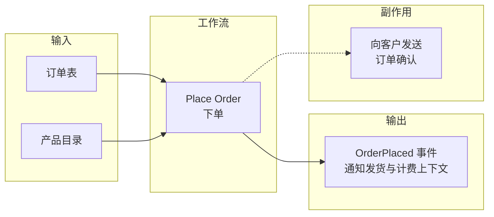
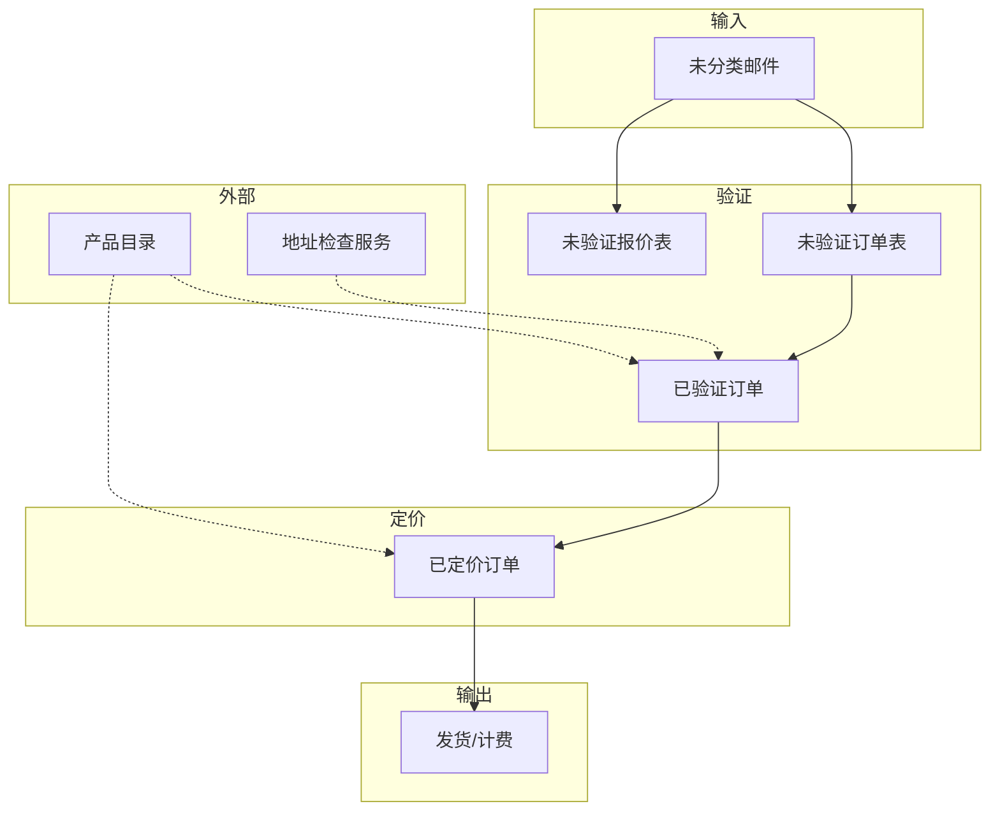

# 第2章：理解领域

> 本章深入探讨一个具体工作流——下单流程——以理解其触发条件、所需数据以及需要协作的限界上下文。我们将看到，在需求收集过程中保持开放心态、避免将技术实现强加于领域，是理解领域的关键。

---

在上一章中，我们着眼于大局——领域的概览和关键业务事件——并将解决方案空间划分为若干限界上下文（Bounded Context）。在此过程中，我们了解了领域驱动设计以及共享模型的重要性。

在本章中，我们将选取一个具体的工作流，尝试深入理解它。它究竟由什么触发？需要什么数据？需要与哪些其他限界上下文协作？

我们将看到，**仔细倾听**是这一过程中的关键技能。我们要避免将自己的心智模型强加于领域。

## 2.1 与领域专家访谈

为了获得我们想要的理解，让我们与领域专家进行一次深入访谈：接单部门的 Ollie。

::: info
领域专家往往很忙，通常无法花太多时间与开发者相处。但命令/事件（commands/events）方法的一个好处是，我们不需要全天会议，而是可以进行一系列简短的访谈，每次只关注一个工作流，这样领域专家更有可能抽出时间。
:::

在访谈的第一部分，我们希望保持高层次，只关注工作流的输入和输出。这将帮助我们避免被与（当前）设计无关的细节淹没。

**你**：「Ollie，我们只谈一个工作流，下单流程。启动这个流程需要什么信息？」

**Ollie**：「嗯，一切都从这张纸开始：客户填写并通过邮件寄给我们的订单表。在计算机化版本中，我们希望客户在线填写这张表。」

Ollie 给你看的东西大致如下：

```text
+--------------------------------------------------+
| Order Form                                       |
| Customer Name:                                   |
| Billing Address:     Shipping Address:            |
| Quote: [ ]  Order: [ ]  Express Delivery: [ ]    |
|                                                  |
| Product Code    Quantity    Cost                 |
| ___________    _________   _____                 |
| ___________    _________   _____                 |
| ___________    _________   _____                 |
|                                                  |
| Subtotal: _______  Total: _______  Shipping: ___|
+--------------------------------------------------+
```

此时你可能会想，这是典型的电商模型。

**你**：「我明白了。所以客户会在网站上浏览产品页面，然后点击将商品加入购物车，再结账？」

**Ollie**：「不，当然不是。我们的客户已经确切知道要订什么。我们只想要一个简单的表单，让他们可以输入产品代码和数量。他们可能一次订购两三百件商品，所以先在产品页面里一个个找再点击会非常慢。」

::: warning
这是一个重要的教训。你应该在学习领域，所以要抵制对任何事物（例如客户将如何使用系统）急于下结论的冲动。好的访谈意味着大量倾听！了解领域的最佳方式是假装自己是人类学家，避免任何先入之见。理想情况下，我们会在承诺设计之前进行深入研究（例如观察人们工作、可用性测试等）。不过在这种情况下，我们会冒险跳过这些步骤，相信 Ollie 足够了解客户需求，能代表他们向我们传达。
:::

### 2.1.1 理解非功能需求

这是退一步讨论工作流背景和规模的好时机。

**你**：「抱歉，我误解了客户是谁。让我再了解一些背景信息。例如，谁使用这个流程，频率如何？」

**Ollie**：「我们是 B2B（Business-to-Business）[^1] 公司，所以客户是其他企业。我们大约有 1000 个客户，他们通常每周下一次单。」

[^1]: <https://en.wikipedia.org/wiki/Business-to-business>

**你**：「所以每个工作日大约两百个订单。有没有特别忙的时候，比如节假日？」

**Ollie**：「没有。全年都比较稳定。」

这很好——我们知道不需要为大规模设计，也不必为流量尖峰设计。那么，客户对系统的期望呢？

**你**：「你说客户是专家？」

**Ollie**：「他们整天都在采购东西，所以是的，他们是该领域的专家。他们知道自己要什么；只需要一种高效的方式来实现。」

这些信息会影响我们对设计的思考。为初学者设计的系统往往与为专家设计的系统大不相同。如果客户是专家，我们就不想给他们设置障碍或任何会拖慢他们的东西。

**你**：「延迟呢？他们需要多快得到响应？」

**Ollie**：「他们需要在工作日结束前收到确认。对我们的业务来说，速度不如一致性重要。我们的客户希望知道我们会以可预测的方式响应和交付。」

这些是 B2B 应用的典型需求：可预测性、稳健的数据处理，以及发生的一切的审计追踪，以便在有疑问或争议时查阅。

### 2.1.2 理解工作流的其余部分

我们继续访谈。

**你**：「好的，每张表你怎么处理？」

**Ollie**：「首先我们检查产品代码是否正确。有时会有拼写错误，或者产品不存在。」

**你**：「你怎么知道产品不存在？」

**Ollie**：「我在产品目录里查。那是一份列出所有产品及其价格的宣传单。每月出版一期新的。看，我桌上就有最新一期。」

产品目录听起来像是另一个限界上下文。我们会记下稍后详细讨论。目前先跳过，只记录这个工作流需要从该上下文获取什么：产品列表及其价格。

**你**：「然后呢？」

**Ollie**：「然后我们把商品成本加起来，填到底部的 Total 字段，然后做两份副本：一份给发货部门，一份给计费部门。我们把原件留在档案里。」

**你**：「然后呢？」

**Ollie**：「然后我们扫描订单，用邮件发给客户，让他们看到价格和应付金额。我们称之为『订单确认』。」

到目前为止说得通。在某个时候，你会想深入了解验证是如何完成的，以及订单是如何传递给其他部门的。不过还有一个问题。

**你**：「那些标着『Quote』和『Order』的框是干什么用的？」

**Ollie**：「如果勾选了『Order』，那就是订单；如果勾选了『Quote』，那就是报价。显而易见。」

**你**：「所以报价和订单有什么区别？」

**Ollie**：「报价是客户只想让我们计算价格，但不实际发货。对于报价，我们只是在表上加上价格，然后寄回给客户。我们不会把副本发给发货和计费部门，因为他们没什么可做的。」

**你**：「我明白了。订单和报价足够相似，所以你们用同一张订单表处理两者，但它们关联的工作流不同。」

### 2.1.3 思考输入与输出

让我们暂停一下，记录我们目前学到的关于工作流输入和输出的内容。

首先，输入显然是订单表（其确切定义我们很快需要细化）。

但输出是什么？我们看到了「已完成订单」的概念（基于输入但经过验证并计算了价格）。但那不能是输出，因为我们不会直接对它做什么。那么「订单确认」呢？那能是输出吗？可能不是。发送订单确认是下单工作流的副作用（side effect），而不是输出。

::: tip
工作流的输出应该始终是它产生的事件——那些在其他限界上下文中触发动作的东西。在我们的例子中，工作流的输出应该是类似「OrderPlaced」（订单已下单）的事件，然后发送给发货和计费上下文。（事件如何实际到达这些部门是稍后讨论的问题；目前与设计无关。）
:::

让我们用输入和输出画出「Place Order」（下单）工作流：



## 2.2 抵制数据库驱动设计的冲动

此时，如果你像大多数开发者一样，会忍不住立即开始勾画底层设计和实现。

例如，你可能会看着那张订单表，发现它由客户信息、一些地址、订单行列表等组成。如果你有丰富的数据库经验，你的第一本能可能是想到表以及它们之间的关系。你可能会设想一个 Order 表、一个 OrderLine 表，以及 Customer、Address 和 Product 表。然后你可能想用下图描述它们之间的关系：

```text
+----------+    1..n    +-------------+    n..1    +----------+
| Customer |<--------->| Order Table  |<--------->| Address  |
+----------+           +-------------+           +----------+
                              | n..1
                              v
                       +--------------+    n..1    +---------+
                       | OrderLine    |<--------->| Product |
                       | Table        |           +---------+
                       +--------------+
```

但如果你这样做，你就犯了一个错误。在领域驱动设计中，我们让**领域驱动设计**，而不是数据库模式（schema）。

::: danger
最好从领域出发，在不考虑任何特定存储实现的情况下建模。毕竟，在现实世界的纸质系统中，根本没有数据库。「数据库」的概念当然不是通用语言的一部分。用户不关心数据如何持久化。

在 DDD 术语中，这被称为**持久化忽略**（persistence ignorance）。这是一个重要原则，因为它迫使你专注于准确建模领域，而不必担心数据在数据库中的表示。
:::

为什么这很重要？嗯，如果你总是从数据库的角度设计，你往往会扭曲设计以适配数据库模型。

作为数据库驱动模型带来的扭曲的一个例子，我们在上面的图中已经忽略了订单和报价之间的区别。当然，在数据库中我们可以用一个标志来区分它们，但业务规则和验证规则是不同的。例如，我们后来可能了解到 Order 必须有计费地址，而 Quote 不需要。这很难用外键建模。这种细微差别在数据库设计中已经丢失，因为同一个外键为两种关系承担双重职责。

当然，设计可以修正来处理它，在第 239 页关于持久化的章节中，我们将看到如何将领域驱动设计持久化到关系数据库。但目前我们真的想专注于不带偏见地倾听需求。

## 2.3 抵制类驱动设计的冲动

如果你是有经验的面向对象开发者，那么不偏向特定数据库模型的想法应该很熟悉。事实上，依赖注入（dependency injection）等面向对象技术鼓励你将数据库实现与业务逻辑分离。

但如果你用对象而不是领域来思考，你也可能最终将偏见引入设计。

例如，当 Ollie 在说话时，你可能在脑海中创建类，如下所示：

```text
                    +----------+
                    | Customer |
                    +----------+
                         |
                         | 1..n
                         v
              +-------------------+
              |    OrderBase      |
              +-------------------+
              | billing address   |
              | shipping address |
              +-------------------+
                    /         \
                   /           \
            +------+           +------+
            | Order |           | Quote|
            +------+           +------+
                 |
                 | 1..n
                 v
         +----------------+
         |   OrderLine    |
         +----------------+
         | Quantity       |
         +----------------+
              | n..1
              v
         +---------+
         | Product |
         +---------+
```

让类驱动设计可能和让数据库驱动设计一样危险——同样，你并没有真正倾听需求。

在上面的初步设计中，我们分离了订单和报价，但引入了一个在现实世界中不存在的虚构基类 OrderBase。这是对领域的扭曲。试着问问领域专家 OrderBase 是什么！

::: warning
这里的教训是：在需求收集过程中，我们应该保持开放心态，不要将自己的技术想法强加于领域。
:::

## 2.4 记录领域

好的，我们想避免被技术实现带偏，但那么应该如何记录这些需求呢？

我们可以使用可视化图表（如 UML），但这些往往难以使用，而且不够详细，无法捕捉领域的一些细微之处。

本书后面我们将看到如何在代码中创建准确的领域模型，但目前，让我们创建一个简单的基于文本的语言，用于捕捉领域模型：

- **对于工作流**：我们记录输入和输出，然后只用一些简单的伪代码表示业务逻辑。
- **对于数据结构**：我们用 AND 表示两部分都需要，如 `Name AND Address`。用 OR 表示只需其中一部分，如 `Email OR PhoneNumber`。

使用这种迷你语言，我们可以这样记录 Place Order 工作流：

```text
Bounded context: Order-Taking
Workflow: "Place order"
triggered by:
  "Order form received" event (when Quote is not checked)
primary input:
  An order form
other input:
  Product catalog
output events:
  "Order Placed" event
side-effects:
  An acknowledgment is sent to the customer,
  along with the placed order
```

我们可以这样记录与工作流相关的数据结构：

```text
bounded context: Order-Taking
data Order =
  CustomerInfo
  AND ShippingAddress
  AND BillingAddress
  AND list of OrderLines
  AND AmountToBill
data OrderLine =
  Product
  AND Quantity
  AND Price
data CustomerInfo = ??? // don't know yet
data BillingAddress = ??? // don't know yet
```

Provide Quote（提供报价）工作流及其相关数据结构可以用类似方式记录。

注意，我们没有尝试创建类层次结构或数据库表或其他任何东西。我们只是试图以一种略有结构的方式捕捉领域。

::: tip
这种基于文本的设计的优点是，它对非程序员来说不可怕，这意味着可以展示给领域专家并一起完善。

关键问题是，我们能否让代码也看起来这么简单。在后续章节「用类型进行领域建模」中，我们将尝试做到这一点。
:::

## 2.5 深入接单工作流

我们已经记录了输入和输出，接下来深入了解接单工作流的细节。

**你**：「Ollie，你能详细说说你怎么处理订单表吗？」

**Ollie**：「早上收到邮件后，我做的第一件事是分类。订单表放一堆，其他信件放另一堆。然后，对每张表，我看 Quote 框是否被勾选；如果是，就把表放到 Quotes 堆上，稍后处理。」

**你**：「为什么？」

**Ollie**：「因为订单总是更重要。我们靠订单赚钱。报价不赚钱。」

::: info
Ollie 在收集需求时提到了非常重要的一点。作为开发者，我们倾向于关注技术问题，把所有需求视为同等重要。企业不这么想。赚钱（或省钱）几乎总是开发项目背后的驱动力。如果你不确定什么是最重要的优先级，跟着钱走！在这种情况下，我们需要设计系统，使（赚钱的）订单优先于报价。
:::

继续……

**你**：「处理订单表时，你做的第一件事是什么？」

**Ollie**：「第一件事是检查客户的姓名、邮箱、发货地址和计费地址是否有效。」

在与 Ollie 进一步讨论后，我们了解到地址是通过 Ollie 电脑上的一个特殊应用来检查的。Ollie 输入地址，电脑会查找它们是否存在。它还会把它们转换成快递服务喜欢的标准格式。

我们又学到了新东西。工作流需要与上下文外的某个第三方地址检查服务通信。我们在事件风暴中漏掉了这一点，所以必须记下来。

如果姓名和地址无效，Ollie 用红笔在表上标出问题，放到无效表堆上。稍后，Ollie 会打电话给客户，要求更正信息。

我们现在知道有三个堆：收到的订单表（来自邮件）、收到的报价（稍后处理）和无效订单表（也稍后处理）。

::: tip
纸堆是大多数业务流程中非常重要的一部分。让我们重申，有些堆比其他堆更重要；我们绝不能忘记在设计中捕捉这一点。到了实现阶段，「纸堆」与队列（queue）很好地对应，但我们必须再次提醒自己，目前要远离技术细节。
:::

**Ollie**：「之后，我检查表上的产品代码。有时它们明显是错的。」

**你**：「你怎么能看出来？」

**Ollie**：「因为代码有特定格式。Widget（小部件）的代码以 W 开头，然后是四位数字。Gizmo（小玩意儿）的代码以 G 开头，然后是三位数字。」

**你**：「还有其他类型的产品代码吗？或者很快会有？」

**Ollie**：「没有。产品代码格式多年来没变过。」

**你**：「看起来正确的产品代码呢？你会检查它们是真实产品吗？」

**Ollie**：「会。我在产品目录的副本里查。如果有任何代码不在里面，我就在表上标出错误，放到无效订单堆里。」

让我们暂停一下，看看产品代码这里发生了什么：

- **首先**，Ollie 看代码的格式：是否以 W 或 G 开头，等等。用编程术语说，这是纯粹的**语法检查**。我们不需要访问产品目录就能做这个。
- **接下来**，Ollie 检查代码是否存在于产品目录中。对 Ollie 来说，这涉及在书里查东西。在软件系统中，这将是数据库查找。

**你**：「有个傻问题。假设产品团队有人能即时回答你所有问题。你还需要自己的产品目录副本吗？」

**Ollie**：「但如果他们忙呢？或者电话坏了呢？这真的不是速度问题，是控制问题。我不想因为别人不可用而中断工作。如果我有自己的产品目录副本，我几乎可以处理每张订单表，而不依赖产品团队。」

所以这真的是关于依赖管理，而不是性能。我们之前讨论过限界上下文中自主性的重要性（第 18 页「正确划分上下文」）。这可能对领域建模很重要——也可能不重要——但无论如何，你应该意识到各部门独立工作的需求。

**你**：「好的，假设所有产品代码都没问题。接下来呢？」

**Ollie**：「我检查数量。」

**你**：「数量是整数还是浮点数？」

**Ollie**：「Float？像水里的那种？」

::: warning
通用语言时间！专业提示：领域专家不使用「float」这样的编程术语。
:::

**你**：「那你管那些数字叫什么？」

**Ollie**：「我叫它们『订单数量』，废话！」

好的，我们可以看到 OrderQuantity 将成为通用语言中的一个词，还有 ProductCode、AmountToBill 等。

再试一次：

**你**：「订单数量有小数，还是只是整数？」

**Ollie**：「看情况。」

「看情况。」当你听到这个，你就知道事情变得复杂了。

**你**：「看什么情况？」

**Ollie**：「看产品是什么。Widget 按件卖，但 Gizmo 按公斤卖。如果有人要 1.5 个 widget，那当然是错的。」

你飞快地记笔记。

**你**：「好的，假设所有产品代码和订单数量都没问题。接下来呢？」

**Ollie**：「接下来，我在订单的每一行写上价格，然后加起来算出总应付金额。然后，正如我之前说的，我做两份订单表副本。我把原件归档，一份放进出货发件箱，第二份放进计费发件箱。最后，我扫描原件，附到标准确认信上，用邮件发回给客户。」

**你**：「最后一个问题。你有这么多订单表散落各处。你有没有不小心把已处理的和还没验证的混在一起？」

**Ollie**：「没有。每次我对它们做过什么，我都会做某种标记。例如，当表单验证通过后，我在角落做个标记，所以我知道我已经做过那步了。我能看出价格已经算好了，因为『total』框填好了。这样做意味着我总能区分处于不同阶段的订单表。」

这是停下来消化我们所学的好时机。

## 2.6 在领域模型中表示复杂性

随着我们深入这一个工作流，领域模型变得复杂得多。这是好事。与其在编码中途才发现，不如现在花时间理解复杂性。「几周的编程可以省下几小时的规划」，正如他们所说。

这是当前工作流的示意图：



但这个图并没有反映我们学到的所有内容。让我们看看能否做得更好，用我们的基于文本的语言捕捉所有这些新信息。

### 2.6.1 表示约束

我们从最原始的值开始：产品代码和数量。我们了解到它们不仅仅是简单的字符串和整数，而是以各种方式受到约束。

```text
context: Order-Taking
data WidgetCode = string starting with "W" then 4 digits
data GizmoCode = string starting with "G" then 3 digits
data ProductCode = WidgetCode OR GizmoCode
```

我们是否过于严格？如果需要处理新型产品怎么办？这是我们经常遇到的问题。如果我们太严格，会让改变变得困难。但如果我们有太多自由，就根本没有设计。

答案总是取决于上下文。不过一般来说，从领域专家的角度捕捉设计很重要。检查不同类型的代码是验证过程的重要部分，因此应该在领域设计中反映出来，目标是自文档化。如果我们不在这里作为模型的一部分记录不同类型的产品代码，我们也不得不在别处记录它们。

此外，如果需求确实变化，我们的模型非常容易修改；添加新型产品代码只需要多一行。

最后，记住设计严格并不意味着实现也必须严格。例如，验证过程的自动化版本可能只是将可疑代码标记出来供人工审批，而不是直接拒绝整个订单。

那么，如何记录数量的需求呢？这是提议的设计：

```text
data OrderQuantity = UnitQuantity OR KilogramQuantity
data UnitQuantity = integer between 1 and ?
data KilogramQuantity = decimal between ? and ?
```

正如我们对产品代码所做的那样，我们将 OrderQuantity 定义为选择——在这种情况下是 UnitQuantity 和 KilogramQuantity 之间。

不过写下来时，我们意识到 UnitQuantity 和 KilogramQuantity 没有上限。UnitQuantity 肯定不能允许几十亿吧？

让我们向领域专家确认。Ollie 给了我们需要的限制：

- 订单数量允许的最大件数是 1000。
- 最低重量是 0.05 kg，最高是 100 kg。

::: tip
这类约束很重要，必须捕捉。我们绝不想在生产环境中出现单位意外为负数或重量为数百千吨的情况。
:::

这是更新后的规格，约束已记录：

```text
data UnitQuantity = integer between 1 and 1000
data KilogramQuantity = decimal between 0.05 and 100.00
```

### 2.6.2 表示订单的生命周期

现在让我们转向 Order。在我们之前的设计草图中，订单有一个简单的定义：

```text
data Order =
  CustomerInfo
  AND ShippingAddress
  AND BillingAddress
  AND list of OrderLines
  AND AmountToBill
```

但现在显然这个设计过于简单，没有捕捉 Ollie 对订单的思考方式。在 Ollie 的心智模型中，订单有**生命周期**。它们从未验证开始（直接来自邮件），然后被「验证」，然后被「定价」。

在开始时，订单没有价格，但到最后有。上面简单的 Order 定义抹掉了这种区别。

对于纸质表单，Ollie 用每阶段后在订单上做标记来区分这些阶段，所以未验证订单与已验证订单可以立即区分，已验证的与已定价的也可以区分。我们需要在领域模型中捕捉这些相同的阶段，不仅是为了文档，也是为了明确（例如）未定价的订单不应发给发货部门。

最简单的方法是为每个阶段创建新名称：UnvalidatedOrder、ValidatedOrder 等。这确实意味着设计变得更长、写起来更繁琐，但优点是**一切都很清晰**。

让我们从到达的初始未验证订单和报价开始。我们可以这样记录：

```text
data UnvalidatedOrder =
  UnvalidatedCustomerInfo
  AND UnvalidatedShippingAddress
  AND UnvalidatedBillingAddress
  AND list of UnvalidatedOrderLine
data UnvalidatedOrderLine =
  UnvalidatedProductCode
  AND UnvalidatedOrderQuantity
```

这种文档明确表示，在工作流开始时，CustomerInfo 尚未验证，ShippingAddress 尚未验证，等等。

下一阶段是订单已被验证。我们可以这样记录：

```text
data ValidatedOrder =
  ValidatedCustomerInfo
  AND ValidatedShippingAddress
  AND ValidatedBillingAddress
  AND list of ValidatedOrderLine
data ValidatedOrderLine =
  ValidatedProductCode
  AND ValidatedOrderQuantity
```

这表明所有组件现在都已检查并有效。

下一阶段是给订单定价。Priced Order（已定价订单）与已验证订单类似，除了以下区别：

- 每一行现在都有与之关联的价格。即 PricedOrderLine 是 ValidatedOrderLine 加上 LinePrice。
- 整个订单有与之关联的 AmountToBill，计算为行价格的总和。

这是该模型：

```text
data PricedOrder =
  ValidatedCustomerInfo
  AND ValidatedShippingAddress
  AND ValidatedBillingAddress
  AND list of PricedOrderLine  // 与 ValidatedOrderLine 不同
  AND AmountToBill             // 新增
data PricedOrderLine =
  ValidatedOrderLine
  AND LinePrice               // 新增
```

最后阶段是创建订单确认。

```text
data PlacedOrderAcknowledgment =
  PricedOrder
  AND AcknowledgmentLetter
```

你现在可以看到，我们在这个设计中已经捕捉了大量业务逻辑——例如这些规则：

- 未验证订单没有价格。
- 已验证订单中的所有行都必须被验证，不能只是其中一些。

模型比我们最初想的复杂得多。但我们只是在反映业务的运作方式。如果我们的模型没有这么复杂，我们就没有正确捕捉需求。

如果我们能在代码中也保持这些区别，那么我们的代码将准确反映领域，我们将拥有正确的「领域驱动」设计。

### 2.6.3 细化工作流中的步骤

工作流显然可以分解为更小的步骤：验证、定价等。让我们对每个步骤应用相同的输入/输出方法。

首先，整个工作流的输出比我们之前想的稍微复杂一点。最初唯一的输出是「Order placed」事件，但现在工作流的可能结果是：

- 我们向发货/计费发送「Order placed」事件，**或**
- 我们把订单表放到无效订单堆上，跳过其余步骤。

让我们用伪代码记录整个工作流，将 ValidateOrder 等步骤拆分为单独的子步骤：

```text
workflow "Place Order" =
  input: OrderForm
  output:
    OrderPlaced event (put on a pile to send to other teams)
    OR InvalidOrder (put on appropriate pile)
  // step 1
  do ValidateOrder
  If order is invalid then:
    add InvalidOrder to pile
    stop
  // step 2
  do PriceOrder
  // step 3
  do SendAcknowledgmentToCustomer
  // step 4
  return OrderPlaced event (if no errors)
```

整体流程记录好后，我们可以为每个子步骤添加额外细节。

例如，验证表单的子步骤以 UnvalidatedOrder 为输入，输出是 ValidatedOrder 或 ValidationError。我们还将记录子步骤的依赖：它需要来自产品目录的输入（我们称之为 CheckProductCodeExists 依赖）和外部地址检查服务（CheckAddressExists 依赖）。

```text
substep "ValidateOrder" =
  input: UnvalidatedOrder
  output: ValidatedOrder OR ValidationError
  dependencies: CheckProductCodeExists, CheckAddressExists
  validate the customer name
  check that the shipping and billing address exist
  for each line:
    check product code syntax
    check that product code exists in ProductCatalog
  if everything is OK, then:
    return ValidatedOrder
  else:
    return ValidationError
```

计算价格的子步骤以 ValidatedOrder 为输入，依赖产品目录（我们称之为 GetProductPrice）。输出是 PricedOrder。

```text
substep "PriceOrder" =
  input: ValidatedOrder
  output: PricedOrder
  dependencies: GetProductPrice
  for each line:
    get the price for the product
    set the price for the line
  set the amount to bill ( = sum of the line prices)
```

最后，最后一个子步骤以 PricedOrder 为输入，然后创建并发送确认。

```text
substep "SendAcknowledgmentToCustomer" =
  input: PricedOrder
  output: None
  create acknowledgment letter and send it
  and the priced order to the customer
```

这种需求文档现在看起来更像代码了，但仍然可以被领域专家阅读和检查。

## 本章小结

我们到此停止收集需求，因为进入本书第二部分建模阶段时，我们将有足够的内容可做。但首先让我们回顾本章所学。

我们看到，在设计时不要陷入实现细节很重要：DDD 既不是数据库驱动的，也不是类驱动的。相反，我们专注于不带假设、不带任何特定编码方式地捕捉领域。

我们还看到，仔细倾听领域专家会揭示大量复杂性，即使是在像这样一个相对简单的系统中。例如，我们最初认为会有一个单一的「Order」，但更多调查发现订单在其生命周期中有许多变体，每个都有略微不同的数据和行为。

### 下一步

我们很快将看到如何用 F# 类型系统建模这个接单工作流。但在那之前，让我们退一步，再次审视大局，讨论如何将完整系统转化为软件架构。这将是下一章的主题。

---

[← 上一章：领域驱动设计简介](ch01-introducing-ddd.md) | [返回目录](../index.md) | [下一章：函数式架构 →](ch03-functional-architecture.md)
