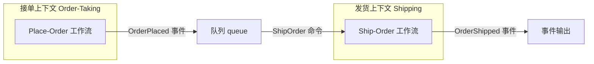
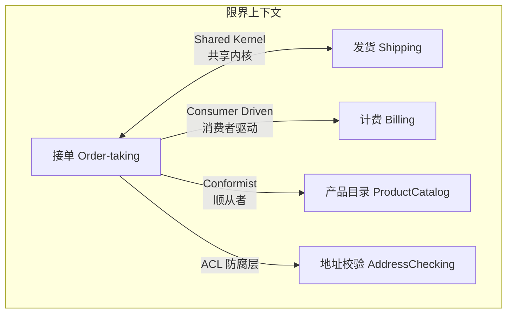

# 第3章：函数式架构

> 本章探讨如何将我们对领域的理解转化为软件架构，尤其是基于函数式编程原则的架构。我们将看到 DDD 中的限界上下文、领域事件等概念如何映射到软件实现，并勾勒出本书后续将采用的实现思路。

---

我们面临的下一个挑战是：如何将我们对领域的理解转化为软件架构，尤其是基于函数式编程原则的架构？

在现阶段，我们其实不应该在架构上思考太多，因为我们对系统还不够了解——我们正处于「无知之巅」！更好的做法是把时间花在减少这种无知上：Event Storming、访谈，以及需求收集方面的其他最佳实践。

另一方面，对如何将领域模型实现为软件有一个大致构想是有益的。在快节奏的开发周期中，我们往往需要在理解其余部分之前就开始实现部分领域，因此需要有一个计划，在组件尚未构建之前就把它们组合在一起。此外，创建一个粗糙的原型——「行走骨架」（walking skeleton）——来展示系统整体如何运作，也很有价值。对具体实现的早期反馈是发现知识缺口的好方法。

在本章中，我们将简要了解面向函数式领域模型的典型软件架构。我们将看到 DDD 中的限界上下文（Bounded Context）和领域事件（Domain Events）等概念如何映射到软件，并勾勒出本书其余部分将采用的实现思路。

软件架构本身也是一个领域，因此让我们遵循自己的建议，在讨论它时使用「通用语言」（ubiquitous language）。我们将采用 Simon Brown 的「C4」方法[^1]中的术语，将软件架构描述为以下四个层次：

[^1]: <http://static.codingthearchitecture.com/c4.pdf>

- **系统上下文**（system context）是顶层，代表整个系统。
- 系统上下文由若干**容器**（containers）组成，即可部署单元，如网站、Web 服务、数据库等。
- 每个容器又由若干**组件**（components）组成，即代码中的主要结构单元。
- 最后，每个组件由若干**类**（或在函数式架构中为**模块** modules）组成，其中包含一组低层方法或函数。

良好架构的目标之一，是定义容器、组件和模块之间的各种边界，使得当新需求出现时——它们一定会出现——「变更成本」被最小化。

## 3.1 限界上下文作为自主软件组件

让我们从「限界上下文」的概念及其与架构的关系开始。如前所述，限界上下文应是一个具有明确边界的自主子系统，这一点很重要。即便有这些约束，我们仍有许多常见的架构风格可供选择。

如果整个系统实现为单一单体可部署（即上述 C4 术语中的单个容器），限界上下文可以简单到是一个具有明确接口的独立模块，或更理想地，是更独立的组件，如 .NET 程序集。或者，每个限界上下文也可以部署在各自的容器中——经典的面向服务架构。或者我们可以更细粒度，让每个工作流成为独立的可部署容器——微服务架构。

然而，在现阶段，我们不需要承诺采用某种特定方式。从逻辑设计到可部署形态的映射并不关键，只要确保限界上下文保持解耦和自主即可。

我们之前强调过边界正确很重要，但这在项目初期很难做到，我们应该预期边界会随着对领域的深入理解而改变。重构单体要容易得多，因此好的做法是：先以单体形式构建系统，仅在需要时再重构为解耦的容器。没必要一开始就上微服务，承担「微服务溢价」[^2]（对运维的额外负担），除非你确信收益大于成本。要打造真正解耦的微服务架构并不容易：如果你关掉其中一个微服务，其他东西就出问题，那你拥有的就不是微服务架构，而只是分布式单体！

[^2]: <https://www.martinfowler.com/bliki/MicroservicePremium.html>

## 3.2 限界上下文之间的通信

限界上下文之间如何通信？例如，当接单上下文完成订单处理后，如何通知发货上下文去实际发货？如前所述，答案是使用**事件**（events）。例如，实现可能如下：

- 接单上下文中的 Place-Order 工作流发出 `OrderPlaced` 事件。
- `OrderPlaced` 事件被放入队列或以其他方式发布。
- 发货上下文监听 `OrderPlaced` 事件。
- 收到事件后，创建 `ShipOrder` 命令。
- `ShipOrder` 命令启动 Ship-Order 工作流。
- Ship-Order 工作流成功完成后，发出 `OrderShipped` 事件。

下面用图表示这个例子：



可以看到，这是一个完全解耦的设计：上游组件（接单子系统）和下游组件（发货子系统）彼此不知情，仅通过事件通信。这种解耦对于实现真正自主的组件至关重要。

事件在上下文之间传输的具体机制取决于我们选择的架构。队列非常适合缓冲式异步通信，因此是微服务或代理实现的首选。在单体系统中，我们可以在内部使用相同的队列方式，或仅通过函数调用在上游组件和下游组件之间建立简单的直接连接。一如既往，我们不必现在就做选择，只要把组件设计成解耦的即可。

至于将事件（如 `OrderPlaced`）转换为命令（如 `ShipOrder`）的处理器，它可以属于下游上下文（位于上下文边界），也可以由作为基础设施一部分运行的独立**路由器**[^3]或**流程管理器**[^4]来完成，取决于你的架构以及你希望在哪里建立事件与命令之间的耦合。

[^3]: <http://www.enterpriseintegrationpatterns.com/patterns/messaging/MessageRouter.html>  
[^4]: <https://www.slideshare.net/BerndRuecker/long-running-processes-in-ddd>

### 3.2.1 限界上下文之间的数据传输

通常，用于上下文间通信的事件不会只是简单信号，还会包含下游组件处理该事件所需的全部数据。例如，`OrderPlaced` 事件可能包含已下单的完整订单信息，这样发货上下文就有足够信息来构造对应的 `ShipOrder` 命令。（如果数据太大无法放入事件，可以改为传递对共享数据存储位置的某种引用。）

传递的数据对象可能与限界上下文内部定义的对象（我们称之为**领域对象** domain objects）表面上相似，但它们并不相同；它们专门设计用于序列化，并作为上下文间基础设施的一部分共享。我们将这些对象称为**数据传输对象**（Data Transfer Objects，DTO）[^5]。换言之，`OrderPlaced` 事件中的 `OrderDTO` 会包含与 `Order` 领域对象大部分相同的信息，但会为了其用途而以不同方式组织。（序列化章节会详细讨论如何定义 DTO。）

[^5]: <https://martinfowler.com/eaaCatalog/dataTransferObject.html>

在上游上下文的边界处，领域对象被转换为 DTO，进而序列化为 JSON、XML 或其他序列化格式：

```text
┌─────────────────────────────────────────────────────────────────┐
│ 领域边界 (Domain Boundary)                                       │
│                                                                  │
│  领域类型 ──(Domain to DTO)──> DTO 类型 ──(序列化)──> Json/XML    │
│                                                                  │
└─────────────────────────────────────────────────────────────────┘
                                     │
                                     ▼ 传向下游上下文
```

在下游上下文，过程反向进行：JSON 或 XML 反序列化为 DTO，再转换为领域对象：

```text
从上游上下文传入
                                     │
                                     ▼
┌─────────────────────────────────────────────────────────────────┐
│ 领域边界 (Domain Boundary)                                       │
│                                                                  │
│  Json/XML ──(反序列化)──> DTO 类型 ──(DTO to Domain)──> 领域类型  │
│                                                                  │
└─────────────────────────────────────────────────────────────────┘
```

实践中，被序列化的顶层 DTO 通常是事件 DTO，其中又包含子 DTO，例如表示 Order 的 DTO，进而包含更多子 DTO（如表示 OrderLines 的 DTO 列表）。

### 3.2.2 信任边界与验证

限界边界的周长充当「**信任边界**」（trust boundary）。边界内的任何内容都被视为可信且有效，而边界外的任何内容都不可信，可能无效。因此，我们将在工作流的开始和结束处添加「门」（gates），作为可信领域与不可信外部世界之间的中介：

```text
不可信外部世界           ┌─────────────────────────────┐           不可信外部世界
      DTO  ──────────>  │  input gate   │  output gate  │  ──────────> DTO
                        │      │        │       │       │
                        │      ▼        │       ▼       │
                        │   Workflow    │  精美、干净的  │
                        │  (工作流)     │  领域模型      │
                        └─────────────────────────────┘
```

在**输入门**（input gate），我们始终验证输入，确保其符合领域模型的约束。例如，假设 Order 的某个属性必须非空且少于五十个字符。传入的 `OrderDTO` 没有这些约束，可能包含任何内容，但在输入门验证通过后，我们可以确信 `Order` 领域对象是有效的。如果验证失败，则跳过工作流其余部分并生成错误。（序列化章节会讨论这类 DTO 验证。）

**输出门**（output gate）的职责不同。它的任务是确保私有信息不会泄露到限界上下文之外，既为避免上下文之间的意外耦合，也出于安全考虑。例如，发货上下文无需知道用于支付订单的信用卡号。为此，输出门在将领域对象转换为 DTO 的过程中，往往会刻意「丢弃」某些信息（如卡号）。

## 3.3 限界上下文之间的契约

我们希望尽可能减少限界上下文之间的耦合，但共享的通信格式总会引入某种耦合：事件及相关 DTO 构成了限界上下文之间的一种**契约**（contract）。两个上下文需要就它们的共同格式达成一致，通信才能成功。

那么由谁来决定契约？上下文之间存在各种关系，DDD 社区为常见关系发展出了一些术语：

- **共享内核**（Shared Kernel）关系：两个上下文共享部分领域设计，因此相关团队必须协作。在我们的领域中，例如接单和发货上下文可能必须对配送地址使用相同的设计：接单上下文接受并验证地址，发货上下文使用同一地址发货。在这种关系中，修改事件或 DTO 的定义必须与受影响的其他上下文的所有者协商。
- **客户/供应商**（Customer/Supplier）或**消费者驱动契约**（Consumer Driven Contract）[^6]关系：下游上下文定义其希望上游上下文提供的契约。只要上游上下文履行契约义务，两个领域仍可独立演进。在我们的领域中，计费上下文可能定义契约（「这是我计费客户所需的信息」），然后接单上下文只提供这些信息，不多不少。
- **顺从者**（Conformist）关系：与消费者驱动相反。下游上下文接受上游上下文提供的契约，并调整自己的领域模型以匹配。在我们的领域中，接单上下文可能直接接受产品目录定义的契约，并调整代码以原样使用。

[^6]: <https://www.infoq.com/articles/consumer-driven-contracts>

### 3.3.1 防腐层

在与外部系统通信时，可用接口往往与我们的领域模型完全不符。此时，交互和数据需要转换为更适合在限界上下文内部使用的形式，否则我们的领域模型会因试图适应外部系统的模型而「腐化」。

这种上下文之间的额外解耦层在 DDD 术语中称为**防腐层**（Anti-Corruption Layer，ACL）。在上图中，「输入门」通常扮演 ACL 的角色——它防止内部纯净的领域模型被外部世界的知识「腐化」。

也就是说，防腐层主要不是做验证或防止数据损坏，而是在两种不同语言之间充当**翻译器**——上游上下文使用的语言与下游上下文使用的语言。在我们的接单示例中，我们可能有一个防腐层，将「接单」词汇翻译为「发货」词汇，让两个各自拥有自己词汇的上下文能够独立演进。

### 3.3.2 带关系的上下文图

假设我们的设计已取得进展，并已确定各上下文之间的关系：

- 接单与发货上下文之间为「共享内核」，即它们共同拥有通信契约。
- 接单与计费之间为「消费者驱动契约」，即计费上下文决定契约，接单系统只提供计费所需的数据。
- 接单与产品目录之间为「顺从者」，即接单上下文将服从使用与产品目录相同的模型。
- 最后，外部地址校验服务的模型与我们的领域完全不同，因此我们将在与它的交互中插入显式的防腐层。这是使用第三方组件时的常见模式，有助于避免供应商锁定，并让我们日后可以更换为不同服务。

展示这些上下文间关系的领域上下文图如下：



::: info
上下文图不仅展示上下文之间的纯技术关系，还展示拥有这些上下文的团队之间的关系，以及我们期望它们如何协作（或不协作）。决定领域如何交互往往既是组织挑战，也是技术挑战，有些团队使用所谓的「逆向康威机动」[^7]来确保组织结构与架构对齐。
:::

[^7]: <http://bit.ly/InverseConwayManeuver>

## 3.4 限界上下文内的工作流

在发现过程中，我们将业务工作流视为由命令启动的迷你流程，产生一个或多个领域事件。在函数式架构中，每个工作流将映射为**单个函数**，输入为命令对象，输出为事件对象列表。

在设计图中，我们将工作流表示为小管道，有输入和输出。公共工作流（从限界上下文外部触发的）在边界处略微「伸出」：

```text
┌─────────────────────────────────────────────────────────┐
│                    限界上下文 (Bounded Context)           │
│                                                          │
│  Command ──> [ Public Workflow ] ──> Events              │
│  Command ──> [ Public Workflow ] ──> Events              │
│  Command ──> [ Internal Workflow ] ──> Events             │
│                                                          │
└─────────────────────────────────────────────────────────┘
```

工作流始终包含在单个限界上下文中，永远不会跨多个上下文实现「端到端」场景。将工作流建模为管道章节会详细讨论如何建模工作流。

### 3.4.1 工作流的输入与输出

工作流的输入始终是与命令相关的数据，输出始终是用于与其他上下文通信的事件集合。在我们的下单工作流中，输入是与 `PlaceOrder` 命令相关的数据，输出是诸如 `OrderPlaced` 事件等事件集合。

但请记住，我们已确定与计费上下文存在「客户/供应商」关系。这意味着，我们不应向计费上下文发送通用的 `OrderPlaced` 事件，而只需发送计费所需的信息，不多不少。例如，可能只是账单地址和应收金额，而不包括配送地址或商品列表。

这意味着我们需要从工作流发出一个新事件（例如 `BillableOrderPlaced`），其结构可能如下：

```fsharp
type BillableOrderPlaced =
    OrderId
    AND BillingAddress
    AND AmountToBill
```

我们可能还想发出 `OrderAcknowledgmentSent` 事件。有了这些变化，我们之前第 29 页的工作流图就不准确了，需要更新为：

```text
输入: 订单表单
       │
       ▼
┌────────────────── Place Order 工作流 ──────────────────┐
│                                                          │
│  输出事件:                                                │
│  • OrderPlaced (给发货)                                   │
│  • BillableOrderPlaced (给计费)                           │
│  • OrderAcknowledgmentSent                               │
│                                                          │
│  副作用: 向客户发送订单确认                               │
└─────────────────────────────────────────────────────────┘
```

::: tip
在上图中，重要的是：工作流函数并不「发布」领域事件——它只是**返回**它们。如何发布是另一个关注点。
:::

### 3.4.2 避免限界上下文内的领域事件

在面向对象设计中，在限界上下文内部**引发**领域事件很常见。在这种方式下，工作流对象引发 `OrderPlaced` 事件，然后一个处理器监听该事件并发送订单确认，另一个处理器生成 `BillableOrderPlaced` 事件，依此类推。可能看起来像这样：

```text
OO 方式（有隐式依赖）:
┌─────────────────────────────────────────────────────────────────┐
│ 输入: 订单表单 ──> Place Order ──> OrderPlaced 事件               │
│                    │                                              │
│                    ├──> 事件监听器: Acknowledge Order ──> 发送确认  │
│                    │                                              │
│                    └──> 事件监听器: Create BillableOrder          │
└─────────────────────────────────────────────────────────────────┘
```

在函数式设计中，我们倾向于不采用这种方式，因为它会产生**隐式依赖**。相反，如果我们需要事件的「监听器」，只需将其追加到工作流末尾即可：

```text
函数式方式（显式依赖）:
┌─────────────────────────────────────────────────────────────────┐
│ 输入: 订单表单 ──> Place Order ──> OrderPlaced 事件               │
│                    │                                              │
│                    ├──> Acknowledge Order ──> 发送确认  │
│                    │                                              │
│                    └──> Create BillableOrder                     │
└─────────────────────────────────────────────────────────────────┘
```

这种方式更显式——没有带可变状态的全局事件管理器——因此更容易理解和维护。我们将在实现章节（第 161 页）和演进设计章节（第 265 页）中看到这种实践。

## 3.5 限界上下文内的代码结构

现在让我们看看限界上下文内的代码如何组织。

在传统的「分层」方式中，代码被分为若干层：核心领域或业务逻辑层、数据库层、服务层，以及 API 或用户界面层（或这些的某种变体）。工作流从顶层开始，逐层下到数据库层，再返回顶层：

```text
传统分层架构（横向）：

┌─────────────────────────────────────┐
│  API/Interface Layer (接口层)         │
├─────────────────────────────────────┤
│  Services Layer (服务层)              │
├─────────────────────────────────────┤
│  Domain Layer (领域层)                │
├─────────────────────────────────────┤
│  Database Layer (数据库层)            │
└─────────────────────────────────────┘

Workflow  Workflow  Workflow  Workflow
    ↘        ↘        ↘        ↘
      (每个工作流跨越所有层)
```

然而，这种方式存在许多问题。一个特别的问题是，它违背了「一起变化的代码应放在一起」这一重要设计原则。由于层是「横向」组装的，工作流方式的变更意味着你需要触及每一层。更好的做法是改为「纵向」切片，每个工作流包含完成其工作所需的全部代码，当工作流的需求变更时，只需修改该纵向切片中的代码：

```text
纵向切片（更好但仍不理想）：

┌─────┐ ┌─────┐ ┌─────┐ ┌─────┐
│ DB  │ │ DB  │ │ DB  │ │ DB  │
├─────┤ ├─────┤ ├─────┤ ├─────┤
│ Dom │ │ Dom │ │ Dom │ │ Dom │
├─────┤ ├─────┤ ├─────┤ ├─────┤
│ Svc │ │ Svc │ │ Svc │ │ Svc │
├─────┤ ├─────┤ ├─────┤ ├─────┤
│ API │ │ API │ │ API │ │ API │
└─────┘ └─────┘ └─────┘ └─────┘
  WF1     WF2     WF3     WF4
```

但这仍然不够理想。如果我们把工作流拉成水平管道，以这种方式看各层：

```text
Workflow ─────────────────────────────────────────────────>
          │ Database │ Domain │ Services │ API/Interface │
```

可以清楚看到，各层交织在一起，使得理解逻辑（以及测试）变得不必要地复杂。

### 3.5.1 洋葱架构

我们改为将领域代码放在中心，然后让其他方面围绕它组装，使用规则：**每个层只能依赖内层，不能依赖更外层**。即，所有依赖必须指向内。这称为「**洋葱架构**」（Onion Architecture）[^8]：

```text
                    ┌─────────────────────┐
                    │   API / Interface   │
                    │   (API/接口层)       │
                    └──────────┬──────────┘
                               │
                    ┌──────────▼──────────┐
                    │     Services         │
                    │   (服务层)            │
                    └──────────┬──────────┘
                               │
                    ┌──────────▼──────────┐
                    │   Infrastructure    │
                    │   (基础设施)         │
                    └──────────┬──────────┘
                               │
                    ┌──────────▼──────────┐
                    │     Workflow        │
                    │   (工作流)           │
                    └──────────┬──────────┘
                               │
                    ┌──────────▼──────────┐
                    │     Domain          │
                    │   (领域 - 核心)      │
                    └─────────────────────┘
```

类似的其他架构还有**六边形架构**[^9]和**整洁架构**[^10]。为确保所有依赖指向内，我们将使用依赖注入的函数式等价物，这将在实现：组合管道章节中讨论。

[^8]: <http://jeffreypalermo.com/blog/the-onion-architecture-part-1/>  
[^9]: <http://alistair.cockburn.us/Hexagonal+architecture>  
[^10]: <https://8thlight.com/blog/uncle-bob/2012/08/13/the-clean-architecture.html>

### 3.5.2 将 I/O 保持在边缘

函数式编程的一个重要目标是让函数可预测、易于推理，而无需查看其内部。为此，我们将尽可能使用不可变数据，并确保函数具有显式依赖而非隐式依赖。最重要的是，我们将尽量避免函数中的副作用，包括随机性、对函数外部变量的修改，以及最重要的——任何形式的 I/O。

例如，读写数据库或文件系统的函数会被视为「不纯」（impure），因此我们会尽量避免在核心领域中使用这类函数。

那么我们如何读写数据？答案是**将任何 I/O 推到洋葱的边缘**——例如，仅在工作流的开始或结束时访问数据库，而不是在工作流内部。这还有一个额外好处：迫使我们分离不同关注点——核心领域模型只关心业务逻辑，而持久化和其他 I/O 是基础设施关注点。

::: info
事实上，将 I/O 和数据库访问移到边缘的做法，与上一章介绍的**持久化忽略**（Persistence Ignorance）概念结合得非常好。如果你无法从工作流内部访问数据库，就无法用数据库来建模领域！（持久化章节会详细讨论数据库的使用。）
:::

## 本章小结

本章我们引入了更多 DDD 相关概念和术语，在此汇总如下：

| 术语 | 含义 |
|------|------|
| **领域对象** (Domain Object) | 仅在上下文边界内使用的对象，与 DTO 相对 |
| **数据传输对象** (DTO) | 设计用于序列化并在上下文之间共享的对象 |
| **共享内核** (Shared Kernel) | 限界上下文之间的一种关系：共享部分领域设计 |
| **客户/供应商** (Customer/Supplier) | 下游定义契约、上游履行的关系 |
| **顺从者** (Conformist) | 下游接受上游契约并适应的关系 |
| **防腐层** (ACL) | 在不同领域概念之间翻译的组件，以减少耦合、允许领域独立演进 |
| **持久化忽略** (Persistence Ignorance) | 领域模型应仅基于领域本身的概念，不应包含对数据库或其他持久化机制的认知 |

### 下一步

我们现在对领域有了理解，也有了设计解决方案的总体思路，可以进入建模和实现各个工作流的挑战。在接下来的几章中，我们将使用 F# 类型系统定义工作流及其使用的数据，编写既可编译又仍可由领域专家和非开发者理解的代码。

首先，我们需要理解「类型」对函数式程序员意味着什么，以及它与面向对象设计中的「类」有何不同。这将是下一章的主题。

---

[← 上一章：理解领域](ch02-understanding-the-domain.md) | [返回目录](../index.md) | [下一章：理解类型 →](../part2/ch04-understanding-types.md)
