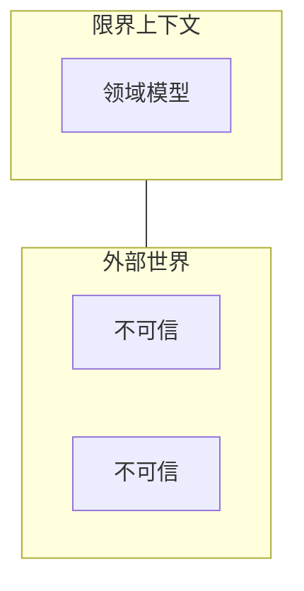

# 第6章：领域中的完整性与一致性

> 上一章我们学习了如何用 F# 类型系统进行领域建模的基础。我们构建了一套丰富的类型来表示领域，它们既可编译，又能指导实现。既然我们费心正确建模了领域，就应当采取一些措施，确保领域内的所有数据都是有效且一致的。目标是创建一个始终包含可信数据的限界上下文（Bounded Context），与不可信的外部世界区分开来。若能确信所有数据值始终有效，实现就能保持简洁，我们也不必做防御性编程。

---



本章将探讨可信领域建模的两个方面：**完整性（integrity）** 与 **一致性（consistency）**。

**完整性**（或有效性）指数据符合正确的业务规则。例如：

- 我们说 `UnitQuantity` 必须在 1 到 1000 之间。我们是要在代码里多次检查，还是可以放心假设它始终成立？
- 订单必须至少包含一个订单行。
- 订单在发送给物流部门之前，必须已有经过验证的收货地址。

**一致性**指领域模型的不同部分对事实的认知一致。例如：

- 订单的应付总额应等于各订单行金额之和。若总额不一致，则数据不一致。
- 下单后必须创建对应的发票。若订单存在而发票不存在，则数据不一致。
- 若折扣券码被用于订单，该券码必须标记为已使用，不能再次使用。若订单引用了该券但券未标记为已使用，则数据不一致。

如何确保这类数据完整性与一致性？本章将探讨这些问题。一如既往，能在类型系统中捕获的信息越多，所需文档就越少，代码实现正确的可能性也越高。

## 6.1 简单值的完整性

在之前关于用类型建模简单值的讨论中，我们看到简单值不应由 `string` 或 `int` 表示，而应由领域导向的类型如 `WidgetCode`、`UnitQuantity` 表示。

但我们不应止步于此，因为真实领域里几乎不存在无界的整数或字符串。这些值几乎总是受到某种约束：

- `OrderQuantity` 可能用有符号整数表示，但业务通常不希望它为负或达到四十亿。
- `CustomerName` 可能用字符串表示，但这不意味着它可以包含制表符或换行符。

在我们的领域中，已经见过一些受约束的类型。`WidgetCode` 必须以特定字母开头，`UnitQuantity` 必须在 1 到 1000 之间。目前我们是这样定义的，用注释说明约束：

```fsharp
type WidgetCode = WidgetCode of string // starting with "W" then 4 digits
type UnitQuantity = UnitQuantity of int // between 1 and 1000
type KilogramQuantity = KilogramQuantity of decimal // between 0.05 and 100.00
```

与其让这些类型的用户去读注释，我们更希望确保：只有在满足约束时才能创建这些类型的值。由于数据是不可变的，创建后内部值就无需再检查。你可以在任何地方放心使用 `WidgetCode` 或 `UnitQuantity`，而不必做任何防御性编码。

### 6.1.1 智能构造函数（Smart Constructor）

如何确保约束被强制执行？答案与任何编程语言相同：**将构造函数设为私有**，并提供一个单独的函数来创建有效值、拒绝无效值并返回错误。在函数式社区中，这有时称为 **智能构造函数（smart constructor）** 方法。下面是对 `UnitQuantity` 应用该方法的示例：

```fsharp
type UnitQuantity = private UnitQuantity of int
// ^ private constructor
```

由于私有构造函数，`UnitQuantity` 的值无法从包含该类型定义的模块外部创建。但在同一模块内编写的代码可以访问该构造函数。

我们利用这一点来定义一些操作该类型的函数。首先创建一个与类型同名的子模块（`UnitQuantity`），在其中定义 `create` 函数：接受一个 `int`，返回 `Result` 类型（参见「用类型建模错误」）以表示成功或失败。这两种可能在其函数签名中明确体现：`int -> Result<UnitQuantity,string>`。

```fsharp
// define a module with the same name as the type
module UnitQuantity =
    /// Define a "smart constructor" for UnitQuantity
    /// int -> Result<UnitQuantity,string>
    let create qty =
        if qty < 1 then
            // failure
            Error "UnitQuantity can not be negative"
        else if qty > 1000 then
            // failure
            Error "UnitQuantity can not be more than 1000"
        else
            // success -- construct the return value
            Ok (UnitQuantity qty)
```

::: tip 与旧版 F# 的兼容性
与同名非泛型类型同名的模块在 F# v4.1（VS2017）之前的版本中会报错。若需兼容，需在模块定义上添加 `CompilationRepresentation` 属性：

```fsharp
type UnitQuantity = ...
[<CompilationRepresentation(CompilationRepresentationFlags.ModuleSuffix)>]
module UnitQuantity =
    ...
```
:::

### 6.1.2 提取内部值

私有构造函数的一个缺点是，你无法再用它进行模式匹配并提取包装的数据。一种解决办法是在 `UnitQuantity` 模块中定义一个 `value` 函数，用于提取内部值：

```fsharp
/// Return the wrapped value
let value (UnitQuantity qty) = qty
```

实际使用如下。首先，若直接创建 `UnitQuantity`，会得到编译错误：

```fsharp
let unitQty = UnitQuantity 1
// ^ The union cases of the type 'UnitQuantity'
// are not accessible
```

但若使用 `UnitQuantity.create` 函数，则能正常工作并返回 `Result`，然后可以对其进行模式匹配：

```fsharp
let unitQtyResult = UnitQuantity.create 1
match unitQtyResult with
| Error msg ->
    printfn "Failure, Message is %s" msg
| Ok uQty ->
    printfn "Success. Value is %A" uQty
    let innerValue = UnitQuantity.value uQty
    printfn "innerValue is %i" innerValue
```

若有大量这类受约束类型，可以使用包含构造函数通用代码的辅助模块来减少重复。本书示例代码中的 `Domain.SimpleTypes.fs` 文件有相关示例。

最后需要说明的是，使用 `private` 并非在 F# 中隐藏构造函数的唯一方式。还有其他技术，例如使用签名文件，此处不再展开。

## 6.2 计量单位（Units of Measure）

对于数值，另一种在保证类型安全的同时记录需求的方式是使用 **计量单位（units of measure）**。在计量单位方法中，数值会带上自定义的「度量」标注。例如，可以这样定义 `kg`（千克）和 `m`（米）的计量单位：

```fsharp
[<Measure>]
type kg
[<Measure>]
type m
```

然后用这些计量单位标注值：

```fsharp
let fiveKilos = 5.0<kg>
let fiveMeters = 5.0<m>
```

::: info
你不需要为所有 SI 单位定义度量类型，它们已在 `Microsoft.FSharp.Data.UnitSystems.SI` 命名空间中提供。
:::

完成后，编译器会强制计量单位之间的兼容性，若不匹配会报错：

```fsharp
// compiler error
fiveKilos = fiveMeters
// ^ Expecting a float<kg> but given a float<m>

let listOfWeights = [
    fiveKilos
    fiveMeters // <-- compiler error
    // The unit of measure 'kg'
    // does not match the unit of measure 'm'
]
```

在我们的领域中，可以用计量单位确保 `KilogramQuantity` 确实是千克，从而避免误用磅来初始化。可以这样在类型中编码：

```fsharp
type KilogramQuantity = KilogramQuantity of decimal<kg>
```

这样就有两层检查：`<kg>` 确保数值单位正确，`KilogramQuantity` 则强制执行最大、最小值的约束。对我们的领域来说这可能有些过度设计，但在其他场景下可能很有用。

计量单位不仅可用于物理单位。你还可以用它记录超时的正确单位（避免混淆秒和毫秒）、空间维度（避免混淆 x 轴和 y 轴）、货币等。

使用计量单位没有运行时性能开销，它们仅由 F# 编译器使用，运行时无额外成本。

## 6.3 用类型系统强化不变量

**不变量（invariant）** 是指无论发生什么都会保持成立的条件。例如，本章开头说 `UnitQuantity` 必须始终在 1 到 1000 之间，这就是一个不变量。

我们还说过，订单必须至少有一个订单行。与 `UnitQuantity` 不同，这是一个可以直接在类型系统中捕获的不变量。要确保列表非空，只需定义一个 `NonEmptyList` 类型。F# 没有内置该类型，但很容易自己定义：

```fsharp
type NonEmptyList<'a> = {
    First: 'a
    Rest: 'a list
}
```

定义本身要求至少有一个元素，因此 `NonEmptyList` 保证永远不会为空。

当然，你还需要一些辅助函数，如 `add`、`remove` 等。可以自己定义，或使用提供该类型的第三方库，例如 FSharpx.Collections。

`Order` 类型现在可以改写为使用该类型，而不是普通列表：

```fsharp
type Order = {
    ...
    OrderLines : NonEmptyList<OrderLine>
    ...
}
```

有了这一改动，「订单始终至少有一个订单行」的约束就自动得到强制执行。自文档化代码，我们也不再需要为该需求编写单元测试。

## 6.4 在类型系统中捕获业务规则

再看一个建模挑战：能否仅用类型系统来记录业务规则？也就是说，我们希望用 F# 类型系统表示什么是有效或无效，让编译器替我们检查，而不是依赖运行时检查或代码注释来保证规则得到遵守。

### 6.4.1 示例：已验证与未验证的邮箱

假设我们的公司 Widgets Inc 为客户存储邮箱地址。但并非所有邮箱都应同等对待。有些邮箱已经过验证——即客户收到验证邮件并点击了验证链接——而有些邮箱未验证，我们无法确定其有效。进一步假设，某些业务规则基于这一区别，例如：

- 只应向未验证的邮箱发送验证邮件（避免骚扰已有客户）。
- 只应向已验证的邮箱发送密码重置邮件（防止安全漏洞）。

如何在设计中表示这两种情况？一种常见做法是用标志位表示是否已验证：

```fsharp
type CustomerEmail = {
    EmailAddress : EmailAddress
    IsVerified : bool
}
```

但这种方式有若干严重问题。首先，不清楚 `IsVerified` 标志应在何时、为何被设置或清除。例如，若客户邮箱变更，应将其设回 `false`（因为新邮箱尚未验证）。然而，设计中没有任何地方明确这一规则。开发者很容易在修改邮箱时忘记这样做，或更糟的是，根本不知道这条规则（因为它可能埋在某个注释里）。

还存在安全风险。开发者可能写出意外将标志设为 `true` 的代码，即使邮箱未验证，从而允许向未验证地址发送密码重置邮件。

更好的建模方式是什么？答案一如既往：关注领域。当领域专家谈论「已验证」和「未验证」邮箱时，应将其建模为不同的事物。当领域专家说「客户的邮箱要么已验证要么未验证」时，我们应将其建模为两种类型之间的选择：

```fsharp
type CustomerEmail =
| Unverified of EmailAddress
| Verified of EmailAddress
```

但这仍无法防止我们意外通过传入未验证的 `EmailAddress` 来创建 `Verified` 分支。为解决该问题，我们照常创建新类型！具体来说，创建一个 `VerifiedEmailAddress` 类型，与普通的 `EmailAddress` 不同。于是我们的选择变为：

```fsharp
type CustomerEmail =
| Unverified of EmailAddress
| Verified of VerifiedEmailAddress // different from normal EmailAddress
```

巧妙之处在于：我们可以给 `VerifiedEmailAddress` 一个私有构造函数，这样普通代码无法创建该类型的值——只有验证服务可以创建它。

这意味着，若我有一个新邮箱地址，必须用 `Unverified` 分支构造 `CustomerEmail`，因为我没有 `VerifiedEmailAddress`。构造 `Verified` 分支的唯一方式是拥有 `VerifiedEmailAddress`，而获得 `VerifiedEmailAddress` 的唯一途径是来自邮箱验证服务本身。

这是重要设计原则「**让非法状态不可表示（Make illegal states unrepresentable）**」的一个例子。我们试图在类型系统中捕获业务规则。若做得正确，无效情况在代码中永远不会存在，我们也不必为它们编写单元测试。相反，我们有了「编译期」的单元测试。

这种方法的另一个重要好处是，它实际上更好地记录了领域。我们不再有一个试图同时扮演两种角色的简陋 `EmailAddress`，而是有两个具有不同规则的 distinct 类型。通常，一旦创建了这些更细粒度的类型，我们立刻就能找到它们的用途。

例如，现在可以明确记录：发送密码重置消息的工作流必须以 `VerifiedEmailAddress` 作为输入参数，而不是普通邮箱地址：

```fsharp
type SendPasswordResetEmail = VerifiedEmailAddress -> ...
```

有了这一定义，我们不必担心有人意外传入普通 `EmailAddress` 并破坏业务规则，因为他们可能没读过文档。

### 6.4.2 示例：联系信息

再看一个例子。假设有一条业务规则：我们需要某种联系客户的方式：

- 「客户必须有邮箱或邮政地址。」

如何表示？一种直观做法是创建一个同时包含 `Email` 和 `Address` 属性的记录：

```fsharp
type Contact = {
    Name: Name
    Email: EmailContactInfo
    Address: PostalContactInfo
}
```

但这是错误的设计，它暗示 `Email` 和 `Address` 都是必需的。那就把它们设为可选：

```fsharp
type Contact = {
    Name: Name
    Email: EmailContactInfo option
    Address: PostalContactInfo option
}
```

但这也不对。照目前的设计，`Email` 和 `Address` 可能都缺失，这会违反业务规则。

当然，我们可以添加特殊的运行时验证来确保这种情况不会发生。但能否做得更好，在类型系统中表示？可以！

诀窍是仔细看这条规则。它意味着客户有以下情况之一：

- 仅有邮箱地址
- 仅有邮政地址
- 同时有邮箱和邮政地址

只有三种可能。如何表示这三种？用选择类型！

```fsharp
type BothContactMethods = {
    Email: EmailContactInfo
    Address : PostalContactInfo
}
type ContactInfo =
| EmailOnly of EmailContactInfo
| AddrOnly of PostalContactInfo
| EmailAndAddr of BothContactMethods
```

然后在主 `Contact` 类型中使用该选择类型：

```fsharp
type Contact = {
    Name: Name
    ContactInfo : ContactInfo
}
```

同样，这对开发者有利（我们不会意外地没有任何联系信息——少写一个测试），对设计也有利。设计非常清楚地表明只有三种可能，以及具体是哪三种。我们不必查文档，看代码本身即可。

### 6.4.3 在我们领域中让非法状态不可表示

设计中是否有可以实践这一方法的地方？

可以想到一个与邮箱验证示例非常相似的设计点。在验证过程中，我们记录了存在未验证的邮政地址（如 `UnvalidatedAddress`）和已验证的邮政地址（`ValidatedAddress`）。

我们可以通过以下方式确保永不混淆这两种情况，并确保正确使用验证函数：

- 创建两种 distinct 类型：`UnvalidatedAddress` 和 `ValidatedAddress`
- 给 `ValidatedAddress` 私有构造函数，确保只能由地址验证服务创建

```fsharp
type UnvalidatedAddress = ...
type ValidatedAddress = private ...
```

验证服务接受 `UnvalidatedAddress`，返回可选的 `ValidatedAddress`（可选表示验证可能失败）：

```fsharp
type AddressValidationService =
    UnvalidatedAddress -> ValidatedAddress option
```

为强制执行「订单在发送给物流部门之前必须有已验证的收货地址」这一规则，我们再创建两种 distinct 类型（`UnvalidatedOrder` 和 `ValidatedOrder`），并要求 `ValidatedOrder` 记录中的收货地址为 `ValidatedAddress`：

```fsharp
type UnvalidatedOrder = {
    ...
    ShippingAddress : UnvalidatedAddress
    ...
}
type ValidatedOrder = {
    ...
    ShippingAddress : ValidatedAddress
    ...
}
```

这样，无需编写任何测试，我们就能保证 `ValidatedOrder` 中的地址都已被地址验证服务处理过。

## 6.5 一致性（Consistency）

本章至此我们探讨了如何强制执行领域中数据的完整性。现在来讨论相关概念：**一致性**。

本章开头我们见过一些一致性需求的例子：

- 订单的应付总额应等于各订单行金额之和。若总额不一致，则数据不一致。
- 下单后必须创建对应的发票。若订单存在而发票不存在，则数据不一致。
- 若折扣券码被用于订单，该券码必须标记为已使用。若订单引用了该券但券未标记为已使用，则数据不一致。

如前所述，一致性是业务术语而非技术术语，其含义始终取决于上下文。例如，若产品价格变更，未发货的订单是否应立即更新为新价格？若客户的默认地址变更，未发货的订单是否应立即更新为新地址？这些问题没有标准答案——取决于业务需求。

一致性会给设计带来很大负担，成本也可能很高，因此我们应尽可能避免对它的需求。在需求收集时，产品负责人常会要求一种不切实际的一致性级别。但在许多情况下，对一致性的需求是可以避免或推迟的。

最后需要认识到，一致性与持久化的原子性是关联的。例如，若订单不会以原子方式持久化，确保订单内部一致就没有意义。若订单的不同部分分别持久化，而其中一部分保存失败，则之后加载订单的人会加载到一个内部不一致的订单。

### 6.5.1 单个聚合内的一致性

在「用类型建模领域」中，我们引入了**聚合（aggregate）**的概念，并指出它既是**一致性边界**，也是**持久化单位**。下面看它在实践中如何运作。

假设我们要求订单的应付总额应等于各订单行金额之和。确保一致性的最简单方式是：**直接从原始数据计算**，而不是存储。在这种情况下，我们可以在需要总额时对订单行求和，在内存中或通过 SQL 查询均可。

若确实需要持久化额外数据（例如在顶层 `Order` 中存储 `AmountToBill`），则需确保其保持同步。在这种情况下，若某一行被更新，总额也必须更新以保持数据一致。显然，唯一「知道」如何保持一致性的组件是顶层 `Order`。这是所有更新都在订单层面而非订单行层面进行的好理由——订单是强制执行一致性边界的聚合。以下代码演示了这种实现方式：

```fsharp
/// We pass in three parameters:
/// * the top-level order
/// * the id of the order line we want to change
/// * the new price
let changeOrderLinePrice order orderLineId newPrice =
    // find orderLine in order.OrderLines using orderLineId
    let orderLine = order.OrderLines |> findOrderLine orderLineId
    // make a new version of the OrderLine with new price
    let newOrderLine = {orderLine with Price = newPrice}
    // create new list of lines, replacing old line with new line
    let newOrderLines =
        order.OrderLines |> replaceOrderLine orderLineId newOrderLine
    // make a new AmountToBill
    let newAmountToBill = newOrderLines |> List.sumBy (fun line -> line.Price)
    // make a new version of the order with the new lines
    let newOrder = {
        order with
            OrderLines = newOrderLines
            AmountToBill = newAmountToBill
    }
    // return the new order
    newOrder
```

聚合也是原子性的单位。若我们将订单保存到关系数据库，必须确保订单头和订单行在同一事务中全部插入或更新。

### 6.5.2 不同上下文之间的一致性

若需要在不同上下文之间协调呢？看上面列表中的第二个例子：

- 下单后必须创建对应的发票。若订单存在而发票不存在，则数据不一致。

开票属于计费领域，而非接单领域。这是否意味着我们需要侵入另一个领域并操作其对象？不，当然不。我们必须保持每个限界上下文隔离和解耦。

那使用计费上下文的公开 API 呢，比如这样：

```
请求计费上下文创建发票
若成功创建：
    在接单上下文中创建订单
```

这种方式比看起来更棘手，因为你需要处理任一更新失败的情况。有办法正确地在独立系统之间同步更新（例如两阶段提交），但在实践中很少需要。Gregor Hohpe 在《Starbucks Does Not Use Two-Phase Commit》中指出，现实世界中企业通常不需要每个流程都步调一致地等待所有子系统完成某一阶段后再进入下一阶段。相反，协调是通过消息异步完成的。偶尔会出问题，但处理罕见错误的成本往往远低于保持一切同步的成本。

例如，假设我们不要求立即创建发票，而是向计费领域发送一条消息（或事件），然后继续处理订单的其余部分。

那么，若消息丢失且未创建发票会怎样？

- **选项一**：什么都不做。客户白拿商品，企业承担成本。若错误罕见且成本较小（如咖啡店），这可能是完全可接受的方案。
- **选项二**：检测消息丢失并重发。这基本上就是对账流程所做的：比较两组数据，若不匹配则修复错误。
- **选项三**：创建补偿动作来「撤销」之前的操作或修复错误。在接单场景中，这相当于取消订单并要求客户退货！更现实地，补偿动作可用于纠正订单错误或发放退款等。

在以上三种情况下，都不需要在限界上下文之间进行刚性协调。

若有一致性需求，则需要实现第二或第三种选项。但这种一致性不会立即生效。相反，系统只会在经过一段时间后才变得一致——即「**最终一致性（eventual consistency）**」。最终一致性不是「可选的一致性」：系统在未来的某个时间点保持一致仍然非常重要。

::: info
Gregor Hohpe 文章链接：http://www.enterpriseintegrationpatterns.com/ramblings/18_starbucks.html
:::

举例：若产品价格变更，我们希望更新所有未发货订单的价格。若需要立即一致性，则在更新产品记录中的价格时，必须在同一事务中更新所有受影响的订单，这可能耗时较长。但若产品价格变更时不要求即时一致性，我们可以改为创建 `PriceChanged` 事件，进而触发一系列 `UpdateOrderWithChangedPrice` 命令来更新未完成订单。这些命令将在产品记录中的价格变更之后的某个时间处理，可能是几秒后，也可能是几小时后。最终订单会被更新，系统会变得一致。

### 6.5.3 同一上下文内不同聚合之间的一致性

如何确保同一限界上下文中不同聚合之间的一致性？假设两个聚合需要彼此一致。我们应在同一事务中一起更新它们，还是分别更新并使用最终一致性？该选哪种？

答案一如既往：视情况而定。一般来说，一个有用的准则是「**每个事务只更新一个聚合**」。若涉及多个聚合，应使用消息和最终一致性，如上所述，即使两个聚合都在同一限界上下文中。

但有时——尤其是当工作流被业务视为单一事务时——将受影响的所有实体包含在同一事务中可能值得考虑。一个经典例子是两账户之间的转账，一个账户增加，另一个减少：

```
开始事务
向 accountA 增加 X 金额
从 accountB 扣除 X 金额
提交事务
```

若账户由 `Account` 聚合表示，则我们会在同一事务中更新两个不同的聚合。这不一定有问题，但可能暗示你可以通过重构获得对领域的更深理解。例如，在这种情况下，事务往往有自己的标识符，这意味着它是 DDD 意义上的实体。既然如此，何不将其建模为实体？

```fsharp
type MoneyTransfer = {
    Id: MoneyTransferId
    ToAccount : AccountId
    FromAccount : AccountId
    Amount: Money
}
```

经过这一改动，`Account` 实体仍然存在，但不再直接负责增加或扣除金额。相反，`Account` 的当前余额将通过遍历引用它的 `MoneyTransfer` 记录来计算。我们不仅重构了设计，还加深了对领域的理解。

这也表明，若复用聚合没有意义，不必勉强。若需要为单一用例定义新聚合，尽管去做。

### 6.5.4 多个聚合作用于同一数据

我们之前强调，聚合用于强制执行完整性约束。那么，若有多个聚合作用于同一数据，如何确保约束被一致地强制执行？例如，我们可能同时有 `Account` 聚合和 `MoneyTransfer` 聚合，都作用于账户余额，且都需要确保余额不会变为负数。

在许多情况下，若用类型建模，约束可以在多个聚合之间共享。例如，账户余额永不为负的要求可以用 `NonNegativeMoney` 类型建模。若这不适用，可以使用共享的验证函数。这是函数式模型相对于面向对象模型的一个优势：验证函数不依附于任何特定对象，也不依赖全局状态，因此可以轻松在不同工作流中复用。

## 本章小结

本章学习了如何确保领域内的数据可信。

我们看到，简单类型的「智能构造函数」与更复杂类型的「让非法状态不可表示」相结合，意味着我们可以用类型系统本身强制执行多种完整性规则，从而得到更自文档化的代码，减少对单元测试的需求。

我们还探讨了在单个限界上下文内以及不同限界上下文之间维护一致数据，得出的结论是：除非你在单个聚合内工作，否则应设计为**最终一致性**而非**即时一致性**。

下一章，我们将把这些内容付诸实践，建模我们的下单工作流。

---

[← 上一章：用类型建模领域](ch05-domain-modeling-with-types.md) | [返回目录](../index.md) | [下一章：将工作流建模为管道 →](ch07-modeling-workflows-as-pipelines.md)
