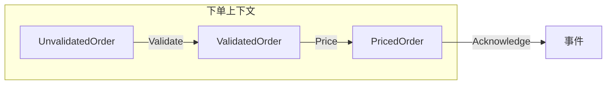
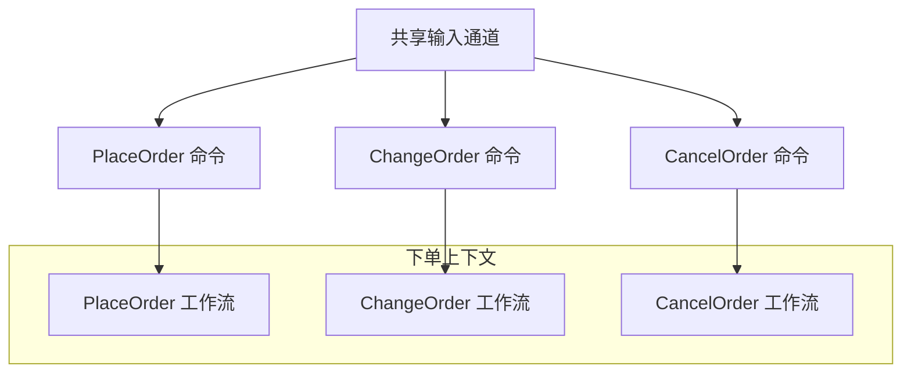
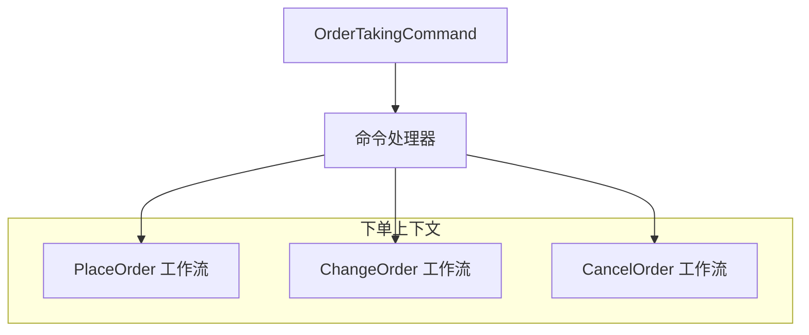
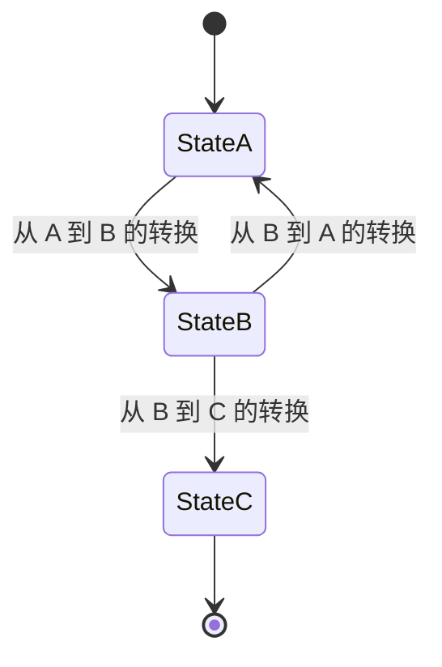
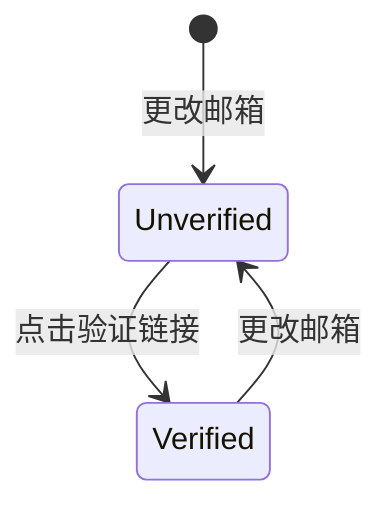
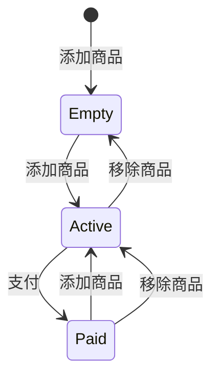
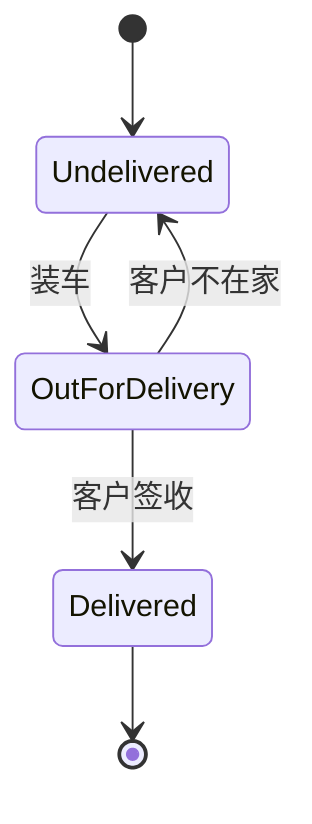
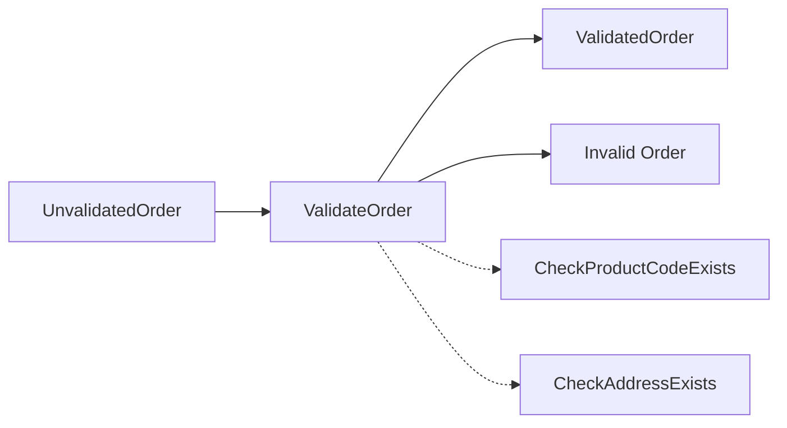
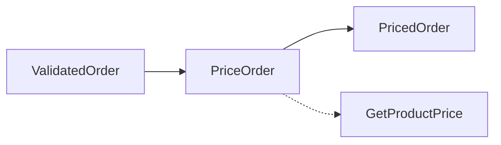
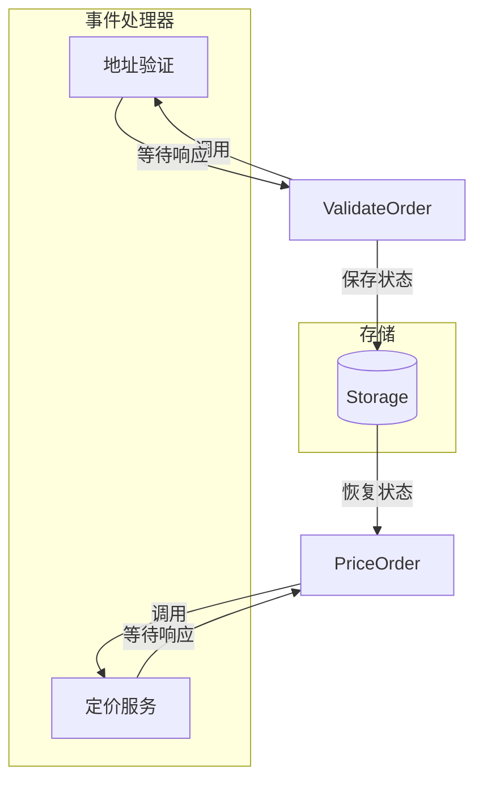

# 第7章：将工作流建模为管道

> 上一章我们学习了如何确保领域内的数据可信。本章将把这些内容付诸实践，把下单工作流建模为一系列管道步骤。我们将用类型表示工作流的输入、每一步的输入输出、依赖与效果，最终得到一个可执行的领域文档。

---



遵循函数式编程原则，我们将确保管道中的每一步都设计为**无状态**且**无副作用**，这样每一步都可以独立测试和理解。一旦设计好管道的各个部分，我们只需实现并组装它们即可。

## 7.1 工作流输入

我们先来看工作流的输入。

### 7.1.1 工作流输入应为领域对象

工作流的输入应始终是领域对象（我们假设输入已经从数据传输对象 DTO 反序列化完成）。在我们的例子中，该对象是之前建模的 `UnvalidatedOrder` 类型：

```fsharp
type UnvalidatedOrder = {
    OrderId : string
    CustomerInfo : UnvalidatedCustomerInfo
    ShippingAddress : UnvalidatedAddress
    // ...
}
```

### 7.1.2 命令作为输入

我们在本书开头（第 13 页）看到，工作流与发起它的命令相关联。从某种意义上说，工作流的真正输入其实不是订单表单，而是**命令（Command）**。

对于下单工作流，我们把这个命令称为 `PlaceOrder`。命令应包含工作流处理请求所需的一切，在本例中就是上面的 `UnvalidatedOrder`。我们可能还需要记录谁创建了命令、时间戳以及其他用于日志和审计的元数据，因此命令类型可能最终会是这样：

```fsharp
type PlaceOrder = {
    OrderForm : UnvalidatedOrder
    Timestamp: DateTime
    UserId: string
    // etc
}
```

### 7.1.3 使用泛型共享通用结构

当然，我们要建模的不止这一条命令。每条命令都会有自己工作流所需的数据，但也会与其他命令共享一些通用字段，例如 `UserId` 和 `Timestamp`。我们真的需要一遍遍实现相同的字段吗？有没有办法共享它们？

如果采用面向对象设计，显而易见的做法是使用包含通用字段的基类，然后让每条具体命令继承它。

在函数式世界里，我们可以用**泛型（generics）**达到同样目的。我们首先定义一个 `Command` 类型，包含通用字段和一个用于命令特定数据的槽位（我们称之为 `Data`）：

```fsharp
type Command<'data> = {
    Data : 'data
    Timestamp: DateTime
    UserId: string
    // etc
}
```

然后只需指定放入 `Data` 槽位的类型，即可创建工作流专用的命令：

```fsharp
type PlaceOrder = Command<UnvalidatedOrder>
```

### 7.1.4 将多条命令合并为一个类型

在某些情况下，限界上下文的所有命令会通过同一输入通道（例如消息队列）发送，因此我们需要某种方式将它们统一为一个可序列化的数据结构。



解决方案很清晰：只需创建一个包含所有命令的选择类型。例如，如果我们需要在 `PlaceOrder`、`ChangeOrder` 和 `CancelOrder` 之间选择，可以创建这样的类型：

```fsharp
type OrderTakingCommand =
    | Place of PlaceOrder
    | Change of ChangeOrder
    | Cancel of CancelOrder
```

注意每个分支都关联了一个命令类型。我们已经定义了 `PlaceOrder` 类型，`ChangeOrder` 和 `CancelOrder` 会以同样方式定义，包含执行命令所需的信息。

这个选择类型会被映射到 DTO，在输入通道上序列化和反序列化。我们只需在限界上下文的边缘（第 53 页洋葱架构的「基础设施」层）添加一个「路由」或「分发」输入阶段。



## 7.2 将订单建模为一组状态

现在我们来讨论工作流管道中的步骤。根据之前对工作流的理解，订单显然不是静态文档，而是会经历一系列不同状态的转换：

```text
未处理的订单表单
    ↓
未验证订单 (Unvalidated)
    ↓
已验证订单 (Validated)
    ↓
已定价订单 (Priced)
    ↓
无效订单 (Invalid Order) / 未验证报价 (Unvalidated quote)
```

我们该如何建模这些状态？一种朴素的做法是创建一个单一记录类型，用标志位捕获所有不同状态：

```fsharp
type Order = {
    OrderId : OrderId
    // ...
    IsValidated : bool  // 验证时设置
    IsPriced : bool     // 定价时设置
    AmountToBill : decimal option  // 定价时也设置
}
```

但这种方法有很多问题：

- 系统显然有状态（由各种标志位体现），但状态是隐式的，需要大量条件代码才能处理。
- 某些状态有数据，而其他状态不需要，把它们都放在一个记录里会使设计复杂化。例如，`AmountToBill` 只在「已定价」状态需要，但因为它在其他状态不存在，我们不得不把该字段设为可选。
- 不清楚哪些字段与哪些标志位对应。`IsPriced` 为真时 `AmountToBill` 必须被设置，但设计并未强制这一点，我们只能依赖注释提醒自己保持数据一致。

更好的领域建模方式是：为订单的每个状态创建一个新类型。这样我们可以消除隐式状态和条件字段。类型可以直接从之前创建的领域文档中定义。例如，以下是 `ValidatedOrder` 的领域文档：

```text
data ValidatedOrder =
    ValidatedCustomerInfo
    AND ValidatedShippingAddress
    AND ValidatedBillingAddress
    AND list of ValidatedOrderLine
```

以下是 `ValidatedOrder` 的对应类型定义。这是直接的翻译（额外加上 `OrderId`，因为订单标识必须在整个工作流中保持）：

```fsharp
type ValidatedOrder = {
    OrderId : OrderId
    CustomerInfo : CustomerInfo
    ShippingAddress : Address
    BillingAddress : Address
    OrderLines : ValidatedOrderLine list
}
```

我们可以用同样方式为 `PricedOrder` 创建类型，增加价格信息的额外字段：

```fsharp
type PricedOrder = {
    OrderId : ...
    CustomerInfo : CustomerInfo
    ShippingAddress : Address
    BillingAddress : Address
    // 与 ValidatedOrder 不同
    OrderLines : PricedOrderLine list
    AmountToBill : BillingAmount
}
```

最后，我们可以创建一个顶层类型，作为所有状态之间的选择：

```fsharp
type Order =
    | Unvalidated of UnvalidatedOrder
    | Validated of ValidatedOrder
    | Priced of PricedOrder
    // etc
```

这是在其生命周期任意时刻表示订单的对象。这也是可以持久化到存储或与其他上下文通信的类型。

注意，我们不会在选择集中包含 `Quote`，因为它不是订单可以进入的状态——它是完全不同的工作流。

### 7.2.1 需求变化时添加新状态类型

为每个状态使用单独类型的一个好处是，可以添加新状态而不破坏现有代码。例如，如果有支持退款的需求，我们可以添加新的 `RefundedOrder` 状态及其所需的信息。由于其他状态是独立定义的，使用它们的任何代码都不会受到这一变更的影响。

## 7.3 状态机

上一节中，我们把带标志位的单一类型转换为一组独立类型，每种类型针对特定工作流阶段设计。

这是我们第二次做这种转换。在第 108 页讨论的 `EmailAddress` 示例中，我们把带标志位的设计转换为带两个选择的设计，分别对应「未验证」和「已验证」两种状态。

这类情况在业务建模场景中极为常见，因此我们暂停一下，把「状态」作为通用的领域建模工具来审视。在典型模型中，文档或记录可以处于一个或多个状态，状态之间通过某种命令触发的路径（「转换」）相连，如第 125 页图所示。这被称为**状态机（State Machine）**。



你可能熟悉有数十或数百个状态的复杂状态机，例如用于语言解析器和正则表达式的那些。我们讨论的不是那些。这里要讨论的状态机要简单得多——最多只有几个分支，转换数量也很少。

一些例子：

- **邮箱地址**：可能有「未验证」和「已验证」两种状态，通过让用户点击确认邮件中的链接，可以从「未验证」转换到「已验证」。



- **购物车**：可能有「空」「活跃」和「已支付」三种状态，通过添加商品可以从「空」转换到「活跃」，通过支付可以转换到「已支付」。



- **包裹配送**：可能有三种状态「未配送」「配送中」和「已送达」，通过把包裹装上配送车可以从「未配送」转换到「配送中」，依此类推。



### 7.3.1 为什么使用状态机？

在这些情况下使用状态机有多方面好处：

- **每个状态可以有不同的允许行为。**  
  例如，在购物车例子中，只有活跃购物车可以支付，已支付购物车不能再添加商品。上一章讨论未验证/已验证邮箱设计时，我们看到一条业务规则：只能向已验证邮箱地址发送密码重置。通过为每个状态使用不同类型，我们可以在函数签名中直接编码该要求，用编译器确保遵守该业务规则。

- **所有状态都被显式记录。**  
  重要状态可能隐式存在却从未被记录。在购物车例子中，「空购物车」与「活跃购物车」行为不同，但很少在代码中显式记录这一点。

- **它是一种设计工具，迫使你考虑所有可能发生的情况。**  
  设计中常见的错误来源是某些边界情况未被处理。状态机迫使考虑所有情况。例如：
  - 若尝试验证已验证的邮箱，应发生什么？
  - 若尝试从空购物车移除商品，应发生什么？
  - 若尝试配送已处于「已送达」状态的包裹，应发生什么？

以状态的角度思考设计，可以迫使这些问题浮出水面，澄清领域逻辑。

### 7.3.2 如何在 F# 中实现简单状态机

用于语言解析器等的复杂状态机由规则集或文法生成，实现相当复杂。但上述面向业务的简单状态机可以手动编码，无需特殊工具或库。

那么我们该如何实现这些简单状态机？我们不想做的是：把所有状态合并到一个公共记录中，用标志位、枚举或其他条件逻辑来区分它们。

更好的做法是让每个状态有自己的类型，存储该状态相关的数据（如有）。然后整个状态集可以用一个选择类型表示，每个状态一个分支。以下是使用购物车状态机的例子：

```fsharp
type Item = ...
type ActiveCartData = { UnpaidItems: Item list }
type PaidCartData = { PaidItems: Item list; Payment: float }

type ShoppingCart =
    | EmptyCart  // 无数据
    | ActiveCart of ActiveCartData
    | PaidCart of PaidCartData
```

`ActiveCartData` 和 `PaidCartData` 状态各有自己的类型。`EmptyCart` 状态没有关联数据，因此不需要为其定义特殊类型。

命令处理器则表示为接受整个状态机（选择类型）并返回其新版本的函数。假设我们想向购物车添加商品。状态转换函数 `addItem` 接受 `ShoppingCart` 参数和要添加的商品：

```fsharp
let addItem cart item =
    match cart with
    | EmptyCart ->
        // 创建带一个商品的活跃购物车
        ActiveCart {UnpaidItems=[item]}
    | ActiveCart {UnpaidItems=existingItems} ->
        // 创建添加了商品的 ActiveCart
        ActiveCart {UnpaidItems = item :: existingItems}
    | PaidCart _ ->
        // 忽略
        cart
```

结果是新的 `ShoppingCart`，可能处于新状态，也可能没有（若原本处于「已支付」状态）。

假设我们想为购物车中的商品付款。状态转换函数 `makePayment` 接受 `ShoppingCart` 参数和支付信息：

```fsharp
let makePayment cart payment =
    match cart with
    | EmptyCart ->
        // 忽略
        cart
    | ActiveCart {UnpaidItems=existingItems} ->
        // 创建带支付的 PaidCart
        PaidCart {PaidItems = existingItems; Payment=payment}
    | PaidCart _ ->
        // 忽略
        cart
```

结果是新的 `ShoppingCart`，可能处于「已支付」状态，也可能没有（若原本已处于「空」或「已支付」状态）。

从调用者角度看，状态集被当作一个整体进行通用操作（`ShoppingCart` 类型），但在内部处理事件时，每个状态被单独处理。

## 7.4 用类型为工作流的每一步建模

状态机方法非常适合建模我们的下单工作流，因此我们用它来建模每一步的细节。

### 7.4.1 验证步骤

先从验证开始。在第 40 页的早期讨论中，我们将「ValidateOrder」子步骤记录为：

```text
substep "ValidateOrder" =
    input: UnvalidatedOrder
    output: ValidatedOrder OR ValidationError
    dependencies: CheckProductCodeExists, CheckAddressExists
```

我们假设已按之前讨论的方式定义了输入和输出类型（`UnvalidatedOrder` 和 `ValidatedOrder`）。除了输入之外，我们看到该子步骤有两个依赖：一个用于检查产品编码是否存在，一个用于检查地址是否存在，如第 129 页图所示。



我们一直在讨论把过程建模为有输入输出的函数。但如何用类型建模这些依赖？简单，我们也把它们当作函数。函数的类型签名将成为我们稍后需要实现的「接口」。

例如，要检查产品编码是否存在，我们需要一个函数：接受 `ProductCode`，若它在产品目录中存在则返回 `true`，否则返回 `false`。我们可以定义一个表示这一点的 `CheckProductCodeExists` 类型：

```fsharp
type CheckProductCodeExists =
    ProductCode -> bool
    // ^输入    ^输出
```

再看第二个依赖，我们需要一个函数：接受 `UnvalidatedAddress`，若有效则返回修正后的地址，若地址无效则返回某种验证错误。

我们还想区分「已检查地址」（远程地址检查服务的输出）和我们的 `Address` 领域对象，在某个时刻需要在这两者之间转换。目前可以简单地说 `CheckedAddress` 是 `UnvalidatedAddress` 的包装版本：

```fsharp
type CheckedAddress = CheckedAddress of UnvalidatedAddress
```

该服务接受 `UnvalidatedAddress` 作为输入，返回 `Result` 类型：成功时为 `CheckedAddress` 值，失败时为 `AddressValidationError` 值：

```fsharp
type AddressValidationError = AddressValidationError of string
type CheckAddressExists =
    UnvalidatedAddress -> Result<CheckedAddress,AddressValidationError>
    // ^输入                                    ^输出
```

有了依赖定义，我们现在可以把 `ValidateOrder` 步骤定义为：有主输入（`UnvalidatedOrder`）、两个依赖（`CheckProductCodeExists` 和 `CheckAddressExists` 服务）和输出（`ValidatedOrder` 或错误）的函数。类型签名乍看可能吓人，但若把它想成上一句话的代码等价物，就说得通了：

```fsharp
type ValidateOrder =
    CheckProductCodeExists  // 依赖
    -> CheckAddressExists   // 依赖
    -> UnvalidatedOrder    // 输入
    -> Result<ValidatedOrder,ValidationError>  // 输出
```

函数的整体返回值必须是 `Result`，因为其中一个依赖（`CheckAddressExists` 函数）返回 `Result`。当 `Result` 在任何地方被使用时，它会「污染」所有接触到的东西，「结果性」需要一直向上传递，直到到达处理它的顶层函数。

::: tip 参数顺序
我们把依赖放在参数顺序的前面，输入类型放在倒数第二位，紧接着输出类型。这样做的原因是为了便于**部分应用（partial application）**（函数式中的依赖注入等价物）。我们将在第 180 页的实现章节讨论这在实践中如何工作。
:::

### 7.4.2 定价步骤

接下来设计「PriceOrder」步骤。以下是原始领域文档：

```text
substep "PriceOrder" =
    input: ValidatedOrder
    output: PricedOrder
    dependencies: GetProductPrice
```

同样，我们看到一个依赖——给定产品编码返回价格的函数。



我们可以定义 `GetProductPrice` 类型来记录这一依赖：

```fsharp
type GetProductPrice =
    ProductCode -> Price
```

再次注意我们在这里做了什么。`PriceOrder` 函数需要产品目录的信息，但我们不是传递某种重量级的 `IProductCatalog` 接口，而是只传递一个函数（`GetProductPrice`），它恰好表示我们在这一阶段从产品目录需要的功能。

也就是说，`GetProductPrice` 充当**抽象**——它隐藏产品目录的存在，只向我们暴露所需的功能，不多不少。

定价函数本身则会是这样的：

```fsharp
type PriceOrder =
    GetProductPrice   // 依赖
    -> ValidatedOrder // 输入
    -> PricedOrder    // 输出
```

该函数总是成功，因此不需要返回 `Result`。

### 7.4.3 确认订单步骤

下一步创建确认信并发送给客户。我们先建模确认信。目前只说它包含我们将通过邮件发送的 HTML 字符串。我们把 HTML 字符串建模为简单类型，把 `OrderAcknowledgment` 建模为包含信件和发送邮箱地址的记录类型：

```fsharp
type HtmlString =
    HtmlString of string

type OrderAcknowledgment = {
    EmailAddress : EmailAddress
    Letter : HtmlString
}
```

我们如何知道信件内容应该是什么？信件很可能是根据客户信息和订单详情从某种模板创建的。与其把该逻辑嵌入工作流，不如让别人操心！也就是说，我们假设会有一个服务函数为我们生成内容，我们只需给它一个 `PricedOrder`：

```fsharp
type CreateOrderAcknowledgmentLetter =
    PricedOrder -> HtmlString
```

我们将把这种类型的函数作为该步骤的依赖。

有了信件后，我们需要发送它。该如何做？是直接调用某种 API，还是把确认写入消息队列，还是别的？

幸运的是，我们现在不需要决定这些问题。我们可以暂时搁置具体实现，只关注需要的接口。和之前一样，此时设计所需的就是定义一个接受 `OrderAcknowledgment` 作为输入并为我们发送的函数；我们不关心如何发送。

```fsharp
type SendOrderAcknowledgment =
    OrderAcknowledgment -> unit
```

这里我们使用 `unit` 类型表示有某种我们不关心的副作用，但函数不返回任何东西。

但这真的对吗？我们希望在确认发送后从整体下单工作流返回 `OrderAcknowledgmentSent` 事件，但按这个设计我们无法判断是否已发送。所以需要修改。

一个明显选择是改为返回 `bool`，然后用来决定是否创建事件：

```fsharp
type SendOrderAcknowledgment =
    OrderAcknowledgment -> bool
```

但在设计中布尔值通常是个糟糕选择，因为它们信息量很少。用简单的 `Sent`/`NotSent` 选择类型代替 `bool` 会更好：

```fsharp
type SendResult = Sent | NotSent
type SendOrderAcknowledgment =
    OrderAcknowledgment -> SendResult
```

或者，我们是否应该让服务本身（可选地）返回 `OrderAcknowledgmentSent` 事件？

```fsharp
type SendOrderAcknowledgment =
    OrderAcknowledgment -> OrderAcknowledgmentSent option
```

但若这样做，我们就通过事件类型在领域和服务之间建立了耦合。这里没有正确答案，所以目前我们坚持 `Sent`/`NotSent` 方式。我们随时可以稍后更改。

最后，「确认订单」步骤的输出应该是什么？简单说就是「已发送」事件（若创建了的话）。现在定义该事件类型：

```fsharp
type OrderAcknowledgmentSent = {
    OrderId : OrderId
    EmailAddress : EmailAddress
}
```

最后，我们可以把这一切组合起来定义该步骤的函数类型：

```fsharp
type AcknowledgeOrder =
    CreateOrderAcknowledgmentLetter  // 依赖
    -> SendOrderAcknowledgment      // 依赖
    -> PricedOrder                  // 输入
    -> OrderAcknowledgmentSent option  // 输出
```

如你所见，函数返回可选事件，因为确认可能未被发送。

### 7.4.4 创建要返回的事件

上一步会为我们创建 `OrderAcknowledgmentSent` 事件，但我们还需要创建 `OrderPlaced` 事件（用于物流）和 `BillableOrderPlaced` 事件（用于计费）。这些很容易定义：`OrderPlaced` 事件可以只是 `PricedOrder` 的别名，`BillableOrderPlaced` 事件只是 `PricedOrder` 的子集：

```fsharp
type OrderPlaced = PricedOrder
type BillableOrderPlaced = {
    OrderId : OrderId
    BillingAddress: Address
    AmountToBill : BillingAmount
}
```

要实际返回这些事件，我们可以创建一个特殊类型来持有它们：

```fsharp
type PlaceOrderResult = {
    OrderPlaced : OrderPlaced
    BillableOrderPlaced : BillableOrderPlaced
    OrderAcknowledgmentSent : OrderAcknowledgmentSent option
}
```

但很可能我们会随时间向该工作流添加新事件，定义这种特殊记录类型会使变更更困难。

相反，不如说工作流返回一个事件列表，其中事件可以是 `OrderPlaced`、`BillableOrderPlaced` 或 `OrderAcknowledgmentSent` 之一。也就是说，我们定义一个 `PlaceOrderEvent` 作为这样的选择类型：

```fsharp
type PlaceOrderEvent =
    | OrderPlaced of OrderPlaced
    | BillableOrderPlaced of BillableOrderPlaced
    | AcknowledgmentSent of OrderAcknowledgmentSent
```

然后工作流的最后一步会发出这些事件的列表：

```fsharp
type CreateEvents =
    PricedOrder -> PlaceOrderEvent list
```

若我们日后需要处理新事件，只需将其加入选择分支，不会破坏整个工作流。

若我们发现同一事件出现在领域多个工作流中，我们甚至可以再上一层，创建更通用的 `OrderTakingDomainEvent`，作为领域中所有事件的选择。

## 7.5 文档化效果

在第 87 页的先前讨论中，我们谈到在类型签名中**文档化效果（Documenting Effects）**：该函数可能有什么效果？可能返回错误吗？会做 I/O 吗？

让我们快速回顾所有依赖，再次检查是否需要显式说明任何这类效果。

### 7.5.1 验证步骤中的效果

验证步骤有两个依赖：`CheckProductCodeExists` 和 `CheckAddressExists`。

先看 `CheckProductCodeExists`：

```fsharp
type CheckProductCodeExists = ProductCode -> bool
```

它可能返回错误吗？是远程调用吗？

我们假设两者都不是。相反，我们期望产品目录的本地缓存副本可用（还记得 Ollie 在《理解领域》中关于自治的说法吗），我们可以快速访问它。

另一方面，我们知道 `CheckAddressExists` 函数调用的是远程服务，而非领域内的本地服务，因此它也应该有 `Async` 效果以及 `Result` 效果。事实上，`Async` 和 `Result` 效果经常一起使用，我们通常会用 `AsyncResult` 别名将它们组合为一个类型：

```fsharp
type AsyncResult<'success,'failure> = Async<Result<'success,'failure>>
```

这样，我们可以把 `CheckAddressExists` 的返回类型从 `Result` 改为 `AsyncResult`，以表明该函数同时具有 async 和 error 效果：

```fsharp
type CheckAddressExists =
    UnvalidatedAddress -> AsyncResult<CheckedAddress,AddressValidationError>
```

现在从类型签名可以清楚看出，`CheckAddressExists` 函数在做 I/O，且可能失败。之前讨论限界上下文时，我们说自治是关键因素。那是否意味着我们应该尝试创建地址验证服务的本地版本？若与 Ollie 讨论，我们得到保证：该服务可用性非常高。

记住，想要自治的主要原因不是性能，而是让你能够承诺一定水平的可用性和服务。若你的实现依赖第三方，你真的需要信任他们（或以其他方式应对任何服务问题）。

正如 `Result` 一样，`Async` 效果对包含它的任何代码都具有传染性。因此把 `CheckAddressExists` 改为返回 `AsyncResult` 意味着我们必须把整个 `ValidateOrder` 步骤也改为返回 `AsyncResult`：

```fsharp
type ValidateOrder =
    CheckProductCodeExists  // 依赖
    -> CheckAddressExists   // AsyncResult 依赖
    -> UnvalidatedOrder     // 输入
    -> AsyncResult<ValidatedOrder,ValidationError list>  // 输出
```

### 7.5.2 定价步骤中的效果

定价步骤只有一个依赖：`GetProductPrice`。我们再次假设产品目录是本地的（例如缓存在内存中），因此没有 `Async` 效果。据我们所知，访问它也不会返回错误。所以没有效果。

然而，`PriceOrder` 步骤本身很可能返回错误。假设某商品标价错误，导致整体 `AmountToBill` 非常大（或为负）。这类情况发生时我们应该捕获。这可能是非常罕见的边界情况，但许多现实中的尴尬都是由这类错误造成的！

若我们现在要返回 `Result`，还需要一个配套的错误类型。我们称之为 `PricingError`。`PriceOrder` 函数现在是这样：

```fsharp
type PricingError = PricingError of string
type PriceOrder =
    GetProductPrice   // 依赖
    -> ValidatedOrder // 输入
    -> Result<PricedOrder,PricingError>  // 输出
```

### 7.5.3 确认步骤中的效果

`AcknowledgeOrder` 步骤有两个依赖：`CreateOrderAcknowledgmentLetter` 和 `SendOrderAcknowledgment`。

`CreateOrderAcknowledgmentLetter` 函数可能返回错误吗？可能不会。我们假设它是本地的，使用缓存的模板。所以总体而言，`CreateOrderAcknowledgmentLetter` 函数没有任何需要在类型签名中记录的效果。

另一方面，我们知道 `SendOrderAcknowledgment` 会做 I/O，因此需要 `Async` 效果。错误呢？在这种情况下我们不关心错误细节，即使有错误，我们也想忽略它并继续走成功路径。这意味着修订后的 `SendOrderAcknowledgment` 会有 `Async` 类型但没有 `Result` 类型：

```fsharp
type SendOrderAcknowledgment =
    OrderAcknowledgment -> Async<SendResult>
```

当然，`Async` 效果也会波及父函数：

```fsharp
type AcknowledgeOrder =
    CreateOrderAcknowledgmentLetter  // 依赖
    -> SendOrderAcknowledgment      // Async 依赖
    -> PricedOrder                  // 输入
    -> Async<OrderAcknowledgmentSent option>  // Async 输出
```

## 7.6 从步骤组合工作流

我们现在有了所有步骤的定义；因此当每个步骤都有实现时，我们应该能够把一步的输出接到下一步的输入，构建出整体工作流。

但不会那么简单！让我们把所有步骤的定义放在一起看，去掉依赖，只列出输入和输出：

```fsharp
type ValidateOrder =
    UnvalidatedOrder  // 输入
    -> AsyncResult<ValidatedOrder,ValidationError list>  // 输出

type PriceOrder =
    ValidatedOrder  // 输入
    -> Result<PricedOrder,PricingError>  // 输出

type AcknowledgeOrder =
    PricedOrder  // 输入
    -> Async<OrderAcknowledgmentSent option>  // 输出

type CreateEvents =
    PricedOrder  // 输入
    -> PlaceOrderEvent list  // 输出
```

`PriceOrder` 步骤的输入需要 `ValidatedOrder`，但 `ValidateOrder` 的输出是 `AsyncResult<ValidatedOrder,...>`，完全不匹配。

同样，`PriceOrder` 步骤的输出不能用作 `AcknowledgeOrder` 的输入，依此类推。

因此，要组合这些函数，我们将不得不调整输入和输出类型，使它们兼容并能拼接在一起。这是做类型驱动设计时的常见挑战，我们将在实现章节中看到如何做到这一点。

## 7.7 依赖是否属于设计的一部分？

在上面的代码中，我们把对其他上下文的调用（如 `CheckProductCodeExists` 和 `ValidateAddress`）视为要记录的依赖。我们对每个子步骤的设计都为这些依赖添加了显式的额外参数：

```fsharp
type ValidateOrder =
    CheckProductCodeExists  // 显式依赖
    -> CheckAddressExists   // 显式依赖
    -> UnvalidatedOrder     // 输入
    -> AsyncResult<ValidatedOrder,ValidationError list>  // 输出

type PriceOrder =
    GetProductPrice  // 显式依赖
    -> ValidatedOrder  // 输入
    -> Result<PricedOrder,PricingError>  // 输出
```

你可能会争辩说，任何过程如何完成其工作应该对我们隐藏。我们真的关心它需要与哪些系统协作才能达成目标吗？

若持这种观点，过程定义会简化为只有输入和输出，像这样：

```fsharp
type ValidateOrder =
    UnvalidatedOrder  // 输入
    -> AsyncResult<ValidatedOrder,ValidationError list>  // 输出

type PriceOrder =
    ValidatedOrder  // 输入
    -> Result<PricedOrder,PricingError>  // 输出
```

哪种方式更好？

设计从来没有正确答案，但让我们遵循这条准则：

- **对于在公共 API 中暴露的函数**，向调用者隐藏依赖信息。
- **对于内部使用的函数**，显式说明其依赖。

在本例中，顶层 `PlaceOrder` 工作流函数的依赖不应暴露，因为调用者不需要知道它们。签名应只显示输入和输出，像这样：

```fsharp
type PlaceOrderWorkflow =
    PlaceOrder  // 输入
    -> AsyncResult<PlaceOrderEvent list,PlaceOrderError>  // 输出
```

但对于工作流中的每个内部步骤，依赖应显式说明，正如我们在原始设计中所做的那样。这有助于记录每个步骤实际需要什么。若某步骤的依赖发生变化，我们可以修改该步骤的函数定义，进而迫使我们修改实现。

## 7.8 完整管道

我们已完成设计的第一遍，来回顾一下目前的内容。

首先，写下公共 API 的类型。我们通常把它们都放在一个文件中，例如 `DomainApi.fs` 或类似名称。

以下是输入：

```fsharp
// ----------------------
// 输入数据
// ----------------------
type UnvalidatedOrder = {
    OrderId : string
    CustomerInfo : UnvalidatedCustomer
    ShippingAddress : UnvalidatedAddress
}
and UnvalidatedCustomer = {
    Name : string
    Email : string
}
and UnvalidatedAddress = ...

// ----------------------
// 输入命令
// ----------------------
type Command<'data> = {
    Data : 'data
    Timestamp: DateTime
    UserId: string
    // etc
}
type PlaceOrderCommand = Command<UnvalidatedOrder>
```

以下是输出和工作流定义本身：

```fsharp
// ----------------------
// 公共 API
// ----------------------
/// PlaceOrder 工作流的成功输出
type OrderPlaced = ...
type BillableOrderPlaced = ...
type OrderAcknowledgmentSent = ...

type PlaceOrderEvent =
    | OrderPlaced of OrderPlaced
    | BillableOrderPlaced of BillableOrderPlaced
    | AcknowledgmentSent of OrderAcknowledgmentSent

/// PlaceOrder 工作流的失败输出
type PlaceOrderError = ...

type PlaceOrderWorkflow =
    PlaceOrderCommand  // 输入命令
    -> AsyncResult<PlaceOrderEvent list,PlaceOrderError>  // 输出事件
```

### 7.8.1 内部步骤

我们把内部步骤使用的类型放在单独的实现文件中（例如 `PlaceOrderWorkflow.fs`）。稍后，在同一文件底部，我们会添加实现。

我们先从表示订单生命周期的内部状态开始：

```fsharp
// 从领域 API 模块引入类型
open DomainApi

// ----------------------
// 订单生命周期
// ----------------------
// 已验证状态
type ValidatedOrderLine = ...
type ValidatedOrder = {
    OrderId : OrderId
    CustomerInfo : CustomerInfo
    ShippingAddress : Address
    BillingAddress : Address
    OrderLines : ValidatedOrderLine list
}
and OrderId = Undefined
and CustomerInfo = ...
and Address = ...

// 已定价状态
type PricedOrderLine = ...
type PricedOrder = ...

// 所有状态组合
type Order =
    | Unvalidated of UnvalidatedOrder
    | Validated of ValidatedOrder
    | Priced of PricedOrder
    // etc
```

然后我们可以添加每个内部步骤的定义：

```fsharp
// ----------------------
// 内部步骤定义
// ----------------------
// ----- 验证订单 -----
// ValidateOrder 使用的服务
type CheckProductCodeExists =
    ProductCode -> bool
type AddressValidationError = ...
type CheckedAddress = ...
type CheckAddressExists =
    UnvalidatedAddress
    -> AsyncResult<CheckedAddress,AddressValidationError>

type ValidateOrder =
    CheckProductCodeExists  // 依赖
    -> CheckAddressExists   // 依赖
    -> UnvalidatedOrder     // 输入
    -> AsyncResult<ValidatedOrder,ValidationError list>  // 输出
and ValidationError = ...

// ----- 定价订单 -----
// PriceOrder 使用的服务
type GetProductPrice =
    ProductCode -> Price
type PricingError = ...
type PriceOrder =
    GetProductPrice   // 依赖
    -> ValidatedOrder // 输入
    -> Result<PricedOrder,PricingError>  // 输出
// etc
```

我们现在把所有类型放在一起，准备好指导实现。

## 7.9 长运行工作流

在继续之前，让我们重新审视关于管道的一个重要假设。我们预期，尽管有对远程系统的调用，管道会在短时间内完成，大约几秒钟。

但若这些外部服务需要更长时间才能完成呢？例如，若验证由人而非机器完成，而那人需要一整天呢？或者若定价由不同部门完成，他们也需要很长时间呢？若这些情况成立，会对设计有什么影响？

首先，我们需要在调用远程服务之前将状态保存到存储，然后等待一条消息告诉我们服务已完成，然后从存储重新加载状态，继续工作流的下一步。这比使用普通异步调用要重得多，因为我们需要在每一步之间持久化状态。

```text
开始
  → 步骤 1
    → 保存状态 → 存储
    → 调用远程服务
    → 等待响应
  → 恢复状态 ← 存储
  → 步骤 2
    → 保存状态 → 存储
    → 调用远程服务
    → 等待响应
  → 恢复状态 ← 存储
  → 步骤 3
  → 完成
```

通过这样做，我们把原始工作流拆成更小的、独立的块，每块由事件触发。与其说是一个单一工作流，不如说是一系列独立的迷你工作流。

这就是状态机模型作为思考系统框架的价值所在。在每一步之前，订单从存储加载，之前已作为其状态之一持久化。迷你工作流将订单从原始状态转换到新状态，最后将新状态再次保存回存储。



这类长运行工作流有时被称为 **Saga**（[参考链接](http://vasters.com/archive/Sagas.html)）。每当涉及慢速人工操作时它们很常见，但也可以在你想要把工作流拆成由事件连接的、解耦的独立块时使用（咳咳……微服务）。

在我们的例子中，工作流非常简单。若事件和状态数量增加、转换变得复杂，你可能需要创建一个特殊组件——**流程管理器（Process Manager）**——负责处理传入消息、根据当前状态确定应采取的行动，然后触发相应的工作流。

## 本章小结

本章学习了如何仅用类型建模工作流。

我们从记录工作流输入开始，特别是如何建模命令。然后我们看了如何用状态机建模有生命周期的文档和其他实体。有了对状态的新理解，我们回到工作流，用类型表示每个子步骤的输入和输出状态来建模每一步，并花了不少力气记录每步的依赖和效果。

一路走来我们创建了似乎上百个类型（实际上大约三十个）。这真的有必要吗？类型会不会太多？可能看起来很多，但请记住，我们是在尝试创建**可执行文档**——传达领域的代码。若不创建这些类型，我们仍然需要记录已验证订单与已定价订单之间的区别，或 widget 编码与普通字符串之间的区别。何不让文档就在代码本身中？

当然，总要有平衡。我们在这里刻意走向极端，展示若一切都以这种方式记录会是什么样子。若你发现这种方法在你的情况下过度，请随意缩减以匹配你的需求。一如既往，你应该做对领域有益、对手头任务最有帮助的事。

---

[← 上一章：完整性与一致性](ch06-integrity-and-consistency.md) | [返回目录](../index.md) | [下一章：理解函数 →](../part3/ch08-understanding-functions.md)
