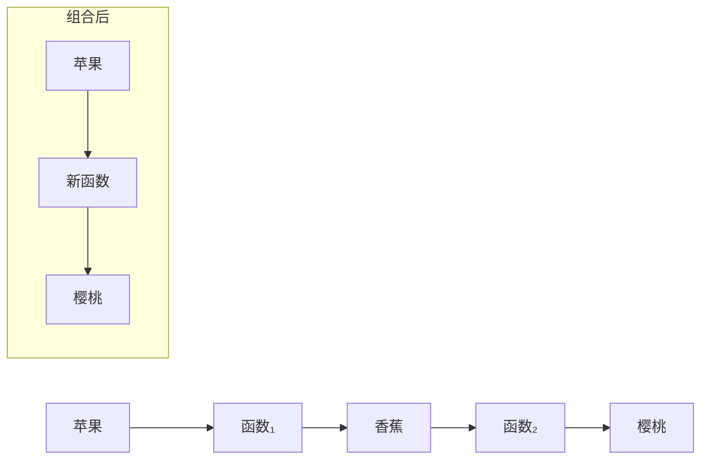
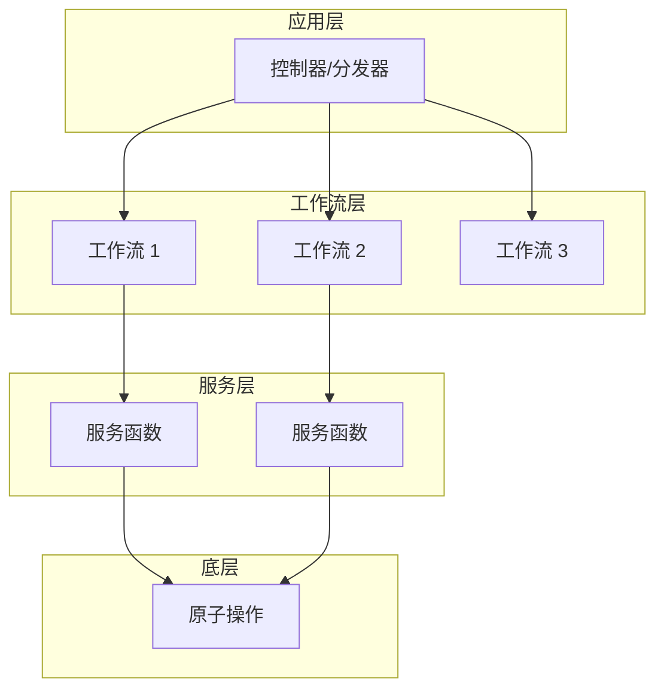

# 第8章：理解函数

> 本书前几部分我们已捕获下单工作流的需求，并用类型对其建模。下一步是用函数式编程（FP）方法实现该设计。但在动手之前，我们先要弄清什么是函数式编程，以及实现时需要的工具和策略。读完本章，你应对 FP 的核心概念有清晰理解——这些概念对任何编程都有价值，不限于领域驱动设计。

---

本书不可能穷尽函数式编程的一切，因此我们只聚焦基础：函数是什么，以及如何做**函数组合（function composition）**——这是 FP 中最重要的设计原则。我们暂不讨论 monad、functor 等听起来吓人的概念，等它们自然出现时再说。此外，本书篇幅有限，无法覆盖所有 F# 语法；若遇到不熟悉的写法，可查阅网上的「F# cheat sheet」或「F# syntax」等资料。

## 8.1 函数无处不在

先看函数式编程与面向对象编程的根本差异。函数式编程有诸多定义，这里采用一个极简版本：

::: tip 核心定义
**函数式编程，就是把函数真正当回事来编程。**
:::

在多数现代语言中，函数是一等公民，但偶尔用函数或 lambda 并不等于在「做」函数式编程。函数式范式的关键在于：**函数无处不在，用于一切**。

例如，假设有一个由小块组装而成的大程序：

- **面向对象**：这些块是类和对象。
- **函数式**：这些块是函数。

再比如，需要参数化程序的某一方面，或降低组件间耦合：

- **面向对象**：用接口和依赖注入。
- **函数式**：用函数来参数化。

若要遵循「不要重复自己」原则，在多个组件间复用代码：

- **面向对象**：可能用继承或类似装饰器模式的技术。
- **函数式**：把可复用逻辑放进函数，再用组合把它们粘在一起。

重要的是，函数式编程不仅是风格差异，而是**完全不同的编程思维方式**。若你刚接触，建议以初学者的心态学习 FP：与其从其他范式提问（如「如何遍历集合？」或「如何实现策略模式？」），不如问如何解决同一类问题（「如何对集合中每个元素执行操作？」或「如何参数化行为？」）。我们面对的问题相同，但函数式编程给出的解决方案与面向对象大不相同。

## 8.2 函数即物

在函数式编程中，**函数本身就是事物**。既然是事物，就可以作为其他函数的**输入**：

```text
输入 ──→ 函数 ──→ 输出
         ↑
      函数可作为输入
```

也可以作为函数的**输出**：

```text
输入 ──→ 函数 ──→ 输出
                   ↑
              函数可作为输出
```

还可以作为**参数**传入函数，以控制其行为。

把函数当作事物看待，会打开一扇大门。一开始可能不太习惯，但仅凭这一条原则，就能快速构建复杂系统。

::: info 术语：高阶函数（Higher-Order Functions）
以其他函数为输入或输出、或把函数作为参数的函数，称为**高阶函数（Higher-Order Functions，HOF）**。
:::

### 8.2.1 在 F# 中把函数当作物

下面四个函数定义展示了「函数即物」在 F# 中的用法：

```fsharp
let plus3 x = x + 3 // plus3 : x:int -> int
let times2 x = x * 2 // times2 : x:int -> int
let square = (fun x -> x * x) // square : x:int -> int
let addThree = plus3 // addThree : (int -> int)
```

前两个是常见写法。第三个用 `let` 给匿名函数（即 lambda 表达式）命名。第四个用 `let` 给之前定义的 `plus3` 起别名。它们都是 `int -> int`：输入 `int`，输出 `int`。

既然函数是事物，就可以放进列表：

```fsharp
// listOfFunctions : (int -> int) list
let listOfFunctions =
    [addThree; times2; square]
```

::: tip F# 列表字面量
列表用方括号 `[]` 包裹，元素用分号（不是逗号！）分隔。
:::

然后可以遍历列表，依次调用每个函数：

```fsharp
for fn in listOfFunctions do
    let result = fn 100 // 调用函数
    printfn "If 100 is the input, the output is %i" result
// 输出 =>
// If 100 is the input, the output is 103
// If 100 is the input, the output is 200
// If 100 is the input, the output is 10000
```

`let` 不仅用于定义函数，也用于给任意值命名。例如给字符串 `"hello"` 命名：

```fsharp
// myString : string
let myString = "hello"
```

函数和简单值用同一个关键字 `let` 并非偶然。看两个例子：第一个定义名为 `square` 的函数：

```fsharp
// square : x:int -> int
let square x = x * x
```

第二个把 `square` 赋给一个匿名函数。这里的 `let` 是在定义简单值还是函数？

```fsharp
// square : x:int -> int
let square = (fun x -> x * x)
```

答案是**两者皆是**。函数是事物，可以赋名。因此两种写法本质相同，可互换使用。

### 8.2.2 函数作为输入

「函数即物」意味着函数可作为输入和输出，下面看具体用法。

先看函数作为输入参数。`evalWith5ThenAdd2` 接收一个函数 `fn`，用 5 调用它，再把结果加 2：

```fsharp
let evalWith5ThenAdd2 fn =
    fn(5) + 2
// evalWith5ThenAdd2 : fn:(int -> int) -> int
```

类型签名表明，`fn` 必须是 `(int -> int)` 函数。

测试一下。先定义 `add1`，再传入：

```fsharp
let add1 x = x + 1 // 一个 int -> int 函数
evalWith5ThenAdd2 add1 // fn(5) + 2 变为 add1(5) + 2
// 所以输出是 8
```

结果为 8。任何 `(int -> int)` 函数都可以作为参数，例如 `square`：

```fsharp
let square x = x * x // 一个 int -> int 函数
evalWith5ThenAdd2 square // fn(5) + 2 变为 square(5) + 2
// 所以输出是 27
```

这次结果是 27。

### 8.2.3 函数作为输出

为什么要返回函数？一个常见原因是**把某些参数「烤进」函数**。

例如有三个加法函数：

```fsharp
let add1 x = x + 1
let add2 x = x + 2
let add3 x = x + 3
```

显然想消除重复。可以写一个「加法器生成器」——返回一个已固定加数的加法函数：

```fsharp
let adderGenerator numberToAdd =
    fun x -> numberToAdd + x  // 返回一个 lambda
// val adderGenerator : int -> (int -> int)
```

类型签名表明：输入 `int`，输出 `(int -> int)` 函数。

也可以返回具名内部函数，而不是匿名函数：

```fsharp
let adderGenerator numberToAdd =
    let innerFn x =
        numberToAdd + x
    innerFn  // 返回内部函数
```

与之前的 `square` 例子一样，两种实现等价。可按喜好选择。

使用示例：

```fsharp
let add1 = adderGenerator 1
add1 2 // 结果 => 3
let add100 = adderGenerator 100
add100 2 // 结果 => 102
```

### 8.2.4 柯里化（Currying）

利用「返回函数」这一技巧，任何多参数函数都可以改写为一串单参数函数，这种方法称为**柯里化（currying）**。

例如，两参数函数 `add`：

```fsharp
// int -> int -> int
let add x y = x + y
```

可以改写为返回新函数的单参数形式：

```fsharp
// int -> (int -> int)
let adderGenerator x = fun y -> x + y
```

在 F# 中不必显式这么做——**每个函数都是柯里化的**。即，任何形如 `'a -> 'b -> 'c` 的两参数函数，也可以理解为：接收 `'a`，返回 `('b -> 'c)` 的单参数函数；更多参数同理。

### 8.2.5 部分应用（Partial Application）

既然每个函数都是柯里化的，就可以只传入一个参数，得到一个新函数——该参数已固定，其余参数仍需提供。这称为**部分应用（partial application）**。

例如，`sayGreeting` 有两个参数：

```fsharp
// sayGreeting: string -> string -> unit
let sayGreeting greeting name =
    printfn "%s %s" greeting name
```

只传一个参数，就能得到问候语已固定的新函数：

```fsharp
// sayHello: string -> unit
let sayHello = sayGreeting "Hello"
// sayGoodbye: string -> unit
let sayGoodbye = sayGreeting "Goodbye"
```

这些函数还剩一个参数 `name`。传入后得到最终输出：

```fsharp
sayHello "Alex"   // 输出: "Hello Alex"
sayGoodbye "Alex" // 输出: "Goodbye Alex"
```

这种「烤进参数」的方式是重要的函数式模式。例如，在实现下单工作流时，我们会用它来做依赖注入（见第9章《实现：组合管道》）。

## 8.3 全函数（Total Functions）

数学上的函数把每个可能的输入映射到一个输出。在函数式编程中，我们尽量按同样方式设计函数：**每个输入都有对应输出**。这类函数称为**全函数（total functions）**。

为什么要这样？因为我们希望尽可能显式地表达一切，把所有效果都写在类型签名里。

用一个简单例子说明：`twelveDividedBy` 返回 12 除以输入（整数除法）的结果。伪代码可以这样写：

```fsharp
let twelveDividedBy n =
    match n with
    | 6 -> 2
    | 5 -> 2
    | 4 -> 3
    | 3 -> 4
    | 2 -> 6
    | 1 -> 12
    | 0 -> ???  // 12 除以 0 未定义
```

输入为 0 时怎么办？12 除以 0 无定义。

若不在意「每个输入都有输出」，可以在 0 的情况下抛异常：

```fsharp
let twelveDividedBy n =
    match n with
    | 6 -> 2
    | ...
    | 0 -> failwith "Can't divide by zero"
```

但这样定义的函数签名是：

```text
twelveDividedBy : int -> int
```

该签名暗示：传入 `int` 就得到 `int`。这是**谎言**！有时得到的是异常，而不是 `int`，但类型签名并未体现这一点。

理想情况是类型签名不说谎，每个输入都有合法输出，没有异常（双重含义）。有两种常见做法。

**做法一：限制输入**，排除非法值。例如定义约束类型 `NonZeroInteger`，0 根本不在输入集合中：

```fsharp
type NonZeroInteger =
    // 定义为非零整数，需智能构造器等
    private NonZeroInteger of int

/// 使用受限输入
let twelveDividedBy (NonZeroInteger n) =
    match n with
    | 6 -> 2
    | ...
    // 0 不可能在输入中，因此无需处理
```

新版本签名：

```text
twelveDividedBy : NonZeroInteger -> int
```

比之前好得多。一眼就能看出输入要求，无需查文档或源码。函数不说谎，一切显式。

**做法二：扩展输出**。接受 0 作为输入，但把输出扩展为「有效 int」或「未定义」的选择，用 `Option` 表示：

```fsharp
/// 使用扩展输出
let twelveDividedBy n =
    match n with
    | 6 -> Some 2  // 有效
    | 5 -> Some 2  // 有效
    | 4 -> Some 3  // 有效
    | ...
    | 0 -> None   // 未定义
```

新版本签名：

```text
twelveDividedBy : int -> int option
```

含义是：给我一个 `int`，若输入可接受，可能返回 `int`。同样，签名显式且不误导。

即便在这个简单例子中，也能看到全函数的好处：两种变体的签名都明确表达了所有可能的输入和输出。本书后面，尤其在错误处理相关章节，我们会看到用函数签名文档化所有可能输出的实际用法。

## 8.4 组合（Composition）

第4章我们讨论过类型的「组合」——用其他类型组合出新类型。这里讨论**函数组合**：把第一个函数的输出接到第二个函数的输入。

例如，有两个函数：第一个输入苹果、输出香蕉；第二个输入香蕉、输出樱桃。第一个的输出类型与第二个的输入类型相同，因此可以组合：

```text
函数₁: 苹果 ──→ 香蕉
函数₂: 香蕉 ──→ 樱桃

组合后：
新函数: 苹果 ──→ 樱桃
```



组合的一个重要方面是**信息隐藏**。调用者看不出函数是由更小的函数组成的，也不知道中间类型（香蕉）的存在——香蕉已被成功隐藏。

### 8.4.1 F# 中的函数组合

在 F# 中，只要第一个函数的输出类型与第二个的输入类型相同，就可以把两个函数粘在一起，通常用**管道（piping）**实现。

F# 的管道与 Unix 管道类似：从一个值开始，喂给第一个函数，再把输出喂给下一个，依此类推。整条管道中最后一个函数的输出，就是整个管道的输出。

F# 的管道操作符是 `|>`。例如：

```fsharp
let add1 x = x + 1      // int -> int 函数
let square x = x * x    // int -> int 函数
let add1ThenSquare x =
    x |> add1 |> square
// 测试
add1ThenSquare 5  // 结果是 36
```

`add1ThenSquare` 的参数 `x` 被喂给第一个函数，启动数据在管道中的流动。

再举一例：第一个是 `int -> bool`，第二个是 `bool -> string`，组合后是 `int -> string`：

```fsharp
let isEven x =
    (x % 2) = 0  // int -> bool 函数
let printBool x =
    sprintf "value is %b" x  // bool -> string 函数
let isEvenThenPrint x =
    x |> isEven |> printBool
// 测试
isEvenThenPrint 2  // 结果是 "value is true"
```

### 8.4.2 用函数构建整个应用

组合原则可用于构建完整应用。例如，从应用最底层的原子操作开始：

```text
底层操作
```

把它们组合成服务函数：

```text
服务函数
```

再把服务函数粘在一起，形成处理完整工作流的函数：

```text
工作流函数
```

最后，把多个工作流并行组合，加上控制器/分发器，根据输入选择要调用的工作流：



这就是用函数构建应用的方式：每一层都是一个有输入输出的函数，**一路向上都是函数**。

第9章《实现：组合管道》会把这些想法付诸实践——通过组装一系列小函数，实现下单工作流的管道。

### 8.4.3 组合函数的挑战

当第一个函数的输出与第二个的输入匹配时，组合很容易。但若类型对不上呢？

常见情况是：底层类型其实兼容，但函数的「形状」不同。例如，一个函数输出 `Option<int>`，另一个需要普通 `int`；或反过来，一个输出 `int`，另一个需要 `Option<int>`：

```text
函数 A ──→ Option<int>    函数 B 需要 int
函数 A ──→ int           函数 B 需要 Option<int>
```

类似的不匹配还会出现在列表、成功/失败的 `Result` 类型、`async` 等场景。

许多组合上的挑战，都来自如何调整输入输出，使函数能连接起来。一种常用做法是把两边都转换到同一类型——某种「最小公倍数」类型。

例如，若输出是 `int`，输入是 `Option<int>`，能同时容纳两者的最小类型就是 `Option`。用 `Some` 把函数 A 的输出包成 `Option`，就可以喂给函数 B，实现组合：

```text
函数 A ──→ int ──Some──→ Option<int> ──→ 函数 B
```

代码示例：

```fsharp
// 输出 int 的函数
let add1 x = x + 1
// 输入 Option<int> 的函数
let printOption x =
    match x with
    | Some i -> printfn "The int is %i" i
    | None -> printfn "No value"
```

要连接它们，用 `Some` 把 `add1` 的输出包成 `Option`，再喂给 `printOption`：

```fsharp
5 |> add1 |> Some |> printOption
```

这是类型不匹配问题的一个简单例子。我们已在第7章建模下单工作流并尝试组合时，遇到过更复杂的例子。在接下来的两章实现中，我们会花不少时间把函数调整成统一形状，以便组合。

## 本章小结

本章介绍了 F# 中函数式编程的基础：把函数当作无处不在的构建块，并设计成可组合的形式。

有了这些原则，我们终于可以开始写真正的代码了！下一章将把这些概念付诸实践，从构建下单工作流的管道开始。

---

[← 上一章：将工作流建模为管道](../part2/ch07-modeling-workflows-as-pipelines.md) | [返回目录](../index.md) | [下一章：组合管道 →](ch09-composing-a-pipeline.md)
