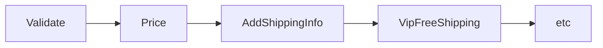
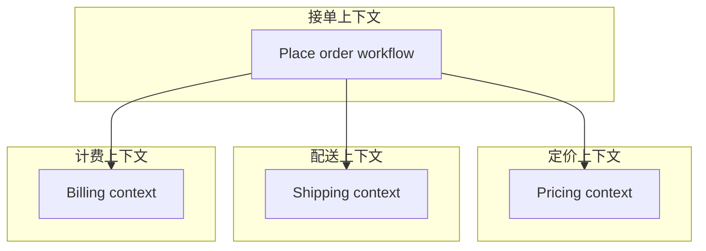
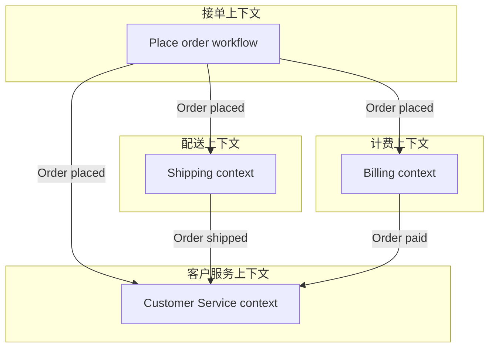

# 第13章：演进设计与保持整洁

> 我们已完成领域模型与实现，但众所周知，故事并未结束。领域模型往往一开始干净优雅，但随着需求变化，模型变得混乱，各子系统纠缠不清、难以测试。因此，我们最后的挑战是：能否在演进模型的同时，避免其沦为「大泥球（big ball of mud）」？领域驱动设计不是静态、一次性的过程，而是开发者、领域专家与其他利益相关者之间的持续协作。因此，当需求变化时，我们必须始终先重新评估领域模型，而不是仅仅修补实现。本章将审视若干可能的需求变更，并追踪它们如何首先影响我们对领域模型的理解，再修改实现。此外，我们将看到，设计中大量使用类型意味着在修改模型时，我们可以高度确信代码不会意外出错。

---

## 13.1 变更一：添加运费（Adding Shipping Charges）

作为第一个需求变更，我们来看如何计算运费和配送费。假设公司希望用特定计算方式向客户收取运费，如何整合这一新需求？

首先需要一个计算运费的函数。假设公司位于加利福尼亚，发往本地州的价格为 5 美元，发往偏远州为 10 美元，发往其他国家为 20 美元。

以下是该计算的初版实现：

```fsharp
/// Calculate the shipping cost for an order
let calculateShippingCost validatedOrder =
    let shippingAddress = validatedOrder.ShippingAddress
    if shippingAddress.Country = "US" then
        // shipping inside USA
        match shippingAddress.State with
        | "CA" | "OR" | "AZ" | "NV" ->
            5.0  //local
        | _ ->
            10.0 //remote
    else
        // shipping outside USA
        20.0
```

遗憾的是，这种带有多种分支的条件逻辑难以理解和维护。

### 13.1.1 使用活动模式简化业务逻辑

一种使逻辑更易维护的做法是，将领域相关的「分类」与实际定价逻辑分离。在 F# 中，有一项称为**活动模式（active patterns）**的特性，可将条件逻辑转化为一组可进行模式匹配的命名选择，就像为每个选择显式定义了可区分联合类型一样。活动模式非常适合这类分类场景。

要使用活动模式实现该需求，我们首先定义一组模式以匹配各运费类别：

```fsharp
let (|UsLocalState|UsRemoteState|International|) address =
    if address.Country = "US" then
        match address.State with
        | "CA" | "OR" | "AZ" | "NV" ->
            UsLocalState
        | _ ->
            UsRemoteState
    else
        International
```

然后在运费计算本身中，对这些类别进行模式匹配：

```fsharp
let calculateShippingCost validatedOrder =
    match validatedOrder.ShippingAddress with
    | UsLocalState -> 5.0
    | UsRemoteState -> 10.0
    | International -> 20.0
```

通过将分类与业务逻辑分离，代码更清晰，活动模式分支的名称也起到文档作用。定义活动模式本身当然仍较复杂，但那部分代码只做分类，不含业务逻辑。若分类逻辑日后变更（例如「UsLocalState」包含不同州），只需修改活动模式，无需改动定价函数，职责分离得当。

### 13.1.2 在工作流中创建新阶段

接下来，我们需要在下单工作流中使用该运费计算。一种做法是修改定价阶段，把运费逻辑加进去。但这会改动已有代码并使其更复杂，可能引入缺陷。与其修改稳定代码，不如充分利用组合，在工作流中新增一个阶段来完成计算并更新 `PricedOrder`：

```fsharp
type AddShippingInfoToOrder = PricedOrder -> PricedOrderWithShippingInfo
```

该新阶段可插入在 `PriceOrder` 与下一阶段 `AcknowledgeOrder` 之间：


随着设计演进，我们往往会发现需要跟踪更多细节。例如，客户可能希望知道配送方式（如 FedEx 或 UPS）以及价格（即便这仍可能过于简化）。因此需要一些新类型来承载这些信息：

```fsharp
type ShippingMethod =
    | PostalService
    | Fedex24
    | Fedex48
    | Ups48

type ShippingInfo = {
    ShippingMethod : ShippingMethod
    ShippingCost : Price
}

type PricedOrderWithShippingMethod = {
    ShippingInfo : ShippingInfo
    PricedOrder : PricedOrder
}
```

注意，我们创建了另一个订单类型——`PricedOrderWithShippingMethod`——包含新的配送信息。你可能会觉得这是过度设计，是否可以直接在 `PricedOrder` 中加一个 `ShippingInfo` 字段复用？但创建全新类型有一些好处：

- 若将 `AcknowledgeOrder` 修改为期望 `PricedOrderWithShippingInfo` 作为输入，就无法搞错阶段顺序。
- 若在 `PricedOrder` 中把 `ShippingInfo` 作为字段，在运费计算完成前应初始化为多少？简单设为默认值可能是潜在的 bug。

最后一个问题：运费应如何存储在订单中？是放在表头字段中，像这样？

```fsharp
type PricedOrder = {
    ...
    ShippingInfo : ShippingInfo
    OrderTotal : Price
}
```

还是作为一种新的订单行，像这样？

```fsharp
type PricedOrderLine =
    | Product of PricedOrderProductLine
    | ShippingInfo of ShippingInfo
```

第二种做法意味着订单总额始终可由各行之和计算，无需额外逻辑把表头字段也算进去。缺点是可能误建两条 `ShippingInfo` 行，且需注意打印顺序。

我们选择将配送信息存在表头。现在已有完成 `AddShippingInfoToOrder` 阶段所需的一切，只需编写满足以下要求的函数：

- 实现上述定义的 `AddShippingInfoToOrder` 函数类型。
- 接收计算运费的依赖——即我们设计的 `calculateShippingCost` 函数。
- 将运费加入 `PricedOrder`，得到 `PricedOrderWithShippingInfo`。

由于这些要求都由类型表示，要写出错误实现反而很难。实现大致如下：

```fsharp
let addShippingInfoToOrder calculateShippingCost : AddShippingInfoToOrder =
    fun pricedOrder ->
        // create the shipping info
        let shippingInfo = {
            ShippingMethod = ...
            ShippingCost = calculateShippingCost pricedOrder
        }
        // add it to the order
        {
            OrderId = pricedOrder.OrderId
            ...
            ShippingInfo = shippingInfo
        }
```

并将其接入顶层工作流：

```fsharp
// set up local versions of the pipeline stages
// using partial application to bake in the dependencies
let validateOrder unvalidatedOrder = ...
let priceOrder validatedOrder = ...
let addShippingInfo = addShippingInfoToOrder calculateShippingCost

// compose the pipeline from the new one-parameter functions
unvalidatedOrder
|> validateOrder
|> priceOrder
|> addShippingInfo
...
```

### 13.1.3 向管道添加阶段的其他理由

本例中，我们因需求变更而添加了新组件。但以这种方式增删组件是添加各类功能的绝佳途径。只要阶段彼此隔离且符合所需类型，就可以放心地添加或移除。例如：

- 可添加用于运维透明度的阶段，便于观察管道内部情况。日志、性能指标、审计等都可以这样轻松加入。
- 可添加检查授权的阶段，若失败则走失败路径，跳过管道其余部分。
- 甚至可以在组合根（composition root）中根据配置或输入上下文动态增删阶段。

---

## 13.2 变更二：支持 VIP 客户（Adding Support for VIP Customers）

接下来看一个影响工作流整体输入的变更。假设业务希望支持 VIP 客户——享受特殊待遇的客户，如免运费或免费升级为隔夜配送。

应如何建模？我们**不应**在领域中对业务规则的输出建模（例如在订单上加「免运费」标志），而应存储业务规则的**输入**（「该客户是 VIP」），然后让业务规则作用于该输入。这样，若业务规则变更（它们总会变），我们不必修改领域模型。

我们假设客户的 VIP 状态以某种方式与网站在线登录关联，因此无需在接单领域自行判断。但应如何建模 VIP 状态？是像这样在 `CustomerInfo` 中用一个标志？

```fsharp
type CustomerInfo = {
    ...
    IsVip : bool
    ...
}
```

还是像这样建模为一组客户状态之一？

```fsharp
type CustomerStatus =
    | Normal of CustomerInfo
    | Vip of CustomerInfo

type Order = {
    ...
    CustomerStatus : CustomerStatus
    ...
}
```

将之建模为客户状态的缺点是，可能还有其他与此正交的客户状态，如新客与回头客、持会员卡的客户等。

最佳做法是折中：使用一个选择类型表示「VIP」维度的状态，独立于其他客户信息：

```fsharp
type VipStatus =
    | Normal
    | Vip

type CustomerInfo = {
    ...
    VipStatus : VipStatus
    ...
}
```

若日后需要其他类型的状态，可以同样方式添加，例如：

```fsharp
type LoyaltyCardId = ...
type LoyaltyCardStatus =
    | None
    | LoyaltyCard of LoyaltyCardId

type CustomerInfo = {
    ...
    VipStatus : VipStatus
    LoyaltyCardStatus : LoyaltyCardStatus
    ...
}
```

### 13.2.1 向工作流添加新输入

假设我们采用新的 `VipStatus` 字段。一如既往，先更新领域模型，再看会导向何处。

先定义状态类型，再将其作为 `CustomerInfo` 的字段：

```fsharp
type VipStatus = ...
type CustomerInfo = {
    ...
    VipStatus : VipStatus
}
```

一旦这样修改，构造 `CustomerInfo` 的代码就会产生编译错误：

```text
No assignment given for field 'VipStatus' of type 'CustomerInfo'
```

这体现了 F# 记录类型的一个优点：构造时必须提供所有字段。若添加新字段，在提供该字段前会一直有编译错误。

`VipStatus` 从哪来？来自工作流输入的 `UnvalidatedCustomerInfo`。而它又从哪来？来自用户填写的订单表单——即 DTO。因此需要在 `UnvalidatedCustomerInfo` 和 DTO 中添加对应字段。对两者而言，都可以用简单字符串，用 `null` 表示缺失值：

```fsharp
module Domain =
    type UnvalidatedCustomerInfo = {
        ...
        VipStatus : string
    }

module Dto =
    type CustomerInfo = {
        ...
        VipStatus : string
    }
```

最后，我们可以用 `UnvalidatedCustomerInfo` 的 status 字段，连同其他字段，构造 `ValidatedCustomerInfo`：

```fsharp
let validateCustomerInfo unvalidatedCustomerInfo =
    result {
        ...
        // new field
        let! vipStatus =
            VipStatus.create unvalidatedCustomerInfo.VipStatus
        let customerInfo : CustomerInfo = {
            ...
            VipStatus = vipStatus
        }
        return customerInfo
    }
```

### 13.2.2 将免运费规则加入工作流

需求之一是给 VIP 免运费，因此需要在工作流某处加入该逻辑。同样，与其修改稳定代码，不如在管道中再增加一段，如下图所示：



与之前一样，先定义表示新段的类型：

```fsharp
type FreeVipShipping =
    PricedOrderWithShippingMethod -> PricedOrderWithShippingMethod
```

然后创建实现该类型的工作流段并插入工作流。代码无需赘述——相信你已经知道如何实现。

---

## 13.3 变更三：支持促销码（Adding Support for Promotion Codes）

再看另一种场景：销售团队想做促销，希望在下单时提供促销码以获得折扣价。

与销售团队讨论后，得到以下新需求：

- 下单时，客户可提供可选的促销码。
- 若提供码，部分产品将获得不同（更低）的价格。
- 订单应显示已应用促销折扣。

其中部分变更较简单，但最后一条看似简单，却会在整个领域产生意想不到的连锁影响。

### 13.3.1 在领域模型中添加促销码

先从新的促销码字段入手。一如既往，先更新领域模型，再看会导向何处。

先定义促销码类型，再将其作为订单的可选字段：

```fsharp
type PromotionCode = PromotionCode of string

type ValidatedOrder = {
    ...
    PromotionCode : PromotionCode option
}
```

`PromotionCode` 没有特殊验证，但用类型而非裸字符串是好的，以免与领域内其他字符串混淆。

### 13.3.2 连锁编译错误

与之前的 `VipStatus` 字段一样，添加新字段会触发一系列编译错误。本例中，需要在 `UnvalidatedOrder` 和 DTO 中添加对应字段。注意，即便 `ValidatedOrder` 中该字段显式标记为可选，DTO 中仍可使用非可选字符串，假定 `null` 表示缺失：

```fsharp
type OrderDto = {
    ...
    PromotionCode : string
}

type UnvalidatedOrder = {
    ...
    PromotionCode : string
}
```

### 13.3.3 修改定价逻辑

若存在促销码，需要一种定价计算；若不存在，需要另一种。如何在领域中对之建模？

我们已将定价计算建模为函数类型：

```fsharp
type GetProductPrice = ProductCode -> Price
```

但现在需要根据促销码提供不同的 `GetProductPrice` 函数。逻辑如下：

- 若存在促销码，提供返回该促销码对应价格的 `GetProductPrice` 函数。
- 若不存在，提供原有的 `GetProductPrice` 函数。

因此需要一个「工厂」函数：给定可选促销码，返回相应的 `GetProductPrice` 函数：

```fsharp
type GetPricingFunction = PromotionCode option -> GetProductPrice
```

传入 `option` 似乎不够清晰，或许应创建一个更自文档化的新类型？

```fsharp
type PricingMethod =
    | Standard
    | Promotion of PromotionCode
```

逻辑上等价于 `option`，但在领域模型中使用时更清晰。`ValidatedOrder` 类型现在如下：

```fsharp
type ValidatedOrder = {
    ... //as before
    PricingMethod : PricingMethod
}
```

`GetPricingFunction` 如下：

```fsharp
type GetPricingFunction = PricingMethod -> GetProductPrice
```

还有一处需要修改。原设计中，我们将 `GetProductPrice` 函数注入工作流的定价阶段。现在需要改为注入 `GetPricingFunction`「工厂」函数：

```fsharp
type PriceOrder =
    GetPricingFunction  // new dependency
    -> ValidatedOrder   // input
    -> PricedOrder     // output
```

对领域模型做这些修改后，实现中会出现大量编译错误。但这些编译错误是朋友！它们会指引你如何修复实现。过程虽繁琐但直接。一旦完成且实现再次编译通过，你可以非常确信一切正常。

### 13.3.4 实现 GetPricingFunction

简要看一下 `GetPricingFunction` 的实现。假设每个促销码对应一个 `(ProductCode, Price)` 字典，实现可能如下：

```fsharp
type GetStandardPriceTable =
    // no input -> return standard prices
    unit -> IDictionary<ProductCode,Price>

type GetPromotionPriceTable =
    // promo input -> return prices for promo
    PromotionCode -> IDictionary<ProductCode,Price>

let getPricingFunction
    (standardPrices:GetStandardPriceTable)
    (promoPrices:GetPromotionPriceTable)
    : GetPricingFunction =
    // the original pricing function
    let getStandardPrice : GetProductPrice =
        // cache the standard prices
        let standardPrices = standardPrices()
        // return the lookup function
        fun productCode -> standardPrices.[productCode]

    // the promotional pricing function
    let getPromotionPrice promotionCode : GetProductPrice =
        // cache the promotional prices
        let promotionPrices = promoPrices promotionCode
        // return the lookup function
        fun productCode ->
            match promotionPrices.TryGetValue productCode with
            // found in promotional prices
            | true,price -> price
            // not found in promotional prices
            // so use standard price
            | false, _ -> getStandardPrice productCode

    // return a function that conforms to GetPricingFunction
    fun pricingMethod ->
        match pricingMethod with
        | Standard ->
            getStandardPrice
        | Promotion promotionCode ->
            getPromotionPrice promotionCode
```

代码本身较直观，无需逐行解释。可以看到我们运用了多种函数式编程技巧：用类型保证正确性（`GetProductPrice`）并让领域逻辑清晰（`PricingMethod` 中的选择）、函数作为参数（`promoPrices` 类型为 `GetPromotionPriceTable`）、函数作为输出（返回类型为 `GetPricingFunction`）。

### 13.3.5 在订单行中记录折扣

需求之一是「订单应显示已应用促销折扣」。如何实现？

要回答这个问题，需要知道下游系统是否需要了解促销信息。若不需要，最简单的做法是在订单行列表中添加一条「注释行」。注释无需特殊细节，只需描述折扣的文本即可。

这意味着需要修改「订单行」的定义。此前我们假设订单行始终引用特定产品，但现在需要支持一种不引用产品的新订单行。这是对领域模型的变更。将 `PricedOrderLine` 改为选择类型：

```fsharp
type CommentLine = CommentLine of string

type PricedOrderLine =
    | Product of PricedOrderProductLine
    | Comment of CommentLine
```

`CommentLine` 类型除可能限制字符数外，无需特殊验证。

若需要跟踪比注释更多的细节，可以定义 `DiscountApplied` 分支，包含折扣金额等数据。使用 `Comment` 的好处是，配送上下文和计费上下文完全不必了解促销，因此促销逻辑变更时它们不受影响。

由于已将 `PricedOrderLine` 改为选择类型，还需要新的 `PricedOrderProductLine` 类型，包含面向产品的行详情，如价格、数量等。

最后，`ValidatedOrderLine` 与 `PricedOrderLine` 的设计已经分化。这说明在领域建模时保持类型分离是好的——你永远不知道何时需要这类变更；若两者共用同一类型，就无法保持模型整洁。

要添加注释行，需要修改 `priceOrder` 函数：

- 首先，从 `GetPricingFunction`「工厂」获取定价函数。
- 其次，对每行用该定价函数设置价格。
- 最后，若使用了促销码，在行列表中添加特殊注释行。

```fsharp
let toPricedOrderLine orderLine = ...

let priceOrder : PriceOrder =
    fun getPricingFunction validatedOrder ->
        // get the pricing function from the getPricingFunction "factory"
        let getProductPrice = getPricingFunction validatedOrder.PricingMethod
        // set the price for each line
        let productOrderLines =
            validatedOrder.OrderLines
            |> List.map (toPricedOrderLine getProductPrice)
        // add the special comment line if needed
        let orderLines =
            match validatedOrder.PricingMethod with
            | Standard ->
                // unchanged
                productOrderLines
            | Promotion promotion ->
                let promoCode = promotion |> PromotionCode.value
                let commentLine =
                    sprintf "Applied promotion %s" promoCode
                    |> CommentLine.create
                    |> Comment  // lift to PricedOrderLine
                List.append productOrderLines [commentLine]
        // return the new order
        {
            ...
            OrderLines = orderLines
        }
```

### 13.3.6 更复杂的定价方案

许多情况下，定价方案会变得更复杂，涉及多种促销、代金券、忠诚计划等。若出现这种情况，可能是定价需要成为独立限界上下文的信号。

回顾第 18 页关于如何划分限界上下文的讨论，线索包括：

- 独特的词汇（如「BOGOF」等行话）
- 专门管理价格的团队
- 仅属于该上下文的数据（如既往购买、代金券使用记录）
- 能够自主运行

若定价是业务的重要部分，那么它能独立演进并与接单、配送、计费领域解耦同样重要。下图将定价展示为与接单紧密相关但逻辑上独立的限界上下文：



### 13.3.7 演进限界上下文之间的契约

我们引入了新的行类型 `CommentLine`，配送系统需要了解它才能正确打印订单。这意味着发送给下游的 `OrderPlaced` 事件也需要修改，从而破坏了接单上下文与配送上下文之间的契约。

这可持续吗？即每次在接单领域添加新概念时，是否都要修改事件和 DTO 并破坏契约？显然不应如此。但按现状，我们已在限界上下文之间引入了耦合，这绝非我们想要的。

如第 48 页「限界上下文之间的契约」所述，解决此问题的好办法是使用「消费者驱动」的契约。在这种做法中，（下游）消费者决定需要（上游）生产者提供什么，生产者必须提供这些数据且仅此而已。

在此情境下，考虑配送上下文真正需要什么。它不需要价格、运费、折扣信息。它只需要产品列表、每种的数量和配送地址。因此设计一个类型表示：

```fsharp
type ShippableOrderLine = {
    ProductCode : ProductCode
    Quantity : float
}

type ShippableOrderPlaced = {
    OrderId : OrderId
    ShippingAddress : Address
    ShipmentLines : ShippableOrderLine list
}
```

这比原来的 `OrderPlaced` 事件类型简单得多。由于数据更少，接单领域变更时它更不易变化。

有了这个新事件类型，应重新设计接单工作流的 `PlaceOrderEvent` 输出。现在有：

- `AcknowledgmentSent`：记录并发送给客户服务上下文
- `ShippableOrderPlaced`：发送给配送上下文
- `BillableOrderPlaced`：发送给计费上下文

```fsharp
type PlaceOrderEvent =
    | ShippableOrderPlaced of ShippableOrderPlaced
    | BillableOrderPlaced of BillableOrderPlaced
    | AcknowledgmentSent of OrderAcknowledgmentSent
```

### 13.3.8 打印订单

那打印订单呢？当订单打包好准备配送时，会打印一份原始订单副本放入包裹。既然我们刻意减少了配送部门可获得的信息，他们如何打印订单？

关键在于意识到配送部门只需要可打印的内容，并不关心具体内容。换言之，接单上下文可以向配送部门提供 PDF 或 HTML 文档，再由其打印。

该文档可以作为 `ShippableOrderPlaced` 类型中的二进制 blob 提供，也可以将 PDF 存入共享存储，让配送上下文通过 `OrderId` 访问。

---

## 13.4 变更四：添加营业时间约束（Adding a Business Hours Constraint）

到目前为止，我们看了添加新数据和行为。现在看如何添加对工作流使用方式的新约束。新的业务规则是：

- 订单只能在营业时间内接收。

出于某种原因，业务决定系统仅在营业时间可用（或许假设凌晨四点访问网站的人多半不是真实客户）。如何实现？

可以使用之前见过的技巧：创建「适配器」函数。本例中，创建一个「仅营业时间」函数，接受任意函数作为输入，输出一个行为完全相同但在非营业时间调用会报错的「包装」或「代理」函数。

```text
工作流函数  -->  营业时间转换器  -->  转换后的工作流函数
```

该转换后的函数与原始函数具有完全相同的输入和输出，因此可在任何使用原始函数的地方替换使用。转换器函数代码如下：

```fsharp
/// Determine the business hours
let isBusinessHour hour =
    hour >= 9 && hour <= 17

/// tranformer
let businessHoursOnly getHour onError onSuccess =
    let hour = getHour()
    if isBusinessHour hour then
        onSuccess()
    else
        onError()
```

可以看到这是完全通用的代码：

- `onError` 参数用于处理非营业时间的情况。
- `onSuccess` 参数用于处理营业时间的情况。
- 一天中的小时由 `getHour` 函数参数确定，而非硬编码，便于注入假函数进行单元测试。

本例中，原始工作流接受 `UnvalidatedOrder` 并返回 `Result`，错误类型为 `PlaceOrderError`。因此传入的 `onError` 也必须返回相同类型的 `Result`，所以在 `PlaceOrderError` 类型中添加 `OutsideBusinessHours` 分支：

```fsharp
type PlaceOrderError =
    | Validation of ValidationError
    ...
    | OutsideBusinessHours  //new!
```

现在有了转换原始接单工作流所需的一切：

```fsharp
let placeOrder unvalidatedOrder =
    ...

let placeOrderInBusinessHours unvalidatedOrder =
    let onError() =
        Error OutsideBusinessHours
    let onSuccess() =
        placeOrder unvalidatedOrder
    let getHour() = DateTime.Now.Hour
    businessHoursOnly getHour onError onSuccess
```

最后，在应用顶层（组合根）中，用新的 `placeOrderInBusinessHours` 替换原来的 `placeOrder` 函数，二者完全兼容，因为输入和输出相同。

---

## 13.5 应对更多需求变更（Dealing with Additional Requirements Changes）

显然，我们只是触及了可能被提出的各类变更的表面。以下是一些其他可能的需求及应对思路：

::: tip 更多变更示例

- **VIP 仅在美国境内免邮**：只需修改 `freeVipShipping` 工作流段的代码。拥有许多这样的小段显然有助于控制复杂度。
- **客户应能拆分订单为多次配送**：需要相应的拆分逻辑（工作流中的新段）。从领域建模角度看，唯一变化是工作流输出包含发送给配送上下文的配送列表，而非单个配送。
- **客户应能查看订单状态**：是否已发货、是否已全额付款等。这较棘手，因为订单状态的知识分散在多个上下文中：配送上下文知道配送状态，计费上下文知道计费状态等。最佳做法可能是创建新上下文（如「客户服务」），专门处理此类客户查询。它可以订阅其他上下文的事件并据此更新状态，任何状态查询都直接发往该上下文。

:::



---

## 本章小结

本章中，我们随四个需求变更演进设计，看到了类型驱动领域建模和用函数组合构建工作流的好处。

类型驱动设计意味着，当我们在领域类型中添加新字段（如在 `ValidatedOrder` 中添加 `VipStatus`）时，会立即得到编译错误，迫使我们指定数据来源，进而引导我们修改其他类型，直到所有编译错误消失。

同样，在促销码示例中，当我们改变依赖之一（从 `GetProductPrice` 到更复杂的 `GetPricingFunction`）时，也会触发大量编译错误。但在修复代码、消除编译错误后，我们可以相当确信实现再次正确运行。

我们还看到了用函数组合构建工作流的优势。可以轻松在工作流中添加新段，而不触碰其他段。不改动现有代码意味着引入缺陷的机会更少。

最后，在「营业时间」示例中，得益于「函数类型即接口」，我们能够以强大方式转换整个函数，同时保持与现有代码的插件兼容性。

---

### 全书收尾

本书从限界上下文等高层抽象，一路讲到序列化格式等细节，覆盖了大量内容。

我们尚未涉及许多重要主题：Web 服务、安全、运维透明度等。但希望你在阅读过程中，已掌握一些可应用于任何设计问题的技术与技能。

我们强调一些最重要的实践：

- 在开始低层设计前，应致力于对领域建立深入、共享的理解。我们介绍了一些发现技术（事件风暴）和沟通技术（通用语言），在此过程中大有帮助。
- 应确保解空间被划分为可独立演进的自治、解耦限界上下文，每个工作流应表示为具有显式输入输出的独立管道。
- 在编写任何代码前，应尝试用基于类型的表示法捕获需求，同时捕获领域的名词和动词。名词几乎总可以用代数类型系统表示，动词用函数表示。
- 应尽可能在类型系统中捕获重要约束和业务规则。我们的座右铭是「让非法状态无法表示」。
- 还应尽量将函数设计为「纯」且「全」的，使每个可能输入都有显式、文档化的输出（无异常），所有行为完全可预测（无隐藏依赖）。

通过接单工作流走完这一过程后，我们得到了一组详细的类型，用于指导和约束实现。

在实现过程中，我们反复运用了重要的函数式编程技巧：

- 仅用较小函数的组合构建完整工作流
- 每当存在依赖或需要推迟的决策时，对函数进行参数化
- 用偏应用（partial application）将依赖「烘焙」进函数，使函数更易组合并隐藏不必要的实现细节
- 创建可将其它函数转换为各种形态的特殊函数，尤其是 `bind`——我们用来将返回错误的函数转换为易于组合的双轨函数的「适配器块」
- 通过将不同类型「提升」到共同类型解决类型不匹配问题

本书旨在让你相信，函数式编程与领域建模是绝佳搭配。希望已达成这一目标，并让你有信心将所学应用于自己的应用。

---

[← 上一章：持久化](ch12-persistence.md) | [返回目录](../index.md)
