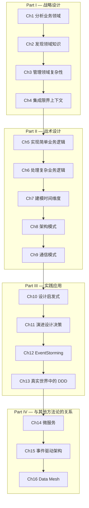

# 学习领域驱动设计

> **原书**：*Learning Domain-Driven Design: Aligning Software Architecture and Business Strategy* — Vlad Khononov (O'Reilly, 2022)
>
> **核心主张**：DDD 不只是技术方法论，而是将**软件架构与业务战略对齐**的系统思维框架。

---

## 全书章节地图

---

## 核心框架速查

### 子域分类（第1章）

| 类型 | 英文 | 特征 | 竞争优势 | 复杂度 | 变化频率 |
|------|------|------|----------|--------|----------|
| **核心子域** | Core | 公司的秘密武器 | ✅ 高 | 高 | 频繁 |
| **通用子域** | Generic | 所有公司都需要 | ❌ 无 | 高 | 低 |
| **支撑子域** | Supporting | 支持核心业务 | ❌ 无 | 低 | 低 |

### 限界上下文集成模式（第4章）

| 模式 | 英文 | 关系类型 | 说明 |
|------|------|----------|------|
| **合作关系** | Partnership | 合作 | 两个团队共同协调 |
| **共享内核** | Shared Kernel | 合作 | 共享部分模型 |
| **遵从者** | Conformist | 客户-供应商 | 下游遵从上游模型 |
| **防腐层** | Anticorruption Layer | 客户-供应商 | 下游翻译上游模型 |
| **开放主机服务** | Open-Host Service | 客户-供应商 | 上游提供公共协议 |
| **各行其道** | Separate Ways | 独立 | 不集成 |

### 业务逻辑实现模式（第5-7章）

| 模式 | 适用子域 | 复杂度 |
|------|----------|--------|
| **事务脚本** | 支撑子域（ETL/简单CRUD） | 低 |
| **活动记录** | 支撑子域（有简单逻辑） | 中低 |
| **领域模型** | 核心子域 | 高 |
| **事件溯源领域模型** | 核心子域（需要审计/时间维度） | 最高 |

### 架构模式（第8章）

| 模式 | 英文 | 适用场景 |
|------|------|----------|
| **分层架构** | Layered Architecture | 活动记录、事务脚本 |
| **端口与适配器** | Ports & Adapters | 领域模型 |
| **CQRS** | Command-Query Responsibility Segregation | 事件溯源、读写分离 |

---

## 目录

### Part I：战略设计（Strategic Design）

| 章节 | 核心内容 | 链接 |
|------|---------|------|
| 第1章 | 业务领域、子域类型（核心/通用/支撑）、子域边界识别 | [→ 阅读](part1/ch01-analyzing-business-domains.md) |
| 第2章 | 统一语言、知识发现、业务领域建模 | [→ 阅读](part1/ch02-discovering-domain-knowledge.md) |
| 第3章 | 限界上下文、模型边界、物理与所有权边界 | [→ 阅读](part1/ch03-managing-domain-complexity.md) |
| 第4章 | 上下文集成模式、上下文映射图 | [→ 阅读](part1/ch04-integrating-bounded-contexts.md) |

### Part II：战术设计（Tactical Design）

| 章节 | 核心内容 | 链接 |
|------|---------|------|
| 第5章 | 事务脚本、活动记录 | [→ 阅读](part2/ch05-implementing-simple-business-logic.md) |
| 第6章 | 领域模型、值对象、实体、聚合、领域事件、领域服务 | [→ 阅读](part2/ch06-tackling-complex-business-logic.md) |
| 第7章 | 事件溯源、事件存储、投影 | [→ 阅读](part2/ch07-modeling-dimension-of-time.md) |
| 第8章 | 分层架构、端口与适配器、CQRS | [→ 阅读](part2/ch08-architectural-patterns.md) |
| 第9章 | 模型翻译、Outbox、Saga、流程管理器 | [→ 阅读](part2/ch09-communication-patterns.md) |

### Part III：实践应用（Applying DDD in Practice）

| 章节 | 核心内容 | 链接 |
|------|---------|------|
| 第10章 | 设计启发式、战术设计决策树 | [→ 阅读](part3/ch10-design-heuristics.md) |
| 第11章 | 子域演进、模式迁移、组织变更 | [→ 阅读](part3/ch11-evolving-design-decisions.md) |
| 第12章 | EventStorming 工作坊流程与实践 | [→ 阅读](part3/ch12-eventstorming.md) |
| 第13章 | 遗留系统现代化、务实的 DDD 落地策略 | [→ 阅读](part3/ch13-ddd-in-real-world.md) |

### Part IV：与其他方法论的关系（Relationships to Other Methodologies）

| 章节 | 核心内容 | 链接 |
|------|---------|------|
| 第14章 | 微服务边界设计、DDD 与微服务的关系 | [→ 阅读](part4/ch14-microservices.md) |
| 第15章 | 事件类型、事件驱动集成设计 | [→ 阅读](part4/ch15-event-driven-architecture.md) |
| 第16章 | 分析数据模型、数据仓库、Data Mesh | [→ 阅读](part4/ch16-data-mesh.md) |

---

## 关键术语表

| 术语 | 英文 | 定义 |
|------|------|------|
| **业务领域** | Business Domain | 公司的主要活动领域 |
| **子域** | Subdomain | 业务领域中的一个独立问题空间 |
| **限界上下文** | Bounded Context | 统一语言的一致性边界 |
| **统一语言** | Ubiquitous Language | 团队共享的精确业务术语 |
| **上下文映射图** | Context Map | 限界上下文之间关系的全局视图 |
| **聚合** | Aggregate | 数据一致性边界，事务的基本单位 |
| **值对象** | Value Object | 通过属性值标识的不可变对象 |
| **实体** | Entity | 通过唯一标识区分的可变对象 |
| **领域事件** | Domain Event | 领域中已发生的重要事实 |
| **事件溯源** | Event Sourcing | 用事件序列而非当前状态来持久化聚合 |
| **CQRS** | Command-Query Responsibility Segregation | 读写模型分离 |
| **防腐层** | Anticorruption Layer | 翻译外部模型的保护层 |
| **Saga** | Saga | 跨聚合/服务的最终一致性编排 |
| **流程管理器** | Process Manager | 有状态的跨聚合业务流程协调 |

---

*基于 Vlad Khononov《Learning Domain-Driven Design》(O'Reilly, 2022) 全书翻译*
