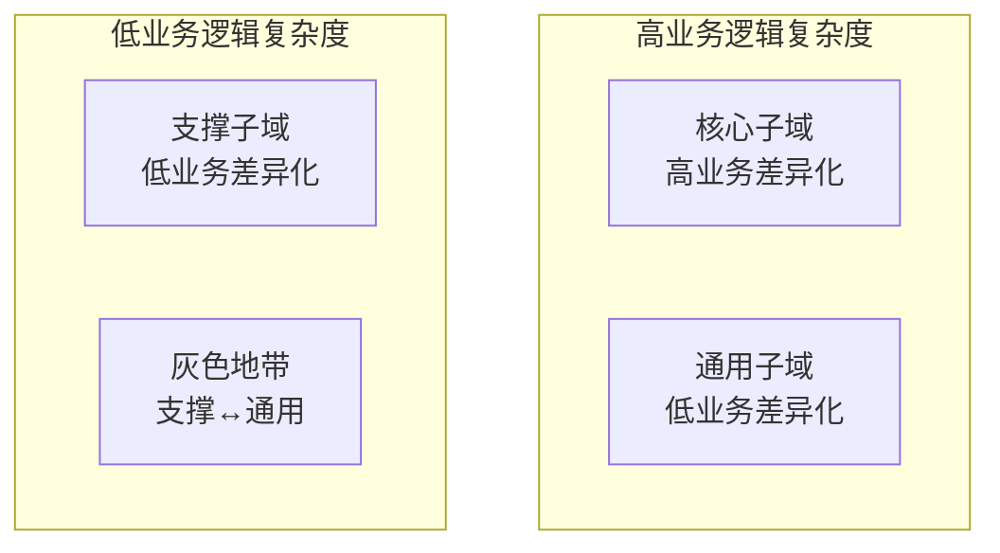
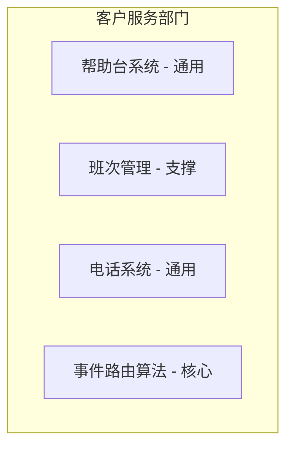
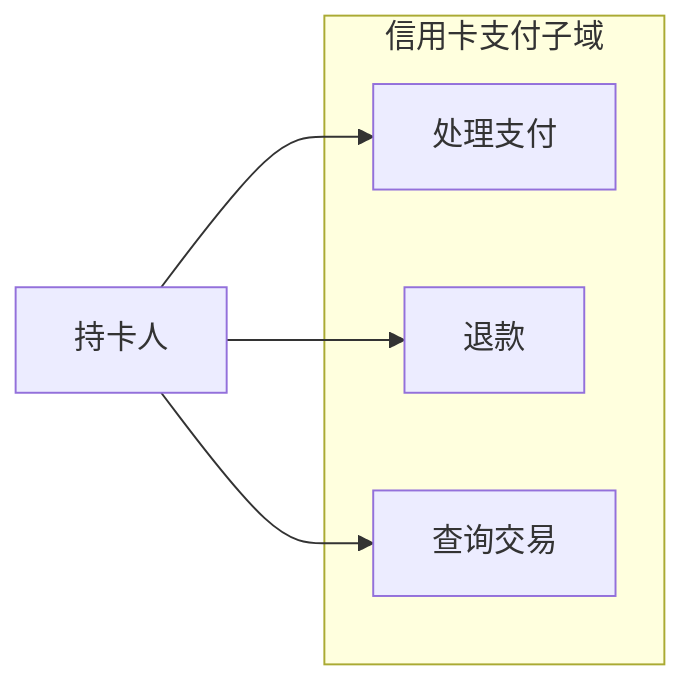
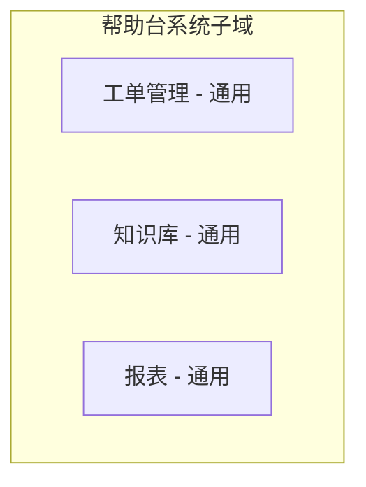

# 第1章：分析业务领域

> 本章介绍领域驱动设计（Domain-Driven Design, DDD）中用于分析公司业务领域的工具：业务领域与子域的概念、三种子域类型（核心、通用、支撑）及其差异、如何识别子域边界，以及两个虚构公司的领域分析示例（Gigmaster、BusVNext）。最后讨论领域专家（Domain Expert）的角色。

---

如果你和我一样，你一定热爱写代码：解决复杂问题、构思优雅方案、通过精心设计规则、结构和行为来构建全新的世界。我相信这正是你对领域驱动设计（DDD）感兴趣的原因——你想把这份手艺做得更好。然而，本章与写代码无关。在本章中，你将学习公司如何运作：它们为何存在、追求什么目标，以及实现这些目标的策略。

在我教授领域驱动设计课程时，许多学生会问：「我们需要学这些吗？我们是写软件的，不是经营企业的。」答案是肯定的。要设计并构建有效的解决方案，你必须理解问题本身。在我们这里，问题就是我们要构建的软件系统。要理解问题，你必须理解它所在的语境——组织的业务战略，以及它希望通过构建软件获得什么价值。

在本章中，你将学习领域驱动设计中用于分析公司业务领域及其结构的工具：核心子域、支撑子域和通用子域。这些内容是设计软件的基础。在后续章节中，你将学习这些概念如何以不同方式影响软件设计。

## 1.1 什么是业务领域？

::: tip 定义
业务领域（Business Domain）定义了公司的主要活动领域。一般而言，就是公司向客户提供的服务。

:::

例如：

- FedEx 提供快递配送服务。
- 星巴克（Starbucks）以咖啡闻名。
- 沃尔玛（Walmart）是最广为人知的零售企业之一。

一家公司可以在多个业务领域中运营。例如，亚马逊（Amazon）既提供零售服务，也提供云计算服务。优步（Uber）是一家拼车公司，同时也提供外卖和共享单车服务。

值得注意的是，公司可能会经常改变其业务领域。诺基亚（Nokia）就是一个典型例子：多年来，它涉足过木材加工、橡胶制造、电信和移动通信等截然不同的领域。

## 1.2 什么是子域？

为实现业务领域的目标，公司必须在多个子域（Subdomain）中运营。子域是业务活动的细粒度领域。公司所有子域的集合构成其业务领域——即它向客户提供的服务。

仅实现一个子域不足以让公司成功；它只是整个系统中的一块积木。子域之间必须相互协作，才能实现公司在业务领域中的目标。例如，星巴克虽然以咖啡闻名，但打造成功的连锁咖啡店需要的远不止会煮好咖啡。你还需要在合适的位置购买或租赁房产、招聘人员、管理财务等。这些子域单独哪一个都无法造就一家盈利的公司。它们加在一起，才是公司在业务领域中竞争所必需的。

## 1.3 子域的类型

正如软件系统由各种架构组件组成——数据库、前端应用、后端服务等——子域也具有不同的战略/业务价值。领域驱动设计区分三种子域类型：核心子域、通用子域和支撑子域。让我们从公司战略的角度看看它们有何不同。

### 1.3.1 核心子域

核心子域（Core Subdomain）是公司与竞争对手做法不同的部分。这可能涉及发明新产品或服务，或通过优化现有流程来降低成本。

以优步为例。最初，该公司提供了一种新颖的交通形式：拼车。随着竞争对手迎头赶上，优步找到了优化和演进其核心业务的方法：例如，通过匹配同向乘客来降低成本。

优步的核心子域直接影响其利润。这是公司区别于竞争对手的方式，是公司为客户提供更好服务和/或最大化盈利能力所采取的策略。为保持竞争优势，核心子域涉及发明、智能优化、业务专长或其他知识产权。

再举一例：谷歌搜索（Google Search）的排序算法。在本书写作时，谷歌的广告平台贡献了其大部分利润。尽管如此，Google Ads 不是一个子域，而是一个独立的业务领域，其下包含多个子域，此外还有云计算服务（Google Cloud Platform）、生产力与协作工具（Google Workspaces），以及 Alphabet（谷歌母公司）运营的其他领域。但谷歌搜索及其排序算法呢？虽然搜索引擎不是付费服务，但它为 Google Ads 提供了最大的展示平台。其提供优质搜索结果的能力驱动着流量，进而成为广告平台的重要组成部分。若因算法缺陷或竞争对手推出更好的搜索服务而导致搜索结果不佳，将损害广告业务的收入。因此，对谷歌而言，排序算法是核心子域。

**复杂度。** 一个容易实现的核心子域只能提供短暂的竞争优势。因此，核心子域天然具有复杂性。继续以优步为例，该公司不仅用拼车创造了新的市场空间，还通过有针对性地运用技术，颠覆了出租车行业这一存在数十年的单体架构。通过理解其业务领域，优步能够设计出更可靠、更透明的交通方式。公司的核心业务应有较高的进入壁垒；竞争对手应难以复制或模仿公司的解决方案。

**竞争优势的来源。** 值得注意的是，核心子域不一定是技术性的。并非所有业务问题都通过算法或其他技术方案解决。公司的竞争优势可以来自多种来源。

例如，设想一家在网上销售产品的珠宝商。网店很重要，但它不是核心子域。珠宝设计才是。公司可以使用现成的网店引擎，但无法将珠宝设计外包。设计是客户购买该珠宝商产品并记住品牌的原因。

再举一个更复杂的例子：设想一家专门从事人工欺诈检测的公司。公司培训分析师审查可疑文件并标记潜在的欺诈案件。你正在构建分析师使用的软件系统。这是核心子域吗？不是。核心子域是分析师所做的工作。你构建的系统与欺诈分析无关，它只是展示文档并记录分析师的评论。

**核心子域与核心领域**

核心子域也称为核心领域（Core Domain）。例如，在 Eric Evans 的领域驱动设计原著中，「核心子域」和「核心领域」可互换使用。尽管「核心领域」一词常用，我倾向于使用「核心子域」，原因如下：首先，它是子域，我倾向于避免与业务领域混淆；其次，正如你将在第 11 章学到的，子域随时间演进并改变类型并不罕见。例如，核心子域可能变成通用子域。因此，说「通用子域已演变为核心子域」比说「通用子域已演变为核心领域」更直观。

### 1.3.2 通用子域

通用子域（Generic Subdomain）是所有公司以相同方式执行的业务活动。与核心子域一样，通用子域通常复杂且难以实现。然而，通用子域不提供任何竞争优势。这里不需要创新或优化：经过实战检验的实现已广泛可用，所有公司都在使用。

例如，大多数系统需要对用户进行身份验证和授权。与其发明专有的认证机制，不如使用现有解决方案。这样的解决方案可能更可靠、更安全，因为它已经被许多有相同需求的公司测试过。

回到珠宝商在网上销售产品的例子，珠宝设计是核心子域，但网店是通用子域。使用与竞争对手相同的在线零售平台——相同的通用解决方案——不会影响珠宝商的竞争优势。

### 1.3.3 支撑子域

顾名思义，支撑子域（Supporting Subdomain）支撑公司的业务。然而，与核心子域相反，支撑子域不提供任何竞争优势。

例如，设想一家在线广告公司，其核心子域包括将广告与访客匹配、优化广告效果、最小化广告位成本。然而，要在这些领域取得成功，公司需要对其创意素材进行编目。公司存储和索引横幅、落地页等实体创意素材的方式不影响其利润。该领域没有什么可发明或优化的。另一方面，创意素材编目对于实现公司的广告管理和投放系统至关重要。这使得内容编目解决方案成为公司的支撑子域之一。

支撑子域的显著特征是解决方案业务逻辑的复杂度。支撑子域是简单的。其业务逻辑主要类似于数据录入界面和 ETL（提取、转换、加载）操作，即所谓的 CRUD（创建、读取、更新、删除）接口。这些活动领域不提供任何竞争优势，因此不需要高进入壁垒。

## 1.4 子域的比较

现在我们对三种业务子域类型有了更深入的理解，让我们从更多角度探讨它们的差异，以及它们如何影响战略性的软件设计决策。

### 1.4.1 竞争优势

只有核心子域能为公司提供竞争优势。核心子域是公司区别于竞争对手的策略。

通用子域按定义不能成为任何竞争优势的来源。它们是通用解决方案——公司与竞争对手使用的相同解决方案。

支撑子域进入壁垒低，也无法提供竞争优势。通常，公司不会介意竞争对手复制其支撑子域——这不会影响其在行业中的竞争力。相反，从战略上讲，公司更希望其支撑子域是通用的现成解决方案，从而无需设计和构建其实现。你将在第 11 章详细了解支撑子域转变为通用子域等情况，以及其他可能的演变。附录 A 将概述此类场景的真实案例研究。

公司能够解决的复杂问题越多，它能提供的业务价值就越大。复杂问题不仅限于向消费者提供服务。例如，复杂问题可以是使业务更优化、更高效。例如，以与竞争对手相同的服务水平但以更低的运营成本提供服务，也是一种竞争优势。

### 1.4.2 复杂度

从更技术的角度看，识别组织的子域很重要，因为不同类型的子域具有不同的复杂度。在设计软件时，我们必须选择能够适应业务需求复杂度的工具和技术。因此，识别子域对于设计合理的软件解决方案至关重要。

支撑子域的业务逻辑是简单的。这些是基本的 ETL 操作和 CRUD 接口，业务逻辑显而易见。通常，它不会超出验证输入或将数据从一种结构转换为另一种结构。

通用子域要复杂得多。其他人已经投入时间和精力解决这些问题，一定有充分的理由。这些解决方案既不简单也不琐碎。例如，考虑加密算法或认证机制。

从知识可获得性的角度看，通用子域是「已知的未知」。这些是你知道自己不知道的事情。此外，这些知识唾手可得。你可以使用行业公认的最佳实践，或者如有需要，聘请该领域的顾问来帮助设计定制解决方案。

核心子域是复杂的。它们应尽可能难以被竞争对手复制——公司的盈利能力取决于此。这就是为什么从战略上讲，公司寻求将复杂问题作为其核心子域来解决。

有时，区分核心子域和支撑子域可能具有挑战性。复杂度是一个有用的指导原则。问问自己：所讨论的子域能否变成一门副业？有人会单独为它付费吗？如果是，这就是核心子域。类似的推理适用于区分支撑子域和通用子域：自己实现是否比集成外部实现更简单、更便宜？如果是，这就是支撑子域。

从更技术的角度看，识别其复杂度将影响软件设计的核心子域很重要。如前所述，核心子域不一定与软件相关。识别与软件相关的核心子域的另一个有用指导原则是评估你将在代码中建模和实现的业务逻辑的复杂度。业务逻辑是类似于数据录入的 CRUD 接口，还是你必须实现由复杂业务规则和不变量编排的复杂算法或业务流程？前者是支撑子域的迹象，后者是典型的核心子域。

*图 1.1* 展示了三种子域类型在业务差异化与业务逻辑复杂度方面的关系。支撑子域与通用子域的交集是灰色地带：可能偏向任一方。若支撑子域的功能存在通用解决方案，最终的子域类型取决于集成通用解决方案是否比从零实现该功能更简单和/或更便宜。

*图 1.1 三种子域类型的业务差异化与业务逻辑复杂度*

### 1.4.3 易变性

如前所述，核心子域可能经常变化。如果一个问题第一次尝试就能解决，它可能不是好的竞争优势——竞争对手会很快赶上。因此，核心子域的解决方案是涌现式的。需要尝试不同的实现、改进和优化。此外，核心子域的工作永无止境。公司不断创新和演进核心子域。变化的形式包括添加新功能或优化现有功能。无论哪种方式，核心子域的持续演进对于公司保持领先于竞争对手至关重要。

与核心子域相反，支撑子域不常变化。它们不提供任何竞争优势，因此支撑子域的演进与投入核心子域的相同努力相比，提供的业务价值微乎其微。

尽管已有现成解决方案，通用子域也可能随时间变化。变化可能以安全补丁、错误修复或针对通用问题的全新解决方案的形式出现。

### 1.4.4 解决方案策略

核心子域赋予公司与行业中其他参与者竞争的能力。这是一项业务关键职责，但这是否意味着支撑子域和通用子域不重要？当然不是。所有子域都是公司在业务领域中运作所必需的。子域就像基础积木：拿走一块，整个结构可能崩塌。

也就是说，我们可以利用不同类型子域的固有属性，选择实现策略，以最有效的方式实现每种类型的子域。

核心子域必须在内部实现。它们不能被购买或采用；那会削弱竞争优势的概念，因为公司的竞争对手也能做同样的事。

将核心子域的实现外包也是不明智的。这是一项战略投资。在核心子域上偷工减料不仅在短期内具有风险，长期来看还可能带来致命后果：例如，无法支持公司目标和宗旨的难以维护的代码库。组织最有才华的人才应被分配从事核心子域的工作。此外，在内部实现核心子域使公司能够更快地做出更改和演进解决方案，从而在更短时间内建立竞争优势。

由于核心子域的需求预计会经常且持续变化，解决方案必须可维护且易于演进。因此，核心子域需要采用最先进的工程技术实现。

由于通用子域是困难但已解决的问题，购买现成产品或采用开源解决方案比投入时间和精力在内部实现通用子域更具成本效益。

缺乏竞争优势使得避免在内部实现支撑子域是合理的。然而，与通用子域不同，没有现成的解决方案可用。因此，公司别无选择，只能自己实现支撑子域。也就是说，业务逻辑的简单性和变化的低频性使得偷工减料变得容易。

支撑子域不需要复杂的设计模式或其他高级工程技术。快速应用开发框架足以实现业务逻辑，而不会引入意外复杂性。

从人员配置的角度看，支撑子域不需要高技能的技术能力，为培养新兴人才提供了很好的机会。把团队中擅长应对复杂挑战的工程师留给核心子域。最后，业务逻辑的简单性使支撑子域成为外包的良好候选。

下表总结了三种子域类型在各方面之间的差异。

| 子域类型 | 竞争优势 | 复杂度 | 易变性 | 实现方式 | 问题性质 |
|----------|----------|--------|--------|----------|----------|
| 核心 | 是 | 高 | 高 | 内部实现 | 有趣 |
| 通用 | 否 | 高 | 低 | 购买/采用 | 已解决 |
| 支撑 | 否 | 低 | 低 | 内部/外包 | 显而易见 |

*表 1.1 三种子域类型之间的差异*

## 1.5 识别子域边界

正如你已经看到的，识别子域及其类型可以极大地帮助在构建软件解决方案时做出不同的设计决策。在后续章节中，你将学习更多利用子域简化软件设计过程的方法。但我们如何实际识别子域及其边界？

子域及其类型由公司的业务战略定义：其业务领域以及它如何区别于同领域其他公司进行竞争。在绝大多数软件项目中，子域以某种方式「已经存在」。然而，这并不意味着识别其边界总是容易和直接的。如果你向 CEO 索要公司子域列表，你可能会得到茫然的目光。他们不了解这个概念。因此，你必须自己进行领域分析，以识别和分类所涉及的子域。

一个很好的起点是公司的部门和其他组织单位。例如，在线零售店可能包括仓库、客户服务、拣货、配送、质量控制和渠道管理等部门。然而，这些是相对粗粒度的活动领域。以客户服务部门为例。可以合理假设它是支撑子域，甚至是通用子域，因为该功能通常外包给第三方供应商。但这些信息是否足以让我们做出合理的软件设计决策？

### 1.5.1 提炼子域

粗粒度的子域是一个好的起点，但细节决定成败。我们必须确保不会遗漏隐藏在业务功能细节中的重要信息。

让我们回到客户服务部门的例子。如果我们调查其内部运作，我们会看到典型的客户服务部门由更细粒度的组件组成，例如帮助台系统、班次管理和排班、电话系统等。当作为单独的子域看待时，这些活动可能属于不同类型：帮助台和电话系统是通用子域，班次管理是支撑子域，而公司可能开发其巧妙的算法，将事件路由给过去在类似案例中取得成功的座席。该路由算法需要分析传入案例并识别过去经验中的相似性——这两者都是非平凡任务。由于该路由算法使公司能够提供比竞争对手更好的客户体验，路由算法是核心子域。此示例在*图 1.2* 中展示。

*图 1.2 分析疑似通用子域的内部运作，发现细粒度的核心子域、支撑子域和两个通用子域*

另一方面，我们不能无限深入，在越来越低的粒度级别寻找洞察。何时应该停止？

### 1.5.2 子域作为连贯的用例集

从技术角度看，子域类似于一组相互关联、连贯的用例（Use Case）的集合。这样的用例集通常涉及相同的参与者、业务实体，并且它们都操作一组密切相关的数据。

考虑*图 1.3* 中所示的信用卡支付网关的用例图。用例通过它们处理的数据和涉及的参与者紧密绑定。因此，所有用例形成信用卡支付子域。

我们可以将「子域作为连贯用例集」的定义作为何时停止寻找更细粒度子域的指导原则。这些是子域最精确的边界。

*图 1.3 信用卡支付子域的用例图*

你是否应该始终努力识别如此精准的子域边界？对核心子域来说，这绝对是必要的。核心子域最重要、最易变、最复杂。我们必须尽可能提炼它们，因为这将使我们能够提取所有通用和支撑功能，并将精力集中在更聚焦的功能上。

对支撑子域和通用子域，提炼可以稍微放松。如果进一步深入不能揭示任何有助于你做出软件设计决策的新洞察，那可能是一个好的停止点。例如，当所有更细粒度的子域与原子域类型相同时，就会发生这种情况。考虑*图 1.4* 中的例子。进一步提炼帮助台系统子域用处不大，因为它没有揭示任何战略信息，将使用粗粒度的现成工具作为解决方案。

*图 1.4 提炼帮助台系统子域，揭示通用内部组件*

在识别子域时需要考虑的另一个重要问题是：我们是否需要所有这些子域？

### 1.5.3 聚焦本质

子域是简化软件设计决策过程的工具。所有组织可能都有相当多的业务功能驱动其竞争优势，但与软件无关。本章前面讨论的珠宝商只是一个例子。

在寻找子域时，重要的是识别与软件无关的业务功能，承认它们如此，并专注于与你正在开发的软件系统相关的业务方面。

## 1.6 领域分析示例

让我们看看如何在实际中应用子域的概念，并用它做出若干战略性设计决策。我将描述两家虚构公司：Gigmaster 和 BusVNext。作为练习，在阅读时分析这两家公司的业务领域。尝试为每家公司识别三种类型的子域。请记住，正如在现实生活中一样，一些业务需求是隐含的。

::: info 免责声明
当然，我们无法通过阅读如此简短的描述来识别每个业务领域所涉及的所有子域。也就是说，这足以训练你识别和分类可用的子域。

:::

### 1.6.1 Gigmaster

Gigmaster 是一家票务销售和分销公司。其移动应用分析用户的音乐库、流媒体服务账户和社交媒体资料，以识别用户可能有兴趣参加的附近演出。

Gigmaster 的用户注重隐私。因此，所有用户的个人信息都被加密。此外，为确保用户的「罪恶快感」在任何情况下都不会泄露，公司的推荐算法仅在匿名数据上工作。

为了改进应用的推荐，实现了一个新模块。它允许用户记录他们过去参加的演出，即使门票不是通过 Gigmaster 购买的。

**业务领域与子域**

Gigmaster 的业务领域是票务销售。这是它向客户提供的服务。

**核心子域。** Gigmaster 的主要竞争优势是其推荐引擎。公司还认真对待用户隐私，仅在匿名数据上工作。最后，虽然未明确提及，我们可以推断移动应用的用户体验也至关重要。因此，Gigmaster 的核心子域是：

- 推荐引擎
- 数据匿名化
- 移动应用

**通用子域。** 我们可以识别和推断以下通用子域：

- 加密，用于加密所有数据
- 会计，因为公司从事销售业务
- 清算，用于向客户收费
- 身份验证和授权，用于识别用户

**支撑子域。** 最后，以下是支撑子域。这里的业务逻辑简单，类似于 ETL 流程或 CRUD 接口：

- 与音乐流媒体服务的集成
- 与社交网络的集成
- 已参加演出模块

**设计决策**

了解所涉及的子域及其类型之间的差异，我们即可做出若干战略性设计决策：

- 推荐引擎、数据匿名化和移动应用必须在内部使用最先进的工程工具和技术实现。这些模块将最常变化。
- 数据加密、会计、清算和身份验证应使用现成的或开源解决方案。
- 与流媒体服务和社交网络的集成，以及已参加演出模块，可以外包。

### 1.6.2 BusVNext

BusVNext 是一家公共交通公司。它旨在为客户提供像打车一样舒适的巴士出行。公司在主要城市管理巴士车队。

BusVNext 的客户可以通过移动应用预订行程。在预定出发时间，附近巴士的路线将即时调整，以在指定出发时间接载客户。

公司的主要挑战是实现路由算法。其需求是「旅行商问题」（Travelling Salesman Problem）的一个变体。路由逻辑不断调整和优化。例如，统计显示取消行程的主要原因是等待巴士到达的时间过长。因此，公司调整了路由算法，优先考虑快速接客，即使这意味着延迟送达。为了进一步优化路由，BusVNext 与第三方提供商集成，获取交通状况和实时警报。

BusVNext 不时发放特别折扣，既吸引新客户，又平衡高峰和非高峰时段的出行需求。

**业务领域与子域**

BusVNext 向客户提供优化的巴士出行。业务领域是公共交通。

**核心子域。** BusVNext 的主要竞争优势是其路由算法，它尝试解决一个复杂问题（「旅行商问题」），同时优先考虑不同的业务目标：例如，减少接客时间，即使这会增加整体行程长度。

我们还看到，行程数据不断被分析，以获取客户行为的新洞察。这些洞察使公司能够通过优化路由算法来增加利润。最后，BusVNext 面向客户和司机的应用必须易于使用并提供便捷的用户界面。

管理车队并非易事。巴士可能遇到技术问题或需要维护。忽视这些可能导致财务损失和服务水平下降。因此，BusVNext 的核心子域是：

- 路由
- 分析
- 移动应用用户体验
- 车队管理

**通用子域。** 路由算法还使用第三方公司提供的交通数据和警报——一个通用子域。此外，BusVNext 接受客户付款，因此必须实现会计和清算功能。BusVNext 的通用子域是：

- 交通状况
- 会计
- 账单
- 授权

**支撑子域。** 管理促销和折扣的模块支撑公司的核心业务。也就是说，它本身不是核心子域。其管理界面类似于管理有效优惠券代码的简单 CRUD 接口。因此，这是典型的支撑子域。

**设计决策**

了解所涉及的子域及其类型之间的差异，我们即可做出若干战略性设计决策：

- 路由算法、数据分析、车队管理和应用可用性必须在内部使用最精细的技术工具和模式实现。
- 促销管理模块的实现可以外包。
- 识别交通状况、授权用户以及管理财务记录和交易可以委托给外部服务提供商。

## 1.7 谁是领域专家？

现在我们对业务领域和子域有了清晰的理解，让我们看看我们将在后续章节中经常使用的另一个 DDD 术语：领域专家（Domain Expert）。领域专家是了解我们将要在代码中建模和实现的业务所有细节的主题专家。换句话说，领域专家是软件业务领域的知识权威。

领域专家既不是收集需求的分析师，也不是设计系统的工程师。领域专家代表业务。他们是首先识别业务问题的人，所有业务知识都源自他们。系统分析师和工程师正在将他们对业务领域的心理模型转化为软件需求和源代码。

经验法则：领域专家通常是提出需求的人或软件的最终用户。软件旨在解决他们的问题。

领域专家的专长可以有不同的范围。一些主题专家对整个业务领域的运作有详细的理解，而另一些则专注于特定的子域。例如，在一家在线广告代理公司，领域专家将是活动经理、媒体采购、分析师和其他业务利益相关者。

## 本章小结

在本章中，我们介绍了领域驱动设计中用于理解公司业务活动的工具。如你所见，一切都从业务领域开始：业务运营的领域以及它向客户提供的服务。

你还学习了在业务领域中取得成功并区别于竞争对手所需的不同构建块：

**核心子域**——有趣的问题。这些是公司与竞争对手做法不同、并从中获得竞争优势的活动。

**通用子域**——已解决的问题。这些是所有公司以相同方式做的事情。这里没有创新空间或需求；与其创建内部实现，使用现有解决方案更具成本效益。

**支撑子域**——解决方案显而易见的问题。这些是公司可能必须在内部实现但不提供任何竞争优势的活动。

最后，你了解到领域专家是业务的主题专家。他们对公司的业务领域或其一个或多个子域有深入的了解，对项目的成功至关重要。

---

## 练习

1. 以下哪种子域不提供竞争优势？
   - a. 核心
   - b. 通用
   - c. 支撑
   - d. B 和 C

2. 对于哪种子域，所有竞争对手可能使用相同的解决方案？
   - a. 核心
   - b. 通用
   - c. 支撑
   - d. 以上都不是。公司应始终区别于竞争对手。

3. 哪种子域预计变化最频繁？
   - a. 核心
   - b. 通用
   - c. 支撑
   - d. 不同子域类型的易变性没有差异。

考虑 WolfDesk 的描述（见前言），一家提供帮助台工单管理系统的公司：

::: tip 示例领域：WolfDesk（摘自前言）
WolfDesk 以服务形式提供帮助台工单管理系统。如果你的初创公司需要为客户提供支持，使用 WolfDesk 的解决方案，你可以快速上手。

WolfDesk 使用与竞争对手不同的付费模式。它不是按用户收费，而是允许租户根据需要设置任意数量的用户，租户按计费周期内打开的工单数量收费。没有最低费用，对于每月工单的某些阈值有自动批量折扣：超过 500 张工单 10%，超过 750 张 20%，超过 1,000 张 30%。

为防止租户滥用商业模式，WolfDesk 的工单生命周期算法确保不活跃的工单自动关闭，鼓励客户在需要进一步支持时打开新工单。此外，WolfDesk 实现了欺诈检测系统，分析消息并检测同一工单中讨论不相关主题的情况。

为帮助租户简化支持相关工作，WolfDesk 实现了「支持自动驾驶」功能。自动驾驶分析新工单并尝试从租户的工单历史中自动找到匹配的解决方案。该功能可以进一步缩短工单生命周期，鼓励客户为进一步的问题打开新工单。

WolfDesk 采用所有安全标准和措施对租户用户进行身份验证和授权，还允许租户配置与其现有用户管理系统的单点登录（SSO）。

管理界面允许租户配置工单类别的可能值，以及租户支持的产品列表。

为了能够仅在支持座席的工作时间内将新工单路由给租户的支持座席，WolfDesk 允许输入每个座席的班次安排。

由于 WolfDesk 以无最低费用提供服务，它必须优化其基础设施，以最小化新租户入驻（onboarding）的成本。为此，WolfDesk 利用无服务器计算，使其能够根据活跃工单上的操作弹性扩展计算资源。

:::

4. WolfDesk 的业务领域是什么？

5. WolfDesk 的核心子域是什么？

6. WolfDesk 的支撑子域是什么？

7. WolfDesk 的通用子域是什么？

---

[← 返回目录](../index.md) | [下一章：发现领域知识 →](ch02-discovering-domain-knowledge.md)
