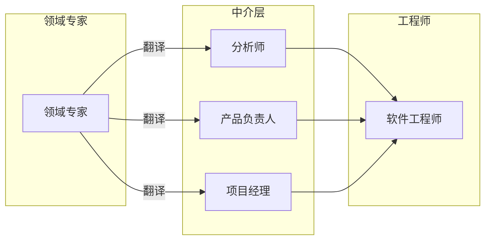

# 第2章：发现领域知识

> 本章聚焦于子域内部：其业务功能与逻辑。你将学习领域驱动设计（Domain-Driven Design, DDD）中用于有效沟通与知识共享的工具：通用语言（Ubiquitous Language）。本章将用它来理解业务领域的复杂性，后续章节将用它来建模并在软件中实现业务逻辑。涵盖主题：业务问题、知识发现、沟通、通用语言、业务语言、场景、一致性、业务领域模型、有效建模、持续努力、工具与挑战。

> 上线的是开发者的（错误）理解，而非领域专家的知识。
> —Alberto Brandolini

---

在上一章中，我们开始探索业务领域。你学会了如何识别公司的业务领域（即活动领域），并分析其在这些领域中的竞争策略，即业务子域的边界与类型。

本章继续探讨业务领域分析，但换了一个维度：深度。本章聚焦于子域内部发生的事：其业务功能与逻辑。你将学习领域驱动设计中用于有效沟通与知识共享的工具：通用语言。在此我们将用它来学习业务领域的复杂性，后续章节将用它来建模并在软件中实现业务逻辑。

## 2.1 业务问题

我们构建的软件系统是**业务问题**（Business Problems）的解决方案。在此语境下，「问题」一词不像数学题或谜语那样，解完就结束了。在业务领域语境中，「问题」的含义更广。业务问题可以是与优化工作流和流程、减少人工劳动、管理资源、支持决策、管理数据等相关的挑战。

业务问题既出现在业务领域层面，也出现在子域层面。公司的目标是为客户的问题提供解决方案。回到第 1 章中的 FedEx 例子，该公司的客户需要在有限时间内寄送包裹，因此它优化了配送流程。

子域是更细粒度的问题领域，其目标是为特定业务能力提供解决方案。知识管理子域优化信息的存储与检索流程。清算子域优化金融交易的执行流程。会计子域追踪公司的资金。

## 2.2 知识发现

要设计有效的软件解决方案，我们必须至少掌握业务领域的基本知识。如第 1 章所述，这些知识属于领域专家（Domain Expert）：他们的工作就是专精于并理解业务领域的所有复杂性。我们既不应、也无法成为领域专家。但我们必须理解领域专家，并使用他们使用的业务术语。

软件要有效，就必须模仿领域专家思考问题的方式——他们的心智模型（Mental Models）。若不了解业务问题及需求背后的推理，我们的解决方案将仅限于把业务需求「翻译」成源代码。如果需求遗漏了关键边界情况怎么办？或者未能描述某个业务概念，从而限制我们实现能支持未来需求的模型？

正如 Alberto Brandolini 所言，软件开发是一个学习过程；可运行的代码只是副产品。软件项目的成功取决于领域专家与软件工程师之间知识共享的有效性。我们必须理解问题才能解决它。

领域专家与软件工程师之间的有效知识共享需要有效沟通。让我们看看软件项目中阻碍有效沟通的常见因素。

## 2.3 沟通

可以说，几乎所有软件项目都需要不同角色利益相关者的协作：领域专家、产品负责人、工程师、UI/UX 设计师、项目经理、测试人员、分析师等。与任何协作工作一样，结果取决于各方协作的好坏。例如，所有利益相关者是否就正在解决的问题达成一致？他们正在构建的解决方案呢——他们对功能性和非功能性需求是否有相互冲突的假设？在所有项目相关事项上达成一致与对齐，对项目成功至关重要。

关于软件项目失败原因的研究表明，有效沟通对知识共享和项目成功至关重要。然而，尽管其重要性，有效沟通在软件项目中却很少被观察到。通常，业务人员与工程师之间没有直接互动。相反，领域知识从领域专家自上而下推送给工程师，通过扮演中介或「翻译」角色的人传递：系统/业务分析师、产品负责人和项目经理。这种常见的知识共享流程如下图所示。



*图 2-1：软件项目中的知识共享流程*

在传统软件开发生命周期中，领域知识被「翻译」成工程师友好的形式，即分析模型（Analysis Model），它描述的是系统需求，而非对背后业务领域的理解。尽管意图可能是好的，但这种中介对知识共享是有害的。任何翻译都会丢失信息；在这种情况下，解决业务问题所必需的领域知识在传递给软件工程师的途中丢失了。这还不是典型软件项目中唯一的翻译。分析模型被翻译成软件设计模型（软件设计文档），再被翻译成实现模型或源代码本身。文档往往很快过时。源代码被用来向后来维护项目的软件工程师传递业务领域知识。下图展示了领域知识实现到代码中所需的不同翻译。


*图 2-2：模型转换*

这种软件开发过程类似于儿童游戏「传话」：消息（即领域知识）往往会失真。信息导致软件工程师实现错误的解决方案，或正确的解决方案却针对错误的问题。无论哪种情况，结果都一样：失败的软件项目。

领域驱动设计提出了一种更好的方式，将知识从领域专家传递给软件工程师：使用通用语言。

### 2.3.1 什么是通用语言？

使用通用语言（Ubiquitous Language）是领域驱动设计的基石实践。想法简单直接：如果各方需要高效沟通，与其依赖翻译，不如说同一种语言。

尽管这一观念近乎常识，但正如伏尔泰所说，「常识并不那么常见」。传统软件开发生命周期隐含以下翻译：

- 领域知识 → 分析模型
- 分析模型 → 需求
- 需求 → 系统设计
- 系统设计 → 源代码

领域驱动设计不主张持续翻译领域知识，而是呼吁培育一种用于描述业务领域的单一语言：**通用语言**。

所有项目相关的利益相关者——软件工程师、产品负责人、领域专家、UI/UX 设计师——在描述业务领域时都应使用通用语言。最重要的是，领域专家在推理业务领域时必须能自如地使用通用语言；这种语言将同时代表业务领域和领域专家的心智模型。

只有通过持续使用通用语言及其术语，才能在项目所有利益相关者之间培育共同理解。

## 2.4 业务语言

必须强调，通用语言是**业务的语言**（Language of the Business）。因此，它应仅包含与业务领域相关的术语。不要使用技术行话！教业务领域专家单例和抽象工厂不是你的目标。通用语言旨在用易于理解的术语来框定领域专家对业务领域的理解和心智模型。

### 2.4.1 场景

假设我们正在开发广告活动管理系统。考虑以下陈述：

- 广告活动可以展示不同的创意素材。
- 只有当至少一个广告位处于活跃状态时，活动才能发布。
- 销售佣金在交易获批后入账。

以上陈述均以业务语言表述。也就是说，它们反映了领域专家对业务领域的看法。

另一方面，以下陈述纯属技术性，因此不符合通用语言的概念：

- 广告 iframe 显示 HTML 文件。
- 只有当活动在 active-placements 表中至少有一条关联记录时，才能发布。
- 销售佣金基于 transactions 表和 approved-sales 表中关联记录计算。

这些陈述纯属技术性，对领域专家来说不清晰。假设工程师只熟悉这种技术化、以解决方案为导向的业务领域视图，他们将无法完全理解业务逻辑或它为何如此运作，从而限制其建模和实现有效解决方案的能力。

## 2.5 一致性

通用语言必须精确且一致。它应消除对假设的需求，并使业务领域的逻辑显式化。

由于歧义阻碍沟通，通用语言的每个术语应只有一个且仅有一个含义。让我们看看不清晰术语的几个例子，以及如何改进。

### 2.5.1 歧义术语

假设在某个业务领域中，术语「政策」（policy）有多种含义：可以是监管规则，也可以是保险合同。具体含义可以在人与人互动中根据语境确定。然而，软件不善于处理歧义，在代码中建模「policy」实体可能既繁琐又具有挑战性。

通用语言要求每个术语有单一含义，因此「policy」应明确使用两个术语建模：**监管规则**（regulatory rule）和**保险合同**（insurance contract）。

### 2.5.2 同义术语

通用语言中不能使用两个可互换的术语。例如，许多系统使用术语「用户」（user）。然而，仔细审视领域专家的用语可能会发现，user 与其他术语被互换使用：例如 user、visitor、administrator、account 等。

同义术语起初可能看似无害。然而，在大多数情况下，它们表示不同的概念。在此例中，visitor 和 account 在技术上都是指系统的用户；然而，在大多数系统中，未注册用户和已注册用户代表不同的角色，具有不同的行为。例如，「访客」数据主要用于分析目的，而「账户」实际使用系统及其功能。

最好在每个特定语境中明确使用每个术语。理解所用术语之间的差异，有助于构建更简单、更清晰的业务领域实体模型和实现。

## 2.6 业务领域的模型

现在让我们从另一个视角看待通用语言：建模。

### 2.6.1 什么是模型？

::: tip 定义
模型（Model）是对事物或现象的简化表示，有意强调某些方面而忽略其他方面。带有特定用途的抽象。
—Rebecca Wirfs-Brock

:::

模型不是现实世界的复制品，而是帮助我们理解现实世界系统的人为构造。

模型的典型例子是地图。任何地图都是模型，包括导航图、地形图、世界地图、地铁图等，如下图所示。

```
+------------------+  +------------------+  +------------------+
|   道路/导航图     |  |   时区图          |  |   航海导航图      |
+------------------+  +------------------+  +------------------+
|   地形图          |  |   航空导航图      |  |   地铁线路图      |
+------------------+  +------------------+  +------------------+
```

*图 2-3：不同类型的地图展示地球的不同模型：道路、时区、航海导航、地形、航空导航、地铁线路*

这些地图中没有一张能呈现我们星球的所有细节。相反，每张地图只包含足够的数据来支持其特定目的：它要解决的问题。

### 2.6.2 有效建模

所有模型都有目的，有效模型只包含实现其目的所需的细节。例如，世界地图上不会显示地铁站。另一方面，你无法用地铁图估算距离。每张地图只包含它应该提供的信息。

这一点值得重申：有用的模型不是现实世界的复制品。相反，模型旨在解决问题，它应为此目的提供足够的信息。或者，正如统计学家 George Box 所言：「所有模型都是错的，但有些是有用的。」

本质上，模型是一种抽象。抽象的概念使我们能够通过省略不必要的细节、只保留解决手头问题所需的内容来处理复杂性。另一方面，无效的抽象会移除必要信息，或通过保留不需要的内容产生噪音。正如 Edsger W. Dijkstra 在其论文《谦逊的程序员》中所指出的，抽象的目的不是含糊其辞，而是创建一个新的语义层次，在其中可以做到绝对精确。

### 2.6.3 业务领域建模

在培育通用语言时，我们实际上是在构建业务领域的模型。该模型应捕捉领域专家的心智模型——他们关于业务如何运作以实现其功能的思维过程。模型必须反映所涉及的业务实体及其行为、因果关系和不变量。

我们使用的通用语言不必涵盖领域的每一个可能细节。那相当于让每个利益相关者都成为领域专家。相反，模型应只包含业务领域足够多的方面，以便能够实现所需系统；即解决软件旨在解决的具体问题。在后续章节中，你将看到通用语言如何驱动低层设计和实现决策。

工程团队与领域专家之间的有效沟通至关重要。这种沟通的重要性随业务领域的复杂性而增长。业务领域越复杂，在代码中建模和实现其业务逻辑就越难。即使对复杂业务领域或其基本原则有轻微误解，也会无意中导致容易产生严重缺陷的实现。验证对业务领域理解的唯一可靠方式，是与领域专家对话，并用他们理解的语言：业务的语言。

## 2.7 持续努力

通用语言的形成需要与其天然持有者——领域专家——的互动。只有与真正的领域专家互动，才能发现不准确、错误假设或对业务领域的整体错误理解。

所有利益相关者应在所有项目相关沟通中一致使用通用语言，以传播知识并培育对业务领域的共同理解。该语言应在整个项目中持续强化：需求、测试、文档，甚至源代码本身都应使用这种语言。

最重要的是，通用语言的培育是一个持续的过程。它应不断被验证和演进。语言的日常使用将随时间揭示对业务领域更深入的洞察。当这样的突破发生时，通用语言必须演进以跟上新获得的领域知识。

## 2.8 工具

有工具和技术可以减轻捕捉和管理通用语言的过程。

例如，Wiki 可用作词汇表来捕捉和记录通用语言。这样的词汇表可以简化新成员的入职流程，因为它是了解业务领域术语信息的首选去处。

重要的是让词汇表维护成为共同工作。当通用语言发生变化时，应鼓励所有团队成员主动更新词汇表。这与集中式方法相反，后者只有团队负责人或架构师负责维护词汇表。

尽管维护项目相关术语词汇表有明显优势，但它有固有的局限性。词汇表最适合「名词」：实体、流程、角色等的名称。虽然名词很重要，但捕捉行为至关重要。行为不仅仅是与名词相关的动词列表，而是实际的业务逻辑，包括其规则、假设和不变量。这些概念在词汇表中更难记录。因此，词汇表最好与其他更适合捕捉行为的工具配合使用；例如用例或 Gherkin 测试。

::: tip
但请不要陷入认为领域专家会编写 Gherkin 测试的陷阱。

:::

用 Gherkin 语言编写的自动化测试不仅是捕捉通用语言的绝佳工具，也是弥合领域专家与软件工程师之间鸿沟的额外工具。领域专家可以阅读测试并验证系统的预期行为。例如，以下是用 Gherkin 语言编写的测试：

```gherkin
Scenario: Notify the agent about a new support case
    Given Vincent Jules submits a new support case saying:
    """
    I need help configuring AWS Infinidash
    """
    When the ticket is assigned to Mr. Wolf
    Then the agent receives a notification about the new ticket
```

管理基于 Gherkin 的测试套件有时具有挑战性，尤其是在项目早期阶段。然而，对于复杂的业务领域，这绝对值得。

最后，甚至还有静态代码分析工具可以验证通用语言术语的使用。此类工具的一个著名例子是 NDepend。

虽然这些工具有用，但它们次于日常互动中通用语言的实际使用。用工具支持通用语言的管理，但不要指望文档能替代实际使用。正如敏捷宣言所说：「个体和互动胜过流程和工具。」

## 2.9 挑战

理论上，培育通用语言听起来像是一个简单直接的过程。实践中并非如此。收集领域知识的唯一可靠方式是与领域专家对话。通常，最重要的知识是隐性的。它未被记录或编码，只存在于领域专家的脑海中。获取它的唯一方式是提问。

随着你在此实践中积累经验，你会注意到，这一过程往往不仅仅是发现已经存在的知识，而是与领域专家共同创建模型。领域专家自己对业务领域的理解可能存在歧义甚至空白；例如，只定义「快乐路径」场景，而未考虑挑战既有假设的边界情况。此外，你可能会遇到缺乏明确定义的业务领域概念。询问业务领域的本质往往会使这类隐性冲突和空白显性化。这在核心子域中尤为常见。在这种情况下，学习过程是相互的——你正在帮助领域专家更好地理解他们的领域。

在向棕地项目（Brownfield Project）引入领域驱动设计实践时，你会注意到已经存在一种用于描述业务领域的既定语言，且利益相关者在使用它。然而，由于该语言并非由 DDD 原则驱动，它不一定能有效反映业务领域。例如，它可能使用技术术语，如数据库表名。改变一个已在组织中使用的语言并不容易。在这种情况下，关键工具是耐心。你需要在容易控制的地方确保使用正确的语言：在文档和源代码中。

最后，我在会议上经常被问到的关于通用语言的问题是：如果公司不在英语国家，我们应该使用什么语言？我的建议是至少用英语名词来命名业务领域的实体。这将有助于在代码中使用相同的术语。

## 本章小结

有效沟通和知识共享对软件项目成功至关重要。软件工程师必须理解业务领域，才能设计和构建软件解决方案。

领域驱动设计的通用语言是弥合领域专家与软件工程师之间知识鸿沟的有效工具。它通过培育一种可在整个项目中由所有利益相关者使用的共同语言——在对话、文档、测试、图表、源代码等中——来促进沟通和知识共享。

为确保有效沟通，通用语言必须消除歧义和隐性假设。语言的所有术语必须一致——无歧义术语，无同义术语。

培育通用语言是一个持续的过程。随着项目演进，将发现更多领域知识。重要的是让这些洞察反映在通用语言中。

Wiki 词汇表和 Gherkin 测试等工具可以大大减轻记录和维护通用语言的过程。然而，有效通用语言的主要前提是使用：该语言必须在所有项目相关沟通中一致使用。

---

## 练习题

1. 谁应该能够参与通用语言的定义？
   - a. 领域专家
   - b. 软件工程师
   - c. 最终用户
   - d. 项目所有利益相关者

2. 通用语言应在哪里使用？
   - a. 面对面对话
   - b. 文档
   - c. 代码
   - d. 以上全部

3. 请回顾前言中虚构的 WolfDesk 公司的描述。你能在描述中发现哪些业务领域术语？

4. 考虑你目前正在开发或过去开发过的软件项目：
   - a. 尝试想出你可以在与领域专家对话时使用的业务领域概念。
   - b. 尝试识别不一致术语的例子：具有不同含义的业务领域概念，或由不同术语表示的相同概念。
   - c. 你是否遇到过因沟通不畅导致的软件开发效率低下？

5. 假设你正在开发一个项目，你注意到来自不同组织单元的领域专家使用相同的术语（例如 policy）来描述业务领域的不相关概念。由此产生的通用语言基于领域专家的心智模型，但未能满足术语具有单一含义的要求。在继续下一章之前，你将如何解决这一难题？

---

[← 上一章：分析业务领域](ch01-analyzing-business-domains.md) | [返回目录](../index.md) | [下一章：管理领域复杂性 →](ch03-managing-domain-complexity.md)
