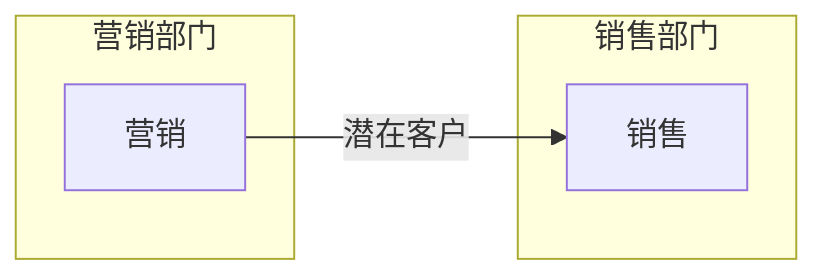
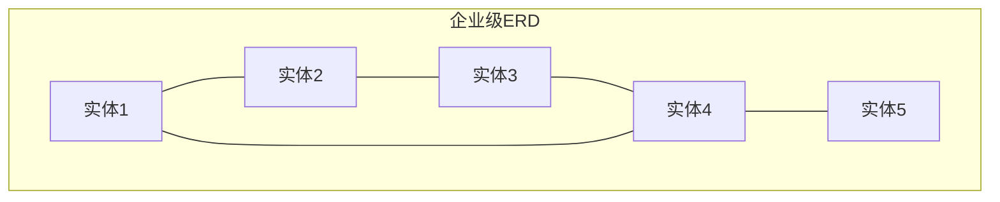
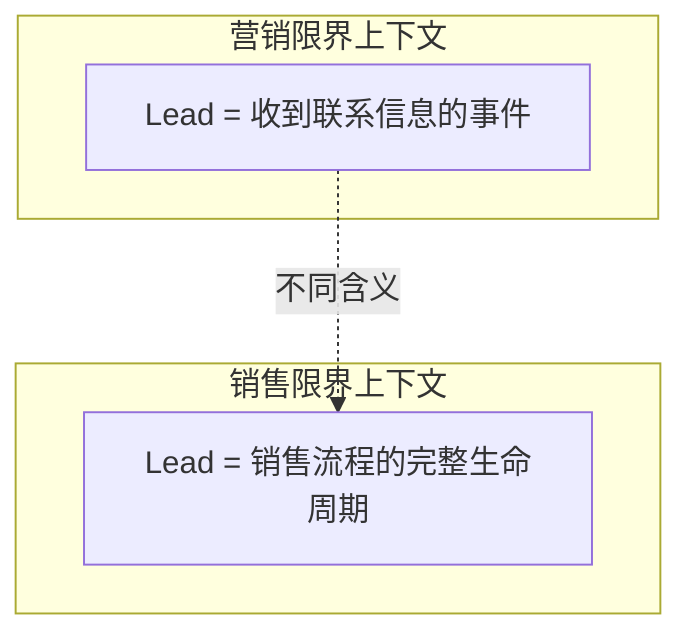
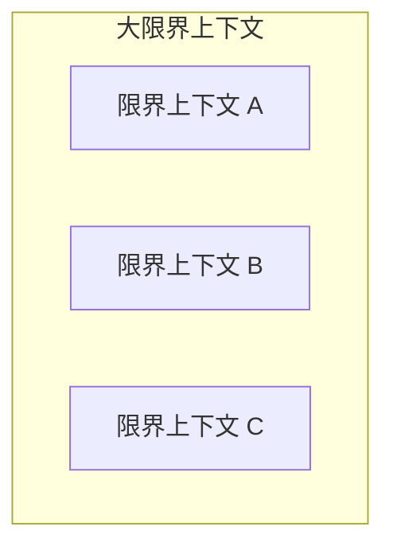
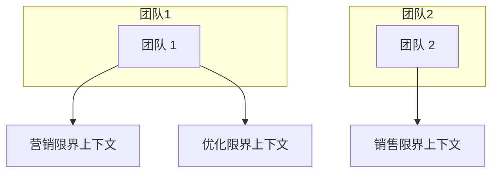
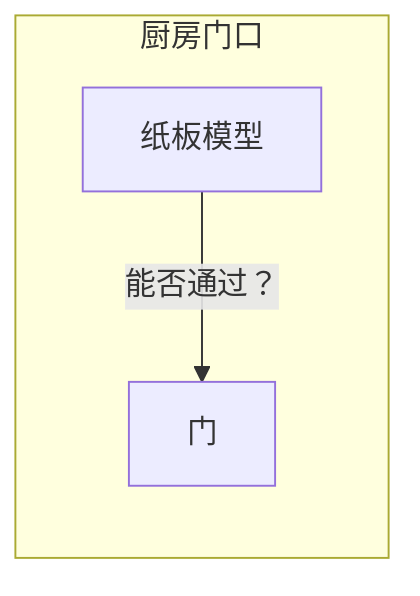

# 第3章：管理领域复杂性

> 本章探讨如何应对领域专家心智模型的不一致性。你将学习领域驱动设计（Domain-Driven Design, DDD）中的限界上下文（Bounded Context）模式：将通用语言拆分为多个更小的语言，并为每个语言划定明确的适用边界。涵盖主题：不一致模型、限界上下文、模型边界、通用语言精炼、范围、限界上下文与子域、物理与所有权边界、现实生活中的限界上下文（语义域、科学、购买冰箱）。

---

如上一章所述，要确保项目成功，关键在于开发一种可供所有利益相关者（从软件工程师到领域专家）用于沟通的通用语言。该语言应反映领域专家对业务领域内部运作与基本原则的心智模型（Mental Models）。

由于我们的目标是用通用语言驱动软件设计决策，该语言必须清晰且一致。它应避免歧义、隐含假设和无关细节。然而，在组织层面，领域专家的心智模型本身可能并不一致。不同的领域专家可能对同一业务领域持有不同的模型。让我们看一个例子。

## 3.1 不一致的模型

让我们回到第 2 章中的电话营销公司例子。该公司的营销部门通过在线广告获取潜在客户（leads）。销售部门负责向潜在客户推销产品或服务，这一链条如图 3-1 所示。

*图 3-1：示例业务领域：电话营销公司*

对领域专家语言的考察揭示了一个奇特的现象。术语「lead」（潜在客户）在营销部门和销售部门具有不同的含义：

**营销部门**

对营销人员而言，lead 表示有人对某产品感兴趣的通知。收到潜在客户联系信息这一事件即被视为 lead。

**销售部门**

在销售部门的语境中，lead 是一个复杂得多的实体。它代表整个销售流程的生命周期。它不仅是单一事件，而是一个长期运行的过程。

我们如何为这家电话营销公司制定通用语言？

一方面，我们知道通用语言必须一致——每个术语应只有一个含义。另一方面，我们知道通用语言必须反映领域专家的心智模型。在此案例中，「lead」的心智模型在销售和营销部门的领域专家之间并不一致。

这种歧义在人与人之间的沟通中并不构成太大挑战。诚然，不同部门之间的沟通可能更具挑战性，但人类很容易从交互的语境中推断出确切含义。

然而，在软件中表示这种业务领域的分歧模型（divergent model）则更为困难。源代码难以应对歧义。若将销售部门的复杂模型引入营销部门，会在不需要的地方引入复杂性——远超营销人员优化广告活动所需的细节与行为。但若按营销的世界观简化销售模型，又无法满足销售子域的需求，因为对管理和优化销售流程而言过于简单。前者会导致过度设计，后者会导致设计不足。

我们如何解决这一两难？

## 3.2 什么是限界上下文？

### 3.2.1 传统方案的问题

解决此问题的传统做法是设计一个可用于各类问题的单一模型。此类模型会产生横跨整面墙的巨大实体关系图（Entity Relationship Diagrams, ERD）。图 3-2 是一个有效的模型吗？

*图 3-2：企业级实体关系图*

正如俗语所说：「样样通，样样松。」此类模型本应适用于一切，但最终对任何场景都不够有效。无论你做什么，你始终面临复杂性：过滤无关细节的复杂性、找到所需内容的复杂性，以及最重要的——保持数据处于一致状态的复杂性。

另一种方案是给有问题的术语加上语境前缀：「marketing lead」和「sales lead」。这样可以在代码中实现两个模型。然而，这种方法有两个主要缺点。第一，它增加认知负担。何时应使用哪个模型？冲突模型的实现越接近，就越容易出错。第二，模型的实现将与通用语言不一致。没人会在对话中使用这些前缀。人们不需要这些额外信息；他们可以依赖对话的语境。

让我们转向领域驱动设计中应对此类场景的模式：限界上下文模式。

### 3.2.2 限界上下文模式

领域驱动设计中的解决方案很简单：将通用语言拆分为多个更小的语言，然后将每个语言分配给其可应用的显式语境：其限界上下文（Bounded Context）。

在前述例子中，我们可以识别出两个限界上下文：营销和销售。术语 lead 存在于两个限界上下文中，如图 3-3 所示。只要它在每个限界上下文中具有单一含义，每个细粒度的通用语言就是一致的，并遵循领域专家的心智模型。

*图 3-3：通过将通用语言拆分为限界上下文来应对不一致*

在某种意义上，术语冲突和隐含语境是任何体量尚可的业务的固有组成部分。通过限界上下文模式，这些语境被建模为业务领域的显式且不可或缺的一部分。

## 3.3 模型边界

如上一章所述，模型不是现实世界的复制品，而是帮助我们理解复杂系统的构造。它要解决的问题是模型固有的组成部分——其目的。模型不能没有边界而存在；否则它会扩展成现实世界的复制品。因此，定义模型的边界——其限界上下文——是建模过程的内在组成部分。

让我们回到地图作为模型的例子。我们看到每张地图都有其特定语境——航空、航海、地形、地铁等。地图仅在其特定目的的范围内才有用且一致。

正如地铁图对航海导航毫无用处，一个限界上下文中的通用语言可能对另一个限界上下文的范围完全无关。限界上下文定义了通用语言及其所代表模型的适用性。它们允许根据不同问题域定义不同的模型。换言之，限界上下文是通用语言的一致性边界。语言的术语、原则和业务规则仅在其限界上下文内部保持一致。

## 3.4 通用语言精炼

限界上下文使我们能够完善通用语言的定义。通用语言并非「无处不在」地应在整个组织中使用和应用。通用语言不是普适的。

相反，通用语言仅在其限界上下文的边界内无处不在。该语言专注于描述仅由限界上下文所涵盖的模型。正如模型不能脱离其要解决的问题而存在，通用语言也不能在没有其适用性的显式语境的情况下被定义或使用。

## 3.5 限界上下文的范围

### 3.5.1 边界的确定

本章开头的例子展示了业务领域的固有边界。不同的领域专家对同一业务实体持有冲突的心智模型。要建模业务领域，我们不得不拆分模型，并为每个细粒度模型定义严格的适用语境——其限界上下文。

通用语言的一致性仅有助于识别该语言的最宽边界。它不能更大，否则就会出现不一致的模型和术语。然而，我们仍可进一步将模型分解为更小的限界上下文，如图 3-4 所示。

*图 3-4：更小的限界上下文*

定义通用语言的范围——其限界上下文——是一项战略设计决策。边界可以较宽，遵循业务领域的固有语境，也可以较窄，进一步将业务领域划分为更小的问题域。

### 3.5.2 规模权衡

限界上下文的大小本身不是决定因素。模型不必大或小。模型需要有用。通用语言的边界越宽，保持其一致性就越困难。将大型通用语言拆分为更小、更易管理的问题域可能有益，但一味追求小限界上下文也可能适得其反。它们越小，设计引入的集成开销就越多。

因此，限界上下文应有多大取决于具体的问题域。有时使用较宽的边界会更清晰，有时进一步分解更有意义。

从较大限界上下文中提取更细粒度限界上下文的常见原因包括：组建新的软件工程团队，或解决系统的某些非功能性需求；例如，当你需要将原本位于单一限界上下文中的某些组件的开发生命周期分离时。另一个常见原因是能够独立于限界上下文其余功能对该功能进行扩展。

因此，保持模型有用，并使限界上下文的大小与业务需求和组织约束保持一致。需要注意的一点是，不要将连贯的功能拆分为多个限界上下文。这种拆分会阻碍每个上下文独立演进的能力。相反，相同的业务需求和变更将同时影响限界上下文，并需要同时部署变更。为避免这种低效的分解，使用第 1 章讨论的寻找子域的经验法则：识别对同一数据进行操作的连贯用例集，避免将它们分解为多个限界上下文。

我们将在第 8 章和第 10 章进一步讨论持续优化限界上下文边界的主题。

## 3.6 限界上下文与子域

在第 2 章中，我们看到业务领域由多个子域组成。本章到目前为止，我们探讨了将业务领域分解为一组细粒度问题域或限界上下文的概念。乍看之下，这两种分解业务领域的方法似乎冗余。然而，事实并非如此。让我们审视为何需要这两种边界。

### 3.6.1 子域

要理解公司的业务策略，我们必须分析其业务领域。根据领域驱动设计方法论，分析阶段涉及识别不同的子域（核心、支撑和通用）。这就是组织运作和规划其竞争策略的方式。

如第 1 章所学，子域类似于一组相互关联的用例。用例由业务领域和系统需求定义。作为软件工程师，我们不定义需求；那是业务的责任。相反，我们分析业务领域以识别子域。

### 3.6.2 限界上下文

另一方面，限界上下文是设计出来的。选择模型的边界是一项战略设计决策。我们决定如何将业务领域划分为更小、可管理的问题域。

### 3.6.3 子域与限界上下文的相互作用（interplay）

理论上（尽管不切实际），单一模型可以跨越整个业务领域。这种策略可能适用于小型系统，如图 3-5 所示。

*图 3-5：单体限界上下文*

当出现冲突模型时，我们可以遵循领域专家的心智模型，将系统分解为限界上下文，如图 3-6 所示。

*图 3-6：由通用语言一致性驱动的限界上下文*

如果模型仍然庞大且难以维护，我们可以将它们进一步分解为更小的限界上下文；例如，为每个子域设置一个限界上下文，如图 3-7 所示。

*图 3-7：与子域边界对齐的限界上下文*

无论哪种方式，这都是设计决策。我们将这些边界作为解决方案的一部分进行设计。

限界上下文与子域之间的一对一关系在某些场景下可能完全合理。但在其他场景下，不同的分解策略可能更合适。

::: info 例外说明
根据你所在的组织，你可能身兼两职，同时负责软件工程和业务开发。因此，你既有能力影响软件设计（限界上下文），也能影响业务策略（子域）。因此，在我们讨论的（限界）语境中，我们仅聚焦于软件工程。

:::

关键要记住：**子域是被发现的，限界上下文是被设计的**。子域由业务策略定义。然而，我们可以设计软件解决方案及其限界上下文，以应对具体项目的语境和约束。

最后，如第 1 章所学，模型旨在解决特定问题。在某些情况下，同时使用同一概念的多个模型来解决不同问题可能有益。正如不同类型的地图提供关于我们星球的不同类型信息，使用同一子域的不同模型来解决不同问题可能是合理的。将设计限制为限界上下文之间的一对一关系会抑制这种灵活性，并迫使我们在同一限界上下文中对子域使用单一模型。

## 3.7 边界

正如 Ruth Malan 所言，架构设计本质上关乎边界：

::: tip Ruth Malan
架构设计即系统设计。系统设计即语境设计——它本质上关乎边界（什么在内、什么在外、什么跨越、什么在之间流动），以及权衡。它重塑外部，正如它塑造内部。

:::

限界上下文模式是领域驱动设计中定义物理边界和所有权边界的工具。

### 3.7.1 物理边界

限界上下文不仅作为模型边界，也作为实现它们的系统的物理边界。每个限界上下文应作为独立的服务/项目实现，即它独立于其他限界上下文进行实现、演进和版本管理。

限界上下文之间清晰的物理边界使我们能够用最适合其需求的技术栈实现每个限界上下文。

如前所述，一个限界上下文可以包含多个子域。在这种情况下，限界上下文是物理边界，而其中的每个子域是逻辑边界。逻辑边界在不同编程语言中有不同名称：命名空间（namespaces）、模块（modules）或包（packages）。

### 3.7.2 所有权边界

研究表明，好篱笆确实造就好邻居。在软件项目中，我们可以利用模型边界——限界上下文——实现团队的和平共处。团队之间的工作划分是另一项可以利用限界上下文模式做出的战略决策。

一个限界上下文应仅由一个团队实现、演进和维护。没有两个团队可以在同一限界上下文上工作。这种隔离消除了团队可能对彼此模型做出的隐含假设。相反，他们必须明确定义用于集成其模型和系统的通信协议。

需要注意的是，团队与限界上下文之间的关系是单向的：一个限界上下文应仅由一个团队拥有。然而，一个团队可以拥有多个限界上下文，如图 3-8 所示。

*图 3-8：团队 1 负责营销和优化限界上下文，团队 2 负责销售限界上下文*

## 3.8 现实生活中的限界上下文

在我的一次领域驱动设计课程中，一位参与者曾指出：「你说 DDD 是关于将软件设计与业务领域对齐。但现实生活中的限界上下文在哪里？业务领域中没有限界上下文。」

诚然，限界上下文不如业务领域和子域那样显而易见，但它们确实存在，正如领域专家的心智模型一样。你只需有意识地关注领域专家如何思考不同的业务实体和流程。

我想通过讨论一些例子来结束本章，这些例子表明：不仅在软件中建模业务领域时存在限界上下文，在不同语境中使用不同模型的概念在日常生活中也普遍存在。

### 3.8.1 语义域

可以说，领域驱动设计的限界上下文基于词典学中的**语义域**（Semantic Domains）概念。语义域被定义为意义的领域以及用于谈论它的词汇。例如，monitor、port 和 processor 这些词在软件工程和硬件工程的语义域中具有不同含义。

不同语义域的一个相当奇特的例子是 tomato（番茄）一词的含义。

根据植物学定义，果实是植物传播种子的方式。果实应从植物的花生长而来，并至少含有一颗种子。而蔬菜是一个通用术语，涵盖植物的其他可食用部分：根、茎和叶。根据这一定义，番茄是果实。

然而，这一定义在烹饪艺术的语境中几乎没有用处。在此语境中，水果和蔬菜是根据其风味特征定义的。水果质地柔软，味甜或酸，可生食；而蔬菜质地较硬，味道较淡，通常需要烹饪。根据这一定义，番茄是蔬菜。

因此，在植物学的限界上下文中，番茄是果实；在烹饪艺术的限界上下文中，它是蔬菜。但这还不是全部。

1883 年，美国对进口蔬菜征收 10% 的税，但对水果不征税。番茄作为果实的植物学定义使得番茄可以免税进口到美国。为堵住这一漏洞，1893 年美国最高法院裁定将番茄归类为蔬菜。

因此，在税收的限界上下文中，番茄是蔬菜。

此外，正如我的朋友 Romeu Moura 所言，在戏剧表演的限界上下文中，番茄是一种反馈机制。

### 3.8.2 科学

正如历史学家尤瓦尔·赫拉利所言：「科学家普遍认为，没有理论是 100% 正确的。因此，知识的真正考验不是真理，而是效用。」换言之，没有科学理论在所有情况下都是正确的。不同的理论在不同的语境中有用。

这一概念可以通过牛顿爵士和爱因斯坦提出的不同重力模型来证明。根据牛顿运动定律，空间和时间是绝对的。它们是物体运动发生的舞台。在爱因斯坦的相对论中，空间和时间不再绝对，而是因观察者不同而不同。

尽管这两个模型看似矛盾，但两者在各自适用的（限界）语境中都有用。

### 3.8.3 购买冰箱

最后，让我们看一个更接地气的现实生活中限界上下文的例子。你在图 3-9 中看到了什么？

*图 3-9：一块纸板*

它只是一块纸板吗？不，它是一个模型。它是西门子 KG86NAI31L 冰箱的模型。如果你查一下，你可能会说这块纸板看起来一点也不像那台冰箱。它没有门，甚至颜色也不同。尽管这是事实，但并不相关。如我们所讨论的，模型不应复制现实世界的实体。相反，它应有目的——它要解决的问题。因此，关于这块纸板的正确问题是：这个模型解决了什么问题？

在我们的公寓里，厨房入口不是标准尺寸。纸板被精确切割成冰箱的宽度和深度。它解决的问题是检查冰箱能否通过厨房门（见图 3-10）。

*图 3-10：厨房门口的纸板模型*

尽管纸板看起来一点也不像冰箱，但当我们必须决定是购买这款型号还是选择更小的一款时，它被证明极其有用。再次强调，所有模型都是错的，但有些是有用的。建造冰箱的 3D 模型肯定是个有趣的项目。但它会比纸板更有效地解决这个问题吗？不会。如果纸板能通过，3D 模型也能通过，反之亦然。用软件工程术语来说，建造冰箱的 3D 模型将是严重的过度设计。

但冰箱的高度呢？如果底座能通过，但太高无法通过门口怎么办？这能证明粘合冰箱的 3D 模型是合理的吗？不能。用简单的卷尺检查门口高度可以更快、更轻松地解决这个问题。在这种情况下，卷尺是什么？另一个简单的模型。

因此，我们最终得到了同一台冰箱的两个模型。使用两个模型，每个都针对其特定任务进行了优化，这反映了 DDD 对业务领域建模的方法。每个模型都有其严格的限界上下文：纸板验证冰箱底座能否通过厨房入口，卷尺验证高度是否过高。模型应省略与手头任务无关的无关信息。此外，如果多个更简单的模型可以分别有效解决每个问题，就无需设计复杂的「样样通」模型。

在我将这个故事发布到 Twitter 几天后，我收到一条回复说，与其摆弄纸板，不如使用带 LiDAR 扫描仪和增强现实（AR）应用的手机。让我们从领域驱动设计的角度分析这一建议。

评论作者说这是别人已经解决的问题，解决方案唾手可得。毋庸置疑，扫描技术和 AR 应用都很复杂。用 DDD 的说法，这使得检查冰箱能否通过门口的问题成为一个通用子域。

## 本章小结

每当我们在领域专家的心智模型中遇到固有冲突时，就必须将通用语言分解为多个限界上下文。通用语言应在其限界上下文的范围内保持一致。然而，跨限界上下文时，相同术语可以有不同的含义。

子域是被发现的，限界上下文是被设计的。将领域划分为限界上下文是一项战略设计决策。

一个限界上下文及其通用语言可以由一个团队实现和维护。没有两个团队可以共享同一限界上下文的工作。然而，一个团队可以在多个限界上下文上工作。

限界上下文将系统分解为物理组件——服务、子系统等。每个限界上下文的生命周期与其他部分解耦。每个限界上下文可以独立于系统其余部分演进。然而，限界上下文必须协同工作以形成系统。某些变更将不可避免地影响另一个限界上下文。在下一章中，我们将讨论用于集成限界上下文的不同模式，这些模式可用于保护它们免受级联变更的影响。

## 练习

1. 子域和限界上下文有什么区别？
   - a. 子域是被设计的，限界上下文是被发现的。
   - b. 限界上下文是被设计的，子域是被发现的。
   - c. 限界上下文和子域本质上相同。
   - d. 以上都不对。

2. 限界上下文是以下哪项的边界？
   - a. 模型
   - b. 生命周期
   - c. 所有权
   - d. 以上全部

3. 关于限界上下文的大小，下列哪项是正确的？
   - a. 限界上下文越小，系统越灵活。
   - b. 限界上下文应始终与子域边界对齐。
   - c. 限界上下文越宽越好。
   - d. 视情况而定。

4. 关于限界上下文的团队所有权，下列哪项是正确的？
   - a. 多个团队可以在同一限界上下文上工作。
   - b. 一个团队可以拥有多个限界上下文。
   - c. 一个限界上下文只能由一个团队拥有。
   - d. B 和 C 正确。

5. 回顾前言中 WolfDesk 公司的例子，尝试识别系统中可能需要工单（support ticket）不同模型的功能。

6. 尝试找出本章描述之外的现实生活中限界上下文的例子。

---

[← 上一章：发现领域知识](ch02-discovering-domain-knowledge.md) | [返回目录](../index.md) | [下一章：集成限界上下文 →](ch04-integrating-bounded-contexts.md)
