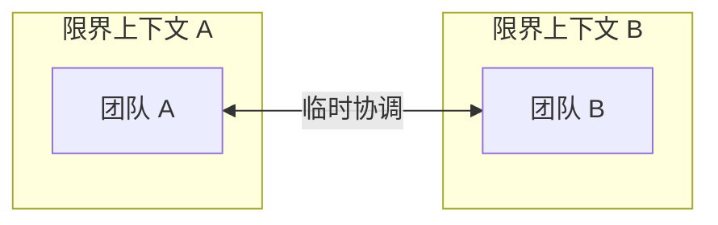
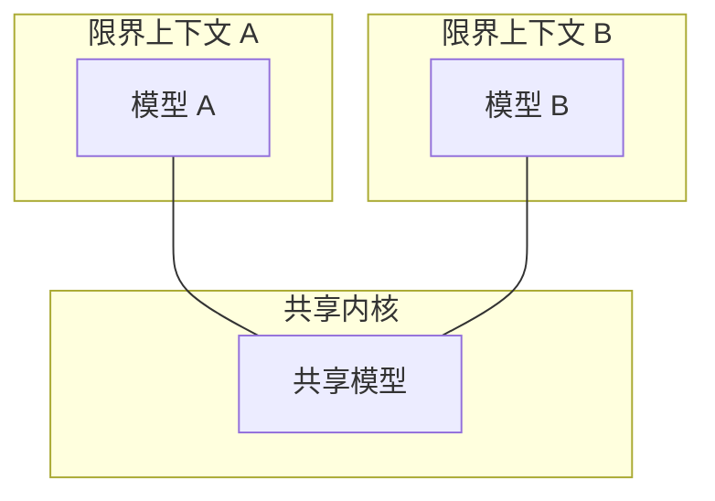
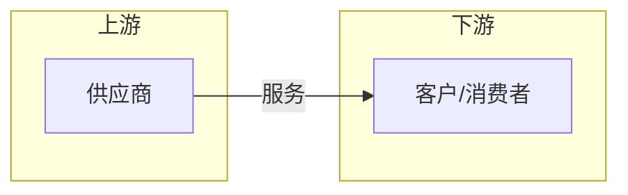
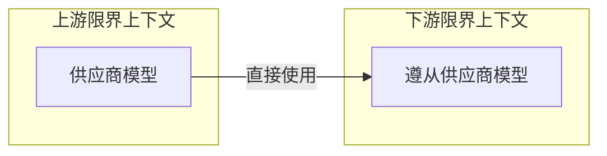
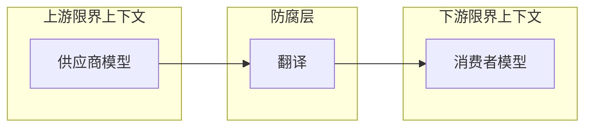
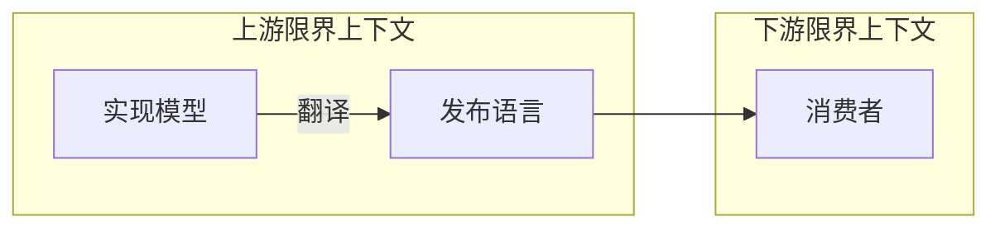
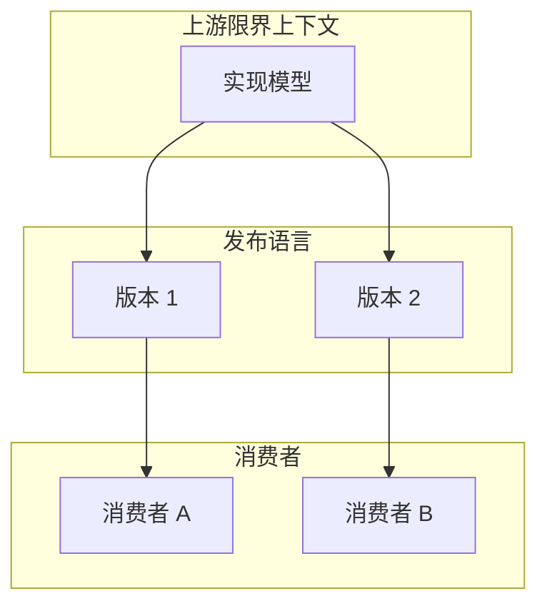
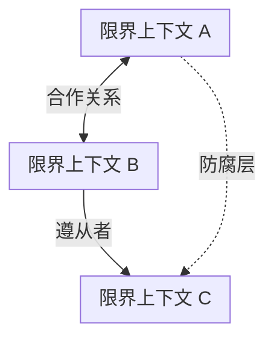
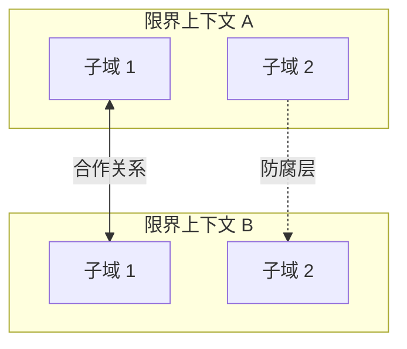

# 第4章：集成限界上下文

> 本章探讨限界上下文（Bounded Context）之间的集成模式。你将学习领域驱动设计（Domain-Driven Design, DDD）中定义限界上下文关系与集成的模式，这些模式由团队协作性质驱动。涵盖主题：合作模式（合作关系 Partnership、共享内核 Shared Kernel）、客户-供应商模式（遵从者 Conformist、防腐层 Anticorruption Layer、开放主机服务 Open-Host Service）、各行其道（Separate Ways）、上下文映射图（Context Map）、维护与局限性。

---

限界上下文模式不仅保护了通用语言（Ubiquitous Language）的一致性，还使建模成为可能。你无法在不指定其目的——即其边界——的情况下构建模型。边界划分了语言的职责。一个限界上下文中的语言可以建模业务领域以解决特定问题。另一个限界上下文可以表示相同的业务实体，但以不同的模型解决不同的问题。

此外，不同限界上下文中的模型可以独立演进和实现。然而，限界上下文本身并非彼此独立。正如系统无法由独立组件构建——组件必须相互交互才能实现系统的总体目标——限界上下文的实现也是如此。尽管它们可以独立演进，但必须相互集成。因此，限界上下文之间始终存在接触点。这些接触点称为**契约（contracts）**。

对契约的需求源于限界上下文之间模型和语言的差异。由于每个契约影响多方，它们需要被定义和协调。此外，根据定义，两个限界上下文使用不同的通用语言。集成时将使用哪种语言？这些集成关注点应由解决方案的设计来评估和解决。

本章将介绍领域驱动设计中用于定义限界上下文之间关系和集成的模式。这些模式由负责限界上下文的团队之间的协作性质驱动。我们将把这些模式分为三组，每组代表一种团队协作类型：**合作（cooperation）**、**客户-供应商（customer–supplier）** 和 **各行其道（separate ways）**。

## 4.1 合作模式

合作模式适用于由沟通良好的团队实现的限界上下文。

在最简单的情况下，这些限界上下文由单一团队实现。这也适用于目标相互依赖的团队，即一个团队的成功取决于另一个团队的成功，反之亦然。同样，这里的主要标准是团队沟通与协作的质量。

让我们看看两种适用于协作团队的 DDD 模式：**合作关系（partnership）** 和 **共享内核（shared kernel）** 模式。

### 4.1.1 合作关系

在合作关系模型中，限界上下文之间的集成以临时方式协调。一个团队可以通知另一个团队 API 的变更，第二个团队将配合并适配——没有争执或冲突（见图 4-1）。

*图 4-1：合作关系模型*

此处的集成协调是双向的。没有哪个团队单独规定用于定义契约的语言。团队可以协商差异并选择最合适的解决方案。此外，双方在解决可能出现的任何集成问题时相互配合。任何一方都不希望阻碍另一方。

成功的集成需要成熟的协作实践、高度的承诺以及团队之间频繁的同步。从技术角度看，需要持续集成双方团队所做的变更，以进一步缩短集成反馈循环。

对于地理上分散的团队，这种模式可能不太合适，因为它可能带来同步和沟通方面的挑战。

### 4.1.2 共享内核

尽管限界上下文是模型边界，但在某些情况下，同一子域（或其中一部分）的模型仍可能在多个限界上下文中实现。关键是要强调，共享模型是根据所有限界上下文的需求设计的。此外，共享模型在所有使用它的限界上下文中必须保持一致。

例如，考虑一个使用定制模型管理用户权限的企业系统。每个用户可以直接获得权限，或从其所属组织单位之一继承权限。此外，每个限界上下文都可以修改授权模型，而每个限界上下文所做的变更必须影响所有使用该模型的其他限界上下文（见图 4-2）。

*图 4-2：共享内核*

#### 共享范围

重叠的模型将参与限界上下文的生命周期耦合在一起。对共享模型的修改会立即影响所有限界上下文。因此，为最小化变更的级联效应，重叠模型应受到限制，仅暴露必须由两个限界上下文共同实现的那部分模型。理想情况下，共享内核应仅包含集成契约和旨在跨限界上下文边界传递的数据结构。

#### 实现

共享内核的实现方式是，对其源代码的任何修改都会立即反映在所有使用它的限界上下文中。

如果组织采用单仓库（mono-repository）方式，这些可以是多个限界上下文引用的同一源文件。如果无法使用共享仓库，可以将共享内核提取到独立项目中，并在限界上下文中作为链接库引用。无论哪种方式，对共享内核的每次修改都必须触发所有受影响限界上下文的集成测试。

::: warning 持续集成要求
需要持续集成变更，因为共享内核属于多个限界上下文。不将共享内核的变更传播到所有相关限界上下文会导致模型不一致：限界上下文可能依赖共享内核的过时实现，从而导致数据损坏和/或运行时问题。

:::

#### 何时使用共享内核

共享内核模式的总体适用标准是**复制成本与协调成本的权衡**。由于该模式在参与的限界上下文之间引入了强依赖，因此仅当复制成本高于协调成本时才应应用——换句话说，仅当两个限界上下文对共享模型所做的变更的集成工作，比协调共享代码库中的变更需要更多努力时。

集成成本与复制成本之间的差异取决于模型的波动性。模型变更越频繁，集成成本就越高。因此，共享内核自然适用于变更最频繁的子域：**核心子域（core subdomains）**。

在某种意义上，共享内核模式与上一章介绍的限界上下文原则相矛盾。如果参与的限界上下文不是由同一团队实现的，引入共享内核就违背了单一团队应拥有一个限界上下文的原则。重叠模型——即共享内核——实际上是由多个团队共同开发的。

这就是为什么使用共享内核必须有充分理由。这是一个需要谨慎考虑的务实例外。实现共享内核的常见用例包括：

- **沟通或协作问题阻碍了合作关系模式的实现**——例如，由于地理限制或组织政治。在没有适当协调的情况下实现密切相关的功能将导致集成问题、模型不同步以及关于哪个模型设计更好的争论。最小化共享内核的范围可以控制级联变更的范围，而每次变更触发集成测试是尽早发现集成问题的一种方式。
- **遗留系统的渐进式现代化**——这是另一个常见用例，尽管是临时的。在此场景中，共享代码库可以是渐进式将系统分解为限界上下文的务实中间解决方案。
- **由同一团队拥有和实现的限界上下文的集成**——在这种情况下，限界上下文的临时集成（合作关系）可能会随着时间的推移「冲淡」上下文的边界。共享内核可用于明确定义限界上下文的集成契约。

## 4.2 客户-供应商

我们将探讨的第二组协作模式是**客户-供应商（customer–supplier）** 模式。如图 4-3 所示，其中一个限界上下文——**供应商（supplier）**——为其客户提供服务。服务提供方是「**上游（upstream）**」，客户或消费者是「**下游（downstream）**」。

*图 4-3：客户-供应商关系*

与合作模式不同，两个团队（上游和下游）可以独立成功。因此，在大多数情况下存在权力不平衡：上游或下游团队都可以规定集成契约。

本节将讨论三种应对此类权力差异的模式：**遵从者（conformist）**、**防腐层（anticorruption layer）** 和 **开放主机服务（open-host service）** 模式。

### 4.2.1 遵从者

在某些情况下，权力平衡有利于上游团队，而上游团队没有真正的动机来支持其客户的需求。相反，它只是提供根据其自身模型定义的集成契约——要么接受，要么放弃。这种权力不平衡可能由与组织外部服务提供商的集成引起，或仅仅由组织政治造成。

如果下游团队可以接受上游团队的模型，则限界上下文的关系称为**遵从者（conformist）**。下游遵从上游限界上下文的模型，如图 4-4 所示。

*图 4-4：遵从者关系*

下游团队放弃部分自主权的决定可以有多种理由。例如，上游团队暴露的契约可能是行业标准、成熟的模型，或者可能恰好满足下游团队的需求。

下一个模式解决消费者不愿意接受供应商模型的情况。

### 4.2.2 防腐层

与遵从者模式一样，此关系中的权力平衡仍然倾向于上游服务。然而，在这种情况下，下游限界上下文不愿意遵从。相反，它可以通过**防腐层（anticorruption layer）** 将上游限界上下文的模型翻译成适合其自身需求的模型，如图 4-5 所示。

*图 4-5：通过防腐层集成*

防腐层模式适用于以下场景：遵从供应商模型不可取或不值得付出努力：

| 场景 | 说明 |
|------|------|
| **下游限界上下文包含核心子域** | 核心子域的模型需要格外关注，遵从供应商的模型可能会阻碍问题领域的建模。 |
| **上游模型对消费者需求低效或不便** | 如果限界上下文遵从一团糟，它就有变成一团糟的风险。与遗留系统集成时往往如此。 |
| **供应商的契约经常变更** | 消费者希望保护其模型免受频繁变更的影响。有了防腐层，供应商模型的变更仅影响翻译机制。 |

从建模角度看，供应商模型的翻译将下游消费者与与其限界上下文无关的外部概念隔离开来。因此，它简化了消费者的通用语言和模型。

::: info 实现细节
第 9 章将探讨实现防腐层的不同方式。

:::

### 4.2.3 开放主机服务

此模式解决权力倾向于**消费者**的情况。供应商有兴趣保护其消费者并提供尽可能好的服务。

为保护消费者免受其实现模型变更的影响，上游供应商将实现模型与公共接口解耦。这种解耦允许供应商以不同的速度演进其实现模型和公共模型，如图 4-6 所示。

*图 4-6：通过开放主机服务集成*

供应商的公共接口并非旨在遵从其通用语言。相反，它旨在暴露对消费者便利的协议，以面向集成的语言表达。因此，该公共协议称为**发布语言（published language）**。

在某种意义上，开放主机服务模式是防腐层模式的反转：不是消费者，而是供应商实现其内部模型的翻译。

将限界上下文的实现模型和集成模型解耦，使上游限界上下文可以自由演进其实现，而不影响下游上下文。当然，这只有在修改后的实现模型可以翻译成消费者已在使用的发布语言时才有可能。

此外，集成模型的解耦允许上游限界上下文同时暴露多个版本的发布语言，使消费者可以逐步迁移到新版本（见图 4-7）。

*图 4-7：开放主机服务暴露多个版本的发布语言*

## 4.3 各行其道

最后一种协作选择是**根本不协作**。这种模式可能因不同原因出现，即团队不愿意或无法协作的情况。我们在此探讨其中几种。

### 4.3.1 沟通问题

避免协作的一个常见原因是组织规模或内部政治驱动的沟通困难。当团队难以协作和达成一致时，各行其道并在多个限界上下文中复制功能可能更具成本效益。

### 4.3.2 通用子域

被复制子域的性质也可能是团队各行其道的原因。当所讨论的子域是**通用子域（generic subdomain）**，且通用解决方案易于集成时，在每个限界上下文中本地集成可能更具成本效益。例如日志框架；让其中一个限界上下文将其作为服务暴露几乎没有意义。集成此类解决方案所增加的复杂性将超过在多个上下文中不复制功能的好处。复制功能的成本将低于协作的成本。

### 4.3.3 模型差异

限界上下文之间的模型差异也可能是选择各行其道协作的原因。模型可能差异如此之大，以至于遵从者关系不可能，而实现防腐层的成本将高于复制功能的成本。在这种情况下，团队各行其道再次更具成本效益。

::: danger 核心子域慎用
在集成核心子域时应避免各行其道模式。复制此类子域的实现将违背公司以最有效和最优方式实现它们的战略。

:::

## 4.4 上下文映射图

在分析系统限界上下文之间的集成模式后，我们可以将它们绘制在**上下文映射图（context map）** 上，如图 4-8 所示。

*图 4-8：上下文映射图*

上下文映射图是系统限界上下文及其之间集成的可视化表示。这种可视化表示在多个层面提供有价值的战略洞察：

| 层面 | 说明 |
|------|------|
| **高层设计** | 上下文映射图提供系统组件及其实现的模型的概览。 |
| **沟通模式** | 上下文映射图描绘团队之间的沟通模式——例如，哪些团队在协作，哪些团队偏好「不那么亲密」的集成模式，如防腐层和各行其道模式。 |
| **组织问题** | 上下文映射图可以洞察组织问题。例如，如果某个上游团队的所有下游消费者都诉诸实现防腐层，或者如果各行其道模式的所有实现都集中在同一团队周围，这意味着什么？ |

## 4.5 维护

理想情况下，上下文映射图应在项目一开始就引入，并随着新限界上下文的添加和现有限界上下文的修改而更新。

由于上下文映射图可能包含来自多个团队工作的信息，最好将上下文映射图的维护定义为**共同责任**：每个团队负责更新其与其他限界上下文的集成。

上下文映射图可以使用 Context Mapper 等工具作为代码进行管理和维护。

## 4.6 局限性

需要注意的是，绘制上下文映射图可能是一项具有挑战性的任务。当系统的限界上下文涵盖多个子域时，可能同时存在多种集成模式。例如，在图 4-9 中，你可以看到两个限界上下文之间存在两种集成模式：合作关系和防腐层。

*图 4-9：复杂的上下文映射图*

此外，即使限界上下文仅限于单一子域，仍可能同时存在多种集成模式——例如，如果子域的模块需要不同的集成策略。

## 本章小结

限界上下文并非彼此独立。它们必须相互交互。以下模式定义了限界上下文可以集成的不同方式：

| 模式 | 说明 |
|------|------|
| **合作关系（Partnership）** | 限界上下文以临时方式集成。 |
| **共享内核（Shared Kernel）** | 两个或多个限界上下文通过共享属于所有参与限界上下文的有限重叠模型进行集成。 |
| **遵从者（Conformist）** | 消费者遵从服务提供商的模型。 |
| **防腐层（Anticorruption Layer）** | 消费者将服务提供商的模型翻译成适合消费者需求的模型。 |
| **开放主机服务（Open-Host Service）** | 服务提供商实现发布语言——针对其消费者需求优化的模型。 |
| **各行其道（Separate Ways）** | 复制特定功能的成本低于协作和集成的成本。 |

限界上下文之间的集成可以绘制在上下文映射图上。这一工具提供对系统高层设计、沟通模式和组织问题的洞察。

现在你已经学习了用于分析和建模业务领域的领域驱动设计工具和技术，我们将从战略转向战术。在第二部分，你将学习实现领域逻辑、组织高层架构以及协调系统组件之间通信的不同方式。

---

## 练习题

1. 哪种集成模式绝不应用于核心子域？
   - a. 共享内核
   - b. 开放主机服务
   - c. 防腐层
   - d. 各行其道

2. 哪种下游子域更可能实现防腐层？
   - a. 核心子域
   - b. 支撑子域
   - c. 通用子域
   - d. B 和 C

3. 哪种上游子域更可能实现开放主机服务？
   - a. 核心子域
   - b. 支撑子域
   - c. 通用子域
   - d. A 和 B

4. 哪种集成模式在某种意义上违背了限界上下文的所有权边界？
   - a. 合作关系
   - b. 共享内核
   - c. 各行其道
   - d. 任何集成模式都不应打破限界上下文的所有权边界

---

[← 上一章：管理领域复杂性](ch03-managing-domain-complexity.md) | [返回目录](../index.md) | [下一章：实现简单业务逻辑 →](../part2/ch05-implementing-simple-business-logic.md)
