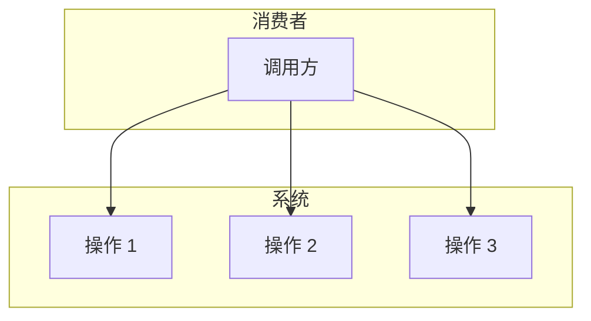
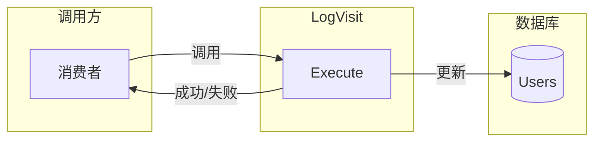
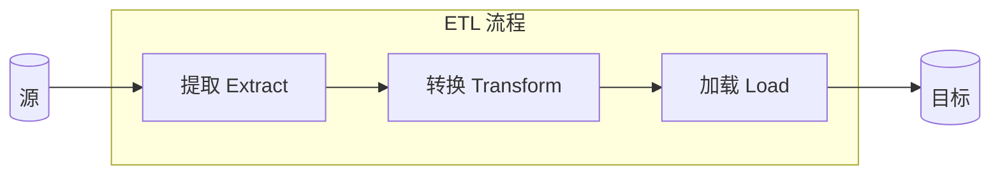
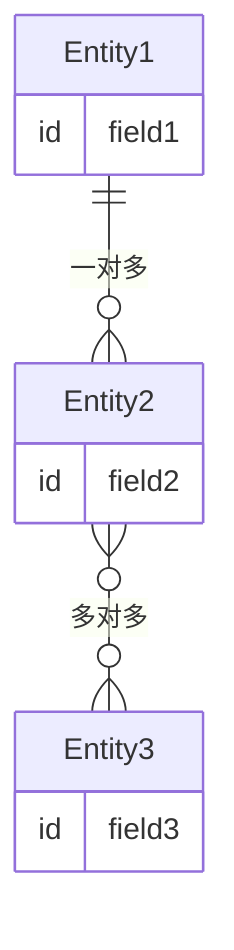

# 第5章：实现简单业务逻辑

> 本章介绍两种适用于相对简单业务逻辑的实现模式：事务脚本（Transaction Script）和活动记录（Active Record）。你将学习这两种模式的定义、实现方式、常见陷阱及适用场景，并了解在简单业务逻辑场景下如何务实选择。

---

业务逻辑是软件中最重要的部分。它是软件被实现的根本原因。系统的用户界面可以很炫酷，数据库可以极快且可扩展。但如果软件对业务没有用处，它就只是一场昂贵的技术演示。

正如我们在第2章所见，并非所有业务子域（subdomain）都生而平等。不同的子域具有不同的战略重要性和复杂度。本章开始探索建模和实现业务逻辑代码的不同方式。我们将从两种适合相对简单业务逻辑的模式入手：**事务脚本（transaction script）** 和 **活动记录（active record）**。

## 5.1 事务脚本

::: tip 定义
按过程组织业务逻辑，其中每个过程处理来自表现层的单个请求。
—Martin Fowler¹

:::

系统的公共接口可以看作是一组消费者可执行的业务事务（business transactions）集合，如图 5-1 所示。这些事务可以检索系统管理的信息、修改它，或两者兼有。该模式基于过程组织系统的业务逻辑，每个过程实现一个操作，由系统的消费者通过其公共接口执行。实际上，系统的公共操作被用作封装边界。



图 5-1：事务脚本接口

### 5.1.1 实现

每个过程被实现为简单、直接的过程式脚本。它可以使用薄抽象层与存储机制集成，也可以直接访问数据库。

过程必须满足的唯一要求是**事务行为（transactional behavior）**。每个操作要么成功要么失败，但绝不能导致无效状态。即使事务脚本在最不巧的时刻执行失败，系统也应保持一致性——要么回滚失败前所做的任何更改，要么执行补偿操作。事务行为体现在模式的名称中：事务脚本。

以下是一个将 JSON 文件批量转换为 XML 文件的事务脚本示例：

```csharp
DB.StartTransaction();
var job = DB.LoadNextJob();
var json = LoadFile(job.Source);
var xml = ConvertJsonToXml(json);
WriteFile(job.Destination, xml.ToString();
DB.MarkJobAsCompleted(job);
DB.Commit()
```

### 5.1.2 没那么简单

当我在领域驱动设计课程中介绍事务脚本模式时，学生们常常扬起眉毛，甚至有人问：「这值得花我们的时间吗？我们不是来学更高级的模式和技术的吗？」

事实是，事务脚本模式是你在后续章节中将学习的更高级业务逻辑实现模式的基础。此外，尽管它看似简单，却是最容易用错的模式。我帮助调试和修复的大量生产问题，在某种程度上往往可归结为系统业务逻辑的事务行为实现不当。

让我们看看三个因未能正确实现事务脚本而导致数据损坏的常见真实案例。

#### 缺乏事务行为

未能实现事务行为的一个简单例子是：在缺乏 overarching 事务（overarching transaction）的情况下执行多次更新。考虑以下方法，它更新 Users 表中的一条记录并向 VisitsLog 表插入一条记录：

```csharp
public class LogVisit
{
    ...

    public void Execute(Guid userId, DataTime visitedOn)
    {
        _db.Execute("UPDATE Users SET last_visit=@p1 WHERE user_id=@p2",
            visitedOn, userId);
        _db.Execute(@"INSERT INTO VisitsLog(user_id, visit_date)
                     VALUES(@p1, @p2)", userId, visitedOn);
    }
}
```

如果在 Users 表记录被更新（第 7 行）之后、第 9 行追加日志记录成功之前发生任何问题，系统将处于不一致状态。Users 表会被更新，但 VisitsLog 表中不会有对应的记录。问题可能由网络中断、数据库超时或死锁，甚至执行该进程的服务器崩溃等原因引起。

可以通过引入包含两次数据更改的适当事务来修复：

```csharp
public class LogVisit
{
    ...
    public void Execute(Guid userId, DataTime visitedOn)
    {
        try
        {
            _db.StartTransaction();
            _db.Execute(@"UPDATE Users SET last_visit=@p1
                       WHERE user_id=@p2",
                       visitedOn, userId);
            _db.Execute(@"INSERT INTO VisitsLog(user_id, visit_date)
                       VALUES(@p1, @p2)",
                       userId, visitedOn);
            _db.Commit();
        } catch {
            _db.Rollback();
            throw;
        }
    }
}
```

由于关系数据库原生支持跨多条记录的事务，这种修复很容易实现。当你必须在不支持多记录事务的数据库中执行多次更新，或者在使用无法纳入分布式事务的多个存储机制时，情况会变得复杂。让我们看一个后者的例子。

#### 分布式事务

在现代分布式系统中，常见的做法是修改数据库中的数据，然后通过向消息总线（message bus）发布消息来通知系统的其他组件。假设在前面的例子中，我们不是将访问记录到表中，而是发布到消息总线：

```csharp
public class LogVisit
{
    ...

    public void Execute(Guid userId, DataTime visitedOn)
    {
        _db.Execute("UPDATE Users SET last_visit=@p1 WHERE user_id=@p2",
                   visitedOn,userId);
        _messageBus.Publish("VISITS_TOPIC",
                           new { UserId = userId, VisitDate = visitedOn });
    }
}
```

与前面的例子一样，在第 7 行之后、第 9 行成功之前发生的任何失败都会破坏系统的状态。Users 表会被更新，但其他组件不会收到通知，因为向消息总线的发布失败了。

不幸的是，修复这个问题不像前一个例子那么容易。跨多个存储机制的分布式事务复杂、难以扩展、容易出错，因此通常被避免。在第 8 章，你将学习如何使用 CQRS 架构模式来填充多个存储机制。此外，第 9 章将介绍 outbox 模式，它支持在向另一个数据库提交更改后可靠地发布消息。

让我们看一个更复杂的、不当实现事务行为的例子。

#### 隐式分布式事务

考虑以下看似简单的方法：

```csharp
public class LogVisit
{
    ...

    public void Execute(Guid userId)
    {
        _db.Execute("UPDATE Users SET visits=visits+1 WHERE user_id=@p1",
                    userId);
    }
}
```

与前面例子中跟踪最后访问日期不同，该方法维护每个用户的访问计数器。调用该方法会使相应计数器的值加 1。该方法所做的只是更新一个数据库、一张表中的一个值。然而，这仍然是一个可能导致不一致状态的分布式事务。

这个例子构成分布式事务，因为它与数据库以及调用该方法的外部进程进行通信，如图 5-2 所示。



图 5-2：LogVisit 操作更新数据并向调用方通知操作的成功或失败

尽管 execute 方法的返回类型是 void，即它不返回任何数据，但它仍然传达操作是成功还是失败：如果失败，调用方会收到异常。如果方法成功，但将结果传达给调用方的通信失败了呢？例如：

- 如果 LogVisit 是 REST 服务的一部分且发生网络中断；或
- 如果 LogVisit 和调用方在同一进程中运行，但进程在调用方能够跟踪 LogVisit 操作成功执行之前就失败了？

在这两种情况下，消费者都会假设失败并再次调用 LogVisit。再次执行 LogVisit 逻辑将导致计数器值被错误地增加。总体而言，它会被增加 2 而不是 1。与前两个例子一样，代码未能正确实现事务脚本模式，无意中导致系统状态损坏。

与前面的例子一样，这个问题没有简单的修复方法。一切都取决于业务领域及其需求。在这个具体例子中，确保事务行为的一种方法是使操作**幂等（idempotent）**：即即使操作重复多次也能得到相同的结果。

例如，我们可以要求消费者传递计数器的值。为了提供计数器的值，调用方必须先读取当前值，在本地增加它，然后将更新后的值作为参数提供。即使操作被执行多次，也不会改变最终结果：

```csharp
public class LogVisit
{
    ...

    public void Execute(Guid userId, long visits)
    {
        _db.Execute("UPDATE Users SET visits = @p1 WHERE user_id=@p2",
                   visits, userId);
    }
}
```

另一种解决此类问题的方法是使用**乐观并发控制（optimistic concurrency control）**：在调用 LogVisit 操作之前，调用方已读取计数器的当前值并将其作为参数传递给 LogVisit。LogVisit 只会在计数器值等于调用方最初读取的值时更新它：

```csharp
public class LogVisit
{
    ...

    public void Execute(Guid userId, long expectedVisits)
    {
        _db.Execute(@"UPDATE Users SET visits=visits+1
                      WHERE user_id=@p1 and visits = @p2",
                      userId, expectedVisits);
    }
}
```

使用相同输入参数再次执行 LogVisit 不会改变数据，因为 `WHERE...visits = @p2` 条件将无法满足。

### 5.1.3 何时使用事务脚本

事务脚本模式非常适合最直接的问题领域，其中业务逻辑类似于简单的过程式操作。例如，在提取-转换-加载（extract-transform-load, ETL）操作中，每个操作从源提取数据，应用转换逻辑将其转换为另一种形式，并将结果加载到目标存储中。此过程如图 5-3 所示。



图 5-3：提取-转换-加载数据流

事务脚本模式天然适合支持子域（supporting subdomain），因为根据定义，其业务逻辑是简单的。它也可以用作与外部系统集成的适配器——例如通用子域（generic subdomain），或作为防腐层（anticorruption layer）的一部分（更多内容见第 9 章）。

事务脚本模式的主要优势在于其简单性。它引入最少的抽象，并最小化运行时性能和理解业务逻辑方面的开销。也就是说，这种简单性也是该模式的劣势。业务逻辑越复杂，就越容易在事务之间重复业务逻辑，从而导致行为不一致——当重复的代码不同步时。因此，事务脚本绝不应用于核心子域（core subdomain），因为该模式无法应对核心子域业务逻辑的高复杂度。

这种简单性给事务脚本带来了可疑的声誉。有时该模式甚至被视为反模式。毕竟，如果复杂的业务逻辑被实现为事务脚本，迟早会变成难以维护的大泥球。然而，应该指出的是，尽管简单，事务脚本模式在软件开发中无处不在。我们将在本章及后续章节讨论的所有业务逻辑实现模式，在某种程度上都基于事务脚本模式。

## 5.2 活动记录

::: tip 定义
包装数据库表或视图中一行的对象，封装数据库访问，并在该数据上添加领域逻辑。
—Martin Fowler²

:::

与事务脚本模式一样，活动记录支持业务逻辑简单的场景。然而，这里的业务逻辑可能操作更复杂的数据结构。例如，我们可以有更复杂的对象树和层次结构，而不是扁平记录，如图 5-4 所示。



图 5-4：具有一对多和多对多关系的更复杂数据模型

通过简单的事务脚本操作此类数据结构会导致大量重复代码。数据到内存表示的映射会在各处重复。

### 5.2.1 实现

因此，该模式使用称为活动记录（active records）的专用对象来表示复杂的数据结构。除了数据结构之外，这些对象还实现用于创建、读取、更新和删除记录的**数据访问方法**——即所谓的 CRUD 操作。因此，活动记录对象与对象关系映射（object-relational mapping, ORM）或其他数据访问框架耦合。该模式的名称来源于每个数据结构都是「活动的」；即它实现数据访问逻辑。

与前面的模式一样，系统的业务逻辑在事务脚本中组织。两种模式的区别在于，在这种情况下，事务脚本不是直接访问数据库，而是操作活动记录对象。当操作完成时，它必须作为原子事务要么完成要么失败：

```csharp
public class CreateUser
{
    ...
    public void Execute(userDetails)
    {
        try
        {
            _db.StartTransaction();
            var user = new User();
            user.Name = userDetails.Name;
            user.Email = userDetails.Email;
            user.Save();
            _db.Commit();
        } catch {
            _db.Rollback();
            throw;
        }
    }
}
```

该模式的目标是封装将内存对象映射到数据库模式的复杂性。除了负责持久化之外，活动记录对象还可以包含业务逻辑；例如，验证分配给字段的新值，甚至实现操作对象数据的业务相关过程。也就是说，活动记录对象的显著特征是数据结构与行为（业务逻辑）的分离。通常，活动记录的字段具有公共 getter 和 setter，允许外部过程修改其状态。

### 5.2.2 何时使用活动记录

由于活动记录本质上是一种优化数据库访问的事务脚本，该模式只能支持相对简单的业务逻辑，例如 CRUD 操作，最多验证用户输入。

因此，与事务脚本模式的情况一样，活动记录模式适用于支持子域、通用子域的外部解决方案集成或模型转换任务。两种模式之间的区别在于，活动记录解决了将复杂数据结构映射到数据库模式的复杂性。

活动记录模式也被称为**贫血领域模型反模式（anemic domain model antipattern）**；换句话说，即设计不当的领域模型。我倾向于避免使用「贫血」和「反模式」这些词的负面含义。该模式是一种工具。像任何工具一样，它可以解决问题，但在错误的情境下应用可能会带来比好处更多的危害。当业务逻辑简单时，使用活动记录没有问题。此外，在实现简单业务逻辑时使用更复杂的模式也会通过引入偶然复杂性而造成危害。在下一章，你将学习什么是领域模型以及它与活动记录模式有何不同。

::: info 说明
在此上下文中，活动记录指的是**设计模式**，而不是 Active Record 框架。该模式名称由 Martin Fowler 在《企业应用架构模式》（Patterns of Enterprise Application Architecture）中提出。框架是后来作为实现该模式的一种方式出现的。在我们的上下文中，我们讨论的是设计模式及其背后的概念，而不是具体的实现。

:::

## 5.3 务实选择

尽管业务数据很重要，我们设计和构建的代码应该保护其完整性，但在某些情况下，务实的方法更可取。特别是在高规模水平下，有时可以放宽数据一致性保证。检查 100 万条记录中损坏一条的状态是否真的对业务是致命问题，以及它是否会对业务的绩效和盈利能力产生负面影响。例如，假设你正在构建一个每天从物联网设备摄取数十亿事件的系统。如果 0.001% 的事件被重复或丢失，这是个大问题吗？

一如既往，没有普适法则。一切都取决于你所在的业务领域。在可能的地方「走捷径」是可以的；只需确保你评估风险和业务影响。

## 本章小结

本章我们介绍了两种实现业务逻辑的模式：

**事务脚本**：该模式将系统的操作组织为简单、直接的过程式脚本。过程确保每个操作都是事务性的——要么成功要么失败。事务脚本模式适用于支持子域，其业务逻辑类似于简单的、类似 ETL 的操作。

**活动记录**：当业务逻辑简单但操作复杂的数据结构时，可以将这些数据结构实现为活动记录。活动记录对象是一种提供简单 CRUD 数据访问方法的数据结构。

本章讨论的两种模式面向相对简单的业务逻辑场景。在下一章，我们将转向更复杂的业务逻辑，并讨论如何使用领域模型（domain model）模式来应对复杂性。

---

### 练习

1. 以下哪种讨论的模式应用于实现核心子域的业务逻辑？

   - a. 事务脚本
   - b. 活动记录
   - c. 这两种模式都不能用于实现核心子域
   - d. 两种都可以用于实现核心子域

2. 考虑以下代码：

```csharp
public void CreateTicket(TicketData data)
{
    var agent = FindLeastBusyAgent();

    agent.ActiveTickets = agent.ActiveTickets + 1;
    agent.Save();

    var ticket = new Ticket();
    ticket.Id = Guid.New();
    ticket.Data = data;
    ticket.AssignedAgent = agent;
    ticket.Save();

    _alerts.Send(agent, "You have a new ticket!");
}
```

假设没有高层事务机制，你能发现哪些潜在的数据一致性问题？

<!-- markdownlint-disable MD029 -->
- a. 收到新工单时，被分配代理的活跃工单计数器可能增加超过 1
- b. 代理的活跃工单计数器可能增加 1，但代理不会被分配任何新工单
- c. 代理可能收到新工单但不会收到通知
- d. 以上所有问题都可能发生
<!-- markdownlint-enable MD029 -->

3. 在上述代码中，至少还有一个可能导致系统状态损坏的边界情况。你能发现吗？

4. 回到本书前言中 WolfDesk 的例子，系统的哪些部分可能可以用事务脚本或活动记录实现？

---

¹ Fowler, M. (2002). *Patterns of Enterprise Application Architecture*. Boston: Addison-Wesley.

² Fowler, M. (2002). *Patterns of Enterprise Application Architecture*. Boston: Addison-Wesley.

[← 上一章：集成限界上下文](../part1/ch04-integrating-bounded-contexts.md) | [返回目录](../index.md) | [下一章：处理复杂业务逻辑 →](ch06-tackling-complex-business-logic.md)
