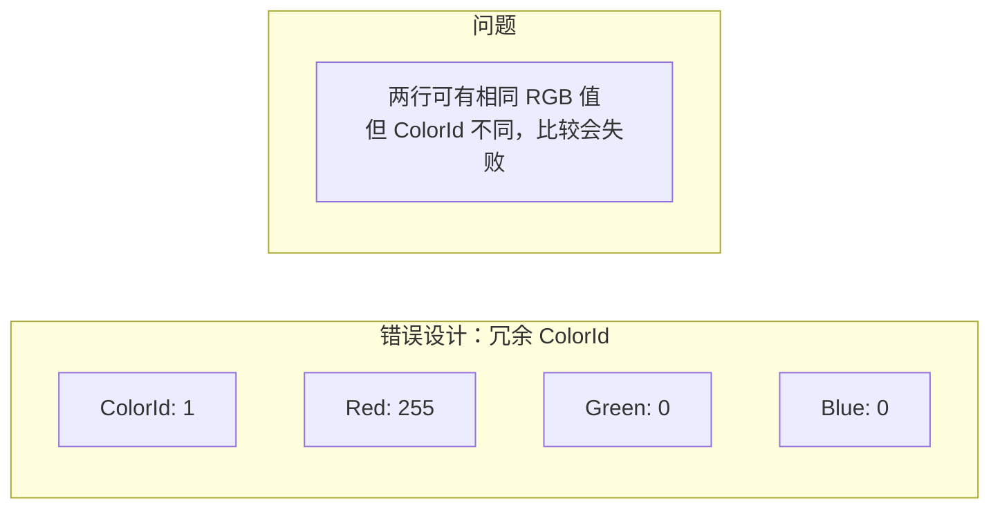
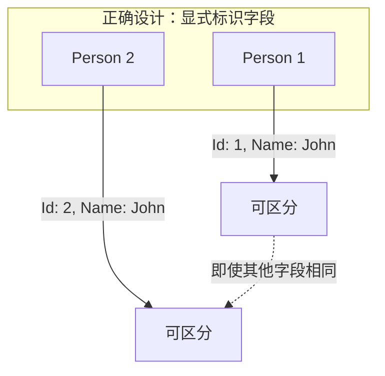
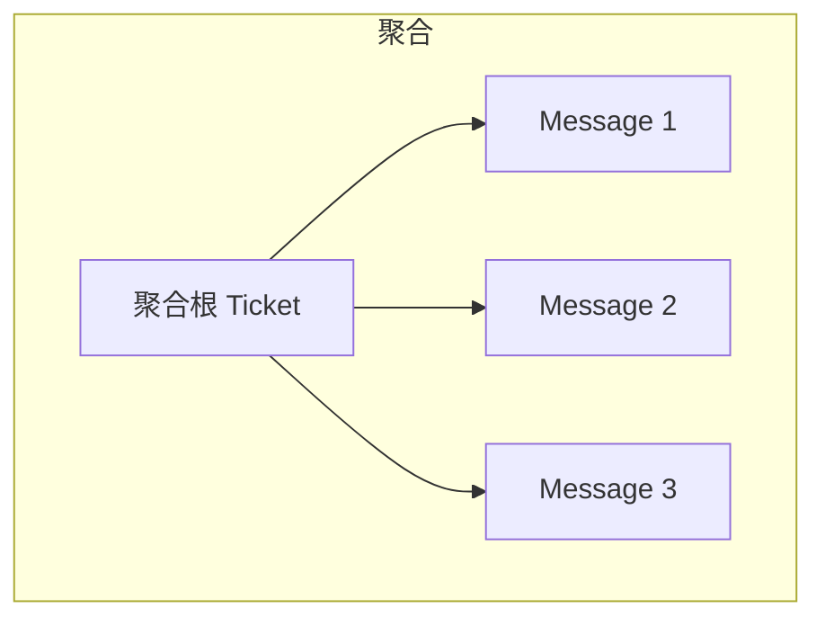
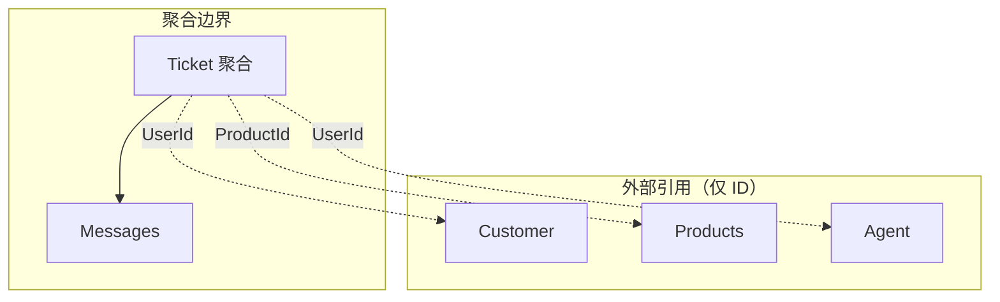
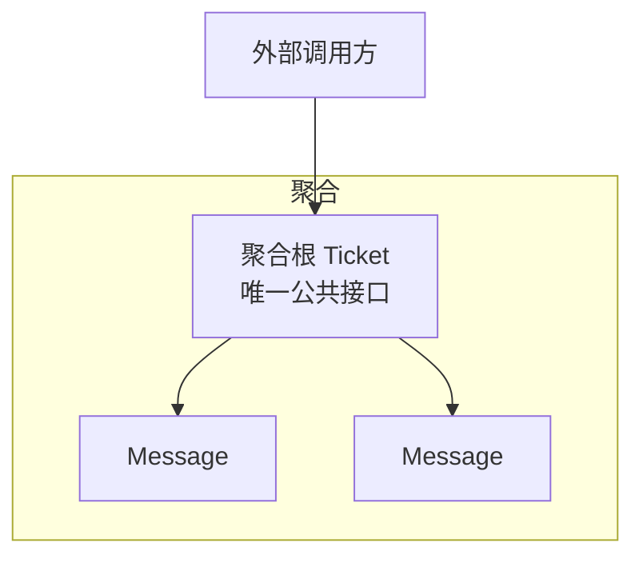
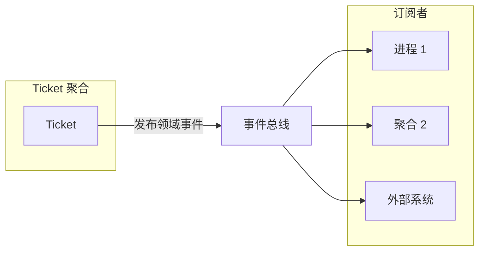

# 第6章：处理复杂业务逻辑

> 上一章讨论了两种适用于相对简单业务逻辑的模式：事务脚本（Transaction Script）和活动记录（Active Record）。本章继续探讨业务逻辑的实现，并介绍一种面向复杂业务逻辑的模式：领域模型（Domain Model）模式。

---

## 6.1 历史

与事务脚本和活动记录模式一样，领域模型模式最初由 Martin Fowler 在其著作《企业应用架构模式》（*Patterns of Enterprise Application Architecture*）中提出。Fowler 在讨论该模式时总结道：「Eric Evans 目前正在撰写一本关于构建领域模型的著作。」他所指的便是 Evans 的开创性著作《领域驱动设计：软件核心复杂性的应对之道》（*Domain-Driven Design: Tackling Complexity in the Heart of Software*）。

在 Evans 的书中，他提出了一组旨在将代码与业务领域底层模型紧密关联的模式：聚合（aggregate）、值对象（value objects）、仓储（repositories）等。这些模式紧接 Fowler 书中未竟之处，构成了一套实现领域模型模式的有效工具集。

Evans 引入的这些模式通常被称为**战术领域驱动设计**（tactical domain-driven design）。为避免混淆——即认为实现领域驱动设计必然要使用这些模式来实现业务逻辑——我倾向于沿用 Fowler 的原始术语：该模式是「领域模型」，而聚合和值对象是其构建块。

## 6.2 领域模型

领域模型模式旨在应对复杂业务逻辑的场景。在此类场景中，我们面对的不是 CRUD 接口，而是复杂的状态转换、业务规则和**不变量**（invariants）——即必须始终受保护的规则。

假设我们正在实现一个客服系统。考虑以下描述支持工单生命周期控制逻辑的需求摘录：

- 客户创建描述其面临问题的支持工单。
- 客户和支持代理均可追加消息，所有往来记录由支持工单追踪。
- 每个工单有优先级：低、中、高或紧急。
- 代理应在基于工单优先级的设定时间限制（SLA）内提供解决方案。
- 若代理未在 SLA 内回复，客户可将工单升级给代理的经理。
- 升级会使代理的响应时间限制减少 33%。
- 若代理未在响应时间限制的 50% 内打开已升级工单，工单将自动重新分配给其他代理。
- 若客户在七天内未回复代理的问题，工单将自动关闭。
- 已升级的工单不能由系统自动关闭或由代理关闭，只能由客户或代理的经理关闭。
- 客户只能在工单关闭后七天内重新打开已关闭的工单。

这些需求形成了不同规则之间的依赖网络，均影响支持工单的生命周期管理逻辑。这不是上一章讨论的 CRUD 数据录入界面。若尝试使用活动记录对象实现该逻辑，将容易重复逻辑，并因业务规则实现不当而破坏系统状态。

### 6.2.1 实现

领域模型是包含行为与数据的领域对象模型。DDD 的战术模式——聚合、值对象、领域事件和领域服务——是此类对象模型的构建块。

这些模式有一个共同主题：**业务逻辑优先**。下面我们看看领域模型如何应对不同的设计关注点。

### 6.2.2 复杂度

领域的业务逻辑本身已经足够复杂，因此用于建模的对象不应引入任何额外的偶然复杂度。模型应摒弃任何基础设施或技术关注，例如调用数据库或系统其他外部组件的实现。这一限制要求模型中的对象是**纯对象**（plain old objects）——实现业务逻辑而不依赖或直接包含任何基础设施组件或框架的对象。

### 6.2.3 通用语言

强调业务逻辑而非技术关注，使领域模型的对象更容易遵循限界上下文的**通用语言**（ubiquitous language）术语。换言之，该模式使代码能够「说」通用语言，并遵循领域专家的心智模型。

### 6.2.4 构建块

下面介绍 DDD 提供的核心领域模型构建块，即战术模式：值对象、聚合和领域服务。

#### 6.2.4.1 值对象

**值对象**（value object）是一种可通过其值的组合来识别的对象。例如，考虑一个颜色对象：

```csharp
class Color
{
    int _red;
    int _green;
    int _blue;
}
```

红、绿、蓝三个字段值的组合定义了一种颜色。修改任一字段的值将产生新的颜色。没有两种颜色可以具有相同的值。同样，同一颜色的两个实例必须具有相同的值。因此，不需要显式标识字段来识别颜色。



图 6-1：冗余的 ColorId 字段，使两行可能具有相同值

::: info 通用语言
仅依赖语言标准库的原始数据类型——如字符串、整数或字典——来表示业务领域的概念，被称为**基本类型偏执**（primitive obsession）代码坏味道。例如，考虑以下类：

:::

```csharp
class Person
{
    private int    _id;
    private string _firstName;
    private string _lastName;
    private string _landlinePhone;
    private string _mobilePhone;
    private string _email;
    private int    _heightMetric;
    private string _countryCode;
    public Person(...) {...}
}
static void Main(string[] args)
{
    var dave = new Person(
        id: 30217,
        firstName: "Dave",
        lastName: "Ancelovici",
        landlinePhone: "023745001",
        mobilePhone: "0873712503",
        email: "dave@learning-ddd.com",
        heightMetric: 180,
        countryCode: "BG");
}
```

在上述 Person 类的实现中，大多数值都是 `String` 类型，且基于约定赋值。例如，`landlinePhone` 的输入应为有效的座机号码，`countryCode` 应为有效的两字母大写国家代码。当然，系统无法信任用户始终提供正确值，因此类必须验证所有输入字段。

这种方法存在多种设计风险。首先，验证逻辑容易重复。其次，难以在值被使用之前强制调用验证逻辑。当代码库将来由其他工程师演进时，这将更具挑战性。

比较以下同一对象的替代设计，这次利用值对象：

```csharp
class Person {
    private PersonId     _id;
    private Name         _name;
    private PhoneNumber  _landline;
    private PhoneNumber  _mobile;
    private EmailAddress _email;
    private Height       _height;
    private CountryCode  _country;
    public Person(...) { ... }
}
static void Main(string[] args)
{
    var dave = new Person(
        id:       new PersonId(30217),
        name:     new Name("Dave", "Ancelovici"),
        landline: PhoneNumber.Parse("023745001"),
        mobile:   PhoneNumber.Parse("0873712503"),
        email:    Email.Parse("dave@learning-ddd.com"),
        height:   Height.FromMetric(180),
        country:  CountryCode.Parse("BG"));
}
```

首先，注意清晰度的提升。以 `country` 变量为例，无需冗长地称其为「countryCode」以表达其持有国家代码而非完整国家名的意图。值对象使意图清晰，即使使用更短的变量名。

其次，无需在赋值前验证值，因为验证逻辑驻留在值对象本身。然而，值对象的行为不仅限于验证。当值对象集中处理操作这些值的业务逻辑时，其价值最为突出。内聚的逻辑在一处实现，易于测试。最重要的是，值对象表达业务领域的概念：它们使代码说通用语言。

下面看看将高度、电话号码和颜色的概念表示为值对象，如何使所得类型系统丰富且直观易用。

与基于整数的值相比，`Height` 值对象既使意图清晰，又将测量与特定测量单位解耦。例如，`Height` 值对象可使用公制和英制单位初始化，便于在单位间转换、生成字符串表示以及比较不同单位的值：

```csharp
var heightMetric = Height.Metric(180);
var heightImperial = Height.Imperial(5, 3);
var string1 = heightMetric.ToString();              // "180cm"
var string2 = heightImperial.ToString();            // "5 feet 3 inches"
var string3 = heightMetric.ToImperial().ToString(); // "5 feet 11 inches"
var firstIsHigher = heightMetric > heightImperial; // true
```

`PhoneNumber` 值对象可封装解析字符串值、验证它以及提取电话号码不同属性的逻辑，例如所属国家和电话号码类型——座机或手机：

```csharp
var phone = PhoneNumber.Parse("+359877123503");
var country = phone.Country;                        // "BG"
var phoneType = phone.PhoneType;                    // "MOBILE"
var isValid = PhoneNumber.IsValid("+972120266680"); // false
```

以下示例展示了值对象在封装所有操作数据并产生新值对象实例的业务逻辑时的威力：

```csharp
var red = Color.FromRGB(255, 0, 0);
var green = Color.Green;
var yellow = red.MixWith(green);
var yellowString = yellow.ToString();                // "#FFFF00"
```

如上述示例所示，值对象消除了对约定的需求——例如需要记住这个字符串是电子邮件、那个字符串是电话号码——反而使对象模型的使用更不易出错、更直观。

**实现**：由于对值对象任一字段的修改都会产生不同的值，值对象被实现为**不可变对象**（immutable objects）。对值对象某一字段的修改在概念上会创建不同的值——值对象的不同实例。因此，当执行的操作产生新值时，如下例使用 `MixWith` 方法的情况，它不会修改原始实例，而是实例化并返回新实例：

```csharp
public class Color
{
    public readonly byte Red;
    public readonly byte Green;
    public readonly byte Blue;
    public Color(byte r, byte g, byte b)
    {
        this.Red = r;
        this.Green = g;
        this.Blue = b;
    }
    public Color MixWith(Color other)
    {
        return new Color(
            r: (byte) Math.Min(this.Red + other.Red, 255),
            g: (byte) Math.Min(this.Green + other.Green, 255),
            b: (byte) Math.Min(this.Blue + other.Blue, 255)
        );
    }
    ...
}
```

由于值对象的相等性基于其值而非 id 字段或引用，重写并正确实现相等性检查很重要。例如，在 C# 中：

```csharp
public class Color
{
    ...
    public override bool Equals(object obj)
    {
        var other = obj as Color;
        return other != null &&
            this.Red == other.Red &&
            this.Green == other.Green &&
            this.Blue == other.Blue;
    }
    public static bool operator == (Color lhs, Color rhs)
    {
        if (Object.ReferenceEquals(lhs, null)) {
            return Object.ReferenceEquals(rhs, null);
        }
        return lhs.Equals(rhs);
    }
    public static bool operator != (Color lhs, Color rhs)
    {
        return !(lhs == rhs);
    }
    public override int GetHashCode()
    {
        return ToString().GetHashCode();
    }
    
    ...
}
```

::: tip C# 9.0 提示
在 C# 9.0 中，新的 `record` 类型实现了基于值的相等性，因此无需重写相等运算符。

:::

尽管使用核心库的 `String` 表示领域特定值与值对象的概念相悖，但在 .NET、Java 等语言中，`string` 类型正是作为值对象实现的。字符串是不可变的，所有操作都会产生新实例。此外，`string` 类型封装了丰富的行为，通过操作一个或多个字符串的值来创建新实例：trim、连接多个字符串、替换字符、子串等方法。

**何时使用值对象**：简单回答是，尽可能使用。值对象不仅使代码更具表现力并封装容易分散的业务逻辑，该模式还使代码更安全。由于值对象不可变，其行为无副作用且线程安全。

从业务领域角度，一个有用的经验法则是：对描述其他对象属性的领域元素使用值对象。这尤其适用于实体的属性，下一节将讨论实体。你之前看到的示例使用值对象描述人，包括其 ID、姓名、电话号码、电子邮件等。使用值对象的其他示例包括各种状态、密码以及更多可由其值识别因而不需要显式标识字段的业务领域特定概念。引入值对象的一个特别重要的机会是建模金钱和其他货币值时。依赖基本类型表示金钱不仅限制了你在单一位置封装所有与金钱相关的业务逻辑的能力，还常常导致危险 bug，如舍入错误和其他精度相关问题。

#### 6.2.4.2 实体

**实体**（entity）与值对象相反。它需要显式标识字段来区分实体的不同实例。实体的一个简单例子是人。考虑以下类：

```csharp
class Person
{
    public Name Name { get; set; }
    
    public Person(Name name)
    {
        this.Name = name;
    }
}
```

该类仅包含一个字段：name（值对象）。然而，这种设计欠佳，因为不同的人可能同名，且可能具有完全相同的名字。这当然不会使他们成为同一个人。因此，需要标识字段来正确识别人：

```csharp
class Person
{
    public readonly PersonId Id;
    public Name Name { get; set; }
    
    public Person(PersonId id, Name name)
    {
        this.Id = id;
        this.Name = name;
    }
}
```

在上述代码中，我们引入了类型为 `PersonId` 的标识字段 `Id`。`PersonId` 是值对象，可使用适合业务领域需求的任何底层数据类型。例如，Id 可以是 GUID、数字、字符串或领域特定值（如社会保障号）。

标识字段的核心要求是：对于实体的每个实例——在我们例子中是每个人——它应是唯一的。此外，除极少数例外，实体标识字段的值应在实体整个生命周期内保持不变。这引出了值对象与实体之间的第二个概念差异。



图 6-2：引入显式标识字段，即使所有其他字段值相同也能区分对象实例

与值对象相反，实体不是不可变的，预期会发生变化。实体与值对象的另一个区别是，值对象描述实体的属性。本章前面你看到了实体 Person 的示例，它有两个描述每个实例的值对象：`PersonId` 和 `Name`。

实体是任何业务领域的基本构建块。也就是说，你可能注意到本章前面我没有将「实体」列入领域模型构建块清单。这不是疏漏。省略「实体」的原因是我们不独立实现实体，而只在聚合模式的上下文中实现。

#### 6.2.4.3 聚合

**聚合**（aggregate）是一种实体：它需要显式标识字段，其状态在实例生命周期内预期会发生变化。然而，它远不止是实体。该模式的目标是保护其数据的一致性。由于聚合的数据是可变的，模式必须应对各种影响和挑战，以始终保持其状态一致。

**一致性强制**：由于聚合的状态可被修改，这为其数据以多种方式被破坏打开了缺口。为强制数据一致性，聚合模式在聚合与其外部范围之间划清界限：聚合是**一致性强制边界**（consistency enforcement boundary）。聚合的逻辑必须验证所有传入的修改，并确保更改不与其业务规则相矛盾。

从实现角度，一致性通过仅允许聚合的业务逻辑修改其状态来强制。聚合外部的所有过程或对象仅允许读取聚合的状态。其状态只能通过执行聚合公共接口的相应方法来修改。

作为聚合公共接口暴露的状态修改方法通常被称为**命令**（commands），即「做某事的命令」。命令可以两种方式实现。第一种，可作为聚合对象的普通公共方法实现：

```csharp
public class Ticket
{
    ...
    public void AddMessage(UserId from, string body)
    {
        var message = new Message(from, body);
        _messages.Append(message);
    }
    ...
}
```

或者，命令可表示为封装执行命令所需全部输入的参数对象：

```csharp
public class Ticket
{
    ...
 
    public void Execute(AddMessage cmd)
    {
        var message = new Message(cmd.from, cmd.body);
        _messages.Append(message);
    }
    ...
}
```

命令在聚合代码中的表达方式是偏好问题。我更喜欢更显式地定义命令结构并以多态方式传递给相关 `Execute` 方法。

聚合的公共接口负责验证输入并强制所有相关业务规则和不变量。这一严格边界还确保与聚合相关的所有业务逻辑在一处实现：聚合本身。

这使得编排聚合操作的**应用层**（application layer）相当简单：它只需加载聚合的当前状态、执行所需操作、持久化修改后的状态，并将操作结果返回给调用方：

```csharp
public ExecutionResult Escalate(TicketId id, EscalationReason reason)
{
    try
    {
        var ticket = _ticketRepository.Load(id);
        var cmd = new Escalate(reason);
        ticket.Execute(cmd);
        _ticketRepository.Save(ticket);
        return ExecutionResult.Success();
    }
    catch (ConcurrencyException ex)
    {
        return ExecutionResult.Error(ex);
    }
}
```

::: warning 并发检查
注意上述代码中的并发检查（第 11 行）。保护聚合状态的一致性至关重要。若多个进程并发更新同一聚合，我们必须防止后续事务盲目覆盖第一个事务提交的更改。在此情况下，必须通知第二个进程，其决策所依据的状态已过时，需重试操作。

:::

因此，用于存储聚合的数据库必须支持并发管理。在其最简单形式中，聚合应持有在每次更新后递增的版本字段：

```csharp
class Ticket
{
    TicketId _id;
    int      _version;
    ...
}
```

在向数据库提交更改时，我们必须确保被覆盖的版本与最初读取的版本匹配。例如，在 SQL 中：

```sql
UPDATE tickets
SET ticket_status = @new_status,
agg_version = agg_version + 1
WHERE ticket_id=@id and agg_version=@expected_version;
```

该 SQL 语句应用对聚合实例状态的更改（第 2 行），并增加其版本计数器（第 3 行），但仅当当前版本等于在应用对聚合状态的更改之前读取的版本时（第 4 行）。

当然，并发管理也可在关系数据库之外实现。此外，文档数据库更适合处理聚合。也就是说，确保用于存储聚合数据的数据库支持并发管理至关重要。

**事务边界**：由于聚合的状态只能由其自身的业务逻辑修改，聚合也充当**事务边界**（transactional boundary）。对聚合状态的所有更改应作为单一原子操作在事务中提交。若聚合状态被修改，要么所有更改都被提交，要么都不提交。

此外，任何系统操作都不能假设多聚合事务。对聚合状态的更改只能单独提交，每个数据库事务一个聚合。

每个事务一个聚合实例的约束迫使我们仔细设计聚合的边界，确保设计满足业务领域的不变量和规则。需要在多个聚合中提交更改，表明事务边界错误，进而表明聚合边界错误。

这似乎施加了建模限制。若我们需要在同一事务中修改多个对象怎么办？让我们看看该模式如何应对此类情况。

**实体层次结构**：如本章前面所述，我们不将实体作为独立模式使用，而仅作为聚合的一部分。让我们看看实体与聚合之间的根本区别，以及为何实体是聚合的构建块而非 overarching 领域模型的构建块。

存在这样的业务场景：多个对象应共享事务边界；例如，当两者可同时被修改，或一个对象的业务规则依赖于另一个对象的状态时。

DDD 规定系统的设计应由其业务领域驱动。聚合也不例外。为支持对必须在单一原子事务中应用的多个对象的更改，聚合模式类似于实体层次结构，所有实体共享事务一致性，如图 6-3 所示。



图 6-3：聚合作为实体层次结构

该层次结构包含实体和值对象，若它们受领域业务逻辑约束，则都属于同一聚合。

这就是该模式名为「聚合」的原因：它聚合属于同一事务边界的业务实体和值对象。

以下代码示例演示了跨越属于聚合边界的多个实体的业务规则——「若代理未在响应时间限制的 50% 内打开已升级工单，工单将自动重新分配给其他代理」：

```csharp
public class Ticket
{
    ...
    List<Message> _messages;
    ...

    public void Execute(EvaluateAutomaticActions cmd)
    {
        if (this.IsEscalated && this.RemainingTimePercentage < 0.5 &&
            GetUnreadMessagesCount(for: AssignedAgent) > 0)
        {
            _agent = AssignNewAgent();
        }
    }

    public int GetUnreadMessagesCount(UserId id)
    {
        return _messages.Where(x => x.To == id && !x.WasRead).Count();
    }

    ...
}
```

该方法检查工单的值，看其是否已升级以及剩余处理时间是否小于定义的 50% 阈值（第 9 行）。此外，它检查当前代理尚未阅读的消息（第 10 行）。若所有条件满足，工单将被请求重新分配给其他代理。

聚合确保所有条件针对强一致的数据进行检查，并通过确保对聚合数据的所有更改作为单一原子事务执行，在检查完成后数据不会改变。

**引用其他聚合**：由于聚合包含的所有对象共享同一事务边界，若聚合变得过大，可能出现性能和可扩展性问题。

数据一致性可以是设计聚合边界的一个便捷指导原则。只有聚合业务逻辑要求强一致的信息才应是聚合的一部分。所有可最终一致的信息应驻留在聚合边界之外；例如，作为另一个聚合的一部分，如图 6-4 所示。



图 6-4：聚合作为一致性边界

经验法则是尽可能保持聚合小，仅包含聚合业务逻辑要求处于强一致状态的对象：

```csharp
public class Ticket
{
    private UserId          _customer;
    private List<ProductId> _products;
    private UserId          _assignedAgent;
    private List<Message>   _messages;
    ...
}
```

在上述示例中，Ticket 聚合引用属于聚合边界的消息集合。另一方面，客户、与工单相关的产品集合以及分配的代理不属于聚合，因此通过其 ID 引用。

通过 ID 引用外部聚合的原因在于具体化这些对象不属于聚合边界，并确保每个聚合有自己的事务边界。

要判断实体是否属于聚合，需检查聚合是否包含若使用最终一致的数据工作会导致无效系统状态的业务逻辑。让我们回到之前的示例：若当前代理未在响应时间限制的 50% 内阅读新消息，则重新分配工单。若已读/未读消息的信息是最终一致的会怎样？换言之，在一定的延迟后收到阅读确认是合理的。在这种情况下，可以预期会有相当数量的工单被不必要地重新分配。这当然会破坏系统状态。因此，消息中的数据属于聚合边界。

**聚合根**：我们之前看到，聚合的状态只能通过执行其命令之一来修改。由于聚合表示实体层次结构，其中只有一个应被指定为聚合的公共接口——**聚合根**（aggregate root），如图 6-5 所示。



图 6-5：聚合根

考虑以下 Ticket 聚合的摘录：

```csharp
public class Ticket
{
   ...
   List<Message> _messages;
   ...
   public void Execute(AcknowledgeMessage cmd)
   {
      var message = _messages.Where(x => x.Id == cmd.id).First();
      message.WasRead = true;
   }
   ...
}
```

在此示例中，聚合暴露了一个允许将特定消息标记为已读的命令。尽管该操作修改了 Message 实体的实例，但只能通过其聚合根 Ticket 访问。

除聚合根的公共接口外，还有另一种外部世界与聚合通信的机制：领域事件。

**领域事件**：**领域事件**（domain event）是描述业务领域中已发生的重要事件的消息。例如：

- 工单已分配（Ticket assigned）
- 工单已升级（Ticket escalated）
- 消息已收到（Message received）

由于领域事件描述已经发生的事，其名称应以过去时表述。

领域事件的目标是描述业务领域中发生的事，并提供与事件相关的所有必要数据。例如，以下领域事件传达特定工单在何时、因何原因被升级：

```json
{
    "ticket-id": "c9d286ff-3bca-4f57-94d4-4d4e490867d1",
    "event-id": 146,
    "event-type": "ticket-escalated",
    "escalation-reason": "missed-sla",
    "escalation-time": 1628970815
}
```

与软件工程中几乎所有事物一样，命名很重要。确保领域事件的名称简洁地反映业务领域中确切发生的事。

领域事件是聚合公共接口的一部分。聚合发布其领域事件。其他进程、聚合甚至外部系统可以订阅领域事件，并执行自己的逻辑以响应这些事件，如图 6-6 所示。



图 6-6：领域事件发布流程

在以下 Ticket 聚合的摘录中，实例化新的领域事件（第 12 行）并将其追加到工单领域事件集合（第 13 行）：

```csharp
public class Ticket
{
    ...
    private List<DomainEvent> _domainEvents;
    ...

    public void Execute(RequestEscalation cmd)
    {
        if (!this.IsEscalated && this.RemainingTimePercentage <= 0)
        {
            this.IsEscalated = true;
            var escalatedEvent = new TicketEscalated(_id, cmd.Reason);
            _domainEvents.Append(escalatedEvent);
        }
    }

    ...
}
```

在第 9 章，我们将讨论如何可靠地将领域事件发布给感兴趣的订阅者。

**通用语言**：最后但同样重要的是，聚合应反映通用语言。用于聚合名称、其数据成员、其操作及其领域事件的术语，都应以限界上下文的通用语言表述。正如 Eric Evans 所言，代码必须基于开发人员彼此交流以及与领域专家交流时使用的同一语言。这对于实现复杂业务逻辑尤为重要。

现在让我们看看领域模型的第三个也是最后一个构建块。

### 6.2.5 领域服务

迟早你会遇到既不属于任何聚合或值对象，又似乎与多个聚合相关的业务逻辑。在此类情况下，领域驱动设计建议将逻辑实现为**领域服务**（domain service）。

领域服务是实现业务逻辑的**无状态对象**（stateless object）。在绝大多数情况下，此类逻辑编排对系统各组件的调用，以执行某些计算或分析。

让我们回到工单聚合的示例。回想一下，分配的代理有有限的时间框架来向客户提出解决方案。该时间框架不仅取决于工单的数据（其优先级和升级状态），还取决于代理所在部门关于各优先级 SLA 的政策以及代理的工作安排（班次）——我们不能期望代理在非工作时间回复。

响应时间框架的计算逻辑需要来自多个来源的信息：工单、分配代理的部门和工作安排。这使其成为实现为领域服务的理想候选：

```csharp
public class ResponseTimeFrameCalculationService
{
    ...
    public ResponseTimeframe CalculateAgentResponseDeadline(UserId agentId,
        Priority priority, bool escalated, DateTime startTime)
    {
        var policy = _departmentRepository.GetDepartmentPolicy(agentId);
        var maxProcTime = policy.GetMaxResponseTimeFor(priority);
        if (escalated) {
            maxProcTime = maxProcTime * policy.EscalationFactor;
        }
        var shifts = _departmentRepository.GetUpcomingShifts(agentId,
            startTime, startTime.Add(policy.MaxAgentResponseTime));
        
        return CalculateTargetTime(maxProcTime, shifts);
    }
    ...
}
```

领域服务便于协调多个聚合的工作。然而，重要的是始终牢记聚合模式的限制：在一个数据库事务中只能修改一个聚合实例。领域服务不是绕过这一限制的漏洞。每个事务一个实例的规则仍然成立。相反，领域服务适用于实现需要读取多个聚合数据的计算逻辑。

同样重要的是指出，领域服务与微服务、面向服务架构或软件工程中「服务」一词的几乎任何其他用法无关。它只是一个用于承载业务逻辑的无状态对象。

### 6.2.6 管理复杂度

如本章引言所述，聚合和值对象模式是作为应对业务逻辑实现中复杂性的手段引入的。让我们看看其背后的推理。

在其著作《选择》（*The Choice*）中，商业管理大师 Eliyahu M. Goldratt 提出了系统复杂性的简洁而有力的定义。根据 Goldratt 的说法，在讨论系统复杂性时，我们关注的是评估控制和预测系统行为的难度。这两个方面由系统的**自由度**（degrees of freedom）反映。

系统的自由度是描述其状态所需的数据点。考虑以下两个类：

```csharp
public class ClassA
{
    public int A { get; set; }
    public int B { get; set; }
    public int C { get; set; }
    public int D { get; set; }
    public int E { get; set; }
}
public class ClassB
{
    private int _a, _d;
    public int A
    {
        get => _a;
        set {
            _a = value;
            B = value / 2;
            C = value / 3;
        }
    }
    public int B { get; private set; }
    
    public int C { get; private set; }
    
    public int D
    {
        get => _d;
        set {
            _d = value;
            E = value * 2
        }
    }
    public int E { get; private set; }
}
```

乍一看，ClassB 似乎比 ClassA 复杂得多。它有相同数量的变量，但除此之外还实现了额外的计算。它是否比 ClassA 更复杂？

让我们从自由度角度分析两个类。描述 ClassA 的状态需要多少个数据元素？答案是五个：其五个变量。因此，ClassA 有五个自由度。

描述 ClassB 的状态需要多少个数据元素？若查看属性 A 和 D 的赋值逻辑，你会注意到 B、C 和 E 的值是 A 和 D 值的函数。若你知道 A 和 D 是什么，则可以推导出其余变量的值。因此，ClassB 只有两个自由度。你只需要两个值来描述其状态。

回到最初的问题，哪个类在控制和预测其行为方面更困难？答案是自由度更多的那个，即 ClassA。ClassB 中引入的不变量降低了其复杂度。这就是聚合和值对象模式所做的：封装不变量从而降低复杂度。

与值对象状态相关的所有业务逻辑都位于其边界内。聚合也是如此。聚合只能通过其自身的方法修改。其业务逻辑封装并保护业务不变量，从而降低自由度。

由于领域模型模式仅应用于具有复杂业务逻辑的子域，可以安全地假设这些是核心子域——软件的心脏。

## 6.3 结论

领域模型模式针对复杂业务逻辑的场景。它由三个主要构建块组成：

| 构建块 | 描述 |
|--------|------|
| **值对象** | 可仅通过其值识别的业务领域概念，因此不需要显式 ID 字段。由于对任一字段的修改在语义上会创建新值，值对象是不可变的。值对象不仅建模数据，还建模行为：操作值从而初始化新值对象的方法。 |
| **聚合** | 共享事务边界的实体层次结构。聚合边界内包含的所有数据必须强一致以实现其业务逻辑。聚合及其内部对象的状态只能通过其公共接口、执行聚合的命令来修改。为确保与聚合相关的所有业务逻辑驻留在其边界内，数据字段对外部组件是只读的。聚合充当事务边界。其所有数据，包括所有内部对象，必须作为单一原子事务提交到数据库。聚合可通过发布领域事件——描述聚合生命周期中重要业务事件的消息——与外部实体通信。其他组件可订阅这些事件并用它们触发业务逻辑的执行。 |
| **领域服务** | 承载自然不属于领域模型任何聚合或值对象的业务逻辑的无状态对象。 |

领域模型的构建块通过将业务逻辑封装在值对象和聚合的边界内来应对其复杂性。无法从外部修改对象状态，确保所有相关业务逻辑在聚合和值对象的边界内实现，而不会在应用层重复。

在下一章，你将学习实现领域模型模式的高级方式，这次将时间维度作为模型的固有部分。

## 6.4 练习

1. 以下哪项陈述是正确的？
   - a. 值对象只能包含数据。
   - b. 值对象只能包含行为。
   - c. 值对象是不可变的。
   - d. 值对象的状态可以改变。

2. 设计聚合边界的一般指导原则是什么？
   - a. 聚合只能包含一个实体，因为一个数据库事务只能包含一个聚合实例。
   - b. 聚合应尽可能设计得小，只要业务领域的数据一致性要求完整。
   - c. 聚合表示实体层次结构。因此，为最大化系统数据的一致性，聚合应尽可能设计得宽。
   - d. 视情况而定：对于某些业务领域小聚合最佳，而在其他领域使用尽可能大的聚合更高效。

3. 为什么一个事务中只能提交一个聚合实例？
   - a. 为确保模型在高负载下能运行。
   - b. 为确保正确的事务边界。
   - c. 没有这样的要求；这取决于业务领域。
   - d. 以便能够使用不支持多记录事务的数据库，如键值存储和文档存储。

4. 以下哪项陈述最好地描述了领域模型构建块之间的关系？
   - a. 值对象描述实体的属性。
   - b. 值对象可以发出领域事件。
   - c. 聚合包含一个或多个实体。
   - d. A 和 C。

5. 关于活动记录与聚合之间差异的以下哪项陈述是正确的？
   - a. 活动记录只包含数据，而聚合还包含行为。
   - b. 聚合封装其所有业务逻辑，但操作活动记录的业务逻辑可位于其边界之外。
   - c. 聚合只包含数据，而活动记录包含数据和行为。
   - d. 聚合包含一组活动记录。

---

¹ Fowler, M. (2002). *Patterns of Enterprise Application Architecture*. Boston: Addison-Wesley.

² Evans, E. (2003). *Domain-Driven Design: Tackling Complexity in the Heart of Software*. Boston: Addison-Wesley.

³ POCOs in .NET, POJOs in Java, POPOs in Python 等。

⁴ 「Primitive Obsession」. (n.d.). Retrieved June 13, 2021, from https://wiki.c2.com/?PrimitiveObsession

⁵ Goldratt, E. M. *The Choice*. Great Barrington, MA: North River Press.

---

## 本章小结

本章介绍了**领域模型**（Domain Model）模式，它是应对复杂业务逻辑的核心实现方式。领域模型由三个主要构建块组成：

1. **值对象**：通过值识别、不可变，封装验证和业务逻辑，使代码更具表现力且更安全。
2. **聚合**：实体与值对象的层次结构，共享事务边界，通过聚合根作为唯一公共接口保护一致性，并通过领域事件与外部通信。
3. **领域服务**：承载不属于任何聚合或值对象的业务逻辑的无状态对象。

这些构建块通过封装不变量降低系统的自由度，从而降低复杂度。设计聚合边界时，应尽可能保持小，仅包含业务逻辑要求强一致的数据。

[← 上一章：实现简单业务逻辑](ch05-implementing-simple-business-logic.md) | [返回目录](../index.md) | [下一章：建模时间维度 →](ch07-modeling-dimension-of-time.md)
