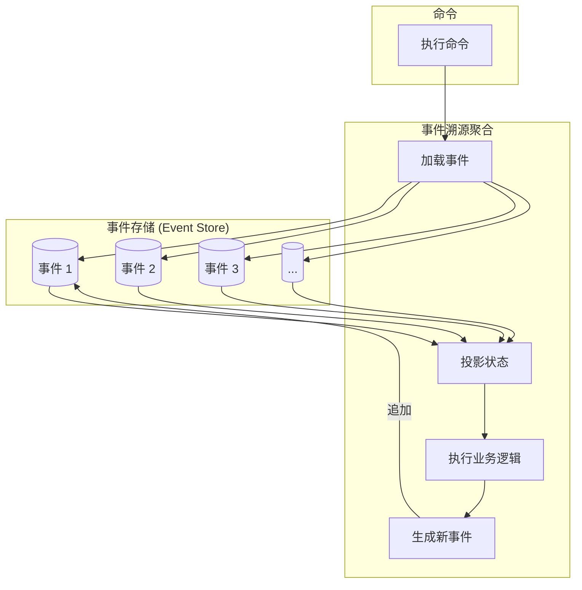
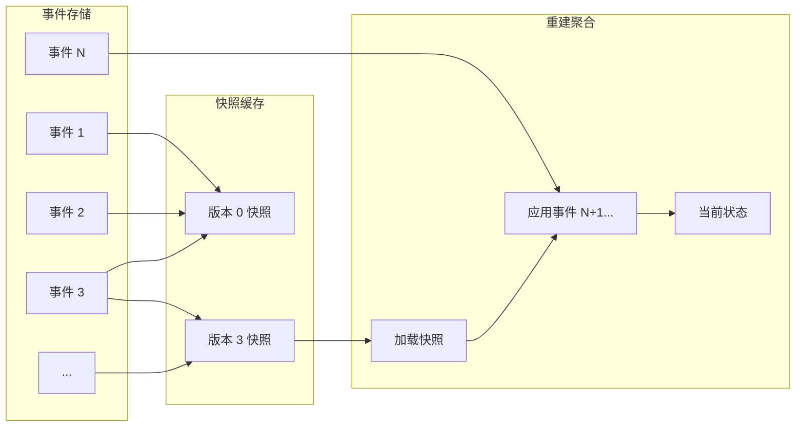
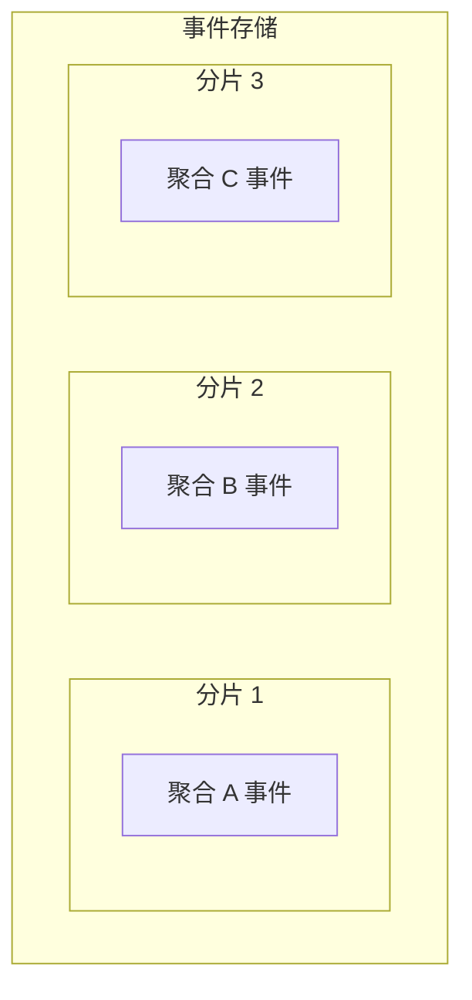

# 第7章：建模时间维度

> 上一章介绍了领域模型（Domain Model）模式：其构建块、目的和应用场景。事件溯源领域模型（event-sourced domain model）模式基于与领域模型相同的前提。同样，业务逻辑复杂且属于核心子域。此外，它使用与领域模型相同的战术模式：值对象、聚合和领域事件。两者的区别在于聚合状态的持久化方式：事件溯源领域模型使用事件溯源（event sourcing）模式管理聚合状态——不持久化聚合的当前状态，而是生成描述每次变更的领域事件，并将其作为聚合数据的唯一真实来源（source of truth）。

---

## 7.1 事件溯源

> 给我看你的流程图，却隐藏你的表，我仍会困惑。给我看你的表，我通常不需要你的流程图；一切将一目了然。
>
> —Fred Brooks¹

让我们用 Fred Brooks 的推理来定义事件溯源模式，并理解它与传统数据建模和持久化方式的差异。请审视表 7-1，分析你能从这些数据中了解到关于所属系统的哪些信息。

### 7.1.1 状态模型与事件模型的对比

表 7-1. 基于状态的模型（state-based model）

| id | first-name | last-name | status | phone-number | followup-on | created-on | updated-on |
|----|-------------|-----------|--------|---------------|-------------|------------|------------|
| 1 | Sean | Callahan | CONVERTED | 555-1246 | | 2019-01-31T10:02:40.32Z | 2019-01-31T10:02:40.32Z |
| 2 | Sarah | Estrada | CLOSED | 555-4395 | | 2019-03-29T22:01:41.44Z | 2019-03-29T22:01:41.44Z |
| 3 | Stephanie | Brown | CLOSED | 555-1176 | | 2019-04-15T23:08:45.59Z | 2019-04-15T23:08:45.59Z |
| 4 | Sami | Calhoun | CLOSED | 555-1850 | | 2019-04-25T05:42:17.07Z | 2019-04-25T05:42:17.07Z |
| 5 | William | Smith | CONVERTED | 555-3013 | | 2019-05-14T04:43:57.51Z | 2019-05-14T04:43:57.51Z |
| 6 | Sabri | Chan | NEW_LEAD | 555-2900 | | 2019-06-19T15:01:49.68Z | 2019-06-19T15:01:49.68Z |
| 7 | Samantha | Espinosa | NEW_LEAD | 555-8861 | | 2019-07-17T13:09:59.32Z | 2019-07-17T13:09:59.32Z |
| 8 | Hani | Cronin | CLOSED | 555-3018 | | 2019-10-09T11:40:17.13Z | 2019-10-09T11:40:17.13Z |
| 9 | Sian | Espinoza | FOLLOWUP_SET | 555-6461 | 2019-12-04T01:49:08.05Z | 2019-12-04T01:49:08.05Z | 2019-12-04T01:49:08.05Z |
| 10 | Sophia | Escamilla | CLOSED | 555-4090 | | 2019-12-06T09:12:32.56Z | 2019-12-06T09:12:32.56Z |
| 11 | William | White | FOLLOWUP_SET | 555-1187 | 2020-01-23T00:33:13.88Z | 2020-01-23T00:33:13.88Z | 2020-01-23T00:33:13.88Z |
| 12 | Casey | Davis | CONVERTED | 555-8101 | | 2020-05-20T09:52:55.95Z | 2020-05-27T12:38:44.12Z |
| 13 | Walter | Connor | NEW_LEAD | 555-4753 | | 2020-04-20T06:52:55.95Z | 2020-04-20T06:52:55.95Z |
| 14 | Sophie | Garcia | CONVERTED | 555-1284 | | 2020-05-06T18:47:04.70Z | 2020-05-06T18:47:04.70Z |
| 15 | Sally | Evans | PAYMENT_FAILED | 555-3230 | | 2020-06-04T14:51:06.15Z | 2020-06-04T14:51:06.15Z |
| 16 | Scott | Chatman | NEW_LEAD | 555-6953 | | 2020-06-09T09:07:05.23Z | 2020-06-09T09:07:05.23Z |
| 17 | Stephen | Pinkman | CONVERTED | 555-2326 | | 2020-07-20T00:56:59.94Z | 2020-07-20T00:56:59.94Z |
| 18 | Sara | Elliott | PENDING_PAYMENT | 555-2620 | | 2020-08-12T17:39:43.25Z | 2020-08-12T17:39:43.25Z |
| 19 | Sadie | Edwards | FOLLOWUP_SET | 555-8163 | 2020-10-22T12:40:03.98Z | 2020-10-22T12:40:03.98Z | 2020-10-22T12:40:03.98Z |
| 20 | William | Smith | PENDING_PAYMENT | 555-9273 | | 2020-11-13T08:14:07.17Z | 2020-11-13T08:14:07.17Z |

显然，该表用于在电话营销系统中管理潜在客户（leads）。对每个潜在客户，你可以看到其 ID、姓名、创建和更新时间、电话号码以及当前状态。

通过审视各种状态，我们还可以推断每个潜在客户所经历的处理周期：

- 销售流程从潜在客户处于 **NEW_LEAD**（新线索）状态开始。
- 销售电话可能以对方对产品不感兴趣（线索被 **CLOSED** 关闭）、安排回访（**FOLLOWUP_SET**）或接受报价（**PENDING_PAYMENT** 待付款）结束。
- 若付款成功，线索被 **CONVERTED**（转化）为客户。反之，付款可能失败——**PAYMENT_FAILED**（付款失败）。

仅通过分析表的结构和存储的数据，我们就能获得相当多的信息。我们甚至可以推断建模时使用的通用语言。但表中缺少哪些信息？

表中的数据记录了线索的**当前状态**，却缺失了每个线索如何到达当前状态的**过程**。我们无法分析线索生命周期中发生了什么。我们不知道在转化为客户之前进行了多少次电话联系。是立即成交，还是经历了漫长的销售旅程？基于历史数据，多次回访后是否值得继续联系，还是关闭线索转而跟进更有潜力的对象更高效？这些信息都不存在。我们只知道线索的当前状态。

这些问题反映了优化销售流程所必需的业务关切。从业务角度看，分析数据并根据经验优化流程至关重要。填补这些缺失信息的一种方式是使用**事件溯源**（event sourcing）。

事件溯源模式将**时间维度**引入数据模型。与用模式反映聚合当前状态不同，基于事件溯源的系统持久化的是记录聚合生命周期中每次变更的**事件**。

以表 7-1 第 12 行的 **CONVERTED** 客户为例，以下清单展示了该人在事件溯源系统中的数据表示：

```json
{
    "lead-id": 12,
    "event-id": 0,
    "event-type": "lead-initialized",
    "first-name": "Casey",
    "last-name": "David",
    "phone-number": "555-2951",
    "timestamp": "2020-05-20T09:52:55.95Z"
},
{
    "lead-id": 12,
    "event-id": 1,
    "event-type": "contacted",
    "timestamp": "2020-05-20T12:32:08.24Z"
},
{
    "lead-id": 12,
    "event-id": 2,
    "event-type": "followup-set",
    "followup-on": "2020-05-27T12:00:00.00Z",
    "timestamp": "2020-05-20T12:32:08.24Z"
},
{
    "lead-id": 12,
    "event-id": 3,
    "event-type": "contact-details-updated",
    "first-name": "Casey",
    "last-name": "Davis",
    "phone-number": "555-8101",
    "timestamp": "2020-05-20T12:32:08.24Z"
},
{
    "lead-id": 12,
    "event-id": 4,
    "event-type": "contacted",
    "timestamp": "2020-05-27T12:02:12.51Z"
},
{
    "lead-id": 12,
    "event-id": 5,
    "event-type": "order-submitted",
    "payment-deadline": "2020-05-30T12:02:12.51Z",
    "timestamp": "2020-05-27T12:02:12.51Z"
},
{
    "lead-id": 12,
    "event-id": 6,
    "event-type": "payment-confirmed",
    "status": "converted",
    "timestamp": "2020-05-27T12:38:44.12Z"
}
```

这些事件讲述了该客户的故事。线索在系统中创建（事件 0），约两小时后被销售代理联系（事件 1）。通话中约定一周后回电（事件 2），但回电号码不同（事件 3）。销售代理还修正了姓氏的拼写错误（事件 3）。在约定日期和时间进行了联系（事件 4），客户提交了订单（事件 5）。订单应在三天内付款（事件 5），但约半小时后收到付款（事件 6），线索被转化为新客户。

如前所述，客户的状态可以轻松地从这些领域事件中**投影**（project）出来。我们只需按顺序对每个事件应用简单的转换逻辑：

```csharp
public class LeadSearchModelProjection
{
    public long LeadId { get; private set; }
    public HashSet<string> FirstNames { get; private set; }
    public HashSet<string> LastNames { get; private set; }
    public HashSet<PhoneNumber> PhoneNumbers { get; private set; }
    public int Version { get; private set; }
    public void Apply(LeadInitialized @event)
    {
        LeadId = @event.LeadId;
        FirstNames = new HashSet<string>();
        LastNames = new HashSet<string>();
        PhoneNumbers = new HashSet<PhoneNumber>();
        FirstNames.Add(@event.FirstName);
        LastNames.Add(@event.LastName);
        PhoneNumbers.Add(@event.PhoneNumber);
        Version = 0;
    }
    public void Apply(ContactDetailsChanged @event)
    {
        FirstNames.Add(@event.FirstName);
        LastNames.Add(@event.LastName);
        PhoneNumbers.Add(@event.PhoneNumber);
        Version += 1;
    }
    public void Apply(Contacted @event)
    {
        Version += 1;
    }
    public void Apply(FollowupSet @event)
    {
        Version += 1;
    }
    public void Apply(OrderSubmitted @event)
    {
        Version += 1;
    }
    public void Apply(PaymentConfirmed @event)
    {
        Version += 1;
    }
}
```

遍历聚合的事件并依次传入 `Apply` 方法的相应重载，将精确生成表 7-1 中建模的状态表示。

注意 `Version` 字段在应用每个事件后递增。其值表示对业务实体所做的修改总数。此外，若我们只应用事件的子集，就可以「穿越时间」：通过仅应用相关事件，我们可以在生命周期的任意时点投影实体的状态。例如，若需要实体在版本 5 的状态，只需应用前五个事件。

最后，我们不仅限于从事件投影单一状态表示！考虑以下场景。

### 7.1.2 搜索

你需要实现搜索功能。然而，由于线索的联系信息（姓名、电话号码）可能被更新，销售代理可能不知道其他代理所做的更改，并希望使用包括历史值在内的联系信息来定位线索。我们可以轻松投影历史信息：

```csharp
public class LeadSearchModelProjection
{
    public long LeadId { get; private set; }
    public HashSet<string> FirstNames { get; private set; }
    public HashSet<string> LastNames { get; private set; }
    public HashSet<PhoneNumber> PhoneNumbers { get; private set; }
    public int Version { get; private set; }
    public void Apply(LeadInitialized @event)
    {
        LeadId = @event.LeadId;
        FirstNames = new HashSet<string>();
        LastNames = new HashSet<string>();
        PhoneNumbers = new HashSet<PhoneNumber>();
        FirstNames.Add(@event.FirstName);
        LastNames.Add(@event.LastName);
        PhoneNumbers.Add(@event.PhoneNumber);
        Version = 0;
    }
    public void Apply(ContactDetailsChanged @event)
    {
        FirstNames.Add(@event.FirstName);
        LastNames.Add(@event.LastName);
        PhoneNumbers.Add(@event.PhoneNumber);
        Version += 1;
    }
    public void Apply(Contacted @event)
    {
        Version += 1;
    }
    public void Apply(FollowupSet @event)
    {
        Version += 1;
    }
    public void Apply(OrderSubmitted @event)
    {
        Version += 1;
    }
    public void Apply(PaymentConfirmed @event)
    {
        Version += 1;
    }
}
```

投影逻辑使用 `LeadInitialized` 和 `ContactDetailsChanged` 事件填充线索个人详情的相应集合。其他事件被忽略，因为它们不影响该特定模型的状态。

将上述投影逻辑应用于前面 Casey Davis 的示例事件，将得到以下状态：

```text
LeadId: 12
FirstNames: ['Casey']
LastNames: ['David', 'Davis']
PhoneNumbers: ['555-2951', '555-8101']
Version: 6
```

### 7.1.3 分析

你的商业智能部门要求你提供更便于分析的线索数据表示。他们当前的研究需要获取为不同线索安排的跟进电话数量。之后他们将筛选已转化和已关闭的线索数据，并用该模型优化销售流程。让我们投影他们需要的数据：

```csharp
public class AnalysisModelProjection
{
    public long LeadId { get; private set; }
    public int Followups { get; private set; }
    public LeadStatus Status { get; private set; }
    public int Version { get; private set; }
    public void Apply(LeadInitialized @event)
    {
        LeadId = @event.LeadId;
        Followups = 0;
        Status = LeadStatus.NEW_LEAD;
        Version = 0;
    }
    public void Apply(Contacted @event)
    {
        Version += 1;
    }
    public void Apply(FollowupSet @event)
    {
        Status = LeadStatus.FOLLOWUP_SET;
        Followups += 1;
        Version += 1;
    }
    public void Apply(ContactDetailsChanged @event)
    {
        Version += 1;
    }
    public void Apply(OrderSubmitted @event)
    {
        Status = LeadStatus.PENDING_PAYMENT;
        Version += 1;
    }
    public void Apply(PaymentConfirmed @event)
    {
        Status = LeadStatus.CONVERTED;
        Version += 1;
    }
}
```

上述逻辑维护了线索事件中跟进事件出现次数的计数器。若将此类投影应用于聚合事件的示例，将生成以下状态：

```text
LeadId: 12
Followups: 1
Status: Converted
Version: 6
```

::: info 持久化投影
上述示例中的逻辑在内存中投影了针对搜索和分析优化的模型。然而，要实际实现所需功能，我们必须将投影模型持久化到数据库。在第 8 章，你将学习一种允许我们做到这一点的模式：命令查询职责分离（CQRS，Command-Query Responsibility Segregation）。

:::

### 7.1.4 唯一真实来源（Source of Truth）

为使事件溯源模式生效，对象状态的所有变更都应表示为事件并持久化。这些事件成为系统的**唯一真实来源**（source of truth，故名事件溯源）。该过程如图 7-1 所示。



图 7-1：事件溯源聚合

存储系统事件的数据库是唯一强一致存储：系统的唯一真实来源。用于持久化事件的数据库的通用名称是**事件存储**（event store）。

### 7.1.5 事件存储（Event Store）

事件存储不应允许修改或删除事件²，因为它是**仅追加**（append-only）存储。为支持事件溯源模式的实现，事件存储至少需要支持以下功能：获取属于特定业务实体的所有事件，以及追加事件。例如：

```csharp
interface IEventStore
{
    IEnumerable<Event> Fetch(Guid instanceId);
    void Append(Guid instanceId, Event[] newEvents, int expectedVersion);
}
```

`Append` 方法中的 `expectedVersion` 参数用于实现**乐观并发控制**（optimistic concurrency）：追加新事件时，你同时指定做出决策所基于的实体版本。若该版本已过时（即预期版本之后又添加了新事件），事件存储应抛出并发异常。

::: tip CQRS 扩展
在大多数系统中，实现 CQRS 模式还需要额外的接口，我们将在下一章讨论。

:::

::: info 金融业的先例
本质上，事件溯源模式并非新事物。金融业使用事件来表示账本中的变更。账本是一种仅追加的日志，记录交易。当前状态（如账户余额）始终可以通过「投影」账本记录推导得出。

:::

---

## 7.2 事件溯源领域模型（Event-Sourced Domain Model）

原始领域模型维护其聚合的状态表示并发出选定的领域事件。事件溯源领域模型**仅**使用领域事件来建模聚合的生命周期。聚合状态的所有变更都必须以领域事件表达。

对事件溯源聚合的每次操作遵循以下流程：

1. 加载聚合的领域事件。
2. 重建状态表示——将事件投影为可用于业务决策的状态表示。
3. 执行聚合的命令以执行业务逻辑，从而产生新的领域事件。
4. 将新的领域事件提交到事件存储。

回到第 6 章的 Ticket 聚合示例，我们看看它如何作为事件溯源聚合实现。

应用服务遵循前述流程：加载相关工单的事件、重新水合（rehydrate）聚合实例、调用相关命令，并将变更持久化回数据库：

```csharp
public class TicketAPI
{
    private ITicketsRepository _ticketsRepository;
    ...

    public void RequestEscalation(TicketId id, EscalationReason reason)
    {
        var events = _ticketsRepository.LoadEvents(id);
        var ticket = new Ticket(events);
        var originalVersion = ticket.Version;
        var cmd = new RequestEscalation(reason);
        ticket.Execute(cmd);
        _ticketsRepository.CommitChanges(ticket, originalVersion);
    }

    ...
}
```

Ticket 聚合的重新水合逻辑在构造函数中（第 27–31 行）：实例化状态投影类 `TicketState` 的实例，并依次对工单的每个事件调用其 `AppendEvent` 方法：

```csharp
public class Ticket
{
    ...
    private List<DomainEvent> _domainEvents = new List<DomainEvent>();
    private TicketState _state;
    ...

    public Ticket(IEnumerable<IDomainEvents> events)
    {
        _state = new TicketState();
        foreach (var e in events)
        {
            AppendEvent(e);
        }
    }
```

`AppendEvent` 将传入的事件传递给 `TicketState` 的投影逻辑，从而生成工单当前状态的内存表示：

```csharp
    private void AppendEvent(IDomainEvent @event)
    {
        _domainEvents.Append(@event);
        // 动态调用 "Apply" 方法的正确重载
        ((dynamic)_state).Apply((dynamic)@event);
    }
```

与上一章看到的实现不同，事件溯源聚合的 `RequestEscalation` 方法不会显式将 `IsEscalated` 标志设为 `true`。相反，它实例化相应的事件并传递给 `AppendEvent` 方法（第 43–44 行）：

```csharp
    public void Execute(RequestEscalation cmd)
    {
        if (!_state.IsEscalated && _state.RemainingTimePercentage <= 0)
        {
            var escalatedEvent = new TicketEscalated(_id, cmd.Reason);
            AppendEvent(escalatedEvent);
        }
    }
    
    ...
}
```

添加到聚合事件集合中的所有事件都会传递给 `TicketState` 类中的状态投影逻辑，相关字段的值根据事件数据被修改：

```csharp
public class TicketState
{
    public TicketId Id { get; private set; }
    public int Version { get; private set; }
    public bool IsEscalated { get; private set; }
    ...
    public void Apply(TicketInitialized @event)
    {
        Id = @event.Id;
        Version = 0;
        IsEscalated = false;
        ....
    }

    public void Apply(TicketEscalated @event)
    {
        IsEscalated = true;
        Version += 1;
    }

    ...
}
```

### 7.2.1 为何叫「事件溯源领域模型」？

我有必要解释为何使用「事件溯源领域模型」而非仅「事件溯源」。用事件表示状态转换——事件溯源模式——可以在有或没有领域模型构建块的情况下实现。因此，我倾向于使用更长的术语，以明确表示我们正在使用事件溯源来表示领域模型聚合生命周期中的变更。

### 7.2.2 优势

与将聚合当前状态持久化到数据库的传统模型相比，事件溯源领域模型需要更多精力来建模聚合。然而，这种方法带来了显著优势，使该模式在许多场景中值得考虑：

| 优势 | 描述 |
|------|------|
| **时间穿越** | 正如领域事件可用于重建聚合的当前状态，它们也可用于恢复聚合的所有过去状态。换言之，你始终可以重建聚合的所有历史状态。这在分析系统行为、检查系统决策和优化业务逻辑时常用。另一个常见用例是**追溯调试**（retroactive debugging）：你可以将聚合还原到观察到 bug 时的精确状态。 |
| **深度洞察** | 在本书第一部分，我们看到优化核心子域对业务具有战略重要性。事件溯源提供对系统状态和行为的深度洞察。如本章前面所述，事件溯源提供灵活的模型，允许将事件转换为不同的状态表示——你始终可以添加新的投影，利用现有事件数据提供额外洞察。 |
| **审计日志** | 持久化的领域事件代表聚合状态所发生一切的强一致**审计日志**（audit log）。某些业务领域依法必须实现此类审计日志，事件溯源开箱即用。该模型特别适合管理资金或货币交易的系统，使我们能轻松追踪系统决策和资金在账户间的流动。 |
| **高级乐观并发控制** | 经典乐观并发模型在读取的数据在写入期间变陈旧（被另一进程覆盖）时抛出异常。使用事件溯源时，我们可以更深入地了解在读取现有事件和写入新事件之间究竟发生了什么。你可以查询并发追加到事件存储的确切事件，并基于业务领域做出决策：新事件是否与尝试的操作冲突，或额外事件无关且可以安全继续。 |

### 7.2.3 劣势

到目前为止，事件溯源领域模型似乎可能是实现业务逻辑的终极模式，因此应尽可能频繁使用。当然，这将违背让业务领域需求驱动设计决策的原则。因此，让我们讨论该模式带来的一些挑战：

| 劣势 | 描述 |
|------|------|
| **学习曲线** | 该模式明显的劣势在于它与传统数据管理技术的显著差异。成功实现该模式需要团队培训和时间适应新的思维方式。除非团队已有实现事件溯源系统的经验，否则必须考虑学习曲线。 |
| **模型演进** | 演进事件溯源模型可能具有挑战性。事件溯源的严格定义是事件不可变。但若你需要调整事件的模式怎么办？该过程不像修改表结构那样简单。事实上，仅此主题就有一整本书：Greg Young 的 *Versioning in an Event Sourced System*。 |
| **架构复杂度** | 事件溯源的实现引入了众多架构「移动部件」，使整体设计更加复杂。该主题将在下一章讨论 CQRS 架构时更详细地介绍。 |

::: warning 模式适用性
若当前任务不足以证明使用该模式的合理性，而可以用更简单的设计解决，这些挑战会更加突出。在第 10 章，你将学习有助于决定使用哪种业务逻辑实现模式的简单经验法则。

:::

---

## 7.3 常见问题（Frequently Asked Questions）

当工程师接触事件溯源模式时，他们通常会提出几个常见问题，因此我认为有必要在本章中予以解答。

### 7.3.1 性能

**从事件重建聚合状态会对系统性能产生负面影响。随着事件增加，性能会下降。这怎么可能行得通？**

将事件投影为状态表示确实需要计算能力，且随着更多事件添加到聚合列表，这种需求会增长。

对投影对性能的影响进行基准测试很重要：处理数百或数千个事件的效果。结果应与聚合的预期生命周期——平均生命周期内预期记录的事件数量——进行比较。

在大多数系统中，性能影响只有在每个聚合超过 10,000+ 个事件时才会明显。也就是说，在绝大多数系统中，聚合的平均生命周期不会超过 100 个事件。

在投影状态确实成为性能问题的罕见情况下，可以实现另一种模式：**快照**（snapshot）。该模式如图 7-2 所示，实现以下步骤：

- 一个进程持续遍历事件存储中的新事件，生成相应的投影，并将其存储在缓存中。
- 若需要对聚合执行操作，则需要内存中的投影。此时：
  - 进程从缓存获取当前状态投影。
  - 进程从事件存储获取快照版本之后的事件。
  - 将额外事件在内存中应用到快照上。



图 7-2：对聚合事件进行快照

值得重申的是，快照模式是一种必须证明合理的优化。若你系统中的聚合不会持久化 10,000+ 个事件，实现快照模式只是偶然复杂度。但在实现快照模式之前，我建议你退一步，再次检查聚合的边界。

### 7.3.2 可扩展性

该模型会生成大量数据。它能扩展吗？

事件溯源模型易于扩展。由于所有与聚合相关的操作都在单个聚合的上下文中完成，事件存储可以按聚合 ID 分片：属于聚合实例的所有事件应驻留在单个分片中（见图 7-3）。



图 7-3：事件存储分片

### 7.3.3 删除数据

事件存储是仅追加的数据库，但若我确实需要物理删除数据怎么办？例如，为遵守 GDPR³？

该需求可以通过**可遗忘负载模式**（forgettable payload pattern）解决：所有敏感信息以加密形式包含在事件中。加密密钥存储在外部键值存储中：**密钥存储**（key storage），其中键是特定聚合的 ID，值是加密密钥。当需要删除敏感数据时，从密钥存储中删除加密密钥。因此，事件中包含的敏感信息将不再可访问。

### 7.3.4 为什么不能……？

为什么不能只是将日志写入文本文件并用作审计日志？

同时向操作数据库和日志文件写入数据是一种容易出错的操作。本质上，这是针对两种存储机制（数据库和文件）的事务。若第一个失败，第二个必须回滚。例如，若数据库事务失败，没人会去删除之前的日志消息。因此，此类日志不是一致的，而是最终不一致的。

为什么不能继续使用基于状态的模型，但在同一数据库事务中向日志表追加日志？

从基础设施角度看，这种方法确实提供了状态和日志记录之间的一致同步。然而，它仍然容易出错。若将来维护代码库的工程师忘记追加适当的日志记录怎么办？

此外，当基于状态的表示被用作唯一真实来源时，额外日志表的模式通常会迅速退化为混乱。无法强制要求所有必需信息都被写入，且以正确格式写入。

为什么不能继续使用基于状态的模型，但添加一个数据库触发器，在记录变更时将其快照复制到专用的「历史」表？

这种方法克服了前一种的缺点：不需要显式手动调用来向日志表追加记录。也就是说，所得的历史仅包含干巴巴的事实：哪些字段被更改了。它缺少业务上下文：**为什么**这些字段被更改了。「为什么」的缺失严重限制了投影额外模型的能力。

---

## 7.4 练习

1. 关于领域事件与值对象之间的关系，以下哪项陈述是正确的？
   - a. 领域事件使用值对象来描述业务领域中发生的情况。
   - b. 实现事件溯源领域模型时，值对象应重构为事件溯源聚合。
   - c. 值对象与领域模型模式相关，在事件溯源领域模型中被领域事件取代。
   - d. 以上陈述均不正确。

2. 关于从一系列事件投影状态的选项，以下哪项陈述是正确的？
   - a. 只能从聚合的事件投影单一状态表示。
   - b. 可以投影多种状态表示，但领域事件必须以支持多种投影的方式建模。
   - c. 可以投影多种状态表示，且你始终可以在未来添加额外的投影。
   - d. 以上陈述均不正确。

3. 关于基于状态的聚合与事件溯源聚合之间的差异，以下哪项陈述是正确的？
   - a. 事件溯源聚合可以产生领域事件，而基于状态的聚合不能产生领域事件。
   - b. 两种聚合模式变体都会产生领域事件，但只有事件溯源聚合将领域事件用作唯一真实来源。
   - c. 事件溯源聚合确保为每次状态转换生成领域事件。
   - d. B 和 C 均正确。

4. 回到本书前言中描述的 WolfDesk 公司，系统的哪些功能适合实现为事件溯源领域模型？

---

¹ Brooks, F. P. Jr. (1974). *The Mythical Man-Month: Essays on Software Engineering*. Reading, MA: Addison-Wesley.

² 除特殊情况外，如数据迁移。

³ 通用数据保护条例（General Data Protection Regulation）。参见 Wikipedia。

---

## 本章小结

本章解释了**事件溯源**（Event Sourcing）模式及其在领域模型聚合中建模时间维度的应用。

在事件溯源领域模型中，聚合状态的所有变更都表达为一系列领域事件。这与更传统的方法形成对比——在传统方法中，状态变更只是更新数据库中的一条记录。所得的领域事件可用于投影聚合的当前状态。此外，基于事件的模型使我们能够灵活地将事件投影为多种表示模型，每种都针对特定任务进行优化。

该模式适用于对系统数据有深度洞察至关重要的场景，无论是用于分析和优化，还是因为法律要求审计日志。

本章完成了我们对建模和实现业务逻辑不同方式的探索。下一章，我们将把注意力转向更高层次的模式：架构模式。

[← 上一章：处理复杂业务逻辑](ch06-tackling-complex-business-logic.md) | [返回目录](../index.md) | [下一章：架构模式 →](ch08-architectural-patterns.md)
