# 第8章：架构模式

> 本书迄今讨论的战术模式定义了建模和实现业务逻辑的不同方式。本章将在更广阔的背景下探讨战术设计决策：编排系统组件之间的交互与依赖的不同方式。

---

## 8.1 业务逻辑与架构模式

业务逻辑是软件中最重要的部分，但它并非软件系统的全部。为实现功能性和非功能性需求，代码库需要承担更多职责：与用户交互以收集输入和提供输出，使用不同的存储机制持久化状态，并与外部系统和信息提供方集成。

代码库需要应对的各类关注点，很容易导致业务逻辑在组件间**弥散**（diffused）：部分逻辑可能实现在用户界面或数据库中，或在不同组件中重复。缺乏对实现关注点的严格组织，会使代码库难以变更。当业务逻辑需要变更时，可能不清楚代码库的哪些部分会受影响；变更可能对看似无关的系统部分产生意外影响；反之，也可能遗漏本应修改的代码。这些问题都会显著提高代码库的维护成本。

**架构模式**（architectural patterns）为代码库的不同方面引入组织原则，并在它们之间建立清晰边界：业务逻辑如何与系统的输入、输出及其他基础设施组件连接。这会影响这些组件之间的交互方式：它们共享哪些知识，以及组件如何相互引用。

选择恰当的组织代码库的方式，即正确的架构模式，对于在短期内支持业务逻辑的实现、在长期内降低维护负担至关重要。下面我们将探讨三种主流的应用架构模式及其使用场景：**分层架构**（layered architecture）、**端口与适配器**（ports & adapters）和 **CQRS**。

---

## 8.2 分层架构

分层架构是最常见的架构模式之一。它将代码库组织为水平层，每层对应以下技术关注点之一：与消费者的交互、业务逻辑的实现、数据的持久化。如图 8-1 所示。

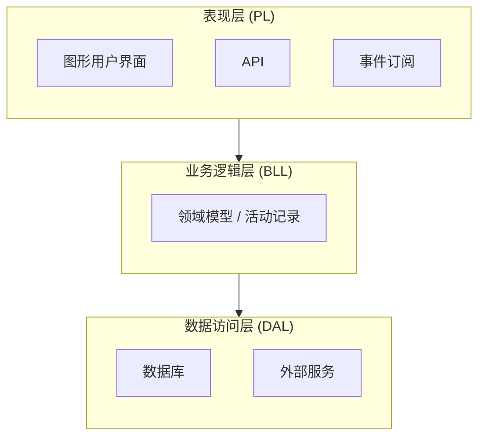

图 8-1：分层架构

在经典形式下，分层架构由三层组成：**表现层**（presentation layer, PL）、**业务逻辑层**（business logic layer, BLL）和**数据访问层**（data access layer, DAL）。

### 8.2.1 表现层

表现层（图 8-2）实现程序与消费者交互的用户界面。在模式的原始形式中，该层指图形界面，如 Web 界面或桌面应用。

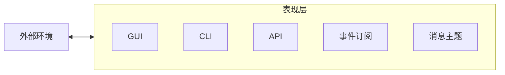

图 8-2：表现层

在现代系统中，表现层的范围更广：即所有触发程序行为的手段，包括同步和异步。例如：

- 图形用户界面（GUI）
- 命令行界面（CLI）
- 与其他系统进行程序化集成的 API
- 消息代理中的事件订阅
- 发布出站事件的消息主题

以上都是系统从外部环境接收请求并传递输出的手段。严格来说，表现层是程序的**公共接口**（public interface）。

### 8.2.2 业务逻辑层

顾名思义，该层负责实现和封装程序的业务逻辑。业务决策在此实现。正如 Eric Evans 所言¹，该层是软件的核心。

本书第 5–7 章描述的业务逻辑模式在此实现——例如活动记录（active record）或领域模型（domain model）（见图 8-3）。

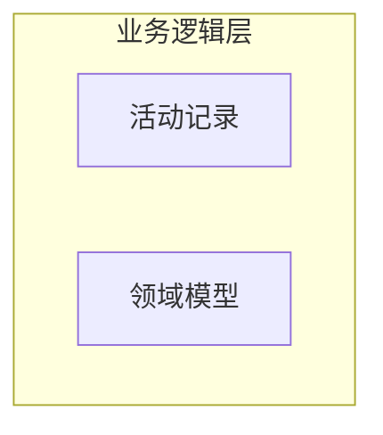

图 8-3：业务逻辑层

### 8.2.3 数据访问层

数据访问层提供对持久化机制的访问。在模式的原始形式中，这指系统的数据库。然而，与表现层一样，在现代系统中该层的职责更广。

首先，自 NoSQL 革命以来，系统通常与多个数据库协作。例如，文档存储可作为操作数据库，搜索索引用于动态查询，内存数据库用于性能优化操作。

其次，传统数据库并非存储信息的唯一媒介。例如，基于云的对象存储²可用于存储系统文件，消息总线可用于编排程序不同功能之间的通信³。

最后，该层还包括与实现程序功能所需的各种外部信息提供方的集成：外部系统提供的 API，或云厂商的托管服务，如语言翻译、股市数据、音频转写等（见图 8-4）。

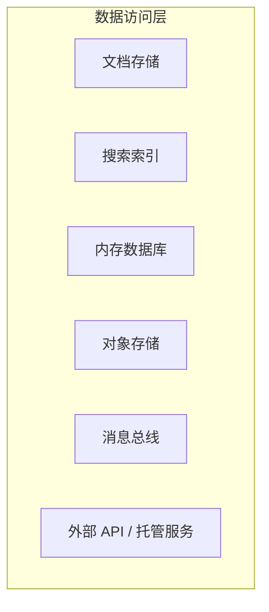

图 8-4：数据访问层

### 8.2.4 层间通信

各层按自上而下的通信模型集成：每层只能依赖紧邻其下的层，如图 8-5 所示。这实现了实现关注点的解耦，并减少了层间共享的知识。在图 8-5 中，表现层仅引用业务逻辑层，对数据访问层的设计决策一无所知。

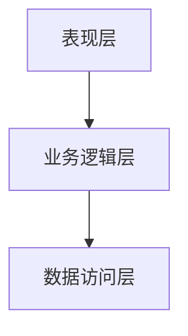

图 8-5：分层架构（层间通信）

### 8.2.5 变体：服务层

分层架构模式常被扩展为增加一层：**服务层**（service layer）。

::: tip 服务层
通过建立一组可用操作并协调每个操作中应用响应的服务层，定义应用的边界。
—《企业应用架构模式》⁴

:::

服务层充当程序表现层与业务逻辑层之间的中介。考虑以下代码：

```csharp
namespace MvcApplication.Controllers
{
    public class UserController: Controller
    {
        ...
        [AcceptVerbs(HttpVerbs.Post)]
        public ActionResult Create(ContactDetails contactDetails)
        {
            OperationResult result = null;
            try
            {
                _db.StartTransaction();
                
                var user = new User();
                user.SetContactDetails(contactDetails)
                user.Save();
                
                _db.Commit();
                result = OperationResult.Success;
            } catch (Exception ex) {
                _db.Rollback();
                result = OperationResult.Exception(ex);
            }
            return View(result);
        }
    }
}
```

此例中的 MVC 控制器属于表现层。它暴露一个创建新用户的端点。该端点使用 User 活动记录对象创建新实例并保存。此外，它编排数据库事务，以确保在出错时生成适当的响应。

为进一步解耦表现层与底层业务逻辑，可将此类编排逻辑移入服务层，如图 8-6 所示。

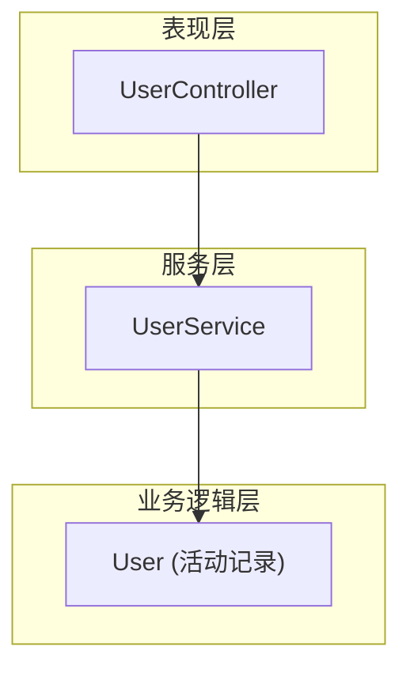

图 8-6：服务层

需要指出的是，在架构模式的语境下，服务层是**逻辑边界**，而非物理服务。

服务层充当业务逻辑层的**外观**（façade）：它暴露与公共接口方法对应的接口，封装对底层层所需的编排。例如：

```csharp
interface CampaignManagementService
{
  OperationResult CreateCampaign(CampaignDetails details);
  OperationResult Publish(CampaignId id, PublishingSchedule schedule);
  OperationResult Deactivate(CampaignId id);
  OperationResult AddDisplayLocation(CampaignId id, DisplayLocation newLocation);  
  ...
}
```

上述所有方法都对应系统的公共接口。但它们不包含表现相关的实现细节。表现层的职责仅限于向服务层提供所需输入，并将其响应传回调用方。

下面将前述示例重构，把编排逻辑提取到服务层：

```csharp
namespace ServiceLayer
{
    public class UserService
    {
        ...
        
        public OperationResult Create(ContactDetails contactDetails)
        {
            OperationResult result = null;
            try
            {
                _db.StartTransaction();
                
                var user = new User();
                user.SetContactDetails(contactDetails)
                user.Save();
                _db.Commit();
                result = OperationResult.Success;
            } catch (Exception ex) {
                _db.Rollback();
                result = OperationResult.Exception(ex);
            }
            return result;
        }
        ...
    }
}
namespace MvcApplication.Controllers
{
    public class UserController: Controller
    {
        ...
        [AcceptVerbs(HttpVerbs.Post)]
        public ActionResult Create(ContactDetails contactDetails)
        {
            var result = _userService.Create(contactDetails);
            return View(result);
        }
    }
}
```

拥有显式的服务层具有若干优势：

- 可复用同一服务层服务多个公共接口，例如图形用户界面和 API，无需重复编排逻辑。
- 通过将相关方法集中在一处，提高模块化。
- 进一步解耦表现层与业务逻辑层。
- 更易于测试业务功能。

话虽如此，服务层并非总是必要。例如，当业务逻辑以事务脚本（transaction script）实现时，它本质上就是服务层，因为已经暴露了一组构成系统公共接口的方法。在这种情况下，服务层的 API 只会重复事务脚本的公共接口，而不会抽象或封装任何复杂性。因此，服务层或业务逻辑层二者择一即可。

另一方面，当业务逻辑模式需要外部编排时（如活动记录模式），服务层是必需的。此时，服务层实现事务脚本模式，而它操作的活动记录位于业务逻辑层。

### 8.2.6 术语

在其他地方，你可能会遇到分层架构的其他术语：

| 本书术语 | 其他常见术语 |
|---------|-------------|
| 表现层 | 用户界面层 |
| 服务层 | 应用层 |
| 业务逻辑层 | 领域层 = 模型层 |
| 数据访问层 | 基础设施层 |

为消除混淆，本书使用原始术语。但我更偏好「用户界面层」和「基础设施层」，因为这些术语更能反映现代系统的职责；以及「应用层」以避免与服务的物理边界混淆。

### 8.2.7 何时使用分层架构

业务逻辑层与数据访问层之间的依赖关系，使该架构模式适合使用**事务脚本**或**活动记录**模式实现业务逻辑的系统。

然而，该模式使领域模型的实现颇具挑战。在领域模型中，业务实体（聚合和值对象）不应依赖或了解底层基础设施。分层架构的自上而下依赖需要绕不少弯才能满足这一要求。在分层架构中实现领域模型仍然可行，但下一节讨论的模式更为契合。

### 8.2.8 可选：层与分层

分层架构常与 N 层架构（N-Tier architecture）混淆，反之亦然。尽管两种模式相似，**层**（layer）与**分层**（tier）在概念上不同：层是逻辑边界，而分层是物理边界。分层架构中的所有层受同一生命周期约束：它们作为一个单元实现、演进和部署。而分层是独立可部署的服务、服务器或系统。例如，考虑图 8-7 中的 N 层系统。

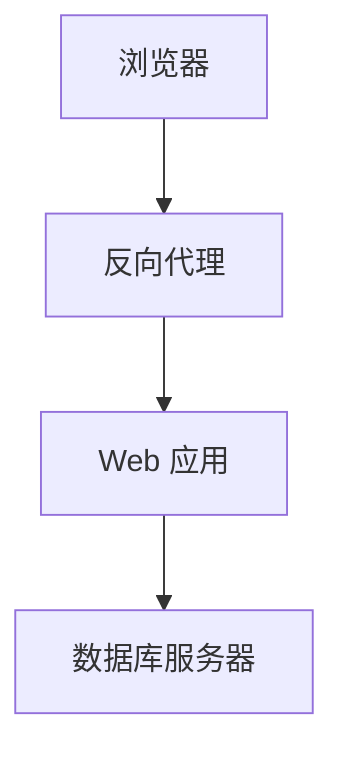

图 8-7：N 层系统

该系统描绘了基于 Web 系统中涉及的物理服务之间的集成。消费者使用浏览器（可运行于台式机或移动设备）。浏览器与反向代理交互，后者将请求转发给实际 Web 应用。Web 应用运行在 Web 服务器上，并与数据库服务器通信。这些组件可能运行在同一物理服务器上（如容器），或分布在多台服务器上。然而，由于每个组件可独立于其余部分部署和管理，它们是分层而非层。

层则是 Web 应用内部的逻辑边界。

---

## 8.3 端口与适配器

端口与适配器架构解决了分层架构的不足，更适合实现更复杂的业务逻辑。有趣的是，两种模式颇为相似。让我们将分层架构「重构」为端口与适配器。

### 8.3.1 术语

本质上，表现层和数据访问层都代表与外部组件的集成：数据库、外部服务、用户界面框架。这些技术实现细节并不反映系统的业务逻辑；因此，让我们将所有此类基础设施关注点统一为单一的「基础设施层」，如图 8-8 所示。

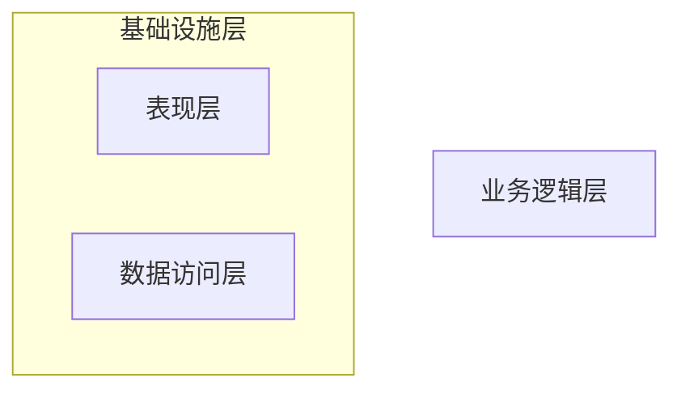

图 8-8：表现层与数据访问层合并为基础设施层

### 8.3.2 依赖倒置原则

**依赖倒置原则**（Dependency Inversion Principle, DIP）指出：实现业务逻辑的高层模块不应依赖低层模块。然而，传统分层架构中恰恰如此——业务逻辑层依赖基础设施层。为符合 DIP，让我们反转这一关系，如图 8-9 所示。

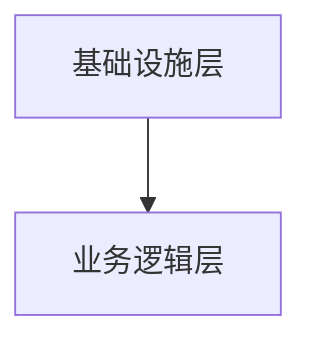

图 8-9：反转后的依赖关系

业务逻辑层不再夹在技术关注点之间，而是占据中心角色。它不依赖系统的任何基础设施组件。

最后，添加一个应用层⁵作为系统公共接口的外观。与分层架构中的服务层一样，它描述系统暴露的所有操作，并编排系统的业务逻辑以执行它们。所得架构如图 8-10 所示。

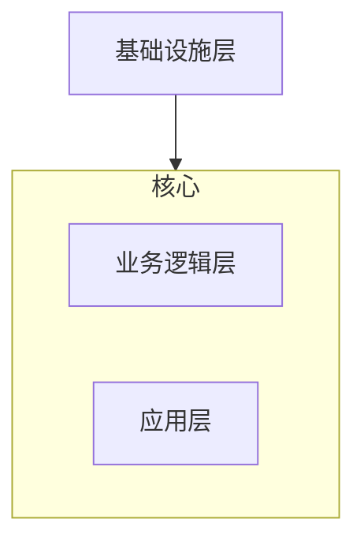

图 8-10：端口与适配器架构的传统层

图 8-10 所描绘的架构即为**端口与适配器**架构模式。业务逻辑不依赖任何底层层，符合实现领域模型和事件溯源领域模型模式的要求。

为何该模式称为端口与适配器？为回答这个问题，我们来看基础设施组件如何与业务逻辑集成。

### 8.3.3 基础设施组件的集成

端口与适配器架构的核心目标是**解耦**系统的业务逻辑与基础设施组件。

业务逻辑层不直接引用和调用基础设施组件，而是定义必须由基础设施层实现的「**端口**」（ports）。基础设施层实现「**适配器**」（adapters）：针对不同技术的端口接口的具体实现（见图 8-11）。

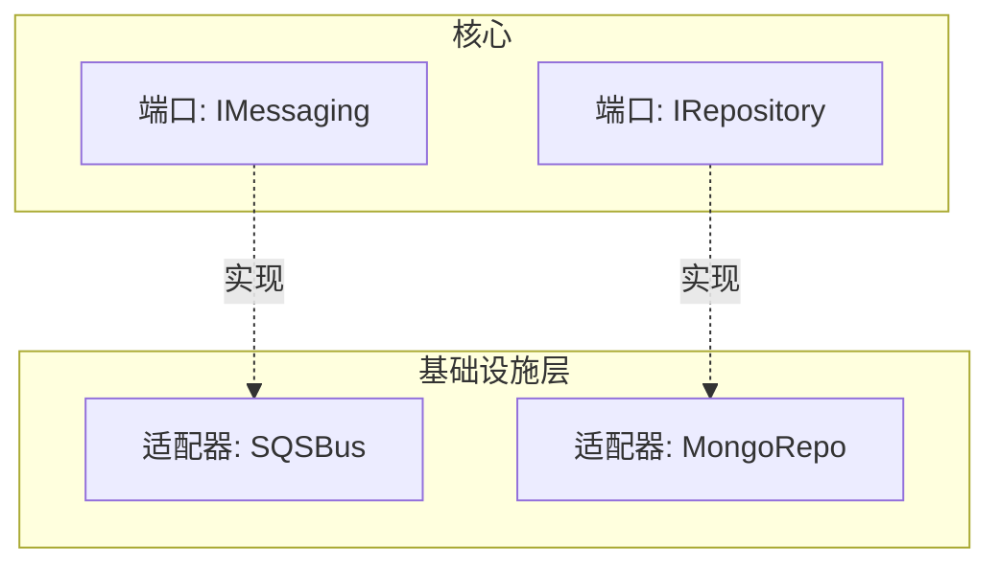

图 8-11：端口与适配器架构

抽象端口通过依赖注入或引导（bootstrapping）在基础设施层解析为具体适配器。

例如，以下是消息总线的端口定义和具体适配器：

```csharp
namespace App.BusinessLogicLayer
{
    public interface IMessaging
    {
        void Publish(Message payload);
        void Subscribe(Message type, Action callback);
    }
}
namespace App.Infrastructure.Adapters
{
    public class SQSBus: IMessaging { ... }
}
```

### 8.3.4 变体

端口与适配器架构也被称为**六边形架构**（hexagonal architecture）、**洋葱架构**（onion architecture）和**整洁架构**（clean architecture）。这些模式基于相同的设计原则，具有相同的组件和相同的组件间关系，但如分层架构一样，术语可能不同：

- 应用层 = 服务层 = 用例层
- 业务逻辑层 = 领域层 = 核心层

尽管如此，这些模式可能被误认为概念上不同。这再次说明了通用语言（ubiquitous language）的重要性。

### 8.3.5 何时使用端口与适配器

业务逻辑与所有技术关注点的解耦，使端口与适配器架构非常适合使用**领域模型**模式实现业务逻辑的场景。

---

## 8.4 命令查询职责分离（CQRS）

**命令查询职责分离**（Command-Query Responsibility Segregation, CQRS）模式在业务逻辑与基础设施关注点的组织原则上与端口与适配器相同，但在系统数据的管理方式上有所不同。该模式支持以多种持久化模型表示系统数据。

### 8.4.1 多语言建模

在许多情况下，使用单一业务领域模型来满足系统的所有需求可能很困难，甚至不可能。例如，如第 7 章所述，联机事务处理（OLTP）和联机分析处理（OLAP）可能需要数据的不同表示。

使用多种模型的另一个原因可能与**多语言持久化**（polyglot persistence）的概念有关。没有完美的数据库。或者，如 Greg Young⁶ 所言，所有数据库都有缺陷，各有各的问题：我们往往需要在扩展性、一致性或支持的查询模型之间权衡。寻找完美数据库的替代方案是**多语言持久化模型**：使用多个数据库实现不同的数据相关需求。例如，单一系统可能使用文档存储作为操作数据库，列存储用于分析/报表，搜索引擎实现强大的搜索能力。

最后，CQRS 模式与事件溯源密切相关。最初，CQRS 被定义为解决事件溯源模型有限的查询能力：一次只能查询一个聚合实例的事件。CQRS 模式提供了将投影模型物化到物理数据库的可能性，从而支持灵活的查询选项。

话虽如此，本章将 CQRS 与事件溯源「解耦」。我旨在表明，即使业务逻辑使用其他业务逻辑实现模式，CQRS 仍然有用。

下面我们来看 CQRS 如何允许使用多种存储机制表示系统数据的不同模型。

### 8.4.2 实现

顾名思义，该模式**隔离**（segregate）系统模型的职责。有两种类型的模型：**命令执行模型**（command execution model）和**读模型**（read models）。

#### 命令执行模型

CQRS 将单一模型专用于执行修改系统状态的操作（系统命令）。该模型用于实现业务逻辑、验证规则和执行不变式。

命令执行模型也是唯一表示**强一致性**（strongly consistent）数据的模型——系统的**唯一真实来源**（source of truth）。应能读取业务实体的强一致状态，并在更新时支持乐观并发。

#### 读模型（投影）

系统可定义任意数量的模型，用于向用户呈现数据或向其他系统提供信息。

读模型是**预缓存投影**（precached projection）。它可驻留在持久化数据库、平面文件或内存缓存中。CQRS 的正确实现允许清除投影的所有数据并从零重新生成。这也使系统能在未来扩展额外投影——最初无法预见的模型。

最后，读模型是只读的。系统的任何操作都不能直接修改读模型的数据。

### 8.4.3 投影读模型

为使读模型工作，系统必须将命令执行模型的变更投影到所有读模型。这一概念如图 8-12 所示。

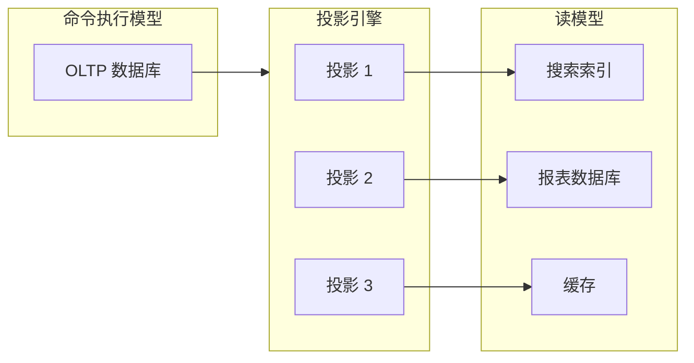

图 8-12：CQRS 架构

读模型的投影类似于关系数据库中**物化视图**（materialized view）的概念：每当源表更新时，变更必须反映在预缓存视图中。

下面介绍两种生成投影的方式：同步和异步。

#### 同步投影

同步投影通过**追赶订阅**（catch-up subscription）模型获取 OLTP 数据的变更：

- 投影引擎查询 OLTP 数据库，获取上次处理检查点之后新增或更新的记录。
- 投影引擎使用更新后的数据重新生成/更新系统的读模型。
- 投影引擎存储最后处理记录的检查点。该值将在下次迭代中用于获取上次处理记录之后新增或修改的记录。

该过程如图 8-13 和 8-14 的序列图所示。

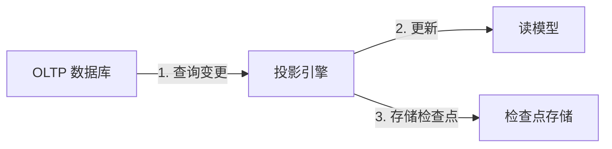

图 8-13：同步投影模型

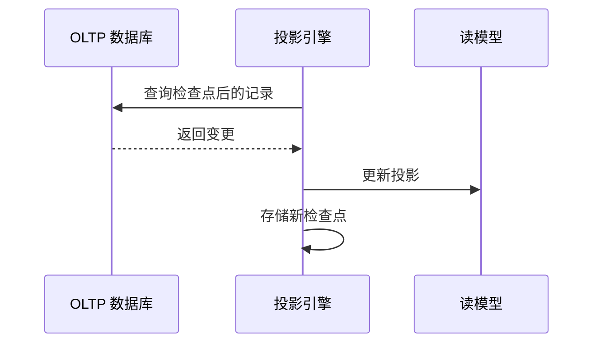

图 8-14：通过追赶订阅同步投影读模型

为使追赶订阅工作，命令执行模型必须对追加或更新的数据库记录进行**检查点**（checkpoint）。存储机制还应支持基于检查点的记录查询。

检查点可使用数据库特性实现。例如，SQL Server 的「rowversion」列可在插入或更新行时生成唯一递增数字，如图 8-15 所示。在缺乏此类功能的数据库中，可实现自定义方案：递增运行计数器并将其附加到每条修改记录。重要的是确保基于检查点的查询返回一致结果。如果最后返回记录的检查点值为 10，下次执行时不应有值低于 10 的新请求；否则这些记录将被投影引擎跳过，导致模型不一致。

图 8-15：关系数据库中自动生成的检查点列

同步投影方法使添加新投影和从零重新生成现有投影变得简单。对于后者，只需将检查点重置为 0；投影引擎将扫描记录并从零重建投影。

#### 异步投影

在异步投影场景中，命令执行模型将所有已提交的变更发布到消息总线。系统的投影引擎可订阅发布的消息，并用其更新读模型，如图 8-16 所示。

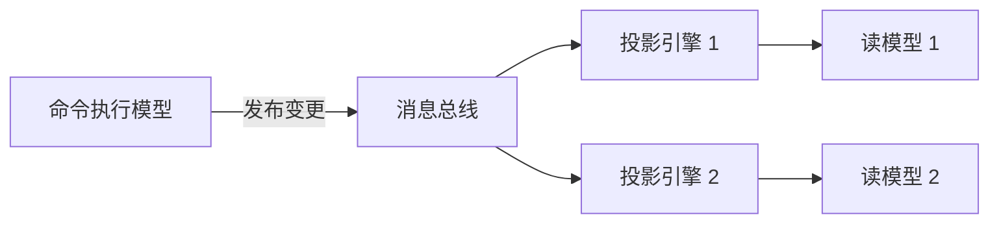

图 8-16：读模型的异步投影

### 8.4.4 挑战

尽管异步投影方法在扩展性和性能上具有明显优势，但它更容易受到分布式计算挑战的影响。如果消息乱序处理或重复，不一致的数据将被投影到读模型中。

该方法也使添加新投影或重新生成现有投影更具挑战性。

因此，建议始终实现同步投影，并可选择在其之上额外实现异步投影。

### 8.4.5 模型隔离

在 CQRS 架构中，系统模型的职责按其类型隔离。命令只能操作强一致性的命令执行模型。查询不能直接修改系统的任何持久化状态——既不能修改读模型，也不能修改命令执行模型。

关于基于 CQRS 系统的一个常见误解是：命令只能修改数据，而数据只能通过读模型获取用于展示。换言之，执行命令的方法不应返回任何数据。这是错误的。这种方法会产生意外复杂性并导致糟糕的用户体验。

命令应始终让调用方知道它是成功还是失败。如果失败，原因是什么？是验证问题还是技术问题？调用方需要知道如何修复命令。因此，命令可以——在许多情况下应该——返回数据；例如，如果系统的用户界面需要反映命令产生的修改。这不仅使消费者更容易使用系统，因为他们能立即获得操作的反馈，而且返回值可在消费者的工作流中进一步使用，消除不必要的数据往返。

唯一的限制是：返回的数据应来自强一致性模型——命令执行模型——因为我们不能期望最终一致的投影会立即刷新。

### 8.4.6 何时使用 CQRS

CQRS 模式适用于需要以多种模型（可能存储在不同类型的数据库中）处理相同数据的应用。从运营角度看，该模式支持领域驱动设计的核心价值：使用最有效的模型完成手头任务，并持续改进业务领域模型。从基础设施角度看，CQRS 允许发挥不同类型数据库的优势；例如，使用关系数据库存储命令执行模型，搜索索引用于全文搜索，预渲染平面文件用于快速数据检索，所有存储机制可靠同步。

此外，CQRS 天然适合事件溯源领域模型。事件溯源模型无法基于聚合状态查询记录，但 CQRS 通过将状态投影到可查询数据库实现了这一点。

### 8.4.7 作用范围

我们讨论的模式——分层架构、端口与适配器架构和 CQRS——不应被视为系统级的组织原则。它们也不一定是整个限界上下文的高级架构模式。

考虑一个包含多个子域的限界上下文，如图 8-17 所示。子域可以是不同类型：核心、支撑或通用。即使同一类型的子域也可能需要不同的业务逻辑和架构模式（这是第 10 章的主题）。强制单一的、限界上下文范围内的架构将无意中导致意外复杂性。

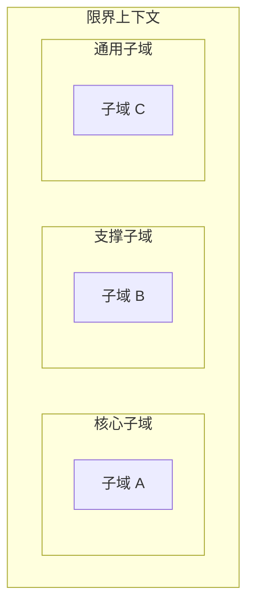

图 8-17：跨越多个子域的限界上下文

我们的目标是根据实际需求和业务战略驱动设计决策。除了将系统水平分区各层之外，我们还可以引入额外的垂直分区。为封装不同业务子域的模块定义逻辑边界，并为每个模块使用适当的工具至关重要，如图 8-18 所示。

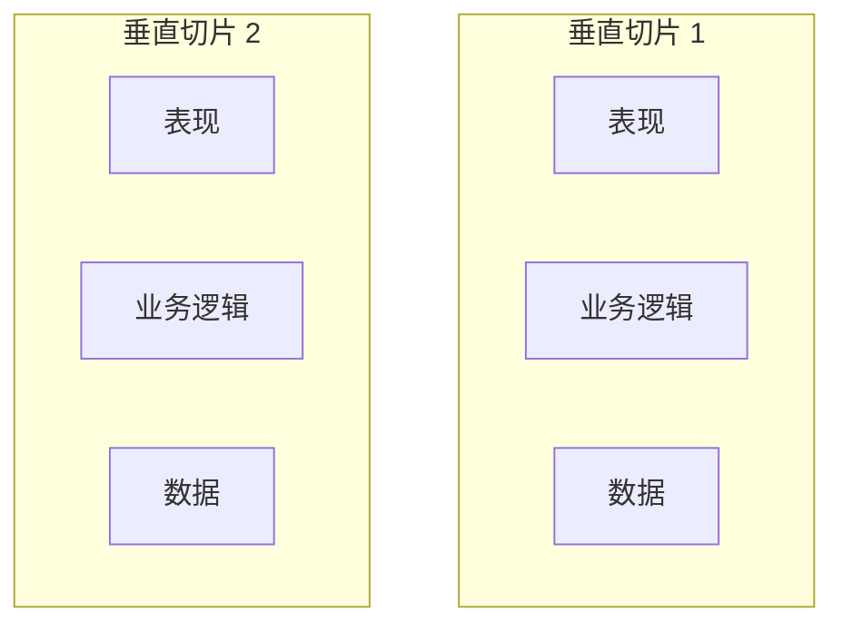

图 8-18：架构切片

适当的垂直边界使单体限界上下文成为模块化系统，有助于防止其沦为「大泥球」（big ball of mud）。如第 11 章将讨论的，这些逻辑边界日后可重构为更细粒度限界上下文的物理边界。

---

## 练习题

1. 以下哪种架构模式可与以活动记录模式实现的业务逻辑一起使用？
   - a. 分层架构
   - b. 端口与适配器
   - c. CQRS
   - d. A 和 C

2. 以下哪种架构模式将业务逻辑与基础设施关注点解耦？
   - a. 分层架构
   - b. 端口与适配器
   - c. CQRS
   - d. B 和 C

3. 假设你正在实现端口与适配器模式，需要集成云厂商的托管消息总线。集成应在哪一层实现？
   - a. 业务逻辑层
   - b. 应用层
   - c. 基础设施层
   - d. 任意层

4. 关于 CQRS 模式，以下哪项陈述是正确的？
   - a. 异步投影更易于扩展。
   - b. 只能使用同步或异步投影之一，不能同时使用。
   - c. 命令不能向调用方返回任何信息。调用方应始终使用读模型获取执行操作的结果。
   - d. 只要信息来自强一致性模型，命令可以返回信息。
   - e. A 和 D。

5. CQRS 模式允许以多种持久化模型表示相同的业务对象，从而允许在同一限界上下文中使用多种模型。这是否与限界上下文作为模型边界的概念相矛盾？

---

¹ Evans, E. (2003). *Domain-Driven Design: Tackling Complexity in the Heart of Software*. Boston: Addison-Wesley.

² 例如 AWS S3 或 Google Cloud Storage。

³ 在此语境下，消息总线用于系统内部需求。若对外暴露，则属于表现层。

⁴ Fowler, M. (2002). *Patterns of Enterprise Application Architecture*. Boston: Addison-Wesley.

⁵ 由于不在分层架构语境下，我将使用「应用层」而非「服务层」，因其更能反映目的。

⁶ Polyglot data by Greg Young. (n.d.). Retrieved June 14, 2021, from YouTube.

---

## 本章小结

**分层架构**根据技术关注点分解代码库。由于该模式将业务逻辑与数据访问实现耦合，它适合基于活动记录的系统。

**端口与适配器架构**反转了依赖关系：将业务逻辑置于中心，使其与所有基础设施依赖解耦。该模式适合使用领域模型模式实现的业务逻辑。

**CQRS 模式**以多种模型表示相同的数据。尽管该模式对于基于事件溯源领域模型的系统是必需的，它也可用于任何需要以多种持久化模型工作的系统。

下一章将讨论的模式从不同角度处理架构关注点：如何实现系统不同组件之间的可靠交互。

[← 上一章：建模时间维度](ch07-modeling-dimension-of-time.md) | [返回目录](../index.md) | [下一章：通信模式 →](ch09-communication-patterns.md)
