# 第9章：通信模式

> 第 5–8 章介绍的战术模式定义了实现系统组件的不同方式：如何建模业务逻辑，以及如何在架构上组织限界上下文的内部结构。本章将超越单一组件的边界，讨论组织系统各元素之间通信流动的模式。

---

## 9.1 模型翻译

限界上下文是模型的边界——即统一语言（ubiquitous language）的边界。如第 3 章所述，不同限界上下文之间的通信设计有多种模式。假设实现两个限界上下文的团队沟通顺畅且愿意协作，则可以采用**合作关系**（partnership）进行集成：协议可以临时协调，任何集成问题都可以通过团队间的有效沟通解决。另一种以合作为导向的集成方式是**共享内核**（shared kernel）：团队提取并共同演进模型的有限部分，例如将限界上下文的集成契约提取到共同维护的代码库中。

在**客户-供应商**（customer–supplier）关系中，权力天平会偏向**上游**（supplier）或**下游**（consumer）限界上下文。若下游限界上下文无法遵从上游限界上下文的模型，则需要更精细的技术方案，通过翻译限界上下文的模型来促进通信。

### 9.1.1 翻译的归属

这种翻译可由一方或双方承担：下游限界上下文可使用**防腐层**（anticorruption layer, ACL）将上游限界上下文的模型适配为自身需求；上游限界上下文则可作为**开放主机服务**（open-host service, OHS），通过使用面向集成的**发布语言**（published language）保护消费者免受其实现模型变更的影响。由于防腐层与开放主机服务的翻译逻辑相似，本章在讨论实现选项时不区分这两种模式，仅在例外情况下提及差异。

模型的翻译逻辑可以是**无状态**（stateless）或**有状态**（stateful）的。无状态翻译在传入（OHS）或传出（ACL）请求发出时即时进行；有状态翻译则涉及更复杂的翻译逻辑，需要数据库支持。下面分别介绍两种模型翻译的设计模式。

### 9.1.2 无状态模型翻译

对于无状态模型翻译，拥有翻译逻辑的限界上下文（上游为 OHS，下游为 ACL）实现**代理**（proxy）设计模式，拦截传入和传出请求，并将源模型映射到限界上下文的目标模型，如图 9-1 所示。

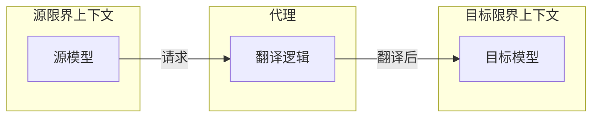

图 9-1：代理进行模型翻译

代理的实现取决于限界上下文之间是**同步**还是**异步**通信。

#### 同步通信

在同步通信中翻译模型，通常的做法是将转换逻辑嵌入限界上下文的代码库，如图 9-2 所示。在开放主机服务中，翻译到公共语言发生在处理传入请求时；在防腐层中，则发生在调用上游限界上下文时。

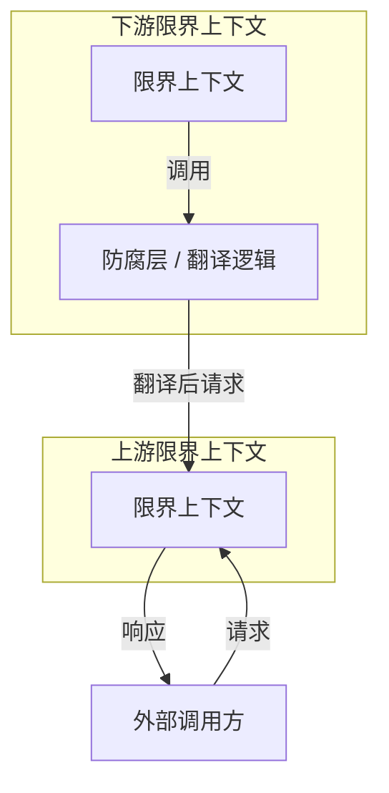

图 9-2：同步通信

在某些情况下，将翻译逻辑卸载到外部组件（如 **API 网关**（API gateway）模式）可能更经济、更便捷。API 网关可以是开源方案（如 Kong 或 KrakenD），也可以是云厂商的托管服务（如 AWS API Gateway、Google Apigee 或 Azure API Management）。

对于实现开放主机模式的限界上下文，API 网关负责将内部模型转换为面向集成的发布语言。此外，显式的 API 网关可以简化限界上下文 API 多版本的管理与提供，如图 9-3 所示。

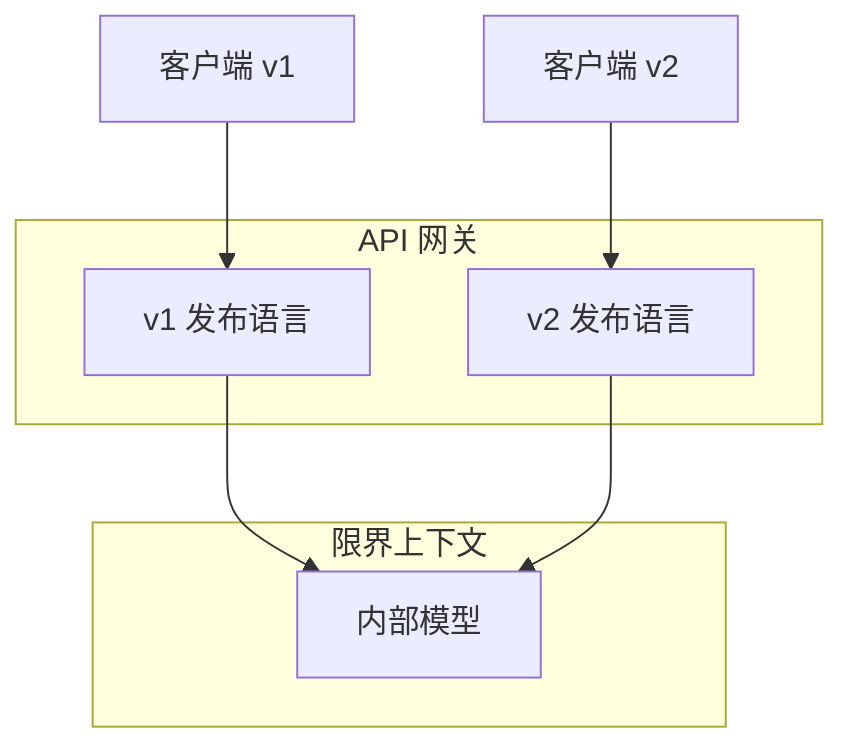

图 9-3：暴露不同版本的发布语言

使用 API 网关实现的防腐层可被多个下游限界上下文消费。此时，防腐层充当面向集成的限界上下文，如图 9-4 所示。

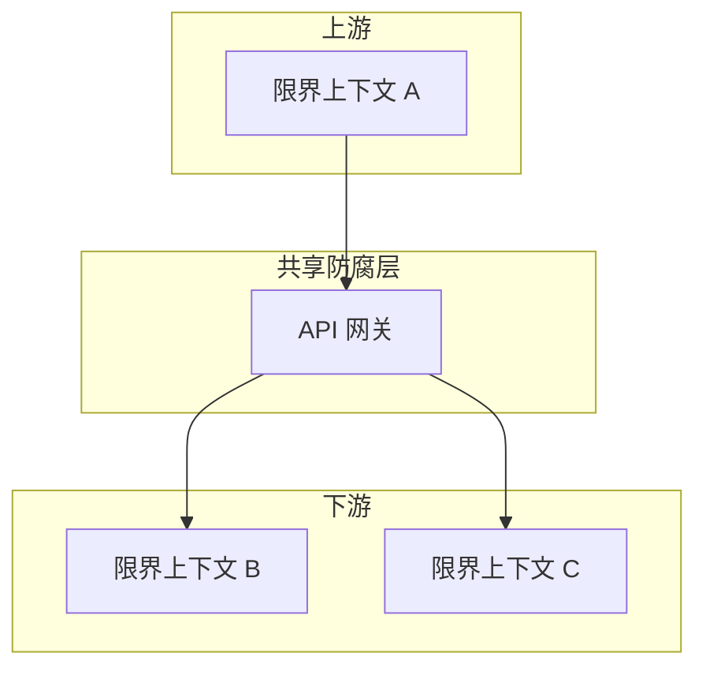

图 9-4：共享防腐层

这类主要负责将模型转换为便于其他组件消费的形式的限界上下文，通常称为**交换上下文**（interchange contexts）。

#### 异步通信

要翻译异步通信中使用的模型，可以实现**消息代理**（message proxy）：一个订阅来自源限界上下文消息的中间组件。该代理会应用所需的模型转换，并将结果消息转发给目标订阅者（见图 9-5）。

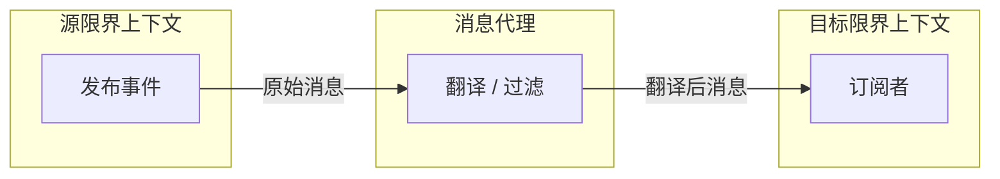

图 9-5：异步通信中的模型翻译

除翻译消息模型外，拦截组件还可以通过过滤无关消息来减少目标限界上下文的噪音。

::: tip 开放主机服务中的异步翻译
异步模型翻译在实现开放主机服务时至关重要。常见错误是：为模型对象设计并暴露发布语言，却允许领域事件按原样发布，从而暴露限界上下文的实现模型。异步翻译可用于拦截领域事件并将其转换为发布语言，从而更好地封装限界上下文的实现细节（见图 9-6）。

:::

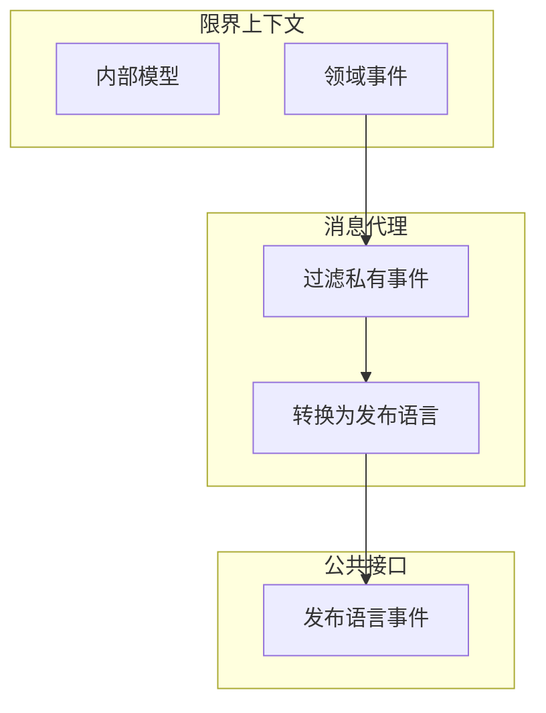

图 9-6：发布语言中的领域事件

此外，将消息翻译为发布语言可以区分**私有事件**（仅供限界上下文内部使用）和**公共事件**（用于与其他限界上下文集成）。我们将在第 15 章讨论领域驱动设计与事件驱动架构的关系时，再次展开私有/公共事件的话题。

### 9.1.3 有状态模型翻译

对于更复杂的模型转换——例如翻译机制需要聚合源数据，或将多个来源的数据统一为单一模型——可能需要**有状态翻译**。下面分别讨论这些用例。

#### 聚合传入数据

假设某限界上下文希望聚合传入请求并批量处理以优化性能，则同步和异步请求都可能需要聚合（见图 9-7）。

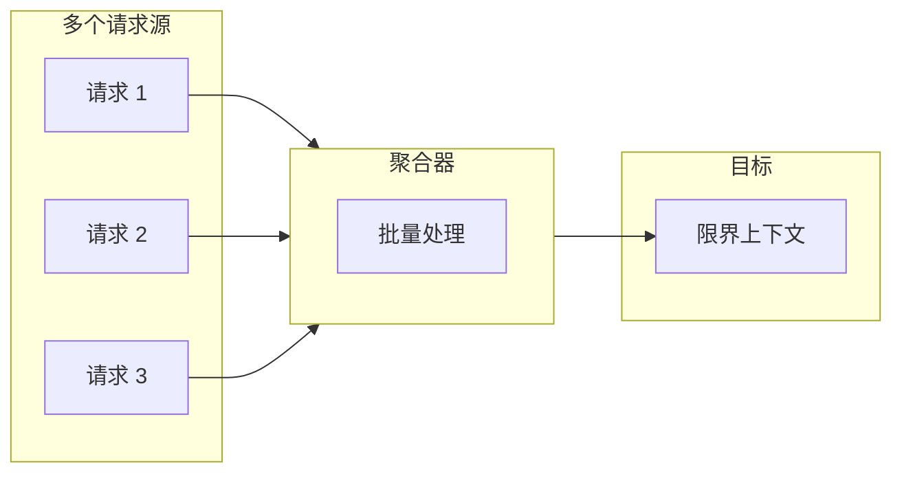

图 9-7：批量请求

另一种常见的源数据聚合用例是：将多条细粒度消息合并为包含统一数据的单条消息，如图 9-8 所示。

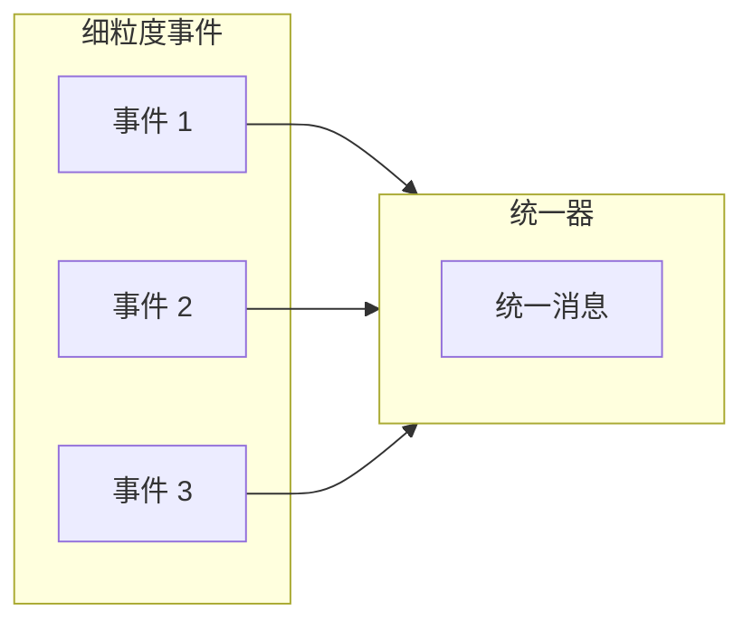

图 9-8：统一传入事件

::: info 有状态翻译的局限
聚合传入数据的模型转换无法通过 API 网关实现，需要更复杂的有状态处理。要跟踪传入数据并据此处理，翻译逻辑需要自己的持久化存储（见图 9-9）。¹

:::

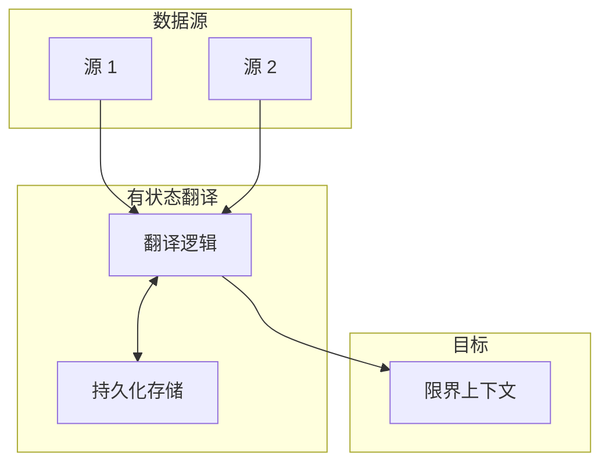

图 9-9：有状态模型转换

在某些用例中，可以使用现成产品避免实现自定义的有状态翻译，例如流处理平台（Kafka、AWS Kinesis 等）或批处理方案（Apache NiFi、AWS Glue、Spark 等）。

#### 统一多个来源

限界上下文可能需要处理来自多个来源（包括其他限界上下文）的数据聚合。典型例子是 **backend-for-frontend**（BFF）模式¹：用户界面需要组合来自多个服务的数据。

另一个例子是：某限界上下文必须处理来自多个其他上下文的数据，并实现复杂的业务逻辑来处理所有数据。此时，可以通过在限界上下文前放置防腐层来解耦集成复杂性与业务逻辑复杂性——该防腐层聚合来自所有其他限界上下文的数据，如图 9-10 所示。

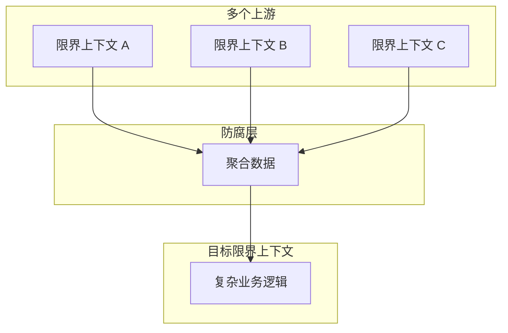

图 9-10：使用防腐层模式简化集成模型

---

## 9.2 集成聚合

第 6 章讨论了聚合与系统其余部分通信的一种方式：发布领域事件。外部组件可以订阅这些领域事件并执行其逻辑。但领域事件是如何发布到消息总线的？

在给出解决方案之前，我们先审视事件发布过程中的几种常见错误及其后果。考虑以下代码：

```csharp
public class Campaign
{
    ...
    List<DomainEvent> _events;
    IMessageBus _messageBus;
    ...

    public void Deactivate(string reason)
    {
        for (l in _locations.Values())
        {
            l.Deactivate();
        }

        IsActive = false;

        var newEvent = new CampaignDeactivated(_id, reason);
        _events.Append(newEvent);
        _messageBus.Publish(newEvent);
    }
}
```

第 17 行实例化了一个新事件。随后两行中，事件被追加到聚合内部的领域事件列表（第 18 行），并发布到消息总线（第 19 行）。这种发布领域事件的实现简单但**错误**。从聚合内部直接发布领域事件有两个问题。第一，事件会在聚合的新状态提交到数据库之前就被分发。订阅者可能收到活动已停用的通知，但这与活动的状态相矛盾。第二，若因竞态条件、后续聚合逻辑使操作无效，或数据库技术故障导致数据库事务提交失败怎么办？即使数据库事务回滚，事件已经发布并推送给订阅者，无法撤回。

尝试另一种方式：

```csharp
public class ManagementAPI
{
    ...
    private readonly IMessageBus _messageBus;
    private readonly ICampaignRepository _repository;
    ...
    public ExecutionResult DeactivateCampaign(CampaignId id, string reason)
    {
        try
        {
            var campaign = _repository.Load(id);
            campaign.Deactivate(reason);
            _repository.CommitChanges(campaign);

            var events = campaign.GetUnpublishedEvents();
            for (IDomainEvent e in events)
            {
                _messageBus.publish(e);
            }
            campaign.ClearUnpublishedEvents();
        }
        catch(Exception ex)
        {
            ...
        }
    }
}
```

在上述清单中，发布新领域事件的职责被转移到应用层。第 11–13 行加载 Campaign 聚合的相关实例、执行其 Deactivate 命令，只有在更新后的状态成功提交到数据库后，第 15–20 行才将新的领域事件发布到消息总线。这段代码可信吗？**不可信**。

在这种情况下，若运行该逻辑的进程因某种原因未能发布领域事件——例如消息总线宕机，或服务器在提交数据库事务后、发布事件之前崩溃——系统仍会处于不一致状态：数据库事务已提交，但领域事件永远不会被发布。

这些边界情况可以通过 **Outbox 模式**（outbox pattern）解决。

### 9.2.1 Outbox 模式

Outbox 模式（图 9-11）通过以下算法确保领域事件的可靠发布：

- 将更新后的聚合状态与新的领域事件在同一原子事务中提交
- 消息中继（relay）从数据库获取新提交的领域事件
- 中继将领域事件发布到消息总线
- 发布成功后，中继在数据库中标记事件为已发布，或直接删除

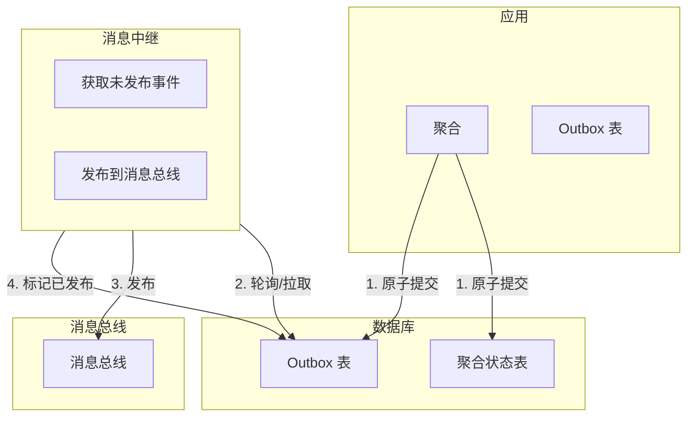

图 9-11：Outbox 模式

使用关系型数据库时，可借助数据库在同一事务中原子提交多表的能力，使用专用表存储消息，如图 9-12 所示。

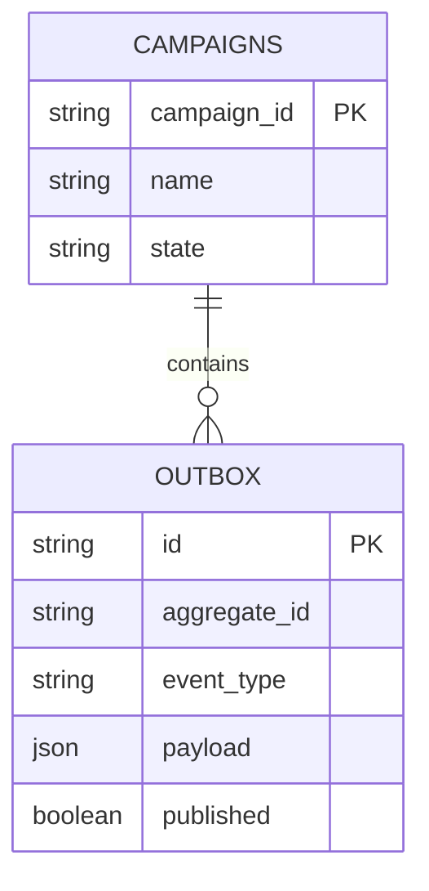

图 9-12：Outbox 表

使用不支持多文档事务的 NoSQL 数据库时，待发布的领域事件必须嵌入聚合记录中。例如：

```json
{
    "campaign-id": "364b33c3-2171-446d-b652-8e5a7b2be1af",
    "state": {
        "name": "Autumn 2017",
        "publishing-state": "DEACTIVATED",
        "ad-locations": [...]
    },
    "outbox": [
        {
            "campaign-id": "364b33c3-2171-446d-b652-8e5a7b2be1af",
            "type": "campaign-deactivated",
            "reason": "Goals met",
            "published": false
        }
    ]
}
```

在此示例中，JSON 文档有一个额外属性 `outbox`，包含待发布的领域事件列表。

#### 获取未发布事件

发布中继可以**拉取**（pull）或**推送**（push）方式获取新的领域事件：

##### 拉取：轮询发布器

中继可以持续查询数据库中的未发布事件。需要建立合适的索引，以尽量减少持续轮询对数据库造成的负载。

##### 推送：事务日志跟踪

可以借助数据库的功能，在追加新事件时主动通知发布中继。例如，部分关系型数据库支持通过跟踪数据库事务日志获取记录更新/插入的通知。部分 NoSQL 数据库将已提交的变更作为事件流暴露（如 AWS DynamoDB Streams）。

::: warning 至少一次送达
需要注意的是，Outbox 模式保证消息**至少一次**（at least once）送达：若中继在发布消息后、在数据库中将其标记为已发布之前失败，同一条消息将在下次迭代中再次发布。

:::

接下来，我们看看如何利用领域事件的可靠发布来克服聚合设计原则带来的一些限制。

### 9.2.2 Saga

聚合设计的核心原则之一是将每个事务限制在**单个聚合实例**内。这确保聚合边界经过审慎考虑，并封装一组内聚的业务功能。但有时需要实现跨越多个聚合的业务流程。

考虑以下例子：当广告活动被激活时，应自动将活动的广告素材提交给发布商。收到发布商确认后，活动的发布状态应变更为 Published。若发布商拒绝，活动应标记为 Rejected。

该流程涉及两个业务实体：广告活动和发布商。将这两个实体放在同一聚合边界内显然过度，它们是职责不同、可能属于不同限界上下文的业务实体。该流程可以**Saga**（saga）模式实现。

Saga 是一种**长时间运行**（long-running）的业务流程。其「长时间」不一定指时间跨度——Saga 可能从几秒到几年——而是指**事务**：跨越多个事务的业务流程。这些事务不仅可以由聚合处理，也可以由任何发出领域事件并响应命令的组件处理。Saga 监听相关组件发出的事件，并向其他组件发出后续命令。若某执行步骤失败，Saga 负责发出相应的**补偿动作**（compensating actions），以确保系统状态保持一致。

下面展示如何将上述广告活动发布流程实现为 Saga，如图 9-13 所示。

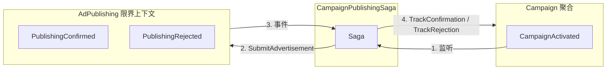

图 9-13：Saga

要实现该发布流程，Saga 需要监听 Campaign 聚合的 `CampaignActivated` 事件，以及 AdPublishing 限界上下文的 `PublishingConfirmed` 和 `PublishingRejected` 事件。Saga 需要向 AdPublishing 执行 `SubmitAdvertisement` 命令，向 Campaign 聚合执行 `TrackPublishingConfirmation` 和 `TrackPublishingRejection` 命令。在此例中，`TrackPublishingRejection` 命令作为补偿动作，确保广告活动不会被列为激活状态。

代码如下：

```csharp
public class CampaignPublishingSaga
{
    private readonly ICampaignRepository _repository;
    private readonly IPublishingServiceClient _publishingService;
    ...
    public void Process(CampaignActivated @event)
    {
        var campaign = _repository.Load(@event.CampaignId);
        var advertisingMaterials = campaign.GenerateAdvertisingMaterials();
        _publishingService.SubmitAdvertisement(@event.CampaignId,
                                              advertisingMaterials);
    }
    public void Process(PublishingConfirmed @event)
    {
        var campaign = _repository.Load(@event.CampaignId);
        campaign.TrackPublishingConfirmation(@event.ConfirmationId);
        _repository.CommitChanges(campaign);
    }
    public void Process(PublishingRejected @event)
    {
        var campaign = _repository.Load(@event.CampaignId);
        campaign.TrackPublishingRejection(@event.RejectionReason);
        _repository.CommitChanges(campaign);
    }
}
```

上述示例依赖消息基础设施传递相关事件，并通过执行相关命令对事件作出反应。这是一个相对简单的 Saga：它没有状态。你也会遇到需要状态管理的 Saga，例如跟踪已执行的操作，以便在失败时发出相应的补偿动作。此时，Saga 可以实现为事件溯源的聚合，持久化所接收事件和所发出命令的完整历史。但命令执行逻辑应移出 Saga 本身，并像 Outbox 模式中分发领域事件一样**异步**执行：

```csharp
public class CampaignPublishingSaga
{
    private readonly ICampaignRepository _repository;
    private readonly IList<IDomainEvent> _events;
    ...
    public void Process(CampaignActivated activated)
    {
        var campaign = _repository.Load(activated.CampaignId);
        var advertisingMaterials = campaign.GenerateAdvertisingMaterials();
        var commandIssuedEvent = new CommandIssuedEvent(
            target: Target.PublishingService,
            command: new SubmitAdvertisementCommand(activated.CampaignId,
            advertisingMaterials));

        _events.Append(activated);
        _events.Append(commandIssuedEvent);
    }
    public void Process(PublishingConfirmed confirmed)
    {
        var commandIssuedEvent = new CommandIssuedEvent(
            target: Target.CampaignAggregate,
            command: new TrackConfirmation(confirmed.CampaignId,
                                           confirmed.ConfirmationId));
        _events.Append(confirmed);
        _events.Append(commandIssuedEvent);
    }
    public void Process(PublishingRejected rejected)
    {
        var commandIssuedEvent = new CommandIssuedEvent(
            target: Target.CampaignAggregate,
            command: new TrackRejection(rejected.CampaignId,
                                        rejected.RejectionReason));
        _events.Append(rejected);
        _events.Append(commandIssuedEvent);
    }
}
```

在此示例中，Outbox 中继需要为每个 `CommandIssuedEvent` 实例在相关端点上执行命令。与发布领域事件一样，将 Saga 状态的转换与命令执行分离，可确保即使流程在任何阶段失败，命令也能可靠执行。

#### 一致性

尽管 Saga 模式编排了多组件事务，但所涉组件的状态是**最终一致**（eventually consistent）的。虽然 Saga 最终会执行相关命令，但没有任何两个事务可被视为原子的。这与另一条聚合设计原则一致：

::: tip 聚合边界内外的 consistency
只有聚合边界内的数据可视为**强一致**（strongly consistent）。边界外的一切都是**最终一致**（eventually consistent）的。

:::

以此为指导原则，确保你不会滥用 Saga 来弥补不当的聚合边界。必须属于同一聚合的业务操作需要强一致的数据。

Saga 模式常与另一模式混淆：**流程管理器**（process manager）。尽管实现相似，但它们是不同的模式。下一节将讨论流程管理器模式的目的及其与 Saga 的区别。

### 9.2.3 流程管理器

Saga 模式管理简单、线性的流程。严格来说，Saga 将事件与对应命令进行匹配。在我们用于演示 Saga 实现的示例中，实际上实现的是事件到命令的简单映射：

- `CampaignActivated` 事件 → `PublishingService.SubmitAdvertisement` 命令
- `PublishingConfirmed` 事件 → `Campaign.TrackConfirmation` 命令
- `PublishingRejected` 事件 → `Campaign.TrackRejection` 命令

**流程管理器**（process manager）模式²（图 9-14）用于实现基于业务逻辑的流程。它被定义为一个**中央处理单元**，维护流程序列的状态并决定下一步处理。²

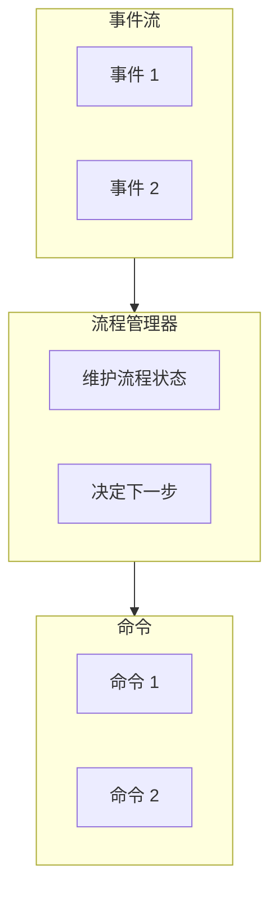

图 9-14：流程管理器

一个简单的经验法则：若 Saga 中包含 if-else 语句来选择正确的执行路径，它很可能是一个流程管理器。

流程管理器与 Saga 的另一区别是：Saga 在观察到特定事件时**隐式**实例化，如前述示例中的 `CampaignActivated`。而流程管理器不能绑定到单一源事件，它是一个由多个步骤组成的连贯业务流程，因此必须**显式**实例化。考虑以下例子：

预订商务差旅的流程始于：路由算法选择最具成本效益的航班路线，并请员工批准。若员工偏好不同路线，其直属经理需批准。航班预订后，需在相应日期预订一家预先批准的酒店。若无可用酒店，则需取消机票。

在此例中，没有中心实体会触发差旅预订流程。差旅预订本身就是流程，必须作为流程管理器实现（见图 9-15）。

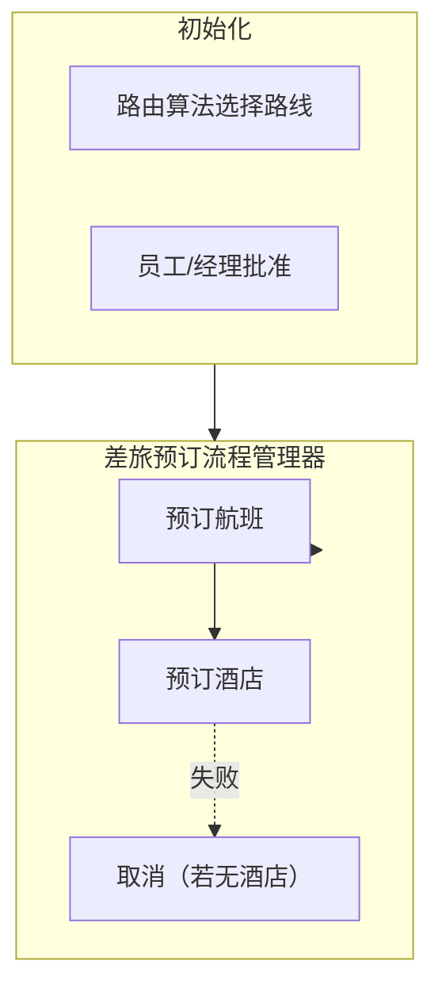

图 9-15：差旅预订流程管理器

从实现角度看，流程管理器通常实现为聚合，可以是基于状态的，也可以是事件溯源的。例如：

```csharp
public class BookingProcessManager
{
    private readonly IList<IDomainEvent> _events;
    private BookingId _id;
    private Destination _destination;
    private TripDefinition _parameters;
    private EmployeeId _traveler;
    private Route _route;
    private IList<Route> _rejectedRoutes;
    private IRoutingService _routing;
    ...
    public void Initialize(Destination destination,
                           TripDefinition parameters,
                           EmployeeId traveler)
    {
        _destination = destination;
        _parameters = parameters;
        _traveler = traveler;
        _route = _routing.Calculate(destination, parameters);
        var routeGenerated = new RouteGeneratedEvent(
            BookingId: _id,
            Route: _route);
        var commandIssuedEvent = new CommandIssuedEvent(
            command: new RequestEmployeeApproval(_traveler, _route)
        );
        _events.Append(routeGenerated);
        _events.Append(commandIssuedEvent);
    }
    public void Process(RouteConfirmed confirmed)
    {
        var commandIssuedEvent = new CommandIssuedEvent(
            command: new BookFlights(_route, _parameters)
        );
        _events.Append(confirmed);
        _events.Append(commandIssuedEvent);
    }
    public void Process(RouteRejected rejected)
    {
        var commandIssuedEvent = new CommandIssuedEvent(
            command: new RequestRerouting(_traveler, _route)
        );
        _events.Append(rejected);
        _events.Append(commandIssuedEvent);
    }
    public void Process(ReroutingConfirmed confirmed)
    {
        _rejectedRoutes.Append(route);
        _route = _routing.CalculateAltRoute(destination,
                                            parameters, rejectedRoutes);
        var routeGenerated = new RouteGeneratedEvent(
            BookingId: _id,
            Route: _route);

        var commandIssuedEvent = new CommandIssuedEvent(
            command: new RequestEmployeeApproval(_traveler, _route)
        );
        _events.Append(confirmed);
        _events.Append(routeGenerated);
        _events.Append(commandIssuedEvent);
    }
    public void Process(FlightBooked booked)
    {
        var commandIssuedEvent = new CommandIssuedEvent(
            command: new BookHotel(_destination, _parameters)
        );

        _events.Append(booked);
        _events.Append(commandIssuedEvent);
    }
    ...
}
```

在此示例中，流程管理器有显式的 ID 和持久化状态，描述待预订的差旅。与前述 Saga 示例一样，流程管理器订阅控制工作流的事件（`RouteConfirmed`、`RouteRejected`、`ReroutingConfirmed` 等），并实例化 `CommandIssuedEvent` 类型的事件，由 Outbox 中继处理以执行实际命令。

---

## 9.3 练习

1. 以下哪种限界上下文集成模式需要实现模型转换逻辑？
   - a. 遵从者（Conformist）
   - b. 防腐层（Anticorruption layer）
   - c. 开放主机服务（Open-host service）
   - d. B 和 C

2. Outbox 模式的目的是什么？
   - a. 将消息基础设施与系统的业务逻辑层解耦
   - b. 可靠地发布消息
   - c. 支持事件溯源领域模型模式的实现
   - d. A 和 C

3. 除向消息总线发布消息外，Outbox 模式还有哪些可能的用例？

4. Saga 与流程管理器模式有何区别？
   - a. 流程管理器需要显式实例化，而 Saga 在相关领域事件发布时执行。
   - b. 与流程管理器不同，Saga 从不需要持久化其执行状态。
   - c. Saga 要求其操作的组件实现事件溯源模式，而流程管理器不要求。
   - d. 流程管理器模式适用于复杂的业务工作流。
   - e. A 和 D 正确。

---

¹ Richardson, C. (2019). *Microservice Patterns: With Examples in Java*. New York: Manning Publications.

² Hohpe, G., & Woolf, B. (2003). *Enterprise Integration Patterns: Designing, Building, and Deploying Messaging Solutions*. Boston: Addison-Wesley.

---

## 本章小结

**模型翻译**可用于实现防腐层或开放主机服务。翻译可以是即时的无状态处理，也可以是需要状态跟踪的复杂逻辑。同步场景可使用 API 网关；异步场景可使用消息代理；有状态聚合则需持久化存储或流处理平台。

**Outbox 模式**是可靠发布聚合领域事件的方式，确保即使面对各种进程故障，领域事件也能被发布。

**Saga 模式**可用于实现简单的跨组件业务流程。更复杂的业务流程可使用**流程管理器**模式实现。两种模式都依赖对领域事件的异步响应和命令的发出。

[← 上一章：架构模式](ch08-architectural-patterns.md) | [返回目录](../index.md) | [下一章：设计启发式 →](../part3/ch10-design-heuristics.md)
