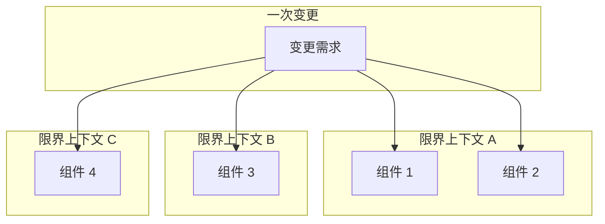
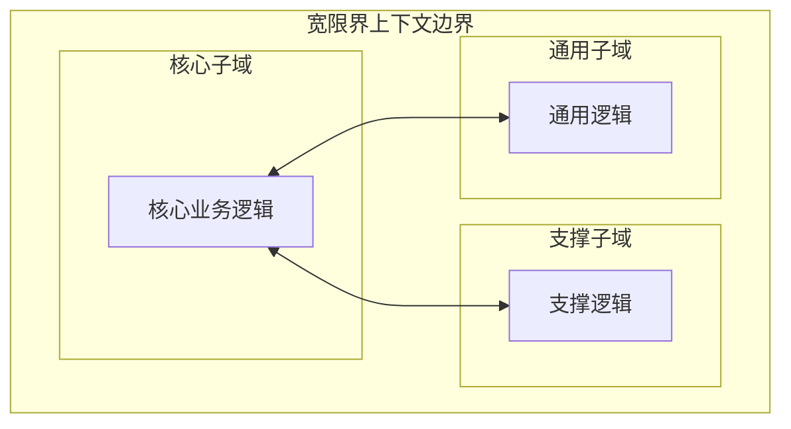
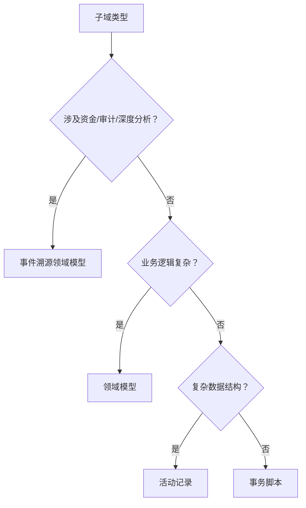
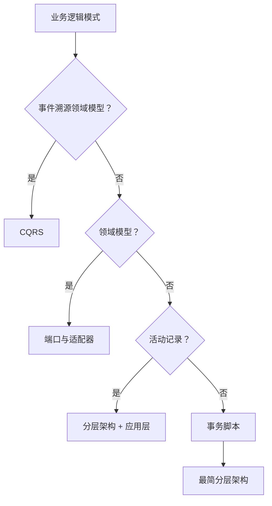
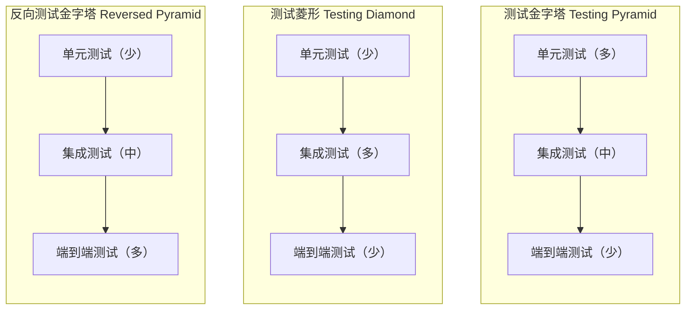
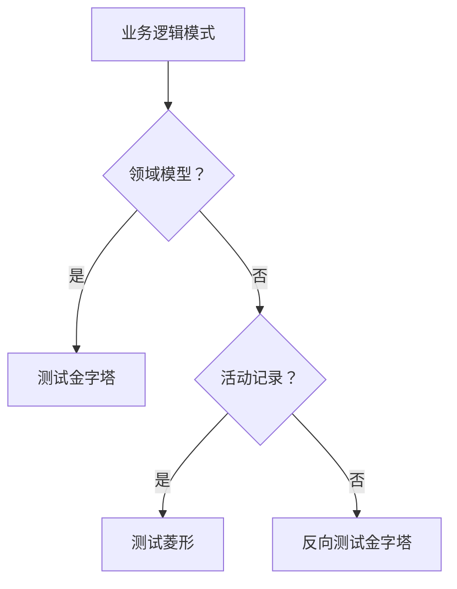
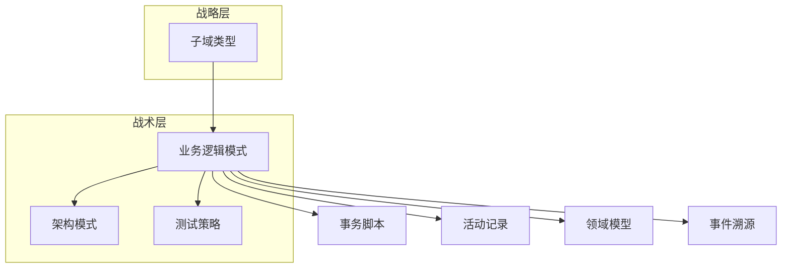

# 第10章：设计启发式

> 第 5–8 章介绍的战术模式定义了实现系统组件的不同方式：如何建模业务逻辑、如何组织系统架构，以及如何建立系统组件之间的通信。本章将连接本书第一部分与第二部分，介绍如何运用分析工具驱动各类软件设计决策的启发式——即（业务）领域驱动的（软件）设计。

---

## 10.1 启发式

「视情况而定」几乎是软件工程中任何问题的正确答案，但并不实用。本章将探讨「情况」究竟取决于什么。

在本书第一部分，你学习了用于分析业务领域并做出战略设计决策的领域驱动设计工具。在第二部分，我们探讨了战术设计模式：实现业务逻辑、组织系统架构以及建立系统组件间通信的不同方式。本章连接这两部分。你将学习如何运用分析工具驱动各类软件设计决策的启发式——即（业务）领域驱动的（软件）设计。

但首先，既然本章讨论的是设计启发式，让我们先定义「启发式」这一术语。

### 10.1.1 启发式的定义

**启发式**（heuristic）不是一条在 100% 情况下都能保证正确、且经数学证明的硬性规则。它更像是一种经验法则：不保证完美，但对达成眼前目标已足够。换言之，使用启发式是一种有效的问题解决方式，它忽略许多线索中固有的噪声，转而关注最重要线索所反映的「主导力量」。¹

本章介绍的启发式聚焦于不同业务领域的本质属性，以及各类设计决策所解决问题的本质。

---

## 10.2 限界上下文

如第 3 章所述，宽边界和窄边界都可以符合有效限界上下文的定义——即涵盖一致统一语言（ubiquitous language）的边界。但限界上下文的**最优规模**究竟是多少？在限界上下文常与微服务等同的背景下，这一问题尤为重要。²

我们是否应始终追求尽可能小的限界上下文？正如我的朋友 Nick Tune 所言：

::: tip Nick Tune
定义服务边界有许多有用且富有启发性的启发式。规模是最不有用的之一。

:::

与其让模型成为期望规模的函数——为小限界上下文而优化——更有效的做法恰恰相反：将限界上下文的规模视为其所涵盖模型的函数。

影响多个限界上下文的软件变更成本高昂，且需要大量协调，尤其当受影响的限界上下文由不同团队实现时。这类未被封装在单一限界上下文内的变更，表明限界上下文的边界设计无效。遗憾的是，重构限界上下文边界是一项昂贵的工程，在许多情况下，无效的边界会长期得不到处理，最终积累技术债务（见图 10-1）。

图 10-1：影响多个限界上下文的变更

使限界上下文边界失效的变更，通常发生在业务领域尚未充分了解或业务需求频繁变化时。如第 1 章所述，波动性和不确定性都是核心子域的特性，尤其在实现早期阶段。我们可以将其作为设计限界上下文边界的启发式。

### 10.2.1 宽边界策略

**宽的限界上下文边界**——即涵盖多个子域的边界——使你在边界或所包含子域模型上犯错时更安全。重构逻辑边界比重构物理边界成本低得多。因此，在设计限界上下文时，应从较宽的边界起步。若有必要，在获得更多领域知识后再将宽边界分解为更小的边界。

这一启发式主要适用于涵盖核心子域的限界上下文，因为通用子域和支撑子域更为标准化，波动性也小得多。在创建包含核心子域的限界上下文时，可以通过纳入该核心子域最常交互的其他子域来抵御不可预见的变化——可以是其他核心子域，甚至支撑子域和通用子域，如图 10-2 所示。

图 10-2：宽的限界上下文边界

---

## 10.3 业务逻辑实现模式

在第 5–7 章详细讨论业务逻辑时，你学习了四种建模业务逻辑的方式：**事务脚本**（transaction script）、**活动记录**（active record）、**领域模型**（domain model）和**事件溯源领域模型**（event-sourced domain model）模式。

事务脚本和活动记录模式更适合业务逻辑简单的子域——例如支撑子域或集成第三方方案的通用子域。两者的区别在于数据结构的复杂度：事务脚本模式适用于简单数据结构，而活动记录模式有助于封装复杂数据结构与底层数据库的映射。

领域模型及其变体事件溯源领域模型，适用于业务逻辑复杂的子域——核心子域。涉及货币交易、依法需提供审计日志，或需要对系统行为进行深度分析的核心子域，更适合采用事件溯源领域模型。

综合以上考虑，选择合适业务逻辑实现模式的有效启发式是提出以下问题：

- **该子域是否追踪资金或其他货币交易，或必须提供一致的审计日志，或业务上需要对其行为进行深度分析？** 若是，使用事件溯源领域模型。否则……
- **该子域的业务逻辑是否复杂？** 若是，实现领域模型。否则……
- **该子域是否包含复杂数据结构？** 若是，使用活动记录模式。否则……
- **实现事务脚本。**

由于子域复杂度与其类型之间存在强关联，我们可以用领域驱动的决策树来可视化这些启发式，如图 10-3 所示。

图 10-3：业务逻辑实现模式决策树

### 10.3.1 复杂与简单业务逻辑的区分

我们还可以用另一条启发式来定义复杂业务逻辑与简单业务逻辑的差异。这两类业务逻辑之间的界限并不十分清晰，但仍有参考价值。一般而言，**复杂业务逻辑**包括复杂的业务规则、不变式和算法；**简单方法**主要围绕输入验证展开。另一条评估复杂度的启发式与统一语言本身的复杂度有关：它主要描述的是 CRUD 操作，还是更复杂的业务流程和规则？

根据业务逻辑及其数据结构的复杂度来决定业务逻辑实现模式，也是验证你对子域类型假设的一种方式。假设你认为它是核心子域，但最佳模式却是活动记录或事务脚本；或假设你认为的支撑子域却需要领域模型或事件溯源领域模型——此时正是重新审视你对子域乃至整个业务领域假设的良机。请记住，核心子域的竞争优势未必体现在技术上。

---

## 10.4 架构模式

在第 8 章，你学习了三种架构模式：**分层架构**（layered architecture）、**端口与适配器**（ports & adapters）和 **CQRS**。

了解预期的业务逻辑实现模式后，选择架构模式就变得直接：

- **事件溯源领域模型**需要 CQRS。否则，系统在数据查询上将极为受限，只能按 ID 获取单个实例。
- **领域模型**需要端口与适配器架构。否则，分层架构难以让聚合和值对象对持久化保持无知。
- **活动记录模式**最好配合带额外应用（服务）层的分层架构，用于控制活动记录的逻辑。
- **事务脚本模式**可用最简分层架构实现，仅包含三层。

上述启发式的唯一例外是 CQRS 模式。CQRS 不仅对事件溯源领域模型有益，当子域需要以多种持久化模型表示其数据时，对任何其他模式也同样适用。图 10-4 展示了基于这些启发式选择架构模式的决策树。

图 10-4：架构模式决策树

---

## 10.5 测试策略

业务逻辑实现模式和架构模式的知识，可作为选择代码库测试策略的启发式。图 10-5 展示了三种测试策略。

图 10-5：测试策略

图中三种测试策略的差异在于对不同类型的测试——单元测试、集成测试和端到端测试——的侧重。下面分析每种策略及其适用场景。

### 10.5.1 测试金字塔

经典的**测试金字塔**（testing pyramid）强调大量单元测试、较少集成测试和更少端到端测试。领域模型模式的两种变体都最适合采用测试金字塔。聚合和值对象是有效测试业务逻辑的理想单元。

### 10.5.2 测试菱形

**测试菱形**（testing diamond）最侧重集成测试。使用活动记录模式时，系统的业务逻辑按定义分布在服务层和业务逻辑层。因此，要聚焦于这两层的集成，测试菱形是更有效的选择。

### 10.5.3 反向测试金字塔

**反向测试金字塔**（reversed testing pyramid）最关注端到端测试：从始至终验证应用的工作流。这种方法最适合实现事务脚本模式的代码库：业务逻辑简单、层数最少，验证系统端到端流程更有效。

图 10-6 展示了测试策略决策树。

图 10-6：测试策略决策树

---

## 10.6 战术设计决策树

业务逻辑模式、架构模式和测试策略的启发式可以统一并汇总为**战术设计决策树**（tactical design decision tree），如图 10-7 所示。

图 10-7：战术设计决策树

如你所见，识别子域类型并遵循决策树，能为做出关键设计决策提供坚实的起点。但需要重申的是，这些是启发式，而非硬性规则。每条规则都有例外，更不用说本就不打算在 100% 情况下都正确的启发式了。

决策树基于我倾向于使用简单工具、仅在绝对必要时才诉诸高级模式（领域模型、事件溯源领域模型、CQRS 等）的偏好。另一方面，我遇到过在实现事件溯源领域模型方面经验丰富的团队，因此对所有子域都使用该模式——对他们而言，这比使用不同模式更简单。我能向所有人推荐这种做法吗？当然不能。在我工作或咨询过的公司中，基于启发式的方法比对所有问题使用同一解决方案更高效。

归根结底，取决于你的具体情境。将图 10-7 中的决策树及其所依据的设计启发式作为指导原则，而非批判性思维的替代品。若你发现其他启发式更适合你，尽可调整这些指导原则或构建自己的决策树。

---

## 本章小结

本章将本书第一部分与第二部分连接到一个基于启发式的决策框架。你学习了如何运用业务领域及其子域的知识来驱动技术决策：选择安全的限界上下文边界、建模应用的业务逻辑，以及确定协调各限界上下文内部组件交互所需的架构模式。最后，我们绕道讨论了另一个常引发激烈争论的话题——哪种测试更重要——并运用同一框架，根据业务领域对不同类型的测试进行优先级排序。

做出设计决策很重要，但更重要的是随时间验证这些决策的有效性。下一章，我们将把讨论转向软件设计生命周期的下一阶段：设计决策的演进。

---

### 练习

1. 假设你正在实现 WolfDesk（见前言）的工单生命周期管理系统。这是一个核心子域，需要对其行为进行深度分析，以便算法能随时间持续优化。你实现业务逻辑和组件架构的初始策略是什么？测试策略是什么？

2. 对于 WolfDesk 的支持人员排班管理模块，你会做出哪些设计决策？

3. 为简化人员排班管理，你希望使用外部公共假日提供商，支持不同地理区域。流程是定期调用外部提供商，获取即将到来的公共假日的日期和名称。你会使用哪些业务逻辑和架构模式来实现该集成？如何测试？

4. 根据你的经验，本章介绍的基于启发式的决策树还可以包含软件开发过程的哪些其他方面？

---

¹ Gigerenzer, G., Todd, P. M., & ABC Research Group (1999). *Simple Heuristics That Make Us Smart*. New York: Oxford University Press.

² 第 11 章专门讨论限界上下文与微服务之间的对应关系。

---

[← 上一章：通信模式](../part2/ch09-communication-patterns.md) | [返回目录](../index.md) | [下一章：演进设计决策 →](ch11-evolving-design-decisions.md)
