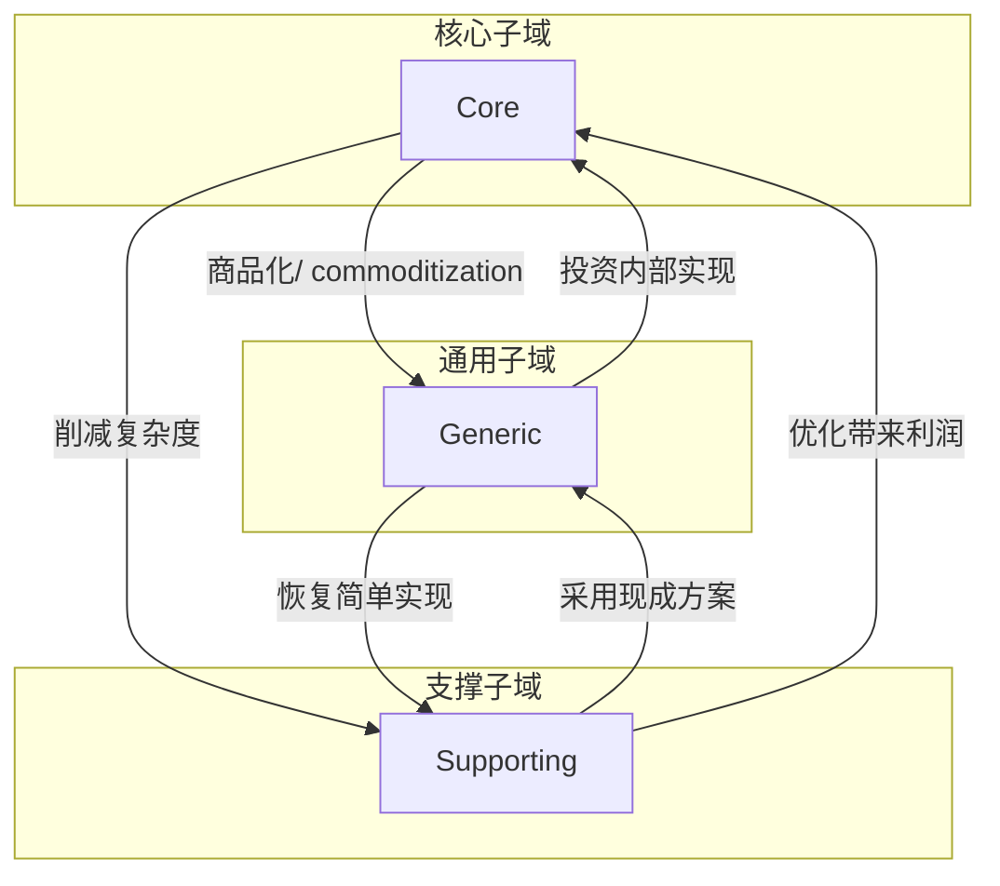
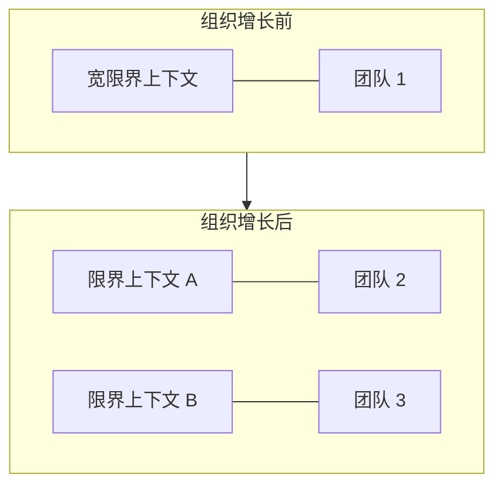
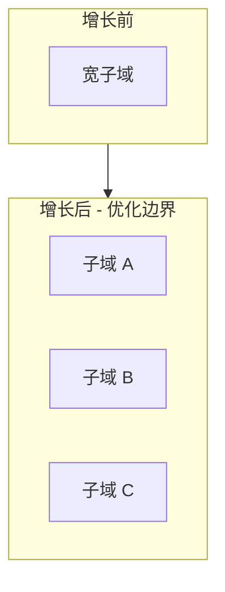

# 第11章：演进设计决策

> 在我们所处的现代快节奏世界中，企业无法承受迟缓。为跟上竞争，它们必须持续变革、演进，甚至随时间重塑自我。在设计系统时，我们不能忽视这一事实，尤其是当我们希望设计出能很好适应其业务领域需求的软件时。若变更管理不当，即便最精巧、最深思熟虑的设计，最终也会沦为难以维护和演进的噩梦。本章讨论软件项目环境中的变化如何影响设计决策，以及如何相应地演进设计。我们将审视四种最常见的变更向量：业务领域、组织结构、领域知识和增长。

---

## 11.1 领域的变化

在第 2 章中，你学习了三种业务子域类型及其彼此间的差异：

- **核心子域（Core）**：公司以不同于竞争对手的方式开展、以获得竞争优势的活动
- **支撑子域（Supporting）**：公司以不同于竞争对手的方式开展、但不提供竞争优势的事务
- **通用子域（Generic）**：所有公司以相同方式开展的事务

在之前的章节中，你看到所涉子域的类型会影响战略和战术设计决策：

- 如何设计限界上下文的边界
- 如何协调各上下文之间的集成
- 使用哪些设计模式来承载业务逻辑的复杂度

要设计出由业务领域需求驱动的软件，识别业务子域及其类型至关重要。然而，这并非全部。对子域演进的警觉同样重要。随着组织成长和演进，某些子域从一种类型转变为另一种类型并不罕见。让我们看一些此类变化的例子。

### 11.1.1 核心到通用

假设一家名为 BuyIT 的在线零售公司一直在实现自己的订单配送方案。它开发了一种创新算法来优化快递员的配送路线，因此能够比竞争对手收取更低的配送费。有一天，另一家公司——DeliverIT——颠覆了配送行业。它声称已解决「旅行商问题」，并将路径优化作为服务提供。DeliverIT 的优化不仅更先进，而且价格仅为 BuyIT 自行完成相同任务成本的一小部分。

从 BuyIT 的视角来看，一旦 DeliverIT 的解决方案作为现成产品可用，其核心子域就变成了通用子域。因此，最优解决方案对所有 BuyIT 的竞争对手都变得可用。若没有大量研发投入，BuyIT 再也无法在路径优化子域获得竞争优势。此前被视为 BuyIT 竞争优势的东西，已变成其所有竞争对手都能获得的商品。

### 11.1.2 通用到核心

自成立以来，BuyIT 一直使用现成方案管理库存。然而，其商业智能报告持续显示对客户需求的预测不足。因此，BuyIT 无法补足最受欢迎产品的库存，并在不受欢迎的产品上浪费仓库空间。在评估了几种替代的库存管理方案后，BuyIT 管理层做出战略决策：投资设计并构建内部系统。该内部方案将考虑 BuyIT 所售产品的复杂性，并更好地预测客户需求。

BuyIT 用自有实现替代现成方案的决定，将库存管理从通用子域转变为核心子域：成功实现该功能将为 BuyIT 带来相对于竞争对手的额外竞争优势——竞争对手将「困」于通用方案，无法使用 BuyIT 发明和开发的先进需求预测算法。

将通用子域转变为核心子域的现实教科书案例是亚马逊。与所有服务提供商一样，亚马逊需要运行其服务的基础设施。该公司能够「重塑」其管理物理基础设施的方式，后来甚至将其变成一项盈利业务：亚马逊云服务（Amazon Web Services）。

### 11.1.3 支撑到通用

BuyIT 的市场部门实现了一个用于管理其合作供应商及其合同的系统。该系统没有什么特别或复杂之处——只是一些用于录入数据的 CRUD 用户界面。换言之，它是一个典型的支撑子域。

然而，在 BuyIT 开始实现内部方案几年后，一个开源合同管理方案问世。该开源项目实现了与现有方案相同的功能，并具有更先进的功能，如 OCR 和全文搜索。这些额外功能长期存在于 BuyIT 的待办列表中，但因业务影响较低而从未被优先考虑。因此，公司决定放弃内部方案，转而集成开源方案。这样一来，文档管理子域从支撑子域转变为通用子域。

### 11.1.4 支撑到核心

支撑子域也可以转变为核心子域——例如，若公司找到一种方式优化支撑逻辑，从而降低成本或产生额外利润。

此类转变的典型症状是支撑子域业务逻辑复杂度的增加。支撑子域就其定义而言是简单的，主要类似于 CRUD 界面或 ETL 流程。然而，若业务逻辑随时间变得更为复杂，应有增加复杂度的理由。若它不影响公司利润，为何会变得更复杂？那是偶然的业务复杂度。另一方面，若它提升了公司的盈利能力，则是支撑子域正在成为核心子域的信号。

### 11.1.5 核心到支撑

核心子域随时间可能变成支撑子域。当子域的复杂度无法被证明合理时——即不盈利——就会发生这种情况。在这种情况下，组织可能决定削减多余复杂度，只保留支撑其他子域实现所需的最小逻辑。

### 11.1.6 通用到支撑

最后，出于与核心子域相同的原因，通用子域可以转变为支撑子域。回到 BuyIT 文档管理系统的例子，假设公司已决定集成开源方案的复杂度无法证明其收益，并已恢复使用内部系统。因此，通用子域已转变为支撑子域。

我们刚才讨论的子域变化如图 11-1 所示。



图 11-1：子域类型变化因素

---

## 11.2 战略设计考量

子域类型的变化会直接影响其限界上下文，进而影响相应的战略设计决策。如你在第 4 章所学，不同的限界上下文集成模式适用于不同的子域类型。核心子域必须通过防腐层（anticorruption layer）保护其模型，并必须通过发布语言（OHS，Open Host Service）保护消费者免受实现模型频繁变化的影响。

受此类变化影响的另一种集成模式是各行其道（separate ways）模式。如前所述，团队可将此模式用于支撑子域和通用子域。若子域转变为核心子域，由多个团队复制其功能就不再可接受。因此，团队别无选择，只能集成其实现。客户-供应商（customer–supplier）关系在这种情况下最有意义，因为核心子域将只由一个团队实现。

从实现策略的角度来看，核心子域和支撑子域在实现方式上有所不同。支撑子域可以外包或用作新员工的「训练轮」。核心子域必须在内部实现，尽可能靠近领域知识的来源。因此，当支撑子域转变为核心子域时，其实现应移入内部。反之亦然。若核心子域转变为支撑子域，可以将实现外包，让内部研发团队专注于核心子域。

---

## 11.3 战术设计考量

子域类型变化的主要指标是现有技术设计无法支撑当前业务需求。

让我们回到支撑子域转变为核心子域的例子。支撑子域使用相对简单的设计模式来建模业务逻辑：即事务脚本（transaction script）或活动记录（active record）模式。如你在第 5 章所见，这些模式不适合涉及复杂规则和不变量（invariants）的业务逻辑。

若随时间向业务逻辑添加复杂规则和不变量，代码库也会变得越来越复杂。添加新功能将变得痛苦，因为设计无法支撑新的复杂度水平。这种「痛苦」是一个重要信号。将其视为重新评估业务领域和设计选择的号召。

对实现策略变更的需求无需恐惧。这是正常的。我们无法预见业务将如何演进。我们也不能对所有类型的子域应用最精细的设计模式；那将是浪费且低效的。我们必须选择最合适的设计，并在需要时演进它。

若如何建模业务逻辑的决策是有意识地做出的，且你了解所有可能的设计选择及其差异，从一种设计模式迁移到另一种并不那么麻烦。以下小节列举了几个例子。

### 11.3.1 事务脚本到活动记录

事务脚本和活动记录模式的核心都基于同一原则：业务逻辑以过程式脚本实现。二者的区别在于数据结构的建模方式：活动记录模式引入数据结构来封装其与存储机制映射的复杂度。

因此，当在事务脚本中处理数据变得困难时，将其重构为活动记录模式。寻找复杂的数据结构，并将其封装在活动记录对象中。不要直接访问数据库，而是使用活动记录来抽象其模型和结构。

### 11.3.2 活动记录到领域模型

若操纵活动记录的业务逻辑变得复杂，且你注意到越来越多不一致和重复的情况，则将实现重构为领域模型（domain model）模式。

首先识别值对象（value objects）。哪些数据结构可以建模为不可变对象？寻找相关业务逻辑，并将其作为值对象的一部分。

接下来，分析数据结构并寻找事务边界。为确保所有状态修改逻辑都是显式的，将所有活动记录的 setter 设为私有，使其只能从活动记录内部修改。显然，预期编译会失败；然而，编译错误将使状态修改逻辑所在之处一目了然。将其重构到活动记录的边界内。例如：

```csharp
public class Player
{
    public Guid Id { get; set; }
    public int Points { get; set; }
}
public class ApplyBonus
{
    ...
    public void Execute(Guid playerId, byte percentage)
    {
        var player = _repository.Load(playerId);
        player.Points *= 1 + percentage/100.0;
        _repository.Save(player);
    }
}
```

在以下代码中，你可以看到转型的第一步。代码尚无法编译，但错误将使外部组件控制对象状态的位置变得显式：

```csharp
public class Player
{
    public Guid Id { get; private set; }
    public int Points { get; private set; }
}
public class ApplyBonus
{
    ...
    public void Execute(Guid playerId, byte percentage)
    {
        var player = _repository.Load(playerId);
        player.Points *= 1 + percentage/100.0;
        _repository.Save(player);
    }
}
```

在下一轮迭代中，我们可以将该逻辑移入活动记录的边界内：

```csharp
public class Player
{
    public Guid Id { get; private set; }
    public int Points { get; private set; }
    public void ApplyBonus(int percentage)
    {
        this.Points *= 1 + percentage/100.0;
    }
}
```

当所有状态修改业务逻辑都移入相应对象的边界内后，检查需要哪些层次结构来确保业务规则和不变量的强一致性检查。这些是聚合（aggregate）的良好候选。牢记我们在第 6 章讨论的聚合设计原则，寻找最小事务边界，即你需要保持强一致性的最小数据量。沿这些边界分解层次结构。确保外部聚合仅通过其 ID 引用。

最后，对于每个聚合，识别其根（root），即其公共接口的入口点。将聚合内所有其他内部对象的方法设为私有，仅可从聚合内部调用。

### 11.3.3 领域模型到事件溯源领域模型

一旦你有了边界设计得当的领域模型，就可以将其过渡到事件溯源（event-sourced）模型。不要直接修改聚合的数据，而是建模表示聚合生命周期所需的领域事件。

将领域模型重构为事件溯源领域模型最具挑战性的方面是现有聚合的历史：将「无时间」状态迁移到基于事件的模型中。由于代表所有过去状态变化的细粒度数据不存在，你必须要么尽最大努力生成过去的事件，要么建模迁移事件。

#### 生成过去的转换

这种方法需要为每个聚合生成近似的事件流，以便事件流可以投影为与原始实现相同的状态表示。考虑你在第 7 章看到的例子，如表 11-1 所示。

| lead-in | first-name | last-name | phone_number | status | last-contacted-on | order-placed-on | converted-on | followup-on |
|---------|------------|-----------|--------------|--------|-------------------|-----------------|--------------|-------------|
| 12 | Shauna | Mercia | 555-4753 | converted | 2020-05-27T12:02:12.51Z | 2020-05-27T12:02:12.51Z | 2020-05-27T12:38:44.12Z | null |

从业务逻辑角度，我们可以假设聚合实例已被初始化；然后该人员已被联系，订单已下单，最后，由于状态为「converted」，订单付款已确认。以下事件集可以表示所有这些假设：

```json
{
    "lead-id": 12,
    "event-id": 0,
    "event-type": "lead-initialized",
    "first-name": "Shauna",
    "last-name": "Mercia",
    "phone-number": "555-4753"
},
{
    "lead-id": 12,
    "event-id": 1,
    "event-type": "contacted",
    "timestamp": "2020-05-27T12:02:12.51Z"
},
{
    "lead-id": 12,
    "event-id": 2,
    "event-type": "order-submitted",
    "payment-deadline": "2020-05-30T12:02:12.51Z",
    "timestamp": "2020-05-27T12:02:12.51Z"
},
{
    "lead-id": 12,
    "event-id": 3,
    "event-type": "payment-confirmed",
    "status": "converted",
    "timestamp": "2020-05-27T12:38:44.12Z"
}
```

当逐一应用时，这些事件可以投影为与原始系统完全相同的状态表示。「恢复」的事件可以通过投影状态并与原始数据比较来轻松测试。

然而，重要的是要记住这种方法的缺点。使用事件溯源的目标是拥有聚合领域事件的可靠、强一致历史。使用这种方法时，无法恢复状态转换的完整历史。在前面的例子中，我们不知道销售代理联系该人员多少次，因此遗漏了多少个「contacted」事件。

#### 建模迁移事件

另一种方法是承认对过去事件知识的缺乏，并将其显式建模为事件。不要恢复可能导致当前状态的事件，而是定义迁移事件，并用它来初始化现有聚合实例的事件流：

```json
{
    "lead-id": 12,
    "event-id": 0,
    "event-type": "migrated-from-legacy",
    "first-name": "Shauna",
    "last-name": "Mercia",
    "phone-number": "555-4753",
    "status": "converted",
    "last-contacted-on": "2020-05-27T12:02:12.51Z",
    "order-placed-on": "2020-05-27T12:02:12.51Z",
    "converted-on": "2020-05-27T12:38:44.12Z",
    "followup-on": null
}
```

这种方法的优点是它使过去数据的缺乏变得显式。在任何阶段，都不会有人错误地假设事件流捕获了聚合实例生命周期内发生的所有领域事件。缺点是遗留系统的痕迹将永远保留在事件存储中。例如，若你使用 CQRS 模式（使用事件溯源领域模型时你很可能会用），投影将始终必须考虑迁移事件。

---

## 11.4 组织变化

另一种可能影响系统设计的变更是组织本身的变化。第 4 章考察了集成限界上下文的不同模式：伙伴关系（partnership）、共享内核（shared kernel）、遵奉者（conformist）、防腐层、开放主机服务（open-host service）和各行其道。组织结构的变化会影响团队的沟通和协作水平，进而影响限界上下文应如何集成。

此类变化的一个简单例子是开发中心的增长，如图 11-2 所示。由于一个限界上下文只能由一个团队实现，增加新的开发团队可能导致现有的较宽限界上下文边界拆分为更小的边界，以便每个团队可以独立工作于自己的限界上下文。



图 11-2：拆分宽限界上下文以容纳增长的工程团队

此外，组织的开发中心通常位于不同的地理位置。当现有限界上下文的工作转移到另一地点时，可能会对团队的协作产生负面影响。因此，限界上下文的集成模式必须相应演进，如下述场景所述。

### 11.4.1 伙伴关系到客户-供应商

伙伴关系模式假设团队之间有强大的沟通和协作。随时间推移，这可能不再成立；例如，当其中一个限界上下文的工作转移到遥远的开发中心时。这种变化将对团队的沟通产生负面影响，从伙伴关系模式转向客户-供应商关系可能更有意义。

### 11.4.2 客户-供应商到各行其道

不幸的是，团队出现严重沟通问题并不罕见。问题可能由地理距离或组织政治引起。此类团队可能随时间经历越来越多的集成问题。在某个时刻，复制功能可能比持续相互追赶更具成本效益。

---

## 11.5 领域知识

如你所忆，领域驱动设计的核心信条是：领域知识对于设计成功的软件系统至关重要。获取领域知识是软件工程最具挑战性的方面之一，尤其是对于核心子域。核心子域的逻辑不仅复杂，而且预期会经常变化。此外，建模是一个持续的过程。模型必须随着对业务领域知识的更多获取而改进。

很多时候，业务领域的复杂度是隐性的。最初，一切似乎简单直接。这种初始的简单往往具有欺骗性，并迅速演变为复杂度。随着更多功能的添加，越来越多的边界情况、不变量和规则被发现。此类洞察往往是颠覆性的，需要从头重建模型，包括限界上下文的边界、聚合和其他实现细节。

从战略设计的角度来看，根据领域知识的水平设计限界上下文的边界是一种有用的启发式。将系统分解为随时间证明不正确的限界上下文的成本可能很高。因此，当领域逻辑不清晰且经常变化时，设计边界较宽的限界上下文是有意义的。然后，随着领域知识随时间被发现、业务逻辑的变化趋于稳定，这些宽的限界上下文可以分解为边界更窄的上下文，或微服务。我们将在第 14 章更详细地讨论限界上下文与微服务之间的相互作用。

当发现新的领域知识时，应利用它来演进设计并使其更具弹性。不幸的是，领域知识的变化并不总是积极的：领域知识可能丢失。随时间推移，文档往往会过时，参与原始设计的人员离开公司，新功能以临时方式添加，直到某一时刻，代码库获得遗留系统的可疑地位。主动防止领域知识的这种退化至关重要。恢复领域知识的有效工具是 EventStorming 工作坊，这是下一章的主题。

---

## 11.6 增长

增长是系统健康的标志。当新功能持续添加时，表明系统是成功的：它为用户带来价值，并扩展以进一步满足用户需求、跟上竞争产品。但增长有阴暗面。随着软件项目的增长，其代码库可能演变成大泥球（big ball of mud）：

::: tip Brian Foote 和 Joseph Yoder
大泥球是一种杂乱无章、蔓延无序、粗制滥造、用胶带和铁丝拼凑的意大利面代码丛林。这些系统显示出不受管制增长和反复权宜修复的无可辩驳的迹象。

:::

导致大泥球的不受管制增长源于在未重新评估设计决策的情况下扩展软件系统的功能。增长会吹大组件的边界，日益扩展其功能。审视增长对设计决策的影响至关重要，尤其是因为许多领域驱动设计工具都与设定边界有关：业务构建块（子域）、模型（限界上下文）、不可变性（值对象）或一致性（聚合）。

处理增长驱动复杂度的指导原则是识别并消除偶然复杂度（accidental complexity）：由过时设计决策引起的复杂度。本质复杂度（essential complexity），即业务领域的内在复杂度，应使用领域驱动设计工具和实践来管理。

在前几章讨论 DDD 时，我们遵循先分析业务领域及其战略组件、设计业务领域的相关模型、然后在代码中设计和实现模型的流程。让我们遵循同样的脚本来处理增长驱动的复杂度。

### 11.6.1 子域

如我们在第 1 章所讨论的，子域的边界可能难以识别，因此，与其追求完美的边界，不如追求有用的边界。也就是说，子域应使我们能够识别具有不同业务价值的组件，并使用适当的工具来设计和实现解决方案。

随着业务领域的增长，子域的边界可能变得更加模糊，更难识别一个子域跨越多个更细粒度子域的情况。因此，重新审视已识别的子域并遵循一致用例（coherent use cases）的启发式——即作用于同一数据集的一组用例——来尝试识别在何处拆分子域，这一点很重要（见图 11-3）。



图 11-3：优化子域边界以容纳增长

若你能识别出不同类型的更细粒度子域，这是一个重要的洞察，将使你能够管理业务领域的本质复杂度。关于子域及其类型的信息越精确，你为每个子域选择技术方案就越有效。

识别可以提取并显式化的内部子域，对核心子域尤为重要。我们应始终致力于尽可能从其他子域中提炼核心子域，以便从业务战略角度将精力投入到最重要的地方。

### 11.6.2 限界上下文

在第 3 章中，你学习了限界上下文模式使我们能够使用业务领域的不同模型。与其构建「样样通、样样松」的模型，我们可以构建多个模型，每个专注于解决特定问题。

随着项目演进和增长，限界上下文失去焦点并积累与不同问题相关的逻辑并不罕见。那是偶然复杂度。与子域一样，定期重新审视限界上下文的边界至关重要。始终寻找通过提取专注于解决特定问题的限界上下文来简化模型的机会。

增长也可以使现有的隐性设计问题显性化。例如，你可能会注意到一些限界上下文随时间变得越来越「话多」，无法在不调用另一个限界上下文的情况下完成任何操作。这可能是模型无效的强烈信号，应通过重新设计限界上下文的边界以增加其自主性来解决。

### 11.6.3 聚合

当我们在第 6 章讨论领域模型模式时，我们使用了以下设计聚合边界的指导原则：

经验法则是尽可能保持聚合最小，仅包含业务领域要求处于强一致状态的对象。

随着系统业务需求的增长，将新功能分配到现有聚合中可能很「方便」，而不重新审视保持聚合最小的原则。若聚合增长到包含其业务逻辑并非全部需要强一致的数据，同样，那是必须消除的偶然复杂度。

将业务功能提取到专用聚合中，不仅简化了原始聚合，还可能简化其所属的限界上下文。通常，此类重构会揭示额外的隐藏模型，一旦显式化，应提取到不同的限界上下文中。

---

## 结论

正如赫拉克利特的名言，生活中唯一不变的就是变化。企业也不例外。为保持竞争力，公司不断努力演进和重塑自我。这些变化应被视为设计过程的一等公民。

随着业务领域的演进，必须识别其子域的变化并在系统设计中采取行动。确保你过去的设计决策与业务领域及其子域的当前状态一致。在需要时，演进你的设计以更好地匹配当前的业务战略和需求。

同样重要的是要认识到，组织结构的变化会影响团队之间的沟通和协作，以及其限界上下文的集成方式。学习业务领域是一个持续的过程。随着随时间发现更多领域知识，必须利用它来演进战略和战术设计决策。

最后，软件增长是一种期望的变更类型，但若管理不当，可能对系统设计和架构产生灾难性影响。因此：

- 当子域的功能扩展时，尝试识别更细粒度的子域边界，以便做出更好的设计决策。
- 不要让限界上下文成为「样样通、样样松」。确保限界上下文所涵盖的模型专注于解决特定问题。
- 确保你的聚合边界尽可能小。使用强一致数据的启发式来检测将业务逻辑提取到新聚合的可能性。

关于这一主题，我最后的智慧之言是：持续检查不同边界是否有增长驱动复杂度的迹象。采取行动消除偶然复杂度，并使用领域驱动设计工具来管理业务领域的本质复杂度。

---

## 练习

1. 限界上下文集成的哪些变化通常由组织增长引起？
   a. 伙伴关系到客户-供应商（遵奉者、防腐层或开放主机服务）
   b. 防腐层到开放主机服务
   c. 遵奉者到共享内核
   d. 开放主机服务到共享内核

2. 假设限界上下文的集成从遵奉者关系转变为各行其道。根据这一变化，你可以推断出什么信息？
   a. 开发团队难以协作。
   b. 重复的功能是支撑子域或通用子域。
   c. 重复的功能是核心子域。
   d. A 和 B。
   e. A 和 C。

3. 支撑子域转变为核心子域的症状是什么？
   a. 演进现有模型并实现新需求变得更容易。
   b. 演进现有模型变得痛苦。
   c. 子域以更高的频率变化。
   d. B 和 C。
   e. 以上都不是。

4. 发现新的商业机会会导致什么变化？
   a. 支撑子域转变为核心子域。
   b. 支撑子域转变为通用子域。
   c. 通用子域转变为核心子域。
   d. 通用子域转变为支撑子域。
   e. A 和 B。
   f. A 和 C。

5. 业务战略的什么变化可能将 WolfDesk（前言中描述的虚构公司）的某个通用子域转变为核心子域？

---

## 本章小结

本章探讨了软件项目环境中四种最常见的变更向量如何影响设计决策，以及如何相应地演进设计。

**领域的变化**：子域类型会随时间演变——核心↔通用↔支撑之间的转换反映了竞争格局、技术商品化和战略投资的变化。识别这些转变并调整战略和战术设计至关重要。

**战略设计考量**：子域类型的变化直接影响限界上下文的集成模式（防腐层、发布语言、客户-供应商、各行其道）以及实现策略（内部 vs 外包）。

**战术设计考量**：当现有设计无法支撑业务需求时，需要演进实现模式。从事务脚本到活动记录、从活动记录到领域模型、从领域模型到事件溯源领域模型的迁移路径是可管理的，前提是决策是有意识的且你了解各模式的差异。

**组织变化**：团队结构、地理分布和沟通水平的变化会影响限界上下文的集成方式——从伙伴关系到客户-供应商，或从客户-供应商到各行其道。

**领域知识**：领域知识是持续获取的。根据知识水平设计限界上下文边界；当逻辑不清晰时使用较宽边界，随知识积累再分解。主动防止领域知识退化。

**增长**：增长是健康的，但不受管制的增长会导致大泥球。识别并消除偶然复杂度；使用 DDD 工具管理本质复杂度。定期重新审视子域、限界上下文和聚合的边界。

---

[← 上一章：设计启发式](ch10-design-heuristics.md) | [返回目录](../index.md) | [下一章：EventStorming →](ch12-eventstorming.md)
