# 第12章：EventStorming

> 本章我们将暂时搁置软件设计模式与技术的讨论，转而聚焦于一种名为 EventStorming 的低技术建模流程。该流程将前几章所涵盖的领域驱动设计核心要素汇聚在一起。你将学习 EventStorming 的流程、如何引导 EventStorming 工作坊，以及如何利用 EventStorming 有效分享领域知识并构建统一语言。

---

## 12.1 什么是 EventStorming？

EventStorming 是一种低技术活动，让一群人通过头脑风暴快速建模业务过程。从某种意义上说，EventStorming 是分享业务领域知识的战术工具。

EventStorming 会话有一个范围：即小组感兴趣探索的业务过程。参与者将过程作为一系列领域事件（用便利贴表示）在时间线上进行探索。模型逐步增强，加入更多概念——参与者（actors）、命令（commands）、外部系统等——直到所有元素共同讲述业务过程如何运作的故事。

## 12.2 谁应参与 EventStorming？

::: tip Alberto Brandolini，EventStorming 工作坊的创造者
请记住，工作坊的目标是在尽可能短的时间内学到尽可能多的东西。我们邀请关键人物参与工作坊，不想浪费他们宝贵的时间。

:::

理想情况下，应有一组背景多元的人参与工作坊。事实上，任何与所涉业务领域相关的人都可以参与：工程师、领域专家、产品负责人、测试人员、UI/UX 设计师、支持人员等。参与者的背景越多样，能发现的知识就越多。

但要注意不要让小组规模过大。每位参与者都应能为流程做出贡献，但超过 10 人时这会变得困难。

## 12.3 EventStorming 需要什么？

EventStorming 被视为低技术工作坊，因为它使用笔和纸——实际上需要很多纸。以下是引导 EventStorming 会话所需的内容：

### 12.3.1 建模空间

首先，你需要一个大的建模空间。一整面墙铺上牛皮纸是最佳的建模空间，如图 12-1 所示。大块白板也可以，但必须尽可能大——你需要所有能得到的建模空间。

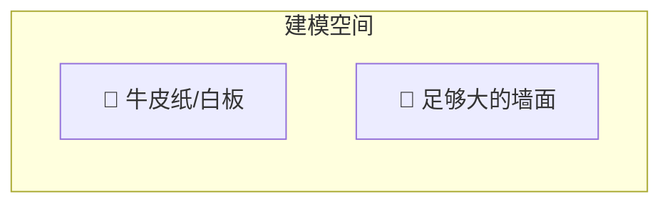

图 12-1：EventStorming 的建模空间

### 12.3.2 便利贴

其次，你需要大量不同颜色的便利贴。这些便利贴将用于表示业务领域的不同概念，每位参与者都应能自由添加，因此要确保颜色和数量充足。EventStorming 传统使用的颜色将在下一节描述。如有可能，最好遵循这些约定，以便与现有 EventStorming 书籍和培训保持一致。

### 12.3.3 马克笔

你还需要能在便利贴上书写的马克笔。同样，物资不应成为知识分享的瓶颈——应有足够的马克笔供所有参与者使用。

### 12.3.4 零食

典型的 EventStorming 会话持续约两到四小时，因此准备一些健康零食以补充能量。

### 12.3.5 场地

最后，你需要一个宽敞的房间。确保房间中央没有大桌子阻碍参与者自由移动和观察建模空间。此外，椅子是 EventStorming 会话的大忌。你希望人们参与并分享知识，而不是坐在角落走神。因此，如有可能，把椅子搬出房间。（当然，这不是硬性规定。如果部分参与者长时间站立有困难，可以留几把椅子。）

## 12.4 EventStorming 流程

EventStorming 工作坊通常分 10 个步骤进行。每一步都会为模型增添更多信息和概念。

### 12.4.1 步骤 1：非结构化探索

EventStorming 从头脑风暴开始，探索与所涉业务领域相关的领域事件。领域事件是业务中已发生的值得关注的事情。重要的是用过去时表述领域事件（见图 12-2）——它们描述的是已经发生的事情。

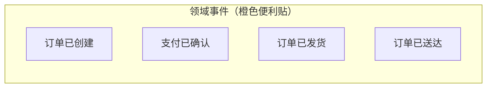

图 12-2：非结构化探索

在此步骤中，所有参与者抓取一堆橙色便利贴，写下想到的任何领域事件，并贴到建模表面上。

在早期阶段，无需担心事件的顺序，甚至无需担心重复。此步骤完全是头脑风暴业务领域中可能发生的事情。

小组应持续生成领域事件，直到新增事件的速率明显放缓。

### 12.4.2 步骤 2：时间线

接下来，参与者回顾已生成的领域事件，并按其在业务领域中发生的顺序进行组织。

事件应从「快乐路径场景」（happy path scenario）开始：描述成功业务场景的流程。

完成「快乐路径」后，可以添加替代场景——例如遇到错误的路径或做出不同业务决策的路径。流程分支可以表示为从前一事件分出的两条流，或在建模表面上用箭头绘制，如图 12-3 所示。

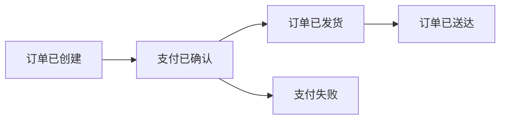

图 12-3：事件流

此步骤也是修正错误事件、删除重复项，以及必要时添加缺失事件的时机。

### 12.4.3 步骤 3：痛点

一旦事件按时间线组织好，利用这一宏观视图识别流程中需要关注的点。这些可以是瓶颈、需要自动化的手动步骤、缺失的文档或缺失的领域知识。

将这些低效之处显式化很重要，这样在 EventStorming 会话推进过程中可以轻松回到它们，或在事后加以解决。痛点用旋转成菱形形状的粉色便利贴标记，如图 12-4 所示。

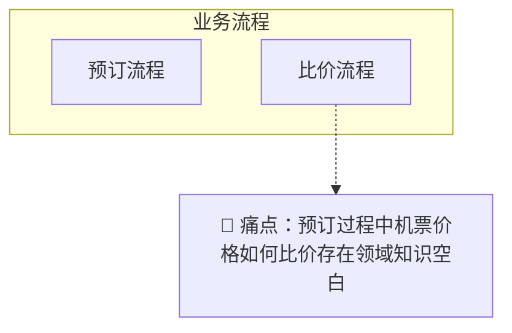

图 12-4：菱形粉色便利贴，指向流程中需要关注的方面：预订过程中机票价格如何比价存在领域知识空白

当然，此步骤并非记录痛点的唯一机会。作为引导者，要留意参与者在整个过程中的评论。当有人提出问题或担忧时，将其记录为痛点。

### 12.4.4 步骤 4：关键事件

一旦有了带有痛点的按时间线排列的事件，寻找表示上下文或阶段变化的重大业务事件。这些称为关键事件（pivotal events），用竖线标记，将关键事件前后的事件分开。

例如，「购物车已初始化」「订单已初始化」「订单已发货」「订单已送达」和「订单已退货」代表了订单流程中的重大变化，如图 12-5 所示。

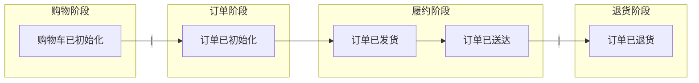

图 12-5：表示事件流中上下文变化的关键事件

关键事件是潜在限界上下文边界的指示器。

### 12.4.5 步骤 5：命令

领域事件描述的是已经发生的事情，而命令（command）描述的是触发了该事件或事件流的原因。命令描述系统的操作，与领域事件相反，使用祈使句表述。例如：

- 发布营销活动
- 回滚交易
- 提交订单

命令写在浅蓝色便利贴上，并放置在它们可能产生的事件之前。如果某个命令由特定角色的参与者执行，参与者信息用小型黄色便利贴附加在命令上，如图 12-6 所示。参与者代表业务领域中的用户角色，如客户、管理员或编辑。

自然，并非所有命令都有关联的参与者。因此，仅在显而易见的地方添加参与者信息。在下一步中，我们将用可以触发命令的额外实体来增强模型。

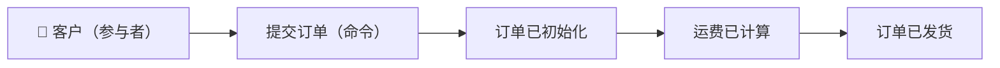

图 12-6：「提交订单」命令由客户（参与者）执行，随后是「订单已初始化」「运费已计算」「订单已发货」等事件

### 12.4.6 步骤 6：策略

几乎总有一些命令被添加到模型中，但没有特定的参与者与之关联。在此步骤中，你寻找可能执行这些命令的自动化策略（automation policies）。

自动化策略是指事件触发命令执行的场景。换句话说，当特定领域事件发生时，命令会自动执行。

在建模表面上，策略用紫色便利贴表示，将事件与命令连接起来，如图 12-7 中的「策略」便利贴所示。

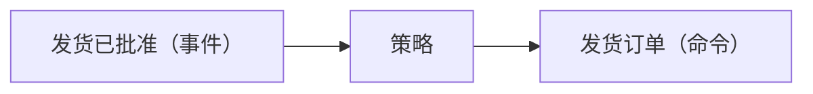

图 12-7：当观察到「发货已批准」事件时触发「发货订单」命令的自动化策略

如果命令只有在满足某些决策条件时才应被触发，你可以在策略便利贴上显式说明决策条件。例如，如果需要在「投诉已收到」事件后触发升级命令，但仅当投诉来自 VIP 客户时，你可以在策略便利贴上显式写明「仅限 VIP 客户」的条件。

如果事件和命令相距较远，可以在建模表面上画箭头连接它们。

### 12.4.7 步骤 7：读模型

读模型（read model）是参与者用来做出执行命令决策的领域内数据视图。这可以是系统的某个屏幕、报告、通知等。

读模型用绿色便利贴表示（见图 12-8 中的「购物车」便利贴），并简要描述支持参与者决策所需的信息来源。由于命令是在参与者查看读模型之后执行的，因此在建模表面上，读模型位于命令之前。

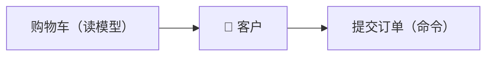

图 12-8：客户（参与者）做出提交订单（命令）决策所需的「购物车」（读模型）视图

### 12.4.8 步骤 8：外部系统

此步骤是关于用外部系统增强模型。外部系统（external system）定义为不属于正在探索的领域部分的任何系统。它可以执行命令（输入）或接收事件通知（输出）。

外部系统用粉色便利贴表示。在图 12-9 中，CRM（外部系统）触发「发货订单」命令的执行。当发货被批准（事件）时，通过策略将信息传达给 CRM（外部系统）。

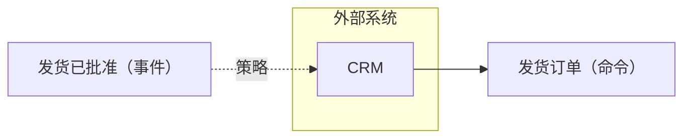

图 12-9：外部系统触发命令执行（左）及事件批准传达给外部系统（右）

到此步骤结束时，所有命令应由参与者执行、由策略触发或由外部系统调用。

### 12.4.9 步骤 9：聚合

一旦所有事件和命令都已表示，参与者可以开始思考将相关概念组织成聚合（aggregates）。聚合接收命令并产生事件。

聚合用大型黄色便利贴表示，左侧是命令，右侧是事件，如图 12-10 所示。

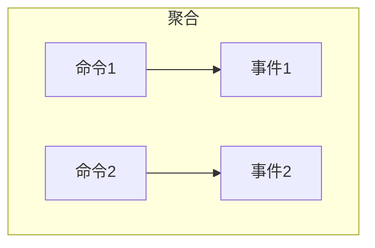

图 12-10：聚合中组织的命令和领域事件

### 12.4.10 步骤 10：限界上下文

EventStorming 会话的最后一步是寻找彼此相关的聚合——要么因为它们代表密切相关的功能，要么因为它们通过策略耦合。聚合组形成限界上下文边界的自然候选，如图 12-11 所示。

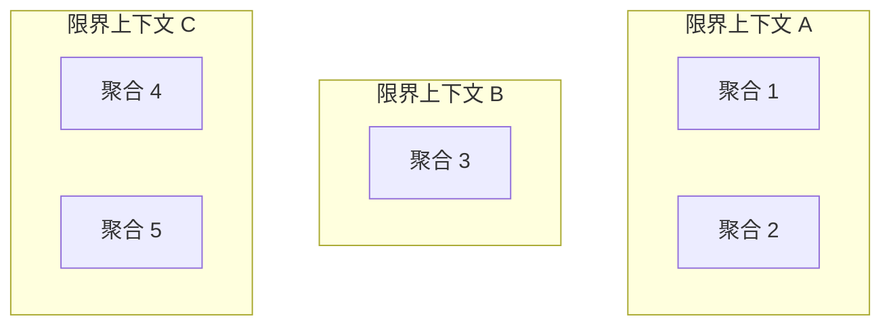

图 12-11：将所得系统分解为限界上下文的一种可能方式

## 12.5 变体

EventStorming 工作坊的创造者 Alberto Brandolini 将 EventStorming 流程定义为指导而非硬性规则。你可以自由尝试流程，找到最适合自己的「配方」。

根据我的经验，在组织中引入 EventStorming 时，我倾向于先通过步骤 1（混沌探索）到步骤 4（关键事件）探索业务领域的大图景。所得模型涵盖公司业务领域的广泛范围，为统一语言奠定坚实基础，并勾勒出限界上下文的可能边界。

在获得大图景并识别不同业务过程后，我们继续为每个相关业务过程引导专门的 EventStorming 会话——这次遵循所有步骤来建模完整过程。

在完整 EventStorming 会话结束时，你将拥有描述业务领域的事件、命令、聚合甚至可能限界上下文的模型。

然而，这些都只是锦上添花。EventStorming 会话的真正价值在于过程本身——不同利益相关者之间的知识分享、他们业务心智模型的对齐、冲突模型的发现，以及最后但同样重要的统一语言的形成。

所得模型可以作为实现事件溯源领域模型的基础。是否走这条路取决于你的业务领域。如果你决定实现事件溯源领域模型，你将拥有限界上下文边界、聚合，当然还有所需领域事件的蓝图。

## 12.6 何时使用 EventStorming

工作坊可以出于多种原因进行引导：

- **构建统一语言**：当小组合作构建业务过程模型时，他们会本能地同步术语并开始使用相同的语言。
- **建模业务过程**：EventStorming 会话是构建业务过程模型的有效方式。由于它基于 DDD 导向的构建块，它也是发现聚合和限界上下文边界的有效方式。
- **探索新业务需求**：你可以使用 EventStorming 确保所有参与者对新功能达成一致，并揭示业务需求未覆盖的边界情况。
- **恢复领域知识**：随着时间的推移，领域知识可能会丢失。这在需要现代化的遗留系统中尤为突出。EventStorming 是将每位参与者所掌握的知识合并成单一连贯图景的有效方式。
- **探索改进现有业务过程的方法**：对业务过程的端到端视图提供了发现低效和流程改进机会所需的视角。
- **融入新团队成员（onboarding）**：与新团队成员一起引导 EventStorming 会话是扩展其领域知识的绝佳方式。

除了何时使用 EventStorming 之外，何时不使用也很重要。当所探索的业务过程简单或显而易见时——例如遵循一系列顺序步骤且没有任何有趣的业务逻辑或复杂性——EventStorming 的效果会较差。

## 12.7 引导技巧

在引导一群从未做过 EventStorming 的人进行会话时，我倾向于先快速概述流程。我解释我们将要做什么、将要探索的业务过程，以及工作坊中使用的建模元素。在介绍这些元素——领域事件、命令、参与者等——时，我构建一个图例，如图 12-12 所示，使用我们将使用的便利贴和标签帮助参与者记住颜色代码。图例应在整个工作坊期间对所有参与者可见。

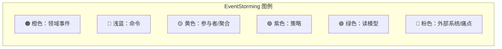

图 12-12：用相应便利贴描绘 EventStorming 流程各元素的图例

关注动态：随着工作坊推进，跟踪小组的能量很重要。如果动态放缓，看看能否通过提问重新点燃流程，或者是否该进入工作坊的下一阶段。

记住 EventStorming 是小组活动，因此要确保将其作为小组活动处理。确保每个人都有机会参与建模和讨论。如果你注意到有些参与者回避小组，尝试通过询问模型当前状态的问题让他们参与进来。

EventStorming 是一项高强度活动，在某个时刻小组需要休息。在所有参与者回到房间之前不要恢复会话。通过回顾模型当前状态来恢复流程，让小组回到协作建模的状态。

## 12.8 远程 EventStorming

EventStorming 最初被设计为一种低技术活动，人们在同一房间内互动和学习。工作坊的创造者 Alberto Brandolini 经常反对远程进行 EventStorming，因为当小组不在同一地点时，无法达到相同的参与度，进而无法达到相同的协作和知识分享水平。

然而，随着 2020 年 COVID-19 疫情的到来，面对面会议和按原意进行 EventStorming 变得不可能。许多工具试图实现远程 EventStorming 会话的协作和引导。在撰写本文时，其中最著名的是 miro.com。进行在线 EventStorming 时要更有耐心，并考虑到由此产生的较低效的沟通。

此外，我的经验表明，远程 EventStorming 会话在参与者较少时更有效。虽然面对面 EventStorming 会话可以有 10 人参加，但我倾向于将在线会话限制在 5 名参与者。当你需要更多参与者贡献他们的知识时，可以引导多次会话，然后比较并合并所得模型。

当情况允许时，回归面对面的 EventStorming。

---

## 结论

EventStorming 是一种基于协作的业务过程建模工作坊。除了所得模型之外，其主要价值在于知识分享。到会话结束时，所有参与者将同步他们对业务过程的心智模型，并迈出使用统一语言的第一步。

EventStorming 就像骑自行车。通过实践学习比在书中阅读要容易得多。尽管如此，工作坊有趣且易于引导。你不需要成为 EventStorming 黑带才能开始。只需引导会话，遵循步骤，并在过程中学习。

---

## 练习

1. 谁应被邀请参加 EventStorming 会话？
   - a. 软件工程师
   - b. 领域专家
   - c. 质量保证工程师
   - d. 所有对所探索业务领域有了解的利益相关者

2. 何时是引导 EventStorming 会话的好时机？
   - a. 构建统一语言。
   - b. 探索新业务领域。
   - c. 恢复遗留项目的丢失知识。
   - d. 引入新团队成员。
   - e. 发现优化业务过程的方法。
   - f. 以上所有答案都正确。

3. 你可以从 EventStorming 会话中期待什么结果？
   - a. 对业务领域更好的共同理解
   - b. 统一语言的坚实基础
   - c. 对业务领域理解中未覆盖的空白
   - d. 可用于实现领域模型的事件驱动模型
   - e. 以上所有，但取决于会话的目的

---

## 本章小结

EventStorming 是一种低技术、协作式的业务过程建模工作坊，其核心价值在于**知识分享**和**统一语言**的构建，而不仅仅是产出模型。

**参与者**：邀请与业务领域相关的多元利益相关者（工程师、领域专家、产品负责人、测试、设计等），小组规模建议不超过 10 人。

**所需物资**：大建模空间（墙面/白板）、多色便利贴、马克笔、零食、宽敞无桌椅阻碍的场地。

**十步流程**：非结构化探索（领域事件）→ 时间线（排序与分支）→ 痛点（瓶颈、缺失知识）→ 关键事件（上下文边界指示）→ 命令 → 策略（事件触发命令）→ 读模型 → 外部系统 → 聚合 → 限界上下文。

**变体**：可先做步骤 1–4 获得大图景，再针对各业务过程做完整十步；流程是指导而非硬性规则。

**适用场景**：构建统一语言、建模业务过程、探索新需求、恢复领域知识、改进流程、onboarding 新成员；不适用于简单、显而易见的流程。

**引导技巧**：提供图例、关注小组动态、确保人人参与、适时休息并回顾模型。

**远程 EventStorming**：效果不如面对面，可用 Miro 等工具；建议限制在线参与人数（如 5 人），情况允许时回归线下。

---

[← 上一章：演进设计决策](ch11-evolving-design-decisions.md) | [返回目录](../index.md) | [下一章：真实世界中的DDD →](ch13-ddd-in-real-world.md)
