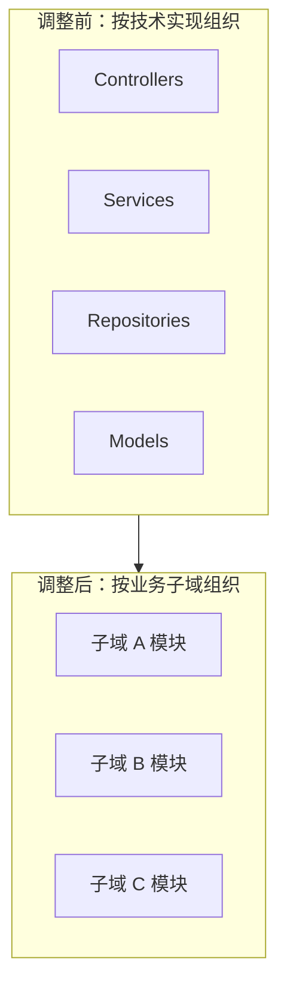
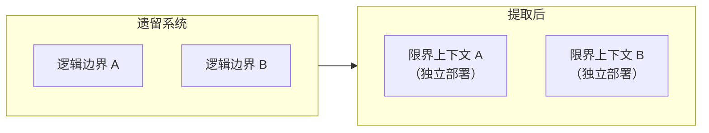
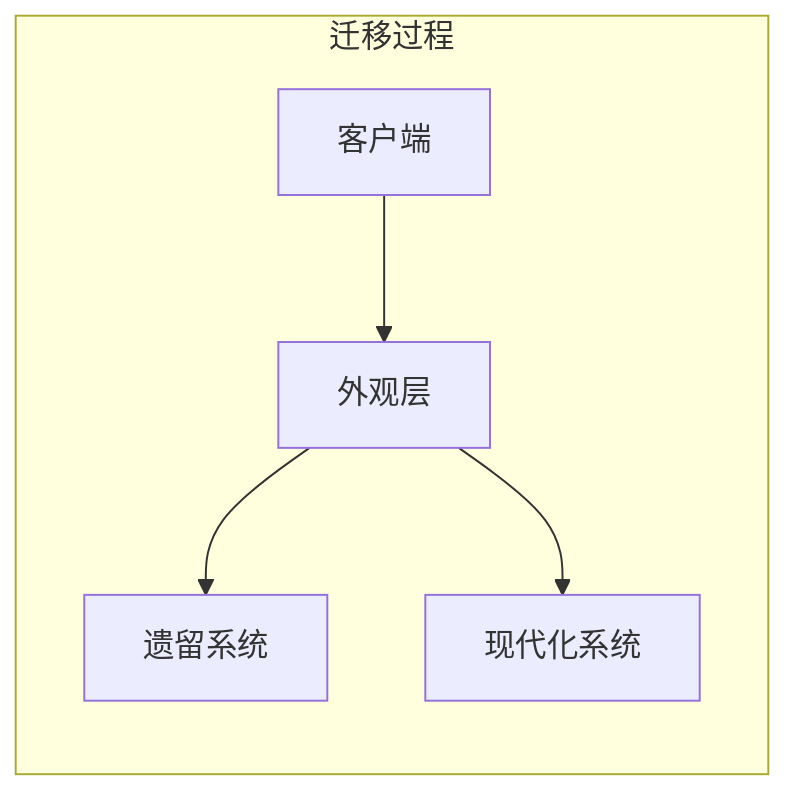
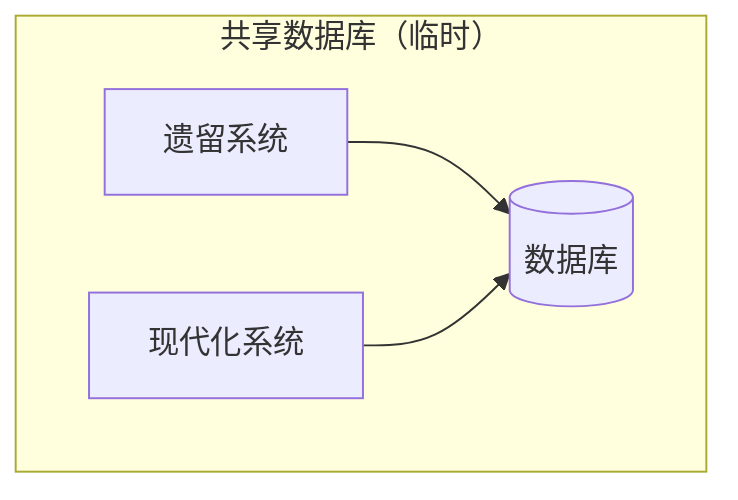

# 第13章：真实世界中的DDD

> 我们已介绍了领域驱动设计在分析业务领域、分享知识以及做出战略与战术设计决策方面的工具。想象一下，将这些知识付诸实践该有多棒。假设你正在做一个绿地项目（greenfield project），所有同事都精通领域驱动设计，从一开始就全力以赴设计有效的模型，当然也虔诚地使用统一语言。随着项目推进，限界上下文的边界清晰有效，保护着业务领域模型。最后，由于所有战术设计决策都与业务战略一致，代码库始终保持良好状态：它讲着统一语言，并实现了与模型复杂度相匹配的设计模式。好了，醒醒吧。

---

## 13.1 战略分析

你遇到上述那种理想实验室条件的概率，大概和彩票中奖差不多。当然有可能，但不太可能。遗憾的是，许多人误以为领域驱动设计只能应用于绿地项目，且只有在团队人人都是 DDD 黑带高手的理想条件下才能应用。讽刺的是，**最能从 DDD 中受益的，恰恰是棕地项目（brownfield projects）**：那些已经证明业务可行性、需要变革以对抗累积技术债务和设计熵的系统。巧合的是，我们软件工程生涯的大部分时间，都在与这类棕地、遗留、大泥球式的代码库打交道。

另一个关于 DDD 的常见误解是：它是非此即彼的命题——要么应用方法论提供的每一种工具，要么就不是领域驱动设计。事实并非如此。掌握所有这些概念本身就已令人应接不暇，更遑论在实践中落地。幸运的是，**你不需要应用所有模式和实践，就能从领域驱动设计中获得价值**。这在棕地项目中尤其如此，因为要在合理时间内引入所有模式和实践几乎不可能。

本章将学习在真实世界中应用领域驱动设计工具和模式的策略，包括棕地项目与不那么理想的环境。

按照我们探索领域驱动设计模式与实践的顺序，在组织中引入 DDD 的最佳起点是：投入时间理解组织的业务战略及其系统架构的现状。

### 13.1.1 理解业务领域

首先，识别公司的业务领域：

- 组织的业务领域是什么？
- 客户是谁？
- 组织向客户提供什么服务或价值？
- 组织与哪些公司或产品竞争？

回答这些问题可以让你对公司的高层目标有鸟瞰视角。接下来，「放大」到领域内部，寻找组织为实现高层目标所采用的业务构建块：**子域（subdomains）**。

一个不错的初始启发式是公司的组织架构图：其部门和其他组织单元。审视这些单元如何协作，使公司能在其业务领域中竞争。

此外，寻找特定类型子域的迹象。

**核心子域（Core subdomains）**

要识别公司的核心子域，寻找使其与竞争对手区分开来的因素：

- 公司是否有竞争对手所缺乏的「秘密配方」？例如，知识产权，如专利和内部设计的算法？
- 请记住，竞争优势——因而核心子域——未必是技术性的。公司是否拥有非技术性竞争优势？例如，吸引顶尖人才的能力、产出独特艺术设计的能力等？

另一个强大却不那么令人愉快的启发式是：识别设计最糟糕的软件组件——那些所有工程师都讨厌的大泥球，但业务因伴随的业务风险而不愿从头重写。关键在于，遗留系统无法用现成系统替代（否则就是通用子域），对它的任何修改都会带来业务风险。

**通用子域（Generic subdomains）**

要识别通用子域，寻找现成解决方案、订阅服务或开源软件集成。如第 1 章所述，竞争对手应能获得相同的现成解决方案，而使用相同解决方案的公司对你的公司不应产生业务影响。

**支撑子域（Supporting subdomains）**

对于支撑子域，寻找其余无法用现成方案替代、又不直接提供竞争优势的软件组件。若代码状况不佳，软件工程师的情绪反应会较小，因为变更不频繁。因此，次优软件设计的影响不如核心子域那么严重。

你不需要识别所有核心子域。即使对中型公司而言，这既不实际也不可能。相反，识别整体结构即可，但要更关注与你正在开发的软件系统最相关的子域。

### 13.1.2 探索当前设计

熟悉问题领域后，可以继续调查解决方案及其设计决策。首先从高层组件入手。这些不一定是 DDD 意义上的限界上下文，而是用于将业务领域分解为子系统的边界。

要寻找的特征是组件的**解耦生命周期**。即使子系统在同一源码控制仓库（mono-repo）中管理，或所有组件位于单一单体代码库中，也要检查哪些可以独立于其他组件演进、测试和部署。

**评估战术设计**

对每个高层组件，检查它包含哪些业务子域，以及采取了哪些技术设计决策：使用什么模式实现业务逻辑并定义组件的架构？

解决方案是否与问题的复杂度匹配？是否存在需要更精细设计模式的领域？反之，是否存在可以走捷径或使用现有现成解决方案的子域？利用这些信息做出更明智的战略与战术决策。

**评估战略设计**

利用对高层组件的了解，绘制当前设计的上下文映射图（context map），仿佛这些高层组件就是限界上下文。识别并追踪组件之间的关系，以限界上下文集成模式的形式呈现。

最后，分析所得的上下文映射图，从领域驱动设计视角评估架构。是否存在次优的战略设计决策？例如：

- 多个团队在同一高层组件上工作
- 核心子域的重复实现
- 核心子域由外包公司实现
- 因集成频繁失败而产生的摩擦
- 来自外部服务和遗留系统的别扭模型四处蔓延

这些洞察是规划设计现代化策略的良好起点。但首先，在获得对问题空间（业务领域）和解决方案空间（当前设计）的更深入理解后，寻找**丢失的领域知识**。

如第 11 章所述，业务领域知识可能因各种原因丢失。该问题在核心子域中普遍且严重，因为业务逻辑既复杂又业务关键。若遇到此类情况，可引导 EventStorming 会话尝试恢复知识，并将 EventStorming 会话作为培育统一语言的基础。

---

## 13.2 现代化策略

工程师试图从头重写系统、这次正确设计和实现整个系统的「大重写」努力，很少成功。管理层支持此类架构大改造的情况更是罕见。

::: tip Eric Evans
并非大型系统的所有部分都会被良好设计。这是我们必须接受的事实，因此必须战略性地决定在现代化努力上投入何处。

:::

更安全的改进现有系统设计的方法是：**想得大，起步小**。做出这一决策的前提是，要有划分系统子域的边界。边界不必是物理的——让每个子域成为完整的限界上下文。相反，先确保至少逻辑边界（命名空间、模块和包，取决于技术栈）与子域的边界对齐，如图 13-1 所示。

图 13-1：重组限界上下文的模块，使其反映业务子域边界而非技术实现模式

调整系统模块是一种相对安全的重构形式。你并未修改业务逻辑，只是将类型重新组织到更合理的结构中。但需确保按完整类型名引用、动态加载库、反射等不会破坏。

此外，要追踪在不同代码库中实现的子域业务逻辑：数据库中的存储过程、无服务器函数等。确保在这些平台中也引入新的边界。例如，若部分逻辑在数据库存储过程中处理，可重命名过程以反映其所属模块，或引入专用数据库模式并迁移存储过程。

### 13.2.1 战略现代化

如第 10 章所述，过早将系统分解为尽可能小的限界上下文可能具有风险。我们将在下一章更详细地讨论限界上下文与微服务。目前，寻找通过将逻辑边界转化为物理边界能获得最大价值的地方。通过将逻辑边界转化为物理边界来提取限界上下文的过程如图 13-2 所示。

图 13-2：通过将逻辑边界转化为物理边界来提取限界上下文

可向自己提问：

- 多个团队是否在同一代码库上工作？若是，通过为每个团队定义限界上下文来解耦开发生命周期。
- 不同组件是否使用冲突的模型？若是，将冲突模型迁移到独立的限界上下文中。

当所需的最小限界上下文就位后，审视它们之间的关系和集成模式。观察在不同限界上下文上工作的团队如何沟通与协作。尤其当它们通过临时或类似共享内核（shared kernel）的集成进行通信时，团队是否有共同目标及足够的协作水平？

关注上下文集成模式能解决的问题：

| 模式 | 适用场景 |
|------|----------|
| **客户-供应商关系（Customer–supplier）** | 组织成长使先前的沟通与协作模式失效。寻找为多工程团队合作关系设计的组件，但合作关系已不可持续。重构为适当的客户-供应商关系类型（遵从者、防腐层或开放主机服务）。 |
| **防腐层（Anticorruption layer）** | 保护限界上下文免受遗留系统影响，尤其当遗留系统使用低效模型并倾向于蔓延到下游组件时。另一常见用例是保护限界上下文免受其使用的上游服务公共接口频繁变更的影响。 |
| **开放主机服务（Open-host service）** | 若某组件实现细节的变更经常波及系统并影响其消费者，考虑将其设为开放主机服务：将其实现模型与对外暴露的公共 API 解耦。 |
| **各行其道（Separate ways）** | 尤其在大型组织中，可能遇到工程团队因必须协作和共同演进共享功能而产生的摩擦。若「纷争之源」功能并非业务关键——即不是核心子域——团队可以各行其道，各自实现自己的解决方案，消除摩擦来源。 |

### 13.2.2 战术现代化

首先，从战术角度寻找业务价值与实现策略之间最「痛苦」的不匹配，例如核心子域使用与模型复杂度不匹配的模式——事务脚本（transaction script）或活动记录（active record）。这些直接影响业务成功的系统组件变更最频繁，却因设计不佳而难以维护和演进。

**绞杀者模式（Strangler pattern）**

绞杀榕（strangler fig）是一类热带树木，具有独特的生长模式：绞杀榕在其他树木——宿主树——上生长。绞杀榕的种子落在宿主树高处枝干上，随着生长向下延伸直至扎根土壤。最终，绞杀榕的枝叶遮蔽宿主树，导致宿主树死亡。

图 13-3：绞杀榕在宿主树上生长

绞杀迁移模式基于与同名树木相同的生长动态。思路是创建新的限界上下文——绞杀者——用其实现新需求，并逐步将遗留上下文的功能迁移进去。同时，除热修复和其他紧急情况外，遗留限界上下文的演进与开发停止。最终，所有功能迁移到新的限界上下文——绞杀者——按此类比，导致宿主——遗留代码库——的死亡。

通常，绞杀模式与**外观模式（façade pattern）**配合使用：一层薄抽象作为公共接口，负责将请求转发给遗留或现代化限界上下文处理。迁移完成——即宿主死亡——后，外观被移除，因为不再需要（见图 13-4）。

图 13-4：外观层根据功能从遗留系统迁移到现代化系统的状态转发请求；迁移完成后，外观与遗留系统均被移除

与「每个限界上下文是独立子系统，因此不能与其他限界上下文共享数据库」的原则相反，在实现绞杀模式时该规则可以放宽。现代化和遗留上下文可以共用同一数据库，以避免复杂的上下文间集成，这在许多情况下可能涉及分布式事务——两个上下文必须处理相同数据，如图 13-5 所示。

图 13-5：遗留与现代化系统暂时共用同一数据库

放宽「每个限界上下文一个数据库」规则的条件是：最终——且越早越好——遗留上下文将被退役，数据库将仅由新实现使用。

**就地重构（Refactoring）**

绞杀式迁移的替代方案是在原地现代化遗留代码库，也称为重构。

**重构战术设计决策**

如第 11 章所述，你已了解迁移战术设计决策的各个方面。但在现代化遗留代码库时，有两点需要注意。

::: warning 小步迭代优于大重写
首先，小步增量比大重写更安全。因此，不要将事务脚本或活动记录直接重构为事件溯源领域模型。相反，先采取中间步骤：设计基于状态的聚合（state-based aggregates）。投入精力寻找有效的聚合边界。确保所有相关业务逻辑位于这些边界内。从基于状态到事件溯源聚合的迁移，将比在事件溯源聚合中发现错误的事务边界安全数个数量级。

:::

其次，遵循同样的小步增量逻辑，重构为领域模型不必是原子变更。相反，可以逐步引入领域模型模式的元素。

- 先寻找可能的值对象（value objects）。不可变对象可显著降低解决方案的复杂度，即使你尚未使用完整的领域模型。
- 如第 11 章所述，将活动记录重构为聚合不必一夜完成，可分步进行。先汇集相关业务逻辑。接下来分析事务边界。是否存在需要强一致性却操作最终一致数据的决策？或反之，解决方案是否在最终一致性就足够的地方强制了强一致性？分析代码库时，别忘了这些决策由业务而非技术驱动。只有在对事务需求进行彻底分析后，才应设计聚合边界。
- 最后，在重构遗留系统时，必要时用防腐层保护新代码库免受旧模型影响，并通过实现开放主机服务和暴露发布语言（published language）来保护消费者免受遗留代码库变更的影响。

---

## 13.3 培育统一语言

设计成功现代化的前提是领域知识和业务领域的有效模型。如本书多次提及，领域驱动设计的**统一语言（ubiquitous language）**对于获取知识和构建有效解决方案模型至关重要。

::: tip EventStorming 捷径
别忘了领域驱动设计获取领域知识的捷径：EventStorming。用 EventStorming 与领域专家构建统一语言，并探索遗留代码库，尤其当代码库是无人真正理解的未文档化混乱时。召集与其功能相关的所有人，探索业务领域。EventStorming 是恢复领域知识的绝佳工具。

:::

在掌握领域知识及其模型后，决定哪种业务逻辑实现模式最适合所讨论的业务功能。作为起点，使用第 10 章描述的设计启发式。接下来要做的决策涉及现代化策略：逐步替换整个系统组件（绞杀模式），还是逐步重构现有解决方案。

---

## 13.4 务实的领域驱动设计

如本章引言所述，应用领域驱动设计并非非此即彼的努力。你不需要应用 DDD 提供的每一种工具。例如，出于某种原因，战术模式可能不适合你。也许你更倾向于使用其他设计模式，因为它们在特定领域中效果更好，或仅仅因为你发现其他模式更有效。这完全没问题！

只要你能分析业务领域及其战略，寻找解决特定问题的有效模型，最重要的是，**基于业务领域的需求做出设计决策**：那就是领域驱动设计！

值得重申的是，领域驱动设计不是关于聚合或值对象。**领域驱动设计是让业务领域驱动软件设计决策**。

---

## 13.5 推广领域驱动设计

当我在技术会议上就这一主题演讲时，几乎每次都会被问到同一个问题：「听起来很棒，但我如何向团队和管理层『推销』领域驱动设计？」这是一个极其重要的问题。

推销很难，坦白地说，我讨厌推销。但话说回来，若仔细想想，设计软件就是在推销。我们在向团队、管理层或客户推销我们的想法。然而，一种覆盖如此广泛的设计决策方面、甚至延伸到工程区之外涉及其他利益相关者的方法论，可能极难推销。

管理层支持对于在组织中进行任何重大变革都至关重要。然而，除非高层管理者已熟悉领域驱动设计，或愿意投入时间学习该方法论的业务价值，否则这不会成为他们的首要考虑，尤其是 DDD 带来的工程流程看似巨大的转变。但幸运的是，这并不意味着你不能使用领域驱动设计。

### 13.5.1 地下领域驱动设计（Undercover DDD）

将领域驱动设计作为你专业工具箱的一部分，而非组织战略。DDD 的模式和实践是工程技术，既然软件工程是你的工作，就用它们！

下面看看如何在不张扬的情况下将 DDD 融入日常工作。

**统一语言**

使用统一语言是领域驱动设计的基石实践。它对于领域知识发现、沟通和有效解决方案建模至关重要。

幸运的是，这一实践如此简单，几乎等同于常识。仔细倾听利益相关者在谈论业务领域时使用的语言。温和地将术语从技术行话引导向业务含义。

寻找不一致的术语并寻求澄清。例如，若同一事物有多个名称，寻找原因。这些不同模型是否交织在同一解决方案中？寻找上下文并使其显式。若含义相同，遵循常识并要求使用一个术语。

此外，尽可能多与领域专家沟通。这些努力不必需要正式会议。茶水间和咖啡休息是很好的沟通促进剂。与领域专家谈论业务领域。尝试使用他们的语言。寻找理解上的困难并寻求澄清。别担心——领域专家通常乐于与真诚渴望学习问题领域的工程师合作！

最重要的是，在代码和所有项目相关沟通中使用统一语言。要有耐心。改变组织已使用一段时间的术语需要时间，但最终会流行起来。

**限界上下文**

在探索可能的分解选项时，回归限界上下文模式背后的原则：

- 为什么设计面向问题的模型优于为所有用例设计单一模型？因为「一刀切」的解决方案很少对任何事物有效。
- 为什么限界上下文不能承载冲突的模型？因为会增加认知负担和解决方案复杂度。
- 为什么多个团队在同一代码库上工作是坏主意？因为团队间的摩擦和协作受阻。

对限界上下文集成模式使用同样的推理：确保理解每种模式旨在解决的问题。

**战术设计决策**

在讨论战术设计模式时，不要诉诸权威：「我们在这里用聚合是因为 DDD 书这么说！」相反，诉诸逻辑。例如：

- 为什么显式事务边界重要？为了保护数据一致性。
- 为什么数据库事务不能修改多个聚合实例？为确保一致性边界正确。
- 为什么聚合的状态不能被外部组件直接修改？为确保所有相关业务逻辑集中且不重复。
- 为什么不能将聚合的部分功能卸载到存储过程？为确保逻辑不重复。重复的逻辑，尤其在系统逻辑和物理上相距较远的组件中，容易不同步并导致数据损坏。
- 为什么应追求小的聚合边界？因为宽事务范围既会增加聚合的复杂度，也会对性能产生负面影响。
- 为什么不能只把事件写入日志文件，而要用事件溯源？因为没有长期数据一致性保证。

说到事件溯源，当解决方案需要事件溯源领域模型时，实现这一模式可能难以推销。下面看一个可能对此有帮助的「绝地心法」。

**事件溯源领域模型**

尽管有许多优势，事件溯源对许多人来说听起来过于激进。与本书讨论的所有内容一样，解决方案是让业务领域驱动这一决策。

与领域专家交谈。向他们展示基于状态和基于事件的模型。解释差异以及事件溯源提供的优势，尤其在时间维度方面。通常情况下，他们会对其提供的洞察水平感到兴奋，并会主动倡导事件溯源。

在与领域专家互动时，别忘了继续推进统一语言！

---

## 练习

1. 假设你想在棕地项目中引入领域驱动设计工具和实践。你的第一步是什么？
   - a. 将所有业务逻辑重构为事件溯源领域模型。
   - b. 分析组织的业务领域及其战略。
   - c. 通过确保组件遵循正确限界上下文的原则来改进系统组件。
   - d. 在棕地项目中使用领域驱动设计是不可能的。

2. 绞杀模式在迁移过程中以哪些方式违背了领域驱动设计的某些核心原则？
   - a. 多个限界上下文使用共享数据库。
   - b. 若现代化的限界上下文是核心子域，其实现会在旧实现和新实现中重复。
   - c. 多个团队在同一限界上下文上工作。
   - d. A 和 B。

3. 为什么通常不建议将基于活动记录的业务逻辑直接重构为事件溯源领域模型？
   - a. 基于状态的模型使在学习过程中重构聚合边界更容易。
   - b. 逐步引入大变更更安全。
   - c. A 和 B。
   - d. 以上都不是。即使将事务脚本直接重构为事件溯源领域模型也是合理的。

4. 当你在引入聚合模式时，团队问为什么聚合不能直接引用所有可能的实体，从而可以从一个地方遍历整个业务领域。你如何回答他们？

---

## 本章小结

本章学习了在真实场景中利用领域驱动设计工具的各种技巧：在棕地项目和遗留代码库上工作，且团队不一定是 DDD 专家。

**战略分析**：与绿地项目一样，始终从分析业务领域开始。公司的目标是什么？实现这些目标的战略是什么？利用组织结构和现有软件设计决策识别组织的子域及其类型。

**现代化策略**：想得大，起步小。寻找痛点，寻找获得最大业务价值的机会。通过重构或替换相关组件来现代化遗留代码。无论哪种方式，都要逐步进行。大重写带来的风险大于业务价值！

**务实的 DDD**：即使 DDD 在组织中未被广泛采用，你也可以使用领域驱动设计工具。使用正确的工具，在与同事讨论时，始终诉诸每种模式背后的逻辑和原则。

**地下 DDD**：将 DDD 作为专业工具箱的一部分。从统一语言开始，用逻辑和原则而非权威来推广模式。

---

[← 上一章：EventStorming](ch12-eventstorming.md) | [返回目录](../index.md) | [下一章：微服务 →](../part4/ch14-microservices.md)
