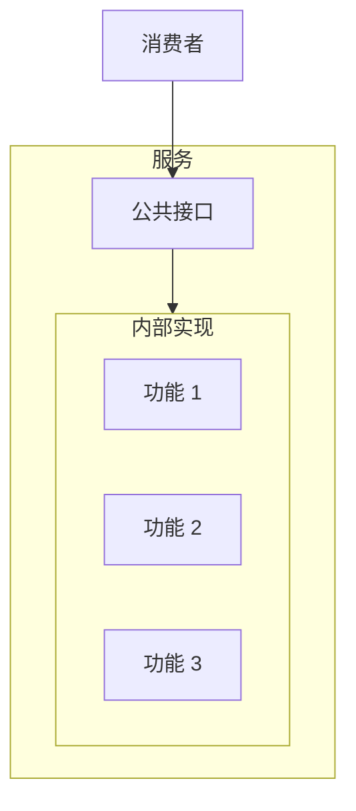
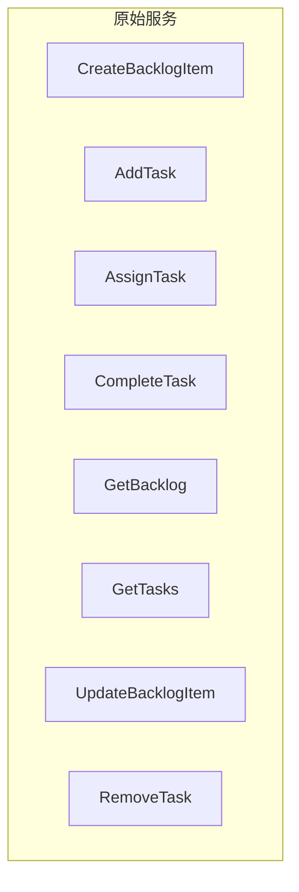
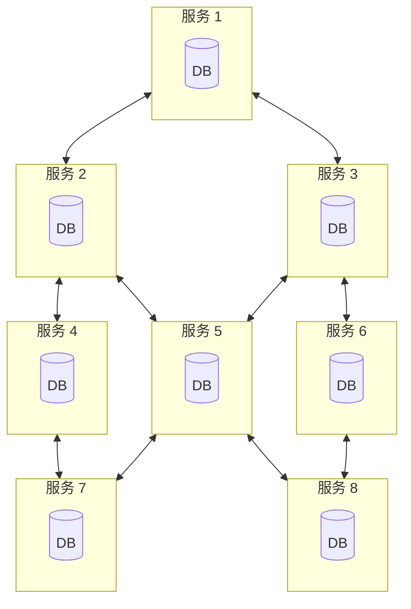
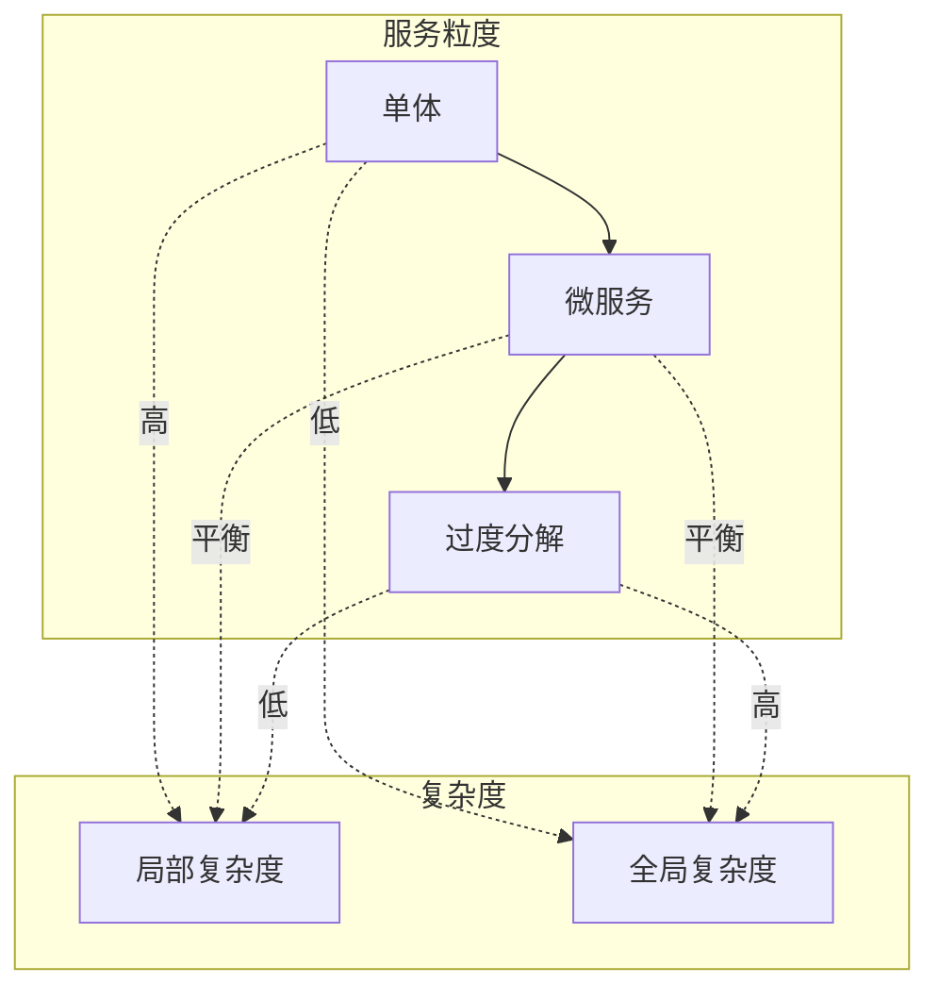
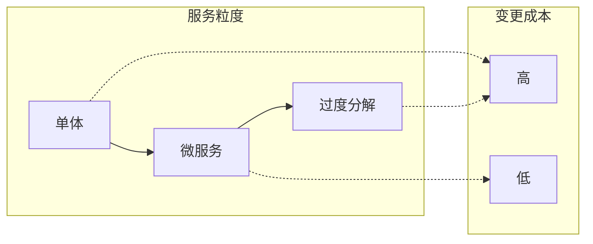
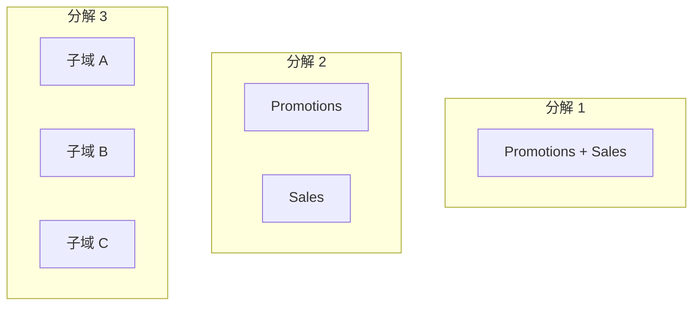
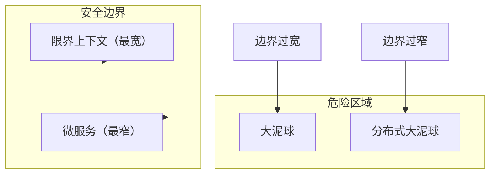
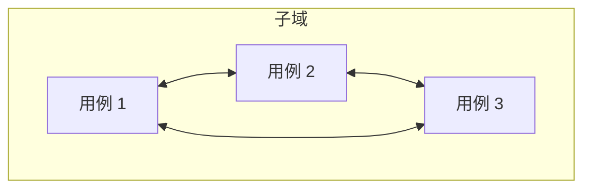

# 第14章：微服务

> 微服务与领域驱动设计在历史上常被联系在一起，尤其是与限界上下文模式。许多人甚至将「限界上下文」和「微服务」互换使用。但它们真的是同一回事吗？本章探讨领域驱动设计方法论与微服务架构模式之间的关系。你将了解二者之间的相互作用，更重要的是，如何利用 DDD 设计有效的基于微服务的系统。

---

## 14.1 什么是服务？

根据 OASIS 的定义，**服务**（service）是一种能够访问一个或多个能力的机制，其中访问通过规定的接口提供。规定的接口是任何将数据传入或传出服务的手段。它可以是同步的，例如请求/响应模型；也可以是异步的，例如生产和消费事件的模型。这就是服务的**公共接口**（public interface），如图 14-1 所示，它提供了与其他系统组件通信和集成的手段。


图 14-1：服务之间的通信

Randy Shoup 将服务的接口比作前门。所有进出服务的数据都必须经过这扇前门。此外，服务的公共接口定义了服务本身：服务暴露的功能。一个表达良好的接口足以描述服务实现的功能。例如，图 14-2 中的公共接口明确描述了服务的功能。



图 14-2：服务的公共接口

这就引出了微服务的定义。

---

## 14.2 什么是微服务？

微服务的定义出奇地简单。既然服务由其公共接口定义，那么**微服务**（microservice）就是具有**微公共接口**（micro-public interface）的服务：一扇微前门。

拥有微公共接口使人们更容易理解单个服务的功能及其与其他系统组件的集成。减少服务的功能也限制了其变更的原因，使服务在开发、管理和扩展方面更加自主。

此外，这也解释了微服务不暴露其数据库的实践。暴露数据库、使其成为服务前门的一部分，会使公共接口变得巨大。例如，你可以在关系型数据库上执行多少种不同的 SQL 查询？由于 SQL 是一门相当灵活的语言，可能的估计是无穷多。因此，微服务封装了它们的数据库。数据只能通过更紧凑、面向集成的公共接口访问。

---

## 14.3 方法即服务：完美的微服务？

说微服务是微公共接口看似简单，实则容易误导。听起来似乎将服务接口限制为单一方法就能得到完美的微服务。让我们看看在实践中应用这种朴素分解会发生什么。

考虑图 14-3 中的待办事项管理服务。其公共接口由八个公共方法组成，我们想应用「每个服务一个方法」的规则。



图 14-3：朴素的分解

由于这些是行为良好的微服务，每个都封装了自己的数据库。任何服务都不允许直接访问另一个服务的数据库；只能通过其公共接口。但目前没有这样的公共接口。服务必须协同工作，同步每个服务所做的变更。因此，我们需要扩展服务的接口以应对这些与集成相关的关注点。此外，当可视化时，所得服务之间的集成和数据流类似于典型的分布式大泥球，如图 14-4 所示。



图 14-4：集成复杂度

套用 Randy Shoup 的比喻，通过将系统分解到如此细粒度的服务，我们确实最小化了服务的前门。然而，为实现整体系统的功能，我们不得不为每个服务添加巨大的「员工专用」入口。让我们从这个例子中学到什么。

### 14.3.1 设计目标

遵循让每个服务只暴露单一方法的简单分解启发式，被证明在许多方面是次优的。首先，这根本不可能。由于服务必须协同工作，我们被迫用与集成相关的公共方法扩展其公共接口。其次，我们赢得了战斗却输掉了战争。每个服务最终都比原始设计简单得多，但所得系统却变得复杂了几个数量级。

微服务架构的目标是产生一个**灵活的系统**。将设计努力集中在单个组件上，却忽视其与系统其余部分的交互，违背了系统的定义：

- 一组协同运作的相互连接的事物或设备
- 为特定目的而一起使用的一组计算机设备和程序

因此，系统不能由独立组件构建而成。然而，在适当的基于微服务的系统中，无论解耦程度如何，服务仍然必须相互集成和通信。让我们看看单个微服务的复杂度与整体系统复杂度之间的相互作用。

### 14.3.2 系统复杂度

四十年前，没有云计算，没有全球规模需求，也不需要每 11.7 秒部署一次系统。但工程师仍然需要驯服系统的复杂度。尽管当时的工具不同，但挑战——更重要的是，解决方案——在今天仍然适用，可以应用于基于微服务的系统设计。

在《Composite/Structured Design》一书中，Glenford J. Myers 讨论了如何组织过程式代码以降低其复杂度。在书的首页，他写道：

::: tip Glenford J. Myers
复杂度的主题远不止于简单地试图最小化程序每个部分的局部复杂度。一种更重要的复杂度类型是**全局复杂度**：程序或系统整体结构的复杂度（即程序主要部分之间的关联或相互依赖程度）。

:::

在我们的语境中，**局部复杂度**（local complexity）是每个单独微服务的复杂度，而**全局复杂度**（global complexity）是整个系统的复杂度。局部复杂度取决于服务的实现；全局复杂度由服务之间的交互和依赖定义。在设计基于微服务的系统时，哪种复杂度更值得优化？让我们分析两个极端。

将全局复杂度降至最低出人意料地容易。我们只需消除系统组件之间的任何交互——即在一个单体服务中实现所有功能。如前所述，这种策略在某些场景下可能有效。在其他场景下，它可能导致可怕的大泥球：可能是局部复杂度的最高水平。

另一方面，我们知道当只优化局部复杂度而忽视系统的全局复杂度时会发生什么——更可怕的分布式大泥球。这种关系如图 14-5 所示。



图 14-5：服务粒度与系统复杂度

要设计适当的基于微服务的系统，我们必须同时优化全局和局部复杂度。将设计目标设定为单独优化其中一个是局部最优。全局最优是平衡两种复杂度。让我们看看微公共接口的概念如何有助于平衡全局和局部复杂度。

---

## 14.4 微服务即深度服务/模块

软件系统（或任何系统）中的**模块**（module）由其功能和逻辑定义。功能是模块应该做什么——其业务功能。逻辑是模块的业务逻辑——模块如何实现其业务功能。

在《The Philosophy of Software Design》一书中，John Ousterhout 讨论了模块化的概念，并提出了一个简单而强大的视觉启发式来评估模块的设计：**深度**（depth）。

Ousterhout 建议将模块可视化为矩形，如图 14-6 所示。矩形的顶边代表模块的功能，或其公共接口的复杂度。较宽的矩形代表更广泛的功能，而较窄的则具有更受限的功能，因而公共接口更简单。矩形的面积代表模块的逻辑，即其功能的实现。


图 14-6：深度模块

根据这一模型，有效的模块是**深的**：简单的公共接口封装了复杂的逻辑。无效的模块是**浅的**：浅层模块的公共接口封装的复杂度远少于深度模块。考虑以下代码中的方法：

```c
int AddTwoNumbers(int a, int b) 
{
  return a + b;
}
```

这是浅层模块的极端情况：公共接口（方法签名）与其逻辑（方法体）完全相同。拥有这样的模块会引入多余的「活动部件」，因此，非但没有封装复杂度，反而给整体系统增加了偶然复杂度。

### 14.4.1 微服务即深度模块

除了术语不同，深度模块的概念与微服务模式的区别在于，模块可以表示逻辑和物理边界，而微服务严格来说是物理边界。否则，两个概念及其背后的设计原则是相同的。

图 14-3 中实现单一业务方法的服务是浅层模块。由于我们不得不引入与集成相关的公共方法，所得接口比应有的「更宽」。

从系统复杂度的角度来看，深度模块降低了系统的全局复杂度，而浅层模块通过引入不封装其局部复杂度的组件而增加了全局复杂度。

浅层服务也是许多面向微服务的项目失败的原因。将微服务错误地定义为不超过 X 行代码的服务，或定义为应该重写比修改更容易的服务，这些定义都集中在单个服务上，却忽略了架构最重要的方面：**系统**。

系统可以分解为微服务的阈值由微服务所属系统的用例定义。如果我们将单体分解为服务，引入变更的成本会下降。当系统分解为微服务时，成本最小化。然而，如果你继续分解超过微服务阈值，深度服务会变得越来越浅。它们的接口会重新增长。这一次，由于集成需求，引入变更的成本也会上升，整体系统的架构将变成可怕的分布式大泥球。如图 14-7 所示。



图 14-7：粒度与变更成本

现在我们了解了什么是微服务，让我们看看领域驱动设计如何帮助我们找到深度服务的边界。

---

## 14.5 领域驱动设计与微服务的边界

与微服务一样，前面章节讨论的许多领域驱动设计模式都关乎边界：限界上下文是模型的边界，子域界定业务能力，而聚合和值对象是事务边界。让我们看看这些边界中哪些适用于微服务的概念。

### 14.5.1 限界上下文

微服务和限界上下文模式有很多共同之处，以至于这两种模式经常被互换使用。让我们看看是否真的如此：限界上下文的边界是否与有效微服务的边界相关？

微服务和限界上下文都是物理边界。微服务与限界上下文一样，由单一团队拥有。与限界上下文一样，冲突的模型不能在微服务中实现，否则会导致复杂的接口。微服务确实是限界上下文。但这种关系反过来成立吗？我们能说限界上下文就是微服务吗？

如第 3 章所学，限界上下文保护统一语言和模型的一致性。同一限界上下文中不能实现冲突的模型。假设你正在开发广告管理系统。在系统的业务领域中，业务实体 Lead 在 Promotions 和 Sales 上下文中由不同的模型表示。因此，Promotions 和 Sales 是限界上下文，各自定义 Campaign 实体的唯一有效模型，如图 14-8 所示。


图 14-8：限界上下文

为简化起见，假设除了 Lead 之外系统中没有其他冲突的模型。这使得所得的限界上下文自然较宽——每个限界上下文可以包含多个子域。子域可以从一个限界上下文移动到另一个。只要子域不隐含冲突的模型，图 14-9 中的所有替代分解都是完全有效的限界上下文。



图 14-9：限界上下文的替代分解

不同的限界上下文分解对应不同的需求，例如不同团队的规模和结构、生命周期依赖等。但我们能说本例中所有有效的限界上下文都必然是微服务吗？不能。尤其是考虑到分解 1 中两个限界上下文相对宽泛的功能。

因此，微服务与限界上下文之间的关系不是对称的。虽然微服务是限界上下文，但并非每个限界上下文都是微服务。另一方面，限界上下文表示**最大有效单体**的边界。这样的单体不应与大泥球混淆；它是一种可行的设计选择，保护其统一语言或业务领域模型的一致性。如第 15 章将讨论的，在某些情况下，这种宽泛的边界比微服务更有效。

图 14-10 直观地展示了限界上下文与微服务之间的关系。限界上下文与微服务之间的区域是**安全的**。这些是有效的设计选择。然而，如果系统没有分解为适当的限界上下文，或分解超过微服务阈值，将分别导致大泥球或分布式大泥球。



图 14-10：粒度与模块化

接下来，让我们检验另一个极端：聚合是否能帮助找到微服务的边界。

### 14.5.2 聚合

限界上下文对最宽有效边界施加限制，而**聚合**（aggregate）模式则相反。聚合的边界是**可能的最窄边界**。将聚合分解为多个物理服务或限界上下文不仅次优，而且如附录 A 所述，至少会导致不良后果。

与限界上下文一样，聚合的边界也常被认为驱动微服务的边界。聚合是不可分割的业务功能单元，封装了其内部业务规则、不变式和逻辑的复杂度。也就是说，如本章前面所学，微服务不是关于单个服务的。单个服务必须在其与系统其他组件的交互语境中考虑：

- 所讨论的聚合是否与其子域中的其他聚合通信？
- 它是否与其他聚合共享值对象？
- 聚合的业务逻辑变更影响子域其他组件的可能性有多大，反之亦然？

聚合与其子域其他业务实体的关系越强，作为单独服务时就越浅。

在某些情况下，将聚合作为服务会产生模块化设计。然而，更常见的是，这种细粒度服务会增加整体系统的全局复杂度。

### 14.5.3 子域

设计微服务的一个更平衡的启发式是**将服务与业务子域的边界对齐**。如第 1 章所学，子域与细粒度业务能力相关。这些是公司在业务领域中竞争所需的业务构建块。从业务领域视角，子域描述能力——业务做什么——而不解释能力如何实现。从技术视角，子域代表**一组连贯的用例**：使用相同的业务领域模型，处理相同或密切相关的数据，具有强烈的功能关系。一个用例的业务需求变更很可能影响其他用例，如图 14-11 所示。



图 14-11：子域

子域的粒度以及对功能——「做什么」而非「怎么做」——的关注，使子域天然成为深度模块。子域的描述——功能——封装了更复杂的实现细节——逻辑。子域中包含的用例的连贯性也确保了所得模块的深度。在许多情况下将它们拆分会导致更复杂的公共接口，从而产生更浅的模块。所有这些使子域成为设计微服务的**安全边界**。

将微服务与子域对齐是一种安全的启发式，能为大多数微服务产生最优解。也就是说，会有其他边界更高效的情况；例如，保持在限界上下文的更宽语言边界内，或由于非功能需求而诉诸将聚合作为微服务。解决方案不仅取决于业务领域，还取决于组织的结构、业务策略和非功能需求。如第 11 章所讨论的，持续使软件架构和设计适应环境变化至关重要。

---

## 14.6 压缩微服务的公共接口

除了寻找服务边界，领域驱动设计还可以帮助使服务更深。本节演示**开放主机服务**（open-host service）和**防腐层**（anticorruption layer）模式如何简化微服务的公共接口。

### 14.6.1 开放主机服务

开放主机服务将限界上下文的业务领域模型与用于与系统其他组件集成的模型解耦，如图 14-12 所示。

引入面向集成的模型——**发布语言**（published language）——降低了系统的全局复杂度。首先，它允许我们演进服务的实现而不影响其消费者：新的实现模型可以翻译为现有的发布语言。其次，发布语言暴露了更克制的模型。它是围绕集成需求设计的。它封装了与服务消费者无关的实现复杂度。例如，它可以暴露更少的数据，并以对消费者更便利的模型呈现。

在相同实现（逻辑）之上拥有更简单的公共接口（功能），使服务更「深」，有助于更有效的微服务设计。


图 14-12：通过发布语言集成服务

### 14.6.2 防腐层

**防腐层**（Anticorruption Layer, ACL）模式则相反。它降低了将服务与其他限界上下文集成的复杂度。传统上，防腐层属于它所保护的限界上下文。然而，如第 9 章所讨论的，这一概念可以更进一步，实现为**独立服务**。

图 14-13 中的 ACL 服务既降低了消费方限界上下文的局部复杂度，也降低了系统的全局复杂度。消费方限界上下文的业务复杂度与集成复杂度分离。后者被卸载到 ACL 服务。由于消费方限界上下文使用更便利、面向集成的模型工作，其公共接口被压缩——它不反映生产方服务暴露的集成复杂度。


图 14-13：作为独立服务的防腐层

---

## 练习

1. 限界上下文与微服务之间的关系是什么？
   - a. 所有微服务都是限界上下文。
   - b. 所有限界上下文都是微服务。
   - c. 微服务和限界上下文是同一概念的不同术语。
   - d. 微服务和限界上下文是完全不同的概念，无法比较。

2. 微服务的哪部分应该是「微」的？
   - a. 实现微服务的团队所需披萨的数量。该指标必须考虑团队成员不同的饮食偏好和平均每日卡路里摄入量。
   - b. 实现服务功能所需的代码行数。由于该指标与行宽无关，最好在超宽显示器上实现微服务。
   - c. 设计基于微服务系统最重要的方面是获得微服务友好的中间件和其他基础设施组件，  preferably 来自微服务认证供应商。
   - d. 跨越服务边界暴露、由其公共接口反映的业务领域及其复杂性的知识。

3. 什么是安全的组件边界？
   - a. 比限界上下文更宽的边界。
   - b. 比微服务更窄的边界。
   - c. 限界上下文（最宽）与微服务（最窄）之间的边界。
   - d. 所有边界都是安全的。

4. 将微服务与聚合的边界对齐是好的设计决策吗？
   - a. 是，聚合始终适合作为微服务。
   - b. 否，聚合绝不应作为单独的微服务暴露。
   - c. 不可能将单个聚合做成微服务。
   - d. 决策取决于业务领域。

---

## 本章小结

历史上，基于微服务的架构风格与领域驱动设计深度交织，以至于「微服务」和「限界上下文」这两个术语经常被互换使用。本章我们分析了两者之间的联系，发现它们并非同一回事。

**所有微服务都是限界上下文，但并非所有限界上下文都必然是微服务**。本质上，微服务定义了服务的最小有效边界，而限界上下文保护所包含模型的一致性，表示最宽的有效边界。将边界定义得比限界上下文更宽会导致大泥球，而比微服务更窄的边界会导致分布式大泥球。

尽管如此，微服务与领域驱动设计之间的联系是紧密的。我们看到了如何利用领域驱动设计工具设计有效的微服务边界。

**服务与微服务**：服务由其规定的公共接口定义；微服务是具有微公共接口的服务——一扇微前门。微服务封装数据库，只通过紧凑的集成导向接口暴露数据。

**设计目标**：微服务架构的目标是产生灵活的系统。单独优化局部复杂度或全局复杂度都是局部最优；全局最优是平衡二者。深度模块（简单接口封装复杂逻辑）降低全局复杂度；浅层模块增加全局复杂度。

**DDD 与边界**：限界上下文表示最宽有效边界；聚合表示最窄有效边界。将微服务与子域对齐是安全启发式。开放主机服务和防腐层可以压缩公共接口，使服务更深。

---

[← 上一章：真实世界中的DDD](../part3/ch13-ddd-in-real-world.md) | [返回目录](../index.md) | [下一章：事件驱动架构 →](ch15-event-driven-architecture.md)
