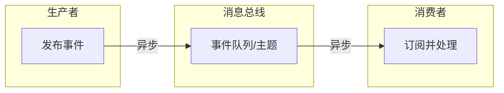
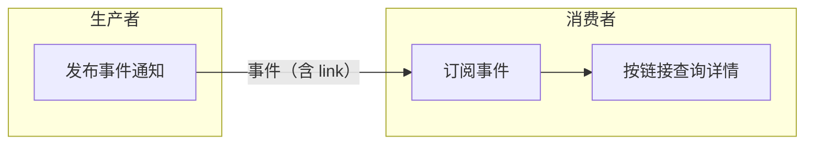
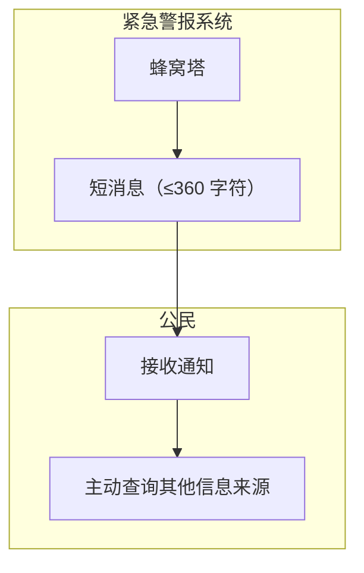
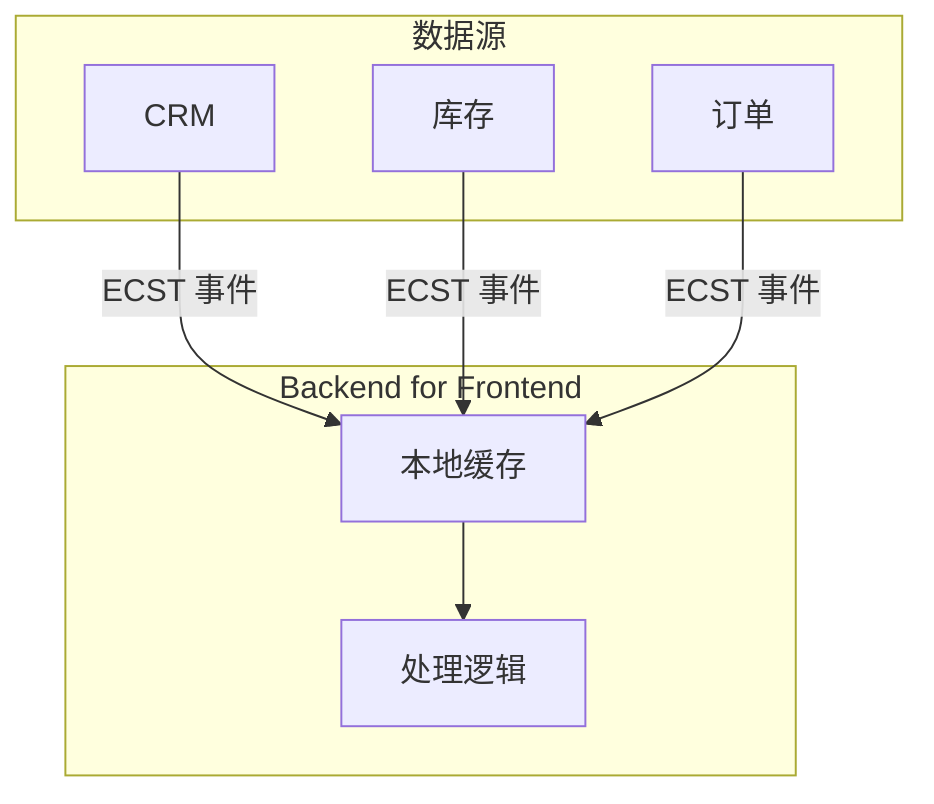
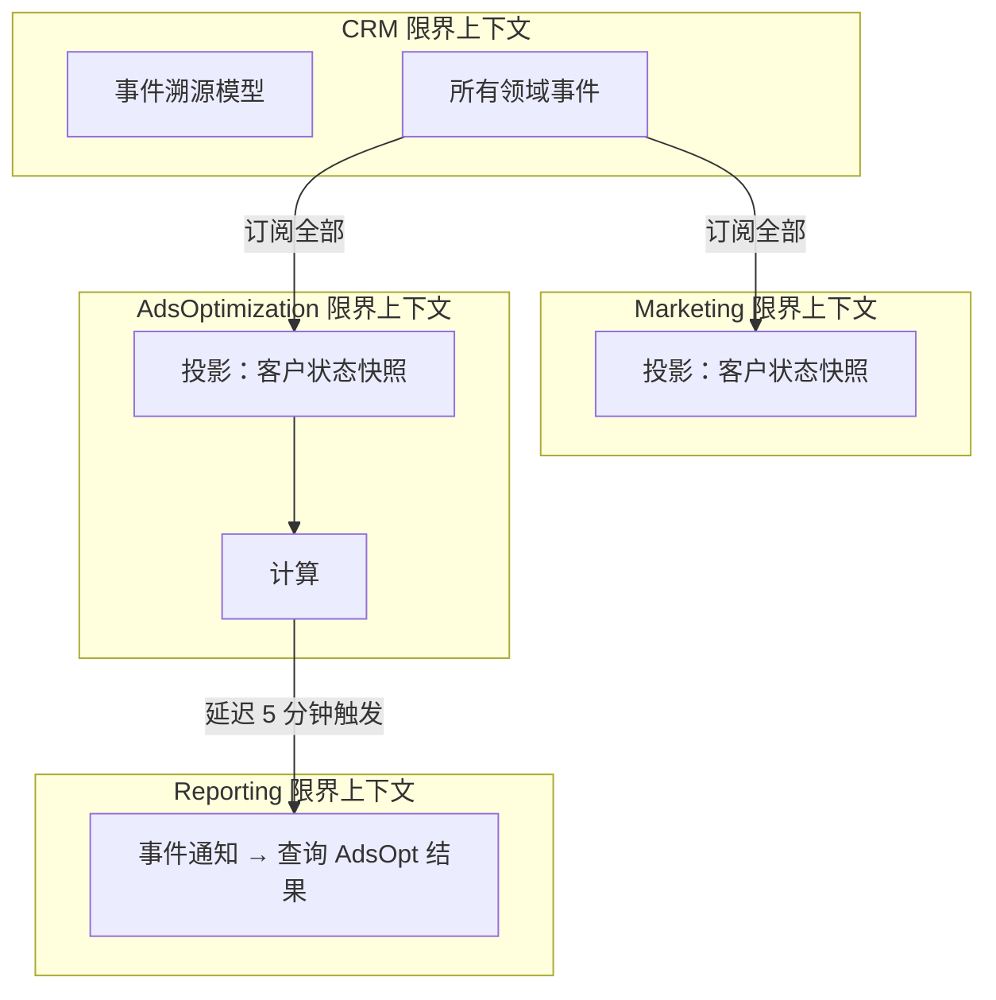
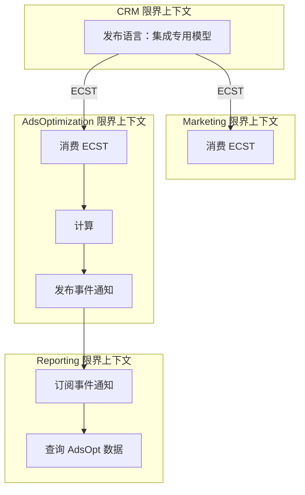

# 第15章：事件驱动架构

> 与微服务一样，事件驱动架构（EDA）在现代分布式系统中无处不在。许多人在设计松耦合、可扩展、容错的分布式系统时，建议将事件驱动通信作为默认的集成机制。事件驱动架构常与领域驱动设计联系在一起——毕竟 EDA 基于事件，而事件在 DDD 中也很突出：我们有领域事件，必要时甚至将事件作为系统的唯一真相来源。将 DDD 的事件直接用作事件驱动架构的基础，听起来很诱人。但这是好主意吗？事件并非可以随意浇在遗留系统上、就能将其变成松耦合分布式系统的万能灵药。恰恰相反：粗心地应用 EDA 可能将模块化单体变成分布式大泥球。本章我们将探讨 EDA 与 DDD 之间的相互作用，你将学习事件驱动架构的基本构件、EDA 项目失败的常见原因，以及如何利用 DDD 的工具设计有效的异步集成系统。

---

## 15.1 事件驱动架构

简单来说，**事件驱动架构**（Event-Driven Architecture, EDA）是一种架构风格，其中系统的组件通过交换事件消息进行异步通信（见图 15-1）。组件不是同步调用服务的端点，而是发布事件以通知系统其他元素领域中的变化。组件可以订阅系统中产生的事件并做出相应反应。事件驱动执行流的典型例子是第 9 章描述的 saga 模式。



图 15-1：异步通信

::: warning 事件驱动架构与事件溯源的区别
必须强调**事件驱动架构**与**事件溯源**（event sourcing）之间的区别。如第 7 章所述，事件溯源是一种将状态变化捕获为一系列事件的方法。尽管二者都基于事件，但这两个模式在概念上不同：**EDA 指服务之间的通信**，而**事件溯源发生在服务内部**。为事件溯源设计的事件表示（事件溯源领域模型中聚合的）状态转换，在服务内部实现，旨在捕获业务领域的细节，而非用于将服务与其他系统组件集成。如本章后文所示，存在三种类型的事件，其中某些更适合用于集成。

:::

---

## 15.2 事件

在 EDA 系统中，事件的交换是集成组件、使其成为系统的关键通信机制。让我们更详细地了解事件，以及它们与消息的区别。

### 15.2.1 事件、命令与消息

到目前为止，事件的定义与消息模式的定义相似。然而二者不同：**事件是一种消息，但消息不一定是事件**。消息有两种类型：

| 类型 | 英文 | 定义 |
|------|------|------|
| **事件** | Event | 描述已经发生的变化的消息 |
| **命令** | Command | 描述需要执行的操作的消息 |

事件是已经发生的事，而命令是要求做某事的指令。事件和命令都可以作为消息异步通信。然而，**命令可以被拒绝**：命令的目标可以拒绝执行命令，例如命令无效或违反系统业务规则时。而事件的接收者无法取消事件——事件描述的是已经发生的事。推翻事件的唯一方式是发出补偿动作（compensating action），即命令，正如 saga 模式中的做法。

由于事件描述已经发生的事，事件的名称应使用**过去时**：例如 `DeliveryScheduled`、`ShipmentCompleted` 或 `DeliveryConfirmed`。

### 15.2.2 结构

事件是一种可序列化并通过所选消息平台传输的数据记录。典型的事件模式包括事件的元数据及其 **payload**（事件所传达的信息）：

```json
{
    "type": "delivery-confirmed",
    "event-id": "14101928-4d79-4da6-9486-dbc4837bc612",
    "correlation-id": "08011958-6066-4815-8dbe-dee6d9e5ebac",
    "delivery-id": "05011927-a328-4860-a106-737b2929db4e",
    "timestamp": 1615718833,
    "payload": {
        "confirmed-by": "17bc9223-bdd6-4382-954d-f1410fd286bd",
        "delivery-time": 1615701406
    }
}
```

事件的 payload 不仅描述事件传达的信息，还定义事件的类型。下面详细讨论三种事件类型及其区别。

### 15.2.3 事件类型

事件可分为三种类型：**事件通知**（event notification）、**事件携带状态转移**（event-carried state transfer, ECST）或**领域事件**（domain event）。

#### 事件通知

**事件通知**（event notification）是关于业务领域变化的消息，其他组件将对此做出反应。例如 `PaycheckGenerated`、`CampaignPublished` 等。

事件通知不应冗长：目标是通知相关方发生了事件，但通知不应携带订阅者做出反应所需的全部信息。例如：

```json
{
    "type": "paycheck-generated",
    "event-id": "537ec7c2-d1a1-2005-8654-96aee1116b72",
    "delivery-id": "05011927-a328-4860-a106-737b2929db4e",
    "timestamp": 1615726445,
    "payload": {
        "employee-id": "456123",
        "link": "/paychecks/456123/2021/01"
    }
}
```

上述代码中，事件通知外部组件已生成工资单，但不携带与工资单相关的全部信息。接收者可以按链接获取更详细的信息。这种通知流程如图 15-2 所示。



图 15-2：事件通知流程

从某种意义上说，通过事件通知消息的集成类似于美国的无线紧急警报（WEA）系统和欧洲的 EU-Alert（见图 15-3）。这些系统通过蜂窝塔广播短消息，通知公民公共卫生、安全威胁和其他紧急情况。系统限制为最多 360 字符的消息。这条短消息足以通知你紧急情况，但你必须主动使用其他信息来源获取更多细节。



图 15-3：紧急警报系统

简洁的事件通知在多种场景中更可取。我们来看两个：安全性和并发性。

- **安全性**：强制接收者显式查询详细信息，可防止在消息基础设施上共享敏感信息，并要求订阅者访问数据时进行额外授权。
- **并发性**：由于事件驱动集成的异步性，信息到达订阅者时可能已经过时。若信息对竞态条件敏感，显式查询可获取最新状态。此外，在并发消费者场景下，若只有一个订阅者应处理事件，查询过程可与悲观锁集成，确保生产者端没有其他消费者能处理该消息。

#### 事件携带状态转移

**事件携带状态转移**（Event-Carried State Transfer, ECST）消息通知订阅者生产者内部状态的变化。与事件通知消息相反，ECST 消息包含反映状态变化的全部数据。

ECST 消息有两种形式。第一种是修改实体状态的**完整快照**：

```json
{
    "type": "customer-updated",
    "event-id": "6b7ce6c6-8587-4e4f-924a-cec028000ce6",
    "customer-id": "01b18d56-b79a-4873-ac99-3d9f767dbe61",
    "timestamp": 1615728520,
    "payload": {
        "first-name": "Carolyn",
        "last-name": "Hayes",
        "phone": "555-1022",
        "status": "follow-up-set",
        "follow-up-date": "2021/05/08",
        "birthday": "1982/04/05",
        "version": 7
    }
}
```

上述示例中的 ECST 消息包含客户更新状态的完整快照。处理大型数据结构时，可能只在 ECST 消息中包含实际修改的字段：

```json
{
    "type": "customer-updated",
    "event-id": "6b7ce6c6-8587-4e4f-924a-cec028000ce6",
    "customer-id": "01b18d56-b79a-4873-ac99-3d9f767dbe61",
    "timestamp": 1615728520,
    "payload": {
        "status": "follow-up-set",
        "follow-up-date": "2021/05/10",
        "version": 8
    }
}
```

无论 ECST 消息包含完整快照还是仅包含更新字段，此类事件流都允许消费者维护实体状态的本地缓存并与之协作。从概念上讲，使用事件携带状态转移消息是一种**异步数据复制机制**。这种方法使系统更具容错性，即消费者即使生产者不可用也能继续运行。这也是提升需要处理多源数据组件性能的一种方式：不必每次需要数据时都查询数据源，所有数据都可以在本地缓存，如图 15-4 所示。



图 15-4：Backend for Frontend

#### 领域事件

第三种事件消息是第 6 章描述的**领域事件**（domain event）。在某种程度上，领域事件介于事件通知和 ECST 消息之间：它们既描述业务领域中的重要事件，又包含描述该事件的全部数据。尽管有相似之处，这些消息类型在概念上不同。

### 15.2.4 领域事件与事件通知

领域事件和事件通知都描述生产者业务领域的变化。但有两个概念上的区别：

1. **领域事件包含描述事件的全部信息**。消费者无需采取进一步行动即可获得完整图景。
2. **建模意图不同**。事件通知的设计意图是简化与其他组件的集成。领域事件则旨在建模和描述业务领域。即使没有外部消费者感兴趣，领域事件也可能有用。在事件溯源系统中尤其如此，其中领域事件用于建模所有可能的状态转换。若外部消费者对所有可用领域事件都感兴趣，将导致次优设计。本章后文将详细讨论。

### 15.2.5 领域事件与事件携带状态转移

领域事件包含的数据在概念上不同于典型 ECST 消息的模式。

ECST 消息提供足够的信息以维护生产者数据的本地缓存。单个领域事件不应暴露如此丰富的模型。即使特定领域事件包含的数据也不足以缓存聚合的状态，因为消费者未订阅的其他领域事件可能影响相同字段。

此外，与通知事件一样，两种消息的建模意图不同。领域事件包含的数据并非旨在描述聚合的状态，而是描述其生命周期中发生的业务事件。

### 15.2.6 事件类型示例

以下示例展示三种事件类型的区别。考虑用三种方式表示结婚事件：

```javascript
eventNotification = {
    "type": "marriage-recorded",
    "person-id": "01b9a761",
    "payload": {
        "person-id": "126a7b61",
        "details": "/01b9a761/marriage-data"
    }
};

ecst = {
    "type": "personal-details-changed",
    "person-id": "01b9a761",
    "payload": {
        "new-last-name": "Williams"
    }
};

domainEvent = {
    "type": "married",
    "person-id": "01b9a761",
    "payload": {
        "person-id": "126a7b61",
        "assumed-partner-last-name": true
    }
};
```

- **`marriage-recorded`** 是事件通知消息。除指定 ID 的人已结婚这一事实外，不包含其他信息。它只包含事件的最少信息，需要更多细节的消费者必须访问 `details` 字段中的链接。
- **`personal-details-changed`** 是事件携带状态转移消息。它描述个人详情的变化，即姓氏已更改。消息不解释更改原因——是结婚还是离婚？
- **`married`** 是领域事件。它尽可能贴近业务领域中事件的性质建模，包含人员 ID 和表示是否采用配偶姓氏的标志。

---

## 15.3 设计事件驱动集成

如第 3 章所述，软件设计主要是关于边界的。边界定义什么属于内部、什么留在外部，最重要的是什么跨越边界——本质上，组件如何相互集成。在基于 EDA 的系统中，事件是一等设计元素，既影响组件的集成方式，也影响组件本身的边界。选择正确的事件消息类型，可以使分布式系统解耦，也可以使其耦合。

本节你将学习应用不同事件类型的启发式。但首先，让我们看看如何用事件设计强耦合的分布式大泥球。

### 15.3.1 分布式大泥球

考虑图 15-5 所示的系统。

CRM 限界上下文实现为事件溯源的领域模型。当 CRM 系统需要与 Marketing 限界上下文集成时，团队决定利用事件溯源数据模型的灵活性，让消费者（此处为 Marketing）订阅 CRM 的领域事件，并用它们投影出符合其需求的模型。

当引入 AdsOptimization 限界上下文时，它也需要处理 CRM 限界上下文产生的信息。团队再次决定让 AdsOptimization 订阅 CRM 产生的所有领域事件，并投影出符合 AdsOptimization 需求的模型。



图 15-5：强耦合的分布式系统

有趣的是，Marketing 和 AdsOptimization 限界上下文必须以相同格式呈现客户信息，因此最终从 CRM 的领域事件投影出相同的模型：每个客户状态的扁平快照。

Reporting 限界上下文仅订阅 CRM 发布的领域事件子集，并作为事件通知消息获取 AdsOptimization 上下文中执行的计算。然而，由于 AdsOptimization 和 Reporting 限界上下文使用相同事件触发计算，为确保 Reporting 模型更新，AdsOptimization 上下文引入了延迟——它在收到消息后五分钟才处理。

这种设计很糟糕。让我们分析系统中的耦合类型。

### 15.3.2 时间耦合

AdsOptimization 和 Reporting 限界上下文存在**时间耦合**（temporal coupling）：它们依赖严格的执行顺序。AdsOptimization 组件必须先完成处理，Reporting 模块才能被触发。若顺序颠倒，Reporting 系统将产生不一致的数据。

为强制执行顺序，工程师在 Reporting 系统中引入了处理延迟。这五分钟的延迟让 AdsOptimization 组件完成所需计算。显然，这并不能防止错误的执行顺序：

- AdsOptimization 可能过载，无法在五分钟内完成处理。
- 网络问题可能延迟将传入消息送达 AdsOptimization 服务。
- AdsOptimization 组件可能发生故障并停止处理传入消息。

### 15.3.3 功能耦合

Marketing 和 AdsOptimization 限界上下文都订阅了 CRM 的领域事件，最终实现了相同的客户数据投影。换句话说，将传入领域事件转换为基于状态表示的业务逻辑在两个限界上下文中重复，且具有相同的变更原因：它们必须以相同格式呈现客户数据。因此，若其中一个组件的投影发生变化，变更必须在第二个限界上下文中复制。

这是**功能耦合**（functional coupling）的例子：多个组件实现相同的业务功能，若其变化，两个组件必须同时变更。

### 15.3.4 实现耦合

这种耦合更微妙。Marketing 和 AdsOptimization 限界上下文订阅了 CRM 事件溯源模型生成的所有领域事件。因此，CRM 实现的变化（如添加新领域事件或更改现有事件的模式）必须在两个订阅限界上下文中反映！否则会导致数据不一致。例如，若事件的模式发生变化，订阅者的投影逻辑将失败。另一方面，若 CRM 模型中添加了新的领域事件，它可能影响投影模型，忽略它将导致投影不一致的状态。

### 15.3.5 重构事件驱动集成

如你所见，盲目地将事件浇在系统上既不会使其解耦，也不会使其更具弹性。你可能认为这是不现实的例子，但不幸的是，这个例子基于真实故事。让我们看看如何调整事件以显著改善设计。

- **暴露构成 CRM 数据模型的所有领域事件**，会使订阅者与生产者的实现细节耦合。实现耦合可以通过暴露更受约束的事件集或不同类型的事件来解决。
- **Marketing 和 AdsOptimization 订阅者**通过实现相同的业务功能而功能耦合。
- **实现耦合和功能耦合**都可以通过在生产者（CRM 限界上下文）中封装投影逻辑来解决。CRM 不暴露其实现细节，而是遵循**消费者驱动契约模式**（consumer-driven contract pattern）：投影消费者所需的模型，使其成为限界上下文**发布语言**（published language）的一部分——与内部实现模型解耦的、面向集成的模型。结果，消费者获得所需全部数据，且不了解 CRM 的实现模型。
- 为解决 AdsOptimization 和 Reporting 限界上下文之间的时间耦合，AdsOptimization 组件可以发布**事件通知消息**，触发 Reporting 组件获取所需数据。重构后的系统如图 15-6 所示。



图 15-6：重构后的系统

---

## 15.4 事件驱动设计启发式

将事件类型与手头任务匹配，可使所得设计在数量级上更少耦合、更灵活、更具容错性。下面总结所应用变更背后的设计启发式。

### 15.4.1 设想最坏情况

正如 Andrew Grove 所言，只有偏执狂才能生存。在设计事件驱动系统时，将其作为指导原则：

- 网络会变慢。
- 服务器会在最不方便的时刻故障。
- 事件会乱序到达。
- 事件会被重复。

最重要的是，这些情况最常发生在周末和公共假期。

事件驱动架构中的「驱动」一词意味着整个系统依赖于消息的成功传递。因此，像躲避瘟疫一样避免「一切都会好」的心态。确保事件始终一致传递，无论发生什么：

- 使用 **outbox 模式**（outbox pattern）可靠地发布消息。
- 发布消息时，确保订阅者能够去重消息，并识别和重排乱序消息。
- 在编排需要发出补偿动作的跨限界上下文流程时，利用 **saga** 和**流程管理器**（process manager）模式。

### 15.4.2 使用公共与私有事件

发布领域事件时要警惕暴露实现细节，尤其是在事件溯源聚合中。将事件视为限界上下文公共接口的固有部分。因此，实现**开放主机服务**（open-host service）模式时，确保事件反映在限界上下文的发布语言中。第 9 章讨论了基于事件的模型转换模式。

设计限界上下文的公共接口时，利用不同类型的事件。**事件携带状态转移**消息将实现模型压缩为更紧凑的模型，只传达消费者需要的信息。

**事件通知**消息可用于进一步最小化公共接口。

最后，**谨慎**将领域事件用于与外部限界上下文的通信。考虑设计一组专用的公共领域事件。

### 15.4.3 评估一致性需求

设计事件驱动通信时，将限界上下文的一致性需求作为选择事件类型的额外启发式进行评估：

- 若组件可以接受**最终一致性**（eventually consistent）数据，使用事件携带状态转移消息。
- 若消费者需要读取生产者状态中的**最后写入**（last write），发出事件通知消息，随后查询以获取生产者的最新状态。

---

## 练习

1. 以下哪项陈述正确？
   - a. 事件驱动架构定义跨组件边界传递的事件。
   - b. 事件溯源定义旨在停留在限界上下文边界内的事件。
   - c. 事件驱动架构和事件溯源是同一模式的不同术语。
   - d. A 和 B 正确。

2. 哪种事件类型最适合传达状态变化？
   - a. 事件通知。
   - b. 事件携带状态转移。
   - c. 领域事件。
   - d. 所有事件类型在传达状态变化方面同样好。

3. 哪种限界上下文集成模式要求显式定义公共事件？
   - a. 开放主机服务
   - b. 防腐层
   - c. 共享内核
   - d. 遵从者

4. 服务 S1 和 S2 异步集成。S1 需要传递数据，S2 需要能够读取 S1 中最后写入的数据。哪种事件类型适合此集成场景？
   - a. S2 应发布事件携带状态转移事件。
   - b. S2 应发布公共事件通知，这将信号 S1 发出同步请求以获取最新信息。
   - c. S2 应发布领域事件。
   - d. A 和 B。

---

## 本章小结

本章将事件驱动架构呈现为设计限界上下文公共接口的固有方面。你学习了可用于跨限界上下文通信的三种事件类型：

| 类型 | 说明 |
|------|------|
| **事件通知** | 通知发生了重要的事，但要求消费者显式向生产者查询额外信息。 |
| **事件携带状态转移** | 基于消息的数据复制机制。每个事件包含可用于维护生产者数据本地缓存的状态快照。 |
| **领域事件** | 描述生产者业务领域中事件的消息。 |

使用不恰当的事件类型会使基于 EDA 的系统偏离正轨，无意中变成大泥球。要选择正确的集成事件类型，需评估限界上下文的一致性需求，警惕暴露实现细节，设计显式的公共与私有事件集。最后，确保系统即使在技术问题和故障面前也能传递消息。

---

[← 上一章：微服务](ch14-microservices.md) | [返回目录](../index.md) | [下一章：Data Mesh →](ch16-data-mesh.md)
