# 第16章：Data Mesh

> 本书至此，我们讨论的都是用于构建运营系统的模型。运营系统实现实时事务，操纵系统数据并编排其与环境的日常交互。这些模型属于**在线事务处理**（Online Transactional Processing, OLTP）数据。另一类值得关注并妥善建模的数据是**在线分析处理**（Online Analytical Processing, OLAP）数据。本章你将学习名为数据网格（Data Mesh）的分析数据管理架构。你将了解基于数据网格的架构如何运作、它与更传统的 OLAP 数据管理方法有何不同，以及领域驱动设计与数据网格如何相辅相成。但首先，让我们看看这些分析数据模型是什么，以及为什么不能直接复用运营模型做分析用途。

---

## 16.1 分析数据模型与事务数据模型

人们常说知识就是力量。分析数据是让企业能够利用积累的数据获得洞察、优化业务、更好理解客户需求、甚至通过训练机器学习（Machine Learning, ML）模型做出自动化决策的知识。

分析模型（OLAP）与运营模型（OLTP）服务于不同类型的消费者，支持不同种类的用例，因此遵循不同的设计原则。

运营模型围绕系统中业务领域的各种实体构建，实现其生命周期并编排彼此间的交互。如图 16-1 所示，这些模型服务于运营系统，因此必须针对实时业务事务进行优化。

```mermaid
erDiagram
    EntityA ||--o{ EntityB : "关联"
    EntityB ||--o{ EntityC : "关联"
    EntityA {
        id PK
        attr1
        attr2
    }
    EntityB {
        id PK
        entity_a_id FK
        attr1
    }
    EntityC {
        id PK
        entity_b_id FK
        attr1
    }
```

图 16-1：描述运营模型中实体间关系的关系型数据库模式

分析模型旨在为运营系统提供不同的洞察。分析模型不实现实时事务，而是旨在洞察业务活动的表现，更重要的是，洞察企业如何优化运营以创造更大价值。

从数据结构角度看，OLAP 模型忽略单个业务实体，转而聚焦业务活动，通过建模**事实表**（Fact Table）和**维度表**（Dimension Table）来实现。下面我们逐一细看这些表。

### 16.1.1 事实表

事实（Fact）表示已经发生的业务活动。事实与领域事件的概念相似，二者都描述过去发生的事。然而，与领域事件不同，事实在命名上没有必须使用过去时动词的风格要求。尽管如此，事实仍表示业务流程的活动。例如，事实表 `Fact_CustomerOnboardings` 会为每位新入职客户包含一条记录，`Fact_Sales` 会为每笔成交销售包含一条记录。

图 16-2 展示了一个事实表的例子。

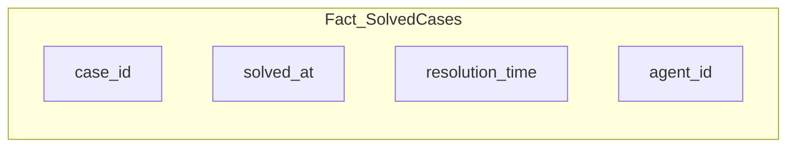

图 16-2：包含公司客服支持工单解决记录的事实表

与领域事件类似，事实记录从不删除或修改：分析数据是**仅追加**（append-only）数据；表达当前数据已过时的唯一方式是追加一条包含当前状态的新记录。考虑图 16-3 中的事实表 `Fact_CaseStatus`，它包含支持请求状态随时间变化的测量值。事实名称中没有显式动词，但事实所捕获的业务流程是处理支持工单的过程。

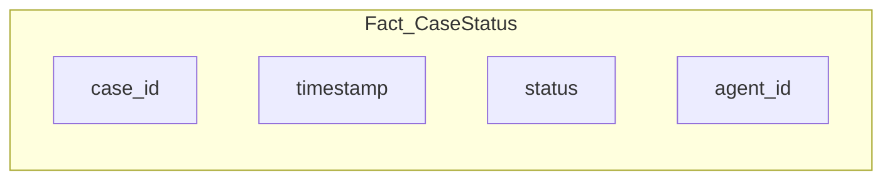

图 16-3：描述支持工单生命周期中状态变化的事实表

OLAP 与 OLTP 模型的另一个重要区别是数据的**粒度**（granularity）。运营系统需要最精确的数据来处理业务事务。对分析模型而言，聚合数据在许多用例中更高效。例如，在图 16-3 的 `Fact_CaseStatus` 表中，快照每 30 分钟采集一次。使用该模型的数据分析师决定何种粒度最适合其需求。为每次测量变化——例如工单数据的每次变化——创建一条事实记录，在某些情况下是浪费的，在另一些情况下甚至技术上不可行。

### 16.1.2 维度表

分析模型的另一个基本构件是**维度**（dimension）。如果事实表示业务流程或动作（动词），维度则描述事实（形容词）。

维度用于描述事实的属性，通过从事实表到维度表的外键引用。建模为维度的属性是那些在不同事实记录中重复出现、且无法放入单列的任何测量或数据。例如，图 16-4 中的模式用维度增强了 SolvedCases 事实。

```mermaid
erDiagram
    Fact_SolvedCases ||--o{ Dim_Agent : "agent_id"
    Fact_SolvedCases ||--o{ Dim_Product : "product_id"
    Fact_SolvedCases ||--o{ Dim_Date : "solved_date"
    Fact_SolvedCases {
        case_id PK
        agent_id FK
        product_id FK
        solved_date FK
        resolution_time
    }
    Dim_Agent {
        agent_id PK
        name
        department
    }
    Dim_Product {
        product_id PK
        name
        category
    }
    Dim_Date {
        date PK
        year
        month
        quarter
    }
```

图 16-4：SolvedCases 事实及其维度

维度高度规范化的原因是分析系统需要支持灵活查询。这是运营模型与分析模型的又一区别。可以预测运营模型将如何被查询以支持业务需求。分析模型的查询模式不可预测。数据分析师需要灵活地查看数据，很难预测未来会执行哪些查询。因此，规范化支持动态查询和过滤，以及跨不同维度对事实数据进行分组。

### 16.1.3 分析模型

图 16-5 所示的表结构称为**星型模式**（star schema）。它基于事实与其维度之间的多对一关系：每条维度记录被多条事实使用；事实的外键指向单条维度记录。

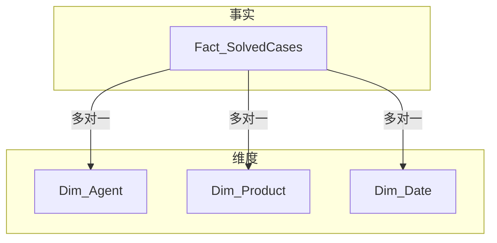

图 16-5：事实与维度之间的多对一关系

另一种主要的分析模型是**雪花模式**（snowflake schema）。雪花模式基于相同的构件：事实和维度。然而在雪花模式中，维度是多层级的：每个维度进一步规范化为更细粒度的维度，如图 16-6 所示。

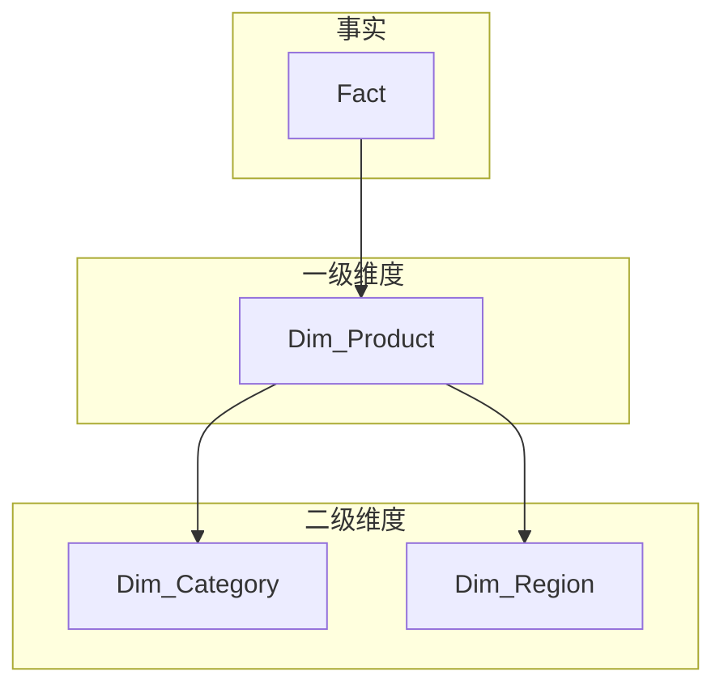

图 16-6：雪花模式中的多级维度

由于额外的规范化，雪花模式存储维度数据占用空间更少，维护更简单。然而，查询事实数据需要连接更多表，因此需要更多计算资源。

星型模式和雪花模式都允许数据分析师分析业务表现，获得可优化之处并构建**商业智能**（Business Intelligence, BI）报告的洞察。

---

## 16.2 分析数据管理平台

让我们从分析建模转向支持生成和提供分析数据的数据管理架构。本节将讨论两种常见的分析数据架构：**数据仓库**（Data Warehouse）和**数据湖**（Data Lake）。你将了解每种架构的基本工作原理、二者如何不同，以及每种方法的挑战。理解这两种架构如何运作，将为讨论本章主题——数据网格范式及其与领域驱动设计的相互作用——奠定基础。

### 16.2.1 数据仓库

数据仓库（DWH）架构相对直接。从企业所有运营系统提取数据，将源数据转换为分析模型，并将结果数据加载到面向数据分析的数据库中。该数据库即为数据仓库。

这种数据管理架构主要基于**提取-转换-加载**（Extract-Transform-Load, ETL）脚本。数据可来自多种来源：运营数据库、流式事件、日志等。除将源数据转换为基于事实/维度的模型外，转换步骤还可能包括移除敏感数据、去重、事件重排序、聚合细粒度事件等操作。在某些情况下，转换可能需要临时存储传入数据，即**暂存区**（staging area）。

如图 16-7 所示，所得的数据仓库包含覆盖企业所有业务流程的分析数据。数据通过 SQL 语言（或其方言）暴露，供数据分析师和 BI 工程师使用。

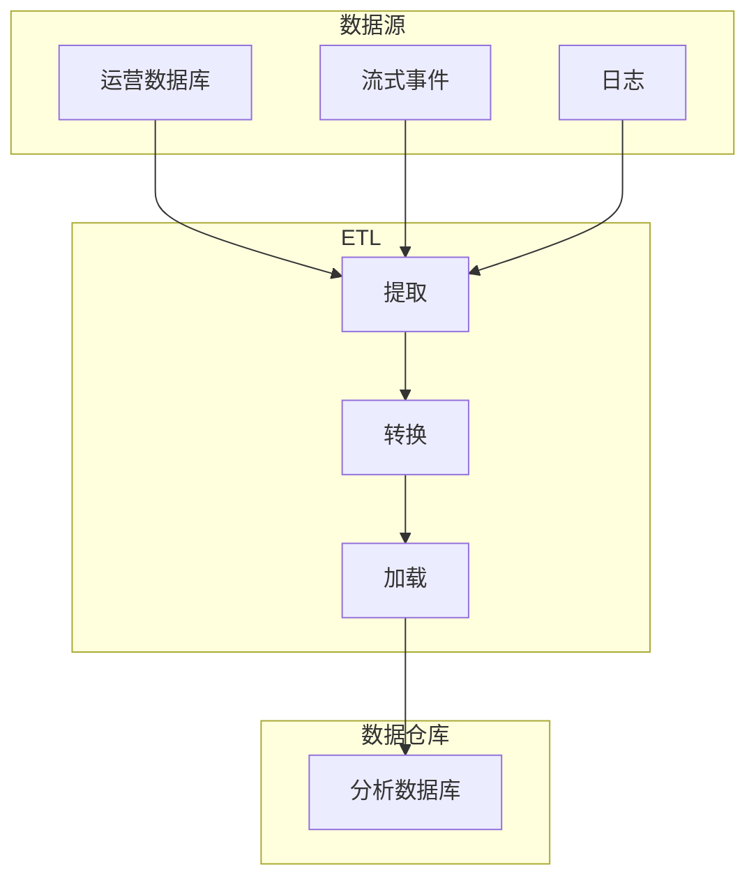

图 16-7：典型的企业数据仓库架构

细心的读者会注意到，数据仓库架构与第 2、3 章讨论的一些挑战有共通之处。

首先，数据仓库架构的核心目标是构建企业级模型。该模型应描述企业所有系统产生的数据，并满足分析数据的所有不同用例。分析模型支持例如优化业务、降低运营成本、做出智能业务决策、报表，甚至训练 ML 模型。如第 3 章所述，这种方法对除最小组织外的任何组织都不切实际。针对手头任务（如构建报表或训练 ML 模型）设计模型是更有效、可扩展的方法。

构建包罗万象模型的挑战可以部分通过**数据集市**（data mart）来缓解。数据集市是持有与明确定义的分析需求（如单个业务部门分析）相关数据的数据库。在图 16-8 所示的数据集市模型中，一个集市由运营系统的 ETL 流程直接填充，另一个集市则从数据仓库提取数据。

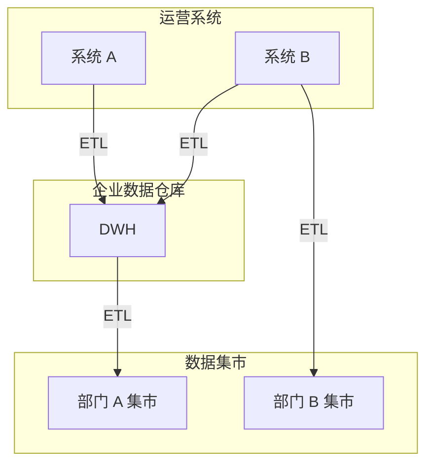

图 16-8：增强数据集市的企业数据仓库架构

当数据从企业数据仓库摄入数据集市时，数据仓库中仍需要定义企业级模型。或者，数据集市可以实现专用的 ETL 流程，直接从运营系统摄入数据。在这种情况下，所得模型使得跨不同集市（例如跨不同部门）查询数据变得困难，因为需要跨库查询并显著影响性能。

数据仓库架构的另一个挑战是 ETL 流程在分析（OLAP）系统与运营（OLTP）系统之间建立了强耦合。ETL 脚本消费的数据未必通过系统的公共接口暴露。通常，DWH 系统直接从运营系统数据库中获取所有数据。运营数据库中使用的模式不是公共接口，而是内部实现细节。因此，模式的轻微变更注定会破坏数据仓库的 ETL 脚本。由于运营系统与分析系统由相对独立的组织单元实现和维护，二者之间的沟通具有挑战性，导致团队间大量摩擦。这种沟通模式如图 16-9 所示。

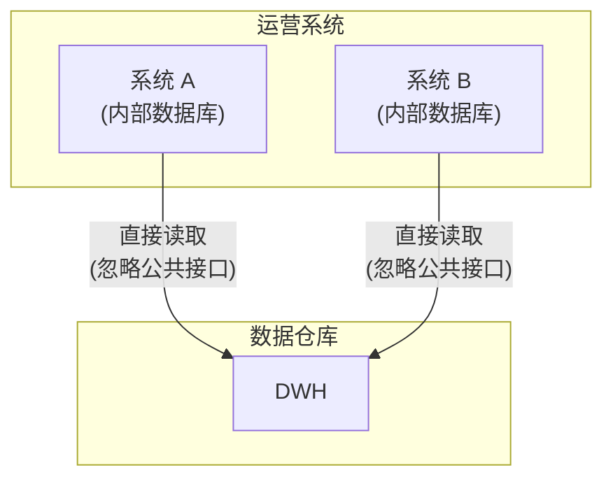

图 16-9：通过直接从运营数据库获取数据填充数据仓库，忽略面向集成的公共接口

数据湖架构解决了数据仓库架构的一些不足。

### 16.2.2 数据湖

与数据仓库一样，数据湖架构基于摄入运营系统数据并将其转换为分析模型的概念。然而，两种方法在概念上有所不同。

基于数据湖的系统摄入运营系统的数据。然而，数据不会立即转换为分析模型，而是以其**原始形式**（raw form）持久化，即保持原始运营模型。

最终，原始数据无法满足数据分析师的需求。因此，数据工程师和 BI 工程师的职责是理解湖中的数据，实现生成分析模型并馈入数据仓库的 ETL 脚本。图 16-10 描绘了数据湖架构。

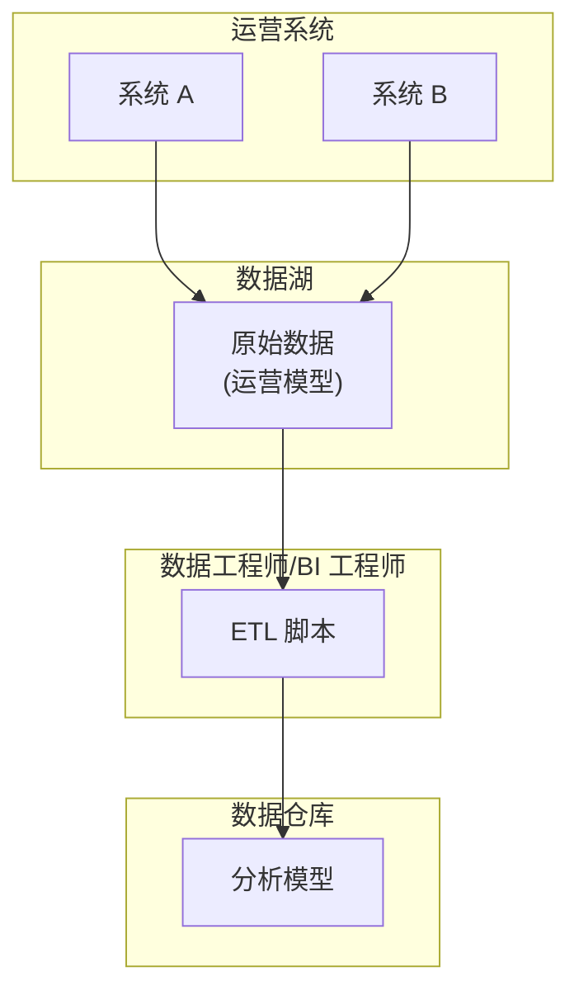

图 16-10：数据湖架构

由于运营系统的数据以其原始形式持久化，仅在之后才转换，数据湖允许使用多个面向任务的分析模型。一个模型可用于报表，另一个用于训练 ML 模型，等等。此外，未来可以添加新模型，并用现有原始数据初始化。

然而，分析模型的延迟生成增加了整体系统的复杂度。数据工程师实现并维护同一 ETL 脚本的多个版本以适配运营模型的不同版本并不罕见，如图 16-11 所示。

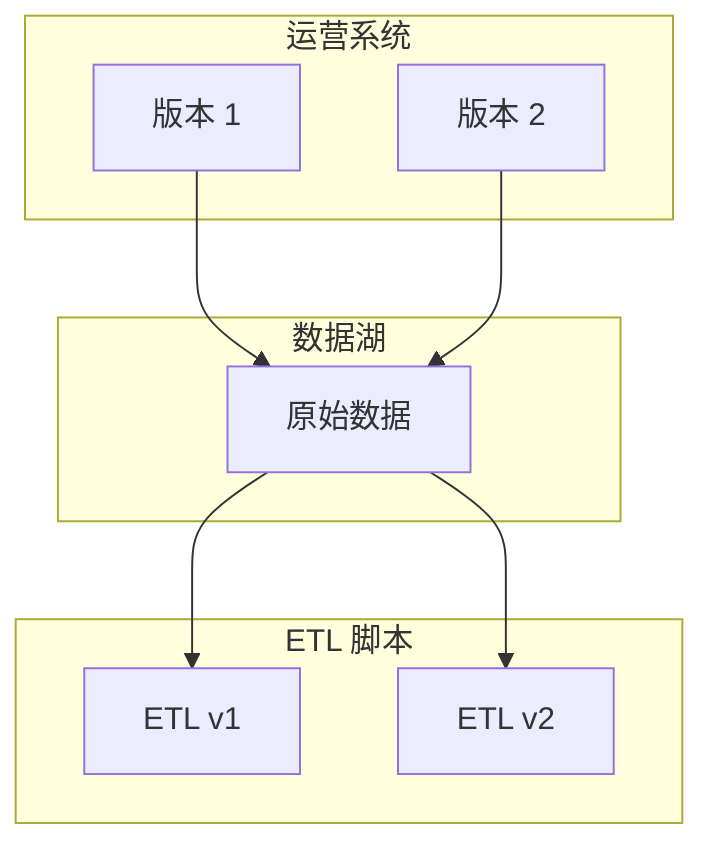

图 16-11：适配运营模型不同版本的同一 ETL 脚本的多个版本

此外，由于数据湖是**无模式**（schema-less）的——对传入数据没有强加模式——且对传入数据的质量没有控制，数据湖的数据在达到一定规模时会变得混乱。数据湖便于摄入数据，但利用数据则更具挑战性。或者，正如常说的，数据湖会变成**数据沼泽**（data swamp）。数据科学家的工作复杂度成倍增加，需要在混乱中理清头绪并提取有用的分析数据。

### 16.2.3 数据仓库与数据湖架构的挑战

数据仓库和数据湖架构都基于这样的假设：摄入越多数据用于分析，组织获得的洞察就越多。然而，两种方法往往在「大数据」的重压下崩溃。从运营模型到分析模型的转换在规模上会收敛为数千个难以维护的临时 ETL 脚本。

从建模角度看，两种架构都越过了运营系统的边界，并对其实现细节产生了依赖。由此产生的与实现模型的耦合在运营系统团队与分析系统团队之间制造了摩擦，往往达到为避免破坏分析系统的 ETL 作业而阻止运营模型变更的程度。

更糟的是，由于数据分析师和数据工程师属于独立的组织单元，他们往往缺乏运营系统开发团队所具备的业务领域深度知识。他们主要专精于大数据工具，而非业务领域知识。

最后但同样重要的是，在基于领域驱动设计的项目中，与实现模型的耦合尤为突出，因为 DDD 强调持续演进和改进业务领域模型。因此，运营模型的变更可能对分析模型产生不可预见的后果。此类变更在 DDD 项目中很频繁，往往导致研发团队与数据团队之间的摩擦。

数据仓库和数据湖的这些局限性催生了一种新的分析数据管理架构：**数据网格**（Data Mesh）。

---

## 16.3 数据网格

从某种意义上说，数据网格架构是面向分析数据的领域驱动设计。正如 DDD 的各种模式划分边界并保护其内容，数据网格架构为分析数据定义并保护模型与所有权边界。

数据网格架构基于四项核心原则：按领域分解数据、数据即产品、支持自主性、构建生态系统。下面逐一详细讨论。

### 16.3.1 按领域分解数据

数据仓库和数据湖方法都旨在将企业所有数据统一到一个大模型中。所得分析模型无效的原因与企业级运营模型无效的原因相同。此外，将来自所有系统的数据汇集到一处会模糊各种数据元素的所有权边界。

数据网格架构不构建单体分析模型，而是呼吁采用第 3 章针对运营数据讨论的同一解决方案：使用多个分析模型，并将其与数据的来源对齐。这自然地将分析模型的所有权边界与限界上下文的边界对齐，如图 16-12 所示。当分析模型按系统的限界上下文分解时，分析数据的生成成为相应产品团队的责任。

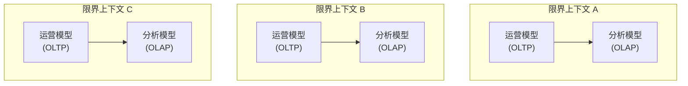

图 16-12：将分析模型的所有权边界与限界上下文的边界对齐

每个限界上下文现在拥有其运营（OLTP）和分析（OLAP）模型。因此，拥有运营模型的同一团队负责将其转换为分析模型。

### 16.3.2 数据即产品

经典的数据管理架构使得发现、理解和获取高质量分析数据变得困难。在数据湖的情况下尤其突出。

**数据即产品**（data as product）原则呼吁将分析数据视为一等公民。在基于数据网格的系统中，限界上下文不是让分析系统从可疑来源（内部数据库、日志文件等）获取运营数据，而是通过明确定义的输出端口提供分析数据，如图 16-13 所示。

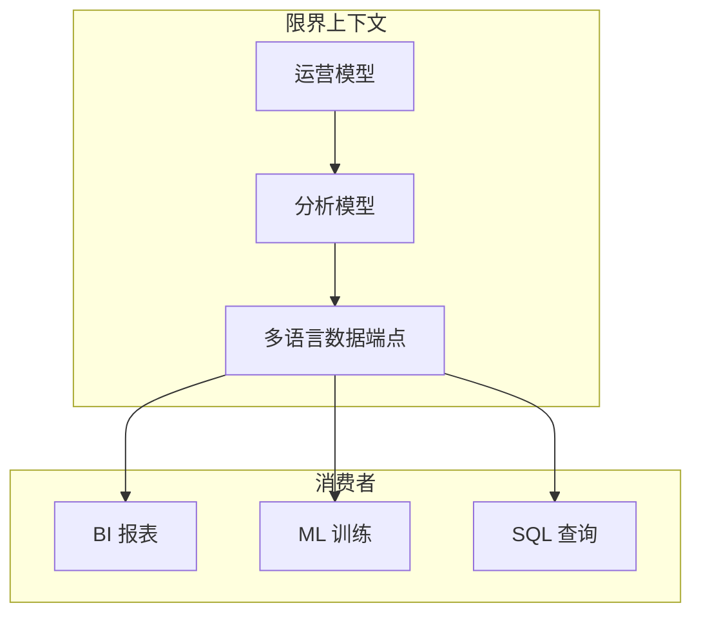

图 16-13：向消费者暴露分析数据的多语言数据端点

分析数据应像任何公共 API 一样对待：

- 应易于发现必要的端点：数据输出端口。
- 分析端点应有明确定义的模式，描述所提供的数据及其格式。
- 分析数据应可信赖，与任何 API 一样，应有定义并监控的**服务级别协议**（Service-Level Agreement, SLA）。
- 分析模型应像常规 API 一样进行版本管理，并相应处理模型中的破坏性集成变更。

此外，由于分析数据被视为产品，它必须满足其消费者的需求。限界上下文的团队负责确保所得模型满足其消费者的需求。与数据仓库和数据湖架构相反，在数据网格中，数据质量的责任是最高级别的关注点。

分布式数据管理架构的目标是允许细粒度的分析模型组合起来满足组织的数据分析需求。例如，如果 BI 报表应反映来自多个限界上下文的数据，它应能轻松获取所需的分析数据、应用本地转换并生成报表。

最后，不同的消费者可能以不同形式需要分析数据。有的可能偏好执行 SQL 查询，有的可能从对象存储服务获取分析数据，等等。因此，数据产品必须是**多语言**（polyglot）的，以适合不同消费者需求的格式提供数据。

要实现数据即产品原则，产品团队需要增加数据导向的专家。这是跨职能团队拼图中缺失的一块，传统上跨职能团队只包括与运营系统相关的专家。

### 16.3.3 支持自主性

产品团队应既能创建自己的数据产品，也能消费其他限界上下文提供的数据产品。与限界上下文一样，数据产品应具有互操作性。

如果每个团队都构建自己的分析数据提供方案，将是浪费、低效且难以集成的。为防止这种情况，需要平台来抽象构建、执行和维护互操作数据产品的复杂性。设计和构建这样的平台是一项艰巨的任务，需要专门的数据基础设施平台团队。

数据基础设施平台团队应负责定义数据产品蓝图、统一访问模式、访问控制以及可供产品团队利用的多语言存储，同时监控平台并确保满足 SLA 和目标。

### 16.3.4 构建生态系统

创建数据网格系统的最后一步是指定**联合治理**（federated governance）机构，以在分析数据领域实现互操作性和生态系统思维。通常，这将是一个由限界上下文的数据与产品负责人以及数据基础设施平台团队代表组成的团体，如图 16-14 所示。

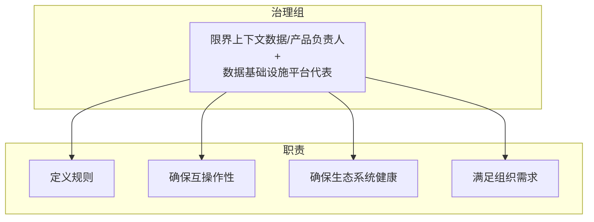

图 16-14：确保分布式数据分析生态系统互操作、健康并满足组织需求的治理组

治理组负责定义规则，确保健康且互操作的生态系统。规则必须应用于所有数据产品及其接口，该组有责任确保整个企业遵守规则。

---

## 16.4 数据网格与领域驱动设计的结合

以上是数据网格架构所基于的四项原则。对定义边界、将实现细节封装在明确定义的输出端口之后的强调，清楚表明数据网格架构与领域驱动设计基于相同的推理。此外，领域驱动设计的一些模式可以极大地支持数据网格架构的实现。

首先，**通用语言**（ubiquitous language）及由此产生的领域知识对于设计分析模型至关重要。正如我们在数据仓库和数据湖章节所讨论的，传统架构缺乏领域知识。

其次，以与其运营模型不同的模型暴露限界上下文的数据，是**开放主机**（open-host）模式。在这种情况下，分析模型是一种额外的**发布语言**（published language）。

**CQRS** 模式便于从同一数据生成多个模型。它可以用来将运营模型转换为分析模型。CQRS 模式从零生成模型的能力，使得同时生成和提供分析模型的多个版本变得容易，如图 16-15 所示。

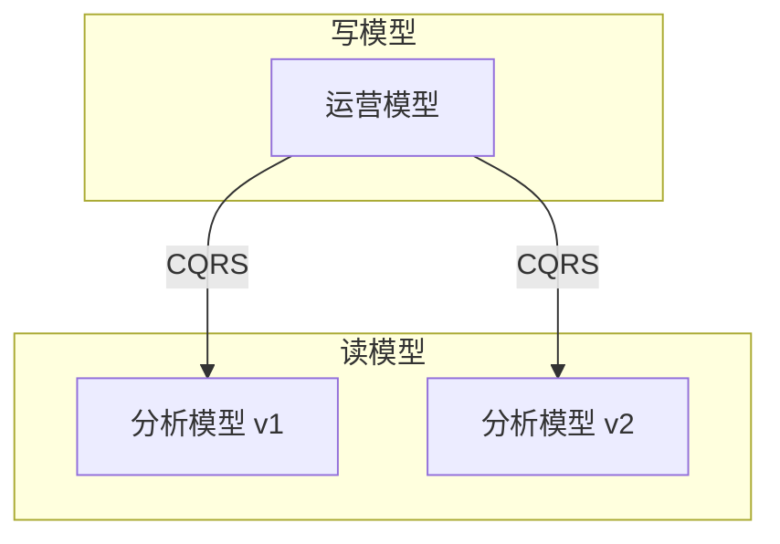

图 16-15：利用 CQRS 模式同时以两种不同模式版本提供分析数据

最后，由于数据网格架构组合不同限界上下文的模型来实现分析用例，运营模型的限界上下文集成模式同样适用于分析模型。两个产品团队可以合作演进其分析模型。另一个可以实现**防腐层**（anticorruption layer）以保护自己免受低效分析模型的影响。或者，团队可以分道扬镳，产生分析模型的重复实现。

---

## 练习

1. 关于事务（OLTP）模型与分析（OLAP）模型之间的差异，下列哪项陈述正确？
   - a. OLAP 模型应比 OLTP 模型提供更灵活的查询选项。
   - b. OLAP 模型预期比 OLTP 模型经历更多更新，因此必须针对写入进行优化。
   - c. OLTP 数据针对实时操作优化，而 OLAP 查询的响应等待几秒甚至几分钟是可接受的。
   - d. A 和 C 正确。

2. 哪种限界上下文集成模式对实现数据网格架构至关重要？
   - a. 共享内核
   - b. 开放主机服务
   - c. 防腐层
   - d. 合作关系

3. 哪种架构模式对实现数据网格架构至关重要？
   - a. 分层架构
   - b. 端口与适配器
   - c. CQRS
   - d. 架构模式无法支持 OLAP 模型的实现

4. 数据网格架构的定义要求按「领域」分解数据。DDD 中表示数据网格领域的术语是什么？
   - a. 限界上下文
   - b. 业务领域
   - c. 子领域
   - d. DDD 中没有数据网格领域的同义词

---

## 本章小结

本章介绍了软件系统设计的不同方面，特别是分析数据的定义和管理。我们讨论了分析数据的主要模型，包括星型模式和雪花模式，以及数据在数据仓库和数据湖中的传统管理方式。

数据网格架构旨在解决传统数据管理架构的挑战。其核心是将领域驱动设计的相同原则应用于分析数据：将分析模型分解为可管理单元，并确保分析数据可通过其公共接口可靠地访问和使用。最终，CQRS 和限界上下文集成模式可以支持数据网格架构的实现。

---

[← 上一章：事件驱动架构](ch15-event-driven-architecture.md) | [返回目录](../index.md)
