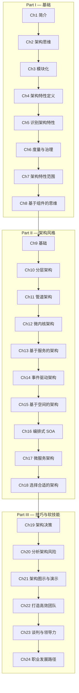

# 软件架构基础

> **Fundamentals of Software Architecture: An Engineering Approach**
>
> Mark Richards, Neal Ford, 2020, O'Reilly Media

---

## 章节路线图

---

## 目录

### Part I — 基础

| # | 章节 | 链接 |
|---|------|------|
| 1 | 简介 | [→ 阅读](part1/ch01.md) |
| 2 | 架构思维 | [→ 阅读](part1/ch02.md) |
| 3 | 模块化 | [→ 阅读](part1/ch03.md) |
| 4 | 架构特性定义 | [→ 阅读](part1/ch04.md) |
| 5 | 识别架构特性 | [→ 阅读](part1/ch05.md) |
| 6 | 度量与治理架构特性 | [→ 阅读](part1/ch06.md) |
| 7 | 架构特性的范围 | [→ 阅读](part1/ch07.md) |
| 8 | 基于组件的思维 | [→ 阅读](part1/ch08.md) |

### Part II — 架构风格

| # | 章节 | 链接 |
|---|------|------|
| 9 | 基础 | [→ 阅读](part2/ch09.md) |
| 10 | 分层架构风格 | [→ 阅读](part2/ch10.md) |
| 11 | 管道架构风格 | [→ 阅读](part2/ch11.md) |
| 12 | 微内核架构风格 | [→ 阅读](part2/ch12.md) |
| 13 | 基于服务的架构风格 | [→ 阅读](part2/ch13.md) |
| 14 | 事件驱动架构风格 | [→ 阅读](part2/ch14.md) |
| 15 | 基于空间的架构风格 | [→ 阅读](part2/ch15.md) |
| 16 | 编排式服务导向架构 | [→ 阅读](part2/ch16.md) |
| 17 | 微服务架构 | [→ 阅读](part2/ch17.md) |
| 18 | 选择合适的架构风格 | [→ 阅读](part2/ch18.md) |

### Part III — 技巧与软技能

| # | 章节 | 链接 |
|---|------|------|
| 19 | 架构决策 | [→ 阅读](part3/ch19.md) |
| 20 | 分析架构风险 | [→ 阅读](part3/ch20.md) |
| 21 | 架构图示与演示 | [→ 阅读](part3/ch21.md) |
| 22 | 打造高效团队 | [→ 阅读](part3/ch22.md) |
| 23 | 谈判与领导力技能 | [→ 阅读](part3/ch23.md) |
| 24 | 职业发展路径 | [→ 阅读](part3/ch24.md) |
