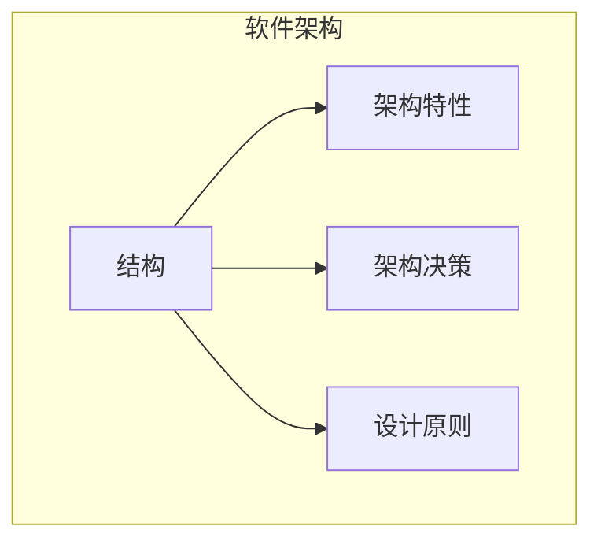

# 第1章 简介

「软件架构师」这份工作在全球众多最佳职业榜单中名列前茅。然而，当读者查看榜单上的其他职业（如执业护士或财务经理）时，会发现它们都有清晰的职业路径。为什么软件架构师没有这样的路径？

首先，行业对软件架构本身缺乏清晰定义。在我们教授基础课程时，学生常要求给出软件架构师工作的简明定义，我们一直拒绝给出单一答案。我们并非孤例。Martin Fowler 在其著名白皮书《谁需要架构师？》中同样拒绝尝试定义，而是引用了一句名言：

> 架构关乎重要之事……无论那是什么。
>
> —Ralph Johnson

在追问之下，我们绘制了图 1-1 所示的思维导图，它虽远不完整，但足以说明软件架构的范畴。事实上，我们稍后会给出自己对软件架构的定义。

其次，如思维导图所示，软件架构师角色承载着大量且不断扩展的职责。十年前，软件架构师只处理架构的纯技术方面，如模块化、组件和模式。此后，由于新的架构风格利用了更广泛的能力（如微服务），软件架构师的角色已经扩展。我们将在「架构与……的交集」一节中讨论架构与组织其余部分的诸多交集。

第三，软件架构因软件开发生态系统的快速演变而成为不断移动的目标。今天给出的任何定义，几年后都会过时。维基百科对软件架构的定义提供了合理的概览，但许多表述已过时，例如「软件架构关乎做出一旦实现就难以更改的基本结构选择」。然而，现代架构风格（如微服务）在设计时就内置了增量变更——在微服务中做结构变更已不再昂贵。当然，这种能力意味着与其他关注点（如耦合）的权衡。许多软件架构书籍将其视为静态问题；一旦解决，就可以安全地忽略。然而，我们在全书都承认软件架构（包括定义本身）的内在动态性。

第四，关于软件架构的许多材料只有历史相关性。维基百科页面的读者不会忽视令人眼花缭乱的缩写和知识宇宙的交叉引用。然而，其中许多缩写代表过时或失败的尝试。即使几年前完全有效的解决方案，由于上下文已变，现在也无法适用。软件架构的历史充斥着架构师尝试过、随后发现有害副作用的事物。我们在本书中会讨论其中许多教训。

为什么现在要写一本关于软件架构基础的书？软件架构的范畴并非开发世界中唯一不断变化的部分。新技术、新方法、新能力……事实上，列出过去十年未变的事物比列出所有变化更容易。软件架构师必须在这个不断变化的生态系统中做出决策。因为一切都在变化，包括我们做出决策所依据的基础，架构师应重新审视一些曾影响早期软件架构写作的核心公理。例如，早期的软件架构书籍没有考虑 DevOps 的影响，因为那些书写作时 DevOps 还不存在。

研究架构时，读者必须牢记，像许多艺术一样，它只能在上下文中被理解。架构师做出的许多决策是基于其所处环境的现实。例如，20 世纪末架构的主要目标之一是最大限度地利用共享资源，因为当时所有基础设施都昂贵且商业化：操作系统、应用服务器、数据库服务器等。想象一下，走进 2002 年的数据中心，对运维负责人说：「嘿，我有个革命性架构的好主意，每个服务在各自的隔离机器上运行，拥有自己的专用数据库（描述我们现在所知的微服务）。所以，我需要 50 个 Windows 许可证、另外 30 个应用服务器许可证，以及至少 50 个数据库服务器许可证。」在 2002 年，尝试构建像微服务这样的架构将难以想象地昂贵。然而，随着随后几年开源的出现，加上 DevOps 革命带来的工程实践更新，我们可以合理地构建所描述的架构。读者应牢记，所有架构都是其上下文的产物。

## 定义软件架构

整个行业一直在努力精确定义「软件架构」。有些架构师将软件架构称为系统的蓝图， others 则将其定义为开发系统的路线图。这些常见定义的问题在于理解蓝图或路线图实际包含什么。例如，当架构师分析架构时，分析的是什么？

图 1-2 展示了一种思考软件架构的方式。在此定义中，软件架构由系统结构（用支撑架构的粗黑线表示）、系统必须支持的架构特性（「-ilities」）、架构决策以及设计原则组成。

::: tip 图 1-2
架构由结构、架构特性（「-ilities」）、架构决策和设计原则组成
:::

如图 1-3 所示，系统结构是指系统实现的架构风格类型（如微服务、分层或微内核）。仅用结构描述架构并不能完全阐明架构。例如，假设有人请架构师描述一个架构，架构师回答「这是微服务架构」。这里，架构师只谈到了系统结构，而非系统架构。要完全理解系统架构，还需要了解架构特性、架构决策和设计原则。

::: tip 图 1-3
结构是指系统中使用的架构风格类型
:::

架构特性是定义软件架构的另一个维度（见图 1-4）。架构特性定义了系统的成功标准，通常与系统功能正交。注意，所列特性均不需要了解系统功能，但系统要正常运行却需要它们。架构特性非常重要，我们在本书中用多章来理解和定义它们。

::: tip 图 1-4
架构特性是指系统必须支持的「-ilities」
:::

定义软件架构的下一个因素是架构决策。架构决策定义了系统应如何构建的规则。例如，架构师可能做出架构决策：在分层架构中，只有业务层和服务层可以访问数据库（见图 1-5），限制表示层直接进行数据库调用。架构决策形成系统的约束，指导开发团队什么是允许的、什么是不允许的。

::: tip 图 1-5
架构决策是构建系统的规则
:::

如果由于某种条件或其他约束，某个架构决策无法在系统的某部分实现，该决策（或规则）可以通过**变体（variance）**打破。大多数组织都有由架构评审委员会（ARB）或首席架构师使用的变体模型。这些模型将寻求特定标准或架构决策变体的流程正式化。对特定架构决策的例外由 ARB（或不存在 ARB 时的首席架构师）分析，根据理由和权衡予以批准或拒绝。

架构定义中的最后一个因素是设计原则。设计原则与架构决策的区别在于，设计原则是指南而非硬性规则。例如，图 1-6 所示的设计原则指出，开发团队应在微服务架构中的服务之间利用异步消息传递以提高性能。架构决策（规则）永远无法涵盖服务间通信的每种条件和选项，因此设计原则可用于为首选方法（本例为异步消息传递）提供指导，让开发者在特定情况下选择更合适的通信协议（如 REST 或 gRPC）。

::: tip 图 1-6
设计原则是构建系统的指南
:::

## 对架构师的期望

定义软件架构师角色的难度不亚于定义软件架构。它可以从专家程序员延伸到定义公司的战略技术方向。与其在定义角色这一徒劳任务上浪费时间，我们建议关注对架构师的期望。

无论角色、头衔或职位描述如何，对软件架构师有八项核心期望：

- 做出架构决策
- 持续分析架构
- 紧跟最新趋势
- 确保决策得到遵守
- 多元接触与经验
- 具备业务领域知识
- 具备人际交往能力
- 理解并驾驭政治

### 做出架构决策

架构师应定义用于指导团队、部门或企业内技术决策的架构决策和设计原则。**指导**是这一期望中的关键词。架构师应指导而非指定技术选择。例如，架构师可能决定使用 React.js 进行前端开发。在这种情况下，架构师做出的是技术决策，而非能帮助开发团队做出选择的架构决策或设计原则。架构师应指示开发团队使用基于响应式的框架进行前端 Web 开发，从而指导开发团队在 Angular、Elm、React.js、Vue 或其他基于响应式的 Web 框架之间做出选择。

通过架构决策和设计原则指导技术选择是困难的。做出有效架构决策的关键是问：架构决策是在帮助指导团队做出正确的技术选择，还是在替他们做出技术选择？也就是说，架构师有时可能需要做出具体的技术决策，以保留特定的架构特性，如可扩展性、性能或可用性。在这种情况下，即使指定了特定技术，仍应视为架构决策。架构师常常难以找到正确的界限，因此第 19 章专门讨论架构决策。

### 持续分析架构

架构师应持续分析架构和当前技术环境，然后提出改进建议。

这一期望涉及**架构活力（architecture vitality）**，即评估三年前定义的架构在业务和技术变化后今天是否仍然可行。根据我们的经验，足够关注持续分析现有架构的架构师并不多。因此，大多数架构都会经历**结构衰败（structural decay）**，即开发者做出影响所需架构特性（如性能、可用性和可扩展性）的编码或设计变更。

架构师经常忽视的这一期望的其他方面是测试和发布环境。代码修改的敏捷性有明显好处，但如果团队需要数周测试变更、数月发布，架构师就无法实现整体架构的敏捷性。

架构师必须全面分析技术和问题域的变化，以确定架构的健全性。虽然这类考虑很少出现在招聘启事中，但架构师必须满足这一期望才能保持应用的关联性。

### 紧跟最新趋势

架构师应紧跟最新技术和行业趋势。开发者必须及时了解日常使用的最新技术以保持相关性（并保住工作！）。架构师对紧跟最新技术和行业趋势的要求更为关键。架构师做出的决策往往持久且难以更改。理解并跟踪关键趋势有助于架构师为未来做准备并做出正确决策。

跟踪趋势并保持与时俱进是困难的，尤其对软件架构师而言。我们在第 24 章讨论各种技巧和资源。

### 确保决策得到遵守

架构师应确保架构决策和设计原则得到遵守。

确保遵守意味着架构师持续验证开发团队是否遵循架构师定义、记录和传达的架构决策和设计原则。考虑以下场景：架构师决定在分层架构中将数据库访问限制为仅业务层和服务层（而非表示层）。这意味着表示层必须经过架构的所有层才能进行最简单的数据库调用。用户界面开发者可能出于性能原因不同意这一决策，直接访问数据库（或持久化层）。然而，架构师做出该架构决策有特定原因：控制变更。通过封闭各层，可以在不影响表示层的情况下进行数据库更改。若不确保遵守架构决策，就可能发生此类违规，架构将无法满足所需的架构特性（「-ilities」），应用或系统将无法按预期工作。

我们在第 6 章进一步讨论使用自动化适应度函数和自动化工具衡量合规性。

### 多元接触与经验

架构师应接触多种多样的技术、框架、平台和环境。

这一期望并不意味着架构师必须是每种框架、平台和语言的专家，而是架构师至少应熟悉多种技术。如今大多数环境是异构的，架构师至少应知道如何与多个系统和服务对接，无论这些系统或服务使用何种语言、平台和技术编写。

掌握这一期望的最佳方式之一是架构师拓展自己的舒适区。只关注单一技术或平台是安全港。有效的软件架构师应积极寻求在多种语言、平台和技术上获得经验的机会。掌握这一期望的好方法是关注技术广度而非技术深度。技术广度包括你有所了解但不深入的内容，加上你深入了解的内容。例如，对架构师而言，熟悉 10 种不同缓存产品及其各自的优缺点，远比只精通其中一种更有价值。

### 具备业务领域知识

架构师应具备一定程度的业务领域专业知识。

有效的软件架构师不仅理解技术，还理解问题空间的业务领域。没有业务领域知识，就难以理解业务问题、目标和需求，从而难以设计出满足业务需求的有效架构。想象一下，在一家大型金融机构担任架构师却不理解常见金融术语，如平均趋向指数、偶然合同、利率反弹，甚至非优先债务。没有这些知识，架构师无法与利益相关者和业务用户沟通，会很快失去可信度。

我们认识的最成功的架构师是那些拥有广泛动手技术知识并兼具特定领域深厚知识的人。这些软件架构师能够使用利益相关者熟悉和理解的领域知识和语言，与高管和业务用户有效沟通。这反过来创造了强烈的信心，即软件架构师知道自己在做什么，有能力创建有效且正确的架构。

### 具备人际交往能力

架构师应具备出色的人际交往能力，包括团队合作、促进和领导力。

对大多数开发者和架构师而言，拥有出色的领导力和人际交往能力是困难的期望。作为技术专家，开发者和架构师喜欢解决技术问题，而非人的问题。然而，正如 Gerald Weinberg  famously 所说：「无论他们告诉你什么，这始终是人的问题。」架构师不仅被期望为团队提供技术指导，还被期望领导开发团队实现架构。无论架构师的角色或头衔如何，领导力至少是成为有效软件架构师所需的一半。

行业充斥着软件架构师，都在竞争有限的架构职位。拥有强大的领导力和人际交往能力是架构师与其他架构师区分、脱颖而出的好方法。我们认识许多优秀的技术专家型软件架构师，但由于无法领导团队、指导和辅导开发者、有效传达想法和架构决策与原则而成为无效的架构师。不用说，这些架构师在保住职位或工作上遇到困难。

### 理解并驾驭政治

架构师应理解企业的政治气候并能够驾驭政治。

在一本关于软件架构的书中谈论谈判和驾驭办公室政治可能显得奇怪。为说明谈判技能的重要性和必要性，考虑以下场景：开发者决定利用策略模式来降低某段复杂代码的整体圈复杂度。谁真正在乎？人们可能会为开发者使用这种模式鼓掌，但在几乎所有情况下，开发者不需要为此类决策寻求批准。

现在考虑另一个场景：负责大型客户关系管理系统的架构师在控制其他系统的数据库访问、保护某些客户数据以及进行任何数据库模式更改方面遇到问题，因为太多其他系统在使用 CRM 数据库。因此，架构师决定创建所谓的**应用孤岛（application silos）**，即每个应用数据库只能由拥有该数据库的应用访问。做出这一决策将使架构师更好地控制客户数据、安全和变更控制。然而，与之前的开发者场景不同，这一决策将受到公司几乎所有人的质疑（当然，CRM 应用团队可能除外）。其他应用需要客户管理数据。如果这些应用不再能直接访问数据库，它们现在必须向 CRM 系统请求数据，需要通过 REST、SOAP 或其他远程访问协议进行远程访问调用。

重点是，架构师做出的几乎每个决策都会受到质疑。架构决策会因成本增加或工作量（时间）增加而受到产品负责人、项目经理和业务利益相关者的质疑。架构决策也会受到认为自己的方法更好的开发者的质疑。无论哪种情况，架构师都必须驾驭公司政治并运用基本谈判技能使大多数决策获得批准。这一事实可能让软件架构师非常沮丧，因为作为开发者做出的大多数决策不需要批准甚至审查。代码结构、类设计、设计模式选择，有时甚至语言选择等编程方面都是编程艺术的一部分。然而，架构师现在终于能够做出广泛而重要的决策，却必须为几乎每一个决策辩护和争取。谈判技能与领导力技能一样关键和必要，我们在书中专门用一章来理解它们（见第 23 章）。

## 架构与……的交集

软件架构的范畴在过去十年中不断扩大，涵盖越来越多的职责和视角。十年前，架构与运维之间的典型关系是契约性和正式的，充满官僚主义。大多数公司为避免托管自身运维的复杂性，经常将运维外包给第三方公司，并签订服务级别协议（如正常运行时间、规模、响应性等重要架构特性）的契约义务。现在，微服务等架构自由利用以前仅属运维关注的事项。例如，弹性扩展曾痛苦地内置在架构中（见第 15 章），而微服务通过架构师与 DevOps 之间的联络以不那么痛苦的方式处理。

::: details 历史：Pets.com 与弹性扩展的由来
软件开发的历史包含丰富的教训，有好有坏。我们假设当前能力（如弹性扩展）是某天因某位聪明开发者而出现的，但这些想法往往源于惨痛教训。Pets.com 是早期惨痛教训的例子。Pets.com 出现在互联网早期，希望成为宠物用品的 Amazon.com。幸运的是，他们有一个出色的营销部门，发明了一个引人注目的吉祥物：一只拿着麦克风说些不敬之言的袜子玩偶。吉祥物成为超级明星，在游行和全国体育赛事中公开亮相。

不幸的是，Pets.com 的管理层显然把所有钱都花在了吉祥物上，而不是基础设施上。订单开始涌入时，他们毫无准备。网站缓慢、交易丢失、配送延迟……几乎是最坏的情况。事实上如此糟糕，以至于在灾难性的圣诞抢购后不久公司就关闭了，将唯一剩余的有价值资产（吉祥物）卖给了竞争对手。

公司需要的是弹性扩展：根据需要启动更多资源实例的能力。云提供商将这一功能作为商品提供，但在互联网早期，公司必须管理自己的基础设施，许多公司成为前所未有现象的受害者：成功过多可能杀死业务。Pets.com 和其他类似恐怖故事促使工程师开发了架构师现在享受的框架。
:::

以下各节深入探讨架构师角色与组织其他部分之间的一些较新交集，突出架构师的新能力和职责。

### 工程实践

传统上，软件架构与用于创建软件的开发过程是分离的。存在数十种流行的构建软件的方法论，包括瀑布式和多种敏捷（如 Scrum、极限编程、精益和 Crystal），它们大多不影响软件架构。

然而，过去几年，工程进步将过程关注推向了软件架构。将软件开发过程与工程实践分开是有用的。所谓过程，我们指的是团队如何组建和管理、会议如何举行、工作流如何组织；它指的是人们组织和互动的机制。另一方面，软件工程实践指的是已被证明具有可重复效益的、与过程无关的实践。例如，持续集成是一种经过验证的工程实践，不依赖特定过程。

::: details 从极限编程到持续交付的路径
极限编程（XP）的起源很好地说明了过程与工程之间的区别。1990 年代初，由 Kent Beck 领导的一群经验丰富的软件开发者开始质疑当时流行的数十种不同开发过程。根据他们的经验，似乎没有一个能可靠地产生良好结果。XP 创始人之一说，选择现有过程之一「对项目成功的保证不比抛硬币更高」。他们决定重新思考如何构建软件，并于 1996 年 3 月启动了 XP 项目。为 informing 他们的过程，他们拒绝传统智慧，专注于过去导致项目成功的实践，并将其推向极端。他们的推理是，他们在以前的项目中看到了更多测试与更高质量之间的相关性。因此，XP 的测试方法将实践推向极端：进行测试优先开发，确保所有代码在进入代码库之前都经过测试。

XP 被归入其他具有类似视角的流行敏捷过程，但它是少数包含工程实践的方法论之一，如自动化、测试、持续集成和其他具体的、基于经验的技术。继续推进软件开发工程方面的努力随着《持续交付》一书（Addison-Wesley Professional）——许多 XP 实践的更新版本——而继续，并在 DevOps 运动中开花结果。在许多方面，DevOps 革命发生在运维采用 XP 最初倡导的工程实践时：自动化、测试、声明式单一事实来源等。

我们强烈支持这些进步，它们形成了将软件开发最终提升为适当工程学科的渐进步骤。
:::

关注工程实践很重要。首先，软件开发缺乏更成熟工程学科的许多特征。例如，土木工程师预测结构变化的准确性远高于软件结构中类似重要方面的预测。其次，软件开发的阿喀琉斯之踵之一是估算——多少时间、多少资源、多少钱？这种困难部分在于无法适应软件开发探索性本质的陈旧会计实践，另一部分是因为我们传统上不擅长估算，至少部分原因是未知的未知。

> ……因为我们知道，有已知的已知；有我们知道我们知道的事情。我们也知道有已知的未知；也就是说我们知道有些事情我们不知道。但也有未知的未知——我们不知道我们不知道的事情。
>
> —美国前国防部长 Donald Rumsfeld

未知的未知是软件系统的克星。许多项目开始时有一份已知的未知清单：开发者必须了解的即将到来的领域和技术。然而，项目也受害于未知的未知：没有人知道会出现却意外出现的事情。这就是为什么所有「前期大设计」软件努力都会失败：架构师无法为未知的未知设计。引用 Mark（本书作者之一）的话：

> 所有架构都会因未知的未知而变得迭代，敏捷只是更早地认识到这一点并这样做。

因此，虽然过程大多与架构分离，但迭代过程更适合软件架构的本质。尝试使用瀑布式等陈旧过程构建微服务等现代系统的团队，会发现来自忽视软件如何组合的现实的陈旧过程的巨大摩擦。

通常，架构师也是项目的技术负责人，因此决定团队使用的工程实践。正如架构师在选择架构之前必须仔细考虑问题域一样，他们还必须确保架构风格和工程实践形成共生网络。例如，微服务架构假设自动化机器配置、自动化测试和部署以及一系列其他假设。尝试用陈旧的运维组、手动过程和少量测试构建这些架构之一，会带来巨大的摩擦和成功挑战。正如不同问题域倾向于某些架构风格一样，工程实践也有同样的共生关系。

从极限编程到持续交付的思想演变仍在继续。工程实践的最新进展允许架构内的新能力。Neal 的最新著作《构建进化式架构》（O'Reilly）突出了思考工程实践与架构交集的新方式，允许更好地自动化架构治理。虽然我们不会在此总结那本书，但它提供了一种重要的新术语和思考架构特性的方式，将贯穿本书的其余部分。Neal 的书涵盖了构建随时间优雅变化的架构的技术。在第 4 章中，我们将架构描述为需求和其他关注点的组合，如图 1-7 所示。

::: tip 图 1-7
软件系统的架构由需求及所有其他架构特性组成
:::

正如软件开发世界的任何经验所表明的，没有什么是静态的。因此，架构师可能设计一个系统以满足某些标准，但该设计必须经受住实现（架构师如何确保其设计被正确实现）以及软件开发生态系统驱动的不可避免的变化。我们需要的是一种进化式架构。

《构建进化式架构》引入了使用适应度函数（fitness functions）在随时间发生的变化中保护（和治理）架构特性的概念。该概念来自进化计算。在设计遗传算法时，开发者有多种技术来变异解，迭代地进化新解。在为特定目标设计此类算法时，开发者必须衡量结果，看它是更接近还是更远离最优解；该衡量就是适应度函数。例如，如果开发者设计遗传算法来解决旅行商问题（其目标是各城市之间的最短路线），适应度函数将查看路径长度。

《构建进化式架构》借用这一思想创建架构适应度函数：对某些架构特性的客观完整性评估。该评估可能包括多种机制，如指标、单元测试、监控和混沌工程。例如，架构师可能将页面加载时间确定为架构的重要特性。为使系统能够在不降低性能的情况下变化，架构构建一个适应度函数作为测试，衡量每个页面的页面加载时间，然后作为项目持续集成的一部分运行测试。因此，架构师始终知道架构关键部分的状态，因为他们对每个部分都有适应度函数形式的验证机制。

我们不会在此详述适应度函数。然而，我们会在适用处指出该方法的机遇和示例。注意适应度函数执行频率与其提供的反馈之间的相关性。你会发现，采用持续集成、自动化机器配置等敏捷工程实践，使构建弹性架构更容易。这也说明了架构与工程实践如何交织在一起。

### 运维 / DevOps

架构与相关领域最明显的近期交集发生在 DevOps 出现时，由对架构公理的一些重新思考推动。多年来，许多公司认为运维与软件开发是分离的职能；他们经常将运维外包给另一家公司作为成本节约措施。1990 年代和 2000 年代设计的许多架构假设架构师无法控制运维，并围绕该限制进行防御性构建（有关此的良好示例，见第 15 章的空间架构）。然而，几年前，几家公司开始尝试将许多运维关注与架构结合的新架构形式。例如，在 ESB 驱动的 SOA 等旧式架构中，架构被设计为处理弹性扩展等事务，在此过程中大大复杂化了架构。基本上，架构师被迫围绕因外包运维这一成本节约措施引入的限制进行防御性设计。因此，他们构建了能够内部处理规模、性能、弹性等一系列能力的架构。该设计的副作用是 vastly 更复杂的架构。

微服务风格架构的构建者意识到，这些运维关注由运维处理更好。通过创建架构与运维之间的联络，架构师可以简化设计并依赖运维处理他们最擅长的事情。因此，认识到资源错配导致了意外复杂性，架构师和运维联手创建了微服务，我们将在第 17 章详述。

### 过程

另一个公理是，软件架构大多与软件开发过程正交；构建软件的方式（过程）对软件架构（结构）影响很小。因此，虽然团队使用的软件开发过程对软件架构有一定影响（尤其是在工程实践方面），但历史上它们被视为 mostly 分离的。大多数软件架构书籍忽略软件开发过程，对可预测性等做出似是而非的假设。然而，团队开发软件的过程影响软件架构的许多方面。例如，过去几十年许多公司采用敏捷开发方法论，因为软件的本质。敏捷项目中的架构师可以假设迭代开发，因此决策的反馈循环更快。这反过来允许架构师在依赖反馈的实验和其他知识方面更加积极。

正如 Mark 之前的引用所观察到的，所有架构都会变得迭代；只是时间问题。为此，我们将在全书假设敏捷方法论的基线，并在适当时指出例外。例如，许多单体架构由于年龄、政治或其他与软件无关的缓解因素，仍使用较旧的过程。

敏捷方法论大放异彩的架构关键方面之一是重构。团队经常发现需要将架构从一种模式迁移到另一种。例如，团队开始时使用单体架构，因为启动简单快速，但现在需要迁移到更现代的架构。敏捷方法论比规划-heavy 的过程更好地支持此类变更，因为紧密的反馈循环和扼杀者模式、功能开关等技术的鼓励。

### 数据

大量严肃的应用开发包括外部数据存储，通常以关系型（或 increasingly，NoSQL）数据库的形式。然而，许多关于软件架构的书籍对这一重要架构方面只有轻描淡写。代码和数据具有共生关系：没有对方，一方就没有用。

数据库管理员经常与架构师一起为复杂系统构建数据架构，分析关系和复用将如何影响应用组合。我们不会在本书中深入该级别的专业细节。同时，我们不会忽视对外部存储的存在和依赖。特别是，当我们讨论架构的运维方面和架构量子（见第 92 页「架构量子与粒度」）时，我们包括数据库等重要外部关注。

## 软件架构定律

虽然软件架构的范畴几乎不可能地广泛，但确实存在统一的元素。作者首先通过不断遇到第一软件架构定律而学到：

> 软件架构中的一切都是权衡。
>
> —第一软件架构定律

对软件架构师而言，没有什么是存在于清晰、干净的谱系上的。每个决策都必须考虑许多对立因素。

> 如果架构师认为发现了不是权衡的东西，更可能的是他们还没有识别出权衡。
>
> —推论 1

我们用超越结构脚手架的方式定义软件架构，纳入原则、特性等。架构比结构元素的组合更广泛，反映在我们的第二软件架构定律中：

> 为什么比怎么做更重要。
>
> —第二软件架构定律

当作者尝试保留学生在研讨会中 crafting 架构解决方案时所做的练习结果时，发现了这一视角的重要性。由于练习有时限，我们保留的唯一工件是表示拓扑的图表。换句话说，我们捕获了他们如何解决问题，但没有捕获团队为什么做出特定选择。架构师可以查看他们不了解的现有系统并确定架构结构如何工作，但将难以解释为什么做出某些选择而非其他选择。

在全书，我们突出架构师做出某些决策的原因以及权衡。我们还在第 285 页「架构决策记录」中突出捕获重要决策的良好技术。

---

**导航**

| 上一章 | 下一章 |
|--------|--------|
| [← 目录](../index.md) | [第2章 架构思维 →](ch02.md) |
