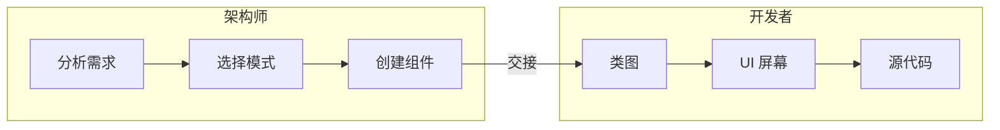
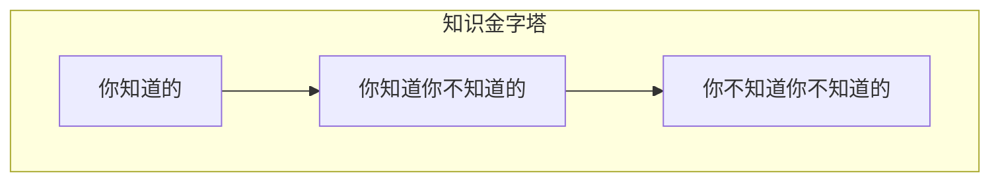

# 第2章 架构思维

架构师看待事物的方式与开发者不同，就像气象学家看待云的方式可能与艺术家不同。这被称为**架构思维（architectural thinking）**。不幸的是，太多架构师认为架构思维仅仅是「思考架构」。

架构思维远不止于此。它是用架构的眼光或架构的视角看待事物。像架构师一样思考有四个主要方面。第一，理解架构与设计的区别，并知道如何与开发团队协作使架构发挥作用。第二，拥有广泛的技术知识，同时保持一定程度的技术深度，使架构师能够看到他人看不到的解决方案和可能性。第三，理解、分析和协调各种解决方案和技术之间的权衡。最后，理解业务驱动因素的重要性以及它们如何转化为架构关注。

本章我们探讨像架构师一样思考、用架构眼光看待事物的这四个方面。

## 架构与设计

架构与设计之间的区别常常令人困惑。架构在哪里结束，设计从哪里开始？架构师与开发者各自有什么职责？像架构师一样思考就是知道架构与设计的区别，并看到两者如何紧密整合以形成业务和技术问题的解决方案。

考虑图 2-1，它展示了架构师与开发者相比的传统职责。如图所示，架构师负责分析业务需求以提取和定义架构特性（「-ilities」）、选择适合问题域的架构模式和风格、创建组件（系统的构建块）等。这些活动产生的工件然后交给开发团队，开发团队负责为每个组件创建类图、创建用户界面屏幕、开发和测试源代码。

::: tip 图 2-1
架构与设计的传统视图
:::

图 2-1 所示的传统职责模型存在若干问题。事实上，该图恰恰说明了为什么架构很少奏效。具体而言，是穿过将架构师与开发者分开的虚拟和物理屏障的单向箭头导致了与架构相关的所有问题。架构师做出的决策有时从未到达开发团队，而开发团队做出的改变架构的决策也很少反馈给架构师。在此模型中，架构师与开发团队脱节，因此架构很少能实现其最初设定的目标。

要使架构发挥作用，必须打破架构师与开发者之间存在的物理和虚拟屏障，从而在架构师与开发团队之间形成强大的双向关系。架构师和开发者必须在同一虚拟团队中才能使这奏效，如图 2-2 所示。该模型不仅促进架构与开发之间的强双向沟通，还允许架构师为团队中的开发者提供指导和辅导。

::: tip 图 2-2
通过协作使架构发挥作用
:::

与静态、僵化的软件架构的旧式瀑布方法不同，当今系统的架构在项目的每次迭代或阶段都会变化和演进。架构师与开发团队之间的紧密协作对于任何软件项目的成功至关重要。那么架构在哪里结束，设计从哪里开始？它们不会。它们都是软件项目生命周期的一部分，必须始终保持同步才能成功。

## 技术广度

技术细节的范畴在开发者与架构师之间有所不同。与必须拥有大量技术深度才能完成工作的开发者不同，软件架构师必须拥有大量技术广度才能像架构师一样思考、用架构视角看待事物。图 2-3 所示的知识金字塔说明了这一点，它囊括了世界上所有技术知识。事实证明，技术专家应重视的信息类型随职业阶段而异。

::: tip 图 2-3
代表所有知识的金字塔
:::

如图 2-3 所示，任何人都可以将所有知识分为三部分：你知道的、你知道你不知道的、你不知道你不知道的。

**你知道的**包括技术专家日常用于完成工作的技术、框架、语言和工具，例如作为 Java 程序员了解 Java。**你知道你不知道的**包括技术专家有所了解或听说过但几乎没有专业知识的事物。Clojure 编程语言是这一知识层次的好例子。大多数技术专家听说过 Clojure，知道它是基于 Lisp 的编程语言，但他们无法用该语言编码。**你不知道你不知道的**是知识三角形中最大的部分，包括可能是技术专家正在尝试解决的问题的完美解决方案的整个技术、工具、框架和语言，但技术专家甚至不知道这些事物存在。

开发者的早期职业生涯专注于扩展金字塔的顶部，以积累经验和专业知识。这是早期的理想关注点，因为开发者需要更多视角、工作知识和动手经验。扩展顶部会 incidentally 扩展中间部分；随着开发者遇到更多技术和相关工件，会增加他们「你知道你不知道的」的储备。

在图 2-4 中，扩展金字塔顶部是有益的，因为专业知识受到重视。然而，你知道的也是你必须维护的——软件世界中没有什么是一成不变的。如果开发者成为 Ruby on Rails 的专家，若他们忽视 Ruby on Rails 一两年，该专业知识将无法持续。金字塔顶部的事物需要时间投入来维持专业知识。最终，个人金字塔顶部的大小就是他们的技术深度。

::: tip 图 2-4
开发者必须维护专业知识才能保留它
:::

然而，当开发者过渡到架构师角色时，知识的本质会发生变化。架构师价值的一大部分是对技术的广泛理解以及如何用它解决特定问题。例如，作为架构师，知道某个问题存在五种解决方案比只精通一种更有益。对架构师而言，金字塔最重要的部分是顶部和中间部分；中间部分深入底部部分的程度代表架构师的技术广度，如图 2-5 所示。

::: tip 图 2-5
某人知道的是技术深度，某人知道多少是技术广度
:::

作为架构师，广度比深度更重要。因为架构师必须做出将能力与技术约束匹配的决策，对多种解决方案的广泛理解是有价值的。因此，对架构师而言，明智的做法是牺牲一些来之不易的专业知识，用这些时间来拓宽自己的组合，如图 2-6 所示。如图所示，某些专业领域将保留，可能是在特别令人愉悦的技术领域，而其他领域则 usefully 萎缩。

::: tip 图 2-6
架构师角色的增强广度和缩小深度
:::

我们的知识金字塔说明了架构师角色与开发者角色相比的根本不同。开发者整个职业生涯都在磨练专业知识，过渡到架构师角色意味着该视角的转变，许多人发现这很困难。这反过来导致两种常见功能障碍：第一，架构师试图在多个领域保持专业知识，结果一个都没成功，在此过程中把自己累垮。第二，表现为陈旧的专业知识——错误地感觉你过时的信息仍然是最前沿的。我们在大公司经常看到这种情况，公司的开发者创始人已进入领导角色，却仍使用古老的标准做出技术决策（见第 30 页「冰冻穴居人反模式」）。

架构师应专注于技术广度，以便有更大的箭袋可以抽箭。过渡到架构师角色的开发者可能必须改变他们看待知识获取的方式。平衡深度与广度的知识组合是每个开发者在整个职业生涯中应考虑的事情。

### 冰冻穴居人反模式

在野外常见的行为反模式，**冰冻穴居人反模式（Frozen Caveman Anti-Pattern）**描述的是总是对每个架构回归到其非理性关注的架构师。例如，Neal 的一位同事曾在一个采用集中式架构的系统上工作。然而，每次他们将设计交付给客户架构师时，持续的问题是「但如果我们失去意大利怎么办？」几年前，一次罕见的通信问题导致总部无法与意大利门店通信，造成极大不便。虽然再次发生的可能性极小，但架构师已对这一特定架构特性着迷。

通常，这种反模式表现在过去因糟糕决策或意外事件而受过伤的架构师身上，使他们在未来特别谨慎。虽然风险评估很重要，但也应切合实际。理解真实技术风险与感知技术风险之间的区别是架构师持续学习过程的一部分。像架构师一样思考需要克服这些「冰冻穴居人」想法和经验，看到其他解决方案，并提出更相关的问题。

## 分析权衡

像架构师一样思考就是看到每个解决方案（技术或其他）中的权衡，并分析这些权衡以确定最佳解决方案。引用 Mark（本书作者之一）的话：

> 架构是你无法 Google 的东西。

架构中的一切都是权衡，这就是为什么宇宙中每个架构问题的著名答案都是「看情况」。虽然许多人越来越对这种答案感到恼火，但不幸的是这是真的。你无法 Google REST 还是消息传递更好，或者微服务是否是正确的架构风格，因为确实看情况。这取决于部署环境、业务驱动因素、公司文化、预算、时间框架、开发者技能集以及数十个其他因素。每个人的环境、情况和问题都不同，因此架构如此困难。引用 Neal（本书另一位作者）的话：

> 架构中没有对错答案——只有权衡。

例如，考虑图 2-7 所示的物品拍卖系统，某人出价竞拍拍卖品。

::: tip 图 2-7
拍卖系统权衡示例——队列还是主题？
:::

Bid Producer 服务从出价者生成出价，然后将出价金额发送给 Bid Capture、Bid Tracking 和 Bid Analytics 服务。这可以通过在点对点消息传递方式中使用队列，或通过在使用发布-订阅消息传递方式中使用主题来完成。架构师应该使用哪一个？你无法 Google 答案。架构思维要求架构师分析与每个选项相关的权衡，并根据具体情况选择最佳方案。

表 2-1 总结了这些权衡。

| 主题优势 | 主题劣势 |
|----------|----------|
| 架构可扩展性 | 数据访问和数据安全关注 |
| 服务解耦 | 无异构契约 |
| | 监控和可编程可扩展性 |

这里的重点是，软件架构中的一切都有权衡：优势和劣势。像架构师一样思考就是分析这些权衡，然后问「可扩展性还是安全性更重要？」不同解决方案之间的决策将始终取决于业务驱动因素、环境和许多其他因素。

## 理解业务驱动因素

像架构师一样思考就是理解系统成功所需的业务驱动因素，并将这些需求转化为架构特性（如可扩展性、性能和可用性）。这是一项具有挑战性的任务，要求架构师具备一定程度的业务领域知识，并与关键业务利益相关者建立健康、协作的关系。我们在书中用多章专门讨论这一主题。在第 4 章我们定义各种架构特性。在第 5 章我们描述识别和限定架构特性的方法。在第 6 章我们描述如何衡量这些特性中的每一个，以确保满足系统的业务需求。

## 平衡架构与动手编码

架构师面临的困难任务之一是如何平衡动手编码与软件架构。我们坚信每个架构师都应该编码，并能够保持一定程度的技术深度（见第 25 页「技术广度」）。虽然这看似简单，但有时相当难以完成。

在努力平衡动手编码与担任软件架构师时的第一个技巧是避免瓶颈陷阱。**瓶颈陷阱（bottleneck trap）**发生在架构师拥有项目关键路径上的代码（通常是底层框架代码）的所有权并成为团队的瓶颈时。这是因为架构师不是全职开发者，因此必须在扮演开发者角色（编写和测试源代码）和架构师角色（画图、参加会议，以及，嗯，参加更多会议）之间取得平衡。

作为有效软件架构师避免瓶颈陷阱的一种方法是，将关键路径和框架代码委托给开发团队中的其他人，然后专注于编写一到三个迭代后的业务功能（服务或屏幕）。这样做会发生三件积极的事情。第一，架构师在编写生产代码方面获得动手经验，同时不再成为团队的瓶颈。第二，关键路径和框架代码分配给开发团队（它属于那里），给他们所有权和对系统较难部分更好的理解。第三，也许最重要的是，架构师正在编写与开发团队相同的业务相关源代码，因此能够更好地认同开发团队在过程、程序和开发环境方面可能经历的痛苦。

然而，假设架构师无法与开发团队一起开发代码。软件架构师如何仍然保持动手并保持一定程度的技术深度？架构师仍然可以在工作中保持动手的四种基本方式，而不必「在家练习编码」（尽管我们也建议在家练习编码）。

第一种方式是频繁进行概念验证（POC）。这种做法不仅要求架构师编写源代码，还通过考虑实现细节来帮助验证架构决策。例如，如果架构师在两种缓存解决方案之间难以做出决策，帮助做出决策的一种有效方法是分别在每种缓存产品中开发一个工作示例并比较结果。这使架构师能够 firsthand 看到实现细节和开发完整解决方案所需的工作量。它还使架构师能够更好地比较不同缓存解决方案的可扩展性、性能或整体容错等架构特性。

我们关于进行概念验证工作的建议是，只要可能，架构师应编写他们能写出的最佳生产质量代码。我们推荐这种做法有两个原因。第一，概念验证的废弃代码经常进入源代码仓库并成为参考架构或他人遵循的指导示例。架构师最不想要的是他们的废弃、马虎代码成为他们典型工作的代表。第二个原因是，通过编写生产质量的概念验证代码，架构师可以练习编写质量好、结构良好的代码，而不是不断养成不良编码实践。

架构师保持动手的另一种方式是处理一些技术债务故事或架构故事，让开发团队腾出时间处理关键功能用户故事。这些故事通常优先级较低，因此如果架构师在给定迭代中没有机会完成技术债务或架构故事，也不是世界末日，通常不会影响迭代的成功。

同样，在迭代中处理 bug 修复是另一种在帮助开发团队的同时保持动手编码的方式。虽然当然不 glamorous，但这种技术使架构师能够识别代码库和可能架构中的问题和弱点所在。

通过创建简单的命令行工具和分析器来帮助开发团队完成日常任务，利用自动化是另一种在使开发团队更有效的同时保持动手编码技能的好方法。寻找开发团队执行的重复任务并自动化该过程。开发团队将感谢自动化。一些例子包括帮助检查其他 lint 测试中未找到的特定编码标准的自动化源代码验证器、自动化检查清单和重复的手动代码重构任务。

自动化也可以采用架构分析和适应度函数的形式，以确保架构的活力和合规性。例如，架构师可以在 Java 平台的 ArchUnit 中编写 Java 代码来自动化架构合规性，或编写自定义适应度函数以确保架构合规性，同时获得动手经验。我们在第 6 章讨论这些技术。

架构师保持动手的最后一种技术是频繁进行代码审查。虽然架构师实际上没有在编写代码，但至少他们参与了源代码。此外，进行代码审查还有额外的好处，能够确保架构合规性并在团队中寻求指导和辅导机会。

---

**导航**

| 上一章 | 下一章 |
|--------|--------|
| [← 第1章 简介](ch01.md) | [第3章 模块化 →](ch03.md) |
