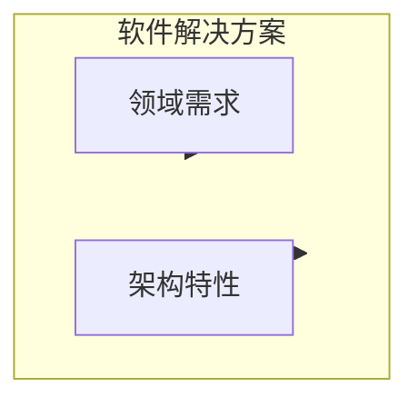

# 第4章 架构特性定义

公司决定用软件解决特定问题，因此收集了该系统的需求清单。存在多种需求收集技术，通常由团队使用的软件开发过程定义。但架构师在设计软件解决方案时必须考虑许多其他因素，如图 4-1 所示。

::: tip 图 4-1
软件解决方案由领域需求和架构特性组成
:::

架构师可能参与定义领域或业务需求，但一项关键职责是定义、发现并分析软件必须做的所有与领域功能不直接相关的事情：**架构特性（architecture characteristics）**。

什么将软件架构与编码和设计区分开来？许多事情，包括架构师在定义架构特性方面的角色——独立于问题域的系统重要方面。许多组织用各种术语描述软件的这些特性，包括**非功能需求（nonfunctional requirements）**，但我们不喜欢这个术语，因为它是自我贬低的。架构师创建该术语是为了将架构特性与功能需求区分开来，但从语言角度命名某物为「非功能」会产生负面影响：如何说服团队对「非功能」的东西给予足够关注？另一个流行术语是**质量属性（quality attributes）**，我们不喜欢因为它暗示事后质量评估而非设计。我们更喜欢**架构特性**，因为它描述了架构成功的关键关注，因此是整个系统的关键，而不贬低其重要性。

架构特性满足三个标准：

- 指定非领域设计考虑
- 影响设计的某些结构方面
- 对应用成功至关重要或重要

图 4-2 说明了我们定义的这些相互关联的部分。

::: tip 图 4-2
架构特性的区分特征
:::

**指定非领域设计考虑**：设计应用时，需求指定应用应做什么；架构特性指定成功的运维和设计标准，涉及如何实现需求以及为什么做出某些选择。

**影响设计的某些结构方面**：架构师尝试在项目上描述架构特性的主要原因涉及设计考虑：该架构特性是否需要特殊的结构考虑才能成功？

**对应用成功至关重要或重要**：应用可以支持我们列出的众多架构特性……但不应该。对每个架构特性的支持都会增加设计的复杂性。因此，架构师的关键工作在于选择最少的架构特性，而不是尽可能多的。

我们进一步将架构特性细分为**隐式（implicit）**与**显式（explicit）**。隐式特性很少出现在需求中，但对项目成功是必要的。例如，可用性、可靠性和安全性支撑几乎所有应用，却很少在设计文档中指定。架构师必须利用对问题域的知识在分析阶段发现这些架构特性。显式架构特性出现在需求文档或其他具体说明中。

## 架构特性（部分）列表

架构特性存在于软件系统的广泛谱系上，从低级别代码特性（如模块化）到复杂的运维关注（如可扩展性和弹性）。尽管过去有尝试编纂，但不存在真正的通用标准。相反，每个组织创建自己的这些术语的解释。此外，由于软件生态系统变化如此之快，新概念、术语、度量和验证不断出现，为架构特性定义提供新机遇。

尽管数量和规模庞大，架构师通常将架构特性分为 broad 类别。以下各节描述其中一些及示例。

### 运维架构特性

运维架构特性涵盖性能、可扩展性、弹性、可用性和可靠性等能力。表 4-1 列出了一些常见的运维架构特性。

| 术语 | 定义 |
|------|------|
| **可用性** | 系统需要可用多长时间（若 24/7，需采取措施使系统在任何故障时能快速恢复运行） |
| **连续性** | 灾难恢复能力 |
| **性能** | 包括压力测试、峰值分析、使用频率分析、所需容量和响应时间 |
| **可恢复性** | 业务连续性需求（例如，灾难发生后，系统需要多快重新上线？） |
| **可靠性/安全性** | 评估系统是否需要故障安全，或是否以影响生命的方式关键 |
| **健壮性** | 在互联网连接中断、停电或硬件故障时运行中处理错误和边界条件的能力 |
| **可扩展性** | 随着用户或请求数量增加，系统执行和运行的能力 |

### 结构架构特性

架构师必须关注代码结构。在许多情况下，架构师对代码质量关注负有唯一或共同责任，如良好模块化、组件间受控耦合、可读代码等。表 4-2 列出了几个结构架构特性。

| 术语 | 定义 |
|------|------|
| **可配置性** | 最终用户通过可用界面轻松更改软件配置方面的能力 |
| **可扩展性** | 插入新功能块的重要性 |
| **可安装性** | 在所有必要平台上安装系统的难易程度 |
| **可复用性** | 在多个产品中利用通用组件的能力 |
| **本地化** | 对入口/查询屏幕、数据字段、报告、多字节字符需求和度量或货币单位的多种语言支持 |
| **可维护性** | 应用更改和增强系统的难易程度 |
| **可移植性** | 系统是否需要在多个平台上运行？ |
| **可支持性** | 应用需要什么级别的技术支持？需要什么级别的日志记录和其他调试错误的设施？ |
| **可升级性** | 在服务器和客户端上从应用的先前版本快速升级到更新版本的能力 |

### 横切架构特性

虽然许多架构特性落入易于识别的类别，但许多落在类别之外或难以分类， yet 形成重要的设计约束和考虑。表 4-3 描述了其中几个。

| 术语 | 定义 |
|------|------|
| **可访问性** | 面向所有用户（包括色盲或听力损失等残障用户）的访问 |
| **可归档性** | 数据是否需要在一段时间后归档或删除？ |
| **认证** | 确保用户是其声称身份的安全需求 |
| **授权** | 确保用户只能访问应用中某些功能的安全需求 |
| **法律** | 系统运营所在的法律约束（数据保护、萨班斯-奥克斯利、GDPR 等）？ |
| **隐私** | 向内部公司员工隐藏交易的能力（加密交易，即使 DBA 和网络架构师也无法看到） |
| **安全** | 数据是否需要在数据库中加密？内部系统间网络通信是否加密？ |
| **可用性/可达性** | 用户使用应用/解决方案实现目标所需的培训水平 |

::: details Italy-ility
Neal 的一位同事讲述了一个关于架构特性独特本质的故事。她为一位要求集中式架构的客户工作。然而，对于每个提议的设计，客户的第一个问题都是「但如果我们失去意大利怎么办？」多年前，由于罕见的通信中断，总部与意大利分支机构失去了联系，这在组织上是创伤性的。因此，所有未来架构的坚定要求坚持团队最终称之为 Italy-ility 的东西，他们都知道这意味着可用性、可恢复性和弹性的独特组合。
:::

## 权衡与最不坏架构

应用只能支持我们列出的少数架构特性，原因有多种。第一，每个受支持的特性都需要设计努力，可能还需要结构支持。第二，更大的问题在于每个架构特性往往会影响其他特性。例如，如果架构师想提高安全性，几乎肯定会负面影响性能：应用必须进行更多即时加密、隐藏密钥的间接寻址以及其他可能降低性能的活动。

隐喻有助于说明这种互联性。显然，飞行员学习驾驶直升机常常很困难，因为需要手脚各有一个控制装置，改变一个会影响其他。因此，驾驶直升机是一种平衡练习，很好地描述了选择架构特性时的权衡过程。架构师设计支持的每个架构特性都可能使整体设计复杂化。

因此，架构师很少遇到能够设计系统并最大化每个架构特性的情况。更常见的是，决策归结为几个竞争关注之间的权衡。

> 永远不要追求最佳架构，而要追求最不坏的架构。
>
> —软件架构格言

太多架构特性会导致试图解决每个业务问题的通用解决方案，这些架构很少奏效，因为设计变得难以驾驭。

这表明架构师应努力使架构尽可能迭代。如果你能更容易地对架构进行更改，就不必那么担心在第一次尝试中发现完全正确的东西。敏捷软件开发最重要的教训之一是迭代的价值；这在软件开发的各个层面都成立，包括架构。

---

**导航**

| 上一章 | 下一章 |
|--------|--------|
| [← 第3章 模块化](ch03.md) | [第5章 识别架构特性 →](ch05.md) |
