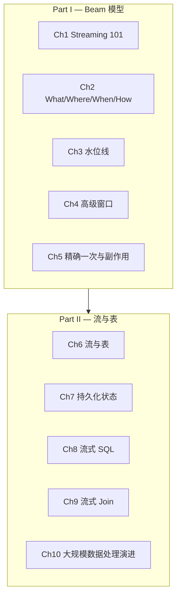

# Streaming Systems

> **Streaming Systems: The What, Where, When, and How of Large-Scale Data Processing**
>
> Tyler Akidau, Slava Chernyak, Reuven Lax, 2018, O'Reilly Media

---

## 章节路线图

## Part I — Beam 模型

| 章节 | 内容 |
|------|------|
| [第1章 Streaming 101](./part1/ch01.md) | 术语、能力、时间域、数据处理模式 |
| [第2章 数据处理的 What, Where, When, How](./part1/ch02.md) | 变换、窗口化、触发器、水位线、累积 |
| [第3章 水位线](./part1/ch03.md) | 水位线定义、源创建、传播 |
| [第4章 高级窗口](./part1/ch04.md) | 处理时间窗口、会话窗口、自定义窗口 |
| [第5章 精确一次与副作用](./part1/ch05.md) | Shuffle、源、Sink 的精确一次保证 |

## Part II — 流与表

| 章节 | 内容 |
|------|------|
| [第6章 流与表](./part2/ch06.md) | 流表相对论、MapReduce 分析、Beam Model 映射 |
| [第7章 持久化状态的实践](./part2/ch07.md) | 隐式状态、显式状态、转化归因案例 |
| [第8章 流式 SQL](./part2/ch08.md) | 时变关系、流与表的统一视图 |
| [第9章 流式 Join](./part2/ch09.md) | 无窗口 Join、窗口化 Join、有效性窗口 |
| [第10章 大规模数据处理的演进](./part2/ch10.md) | MapReduce、Hadoop、Flume、MillWheel、Kafka 等 |

---

::: details 导航
- [开始阅读：第1章 Streaming 101 →](./part1/ch01.md)
:::
