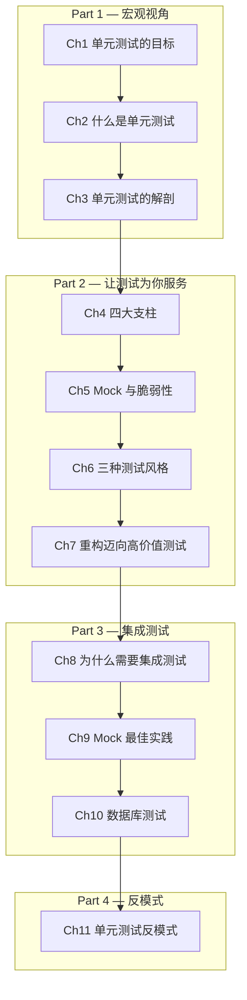

# 单元测试：原则、实践与模式

> **原书**：*Unit Testing: Principles, Practices, and Patterns* — Vladimir Khorikov (Manning, 2020)
>
> **核心主张**：单元测试的目标不是"写测试"，而是实现软件项目的**可持续增长**。

---

## 全书章节地图

---

## 核心框架速查

### 测试价值公式

$$
\text{Value} = \text{Protection} \times \text{Resistance} \times \text{Feedback} \times \text{Maintainability}
$$

> 任何一项为零 → 测试毫无价值

### 好单元测试的四大支柱（第4章）

| # | 支柱 | 英文 | 说明 |
|---|------|------|------|
| 1 | **防回归性** | Protection against regressions | 执行尽可能多的代码，覆盖复杂的业务逻辑 |
| 2 | **抗重构性** ⭐ | Resistance to refactoring | 测试可观察行为，而非实现细节（**不可妥协**） |
| 3 | **快速反馈** | Fast feedback | 测试执行速度快 |
| 4 | **可维护性** | Maintainability | 测试易于理解和运行 |

### Mock 使用决策树

| 依赖类型 | Mock? | 原因 |
|----------|-------|------|
| 进程内依赖（类与类之间） | ❌ 不用 | 系统内通信 = 实现细节 |
| 受管理的进程外依赖（自己的数据库） | ❌ 不用 | 用真实 DB 集成测试 |
| 不受管理的进程外依赖（SMTP、第三方 API） | ✅ 用 Mock | 系统间通信 = 可观察行为 |

### 三种测试风格（第6章）

| 风格 | 适用场景 | 质量排名 |
|------|---------|---------|
| **Output-based（输出型）** | 纯函数，无副作用 | 🥇 最佳 |
| **State-based（状态型）** | 领域状态变更 | 🥈 良好 |
| **Communication-based（通信型）** | 跨边界副作用 | 🥉 谨慎使用 |

### 代码四象限（第7章）

| | 协作者少 | 协作者多 |
|---|---------|---------|
| **复杂度高** | 领域模型 & 算法 → ✅ 大量单元测试 | 过度复杂代码 → 🔧 重构！ |
| **复杂度低** | 简单代码 → ❌ 不测试 | 控制器 → ⚠️ 少量集成测试 |

---

## 目录

### Part 1：宏观视角（The Bigger Picture）

| 章节 | 核心内容 | 链接 |
|------|---------|------|
| 第1章 | 单元测试的目标：可持续增长；覆盖率的局限性 | [→ 阅读](part1/ch01-goal-of-unit-testing.md) |
| 第2章 | 单元测试的定义；伦敦学派 vs 古典学派 | [→ 阅读](part1/ch02-what-is-unit-test.md) |
| 第3章 | AAA 模式；测试命名；参数化测试 | [→ 阅读](part1/ch03-anatomy-of-unit-test.md) |

### Part 2：让测试为你服务（Making Your Tests Work for You）

| 章节 | 核心内容 | 链接 |
|------|---------|------|
| 第4章 | 好单元测试的四大支柱；测试金字塔；黑/白盒测试 | [→ 阅读](part2/ch04-four-pillars.md) |
| 第5章 | Mock vs Stub；可观察行为 vs 实现细节；六边形架构 | [→ 阅读](part2/ch05-mocks-and-fragility.md) |
| 第6章 | 三种测试风格；函数式架构；审计系统案例 | [→ 阅读](part2/ch06-styles-of-unit-testing.md) |
| 第7章 | 代码四象限；Humble Object 模式；CRM 重构案例；领域事件 | [→ 阅读](part2/ch07-refactoring-toward-valuable-tests.md) |

### Part 3：集成测试（Integration Testing）

| 章节 | 核心内容 | 链接 |
|------|---------|------|
| 第8章 | 为什么需要集成测试；受管理 vs 不受管理的依赖；接口的正确使用；日志测试 | [→ 阅读](part3/ch08-why-integration-testing.md) |
| 第9章 | Mock 最佳实践；在系统边界验证交互；Spy 模式；调用次数验证 | [→ 阅读](part3/ch09-mocking-best-practices.md) |
| 第10章 | 数据库测试；迁移交付；事务管理；测试数据生命周期；代码复用模式 | [→ 阅读](part3/ch10-database-testing.md) |

### Part 4：单元测试反模式（Unit Testing Anti-patterns）

| 章节 | 核心内容 | 链接 |
|------|---------|------|
| 第11章 | 测试私有方法；暴露私有状态；泄露领域知识；代码污染；Mock 具体类；时间处理 | [→ 阅读](part4/ch11-unit-testing-anti-patterns.md) |

---

## 关键术语表

| 术语 | 英文 | 定义 |
|------|------|------|
| **SUT** | System Under Test | 被测系统，测试的入口点 |
| **测试替身** | Test Double | 生产依赖的简化版本（包括 Mock、Stub、Spy 等） |
| **Mock** | Mock | 验证**传出交互**（命令）的测试替身 |
| **Stub** | Stub | 提供**传入数据**（查询）的测试替身 |
| **回归** | Regression | 代码修改后，原本正常的功能停止工作 |
| **误报** | False Positive | 功能正常，但测试失败 |
| **漏报** | False Negative | 功能有 Bug，但测试通过 |
| **谦逊对象** | Humble Object | 将难以测试的代码与业务逻辑分离 |
| **六边形架构** | Hexagonal Architecture | 将业务逻辑与 I/O 分离 |
| **可观察行为** | Observable Behavior | 客户端关心的公共 API 和副作用 |
| **实现细节** | Implementation Detail | 客户端不关心的内部实现 |

---

## 配套代码

Go 语言配套代码仓库：[unit-testing-patterns (Go)](https://github.com/huangkai/unit-testing-patterns)

---

*基于 Vladimir Khorikov《Unit Testing: Principles, Practices, and Patterns》(Manning, 2020) 全书翻译*
