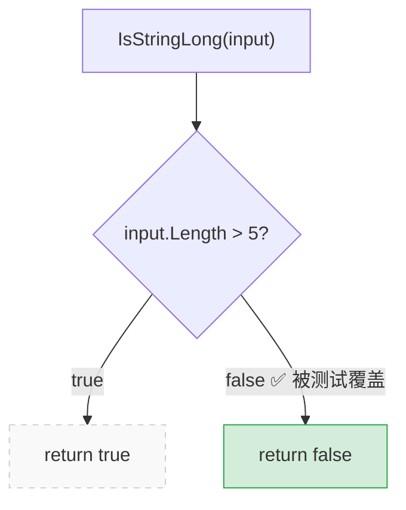
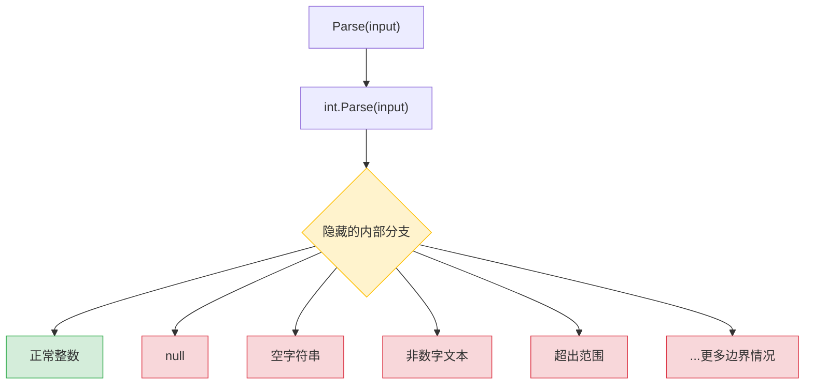

# 第1章：单元测试的目标

> **本章内容**
>
> - 单元测试的现状
> - 单元测试的目标
> - 拥有糟糕测试套件的后果
> - 使用覆盖率指标衡量测试套件质量
> - 成功测试套件的属性

学习单元测试，不仅仅是掌握技术层面的内容，比如你喜欢的测试框架、Mock 库等。你必须始终追求**最佳的投入产出比**——用最少的精力换取最大的收益。

看到那些达到了这种平衡的项目令人着迷：它们轻松增长，不需要太多维护，而且可以迅速适应客户不断变化的需求。而看到失败的项目则同样令人沮丧。尽管付出了大量的努力，拥有数量可观的单元测试，这些项目却进展缓慢，Bug 不断出现，维护成本居高不下。

这就是各种单元测试技术之间的区别。有些能产生很好的结果，帮助维护软件质量。另一些则不行：它们产生的测试贡献不大、经常失败，而且总体上需要大量维护。

本章将快速概述软件行业中单元测试的现状，描述编写和维护测试背后的目标，并为你提供关于什么构成成功测试套件的初步认识。

---

## 1.1 单元测试的现状

过去二十年来，业界一直在推动单元测试的普及。这种推动非常成功，以至于单元测试在大多数公司已被视为强制要求。大多数程序员实践单元测试并理解其重要性。是否应该做单元测试已不再有争议。除非你在做一个一次性项目，否则答案是：是的，你应该做。

在企业应用开发方面，几乎每个项目都至少包含一些单元测试。其中很大一部分项目远不止于此：它们通过大量的单元测试和集成测试实现了很高的代码覆盖率。生产代码和测试代码的比例通常在 **1:1 到 1:3** 之间（每一行生产代码对应一到三行测试代码）。有时，这个比例甚至高达 **1:10**。

但与所有新技术一样，单元测试在持续演进。讨论的焦点已经从：

> "我们**应该**写单元测试吗？"

转移到了：

> "什么是**好的**单元测试？"

这正是主要困惑所在。很多项目有大量的自动化测试，但这些测试的存在往往没有带来开发者期望的效果。程序员在这些项目中仍然需要付出大量努力才能取得进展。新功能迟迟无法实现，已接受的功能不断出现新 Bug，而那些本应帮助解决问题的单元测试却毫无作用，甚至让情况更糟。

这是一种可怕的处境——这是拥有不能正确发挥作用的单元测试的结果。好测试和坏测试之间的区别不仅仅是品味或个人偏好的问题，而是关系到你正在进行的关键项目是成功还是失败的问题。

---

## 1.2 单元测试的目标

在深入单元测试这个话题之前，让我们先退后一步，思考一下单元测试帮助你实现的目标。人们常说单元测试实践能带来更好的代码设计。这是真的：为代码编写单元测试的需要通常确实会带来更好的设计。但这不是主要目标；它只是一个令人愉快的**副作用**。

::: info 什么是企业应用？
企业应用是一种旨在自动化或协助组织内部流程的应用程序。它可以有多种形式，但通常企业软件的特征是：

- 高业务逻辑复杂度
- 长项目生命周期
- 中等数据量
- 低或中等性能要求

:::

::: info 单元测试与代码设计的关系
能够对一段代码进行单元测试是一个不错的石蕊测试，但它只在一个方向上有效。它是一个**好的负向指标**——能以较高的准确度指出低质量代码。如果你发现代码很难进行单元测试，这是代码需要改进的强烈信号。低质量通常表现为紧耦合（tight coupling），意味着不同的生产代码片段之间没有足够的解耦，很难单独测试它们。

不幸的是，能够对代码进行单元测试是一个**差的正向指标**。你能轻松地对代码进行单元测试，并不一定意味着代码质量好。即使项目表现出高度解耦，它仍然可能是一场灾难。

:::

那么，单元测试的目标是什么呢？

> **核心目标：实现软件项目的可持续增长（Sustainable Growth）**

**"可持续"**是关键词。从零开始增长一个项目很容易，特别是当你从头开始时。随着时间的推移，要维持这种增长则困难得多。

图 1.1 展示了没有测试的典型项目的增长动态。你一开始进展很快，因为没有任何东西拖累你。尚未做出糟糕的架构决策，也没有现有代码需要担心。但随着时间的推移，你必须投入越来越多的时间才能取得与开始时相同的进展。最终，开发速度显著放缓，有时甚至到了完全无法取得任何进展的地步。

*图 1.1 有测试和无测试的项目增长动态差异*

```
开发进度 ▲
         │
         │       ╭──────────────── 有测试（持续增长）
         │      ╱
         │     ╱
         │    ╱   ╭───────────── 无测试（逐渐停滞）
         │   ╱   ╱
         │  ╱  ╱
         │ ╱ ╱
         │╱╱
         └──────────────────────────────────▶ 投入时间
           早期        中期        后期
```

> 没有测试的项目有先发优势，但很快就会减速到难以取得任何进展的地步。

这种开发速度快速下降的现象也被称为**软件熵**（Software Entropy）。熵（系统中的无序程度）是一个数学和科学概念，也适用于软件系统。

在软件中，熵表现为代码趋向于劣化。每次你在代码库中做出修改，其中的无序程度或熵就会增加。如果不加以适当维护——比如持续的清理和重构——系统就会变得越来越复杂和混乱。修复一个 Bug 会引入更多 Bug，修改软件的一个部分会破坏其他几个部分——这就像多米诺效应。最终，代码库变得不可靠。而最糟糕的是，很难让它恢复稳定。

测试帮助扭转这种趋势。它们充当**安全网**——一种工具，能为绝大多数回归提供保障。测试帮助确保现有功能正常工作，即使你引入了新功能或重构代码以更好地适应新需求。

::: tip 定义
**回归**（Regression）是指一个功能在某个事件（通常是代码修改）之后停止按预期工作。回归和软件 Bug 是同义词，可以互换使用。

:::

当然，缺点是测试需要初始的——有时是相当大的——投入。但从长远来看，它们通过帮助项目在后期阶段保持增长来收回成本。没有不断验证代码库的测试的帮助，软件开发根本无法**规模化**。

可持续性和可扩展性是关键。它们让你能在长期内保持开发速度。

### 1.2.1 什么是好测试，什么是坏测试？

虽然单元测试有助于维持项目增长，但仅仅写测试是不够的。写得不好的测试仍然会导致同样的结果。

如图 1.2 所示，坏测试确实有助于在开始时减缓代码劣化：与完全没有测试的情况相比，开发速度的下降不那么明显。但在整体上并没有真正改变什么。这样的项目可能需要更长时间才能进入停滞阶段，但停滞仍然是不可避免的。

*图 1.2 好测试 / 坏测试 / 无测试的项目增长动态对比*

```
开发进度 ▲
         │
         │        ╭─────────────── 有好测试（持续稳定增长）
         │       ╱
         │      ╱  ╭────────────── 有坏测试（推迟停滞）
         │     ╱  ╱
         │    ╱  ╱  ╭───────────── 无测试（快速停滞）
         │   ╱ ╱  ╱
         │  ╱╱  ╱
         │ ╱╱ ╱
         │╱╱╱
         └──────────────────────────────────▶ 投入时间
           早期        中期        后期
```

> 拥有坏测试的项目在开始时与好测试项目表现相似，但最终仍会陷入停滞。

记住，**不是所有测试都是平等的**。有些很有价值，对整体软件质量贡献很大。另一些则不然。它们发出误报，不能帮你捕获回归错误，而且运行缓慢、难以维护。很容易陷入为了测试而写测试的陷阱，而没有清楚地了解这是否有助于项目。

你不能仅仅通过向项目抛出更多测试来实现单元测试的目标。你需要同时考虑测试的**价值**和**维护成本**。成本部分由以下活动所花费的时间决定：

- 当你重构底层代码时需要**重构测试**
- 每次代码变更都要**运行测试**
- 处理测试发出的**误报**（false alarms）
- 尝试理解底层代码行为时**阅读测试**所花费的时间

很容易创建出净值接近零甚至为负的测试（由于高维护成本）。要实现可持续的项目增长，你必须**专注于高质量测试**——只有这种类型的测试值得保留在测试套件中。

学习如何区分好测试和坏测试至关重要。我将在第 4 章详细讨论这个话题。

::: warning 生产代码 vs. 测试代码
人们常常认为生产代码和测试代码是不同的。测试被假设为生产代码的附加品，没有所有权成本。由此推论，人们常常相信测试越多越好。**事实并非如此。**

代码是**负债（Liability）**，不是资产（Asset）。你引入的代码越多，就越扩大了软件中潜在 Bug 的暴露面，项目的维护成本就越高。最好是用尽可能少的代码来解决问题。

测试也是代码。你应该将它们视为代码库中旨在解决特定问题的部分：确保应用程序的正确性。单元测试，就像任何其他代码一样，也容易出 Bug，也需要维护。

:::

---

## 1.3 用覆盖率指标衡量测试套件质量

本节讨论两种最流行的覆盖率指标——代码覆盖率和分支覆盖率——如何计算它们、如何使用它们以及它们的问题。我将说明为什么让程序员以特定覆盖率数字为目标是有害的，以及为什么你不能仅依赖覆盖率指标来确定测试套件的质量。

::: tip 定义
**覆盖率指标**显示测试套件执行了多少源代码，范围从零到 100%。

:::

覆盖率指标有不同类型，它们经常被用来评估测试套件的质量。普遍的看法是覆盖率数字越高越好。

不幸的是，事情没那么简单。覆盖率指标虽然提供有价值的反馈，但**不能用来有效衡量测试套件的质量**。这与能否对代码进行单元测试的情况相同：覆盖率指标是好的负向指标，但是差的正向指标。

如果指标显示你的代码库覆盖率太低——比如只有 10%——那是你测试不够的好信号。但反过来不成立：即使 100% 的覆盖率也不能保证你有一个高质量的测试套件。

### 1.3.1 理解代码覆盖率指标

第一个也是最常用的覆盖率指标是**代码覆盖率**（Code Coverage），也称为**测试覆盖率**（Test Coverage），见图 1.3。

*图 1.3 代码覆盖率指标*

```
                  被至少一个测试执行的代码行数
代码覆盖率  =  ─────────────────────────────────
                        总代码行数
```

$$
\text{代码覆盖率} = \frac{\text{被至少一个测试执行的代码行数}}{\text{总代码行数}}
$$

让我们看一个例子来更好地理解它是如何工作的。下面的代码展示了一个 `IsStringLong` 方法和一个覆盖它的测试。该方法判断一个字符串输入参数是否是"长"的（这里，"长"的定义是长度大于 5 个字符的字符串）。测试使用 `"abc"` 来调用该方法并检查这个字符串不被认为是长的。

```csharp
// 代码清单 1.1：部分被测试覆盖的示例方法
public static bool IsStringLong(string input)
{
    if (input.Length > 5)      // ← 被测试执行
        return true;            // ← 未被测试执行
    return false;               // ← 被测试执行
}

public void Test()
{
    bool result = IsStringLong("abc");
    Assert.Equal(false, result);
}
```

计算代码覆盖率很容易。方法的总行数是 5（花括号也算在内）。被测试执行的行数是 4——测试经过了除 `return true;` 之外的所有代码行。这给我们 4/5 = 0.8 = **80% 代码覆盖率**。

现在，如果我重构方法，将不必要的 `if` 语句内联化，会怎样？

```csharp
// 重构后的版本
public static bool IsStringLong(string input)
{
    return input.Length > 5;    // ← 被测试执行
}

public void Test()
{
    bool result = IsStringLong("abc");
    Assert.Equal(false, result);
}
```

代码覆盖率数字变了吗？是的，变了。因为测试现在执行了所有三行代码（`return` 语句加两个花括号），代码覆盖率增加到了 **100%**。

但我通过这次重构改进了测试套件吗？**当然没有。** 我只是重新排列了方法内部的代码。测试仍然验证了相同数量的可能结果。

这个简单的例子展示了**操纵覆盖率数字有多容易**。你的代码越紧凑，代码覆盖率指标就越好看，因为它只考虑原始行号。同时，将更多代码压缩到更少的空间并不（也不应该）改变测试套件的价值或底层代码库的可维护性。

### 1.3.2 理解分支覆盖率指标

另一个覆盖率指标叫做**分支覆盖率**（Branch Coverage）。分支覆盖率提供比代码覆盖率更精确的结果，因为它有助于克服代码覆盖率的缺点。它不使用原始代码行数，而是关注控制结构，如 `if` 和 `switch` 语句。它显示了测试套件中至少有一个测试遍历了多少这样的控制结构。

*图 1.4 分支覆盖率指标*

```
                  被测试遍历的分支数
分支覆盖率  =  ─────────────────────
                    总分支数
```

$$
\text{分支覆盖率} = \frac{\text{被测试遍历的分支数}}{\text{总分支数}}
$$

让我们再次使用之前的例子：

```csharp
public static bool IsStringLong(string input)
{
    return input.Length > 5;
}

public void Test()
{
    bool result = IsStringLong("abc");
    Assert.Equal(false, result);
}
```

`IsStringLong` 方法中有两个分支：一个用于字符串参数长度大于 5 个字符的情况，另一个用于不大于的情况。测试只覆盖了其中一个分支，所以分支覆盖率指标是 1/2 = 0.5 = **50%**。而且不管我们如何表示被测代码——无论使用 `if` 语句还是使用更短的表示法——都无关紧要。分支覆盖率指标只考虑分支的数量；它不考虑实现这些分支花了多少行代码。

图 1.5 展示了一种可视化此指标的有用方式。你可以将被测代码可能采取的所有路径表示为一个图，并查看其中有多少已被遍历。

*图 1.5 方法 IsStringLong 表示为可能代码路径的图（50% 分支覆盖率）*



### 1.3.3 覆盖率指标的两大问题

尽管分支覆盖率指标比代码覆盖率产生更好的结果，你仍然不能依赖它们中的任何一个来确定测试套件的质量，原因有二：

1. **你无法保证测试验证了被测系统所有可能的结果**
2. **没有覆盖率指标能考虑到外部库中的代码路径**

#### 问题一：无法保证测试验证了所有可能的结果

为了使代码路径被真正测试而不仅仅是被执行，你的单元测试必须有适当的断言。换句话说，你需要检查被测系统产生的结果是否是你期望的结果。而且，这个结果可能有多个组成部分；为了使覆盖率指标有意义，你需要验证所有这些部分。

```csharp
// 代码清单 1.2：记录最后结果的 IsStringLong 版本
public static bool WasLastStringLong { get; private set; }

public static bool IsStringLong(string input)
{
    bool result = input.Length > 5;
    WasLastStringLong = result;    // ← 第一个结果（隐式输出）
    return result;                  // ← 第二个结果（显式输出）
}

public void Test()
{
    bool result = IsStringLong("abc");
    Assert.Equal(false, result);   // ← 只验证了第二个结果！
    // WasLastStringLong 没有被验证！
}
```

`IsStringLong` 方法现在有两个结果：一个显式的（通过返回值编码）和一个隐式的（属性的新值）。尽管没有验证第二个隐式结果，覆盖率指标仍然显示相同的结果：代码覆盖率 100%，分支覆盖率 50%。

覆盖率指标**不能保证底层代码被测试了**，只能保证它在某个时刻被执行了。

这种部分测试结果的极端版本是**无断言测试**（Assertion-Free Testing）——编写完全没有任何断言语句的测试：

```csharp
// 代码清单 1.3：没有断言的测试总是通过
public void Test()
{
    bool result1 = IsStringLong("abc");
    bool result2 = IsStringLong("abcdef");
    // 没有任何 Assert！
}
```

这个测试的代码覆盖率和分支覆盖率都显示 100%。但同时，它**完全没有用**，因为它什么也没有验证。

::: details 来自实战的故事
无断言测试的概念可能看起来很愚蠢，但它确实在实际中发生过。

多年前，我在一个项目中工作，管理层对每个开发中的项目强制要求 100% 的代码覆盖率。这一举措有着崇高的初衷。那是在单元测试还不像今天这么普及的时代。组织中很少有人实践它，更少有人持续做单元测试。

一组开发者参加了一个会议，很多演讲都是关于单元测试的。回来后，他们决定将新知识付诸实践。高层管理支持了他们，向更好的编程技术的伟大转型开始了。进行了内部演示。安装了新工具。更重要的是，强加了一条新的公司范围规则：所有开发团队必须专注于写测试，直到达到 100% 代码覆盖率。达到目标后，任何降低该指标的代码提交都必须被构建系统拒绝。

可以想见，这并没有好的结果。被这种严格限制压垮的开发者开始寻找规避系统的方法。自然地，许多人得出了相同的结论：如果用 `try/catch` 包裹所有测试并且不引入任何断言，这些测试就保证能通过。人们开始盲目地为了满足强制性的 100% 覆盖率要求而创建测试。

不用说，这些测试没有为项目增加任何价值。而且，它们因为占用的精力和时间以及维护成本而**损害了项目**。

最终，要求降低到 90%，然后 80%；过了一段时间，彻底取消了（谢天谢地！）。

:::

#### 问题二：无法考虑外部库的代码路径

所有覆盖率指标的第二个问题是，它们不考虑当被测系统调用外部库的方法时，外部库经历的代码路径。

```csharp
public static int Parse(string input)
{
    return int.Parse(input);
}

public void Test()
{
    int result = Parse("5");
    Assert.Equal(5, result);
}
```

分支覆盖率指标显示 100%，而且测试验证了方法结果的所有组成部分（它只有一个——返回值）。但同时，这个测试远远不够全面。它没有考虑 .NET Framework 的 `int.Parse` 方法可能经历的代码路径。即使在这个简单的方法中，也有相当多的代码路径。

*图 1.6 外部库的隐藏代码路径*



> 覆盖率指标无法看到外部库中有多少隐藏路径，也无法看到你的测试覆盖了其中多少。

内置整数类型有大量隐藏的分支，如果你改变方法的输入参数，可能导致不同的结果。以下只是一些不能被转换为整数的参数示例：

- 空值（Null）
- 空字符串
- `"Not an int"`
- 超出范围的字符串

你可能遇到无数边界情况，而且没有办法看到你的测试是否考虑到了所有这些情况。

这不是说覆盖率指标应该考虑外部库中的代码路径（它们不应该），而是向你展示**你不能依赖这些指标来判断你的单元测试有多好或多差**。覆盖率指标不可能告诉你你的测试是否全面，也不能说你是否有足够的测试。

### 1.3.4 不要以特定覆盖率数字为目标

此时，我希望你能看到仅依赖覆盖率指标来确定测试套件的质量是不够的。如果你开始以特定覆盖率数字为目标——无论是 100%、90%、还是温和的 70%——也可能导致危险的境地。看待覆盖率指标的最佳方式是将其作为一个**指示器**，而不是目标本身。

::: tip 类比
想想医院里的一个病人。他们的高体温可能表明发烧，这是一个有用的观察。但医院不应该把这个病人的正常体温作为不惜一切代价要达到的目标。否则，医院可能会得出快速而"高效"的解决方案：在病人旁边安装空调，通过调节吹到皮肤上的冷空气量来调节他们的体温。当然，这种方法没有任何意义。

:::

同样地，以特定覆盖率数字为目标会产生**适得其反的激励**，与单元测试的目标背道而驰。人们不再专注于测试重要的东西，而是开始寻找达到这个人为目标的方法。正确的单元测试本身就已经够难了。强制要求覆盖率数字只会分散开发者的注意力，使正确的单元测试更难实现。

::: tip 提示
在系统核心部分保持高覆盖率是好的。将这个高覆盖率作为强制要求则是坏的。两者的区别微妙但至关重要。

:::

让我重复一遍：**覆盖率指标是好的负向指标，但是差的正向指标。** 低覆盖率数字——比如低于 60%——是麻烦的确切信号。它们意味着你的代码库中有大量未测试的代码。但高数字并不意味着什么。因此，测量代码覆盖率应该只是通向高质量测试套件的第一步。

---

## 1.4 什么是成功的测试套件？

衡量测试套件质量的**唯一可靠方式**是逐一评估套件中的每个测试。当然，你不必一次评估所有测试；那可能是一项相当大的工程，需要相当大的前期投入。你可以逐步进行评估。关键是：**没有自动化的方式来判断你的测试套件有多好。你必须运用个人判断。**

一个成功的测试套件具备以下属性：

1. **融入开发周期**
2. **只针对代码库中最重要的部分**
3. **以最低维护成本提供最大价值**

### 1.4.1 融入开发周期

拥有自动化测试的唯一意义在于你持续使用它们。所有测试都应该融入开发周期。理想情况下，你应该在每次代码变更时执行它们——哪怕是最小的变更。

### 1.4.2 只针对代码库中最重要的部分

正如所有测试不是平等的一样，代码库的所有部分在单元测试方面也不值得同等的关注。测试提供的价值不仅在于测试本身的结构，还在于它们验证的代码。

将你的单元测试工作聚焦在系统最关键的部分，其他部分只需简要或间接验证。在大多数应用程序中，最重要的部分是包含**业务逻辑**的部分——**领域模型**（Domain Model）。测试业务逻辑给你带来最好的时间投入回报。

所有其他部分可以分为三类：

- **基础设施代码**
- **外部服务和依赖**（如数据库和第三方系统）
- **将一切粘合在一起的代码**

其中一些可能仍然需要彻底的单元测试。例如，基础设施代码可能包含复杂而重要的算法，因此用大量测试覆盖它们也是有意义的。但总体而言，你的大部分注意力应该放在领域模型上。

### 1.4.3 以最低维护成本提供最大价值

这是最困难的部分，也是本书的核心。

仅仅将测试纳入构建系统是不够的，仅仅对领域模型保持高测试覆盖率也是不够的。同样重要的是，只在套件中保留那些价值远超其维护成本的测试。

这个属性可以分为两个方面：

| 技能 | 说明 | 类比 |
|------|------|------|
| **识别**高价值测试 | 需要参考框架（第4章） | 能听出好音乐 |
| **编写**高价值测试 | 还需要代码设计知识 | 能创作好音乐 |

虽然这些技能看起来相似，但它们本质上是不同的。识别高价值测试需要一个参考框架。另一方面，编写有价值的测试还要求你了解代码设计技术。单元测试和底层代码高度交织，不在它们覆盖的代码库上付出大量努力，就不可能创建有价值的测试。

---

## 1.5 你将在本书中学到什么

本书教授一个**参考框架**，你可以用它来分析测试套件中的任何测试。这个参考框架是基础性的。学习之后，你将能够以全新的视角看待许多测试，并判断哪些对项目有贡献，哪些必须重构或完全删除。

在建立这个框架之后（第 4 章），本书分析了现有的单元测试技术和实践（第 4-6 章，以及第 7 章的一部分）。无论你是否熟悉这些技术和实践。如果你熟悉，你会从新的角度看到它们。

::: tip 重要技能
不要低估清晰表达想法的能力。一个软件开发者——即使是很优秀的——如果不能解释**为什么**做出了某个设计决策，很少能得到对该决策的充分认可。本书可以帮助你将知识从无意识领域转化为你能够与任何人谈论的东西。

:::

---

## 本章小结

- 代码趋向于劣化。每次你在代码库中做出修改，其中的无序程度或熵就会增加。如果不加以适当维护（如持续清理和重构），系统会变得越来越复杂和混乱。**测试帮助扭转这种趋势。** 它们充当安全网——为绝大多数回归提供保障。

- 写单元测试很重要。写**好的**单元测试同样重要。对于拥有坏测试或没有测试的项目，最终结果是一样的：要么停滞，要么每次新发布都伴随大量回归。

- **单元测试的目标是实现软件项目的可持续增长。** 一个好的单元测试套件帮助避免停滞阶段，并在长期内保持开发速度。

- **不是所有测试都是平等的。** 每个测试都有成本和收益组成部分，你需要仔细权衡两者。只在套件中保留净值为正的测试，去掉其他所有的。应用代码和测试代码都是负债，不是资产。

- 能够对代码进行单元测试是一个好的石蕊测试，但它只在一个方向上有效。它是一个好的**负向指标**（如果你不能对代码进行单元测试，那代码质量很差），但是差的**正向指标**（能进行单元测试并不保证代码质量好）。

- 同样地，**覆盖率指标是好的负向指标，但是差的正向指标。** 低覆盖率数字是麻烦的确切信号，但高覆盖率数字并不自动意味着你的测试套件质量高。

- 分支覆盖率提供了关于测试套件完整性的更好洞察，但仍然不能表明套件是否足够好。它不考虑断言的存在，也无法考虑你的代码库使用的第三方库中的代码路径。

- **强制要求特定覆盖率数字会产生适得其反的激励。** 在系统核心部分保持高覆盖率是好的，但将这个高覆盖率作为强制要求则是坏的。

- 成功的测试套件具备以下属性：
    - 融入开发周期
    - 只针对代码库中最重要的部分
    - 以最低维护成本提供最大价值

- 实现单元测试目标（即实现可持续的项目增长）的唯一方式是：
    - 学习如何区分好测试和坏测试
    - 能够重构测试使其更有价值

---

[← 返回目录](../index.md) | [下一章：什么是单元测试？ →](ch02-what-is-unit-test.md)
