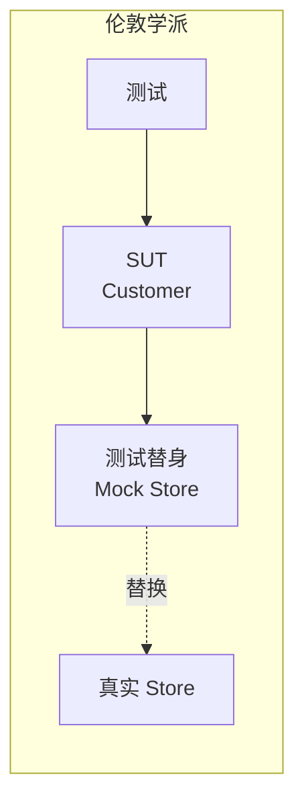
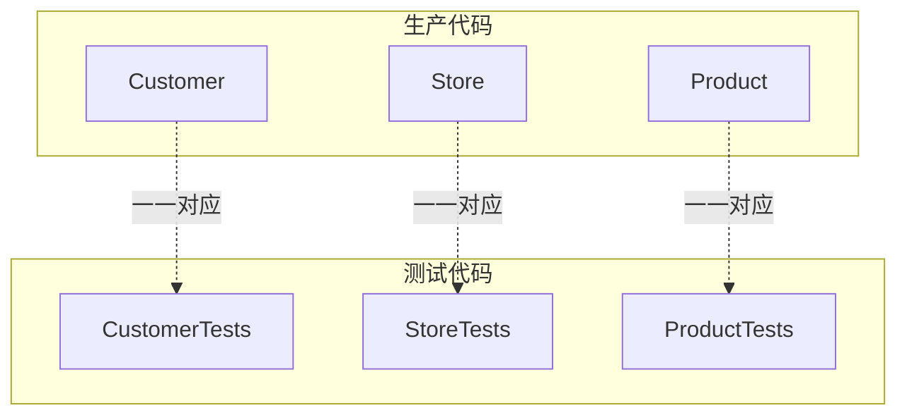
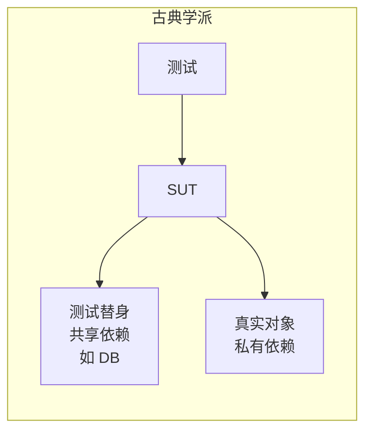
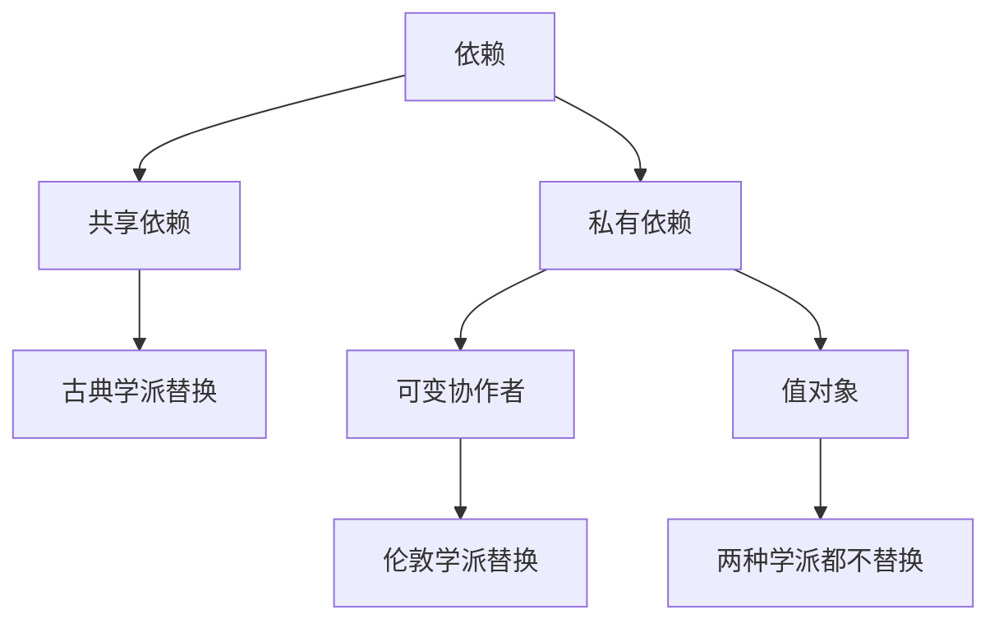
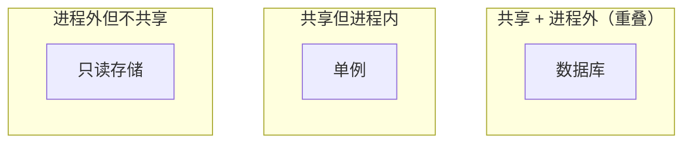
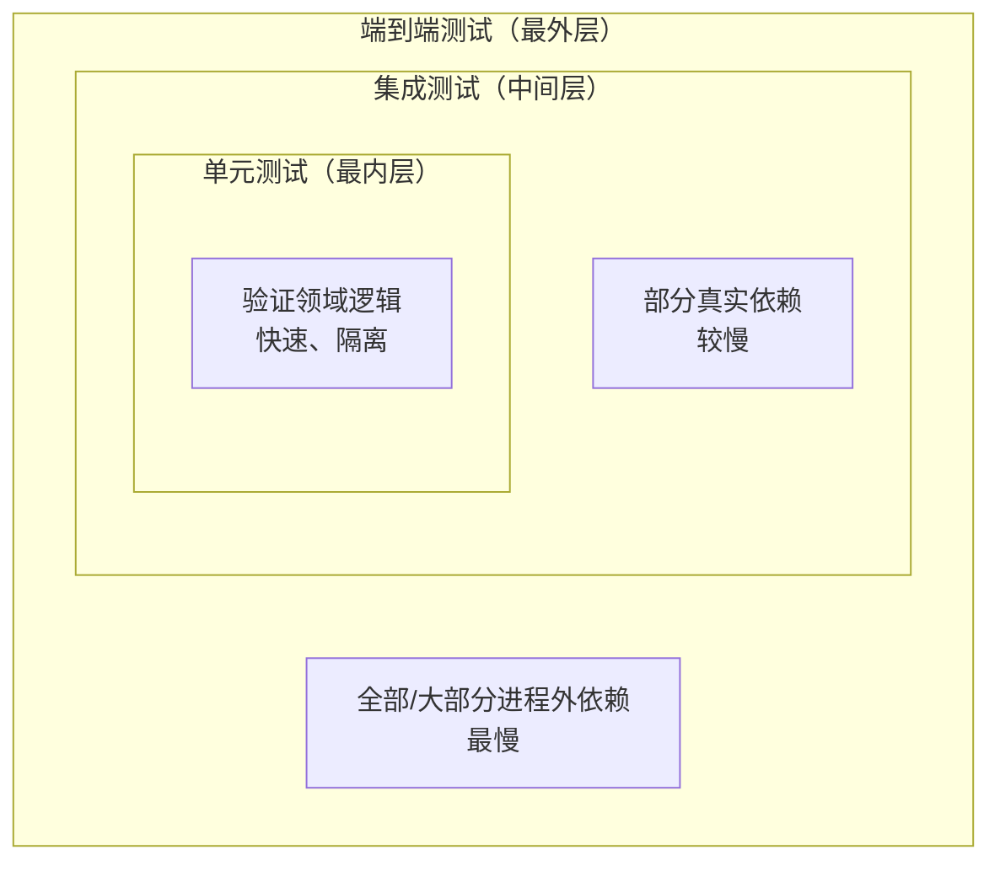

# 第2章：什么是单元测试？

> **本章内容**
>
> - "单元测试"的定义
> - 隔离问题：伦敦学派的观点
> - 隔离问题：古典学派的观点
> - 古典学派与伦敦学派的单元测试
> - 两种学派在集成测试上的差异

"单元测试"的定义有着令人惊讶的细微差别。这些细微差别催生了两种截然不同的观点：**古典学派**（classical school）和**伦敦学派**（London school）的单元测试。伦敦学派起源于伦敦的编程社区。

---

## 2.1 "单元测试"的定义

单元测试是一种自动化测试，它：

1. **验证一小段代码**（一个单元）
2. **快速**执行
3. **以隔离的方式**执行

第三个属性——**隔离**——是古典学派与伦敦学派之间分歧的根源。

---

### 2.1.1 隔离问题：伦敦学派的观点

在伦敦学派看来，**隔离**意味着将**被测系统（SUT）与其协作者隔离开来**。所有依赖都被替换为**测试替身**（test doubles），通常是 mock 对象。

::: tip 定义
**测试替身**（Test Double）是一个看起来和行为像其发布版本对应物、但经过简化的对象。该术语来自 Gerard Meszaros 的《xUnit Test Patterns》。

:::

::: tip 定义
**Mock** 是一种特殊的测试替身，允许检查 SUT 与其协作者之间的交互。

:::

这种做法带来几个好处：

1. **精确定位故障**：当测试失败时，你知道是哪个类出了问题
2. **拆分复杂对象图**：可以单独测试一个类，即使它依赖许多其他类
3. **一一对应**：每个生产类都有一个对应的测试类



*图 2.1 用测试替身替换依赖*

考虑一个在线商店的例子。`Customer` 类通过 `Store` 购买商品。下面是**古典学派**风格的测试（使用真实的 `Store` 实例）：

**清单 2.1 古典学派风格的测试**

```csharp
[Fact]
public void Purchase_succeeds_when_enough_inventory()
{
    // Arrange - 准备：创建真实 Store，添加库存
    var store = new Store();
    store.AddInventory(Product.Shampoo, 10);
    var customer = new Customer();
    // Act - 执行：顾客购买 5 件
    bool success = customer.Purchase(store, Product.Shampoo, 5);
    // Assert - 断言：购买成功，库存减少
    Assert.True(success);
    Assert.Equal(5, store.GetInventory(Product.Shampoo));
}

[Fact]
public void Purchase_fails_when_not_enough_inventory()
{
    // Arrange - 准备：库存只有 10 件
    var store = new Store();
    store.AddInventory(Product.Shampoo, 10);
    var customer = new Customer();
    // Act - 执行：尝试购买 15 件
    bool success = customer.Purchase(store, Product.Shampoo, 15);
    // Assert - 断言：购买失败，库存不变
    Assert.False(success);
    Assert.Equal(10, store.GetInventory(Product.Shampoo));
}
```

下面是**伦敦学派**风格的测试（使用 `Mock<IStore>` 替代真实 `Store`）：

**清单 2.2 伦敦学派风格的测试**

```csharp
[Fact]
public void Purchase_succeeds_when_enough_inventory()
{
    // Arrange - 准备：用 Mock 替代 Store，预设 HasEnoughInventory 返回 true
    var storeMock = new Mock<IStore>();
    storeMock
        .Setup(x => x.HasEnoughInventory(Product.Shampoo, 5))
        .Returns(true);
    var customer = new Customer();
    // Act - 执行：顾客购买 5 件
    bool success = customer.Purchase(storeMock.Object, Product.Shampoo, 5);
    // Assert - 断言：购买成功，并验证 RemoveInventory 被调用一次
    Assert.True(success);
    storeMock.Verify(
        x => x.RemoveInventory(Product.Shampoo, 5),
        Times.Once);
}

[Fact]
public void Purchase_fails_when_not_enough_inventory()
{
    // Arrange - 准备：Mock 预设 HasEnoughInventory 返回 false
    var storeMock = new Mock<IStore>();
    storeMock
        .Setup(x => x.HasEnoughInventory(Product.Shampoo, 5))
        .Returns(false);
    var customer = new Customer();
    // Act - 执行：尝试购买 5 件
    bool success = customer.Purchase(storeMock.Object, Product.Shampoo, 5);
    // Assert - 断言：购买失败，RemoveInventory 从未被调用
    Assert.False(success);
    storeMock.Verify(
        x => x.RemoveInventory(Product.Shampoo, 5),
        Times.Never);
}
```

注意两种风格的差异：

- **古典学派**：断言检查 `Store` 的**状态**（库存数量）
- **伦敦学派**：断言验证对 `Store` 的**方法调用**（`RemoveInventory` 是否被调用、调用次数）

伦敦学派遵循"一个生产类对应一个测试类"的原则：



*图 2.2 一个测试类对应一个生产类*

---

### 2.1.2 隔离问题：古典学派的观点

古典学派对**隔离**有不同的理解：隔离指的是**单元测试彼此之间的隔离**，而不是被测代码的隔离。

在古典学派看来：

- 测试可以同时执行**多个类**，只要它们不触及**共享状态**
- 只有**共享依赖**才需要被替换为测试替身
- 一个"单元"不必是单个类，可以是一组类

::: tip 定义
**共享依赖**（Shared Dependency）是在测试之间共享的依赖，可能影响彼此的测试结果。例如：数据库、静态可变字段、单例等。

:::

::: tip 定义
**私有依赖**（Private Dependency）是不在测试之间共享的依赖。每个测试创建自己的实例。

:::

::: tip 定义
**进程外依赖**（Out-of-Process Dependency）是在应用程序进程之外运行的依赖，如数据库、文件系统、网络服务等。

:::

::: tip 定义
**易变依赖**（Volatile Dependency）是需要运行时配置或包含非确定性行为的依赖。

:::

古典学派只隔离**共享依赖**：



*图 2.3 仅隔离共享依赖*

---

## 2.2 古典学派与伦敦学派的单元测试

两种学派的核心差异总结如下：

| | 隔离对象 | 单元是 | 使用测试替身替换 |
|---|---|---|---|
| **伦敦学派** | 被测单元 | 一个类 | 除不可变依赖外的所有依赖 |
| **古典学派** | 单元测试 | 一个类或一组类 | 仅共享依赖 |

---

### 2.2.1 古典学派与伦敦学派如何处理依赖

伦敦学派允许使用**真实的不可变对象**（如值对象）。依赖的层次结构如下：



*图 2.4 依赖层次结构*

- **依赖**（Dependency）：SUT 与之交互的任何对象
  - **共享依赖**：古典学派会替换
  - **私有依赖**：可进一步分为
    - **可变协作者**（Mutable Collaborator）：伦敦学派会替换
    - **值对象**（Value Object）：两种学派都不替换

::: tip 协作者 vs 依赖
在伦敦学派的术语中，**协作者**（Collaborator）是 SUT 与之通信的对象。在古典学派中，我们更常使用**依赖**（Dependency）一词。两者都指 SUT 所依赖的外部对象。

:::

共享依赖与进程外依赖的关系：



*图 2.5 共享依赖与进程外依赖*

---

## 2.3 古典学派与伦敦学派的对比

作者更倾向于**古典学派**，因为它能产生更高质量的测试，且更不易脆化。但伦敦学派也有其优势：更好的粒度、更容易测试大型对象图、能精确定位 Bug 位置。

下面我们逐一分析这些差异。

---

### 2.3.1 一次只单元测试一个类

伦敦学派主张"一个类对应一个测试类"。但更好的做法是：**测试的是行为单元，而不是代码单元**。

::: info 狗与腿的类比
想象你在测试一只狗。你不会分别测试它的每条腿——那没有意义。你测试的是狗的整体行为：它能走路、能跑、能对命令做出反应。同样，单元测试应该验证**行为单元**，而不是人为地按类划分。

:::

测试应该验证**有意义的业务行为**，而不是代码的组织结构。一个行为单元可能涉及多个类。

---

### 2.3.2 单元测试大型互联类图

伦敦学派的一个常见论点是：当面对大型、高度互联的类图时，如果不 mock 依赖，测试会变得难以编写。

然而，**大型类图通常本身就是代码设计问题**。使用 mock 可以让你绕过这个问题，但也会**掩盖**设计缺陷。更好的做法是重构代码，使其更易于测试，而不是用 mock 来绕过复杂性。

---

### 2.3.3 精确定位 Bug 位置

伦敦学派声称，当测试失败时，你能立即知道是哪个类出了问题，因为每个类都有独立的测试。

古典学派的测试可能会产生**级联失败**：一个 Bug 导致多个测试失败。但这实际上是**有价值的信息**——它揭示了系统中不同部分之间的真实依赖关系。过度隔离会隐藏这些关系。

---

### 2.3.4 古典学派与伦敦学派的其他差异

| 方面 | 伦敦学派 | 古典学派 |
|------|----------|----------|
| **TDD 风格** | 由外而内（Outside-in） | 由内而外（Inside-out） |
| **主要问题** | 过度规格化（Over-specification） | 测试可能较慢、较难定位 |

::: tip 定义
**测试驱动开发**（Test-Driven Development, TDD）是一种依赖测试来驱动开发的软件开发过程。三个阶段：1）先写一个失败的测试；2）写刚好足够的代码使测试通过；3）重构。

:::

伦敦学派的主要风险是**过度规格化**：测试过度关注实现细节（如方法调用顺序），导致重构时测试大量失败，即使行为没有改变。

---

## 2.4 两种学派中的集成测试

**伦敦学派**：任何使用真实协作者的测试都是集成测试。

**本书采用的古典学派定义**：**集成测试**是**不满足**单元测试标准的测试。具体而言，集成测试满足以下一个或多个条件：

1. **触及共享依赖**：如数据库、文件系统
2. **执行较慢**：无法在毫秒级完成
3. **验证多个行为**：不是单一行为单元

---

### 2.4.1 端到端测试是集成测试的子集

**端到端测试**（End-to-End Test）是集成测试的一个子集，它使用全部或大部分进程外依赖。



*图 2.6 单元测试、集成测试与端到端测试*

---

## 本章小结

- **单元测试的精炼定义**：验证单个行为单元、快速执行、与其他测试隔离的自动化测试。

- **隔离之争**催生了两种学派：伦敦学派与古典学派。

- **伦敦学派**：隔离被测单元；单元 = 一个类；mock 除不可变依赖外的所有依赖。优势包括更好的粒度、易于测试大型图、精确定位 Bug。但存在**脆化**和**过度规格化**问题。

- **古典学派**：隔离单元测试；单元 = 行为；仅 mock 共享依赖。产生更高质量、更抗重构的测试。

- **集成测试**不满足单元测试的标准：触及共享依赖、执行较慢，或验证多个行为。**端到端测试**是集成测试的子集，使用全部或大部分进程外依赖。

---

[← 上一章：单元测试的目标](ch01-goal-of-unit-testing.md) | [返回目录](../index.md) | [下一章：单元测试的解剖 →](ch03-anatomy-of-unit-test.md)
