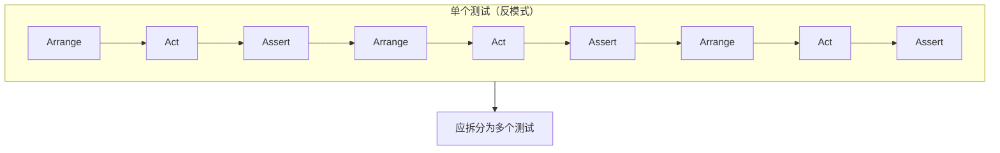
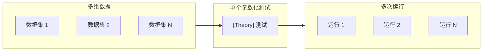

# 第3章：单元测试的解剖

> **本章内容**
>
> - 如何组织单元测试
> - 探索 xUnit 测试框架
> - 在测试之间复用测试夹具
> - 单元测试的命名
> - 重构为参数化测试
> - 使用断言库提升测试可读性

本章介绍单元测试的**解剖结构**——构成良好测试的基本要素。你将学习如何组织测试代码、如何命名测试、如何复用测试夹具，以及如何利用现代测试框架的特性来提升可读性和可维护性。

---

## 3.1 如何组织单元测试

### 3.1.1 使用 AAA 模式

::: tip 定义
**AAA 模式**（Arrange-Act-Assert）是组织单元测试的经典模式，将测试分为三个清晰的阶段：
- **Arrange（准备）**：将被测系统及其依赖置于期望状态
- **Act（执行）**：调用被测系统上的方法
- **Assert（断言）**：验证结果

:::

这种结构使测试易于阅读：你一眼就能看出测试在做什么、执行了什么操作、以及期望什么结果。

**清单 3.1** 使用 AAA 模式的 Calculator 测试

```csharp
public class CalculatorTests
{
    [Fact]
    public void Sum_of_two_numbers()
    {
        // Arrange - 准备：创建计算器并准备输入
        double first = 10;
        double second = 20;
        var calculator = new Calculator();

        // Act - 执行：调用 Sum 方法
        double result = calculator.Sum(first, second);

        // Assert - 断言：验证结果
        Assert.Equal(30, result);
    }
}
```

::: tip Given-When-Then 模式
AAA 模式与 **Given-When-Then**（BDD 风格）一一对应：Given = Arrange，When = Act，Then = Assert。Given-When-Then 对非程序员来说更易读，但本质相同。

:::

---

### 3.1.2 避免多个 Arrange、Act、Assert 段落

如果一个测试包含多个 Arrange-Act-Assert 段落，说明它在验证**多个行为**——这就不再是单元测试了。



*图 3.1* 多个 AAA 段落暗示测试验证了过多内容

::: warning 反模式
每个测试应只验证**一个行为单元**。若测试中有多个 Act 段落，应将每个 Act 提取到各自的测试中。

:::

**例外**：对于执行缓慢的集成测试，有时可以接受多个 Act 段落，以减少测试套件的总运行时间。但单元测试中应避免这种做法。

---

### 3.1.3 避免在测试中使用 if 语句

测试中的 `if` 语句是**反模式**。它表明测试在验证多个场景，应拆分为多个独立测试。

```csharp
// 反模式：测试中的 if 语句
[Fact]
public void Some_test()
{
    var result = sut.DoSomething();
    if (result == ResultType.A)
    {
        Assert.True(condition1);
    }
    else
    {
        Assert.True(condition2);
    }
}
```

**正确做法**：为每个分支编写单独的测试。

---

### 3.1.4 每个段落应该多大？

- **Arrange**：通常是最大的段落。准备 SUT 和依赖可能需要多行代码。
- **Act**：理想情况下只有**一行**。若 Act 超过一行，往往说明存在**封装问题**——被测类可能要求客户端执行本应由类内部完成的操作。

**清单 3.2** 单行 Act（良好）——Purchase 封装了库存更新

```csharp
[Fact]
public void Purchase_succeeds_when_enough_inventory()
{
    Store store = CreateStoreWithInventory(Product.Shampoo, 10);
    Customer sut = CreateCustomer();

    bool success = sut.Purchase(store, Product.Shampoo, 5);  // 单行 Act

    Assert.True(success);
    Assert.Equal(5, store.GetInventory(Product.Shampoo));
}
```

**清单 3.3** 多行 Act（不良）——客户端必须单独调用 RemoveInventory

```csharp
[Fact]
public void Purchase_succeeds_when_enough_inventory()
{
    Store store = CreateStoreWithInventory(Product.Shampoo, 10);
    Customer sut = CreateCustomer();

    bool success = sut.Purchase(store, Product.Shampoo, 5);  // 第一行
    store.RemoveInventory(Product.Shampoo, 5);               // 第二行——封装问题！

    Assert.True(success);
}
```

若 `Purchase` 成功但客户端必须手动调用 `RemoveInventory`，则违反了**不变量**：购买成功后库存应自动减少。这种设计将实现细节泄露给客户端，破坏了封装。

---

### 3.1.5 Assert 段落应包含多少断言？

一个行为单元可以产生**多个可观察结果**。因此，一个测试中有多个断言是**可以接受的**，只要它们都验证同一行为的不同方面。

::: info 何时警惕
若 Assert 段落变得很大，可能是**缺少抽象**的信号。考虑引入自定义断言或提取验证逻辑到私有方法。

:::

---

### 3.1.6 关于 teardown 阶段

**Teardown**（清理）阶段用于在测试结束后释放资源。对于**单元测试**，通常**不需要** teardown，因为单元测试不依赖进程外资源（如数据库、文件系统）。

Teardown 主要用于**集成测试**，用于关闭数据库连接、删除临时文件等。

---

### 3.1.7 区分被测系统

在测试中，将 SUT 命名为 `sut` 可以清晰区分被测系统与依赖：

```csharp
[Fact]
public void Sum_of_two_numbers()
{
    double first = 10;
    double second = 20;
    var sut = new Calculator();           // SUT 命名为 sut

    double result = sut.Sum(first, second);

    Assert.Equal(30, result);
}
```

这种命名约定让读者立即识别出哪个对象是测试的入口点。

---

### 3.1.8 是否保留 Arrange、Act、Assert 注释？

对于**简单测试**，用空行分隔三个段落通常就足够了，无需显式注释。对于**复杂测试**，保留注释有助于导航。

```csharp
// 简单测试：空行分隔即可
[Fact]
public void Sum_of_two_numbers()
{
    double first = 10;
    double second = 20;
    var sut = new Calculator();

    double result = sut.Sum(first, second);

    Assert.Equal(30, result);
}
```

---

## 3.2 探索 xUnit 测试框架

本书使用 **xUnit** 作为测试框架。与 NUnit 或 MSTest 相比，xUnit 的设计更简洁：

| 特性 | xUnit | NUnit / MSTest |
|------|-------|----------------|
| 测试方法标记 | `[Fact]` | `[Test]` |
| 设计理念 | 测试是"事实"——对行为的陈述 | 测试是"案例" |
| 初始化 | 构造函数 | `[SetUp]` 方法 |
| 清理 | `IDisposable` | `[TearDown]` 方法 |

::: tip 为什么选择 xUnit
`[Fact]` 属性强调测试是对行为的**事实陈述**，而非随机验证。xUnit 用构造函数替代 `[SetUp]`，用 `IDisposable.Dispose()` 替代 `[TearDown]`，使生命周期更显式。

:::

---

## 3.3 在测试之间复用测试夹具

**测试夹具**（test fixture）是测试所需的共享设置——SUT、依赖、测试数据等。复用夹具可以减少重复代码，但必须谨慎，否则会引入问题。

### 3.3.1 测试间高耦合是反模式

**错误做法**：在构造函数中初始化共享状态。

```csharp
// 反模式：构造函数中的共享夹具
public class CustomerTests
{
    private readonly Store _store;
    private readonly Customer _sut;

    public CustomerTests()
    {
        _store = new Store();
        _store.AddInventory(Product.Shampoo, 10);
        _sut = new Customer();
    }

    [Fact]
    public void Purchase_succeeds_when_enough_inventory()
    {
        bool success = _sut.Purchase(_store, Product.Shampoo, 5);
        Assert.True(success);
        Assert.Equal(5, _store.GetInventory(Product.Shampoo));
    }

    [Fact]
    public void Purchase_fails_when_not_enough_inventory()
    {
        bool success = _sut.Purchase(_store, Product.Shampoo, 15);
        Assert.False(success);
        Assert.Equal(10, _store.GetInventory(Product.Shampoo));
    }
}
```

::: warning 高耦合问题
修改共享的 Arrange 会影响**所有**测试。若某个测试需要不同的初始状态，你必须添加条件逻辑或破坏其他测试。测试之间形成隐式依赖，难以理解和维护。

:::

---

### 3.3.2 在测试中使用构造函数会降低可读性

从单个测试中无法看清完整图景。读者必须跳转到构造函数才能理解 `_store` 和 `_sut` 是如何配置的。测试应**自包含**——阅读测试本身就能理解它在验证什么。

---

### 3.3.3 更好的复用测试夹具的方式

**正确做法**：使用**私有工厂方法**。每个测试显式调用工厂方法，夹具的创建逻辑集中在一处，但每个测试的上下文清晰可见。

**清单 3.4** 使用私有工厂方法复用夹具

```csharp
public class CustomerTests
{
    [Fact]
    public void Purchase_succeeds_when_enough_inventory()
    {
        Store store = CreateStoreWithInventory(Product.Shampoo, 10);
        Customer sut = CreateCustomer();

        bool success = sut.Purchase(store, Product.Shampoo, 5);

        Assert.True(success);
        Assert.Equal(5, store.GetInventory(Product.Shampoo));
    }

    [Fact]
    public void Purchase_fails_when_not_enough_inventory()
    {
        Store store = CreateStoreWithInventory(Product.Shampoo, 10);
        Customer sut = CreateCustomer();

        bool success = sut.Purchase(store, Product.Shampoo, 15);

        Assert.False(success);
        Assert.Equal(10, store.GetInventory(Product.Shampoo));
    }

    private Store CreateStoreWithInventory(Product product, int quantity)
    {
        Store store = new Store();
        store.AddInventory(product, quantity);
        return store;
    }

    private static Customer CreateCustomer()
    {
        return new Customer();
    }
}
```

::: tip 优势
- 每个测试**自包含**：Arrange 段落清晰展示测试的初始状态
- **低耦合**：修改 `CreateStoreWithInventory` 不影响测试的独立性
- **可读性高**：一眼看出 `store` 有 10 件 Shampoo，`sut` 是 `Customer`

:::

**例外**：在**集成测试**中，若需要共享昂贵的资源（如数据库连接），可以使用基类来管理生命周期。对于单元测试，优先使用私有工厂方法。

---

## 3.4 单元测试的命名

### 3.4.1 单元测试命名指南

不要遵循僵化的命名策略，如 `[MethodUnderTest]_[Scenario]_[ExpectedResult]`。测试名称应**描述行为**，而非实现，并且应让非程序员也能理解。

::: tip 命名指南
1. **不要采用僵化的命名策略**——格式化的名称往往难以阅读
2. **用描述场景的方式命名**——仿佛在向非程序员解释测试在验证什么
3. **用下划线分隔单词**——提升可读性
4. **不要包含被测试的方法名**——名称应描述行为，而非实现

:::

**良好示例**：

- `Delivery_with_a_past_date_is_invalid`
- `Purchase_succeeds_when_enough_inventory`
- `Sum_of_two_numbers`

**不良示例**：

- `IsDeliveryValid_InvalidDate_ReturnsFalse`（过于机械化）
- `Test1`（无意义）

---

### 3.4.2 示例：按指南重命名测试

**原始名称**：`IsDeliveryValid_InvalidDate_ReturnsFalse`

**步骤 1**：改为描述性名称 → `Delivery_with_invalid_date_should_be_considered_invalid`

**步骤 2**：去掉 "should be"（冗余）→ `Delivery_with_a_past_date_is_invalid` ✅

最终名称简洁、描述行为，且易于理解。

---

## 3.5 重构为参数化测试

当多个测试仅输入和期望输出不同时，可以使用**参数化测试**合并为一个测试，减少重复代码。

**清单 3.5 使用 [Theory] 和 [InlineData] 的参数化测试**

```csharp
[Theory]
[InlineData(-1, false)]
[InlineData(0, false)]
[InlineData(1, false)]
[InlineData(2, true)]
public void Can_detect_an_invalid_delivery_date(int daysFromNow, bool expected)
{
    DeliveryService sut = new DeliveryService();
    DateTime deliveryDate = DateTime.Now.AddDays(daysFromNow);
    Delivery delivery = new Delivery { Date = deliveryDate };

    bool isValid = sut.IsDeliveryValid(delivery);

    Assert.Equal(expected, isValid);
}
```

在 xUnit 中，`[Theory]` 表示参数化测试，`[InlineData]` 提供每组参数。测试会为每组数据运行一次。



*图 3.2* 参数化测试示意图

---

### 3.5.1 为参数化测试生成数据

对于简单的参数，`[InlineData]` 足够。对于**复杂测试数据**，可以使用 `[MemberData]` 属性，从属性或方法提供数据：

```csharp
[Theory]
[MemberData(nameof(GetDeliveryDates))]
public void Can_detect_an_invalid_delivery_date(DateTime deliveryDate, bool expected)
{
    DeliveryService sut = new DeliveryService();
    Delivery delivery = new Delivery { Date = deliveryDate };

    bool isValid = sut.IsDeliveryValid(delivery);

    Assert.Equal(expected, isValid);
}

public static IEnumerable<object[]> GetDeliveryDates()
{
    yield return new object[] { DateTime.Now.AddDays(-1), false };
    yield return new object[] { DateTime.Now.AddDays(0), false };
    yield return new object[] { DateTime.Now.AddDays(1), false };
    yield return new object[] { DateTime.Now.AddDays(2), true };
}
```

::: info 何时保持独立测试
当正面场景与负面场景的行为差异很大时，部分参数化测试应保留为独立测试。**不要为了简洁而牺牲可读性**。

:::

---

## 3.6 使用断言库进一步提升测试可读性

**Fluent Assertions** 等断言库可以提供更流畅、更易读的断言语法。

**标准断言**：

```csharp
Assert.Equal(DateTime.Now.AddDays(9), sut.DeliveryDate);
```

**Fluent 断言**：

```csharp
sut.DeliveryDate.Should().BeCloseTo(DateTime.Now.AddDays(9), TimeSpan.FromSeconds(1));
```

对于复杂对象的比较，Fluent 断言尤其有用：

```csharp
// 标准断言：逐字段比较繁琐
Assert.Equal(expected.Name, sut.Name);
Assert.Equal(expected.Date, sut.Date);
// ...

// Fluent 断言：深度比较
sut.Should().BeEquivalentTo(expected);
```

::: tip 何时使用
若项目已有 Fluent Assertions 或类似库，可以优先使用以提升可读性。若团队偏好标准断言，保持一致性同样重要。

:::

---

## 本章小结

- **AAA 模式**：Arrange（准备）→ Act（执行）→ Assert（断言）。与 Given-When-Then 一一对应。
- **避免**多个 AAA 段落、测试中的 `if` 语句。
- **Act 应为一到两行**；多行 Act 往往暗示封装问题。
- **SUT 命名**：使用 `sut` 区分被测系统与依赖。
- **测试夹具复用**：使用私有工厂方法，而非构造函数中的共享状态。
- **测试命名**：描述行为，面向非程序员，用下划线分隔单词，不包含方法名。
- **参数化测试**：用 `[Theory]` 和 `[InlineData]` 减少重复，但不要牺牲可读性。
- **Fluent 断言**：可提升复杂断言的可读性。

---

[← 上一章：什么是单元测试？](ch02-what-is-unit-test.md) | [返回目录](../index.md) | [下一章：好单元测试的四大支柱 →](../part2/ch04-four-pillars.md)
