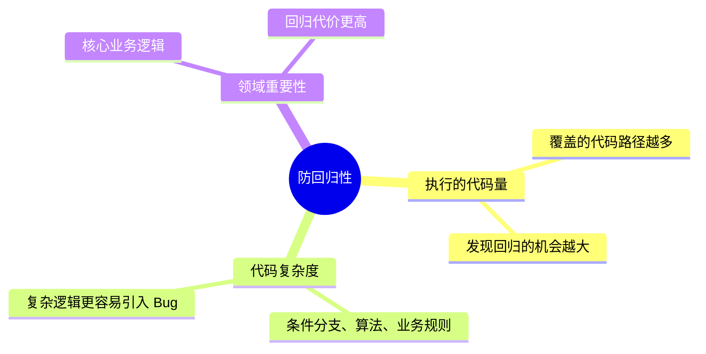
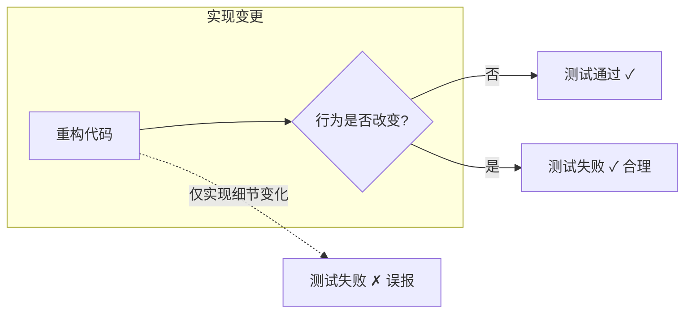
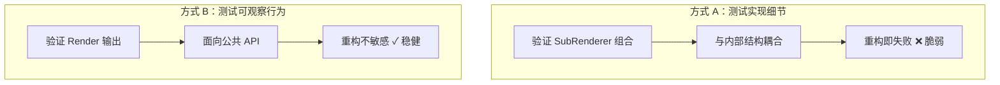
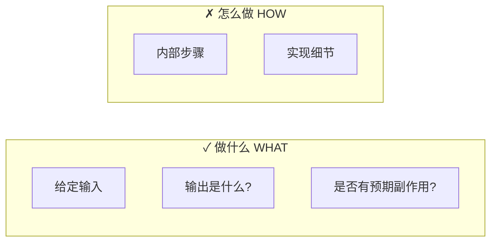
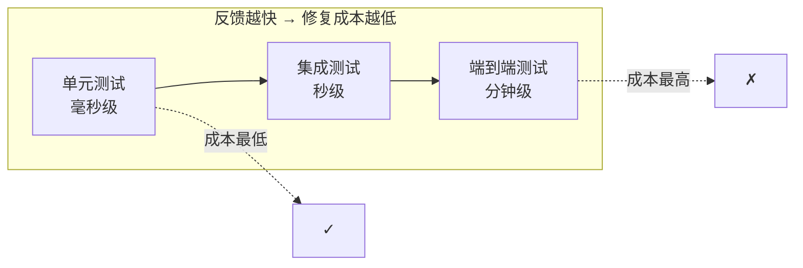
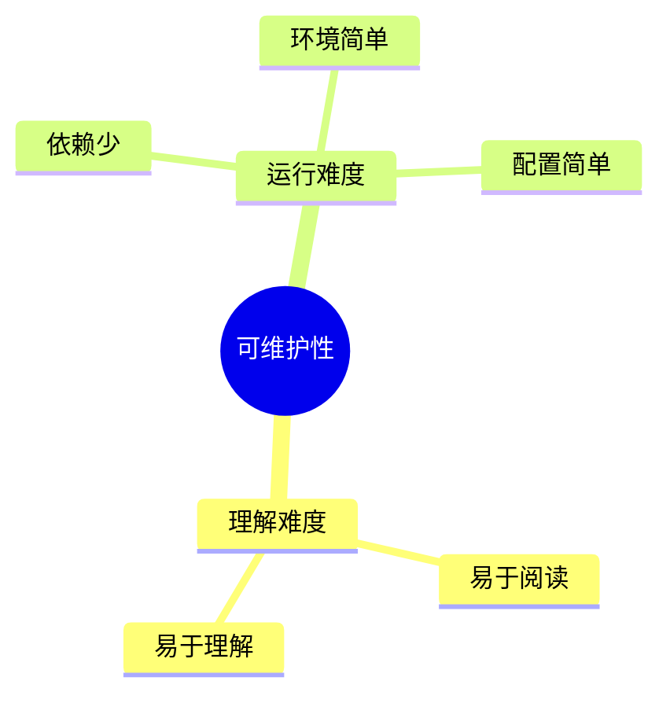
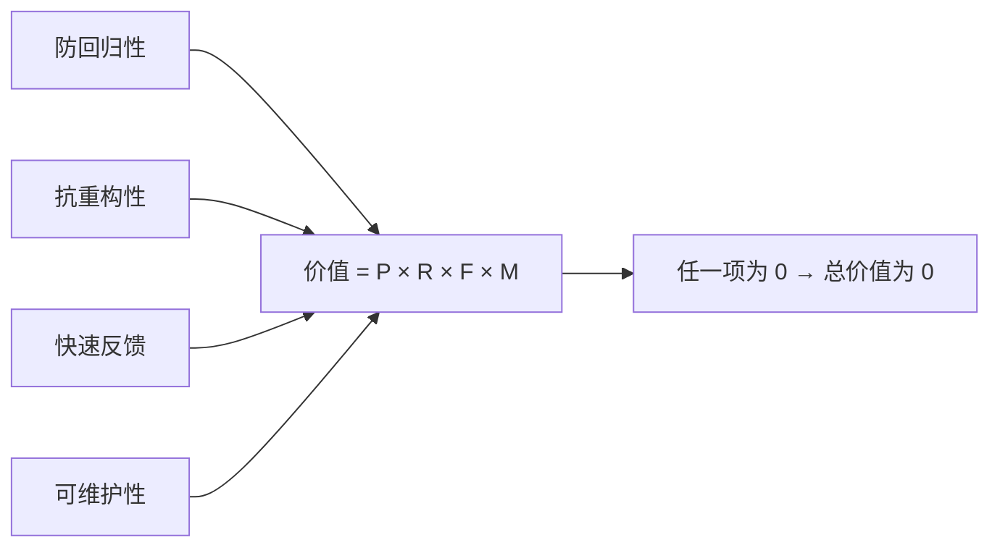
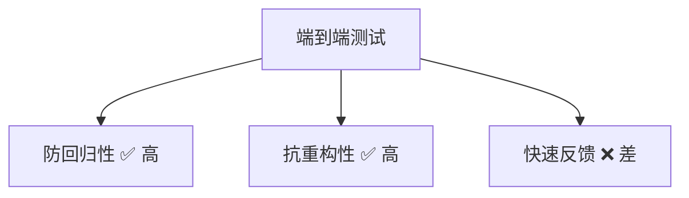
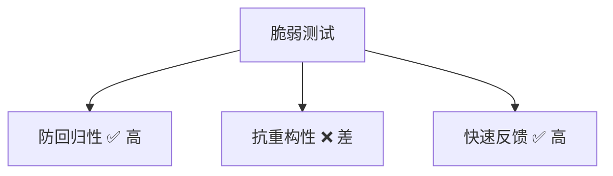

# 第4章：好单元测试的四大支柱

> **本章内容**
>
> - 使用黑盒与白盒测试
> - 理解测试金字塔
> - 定义理想测试
> - 探索好单元测试各属性之间的张力

现在我们触及核心。在第 1 章中，你看到了一个好单元测试套件的属性：它以最低维护成本提供最大价值。要实现这一属性，你需要能够：

- **编写**有价值的测试
- **识别**有价值的测试（进而识别低价值测试）

如第 1 章所述，识别有价值的测试与编写有价值的测试是两种不同的技能。后者需要前者作为基础。因此，本章将展示如何**识别**有价值的测试。你将看到一个通用参考框架，可以用来分析套件中的任何测试。然后，我们将用这个框架来审视一些流行的单元测试概念：测试金字塔，以及黑盒与白盒测试。

系好安全带，我们开始。

---

## 4.1 深入好单元测试的四大支柱

### 4.1.1 第一支柱：防回归性

**防回归性**（Protection against regressions）衡量测试在多大程度上能捕获 Bug。一个测试的防回归能力取决于三个因素：

1. **执行的代码量**：测试覆盖的代码路径越多，发现回归的机会越大
2. **代码复杂度**：复杂逻辑（条件分支、算法、业务规则）更容易引入 Bug
3. **领域重要性**：核心业务逻辑的回归比边缘代码的回归代价更高



*图 4.1* 防回归性的三个维度

::: info 简单代码的回归概率
简单代码（trivial code）的回归概率接近零。对这类代码编写测试的投入产出比极低，通常不值得测试。

:::

---

### 4.1.2 第二支柱：抗重构性

**抗重构性**（Resistance to refactoring）衡量测试在实现变更时是否仍能通过——只要最终行为未变。换句话说：测试是否只对**可观察行为**敏感，而对**实现细节**不敏感？

::: tip 定义
**误报**（False Positive）是指功能正确、但测试失败的情况。当测试与实现细节耦合时，任何重构都可能触发误报。

:::



*图 4.2* 抗重构性：测试应只对行为变化敏感

::: warning 最重要的支柱
抗重构性是四大支柱中**最关键的**。它是**不可妥协的**、**二元的**——要么测试可观察行为，要么测试实现细节。没有中间地带。

:::

---

### 4.1.3 误报的成因是什么？

误报的主要成因是**与实现细节的耦合**。测试越依赖 SUT 的内部实现，误报就越多。

考虑 `MessageRenderer` 的例子。该类通过组合多个 `SubRenderer` 来渲染消息。有两种测试方式：

**方式 A：测试 SubRenderer 的组合方式**（与实现耦合）

```csharp
// 测试验证 MessageRenderer 内部如何组合 SubRenderer
[Fact]
public void Renders_message_using_header_body_footer_renderers()
{
    var headerRenderer = new Mock<IHeaderRenderer>();
    var bodyRenderer = new Mock<IBodyRenderer>();
    var footerRenderer = new Mock<IFooterRenderer>();
    var sut = new MessageRenderer(headerRenderer.Object, bodyRenderer.Object, footerRenderer.Object);

    sut.Render("message");

    headerRenderer.Verify(x => x.Render(It.IsAny<string>()), Times.Once);
    bodyRenderer.Verify(x => x.Render(It.IsAny<string>()), Times.Once);
    footerRenderer.Verify(x => x.Render(It.IsAny<string>()), Times.Once);
}
```

**方式 B：测试 Render 的输出**（面向可观察行为）

```csharp
// 测试验证 MessageRenderer 的最终输出
[Fact]
public void Renders_message_with_header_body_and_footer()
{
    var sut = new MessageRenderer();

    string result = sut.Render("Hello");

    Assert.Contains("<header>", result);
    Assert.Contains("Hello", result);
    Assert.Contains("<footer>", result);
}
```



*图 4.3* 测试实现细节 vs 测试可观察行为

方式 A 与 `MessageRenderer` 的内部结构紧密耦合。如果你将三个 SubRenderer 合并为一个，或改变调用顺序，测试会失败——尽管最终输出可能完全正确。方式 B 只关心客户端可见的结果，对内部重构不敏感。

::: tip 核心原则
测试与 SUT 实现的耦合程度越高，误报就越多。**始终面向可观察行为，而非实现细节。**

:::

---

### 4.1.4 面向最终结果，而非实现细节

测试应验证**"做什么"**（what），而非**"怎么做"**（how）。客户端关心的只有：给定输入，输出是什么？是否有预期的副作用？



*图 4.4* 测试"做什么"而非"怎么做"

---

## 4.2 前两个属性之间的内在联系

### 4.2.1 最大化测试准确度

测试可能犯两类错误：

| 错误类型 | 名称 | 含义 |
|---------|------|------|
| **I 类错误** | 误报（False Positive） | 功能正确，测试失败 |
| **II 类错误** | 漏报（False Negative） | 功能有 Bug，测试通过 |

```text
               测试通过        测试失败
            +-----------+-----------+
  代码正确  |   正确    |  误报 FP  |
            +-----------+-----------+
  代码有Bug |  漏报 FN  |   正确    |
            +-----------+-----------+
```

*图 4.5* 测试的两种错误类型

测试准确度可以理解为：

$$
\text{测试准确度} = \frac{\text{信号}}{\text{噪声}}
$$

- **信号**：测试失败时，确实表示有 Bug
- **噪声**：测试失败时，实际没有 Bug（误报）

高准确度意味着：测试失败时，你有理由相信代码真的出了问题。

---

### 4.2.2 误报与漏报的重要性：动态变化

两类错误的重要性会随项目生命周期**动态变化**：

- **项目早期**：漏报更糟糕。你希望快速发现 Bug，此时误报相对较少
- **项目后期**：误报变得**同样糟糕**，甚至更糟。随着重构增多，误报会侵蚀对测试套件的信任，导致开发者忽视失败或删除"烦人"的测试

```text
重要性
  ^
  |    漏报（始终重要）
  |    _______________
  |
  |        误报（随项目寿命递增）
  |       /
  |      /
  |     /
  |____/________________> 项目生命周期
      早期    后期
```

*图 4.6* 误报与漏报重要性随项目生命周期的变化

::: tip 关键洞察
误报的重要性会随项目寿命**递增**。抗重构性不是"锦上添花"，而是长期可维护测试套件的**必要条件**。

:::

---

## 4.3 第三与第四支柱：快速反馈与可维护性

### 4.3.1 第三支柱：快速反馈

**快速反馈**（Fast feedback）指测试执行的速度。反馈循环越短，发现并修复 Bug 的成本越低。

- 单元测试：毫秒级
- 集成测试：秒级
- 端到端测试：分钟级



*图 4.7* 反馈速度与修复成本

---

### 4.3.2 第四支柱：可维护性

**可维护性**（Maintainability）包含两方面：

1. **理解难度**：测试是否易于阅读和理解？
2. **运行难度**：测试是否易于运行？（依赖、环境、配置等）



*图 4.8* 可维护性的两个维度

---

## 4.4 追寻理想测试

测试价值可用公式表示：

$$
\text{Value} = \text{Protection} \times \text{Resistance} \times \text{Feedback} \times \text{Maintainability}
$$

其中每项取值于 $[0, 1]$。任何一项为零，则整体价值为零。



*图 4.9* 测试价值公式

### 4.4.1 能否创建理想测试？

**不能。** 前三个属性（防回归性、抗重构性、快速反馈）之间存在**内在张力**，无法同时最大化。

### 4.4.2 极端情况 #1：端到端测试

| 属性 | 表现 |
|------|------|
| 防回归性 | ✅ 高（覆盖完整系统） |
| 抗重构性 | ✅ 高（验证可观察行为） |
| 快速反馈 | ❌ 差（运行慢） |



*图 4.10* 端到端测试的权衡

### 4.4.3 极端情况 #2：简单测试

| 属性 | 表现 |
|------|------|
| 防回归性 | ❌ 差（覆盖简单逻辑，回归概率低） |
| 抗重构性 | ✅ 高 |
| 快速反馈 | ✅ 高 |

### 4.4.4 极端情况 #3：脆弱测试

| 属性 | 表现 |
|------|------|
| 防回归性 | ✅ 高 |
| 抗重构性 | ❌ 差（与实现耦合，误报多） |
| 快速反馈 | ✅ 高 |



*图 4.11* 脆弱测试：高防回归性但低抗重构性

### 4.4.5 追寻理想测试：结论

::: warning 抗重构性不可妥协
**抗重构性必须优先最大化。** 它是不可妥协的。没有抗重构性，测试套件会随着时间推移变得不可信、不可维护。

:::

在满足抗重构性的前提下，你需要在**防回归性**与**快速反馈**之间做权衡：

- 单元测试：快速反馈，中等防回归性
- 集成测试：中等反馈速度，较高防回归性
- 端到端测试：慢反馈，最高防回归性

::: tip CAP 定理类比
类似于分布式系统中的 CAP 定理，你无法同时最大化防回归性、抗重构性和快速反馈。**抗重构性是硬性约束**，防回归性与快速反馈之间需要权衡。

:::

---

## 4.5 探索知名测试自动化概念

### 4.5.1 拆解测试金字塔

测试金字塔将测试分为三层：

- **底层**：大量单元测试（快速、隔离）
- **中层**：适量集成测试（验证组件协作）
- **顶层**：少量端到端测试（验证完整用户场景）

```text
              /\
             /  \     少量 E2E 测试
            /    \    （端到端，慢）
           /------\
          /        \  适量集成测试
         /          \ （组件协作）
        /------------\
       /              \ 大量单元测试
      /                \（快速、隔离）
     /__________________\
```

*图 4.12* 测试金字塔

金字塔形状反映了**反馈速度**与**防回归性**之间的权衡：底层快但覆盖窄，顶层慢但覆盖广。

---

### 4.5.2 黑盒测试与白盒测试的选择

| 类型 | 定义 | 适用场景 |
|------|------|---------|
| **黑盒测试** | 从外部测试，不依赖内部实现知识 | 验证可观察行为，**优先用于抗重构性** |
| **白盒测试** | 基于内部实现知识设计测试 | 分析代码路径、覆盖率，辅助设计用例 |

::: tip 实践建议
- **验证**时：优先黑盒——测试公共 API 和可观察行为，获得最佳抗重构性
- **分析**时：可借助白盒——了解内部结构，设计更有针对性的用例，但断言仍应面向可观察行为

:::

---

## 本章小结

- **四大支柱**：防回归性、抗重构性、快速反馈、可维护性。测试价值 = 四者之积。
- **抗重构性是最重要的支柱**：不可妥协，必须最大化。测试可观察行为，而非实现细节。
- **误报**：功能正确但测试失败。主要由与实现细节的耦合引起。误报的重要性随项目寿命递增。
- **漏报**：功能有 Bug 但测试通过。项目早期更值得关注。
- **测试准确度** = 信号 / 噪声。高准确度意味着测试失败时，代码很可能真的有问题。
- **理想测试不存在**：防回归性、抗重构性、快速反馈无法同时最大化。抗重构性是硬性约束。
- **测试金字塔**：底层多单元测试，中层适量集成测试，顶层少量端到端测试。
- **黑盒优先**：验证时用黑盒测试以最大化抗重构性；白盒可用于分析，但断言仍应面向可观察行为。

---

[← 上一章：单元测试的解剖](../part1/ch03-anatomy-of-unit-test.md) | [返回目录](../index.md) | [下一章：Mock 与测试脆弱性 →](ch05-mocks-and-fragility.md)
