# 第5章：Mock 与测试脆弱性

> **本章内容**
>
> - 区分 Mock 与 Stub
> - 可观察行为 vs 实现细节
> - Mock 与测试脆弱性的关系
> - 古典学派 vs 伦敦学派再探

Mock 是单元测试中最具争议的话题之一。有的开发者主张大量使用 mock，有的则完全避免。真相往往介于两者之间：**关键在于何时使用 mock，以及如何区分 mock 与 stub**。本章将厘清这些概念，并解释为什么不当使用 mock 会导致测试脆弱。

---

## 5.1 区分 Mock 与 Stub

### 5.1.1 测试替身的类型

Gerard Meszaros 在《xUnit Test Patterns》中定义了五种测试替身（test doubles）：

::: tip 定义
**测试替身**（Test Double）是生产依赖的简化版本，用于测试中替代真实对象。

:::

| 类型 | 英文 | 用途 |
|------|------|------|
| **Dummy** | 占位对象 | 仅用于满足参数，从不被实际使用 |
| **Stub** | 桩 | 提供**传入数据**（模拟查询结果） |
| **Spy** | 间谍 | 记录调用信息，供后续断言使用 |
| **Mock** | 模拟 | 验证**传出交互**（验证命令是否被调用） |
| **Fake** | 假对象 | 可工作的简化实现（如内存数据库） |

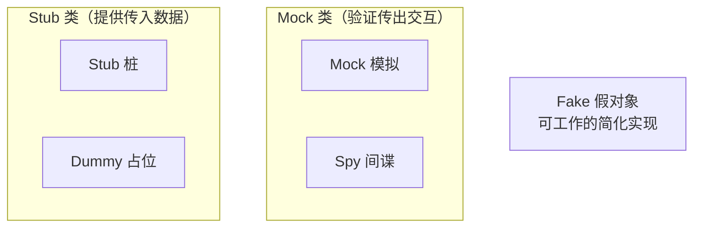

*图 5.1* 五种测试替身类型

从测试目的角度，可归纳为两大类：

- **Mock（模拟）**：验证**传出交互**（outgoing interactions）——即 SUT 向依赖发出的**命令**（commands）
- **Stub（桩）**：模拟**传入数据**（incoming data）——即依赖向 SUT 提供的**查询结果**（queries）

::: tip 记忆口诀
Mock 验证**出去**的调用（命令）；Stub 提供**进来**的数据（查询）。

:::

---

### 5.1.2 Mock（工具）vs mock（测试替身）

在 C# 中，`Mock<T>` 是 Moq 等框架提供的**工具类**，它可以创建**两种**测试替身：

1. **作为 Stub**：通过 `Setup().Returns()` 配置返回值
2. **作为 Mock**：通过 `Verify()` 验证方法是否被调用

::: info 区分在于行为，而非工具
同一个 `Mock<IStore>` 对象可以同时充当 stub 和 mock。区分标准是**你在测试中如何使用它**：若用于验证调用，则为 mock；若仅用于提供数据，则为 stub。

:::

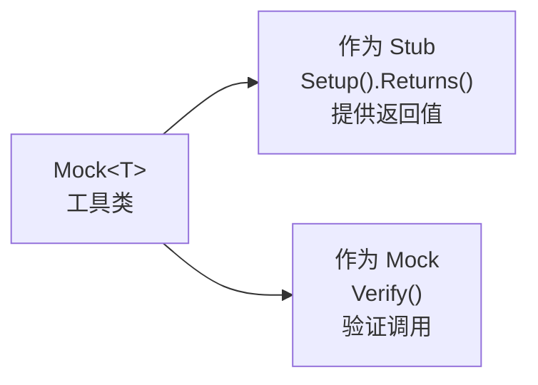

*图 5.2* Mock 工具可创建 stub 和 mock

---

### 5.1.3 不要对 Stub 断言交互

**常见错误**：对 stub 的调用进行断言。

```csharp
// 反模式：对 stub 断言交互
[Fact]
public void Purchase_succeeds_when_enough_inventory()
{
    var storeMock = new Mock<IStore>();
    storeMock.Setup(x => x.HasEnoughInventory(Product.Shampoo, 5)).Returns(true);
    var customer = new Customer();

    bool success = customer.Purchase(storeMock.Object, Product.Shampoo, 5);

    Assert.True(success);
    // 错误！HasEnoughInventory 是查询，不应断言其调用
    storeMock.Verify(x => x.HasEnoughInventory(Product.Shampoo, 5), Times.Once);
}
```

::: warning 过度规格化
对 stub 的调用进行断言 = **过度规格化** = 测试实现细节。你关心的是**购买是否成功**，而不是 `HasEnoughInventory` 被调用了多少次。后者是内部实现，重构时可能改变。

:::

这遵循 **CQS（命令查询分离）** 原则：

::: tip CQS 原则
**命令**（Command）：产生副作用，不返回值 → 用 **Mock** 验证
**查询**（Query）：返回值，无副作用 → 用 **Stub** 提供数据，**不**断言其调用

:::

---

### 5.1.4 同时使用 Mock 与 Stub

在同一个测试中，一个依赖可以同时充当 mock 和 stub。例如：

**清单 5.1** storeMock 同时作为 stub 和 mock

```csharp
[Fact]
public void Purchase_succeeds_when_enough_inventory()
{
    var storeMock = new Mock<IStore>();
    // Stub：提供 HasEnoughInventory 的返回值
    storeMock.Setup(x => x.HasEnoughInventory(Product.Shampoo, 5)).Returns(true);
    var customer = new Customer();

    bool success = customer.Purchase(storeMock.Object, Product.Shampoo, 5);

    Assert.True(success);
    // Mock：验证 RemoveInventory 被调用（命令）
    storeMock.Verify(x => x.RemoveInventory(Product.Shampoo, 5), Times.Once);
}
```

- `HasEnoughInventory`：**查询** → stub 提供数据，不断言
- `RemoveInventory`：**命令** → mock 验证调用

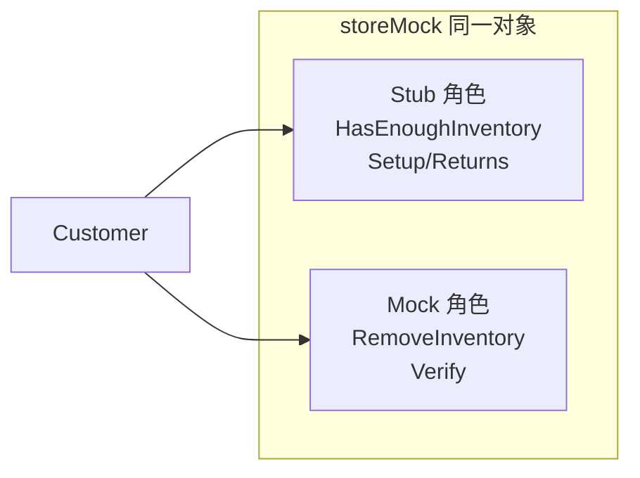

*图 5.3* 同一对象同时充当 stub 和 mock

---

### 5.1.5 Mock 与 Stub 与命令、查询的关系

| 操作类型 | 特征 | 测试替身 | 断言方式 |
|----------|------|----------|----------|
| **命令** | 有副作用，无返回值 | Mock | 验证方法是否被调用 |
| **查询** | 有返回值，无副作用 | Stub | 提供返回值，不断言调用 |

::: tip 实践指南
若方法返回 void 或你关心的是其副作用而非返回值，则它是**命令**，用 mock 验证。若方法返回值且你关心的是其输出，则它是**查询**，用 stub 提供数据。

:::

---

## 5.2 可观察行为 vs 实现细节

第 4 章指出，好单元测试应验证**可观察行为**，而非**实现细节**。本节深入探讨两者的区别。

### 5.2.1 可观察行为不等于公共 API

::: tip 定义
**可观察行为**（Observable Behavior）是帮助客户端达成目标的**操作**和**状态**。客户端通过调用这些操作、观察这些状态，来完成其业务目标。

:::

**并非所有公共方法都是可观察行为**。若公共 API 暴露了客户端不需要的内部实现，则为**泄露的实现细节**。

::: tip 设计目标
设计良好的 API：**公共 API = 可观察行为**。客户端不应看到或依赖实现细节。

:::

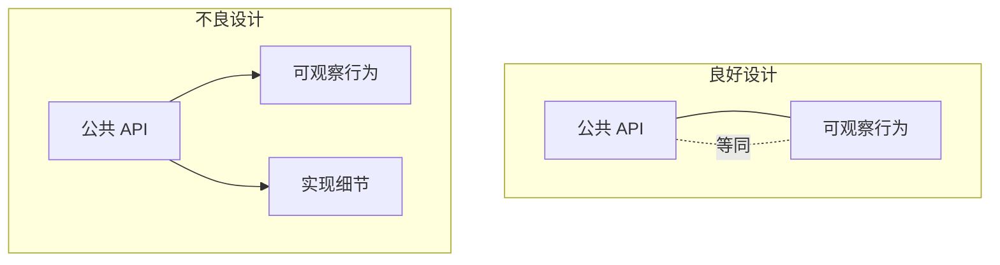

*图 5.4* 可观察行为与公共 API 的关系

---

### 5.2.2 泄露实现细节：操作示例

考虑以下 `User` 类：

```csharp
// 不良设计：NormalizeName 泄露了实现细节
public class User
{
    public string Name { get; set; }

    public void NormalizeName()
    {
        Name = Name.Trim().ToLowerInvariant();
    }
}
```

客户端要完成"保存规范化的用户名"这一目标，必须**显式调用** `NormalizeName()`。若 `NormalizeName` 是内部逻辑，客户端不应关心它——这就是**泄露的操作**。

::: tip 修复方式
将 `NormalizeName` 设为私有，在 `Save` 或构造函数内部调用。客户端只需调用 `Save()`，无需知道内部如何规范化。

:::

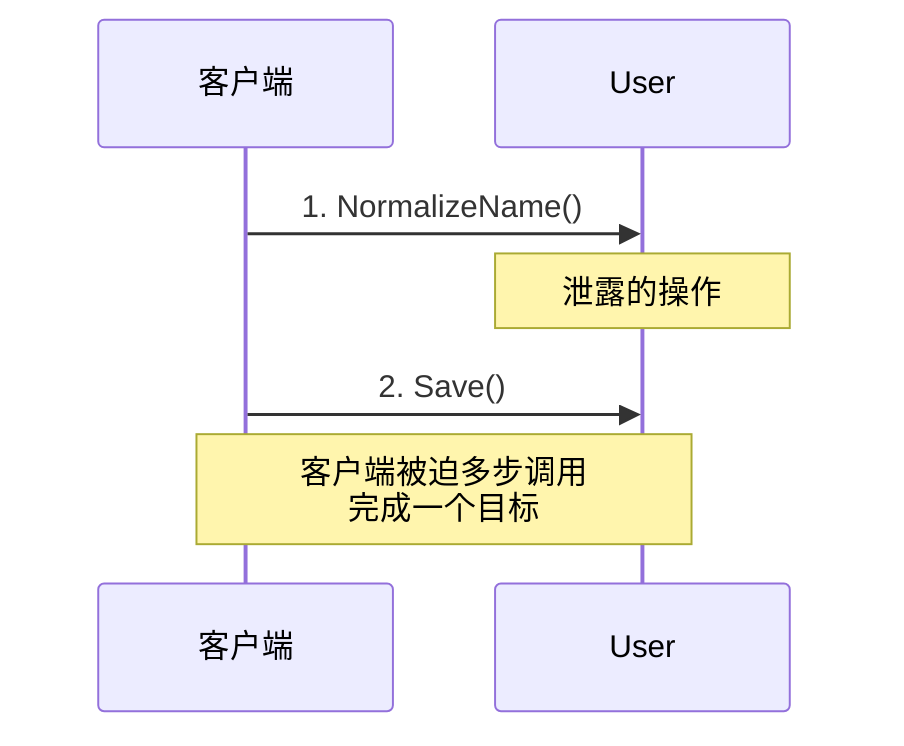

*图 5.5* 泄露的操作：客户端需要多步调用

---

### 5.2.3 设计良好的 API 与封装

::: tip 封装的定义
**封装**（Encapsulation）是保护**不变量**不被破坏。不变量是系统始终应满足的条件。

:::

**经验法则**：若客户端需要**多个操作**才能完成**一个目标**，则很可能在泄露实现细节。

::: tip Tell-Don't-Ask 原则
Martin Fowler 的 **Tell-Don't-Ask**：不要向对象询问数据再自己做决定，而应**告诉**对象去执行操作。对象应封装其行为，而非暴露内部状态供客户端决策。

:::

---

### 5.2.4 泄露实现细节：状态示例

假设 `MessageRenderer` 暴露了内部子渲染器列表：

```csharp
// 不良设计：SubRenderers 泄露了实现细节
public class MessageRenderer
{
    public IReadOnlyList<IRenderer> SubRenderers { get; }  // 泄露状态

    public string Render(Message message)
    {
        return string.Join("\n", SubRenderers.Select(r => r.Render(message)));
    }
}
```

客户端要渲染消息，只需调用 `Render()`。若测试或客户端依赖 `SubRenderers` 的类型或顺序，则是在测试**实现细节**——重构渲染逻辑时，测试会毫无必要地失败。

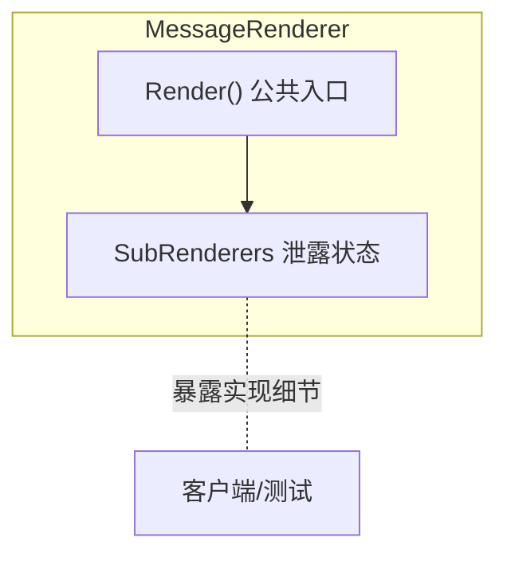

*图 5.6* 泄露的状态：SubRenderers

---

## 5.3 Mock 与测试脆弱性的关系

Mock 与测试脆弱性密切相关。本节通过**六边形架构**和**系统内/系统间通信**的区分，解释何时 mock 会导致脆弱，何时不会。

### 5.3.1 定义六边形架构

**六边形架构**（Hexagonal Architecture）将业务逻辑与**外部依赖**分离：

- **领域层**（Domain）：核心业务逻辑，不依赖外部
- **应用服务层**（Application Services）：编排用例，协调领域与外部系统
- **外部依赖**：数据库、邮件服务、第三方 API 等，通过**端口**（接口）与应用连接

关键原则：

1. **关注点分离**：业务逻辑与 I/O 分离
2. **依赖单向流动**：从外向内，领域层不依赖应用层或基础设施

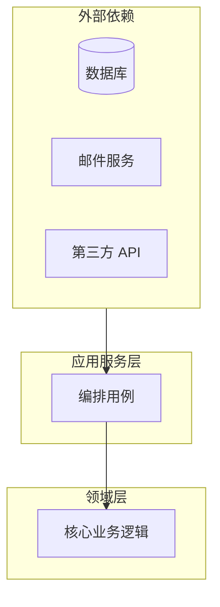

*图 5.7* 六边形架构示意

---

### 5.3.2 系统内通信 vs 系统间通信

::: tip 定义
**系统内通信**（Intra-system）：应用程序**内部**类与类之间的调用。属于**实现细节**。

:::

::: tip 定义
**系统间通信**（Inter-system）：应用程序与**外部系统**之间的调用。属于**可观察行为**。

:::

| 通信类型 | 示例 | Mock? | 原因 |
|----------|------|-------|------|
| **系统内** | Customer 调用 Store | ❌ 不 mock | 实现细节，mock 会测试实现 |
| **系统间** | 应用调用 SMTP 邮件服务 | ✅ Mock | 可观察行为，跨边界交互 |

::: warning 关键原则
对**系统内**依赖使用 mock = 测试实现细节 = 测试脆弱。对**系统间**依赖使用 mock = 验证可观察行为 = 合理。

:::

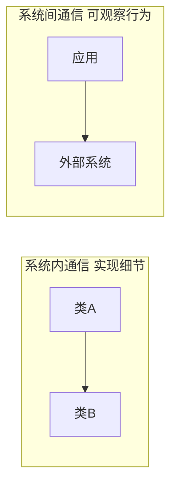

*图 5.8* 系统内 vs 系统间通信

---

### 5.3.3 系统内 vs 系统间通信：示例

**Customer.Purchase** 与 Store 的交互：

- `HasEnoughInventory`、`RemoveInventory`：Customer 与 Store 都在**同一应用**内 → **系统内通信**
- 用 `Mock<IStore>` 替换 Store，并断言 `RemoveInventory` 被调用 → 测试的是**实现细节**（Customer 如何与 Store 协作）
- 更好的做法：使用**真实 Store**，断言**状态**（库存是否减少）→ 测试**可观察行为**

**发送邮件通知**：

- 应用调用 SMTP 网关或邮件服务 → **系统间通信**
- 邮件服务在应用进程外 → 用 **Mock** 验证"是否发送了邮件"是合理的

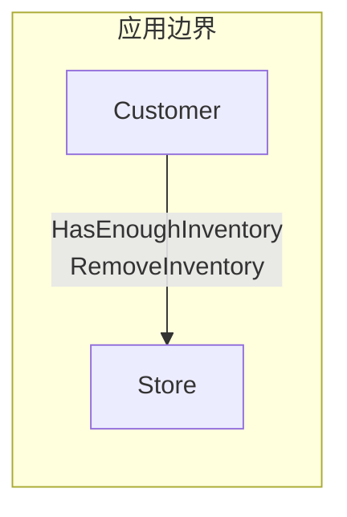

*图 5.9* Customer-Store 为系统内通信

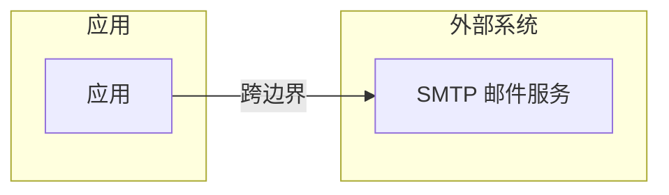

*图 5.10* 邮件服务为系统间通信

---

## 5.4 古典学派 vs 伦敦学派再探

第 2 章介绍了古典学派与伦敦学派。结合本章概念，可以更精确地判断何时使用 mock。

### 5.4.1 并非所有进程外依赖都应 mock

**进程外依赖**（Out-of-Process）可分为两类：

| 类型 | 英文 | 示例 | Mock? |
|------|------|------|-------|
| **受管理的** | Managed | 你自己的数据库 | ❌ 不 mock，用真实 DB 做集成测试 |
| **不受管理的** | Unmanaged | 第三方 API、SMTP、支付网关 | ✅ Mock |

::: tip 定义
**受管理的依赖**：你拥有或控制的进程外依赖，可部署、可配置。
**不受管理的依赖**：第三方所有，不可控，难以在测试中运行。

:::

对受管理的依赖（如自己的数据库），应使用**真实实例**进行集成测试，而非 mock。对不受管理的依赖，mock 是合理选择。

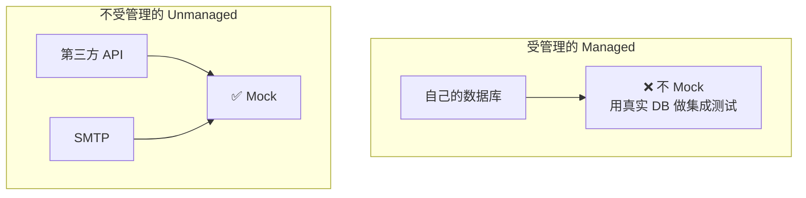

*图 5.11* 受管理 vs 不受管理的依赖

---

### 5.4.2 使用 Mock 验证行为

Mock 应**仅**用于验证**系统边界**处的行为——即与外部系统的交互。

::: tip Mock 使用边界
- ✅ 验证：应用是否调用了邮件网关的 `SendEmail`
- ✅ 验证：应用是否调用了支付 API 的 `Charge`
- ❌ 避免：验证 Customer 是否调用了 Store 的 `RemoveInventory`

:::

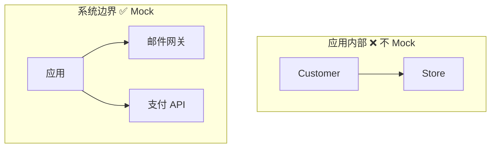

*图 5.12* 在系统边界使用 Mock

遵循"仅对不受管理的进程外依赖使用 mock"这一原则，可在大约**三分之二**的场景中正确使用 mock，从而最大化其价值并减少测试脆弱性。

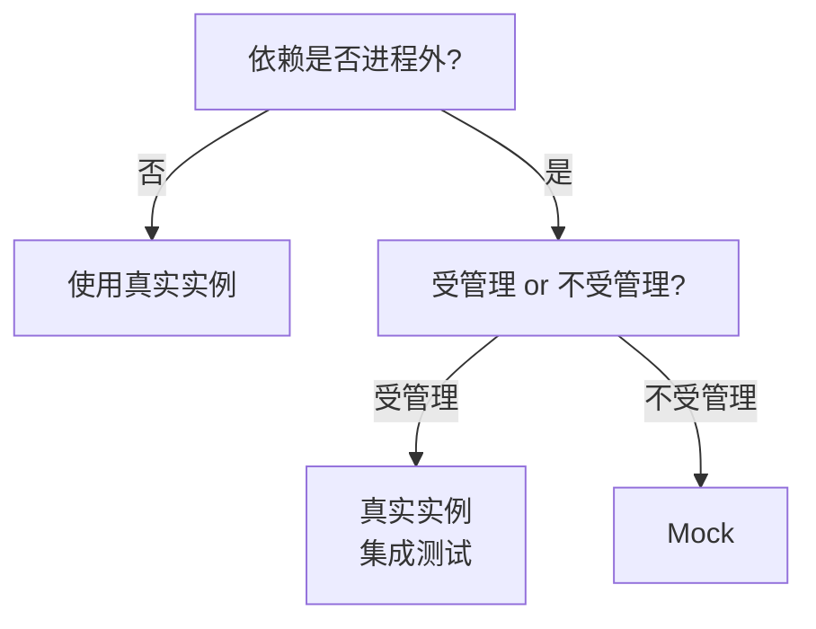

*图 5.13* Mock 决策树

---

## 本章小结

- **Mock vs Stub**：Mock 验证**传出交互**（命令）；Stub 提供**传入数据**（查询）。不要对 stub 断言调用。
- **CQS**：命令 → 用 mock 验证；查询 → 用 stub 提供数据，不断言。
- **可观察行为**：帮助客户端达成目标的操作和状态。设计良好的 API 应使公共 API = 可观察行为。
- **实现细节**：泄露的操作（如 `NormalizeName`）和泄露的状态（如 `SubRenderers`）会导致过度规格化。
- **系统内 vs 系统间**：系统内通信 = 实现细节，不 mock；系统间通信 = 可观察行为，可 mock。
- **六边形架构**：业务逻辑与 I/O 分离，依赖单向流动。
- **受管理 vs 不受管理**：受管理的进程外依赖（自己的 DB）用真实实例；不受管理的（第三方 API、SMTP）用 mock。
- **Mock 原则**：仅在**系统边界**验证与外部系统的交互；对系统内依赖使用真实对象或 stub。

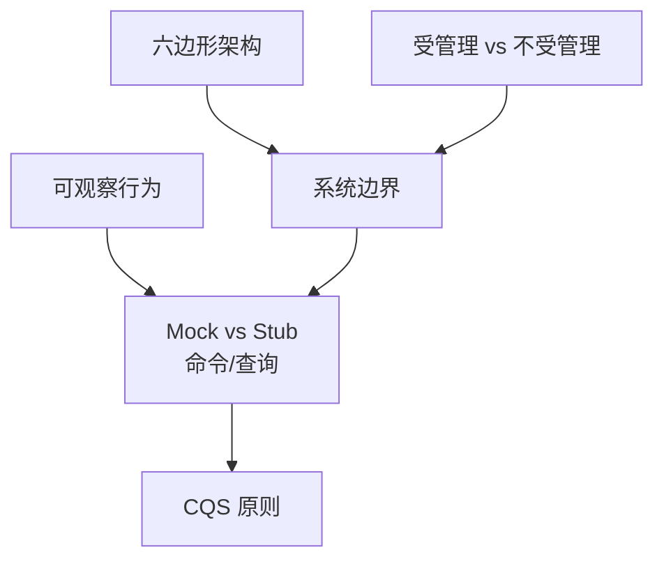

*图 5.14* 本章概念关系图

---

[← 上一章：好单元测试的四大支柱](ch04-four-pillars.md) | [返回目录](../index.md) | [下一章：单元测试的三种风格 →](ch06-styles-of-unit-testing.md)
