# 第6章：单元测试的风格

> **本章内容**
>
> - 三种单元测试风格的定义
> - 三种风格的对比：抗重构性、可维护性
> - 函数式架构：纯函数核心与可变外壳
> - 向函数式架构与输出型测试的过渡
> - 审计系统案例：从通信型到输出型测试的重构
> - 函数式架构的适用性与 drawbacks

单元测试有多种风格。不同风格在**抗重构性**和**可维护性**上差异显著。本章介绍三种主要风格——**输出型**、**状态型**和**通信型**——并说明如何通过**函数式架构**将更多测试转化为质量最高的输出型风格。

---

## 6.1 三种单元测试风格

### 6.1.1 定义输出型风格

::: tip 定义
**输出型测试**（Output-Based Testing）向被测系统（SUT）提供输入，验证其产生的输出。SUT 不产生副作用，也不改变外部状态。这种风格也被称为**函数式风格**（Functional Style）。

:::

输出型测试的验证点在于方法的**返回值**。输入和输出都是不可变的，测试与实现细节完全解耦。


*图 6.1* 输出型测试：输入 → SUT → 验证输出

**清单 6.1** 输出型测试示例：`CalculateDiscount`

```csharp
[Fact]
public void Discount_of_two_products()
{
    var product1 = new Product("Product 1", 10m);
    var product2 = new Product("Product 2", 20m);
    var sut = new PriceEngine();

    decimal discount = sut.CalculateDiscount(product1, product2);

    Assert.Equal(0.02m, discount);
}
```

::: tip 适用条件
输出型测试仅适用于**无副作用**的代码。若 SUT 会修改数据库、发送邮件或改变共享状态，则无法使用纯输出型验证。

:::

---

### 6.1.2 定义状态型风格

::: tip 定义
**状态型测试**（State-Based Testing）在操作完成后验证 SUT 或其协作者的状态。测试通过 SUT 的公共 API 检查其最终状态。

:::

状态型测试适用于领域模型中的状态变更，例如订单添加商品、用户修改邮箱等。


*图 6.2* 状态型测试：操作后验证 SUT 状态

**清单 6.2** 状态型测试示例：`Article.AddComment`

```csharp
[Fact]
public void Adding_a_comment_to_an_article()
{
    var sut = new Article("Title", "Body");
    var comment = new Comment("Great article!", "Alice");

    sut.AddComment(comment);

    Assert.Equal(1, sut.Comments.Count);
    Assert.Equal("Alice", sut.Comments[0].Author);
}
```

::: info 封装的重要性
状态型测试应**仅通过公共 API** 验证状态。若通过反射或暴露私有字段来断言，会泄露实现细节，导致测试脆化。

:::

---

### 6.1.3 定义通信型风格

::: tip 定义
**通信型测试**（Communication-Based Testing）使用 mock 验证 SUT 与其协作者之间的交互。测试关注的是**调用顺序**和**参数**是否正确。

:::

通信型测试与伦敦学派的 mock 用法密切相关，适用于验证跨系统边界的副作用（如发送邮件、发布消息）。

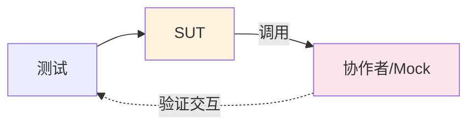

*图 6.3* 通信型测试：验证 SUT 与协作者的交互

**清单 6.3** 通信型测试示例：`EmailGateway.SendGreetingsEmail`

```csharp
[Fact]
public void Sending_a_greetings_email()
{
    var emailGatewayMock = new Mock<IEmailGateway>();
    var sut = new UserController(emailGatewayMock.Object);

    sut.GreetUser("user@email.com");

    emailGatewayMock.Verify(
        x => x.SendGreetingsEmail("user@email.com"),
        Times.Once);
}
```

::: warning 谨慎使用
通信型测试与 SUT 的**实现细节**紧密耦合。重构内部调用顺序或协作者接口时，即使行为未变，测试也可能失败，产生大量误报。

:::

---

## 6.2 三种单元测试风格的对比

### 6.2.1 防回归性与反馈速度

在**防回归性**和**快速反馈**方面，三种风格**大致相当**：

- 输出型：验证返回值，能覆盖核心逻辑
- 状态型：验证最终状态，能覆盖领域行为
- 通信型：验证交互，能覆盖跨边界调用

只要测试覆盖了有意义的业务逻辑，三者都能有效发现回归。单元测试本身执行速度快，反馈时间差异不大。

---

### 6.2.2 抗重构性

::: tip 关键差异
三种风格在**抗重构性**上差异显著。抗重构性衡量的是：在行为不变的前提下重构代码时，测试产生**误报**（false positive）的概率。

:::

| 风格 | 抗重构性 | 原因 |
|------|----------|------|
| **输出型** | 最佳 | 仅绑定于返回值；输入输出在重构中变化最少 |
| **状态型** | 中等 | 可能泄露内部状态；若通过公共 API 验证且封装良好，仍可接受 |
| **通信型** | 最差 | 与调用顺序、参数、协作者接口强耦合；内部重构易触发误报 |

**输出型**：可以完全重写 SUT 的内部实现，只要方法签名和返回值不变，测试就不会失败。

**状态型**：只要通过公共 API 验证、不破坏封装，状态型测试通常能经受住重构。但若暴露了本应私有的状态，就会增加误报风险。

**通信型**：SUT 与协作者的协作方式属于实现细节。将测试绑定于这些协作，会使测试在重构时大量失败，即使业务行为完全正确。

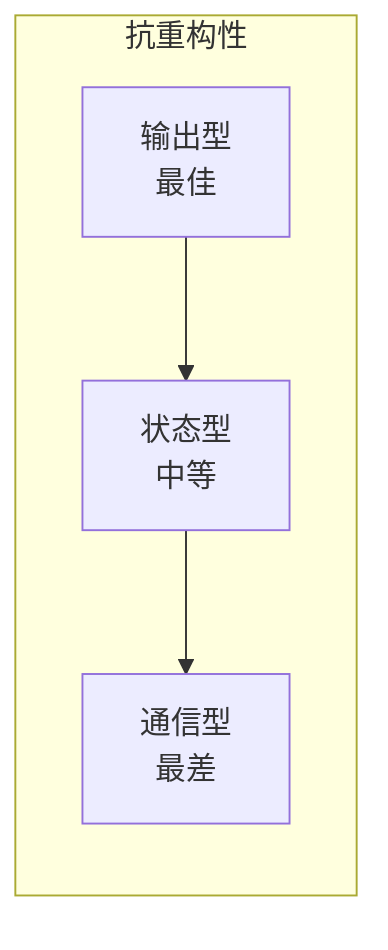

*图 6.4* 三种风格的抗重构性对比

---

### 6.2.3 可维护性

| 风格 | 可维护性 | 原因 |
|------|----------|------|
| **输出型** | 最佳 | 简洁；无需 mock 设置；断言直接 |
| **状态型** | 中等 | 断言较多；需验证多个状态字段 |
| **通信型** | 最差 | 需要 mock 设置、链式调用、验证交互；代码冗长 |

输出型测试通常只需几行：准备输入、调用方法、断言输出。状态型测试需要更多断言来覆盖状态。通信型测试需要配置 mock、设置返回值、验证调用，维护成本最高。


*图 6.5* 三种风格的可维护性对比

---

### 6.2.4 对比结果汇总

| | 输出型 | 状态型 | 通信型 |
|---|--------|--------|--------|
| **抗重构性** | 低投入 | 中等投入 | 中等投入 |
| **可维护性** | 低成本 | 中等成本 | 高成本 |
| **适用场景** | 纯函数、无副作用 | 领域状态变更 | 跨边界副作用（谨慎使用） |

::: tip 优先级建议
优先使用**输出型**，其次**状态型**，**通信型**仅在对不受管理的进程外依赖进行集成测试时使用。

:::

---

## 6.3 理解函数式架构

### 6.3.1 什么是函数式编程？

在函数式编程中，**纯函数**（pure function）具有以下特性：

1. **无隐藏输入**：所有输入都通过参数显式传入
2. **无隐藏输出**：所有输出都通过返回值显式返回
3. **引用透明**：相同输入总是产生相同输出，无副作用

::: tip 定义
**引用透明**（Referential Transparency）指表达式可以被其计算结果替换而不改变程序行为。纯函数满足引用透明。

:::

以下情况会破坏纯度：

- **副作用**：修改数据库、发送邮件、写入文件
- **异常**：抛出未捕获的异常可视为隐藏输出
- **引用外部状态**：读取全局变量、当前时间、随机数

```csharp
// 纯函数：无副作用，引用透明
public decimal CalculateDiscount(Product p1, Product p2)
{
    return (p1.Price + p2.Price) * 0.02m;
}

// 非纯函数：依赖外部 I/O
public void SaveOrder(Order order)
{
    _database.Save(order);  // 副作用
    _logger.Log("Order saved");  // 副作用
}
```

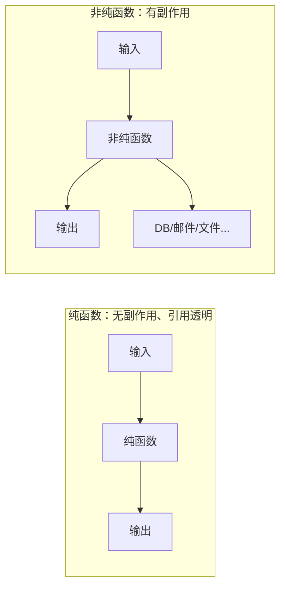

*图 6.6* 纯函数 vs 非纯函数

---

### 6.3.2 什么是函数式架构？

::: tip 定义
**函数式架构**（Functional Architecture）将**决策**（纯逻辑）与**行动**（副作用）分离。业务逻辑集中在**函数式核心**（Functional Core），I/O 和副作用集中在**可变外壳**（Mutable Shell）。

:::

```text
┌─────────────────────────────────────┐
│  Mutable Shell（可变外壳）           │
│  - 读取数据（数据库、文件、API）      │
│  - 调用函数式核心                    │
│  - 执行副作用（写入、发送、通知）     │
└─────────────────────────────────────┘
              ↓ 传入数据
┌─────────────────────────────────────┐
│  Functional Core（函数式核心）       │
│  - 纯函数，无副作用                   │
│  - 仅依赖输入，产生输出               │
│  - 可完全用输出型测试覆盖             │
└─────────────────────────────────────┘
```

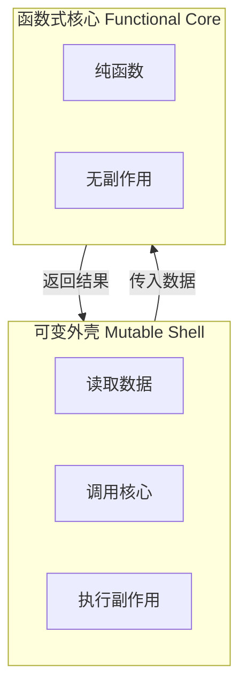

*图 6.7* 函数式架构：核心 + 外壳

**函数式核心**只做计算，不触碰数据库、文件系统或网络。**可变外壳**负责读取输入、调用核心、将结果写回外部世界。

---

### 6.3.3 函数式架构与六边形架构的对比

两者都强调**将业务逻辑与 I/O 分离**：

| 架构 | 核心思想 | 领域层特性 |
|------|----------|------------|
| **六边形架构** | 业务逻辑不直接依赖外部系统 | 通过接口与适配器交互 |
| **函数式架构** | 决策与行动分离 | 领域层**完全无副作用**，纯函数 |

::: info 区别
函数式架构更进一步：领域层不仅通过接口隔离 I/O，而且**完全不执行**任何 I/O。所有副作用都被推到外壳层。

:::

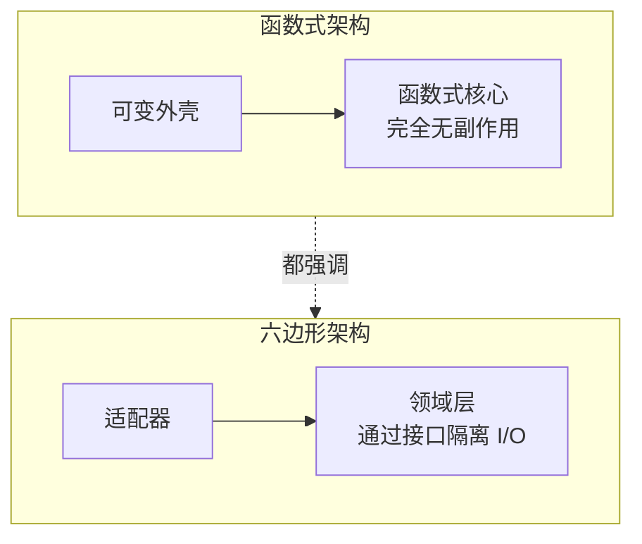

*图 6.8* 函数式架构与六边形架构

---

## 6.4 向函数式架构与输出型测试过渡

### 6.4.1 引入审计系统

假设我们要实现一个**审计系统**（Audit System）：`AuditManager` 负责读取和写入审计日志文件。每条审计记录包含时间戳和用户名，多个记录存储在同一个文件中。

**清单 6.4** 初始实现：直接使用文件系统

```csharp
public class AuditManager
{
    private readonly int _maxEntriesPerFile;
    private readonly string _directoryName;

    public AuditManager(int maxEntriesPerFile, string directoryName)
    {
        _maxEntriesPerFile = maxEntriesPerFile;
        _directoryName = directoryName;
    }

    public void AddRecord(string visitorName, DateTime visitTime)
    {
        string[] filePaths = Directory.GetFiles(_directoryName)
            .OrderBy(x => x)
            .ToArray();
        string newRecord = $"{visitTime:yyyy-MM-dd HH:mm:ss}; {visitorName}";

        if (filePaths.Length == 0)
        {
            string newFile = Path.Combine(_directoryName, "audit_1.txt");
            File.WriteAllText(newFile, newRecord);
            return;
        }

        string currentFile = filePaths[^1];
        List<string> lines = File.ReadAllLines(currentFile).ToList();

        if (lines.Count < _maxEntriesPerFile)
        {
            lines.Add(newRecord);
            File.WriteAllLines(currentFile, lines);
        }
        else
        {
            int newIndex = filePaths.Length + 1;
            string newFile = Path.Combine(_directoryName, $"audit_{newIndex}.txt");
            File.WriteAllText(newFile, newRecord);
        }
    }
}
```

::: warning 测试难点
该实现直接依赖 `Directory` 和 `File`，单元测试必须与真实文件系统交互，或使用 mock。若使用 mock，测试会变成**通信型**，验证对文件系统的调用。

:::

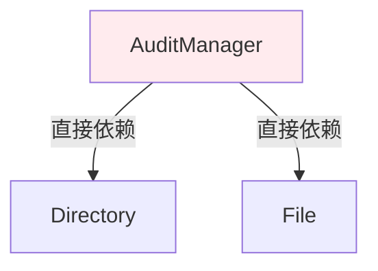

*图 6.9* 审计系统初始架构

---

### 6.4.2 使用 Mock 解耦测试与文件系统

引入 `IFileSystem` 接口，用 mock 替代真实文件系统：

**清单 6.5** 使用 `IFileSystem` 的 `AuditManager`

```csharp
public class AuditManager
{
    private readonly int _maxEntriesPerFile;
    private readonly IFileSystem _fileSystem;
    private readonly string _directoryName;

    public AuditManager(int maxEntriesPerFile, string directoryName, IFileSystem fileSystem)
    {
        _maxEntriesPerFile = maxEntriesPerFile;
        _directoryName = directoryName;
        _fileSystem = fileSystem;
    }

    public void AddRecord(string visitorName, DateTime visitTime)
    {
        string[] filePaths = _fileSystem.GetFiles(_directoryName)
            .OrderBy(x => x)
            .ToArray();
        // ... 其余逻辑使用 _fileSystem.ReadAllLines / WriteAllText 等
    }
}
```

**清单 6.6** 通信型测试：验证对 `IFileSystem` 的调用

```csharp
[Fact]
public void A_new_file_is_created_when_the_current_file_overflows()
{
    var fileSystemMock = new Mock<IFileSystem>();
    fileSystemMock
        .Setup(x => x.GetFiles("audits"))
        .Returns(new[] { "audits/audit_1.txt", "audits/audit_2.txt" });
    fileSystemMock
        .Setup(x => x.ReadAllLines("audits/audit_2.txt"))
        .Returns(new List<string> { "2024-01-01 10:00:00; User1", "2024-01-01 10:01:00; User2" });

    var sut = new AuditManager(3, "audits", fileSystemMock.Object);

    sut.AddRecord("User3", new DateTime(2024, 1, 1, 10, 2, 0));

    fileSystemMock.Verify(
        x => x.WriteAllText("audits/audit_3.txt", "2024-01-01 10:02:00; User3"),
        Times.Once);
}
```

::: info 问题
这类测试与 `AuditManager` 的内部实现紧密耦合。若我们改变文件命名方式、拆分方法或调整调用顺序，测试就会失败，即使业务行为正确。

:::

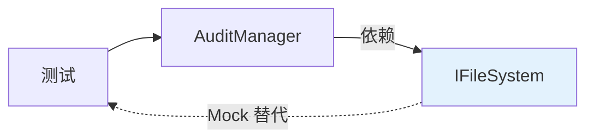

*图 6.10* 使用 Mock 的通信型测试

---

### 6.4.3 向函数式架构重构

将**决策**与**行动**分离：

1. **函数式核心**：`AuditManager` 变为纯函数，接收当前文件内容作为输入，返回**要执行的文件操作列表**（如 `FileUpdate[]`），不直接执行 I/O。
2. **可变外壳**：`Persister` 负责执行这些文件操作；`ApplicationService` 负责协调：读取现有文件、调用核心、将结果交给 `Persister`。

**清单 6.7** 函数式核心：返回 `FileUpdate[]` 的纯方法

```csharp
public class AuditManager
{
    private readonly int _maxEntriesPerFile;

    public AuditManager(int maxEntriesPerFile)
    {
        _maxEntriesPerFile = maxEntriesPerFile;
    }

    public FileUpdate[] AddRecord(
        FileContent[] existingFiles,
        string visitorName,
        DateTime visitTime)
    {
        string newRecord = $"{visitTime:yyyy-MM-dd HH:mm:ss}; {visitorName}";
        var sortedFiles = existingFiles
            .OrderBy(x => x.FileName)
            .ToList();

        if (sortedFiles.Count == 0)
        {
            return new[]
            {
                new FileUpdate("audit_1.txt", newRecord)
            };
        }

        var currentFile = sortedFiles[^1];
        var lines = currentFile.Lines.ToList();

        if (lines.Count < _maxEntriesPerFile)
        {
            lines.Add(newRecord);
            return new[]
            {
                new FileUpdate(currentFile.FileName, lines.ToArray())
            };
        }
        else
        {
            int newIndex = sortedFiles.Count + 1;
            return new[]
            {
                new FileUpdate($"audit_{newIndex}.txt", newRecord)
            };
        }
    }
}
```

**清单 6.8** 可变外壳：`ApplicationService` 与 `Persister`

```csharp
public class ApplicationService
{
    private readonly string _directoryName;
    private readonly AuditManager _auditManager;
    private readonly IPersister _persister;

    public ApplicationService(string directoryName, AuditManager auditManager, IPersister persister)
    {
        _directoryName = directoryName;
        _auditManager = auditManager;
        _persister = persister;
    }

    public void AddRecord(string visitorName, DateTime visitTime)
    {
        FileContent[] files = _persister.ReadDirectory(_directoryName);
        FileUpdate[] updates = _auditManager.AddRecord(files, visitorName, visitTime);
        _persister.ApplyUpdates(_directoryName, updates);
    }
}
```

**清单 6.9** 输出型测试：验证 `FileUpdate[]` 输出

```csharp
[Fact]
public void A_new_file_is_created_when_the_current_file_overflows()
{
    var sut = new AuditManager(3);
    var existingFiles = new[]
    {
        new FileContent("audit_1.txt", Array.Empty<string>()),
        new FileContent("audit_2.txt", new[]
        {
            "2024-01-01 10:00:00; User1",
            "2024-01-01 10:01:00; User2"
        })
    };

    FileUpdate[] result = sut.AddRecord(
        existingFiles,
        "User3",
        new DateTime(2024, 1, 1, 10, 2, 0));

    Assert.Single(result);
    Assert.Equal("audit_3.txt", result[0].FileName);
    Assert.Equal("2024-01-01 10:02:00; User3", result[0].NewContent);
}
```

::: tip 优势
- 测试变为**输出型**：仅验证 `AddRecord` 的返回值
- 无需 mock：输入是内存中的 `FileContent[]`，输出是 `FileUpdate[]`
- 抗重构性强：只要输入输出契约不变，内部实现可自由修改
- 可维护性高：测试简洁，无 mock 设置

:::

```mermaid
flowchart TB
    AS[ApplicationService]
    AM[AuditManager<br/>纯函数]
    P[Persister]
    AS -->|读取 FileContent[]| AM
    AM -->|返回 FileUpdate[]| AS
    AS -->|执行| P
    style AM fill:#e8f5e9
```

*图 6.11* 函数式架构重构后的审计系统

```mermaid
flowchart LR
    A[FileContent[]<br/>输入] --> B[AuditManager.AddRecord]
    B --> C[FileUpdate[]<br/>输出]
    C --> D[断言验证]
    style B fill:#e8f5e9
```

*图 6.12* 输出型测试验证 FileUpdate[]

---

### 6.4.4 展望后续发展

通过函数式架构，我们将难以测试的、与 I/O 耦合的代码，转化为可完全用输出型测试覆盖的纯逻辑。这种模式可推广到其他领域：将"读取 → 计算 → 写入"拆分为纯计算与 I/O 两层，是提升测试质量的有效手段。

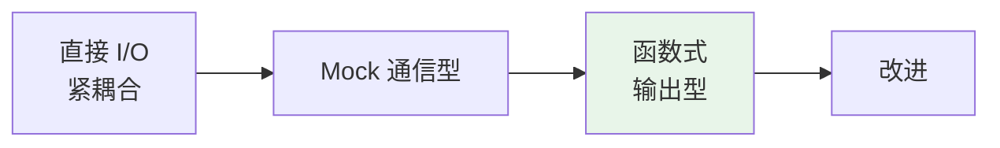

*图 6.13* 从通信型到输出型的演进

---

## 6.5 理解函数式架构的 drawbacks

### 6.5.1 函数式架构的适用性

::: tip 适用场景
函数式架构在**业务逻辑与 I/O 可清晰分离**时效果最好。例如：给定当前状态，计算下一步操作；或根据已有数据生成报告。

:::

**不适用**的情况：决策过程**中途**依赖外部数据。例如，根据第一次查询结果决定是否发起第二次查询，且无法提前读取所有可能用到的数据。此时，将"读取"与"决策"完全分离会导致性能问题或设计复杂化。

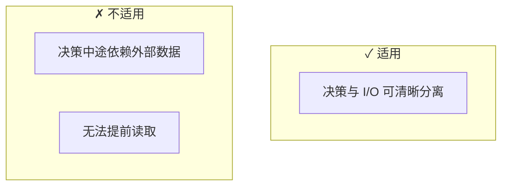

*图 6.14* 函数式架构的适用边界

---

### 6.5.2 性能 drawbacks

函数式架构要求**提前读取**所有决策所需的数据。若业务逻辑本可以"按需查询"（例如，仅当条件 A 成立时才查表 B），函数式架构可能迫使你**总是**读取 A 和 B，造成不必要的 I/O。

::: warning 权衡
在 I/O 成本可接受的场景下，优先考虑可测试性。若性能成为瓶颈，再评估是否接受部分逻辑与 I/O 的耦合，或采用分步决策（如 CanExecute/Execute）等折中方案。

:::

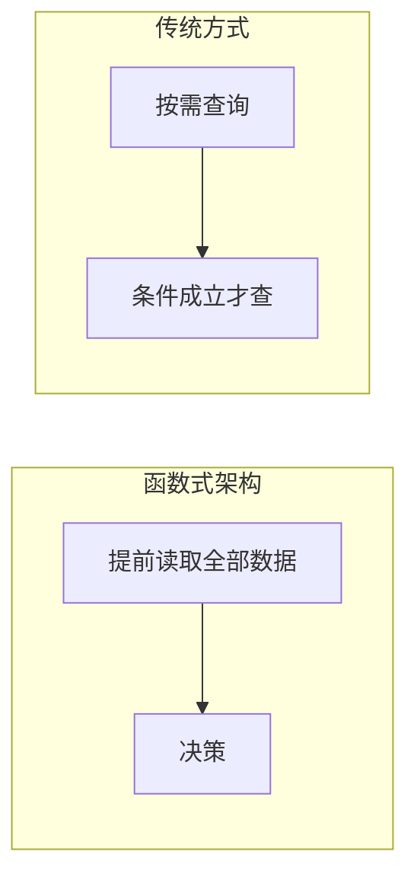

*图 6.15* 提前读取 vs 按需查询

---

### 6.5.3 代码库规模增加

引入 `FileContent`、`FileUpdate` 等**中间数据结构**会增加代码量。需要额外的类型定义、映射逻辑，以及外壳层的协调代码。这是为可测试性和清晰架构付出的成本。

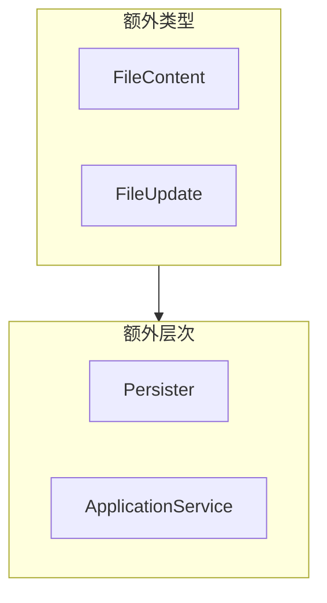

*图 6.16* 函数式架构的额外类型与层次

---

## 本章小结

- **三种单元测试风格**：输出型（最佳）、状态型（良好）、通信型（谨慎使用）。
- **输出型**：输入 → 验证输出，无副作用，抗重构性和可维护性最佳。
- **状态型**：验证操作后的状态，需通过公共 API 验证，避免泄露实现细节。
- **通信型**：用 mock 验证交互，与实现细节耦合，易产生误报。
- **函数式架构**：将决策（纯函数核心）与行动（可变外壳）分离，使更多逻辑可用输出型测试覆盖。
- **审计系统案例**：通过引入 `FileContent`/`FileUpdate` 和 `Persister`，将通信型测试转化为输出型测试。
- **函数式架构的 drawbacks**：不适用于决策中途依赖外部数据的场景；可能增加提前读取带来的性能开销；会增加代码库规模。

---

[← 上一章：Mock 与测试脆弱性](ch05-mocks-and-fragility.md) | [返回目录](../index.md) | [下一章：重构迈向高价值测试 →](ch07-refactoring-toward-valuable-tests.md)
