# 第7章：重构以获得有价值的单元测试

> **本章内容**
>
> - 识别需要重构的代码
> - 代码的四种类型与四象限
> - 使用 Humble Object 模式拆分过度复杂的代码
> - CRM 系统重构案例：从隐式依赖到薄控制器
> - 最优单元测试覆盖分析
> - 控制器中条件逻辑的三种处理方式

前几章建立了单元测试的原则：测试可观察行为、优先输出型测试、在系统边界使用 Mock。但现实中的代码往往不配合——业务逻辑与依赖交织在一起，难以隔离测试。本章展示如何**重构**现有代码，使其支持有价值的单元测试。

核心洞见：**代码不能既「深」（高复杂度）又「宽」（大量协作者）**。当两者同时出现时，必须先重构，再测试。

---

## 7.1 识别需要重构的代码

### 7.1.1 代码的四种类型

并非所有代码都值得单元测试。根据两个维度——**复杂度/领域重要性**与**协作者数量**——可以将代码分为四类。

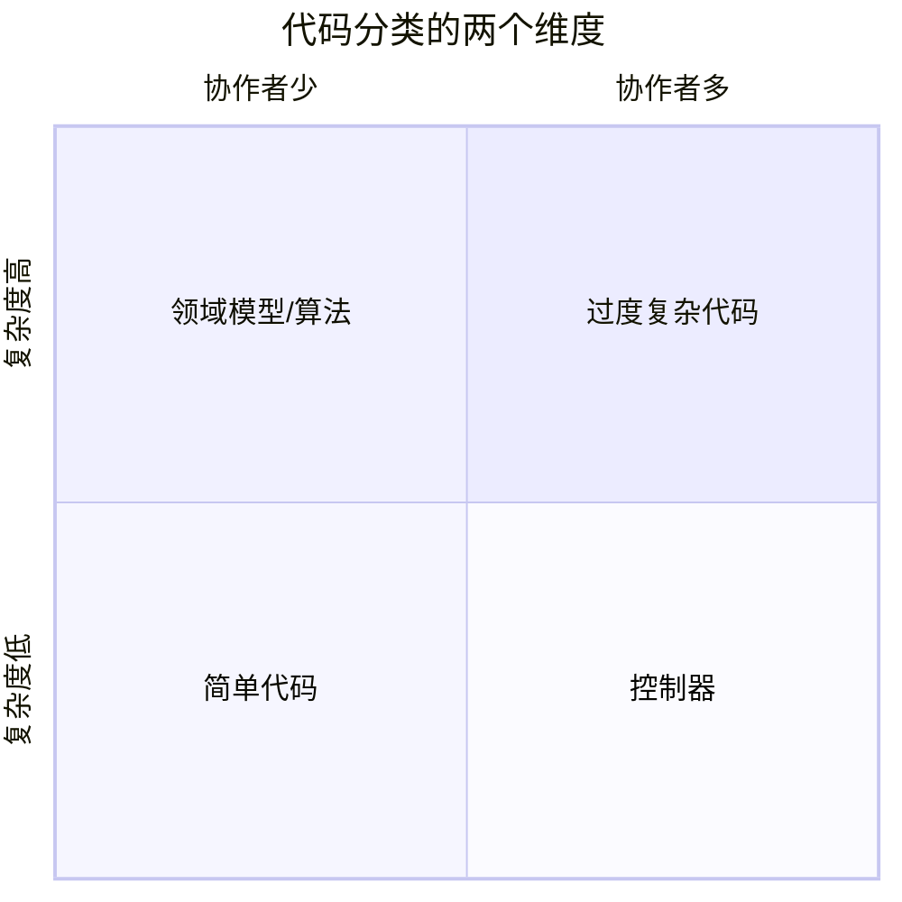

*图 7.1* 代码分类的两个维度

**维度一：复杂度与领域重要性**

- **高**：包含复杂业务规则、算法、领域逻辑
- **低**：简单 CRUD、数据传递、胶水代码

**维度二：协作者数量**

- **少**：仅依赖少量其他类或进程内对象
- **多**：依赖数据库、消息总线、外部 API 等大量进程外服务

这两个维度形成四个象限：

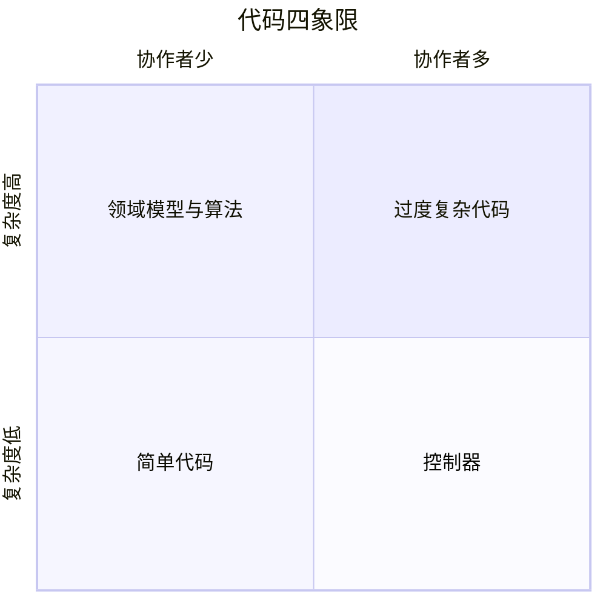

*图 7.2* 代码四象限

| 象限 | 特征 | 测试策略 |
|------|------|----------|
| **1. 领域模型与算法** | 高复杂度，少协作者 | ✅ **大量单元测试**——核心价值所在 |
| **2. 简单代码** | 低复杂度，少协作者 | ❌ **不测试**——投入产出比极低 |
| **3. 控制器** | 低复杂度，多协作者 | ⚠️ **少量集成测试**——验证编排与边界 |
| **4. 过度复杂代码** | 高复杂度，多协作者 | 🔧 **先重构**——不应存在此类代码 |

::: tip 核心原则
代码不能同时既「深」又「宽」。若业务逻辑与大量依赖纠缠在一起，必须先**拆分**，再针对领域层编写单元测试。

:::

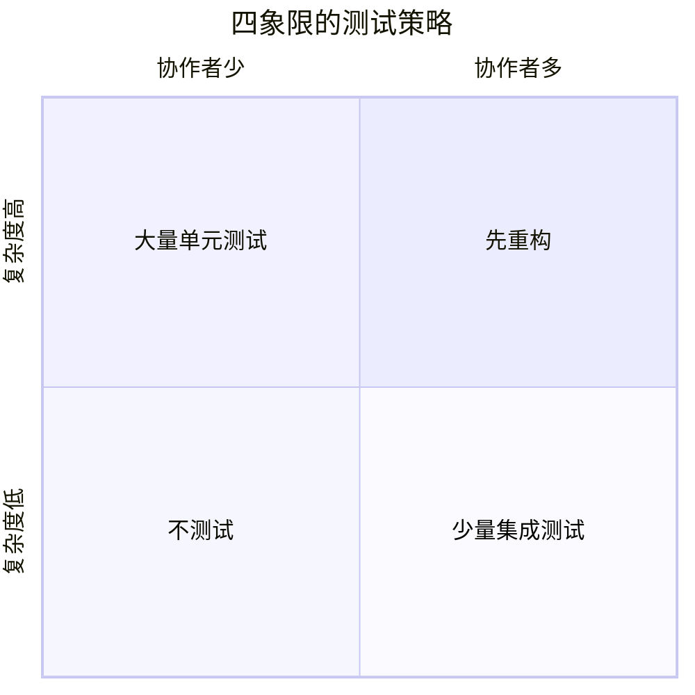

*图 7.3* 四象限的测试策略

---

### 7.1.2 使用 Humble Object 模式拆分过度复杂代码

**Humble Object 模式**将难以测试的代码与业务逻辑分离：

1. **可测试部分**：纯领域逻辑，无进程外依赖，易于单元测试
2. **谦逊部分**：薄控制器/适配器，仅负责编排与 I/O，用集成测试覆盖

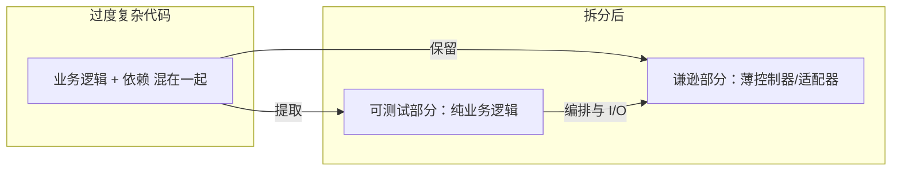

*图 7.4* Humble Object 模式：将业务逻辑与依赖分离

::: tip 实践要点
- 从过度复杂代码中**提取**业务逻辑到独立的领域类
- 控制器变为**薄编排器**：加载数据 → 调用领域 → 持久化/发送消息
- 领域类**不依赖** Database、MessageBus 等进程外服务

:::

---

## 7.2 重构以获得有价值的单元测试

### 7.2.1 引入客户管理系统（CRM）

我们通过一个 CRM 系统的重构案例，展示从「难以测试」到「易于测试」的完整过程。

**领域模型**：

- **User**：`Name`、`Email`、`Type`（Customer / Employee）、`EmailChangedEventsCount`
- **Company**：`DomainName`、`NumberOfEmployees`

**业务规则**：用户修改邮箱时，若新邮箱域名与公司域名一致，则用户类型变为 Employee；否则变为 Customer。同时需要记录邮箱变更事件数量。

**基础设施**：

- **Database**：存储用户与公司
- **MessageBus**：发送通知

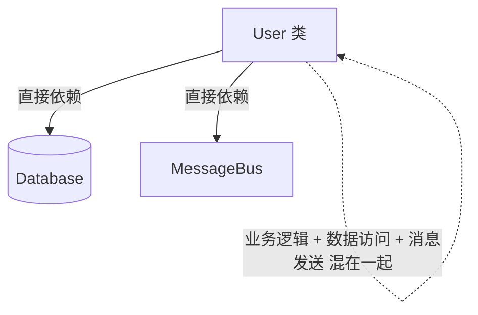

*图 7.5* CRM 系统初始结构

---

### 7.2.2 第一次尝试：将隐式依赖显式化

**问题**：`User` 内部直接使用 `Database` 和 `MessageBus`，难以测试。

**改进**：通过构造函数注入依赖，使依赖显式化。

```csharp
public class User
{
    private readonly Database _database;
    private readonly MessageBus _messageBus;

    public User(Database database, MessageBus messageBus)
    {
        _database = database;
        _messageBus = messageBus;
    }

    public void ChangeEmail(string newEmail, string companyDomain)
    {
        // 业务逻辑 + 数据库访问 + 消息发送 混在一起
        var company = _database.GetCompanyByDomain(companyDomain);
        // ...
    }
}
```

::: warning 仍存在问题
依赖虽已显式，但 `User` 仍同时承担**业务逻辑**与**协作者调用**。它既「深」又「宽」，属于第四象限，应先重构。

:::

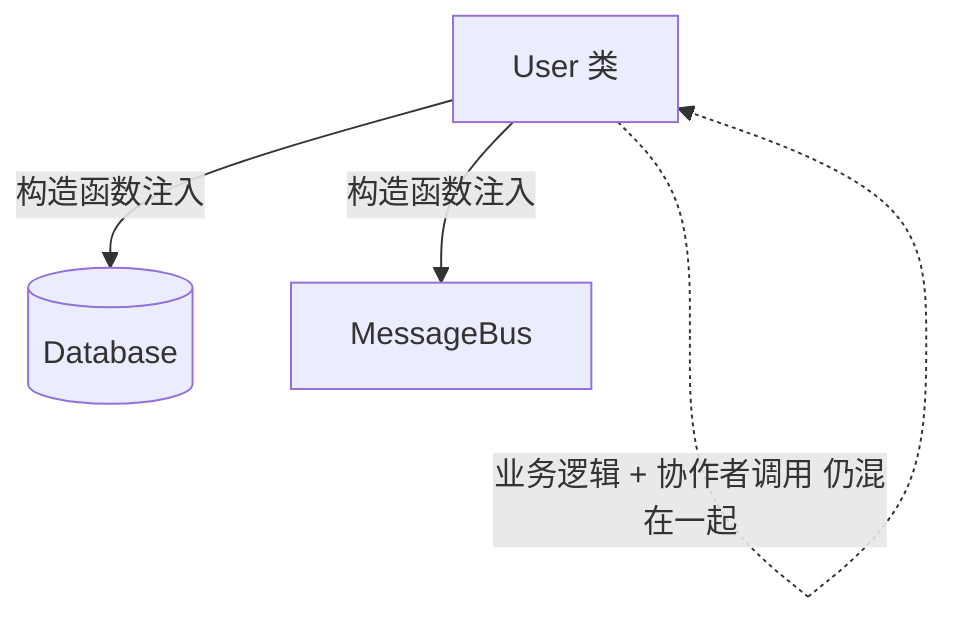

*图 7.6* Take 1：依赖显式化，但 User 仍过度复杂

---

### 7.2.3 第二次尝试：引入应用服务层

**改进**：将 Database 和 MessageBus 移到 `UserController`，`User` 只负责业务逻辑。

```csharp
public class UserController
{
    private readonly Database _database;
    private readonly MessageBus _messageBus;

    public void ChangeEmail(int userId, string newEmail)
    {
        var user = _database.GetUserById(userId);
        var company = _database.GetCompanyById(user.CompanyId);

        user.ChangeEmail(newEmail, company.DomainName);

        _database.Save(user);
        _messageBus.SendEmailChangedMessage(userId, user.Email);
    }
}

public class User
{
    public void ChangeEmail(string newEmail, string companyDomain)
    {
        // 纯业务逻辑，但...
    }
}
```

::: info 遗留问题
`User.ChangeEmail` 若需要 `Company` 的更多信息（如员工数量），可能仍需从某处获取。若 `User` 内部再依赖 Database，则又回到第四象限。

:::

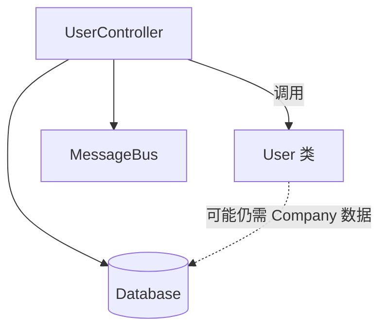

*图 7.7* Take 2：应用服务层，User 仍可能依赖数据访问

---

### 7.2.4 第三次尝试：从应用服务中移除复杂度

**改进**：将 `Company` 作为参数传入 `User.ChangeEmail`，`User` 不再依赖 Database。

```csharp
public class UserController
{
    public void ChangeEmail(int userId, string newEmail)
    {
        var user = _database.GetUserById(userId);
        var company = _database.GetCompanyById(user.CompanyId);

        user.ChangeEmail(newEmail, company);  // 传入 Company 对象

        _database.Save(user);
        _messageBus.SendEmailChangedMessage(userId, user.Email);
    }
}

public class User
{
    public void ChangeEmail(string newEmail, Company company)
    {
        // 纯业务逻辑，无进程外依赖
        if (newEmail == Email) return;

        var newType = company.IsEmailCorporate(newEmail) ? UserType.Employee : UserType.Customer;
        // ... 更新 Email, Type, EmailChangedEventsCount
    }
}
```

::: warning 控制器中的条件逻辑
控制器仍需判断：若邮箱已变更，则保存并发送消息。这类条件逻辑会增加控制器的复杂度和测试难度。

:::

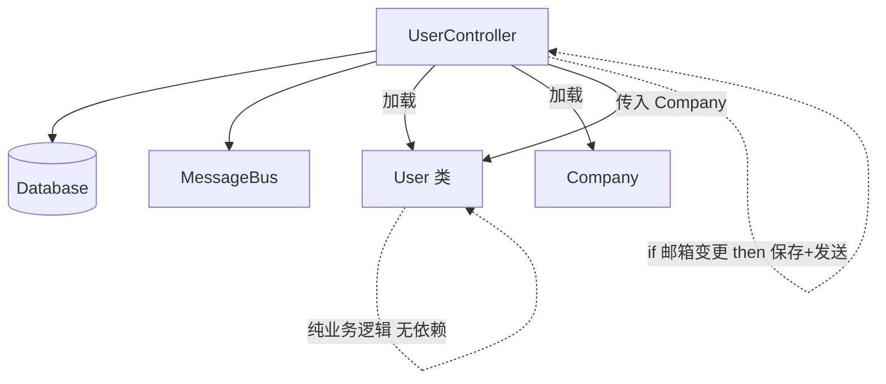

*图 7.8* Take 3：User 无依赖，但控制器仍有条件逻辑

---

### 7.2.5 第四次尝试：引入新的 Company 类

**改进**：

1. **Company** 成为真正的领域类，包含 `ChangeNumberOfEmployees` 等行为
2. **User.ChangeEmail** 返回产生的领域事件数量（或事件列表），由控制器决定是否持久化与发送消息
3. **控制器**变为薄编排器：调用领域 → 根据返回值执行 I/O

```csharp
public class UserController
{
    public void ChangeEmail(int userId, string newEmail)
    {
        var user = _database.GetUserById(userId);
        var company = _database.GetCompanyById(user.CompanyId);

        int numberOfEvents = user.ChangeEmail(newEmail, company);

        _database.Save(user);
        if (numberOfEvents > 0)
        {
            _messageBus.SendEmailChangedMessage(userId, user.Email);
        }
    }
}

public class User
{
    public int ChangeEmail(string newEmail, Company company)
    {
        if (newEmail == Email) return 0;

        var newType = company.IsEmailCorporate(newEmail) ? UserType.Employee : UserType.Customer;
        // ... 更新状态
        return 1;  // 或返回事件列表
    }
}
```

::: tip 理想状态
- **User**：纯领域逻辑，无进程外依赖，可全面单元测试
- **Company**：领域类，可单元测试
- **UserController**：薄编排器，用少量集成测试覆盖

:::

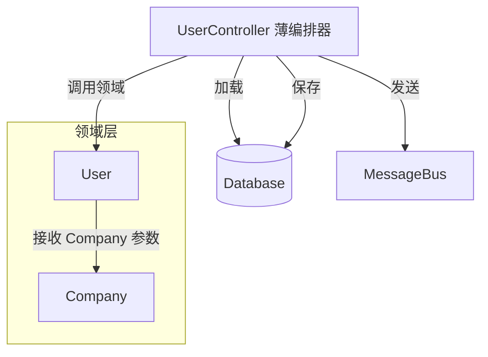

*图 7.9* Take 4：领域层纯净，控制器变薄

---

## 7.3 最优单元测试覆盖分析

### 7.3.1 测试领域层与工具代码

对 **User** 和 **Company** 应编写**全面的单元测试**：

- 修改邮箱时类型正确切换（公司域名 vs 非公司域名）
- 邮箱未变更时无副作用
- 员工数量变更对 Company 的影响
- 边界情况：空值、无效输入等

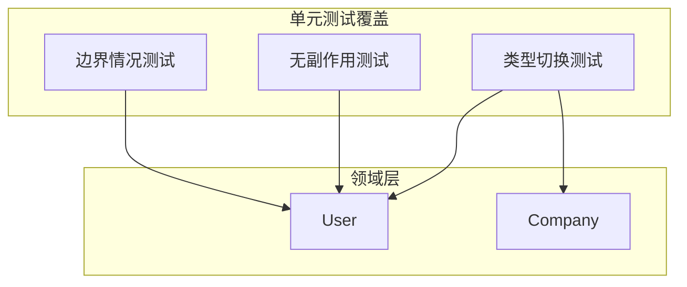

*图 7.10* 领域层：全面单元测试

---

### 7.3.2 测试其他三个象限的代码

| 象限 | 策略 |
|------|------|
| **控制器** | 少量集成测试：验证主流程、关键边界，不追求全覆盖 |
| **简单代码** | 不测试 |
| **过度复杂代码** | 重构后不应存在；若存在，先重构再测试 |

::: tip 控制器的集成测试
控制器测试应简短：验证「加载 → 调用领域 → 保存/发送」的编排正确，而非覆盖所有分支。分支逻辑应下沉到领域层。

:::

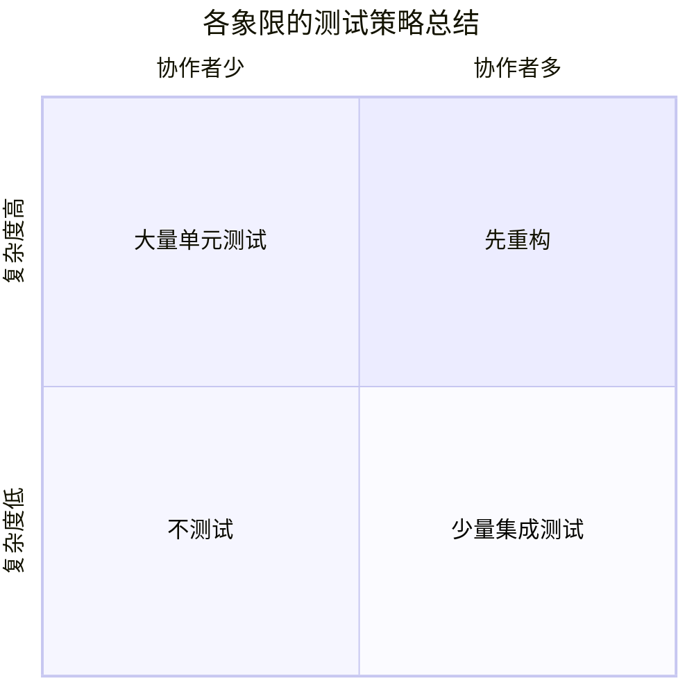

*图 7.11* 各象限的测试策略总结

---

### 7.3.3 是否应该测试前置条件？

**前置条件**（precondition）是方法入口处的校验，如参数非空、范围合法等。

::: tip 决策原则
- **领域意义重大的不变量**：应测试。例如「用户类型必须与邮箱域名一致」。
- **琐碎的前置条件**：可不测试。例如「ID 必须为正数」——若违反，异常会自然暴露。

:::

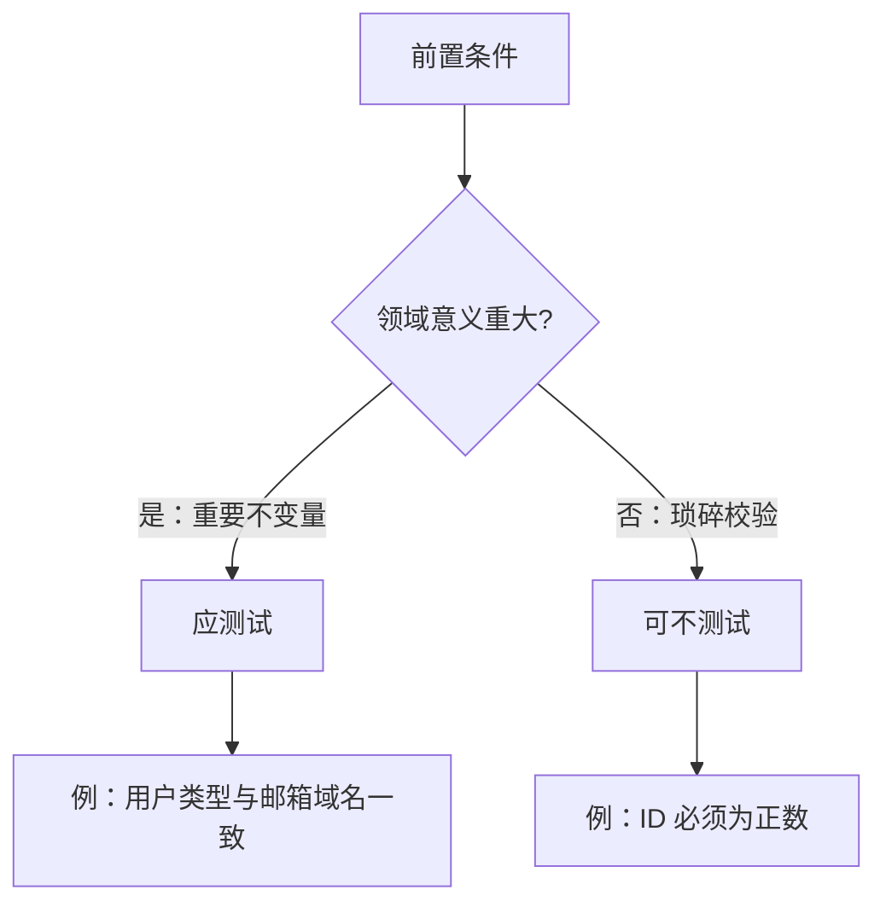

*图 7.12* 前置条件测试的决策

---

## 7.4 处理控制器中的条件逻辑

控制器中的 `if` 分支会增加复杂度和测试负担。有三种常见处理方式：

1. **将逻辑下沉到领域层**：领域方法返回足够信息，控制器仅做编排
2. **CanExecute / Execute 模式**：领域暴露 `CanChangeEmail()` 与 `ChangeEmail()`，控制器先检查再执行
3. **领域事件**：领域发出事件，控制器订阅并分发

---

### 7.4.1 使用 CanExecute / Execute 模式

领域层暴露「能否执行」与「执行」两个方法，控制器用前者消除条件判断：

```csharp
public class User
{
    public bool CanChangeEmail(string newEmail)
    {
        return newEmail != Email;
    }

    public void ChangeEmail(string newEmail, Company company)
    {
        if (!CanChangeEmail(newEmail)) return;
        // ... 业务逻辑
    }
}

public class UserController
{
    public void ChangeEmail(int userId, string newEmail)
    {
        var user = _database.GetUserById(userId);
        var company = _database.GetCompanyById(user.CompanyId);

        if (!user.CanChangeEmail(newEmail)) return;

        user.ChangeEmail(newEmail, company);
        _database.Save(user);
        _messageBus.SendEmailChangedMessage(userId, user.Email);
    }
}
```

::: tip 优势
控制器中的条件逻辑变为对 `CanChangeEmail` 的简单调用，领域逻辑集中在一处，易于测试。

:::

---

### 7.4.2 使用领域事件跟踪领域模型中的变更

**领域事件**是领域模型发出的「某事已发生」的通知。控制器订阅这些事件并执行副作用（持久化、发消息）。

```csharp
public class User
{
    private readonly List<IDomainEvent> _domainEvents = new();

    public IReadOnlyList<IDomainEvent> DomainEvents => _domainEvents;

    public void ChangeEmail(string newEmail, Company company)
    {
        if (newEmail == Email) return;

        // ... 更新状态
        _domainEvents.Add(new EmailChangedEvent(UserId, Email));
    }
}

public class UserController
{
    public void ChangeEmail(int userId, string newEmail)
    {
        var user = _database.GetUserById(userId);
        var company = _database.GetCompanyById(user.CompanyId);

        user.ChangeEmail(newEmail, company);
        _database.Save(user);

        foreach (var evt in user.DomainEvents)
        {
            _messageBus.Publish(evt);
        }
    }
}
```

::: info 领域事件与可测试性
领域事件是**进程内抽象**，不依赖 MessageBus 的具体实现。单元测试可断言 `DomainEvents` 的内容，无需 Mock 外部服务。

:::

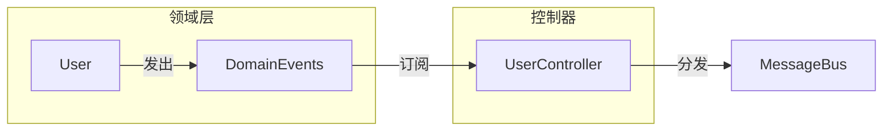

*图 7.13* 领域事件：领域发出，控制器分发

---

## 7.5 本章小结

- **代码四象限**：按复杂度与协作者数量分类，决定测试策略。领域模型与算法 → 大量单元测试；简单代码 → 不测试；控制器 → 少量集成测试；过度复杂代码 → 先重构。
- **Humble Object 模式**：将业务逻辑与依赖分离。领域层无进程外依赖，控制器做薄编排。
- **重构路径**：隐式依赖显式化 → 应用服务层 → 传入领域对象 → 领域类完整、控制器变薄。
- **条件逻辑**：优先下沉到领域；或使用 CanExecute/Execute、领域事件，减少控制器中的分支。
- **核心洞见**：代码不能既「深」又「宽」。这是 Humble Object 模式的本质。

---

## 本章要点速查

| 概念 | 要点 |
|------|------|
| **四象限** | 高复杂度+少协作者→单元测试；低+少→不测；低+多→集成测试；高+多→重构 |
| **Humble Object** | 可测试部分=领域逻辑；谦逊部分=薄控制器 |
| **CRM 重构** | User/Company 无 Database/MessageBus；控制器负责加载、调用、保存 |
| **CanExecute/Execute** | 领域暴露 CanX + X，控制器先检查再执行 |
| **领域事件** | 领域发出事件，控制器分发；进程内抽象，易测试 |

---

[← 上一章：单元测试的三种风格](ch06-styles-of-unit-testing.md) | [返回目录](../index.md) | [下一章：为什么需要集成测试？ →](../part3/ch08-why-integration-testing.md)
