# 第8章：为什么需要集成测试？

> **本章内容**
>
> - 集成测试的定义与角色
> - 测试金字塔再审视
> - 集成测试与快速失败原则
> - 受管理 vs 不受管理的进程外依赖
> - 集成测试示例：CRM 系统
> - 接口的正确使用场景
> - 集成测试最佳实践
> - 如何测试日志功能

前几章聚焦于单元测试：如何编写有价值的测试、何时使用 Mock、如何重构代码以支持测试。但仅靠单元测试不足以保护整个系统。**集成测试**验证系统与进程外依赖（数据库、消息总线、外部 API）的协作，是单元测试之外的第二道防线。本章回答：为什么需要集成测试？如何区分应直接测试的依赖？以及如何正确使用接口与日志。

---

## 8.1 什么是集成测试？

### 8.1.1 集成测试的角色

::: tip 定义
**集成测试**（Integration Test）验证被测系统与**进程外依赖**（out-of-process dependencies）的协作。它不满足单元测试的标准：触及共享状态、执行较慢，或验证多个行为。

:::

集成测试的核心价值在于：**验证系统与真实外部依赖的交互**。单元测试使用 Mock 或 Stub 替代进程外依赖，因此无法发现「与真实数据库的 SQL 不兼容」「与真实消息总线的协议错误」等问题。集成测试用真实实例（或接近真实的实例）填补这一空白。

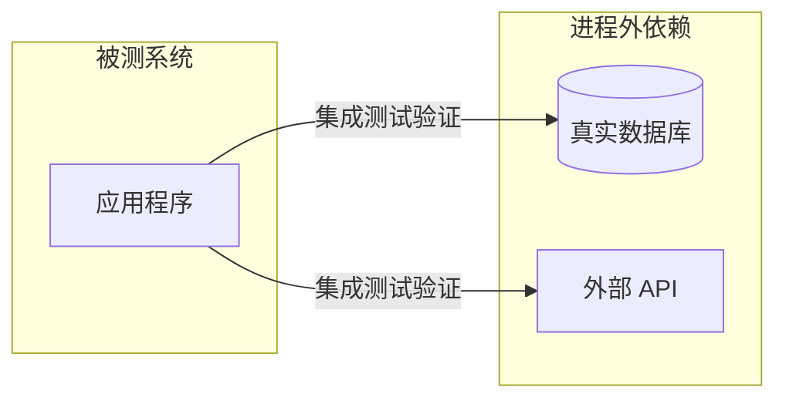

*图 8.1* 集成测试验证系统与进程外依赖的协作

::: tip 权衡
集成测试的反馈循环更长（秒级 vs 毫秒级），但能提供更强的**防回归保护**。它们是单元测试的补充，而非替代。

:::

---

### 8.1.2 测试金字塔再审视

测试金字塔将测试分为三层：

| 层级 | 数量 | 速度 | 主要覆盖 |
|------|------|------|----------|
| **单元测试** | 最多 | 最快 | 领域逻辑、算法 |
| **集成测试** | 适中 | 较慢 | 控制器 + 系统边界 |
| **端到端测试** | 最少 | 最慢 | 完整用户流程 |

```
      E2E
   /       \
  /  少     \
 /___________\
/  集成测试   \
/    适中     \
/_______________\
/   单元测试     \
/      多        \
/_________________\
```

*图 8.2* 测试金字塔

金字塔形状反映了**反馈速度**与**防回归性**之间的权衡。底层单元测试多且快，覆盖领域逻辑；中层集成测试验证控制器与数据库、消息总线等的协作；顶层端到端测试数量最少，用于验证完整流程。

::: info 金字塔形状的变体
业务逻辑较少的项目（如简单 CRUD 应用）可能呈现**矩形**甚至**倒金字塔**形状——更多集成测试、较少单元测试。这是合理的：若领域逻辑简单，单元测试的投入产出比低，集成测试反而更有价值。

:::

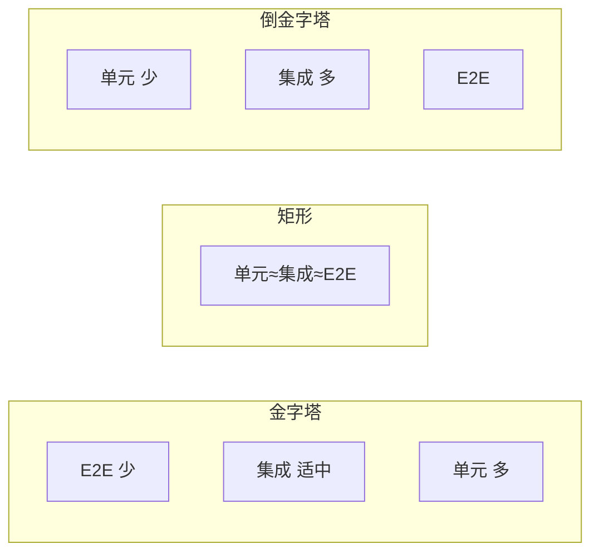

*图 8.3* 不同项目的测试形状

---

### 8.1.3 集成测试与快速失败

**快速失败**（Fail Fast）原则：错误应尽早暴露。理想情况下，启动时就能发现配置错误、连接失败等问题，而不是等到集成测试运行时才暴露。

集成测试作为**第二道防线**：若快速失败机制未覆盖某些场景（例如数据库迁移错误、消息格式不兼容），集成测试可以捕获。两者互补，共同提高系统可靠性。

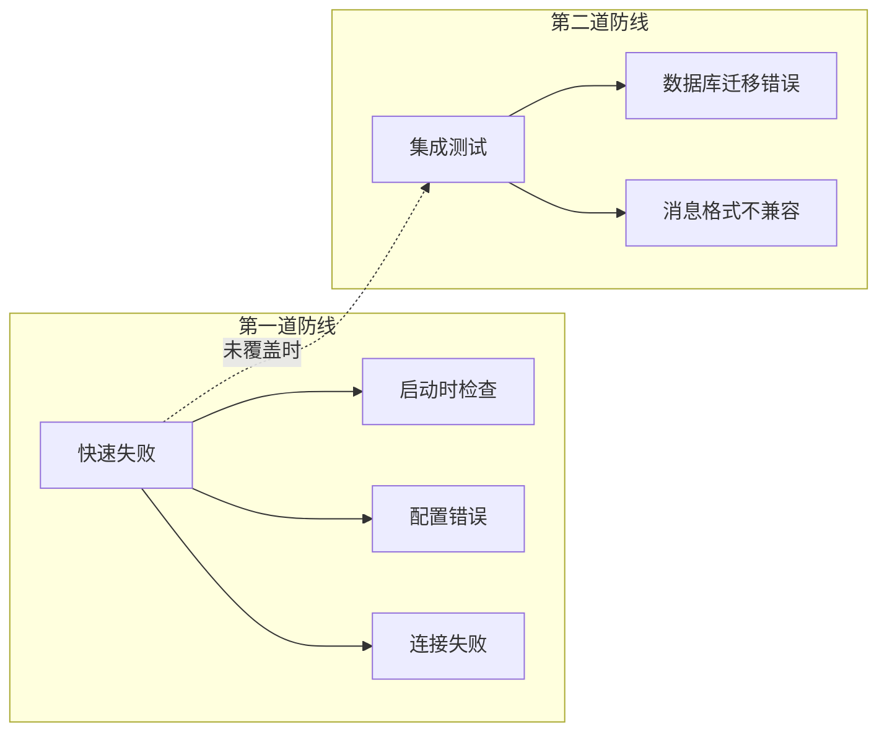

*图 8.4* 快速失败与集成测试的防线关系

---

## 8.2 应对哪些进程外依赖进行直接测试？

### 8.2.1 进程外依赖的两种类型

进程外依赖可分为两类：

| 类型 | 定义 | 示例 | 测试策略 |
|------|------|------|----------|
| **受管理的**（Managed） | 仅你的应用访问 | 应用专属数据库 | 使用**真实实例** |
| **不受管理的**（Unmanaged） | 其他应用也访问 | SMTP 服务器、消息总线、第三方 API | 使用 **Mock** |

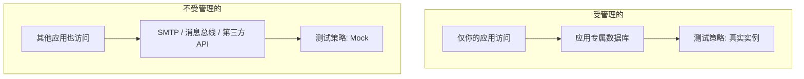

*图 8.5* 受管理 vs 不受管理的进程外依赖

**受管理依赖**：例如你的应用数据库。只有你的应用读写它，你可以完全控制其状态。在集成测试中使用真实数据库，能发现 SQL 错误、迁移问题、约束冲突等。

**不受管理依赖**：例如 SMTP 服务器、共享消息总线、第三方支付 API。其他系统也在使用，你无法在测试中随意操作。Mock 这些依赖，验证你的应用发送了正确的请求即可。

---

### 8.2.2 同时处理受管理与不受管理的依赖

典型应用同时拥有两类依赖。策略如下：

- **受管理依赖**：使用真实实例（如真实数据库）
- **不受管理依赖**：使用 Mock（如 Mock 消息总线、Mock 邮件网关）

```csharp
public class UserController
{
    private readonly Database _database;       // 受管理：真实实例
    private readonly IMessageBus _messageBus;  // 不受管理：Mock

    public UserController(Database database, IMessageBus messageBus)
    {
        _database = database;
        _messageBus = messageBus;
    }
}
```

::: tip 实践要点
集成测试 = 真实数据库 + Mock 消息总线（及其他不受管理依赖）。这样既能验证数据持久化，又能验证对外部系统的调用，且测试可控、可重复。

:::

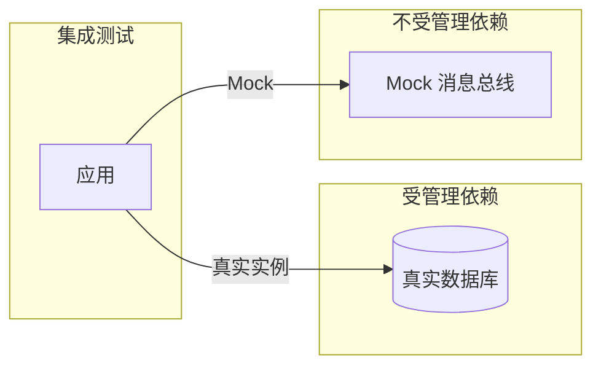

*图 8.6* 集成测试中的依赖策略

---

### 8.2.3 若无法在集成测试中使用真实数据库怎么办？

有时环境限制（如 CI 中无法启动数据库）导致无法使用真实数据库。**最后手段**：使用内存实现（如 SQLite、EF Core InMemory）。

::: warning 内存数据库的局限
内存数据库与生产数据库（如 SQL Server、PostgreSQL）在 SQL 方言、约束、事务语义上可能存在差异，可能导致**误报**（测试通过但生产失败）或**漏报**（测试失败但生产正常）。能使用真实数据库时，应优先使用。

:::

即便如此，使用内存数据库的集成测试仍优于完全不测试与进程外依赖的协作。

---

## 8.3 集成测试示例

### 8.3.1 应测试哪些场景？

集成测试应覆盖：

1. **最长快乐路径**（longest happy path）：贯穿所有进程外依赖的主流程
2. **影响重大的边界情况**：无法由单元测试覆盖、且对系统行为有显著影响的场景

不要追求覆盖每一种组合。集成测试的目的是验证**编排正确**与**边界协作**，而非替代单元测试做穷举。

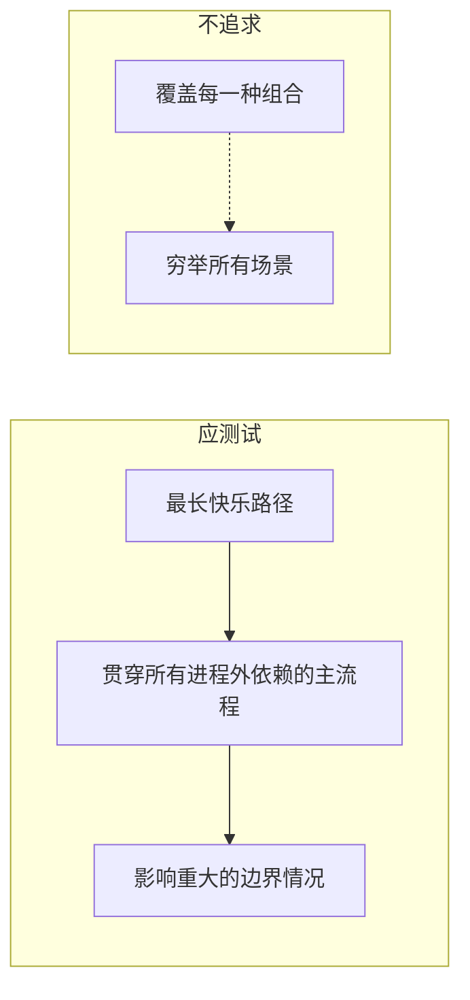

*图 8.7* 集成测试场景选择

---

### 8.3.2 数据库与消息总线的分类

沿用第 7 章的 CRM 系统：

- **Database**：受管理 → 使用真实数据库
- **MessageBus**：不受管理 → 使用 Mock

```csharp
[Fact]
public void Changing_email_from_corporate_to_non_corporate_updates_database_and_sends_message()
{
    // Arrange: 使用真实数据库
    using (var context = new CrmContext(_connectionString))
    {
        context.Users.Add(new User { Id = 1, Email = "user@mycorp.com", Type = UserType.Employee });
        context.Companies.Add(new Company { DomainName = "mycorp.com", NumberOfEmployees = 1 });
        context.SaveChanges();
    }

    var messageBusMock = new Mock<IMessageBus>();
    var sut = new UserController(_database, messageBusMock.Object);

    // Act
    sut.ChangeEmail(1, "new@gmail.com");

    // Assert: 验证数据库状态
    using (var context = new CrmContext(_connectionString))
    {
        var user = context.Users.Find(1);
        Assert.Equal("new@gmail.com", user.Email);
        Assert.Equal(UserType.Customer, user.Type);
    }

    // Assert: 验证消息总线调用
    messageBusMock.Verify(
        x => x.SendEmailChangedMessage(1, "new@gmail.com"),
        Times.Once);
}
```

---

### 8.3.3 端到端测试呢？

端到端测试验证**完整流程**，包括消息总线的真实发送。通常只需 1–2 个端到端测试作为部署后的**冒烟检查**。大多数场景由「真实数据库 + Mock 消息总线」的集成测试覆盖即可。

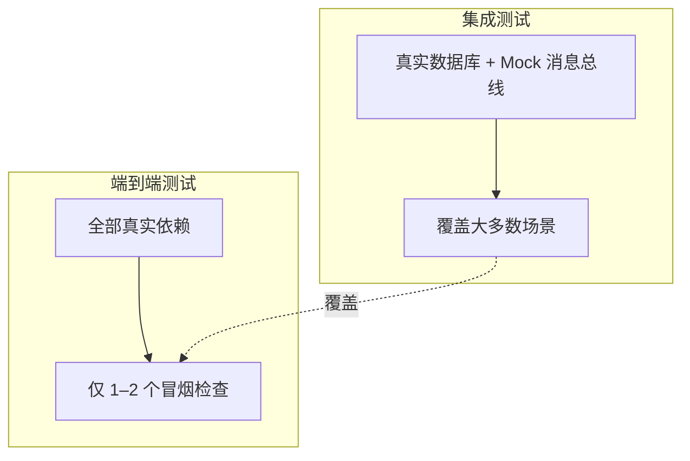

*图 8.8* 集成测试与端到端测试的关系

---

### 8.3.4 集成测试：第一次尝试

以下是 CRM 系统的集成测试结构示意：

```csharp
public class UserControllerIntegrationTests
{
    private readonly string _connectionString;
    private readonly Database _database;

    public UserControllerIntegrationTests()
    {
        _connectionString = Configuration.GetConnectionString("TestDb");
        _database = new Database(_connectionString);
        ClearDatabase();  // 每个测试开始时清理
    }

    [Fact]
    public void ChangeEmail_with_valid_input_updates_user_and_sends_message()
    {
        // Arrange
        CreateUser(1, "user@mycorp.com", UserType.Employee);
        CreateCompany("mycorp.com", 1);
        var messageBusMock = new Mock<IMessageBus>();
        var sut = new UserController(_database, messageBusMock.Object);

        // Act
        var result = sut.ChangeEmail(1, "new@gmail.com");

        // Assert
        Assert.Equal("OK", result);
        var user = GetUser(1);
        Assert.Equal("new@gmail.com", user.Email);
        Assert.Equal(UserType.Customer, user.Type);
        messageBusMock.Verify(x => x.SendEmailChangedMessage(1, "new@gmail.com"), Times.Once);
    }

    private void CreateUser(int id, string email, UserType type) { /* ... */ }
    private void CreateCompany(string domain, int employees) { /* ... */ }
    private User GetUser(int id) { /* ... */ }
    private void ClearDatabase() { /* ... */ }
}
```

::: info 测试数据生命周期
在**每个测试开始时**清理数据库，而非结束时。这样即使测试崩溃或被调试器中断，下次运行也不会受到脏数据影响。

:::

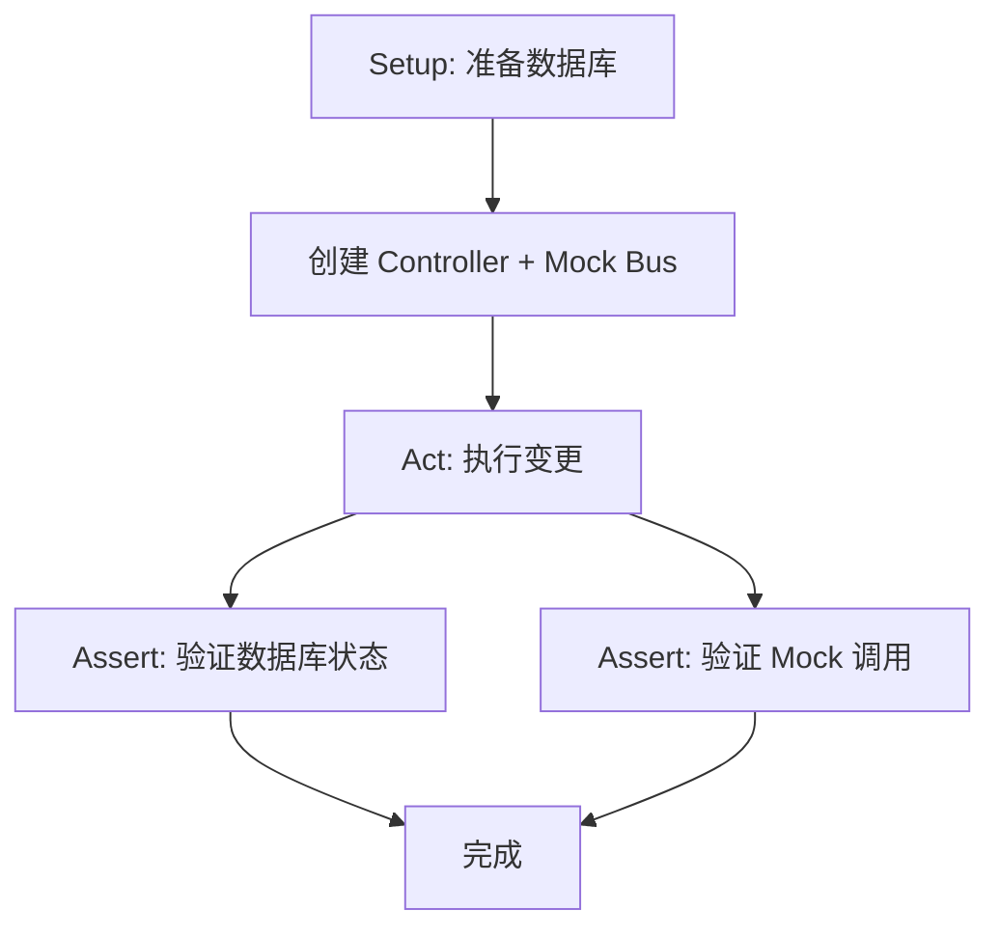

*图 8.9* CRM 集成测试结构

---

## 8.4 使用接口抽象依赖

### 8.4.1 接口与松耦合

接口提供松耦合，但**仅当存在多个实现时才有价值**。若某个抽象只有一个实现，引入接口往往是 YAGNI（You Aren't Gonna Need It）——增加复杂度而无实际收益。

---

### 8.4.2 为何对进程外依赖使用接口？

| 依赖类型 | 是否使用接口 | 原因 |
|----------|--------------|------|
| **不受管理**（消息总线、SMTP） | ✅ 是 | 需要 Mock，接口使替换成为可能 |
| **受管理**（应用数据库） | ❌ 通常不需要 | 直接使用具体类；YAGNI |

```csharp
public class UserController
{
    private readonly Database _database;       // 具体类：受管理依赖
    private readonly IMessageBus _messageBus;  // 接口：不受管理依赖，便于 Mock

    public UserController(Database database, IMessageBus messageBus)
    {
        _database = database;
        _messageBus = messageBus;
    }
}
```

::: tip YAGNI 原则
不要为「可能」的扩展提前引入接口。当真正需要第二个实现（如测试用的 Mock）时，再提取接口不迟。

:::

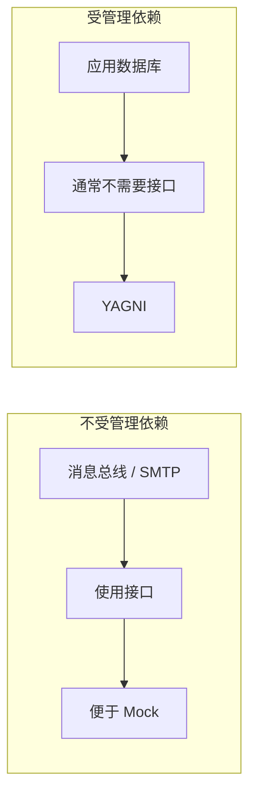

*图 8.10* 接口使用决策

---

### 8.4.3 对进程内依赖使用接口

**进程内依赖**（同一应用内的类与类之间）通常**不需要**接口。Mock 进程内依赖会泄露实现细节，导致测试脆化。领域类之间的协作应通过真实对象进行，单元测试应针对领域层，而非控制器。

---

## 8.5 集成测试最佳实践

### 8.5.1 显式化领域模型边界

将领域模型放在独立的命名空间或项目中，与应用服务、基础设施清晰分离。这样：

- 领域层不依赖进程外服务，易于单元测试
- 控制器/应用服务层负责编排，用集成测试覆盖

---

### 8.5.2 减少层次数量

保持架构层次精简：**领域 + 应用服务 + 基础设施**。过多的中间层（如多余的 Repository 抽象、Service 套 Service）会增加测试复杂度，且往往没有必要。

---

### 8.5.3 消除循环依赖

循环依赖会使测试难以编写和运行。通过**领域事件**或**中介者模式**解耦，避免 A 依赖 B、B 又依赖 A 的结构。

---

### 8.5.4 在测试中使用多个 Act 段落

在**单元测试**中，应避免多个 Act 段落（每个测试验证一个行为）。但在**集成测试**中，若多个 Act 能显著减少昂贵的 Arrange（如数据库准备），可以接受。

每个 Act 可作为下一个 Act 的 Arrange。例如：先创建用户，再修改邮箱，再验证结果。关键是：这些操作在逻辑上连贯，且测试仍然可读、可维护。

::: info 何时允许多个 Act
仅当每个 Act 自然地为下一个 Act 准备状态，且能明显减少测试运行时间时。不要为了「少写几个测试」而强行合并不相关的场景。

:::

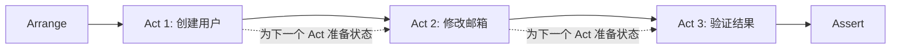

*图 8.11* 集成测试中的多个 Act

---

## 8.6 如何测试日志功能

### 8.6.1 是否应该测试日志？

| 日志类型 | 受众 | 性质 | 是否测试 |
|----------|------|------|----------|
| **支持日志**（Support logging） | 运维/支持人员 | 业务需求（可观察行为） | ✅ 是 |
| **诊断日志**（Diagnostic logging） | 开发者 | 实现细节 | ❌ 否 |

**支持日志**：例如审计日志、合规记录。客户或业务方要求系统记录「谁在何时做了什么」。这是**可观察行为**，应测试。

**诊断日志**：例如 `logger.Debug("Entering method X")`。仅用于开发调试，属于实现细节，不应测试。

---

### 8.6.2 如何测试日志？

对业务关键的日志，引入**领域专用日志接口**（如 `IDomainLogger`），在领域层或应用服务层通过该接口记录业务事件。在集成测试中 Mock `IDomainLogger`，验证关键业务事件被正确记录。

```csharp
public interface IDomainLogger
{
    void UserTypeHasChanged(int userId, UserType oldType, UserType newType);
}

public class UserController
{
    private readonly IDomainLogger _domainLogger;

    public void ChangeEmail(int userId, string newEmail)
    {
        // ...
        _domainLogger.UserTypeHasChanged(userId, oldType, newType);
    }
}
```

::: tip 结构化日志 vs 非结构化日志
若业务要求记录结构化数据（如 JSON），接口应暴露明确的参数，而非原始字符串。这样测试可以精确验证记录的内容。

:::

---

### 8.6.3 多少日志才够？

- **支持日志**：按业务和合规要求，该记的都要记
- **诊断日志**：越少越好。理想情况下仅用于未处理异常；调试完成后应删除

---

### 8.6.4 如何传递 Logger 实例？

通过**构造函数注入**或**方法参数**注入，避免使用静态/环境上下文（如 `Logger.Instance`）。这样测试可以注入 Mock，且依赖关系显式清晰。

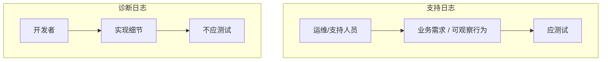

*图 8.12* 日志测试策略

---

## 8.7 本章小结

- **集成测试的角色**：验证系统与进程外依赖的协作，是单元测试的第二道防线。
- **测试金字塔**：单元测试多且快，集成测试适中且较慢，端到端测试少且最慢。业务逻辑少的项目可能有不同的形状。
- **进程外依赖分类**：受管理（仅你的应用访问）→ 使用真实实例；不受管理（其他应用也访问）→ 使用 Mock。
- **接口使用**：仅对不受管理依赖使用接口（便于 Mock）；对受管理依赖通常不需要（YAGNI）。
- **集成测试最佳实践**：显式化领域边界、减少层次、消除循环依赖、在合理情况下允许多个 Act。
- **日志测试**：支持日志（业务关键）应测试；诊断日志不应测试。通过领域专用接口注入 Logger。

---

## 本章要点速查

| 概念 | 要点 |
|------|------|
| **集成测试** | 验证与进程外依赖的协作；反馈慢但防回归强 |
| **受管理 vs 不受管理** | 受管理→真实实例；不受管理→Mock |
| **接口** | 不受管理依赖→接口；受管理依赖→通常不需要 |
| **多个 Act** | 单元测试避免；集成测试在合理时可接受 |
| **日志** | 支持日志→测试；诊断日志→不测试；通过接口注入 |

---

[← 上一章：重构迈向高价值测试](../part2/ch07-refactoring-toward-valuable-tests.md) | [返回目录](../index.md) | [下一章：Mock 最佳实践 →](ch09-mocking-best-practices.md)
