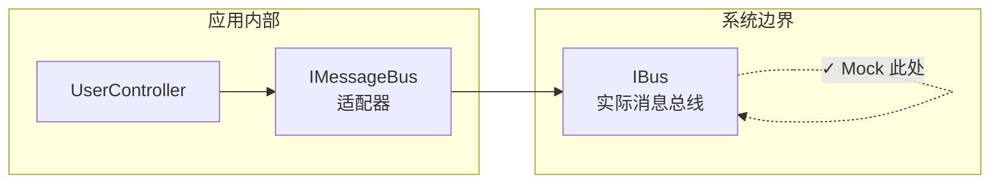

# 第9章：Mock 最佳实践

> **本章内容**
>
> - 最大化 Mock 的价值：在系统边界验证交互
> - 用 Spy 替代 Mock 框架，提升可读性
> - Mock 仅用于集成测试
> - 验证调用次数：正向与负向检查
> - 只 Mock 自己拥有的类型

第 8 章介绍了集成测试的必要性，以及如何通过接口隔离不受管理的依赖。本章深入探讨 **Mock 的最佳实践**：在何处验证、如何验证、以及如何避免常见陷阱。核心目标是：**让 Mock 验证真正有价值的行为，而非实现细节**。

---

## 9.1 最大化 Mock 的价值

继续以第 7 章的 CRM 系统为例。`UserController` 在用户修改邮箱后，会调用 `IMessageBus` 发送通知。我们使用 Mock 来验证这一交互——但**验证的层级是否正确**？

### 9.1.1 在系统边界验证交互

::: tip 核心原则
在调用链的**最外层**类型上验证交互，而非中间适配器。

:::

假设调用链如下：

```
UserController → IMessageBus → IBus（实际的消息总线）
```

- **IMessageBus**：应用内部的适配器接口，将领域事件转换为总线消息格式
- **IBus**：与外部消息总线（如 RabbitMQ、Kafka）交互的**系统边界**

若对 `IMessageBus` 进行 Mock 验证，你实际上在断言「控制器调用了 `IMessageBus.Send()`」——这是**实现细节**。若将来重构为直接使用 `IBus`，或更换适配器实现，测试会毫无必要地失败。

::: tip 正确做法
Mock **IBus**（系统边界），而非 IMessageBus（中间适配器）。验证的是**实际发送到总线的消息格式**，而非对包装器的方法调用。

:::

在调用链中越往深处 Mock，与实现细节的耦合就越强。系统边界是唯一稳定的验证点。



*图 9.1* 在系统边界验证交互

---

### 9.1.2 用 Spy 替代 Mock

**Spy**（间谍）是一种手写的 Mock：实现被测接口，记录所有调用，并提供断言方法供测试使用。

与框架 Mock（如 Moq）相比，Spy 往往**更易读**：断言逻辑集中在 Spy 类中，测试代码更简洁。

**清单 9.1** BusSpy 实现 IBus，收集消息并提供断言方法

```csharp
public class BusSpy : IBus
{
    private readonly List<object> _sentMessages = new();

    public void Send(object message)
    {
        _sentMessages.Add(message);
    }

    public void ShouldSendNumberOfMessages(int count)
    {
        Assert.Equal(count, _sentMessages.Count);
    }

    public void ShouldContainMessage<T>(Func<T, bool> predicate)
    {
        Assert.Contains(_sentMessages, m => m is T t && predicate(t));
    }
}
```

测试中使用 Spy：

```csharp
[Fact]
public void ChangeEmail_sends_email_changed_message()
{
    var busSpy = new BusSpy();
    var controller = new UserController(_database, busSpy);

    controller.ChangeEmail(userId: 1, "new@company.com");

    busSpy.ShouldSendNumberOfMessages(1);
    busSpy.ShouldContainMessage<EmailChangedMessage>(m =>
        m.UserId == 1 && m.NewEmail == "new@company.com");
}
```

::: info Spy 的优势
Spy 将「记录调用」与「断言」封装在一起，测试意图一目了然。对于复杂的验证逻辑，Spy 比框架 Mock 的 `Verify()` 更易维护。

:::

---

### 9.1.3 IDomainLogger 怎么办？

第 8 章引入了 `IDomainLogger`，用于记录领域层的重要事件。**IDomainLogger 本身就是系统边界**——日志是应用与外部可观测性系统（如日志聚合服务）的交互点。

::: tip 结论
IDomainLogger 应继续作为 Mock 目标。它与 IMessageBus/IBus 不同：日志接口直接代表「向外部输出」的边界，没有更外层的适配器需要绕过。

:::

---

## 9.2 Mock 最佳实践

### 9.2.1 Mock 仅用于集成测试

::: tip 原则
单元测试**不应**使用 Mock。单元测试针对领域模型，领域模型没有进程外依赖。

:::

只有**集成测试**才需要 Mock——用于验证应用与外部系统（消息总线、邮件服务、第三方 API）的通信是否正确。

| 测试类型 | 使用 Mock? | 原因 |
|----------|------------|------|
| **单元测试** | ❌ 否 | 领域层无进程外依赖，用真实对象或 Stub |
| **集成测试** | ✅ 是 | 需验证与外部系统的交互，用 Mock 替代不可控依赖 |

---

### 9.2.2 并非「一个测试一个 Mock」

「一个测试一个 Mock」的教条是**误导性的**。

::: tip 正确原则
一个测试应验证**一个行为单元**。该行为可能涉及**多个**外部系统。每个外部系统的交互都应被验证。

:::

例如：用户修改邮箱后，应用需要 (1) 保存到数据库，(2) 发送消息到总线，(3) 写入审计日志。若这三个都是系统边界上的可观察行为，则同一个集成测试中验证三者是合理的。

::: tip 判断标准
问自己：这些交互是否属于**同一个用例**？若是，则在一个测试中验证多个 Mock 是合理的。

:::

---

### 9.2.3 验证调用次数

验证 Mock 时，应同时进行**正向检查**和**负向检查**：

1. **正向**：预期的调用确实发生了
2. **负向**：没有发生意外的调用

```csharp
// 正向：验证 Send 被调用一次
messageBusMock.Verify(x => x.Send(It.Is<EmailChangedMessage>(
    m => m.UserId == 1 && m.NewEmail == "new@company.com")), Times.Once);

// 负向：验证没有其他调用
messageBusMock.VerifyNoOtherCalls();
```

::: warning 忽略负向检查的风险
若只验证「预期调用发生了」，而忽略「没有多余调用」，可能会漏掉副作用。例如：本应发送 1 条消息，却发送了 2 条——仅正向检查无法发现。

:::

---

### 9.2.4 只 Mock 自己拥有的类型

不要直接 Mock 第三方库的接口。

::: tip 原则
为第三方代码创建**自己的适配器/包装器**，然后 Mock 你的适配器。

:::

**原因**：

- 第三方接口可能频繁变更，直接 Mock 会导致测试脆弱
- 你的适配器可以抽象出「应用关心的操作」，隐藏库的实现细节
- 若更换第三方库，只需替换适配器实现，测试无需修改

```csharp
// 不良做法：直接 Mock 第三方接口
var smtpMock = new Mock<ISmtpClient>();  // 第三方库的类型

// 良好做法：定义自己的接口，Mock 自己的接口
public interface IEmailGateway
{
    void Send(string to, string subject, string body);
}

var emailGatewayMock = new Mock<IEmailGateway>();
```

---

## 本章小结

- **在系统边界验证**：Mock 调用链最外层的类型（如 IBus），而非中间适配器（如 IMessageBus）。越往深处 Mock，与实现细节的耦合越强。
- **Spy 可提升可读性**：手写的 Spy 实现接口、记录调用、提供断言方法，往往比框架 Mock 更易读、更易维护。
- **Mock 仅用于集成测试**：单元测试针对领域模型，无进程外依赖；集成测试才需要 Mock 外部系统。
- **多 Mock 可接受**：一个测试验证一个行为，该行为可能涉及多个外部系统，每个都应验证。
- **双向验证**：既验证预期调用发生（正向），也验证无意外调用（负向，如 `VerifyNoOtherCalls()`）。
- **只 Mock 自己的类型**：为第三方库创建适配器，Mock 适配器而非第三方接口；实现解耦与更好的抽象。

---

[← 上一章：为什么需要集成测试？](ch08-why-integration-testing.md) | [返回目录](../index.md) | [下一章：数据库测试 →](ch10-database-testing.md)
