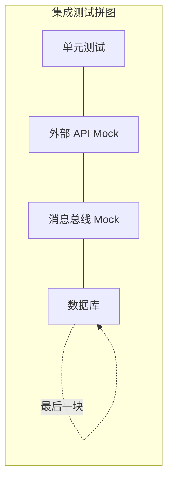
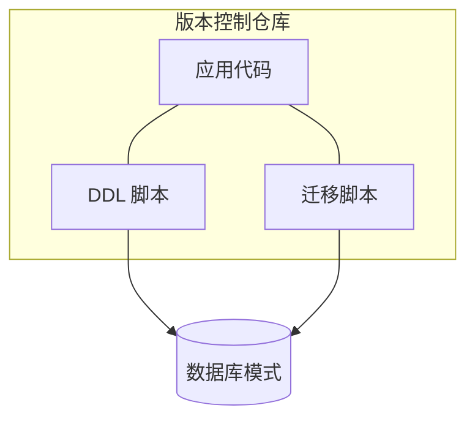
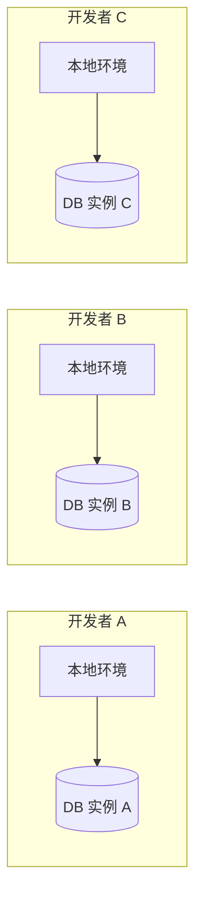
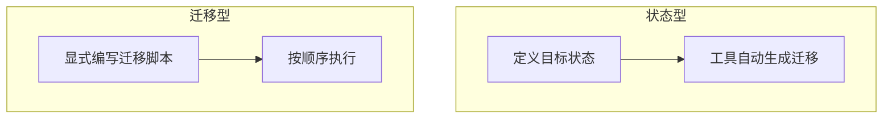
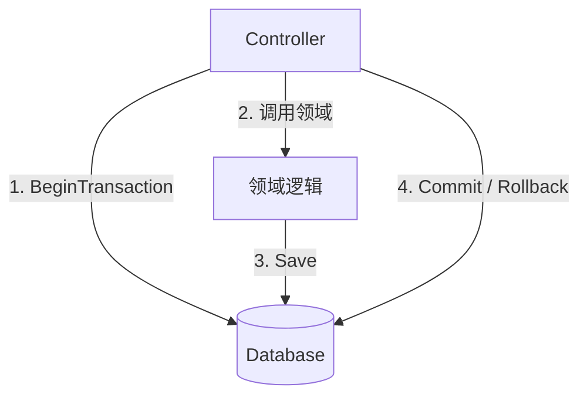
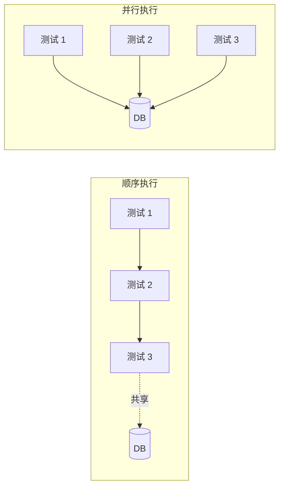
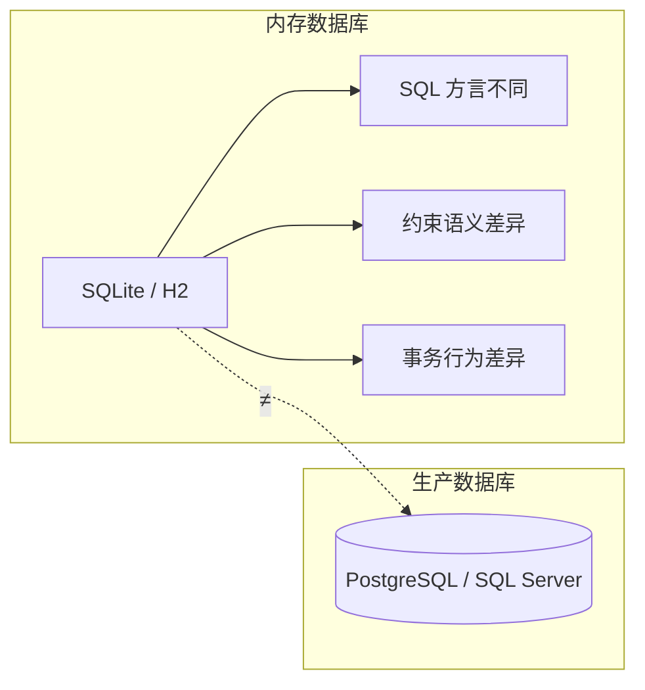
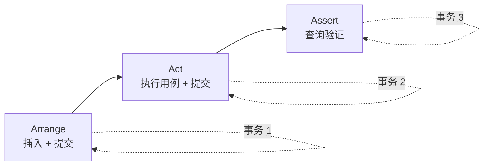

# 第10章：数据库测试

> **本章内容**
>
> - 数据库测试的前置条件
> - 数据库事务管理
> - 测试数据生命周期
> - 测试各阶段的代码复用
> - 数据库测试常见问题

集成测试的最后一块拼图是**受管理的进程外依赖**。最常见的受管理依赖是**应用数据库**——仅你的应用访问、其他应用无法触及的数据库。

对真实数据库运行测试能提供**坚如磐石的防回归保护**，但这类测试并不容易搭建。本章介绍开始测试数据库之前需要完成的前置步骤：如何跟踪数据库模式、状态型与迁移型数据库交付方式的区别，以及为何应优先选择迁移型。

掌握基础之后，你将学习如何在测试中管理事务、清理残留数据，以及通过消除无关部分、放大关键部分来保持测试精简。本章聚焦关系型数据库，但许多原则同样适用于文档型数据库甚至纯文本文件存储。



*图 10.1* 数据库测试：集成测试的最后一块拼图

---

## 10.1 数据库测试的前置条件

在开始编写数据库集成测试之前，需要满足若干前置条件。这些条件确保测试环境可控、可重复，且与生产环境一致。

---

### 10.1.1 将数据库纳入版本控制系统

::: tip 核心原则
所有模式变更应与生产代码一起纳入版本控制。

:::

数据库模式（schema）是应用的一部分。表结构、索引、约束、存储过程等应与代码库同步演进。若模式变更散落在开发者的本地环境或运维脚本中，测试将无法可靠复现生产行为。

**实践要点**：

- **DDL 脚本纳入版本控制**：建表、修改表、创建索引等 DDL 语句应作为代码库的一部分提交
- **迁移脚本纳入版本控制**：每次模式变更对应一个迁移脚本，按顺序执行
- **单一事实来源**：代码库是模式定义的唯一权威来源，而非生产数据库的当前状态

::: tip 迁移脚本的组织
将迁移脚本放在版本控制的专用目录中，按时间戳或序号命名，确保执行顺序明确。

:::



*图 10.2* 数据库模式与代码同步版本控制

---

### 10.1.2 参考数据是数据库模式的一部分

**参考数据**（reference data）包括查找表、枚举映射、配置常量等——这些数据定义应用的「合法值」和业务规则，而非运行时产生的业务数据。

::: tip 原则
参考数据应视为模式的一部分，与 DDL 一起版本化，而非运行时数据。

:::

**示例**：

- 用户类型查找表（Customer、Employee、Admin）
- 订单状态枚举映射（Pending、Shipped、Delivered）
- 国家/地区代码表
- 产品类别等静态分类

这些数据应随迁移脚本一起创建和更新。若参考数据与模式分离，测试环境可能与生产环境不一致，导致难以复现的 Bug。

::: info 参考数据 vs 业务数据
- **参考数据**：定义「什么合法」，随模式版本化
- **业务数据**：运行时产生，由测试在 Arrange 阶段创建，在测试间清理

:::

---

### 10.1.3 每位开发者拥有独立实例

::: tip 原则
每位开发者应拥有自己的数据库实例，避免相互干扰。

:::

**原因**：

- **隔离**：一个开发者的测试不会影响另一个的测试结果
- **并行**：多人可同时运行集成测试，无需等待共享资源
- **可重复性**：每个实例可独立重置、迁移，不受他人操作影响

**实现方式**：

- 本地 Docker 容器
- 云上的按开发者分配的数据库实例
- 本地安装的数据库服务（如 PostgreSQL、SQL Server 开发版）

::: warning 共享数据库的风险
若多人共享同一数据库实例，测试数据会相互污染，测试结果不可靠，且难以定位问题归属。

:::



*图 10.3* 每位开发者独立数据库实例

---

### 10.1.4 状态型 vs 迁移型数据库交付

数据库交付有两种主要方式：

| 方式 | 定义 | 特点 |
|------|------|------|
| **状态型**（State-based） | 定义期望的最终状态，由工具自动生成迁移 | 简单，但控制力弱 |
| **迁移型**（Migration-based） | 显式定义每一步迁移 | 控制力强，更适合生产 |

**状态型**：你描述「数据库最终应长什么样」，工具（如 EF Core 的迁移、Liquibase 的 diff）对比当前状态与目标状态，自动生成迁移脚本。

- **优点**：开发速度快，无需手写迁移
- **缺点**：自动生成的迁移可能包含不必要或危险的变更；对生产环境的精细控制不足

**迁移型**：你显式编写每个迁移步骤——添加列、重命名表、迁移数据等。每个迁移是独立的、可审查的脚本。

- **优点**：完全控制；迁移可针对生产环境优化；易于回滚和审计
- **缺点**：需要更多手工工作

::: tip 推荐
优先选择**迁移型**。对生产环境而言，显式迁移提供更好的可控性和可预测性。自动化工具可用于辅助生成迁移草稿，但最终应由人工审查和调整。

:::



*图 10.4* 状态型 vs 迁移型数据库交付

---

## 10.2 数据库事务管理

### 10.2.1 生产代码中的数据库事务管理

生产代码应通过**工作单元**（Unit of Work）模式管理事务边界。事务应在**应用服务层**划定，而非在单个 Repository 或更低层。

**典型结构**：

- **Database** 类：封装连接与事务，提供 `BeginTransaction()`、`Commit()`、`Rollback()`
- **Repository**：通过 Database 执行读写，不直接管理事务
- **应用服务/控制器**：在用例级别开启事务，调用多个 Repository，最后提交或回滚

```csharp
public class Database
{
    private readonly string _connectionString;
    private SqlConnection _connection;
    private SqlTransaction _transaction;

    public Database(string connectionString)
    {
        _connectionString = connectionString;
    }

    public void BeginTransaction()
    {
        _connection = new SqlConnection(_connectionString);
        _connection.Open();
        _transaction = _connection.BeginTransaction();
    }

    public void Commit()
    {
        _transaction?.Commit();
        _connection?.Close();
    }

    public void Rollback()
    {
        _transaction?.Rollback();
        _connection?.Close();
    }

    public SqlCommand CreateCommand()
    {
        var cmd = _connection.CreateCommand();
        cmd.Transaction = _transaction;
        return cmd;
    }
}

public class UserController
{
    private readonly Database _database;
    private readonly IMessageBus _messageBus;

    public void ChangeEmail(int userId, string newEmail)
    {
        _database.BeginTransaction();
        try
        {
            var user = _database.GetUserById(userId);
            var company = _database.GetCompanyById(user.CompanyId);
            user.ChangeEmail(newEmail, company);
            _database.Save(user);
            _messageBus.SendEmailChangedMessage(userId, user.Email);
            _database.Commit();
        }
        catch
        {
            _database.Rollback();
            throw;
        }
    }
}
```

::: info 事务边界
事务边界应围绕**用例**（use case）划定。一个用例内的所有数据库操作要么全部提交，要么全部回滚。

:::



*图 10.5* 生产代码中的事务管理：工作单元模式

---

### 10.2.2 集成测试中的数据库事务管理

::: tip 原则
每个测试应拥有自己的事务；测试之间不共享事务。

:::

**实践**：

- 每个测试开始时开启新事务（或新连接）
- 测试结束时提交或回滚，释放资源
- 不在测试间共享 `Database` 实例的事务状态

若测试共享事务，一个测试的未提交数据可能影响另一个测试，导致难以理解的失败和测试间的隐式依赖。

::: tip 与清理策略的关系
若在测试**开始时**清理数据（见 10.3.2），则每个测试从干净状态开始，事务管理更简单。不要在测试结束时依赖回滚来「撤销」——那样会掩盖真实的数据持久化行为。

:::

---

## 10.3 测试数据生命周期

### 10.3.1 并行 vs 顺序测试执行

**顺序执行**：测试一个接一个运行，共享同一数据库实例。实现简单，无需额外的隔离策略。

**并行执行**：多个测试同时运行，需要确保它们不会相互干扰。

::: tip 推荐
对于数据库集成测试，**顺序执行**更简单、更可靠。若需并行，可为每个测试分配独立的数据库或 schema，或使用唯一前缀隔离数据，但会增加复杂度和维护成本。

:::



*图 10.6* 顺序 vs 并行测试执行

---

### 10.3.2 测试运行间的数据清理

::: tip 核心原则
在**每个测试开始时**清理数据，而非结束时。

:::

**原因**：

- **健壮性**：若测试崩溃、被调试器中断或超时，结束时清理可能不会执行；下次运行会面对脏数据
- **可预测性**：每个测试从已知的干净状态开始，不依赖前一个测试的副作用

**清理方式**：

- 使用 `DELETE FROM` 或 `TRUNCATE` 清理所有相关表
- 按依赖顺序清理（先子表，后父表），或临时禁用外键约束
- 确保参考数据保留（若参考数据是模式的一部分，通常已在迁移中创建）

::: warning 不要用事务回滚代替清理
有些团队在测试中开启事务，测试结束后回滚，从而「撤销」所有更改。这种做法会**掩盖真实行为**：生产代码中的提交逻辑、约束检查、触发器等在回滚场景下可能未被真正执行。应让测试真实地提交数据，并在下一个测试开始时清理。

:::

```csharp
public class UserControllerIntegrationTests
{
    private readonly Database _database;

    [Fact]
    public void ChangeEmail_updates_user_in_database()
    {
        ClearDatabase();  // 每个测试开始时清理

        CreateUser(1, "user@mycorp.com", UserType.Employee);
        CreateCompany("mycorp.com", 1);

        var sut = new UserController(_database, _messageBusMock.Object);
        sut.ChangeEmail(1, "new@gmail.com");

        var user = _database.GetUserById(1);
        Assert.Equal("new@gmail.com", user.Email);
    }

    private void ClearDatabase()
    {
        _database.Execute("DELETE FROM Users");
        _database.Execute("DELETE FROM Companies");
    }
}
```

---

### 10.3.3 避免使用内存数据库

::: tip 原则
集成测试应使用与生产环境**相同的数据库引擎**，避免使用内存数据库（如 SQLite、H2）作为替代。

:::

**原因**：

- **SQL 方言差异**：不同数据库的 SQL 语法、函数、类型可能不同。在 SQLite 上通过的测试，可能在 SQL Server 上失败
- **约束与事务语义**：外键、唯一约束、隔离级别等在不同引擎间可能有细微差异
- **误报与漏报**：内存数据库可能掩盖生产环境才会暴露的问题，或反过来，在内存数据库中失败而生产正常

::: warning 内存数据库的局限
若环境限制（如 CI 无法启动真实数据库）必须使用内存数据库，应意识到其局限性。优先争取在 CI 中运行真实数据库（如 Docker 容器），再考虑内存数据库作为权宜之计。

:::



*图 10.7* 内存数据库与生产数据库的差异

---

## 10.4 测试各阶段的代码复用

### 10.4.1 Arrange 阶段的代码复用

**Object Mother 模式**：使用工厂方法创建测试数据，避免在每个测试中重复冗长的对象构建逻辑。

```csharp
public static class UserMother
{
    public static User Create(
        int id = 1,
        string email = "user@example.com",
        UserType type = UserType.Customer)
    {
        return new User
        {
            Id = id,
            Email = email,
            Type = type
        };
    }

    public static User CreateCorporate(string domain = "mycorp.com")
    {
        return Create(email: $"user@{domain}", type: UserType.Employee);
    }
}
```

::: tip 保持工厂专注
不要创建「万能」工厂，试图覆盖所有场景。为不同实体或场景创建 focused 的工厂方法。可结合 **Fluent Builder** 处理复杂对象的构建。

:::

```csharp
var user = UserBuilder.Create()
    .WithEmail("user@mycorp.com")
    .WithType(UserType.Employee)
    .WithCompany("mycorp.com")
    .Build();
```

---

### 10.4.2 Act 阶段的代码复用

可将常见的 API 调用提取为辅助方法，减少重复。

```csharp
private void ChangeUserEmail(int userId, string newEmail)
{
    _controller.ChangeEmail(userId, newEmail);
}
```

::: warning 不要隐藏被测行为
辅助方法不应掩盖「正在测试什么」。若 Act 被过度抽象，测试读者可能难以理解测试意图。保持 Act 简洁、显式；仅当多个测试共享完全相同的调用序列时再提取。

:::

---

### 10.4.3 Assert 阶段的代码复用

可创建**领域专用的断言辅助方法**，提升可读性。

```csharp
public static class UserAssertions
{
    public static void ShouldHaveEmail(this User user, string expected)
    {
        Assert.Equal(expected, user.Email);
    }

    public static void ShouldBeCustomer(this User user)
    {
        Assert.Equal(UserType.Customer, user.Type);
    }
}

// 使用
user.ShouldHaveEmail("new@gmail.com");
user.ShouldBeCustomer();
```

::: tip 流式断言
流式断言（fluent assertions）使测试意图更清晰，且便于在多个测试中复用。避免在辅助方法中隐藏关键断言逻辑。

:::

---

### 10.4.4 测试是否创建了过多数据库事务？

在集成测试中，一个测试可能触发多个数据库事务（例如：Arrange 中插入数据并提交，Act 中执行用例并提交，Assert 中再次查询）。

::: info 结论
这是可以接受的。集成测试的目的就是验证与真实数据库的交互。多个事务反映了生产中的真实行为。只要每个测试独立清理、不依赖其他测试的状态，事务数量本身不是问题。

:::



*图 10.8* 集成测试中的多个事务

---

## 10.5 数据库测试常见问题

### 10.5.1 是否应该测试读取？

| 读取类型 | 是否测试 | 原因 |
|----------|----------|------|
| **复杂读取**（含业务逻辑） | ✅ 是 | 查询中可能有过滤、聚合、排序等逻辑，值得测试 |
| **简单 CRUD 读取** | ❌ 否 | 单纯的 `SELECT * FROM Table WHERE Id = ?` 是琐碎代码，投入产出比低 |

::: tip 决策原则
若读取操作包含业务规则（如多表关联、复杂条件、计算字段），应通过集成测试验证。若仅是简单的主键查询，可依赖其他测试间接覆盖，不必单独测试。

:::

---

### 10.5.2 是否应该测试 Repository？

::: tip 核心原则
**不要**单独测试 Repository。应通过**集成测试**验证完整用例，Repository 是实现细节。

:::

**原因**：

- Repository 本身只是数据访问的封装，其正确性体现在「与数据库的协作」上
- 单独测试 Repository 等于测试实现细节：你关心的是「用户修改邮箱后，数据库中的用户记录是否正确」，而非「Repository.Save 是否被调用」
- 集成测试通过应用服务执行完整用例，自然覆盖了 Repository 的行为；若 Repository 有 Bug，集成测试会失败

**正确做法**：编写集成测试，从控制器/应用服务入口触发用例，断言数据库的最终状态。Repository 作为实现细节，不需要单独的测试类。

::: tip 测试金字塔中的位置
Repository 的「测试」应体现在集成测试中。不要为每个 Repository 方法编写独立的单元测试；那样会与实现强耦合，且无法验证与真实数据库的协作。

:::

---

## 10.6 本章小结

- **前置条件**：数据库模式纳入版本控制；参考数据作为模式的一部分；每位开发者独立实例；优先迁移型数据库交付。
- **事务管理**：生产代码使用工作单元模式，在应用服务层划定事务边界；集成测试中每个测试拥有自己的事务，不共享。
- **测试数据生命周期**：在测试**开始时**清理数据；顺序执行更简单；避免使用内存数据库，使用与生产相同的引擎。
- **代码复用**：Arrange 用 Object Mother/Builder；Act 可提取辅助方法但不隐藏被测行为；Assert 用领域专用断言；多个事务在集成测试中可接受。
- **常见问题**：复杂读取要测，简单 CRUD 读取可不测；不要单独测试 Repository，通过集成测试覆盖完整用例。

---

## 本章要点速查

| 概念 | 要点 |
|------|------|
| **版本控制** | 模式与迁移脚本纳入版本控制，与代码同步 |
| **参考数据** | 查找表、枚举映射等视为模式的一部分 |
| **独立实例** | 每位开发者独立数据库，避免相互干扰 |
| **迁移型** | 显式迁移优于状态型，控制力强、适合生产 |
| **事务** | 工作单元模式；测试间不共享事务 |
| **清理时机** | 测试**开始时**清理，不用回滚代替 |
| **内存数据库** | 避免；与生产引擎不一致可能掩盖问题 |
| **Object Mother** | Arrange 阶段工厂方法，保持专注 |
| **Repository** | 不单独测试，通过集成测试覆盖 |

---

[← 上一章：Mock 最佳实践](ch09-mocking-best-practices.md) | [返回目录](../index.md) | [下一章：单元测试反模式 →](../part4/ch11-unit-testing-anti-patterns.md)
