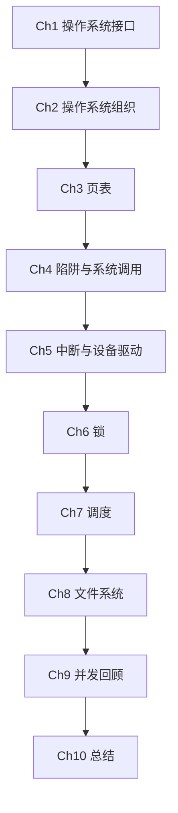

# xv6：一个简单的类 Unix 教学操作系统

> **xv6: a simple, Unix-like teaching operating system**
>
> Russ Cox, Frans Kaashoek, Robert Morris, MIT, 2022

---

## 章节路线图

---

## 目录

| # | 章节 | 链接 |
|---|------|------|
| 1 | 操作系统接口 | [→ 阅读](ch01.md) |
| 2 | 操作系统组织 | [→ 阅读](ch02.md) |
| 3 | 页表 | [→ 阅读](ch03.md) |
| 4 | 陷阱与系统调用 | [→ 阅读](ch04.md) |
| 5 | 中断与设备驱动 | [→ 阅读](ch05.md) |
| 6 | 锁 | [→ 阅读](ch06.md) |
| 7 | 调度 | [→ 阅读](ch07.md) |
| 8 | 文件系统 | [→ 阅读](ch08.md) |
| 9 | 并发回顾 | [→ 阅读](ch09.md) |
| 10 | 总结 | [→ 阅读](ch10.md) |
